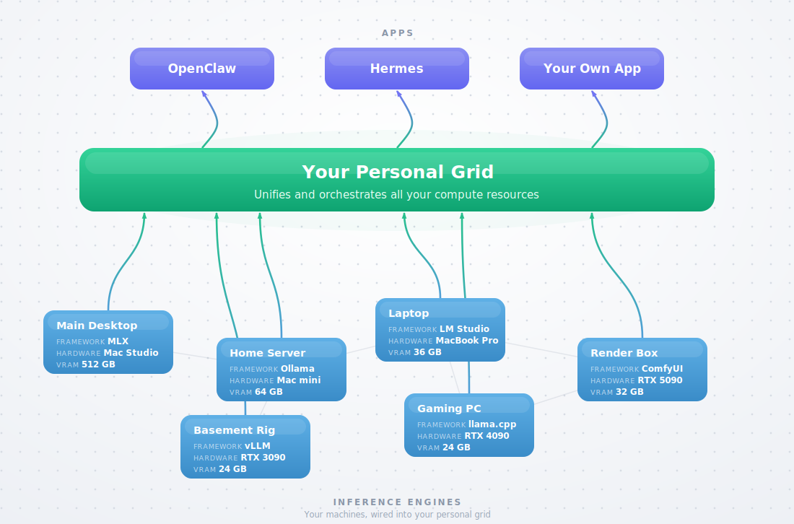

# Grid

**Grid is the orchestration layer for local AI. It unifies the inference engines you
already run into one private endpoint — and ships with two defaults so a bare machine
works out of the box.**

You already run Ollama on your Mac mini, MLX on a Mac Studio, vLLM on a GPU box,
LM Studio on a laptop, and ComfyUI somewhere else. Grid turns all of them into one
OpenAI-compatible endpoint on your LAN — you migrate nothing and learn no new engine.
Text, images, and video, same endpoint.

- **It has no engine of its own.** Grid orchestrates real engines — the ones you already
  run (Ollama, vLLM, LM Studio, MLX) and two open-source defaults it sets up for you
  (llama.cpp for text, ComfyUI for media). Stop Grid and your engines are untouched; it
  never reimplements inference or competes with the tools it runs.
- **One endpoint, every box.** Engines join a `grid_url`; apps call `grid_url/v1`.
  Grid routes each request to whichever machine serves that model.
- **Private by default.** LAN-only, no auth, in-memory registry — nothing phones home,
  nothing leaves your network.

## 60-second quickstart

You need Python 3.11+ and [uv](https://docs.astral.sh/uv/). Install the CLI:

```bash
uv tool install -e . --force   # provides the `grid` command
```

**1. Bring your grid up** — on any one machine; this is the address engines join:

```bash
grid up
# grid_url=http://192.168.1.25:8090
```

**2. Join the engines you already run** — run on each machine:

```bash
# on a Mac Studio running MLX or LM Studio
grid join http://192.168.1.25:8090

# on a GPU box running vLLM
grid join http://192.168.1.25:8090 --at http://192.168.1.20:8000/v1 -m devstral-small-2 --name gpu-4090
```

Use a grid URL explicitly when joining from another machine:

```bash
grid join http://192.168.1.25:8090 --at http://192.168.1.40:8000/v1 -m glm-4.5-air --name gpu-5090
```

> The engine has to be reachable from the machine running the grid. Use LAN addresses
> when needed: Ollama `OLLAMA_HOST=0.0.0.0`, LM Studio "Serve on Local Network",
> vLLM `--host 0.0.0.0`. Full notes in **[reference](docs/reference.md)**.

**3. Point your apps at the grid:**

```bash
grid models                             # live models across every joined engine
grid chat -m devstral-small-2 "hello"    # quick check through the grid
eval "$(grid info --env)"               # exports OPENAI_BASE_URL + OPENAI_API_KEY
```

Any OpenAI SDK now reaches every model on every machine — `gemma4-31b` can route to a
Mac Studio, `devstral-small-2` to a 4090 box, `glm-4.5-air` to a 5090 box, and
`comfyui:image_generation` to a media machine. Same endpoint, nothing migrated.

## How it works

Like an electric grid: the machines you own are the generators, your grid is the shared
supply on one address, and your apps are the homes that draw from it.



Three things, one CLI:

- **the grid** — one private endpoint that routes each request to a machine serving that
  model. Bring it up with `grid up`.
- **engines** — the tools you already run (Ollama, vLLM, LM Studio, MLX, llama.cpp,
  ComfyUI), each joined to the grid with `grid join`.
- **apps** — anything that speaks the OpenAI API, pointed at the grid's endpoint
  (`grid info` prints it).

See **[ARCHITECTURE.md](ARCHITECTURE.md)** for the full request flow and
**[docs/cli.md](docs/cli.md)** for the CLI contract.

## Grid's two default engines

Don't have Ollama or LM Studio? You don't need them. Grid ships with two open-source
engines it sets up for you — `llama.cpp` (text) and ComfyUI (media) — so a bare machine
goes from zero to a working endpoint with a couple of commands. They install on first use,
and Grid joins them to your grid like any other engine. Already running an engine you like?
Point Grid at it instead (above).

```bash
grid engine install llama.cpp                # set up the built-in text engine
grid pull qwen36-35b-a3b-mtp                 # see `grid catalog`, or any HF GGUF
grid join --serve qwen36-35b-a3b-mtp
grid chat -m qwen36-35b-a3b-mtp "hello"
```

Media (images + video) via ComfyUI:

```bash
grid engine install comfyui                  # set up the built-in media engine
grid engine pull image_generation            # also: image_editing, i2v
grid join --media --bundle image_generation
grid image "a compact walnut desk beside a sunlit window"
```

Engine setup, media, and the raw HTTP API are documented in **[docs/reference.md](docs/reference.md)**.

## Contributing

Grid is built to be easy to pick up and contribute to — start with
**[CONTRIBUTING.md](CONTRIBUTING.md)** and **[ARCHITECTURE.md](ARCHITECTURE.md)**.
Good first contributions: add a model to the catalog (`models/catalog.py`) or a
media bundle (`models/media_bundles.py`).

Local state lives under `~/.grid` (override with the `GRID_HOME` environment variable).

## License

MIT — see [LICENSE](LICENSE).
