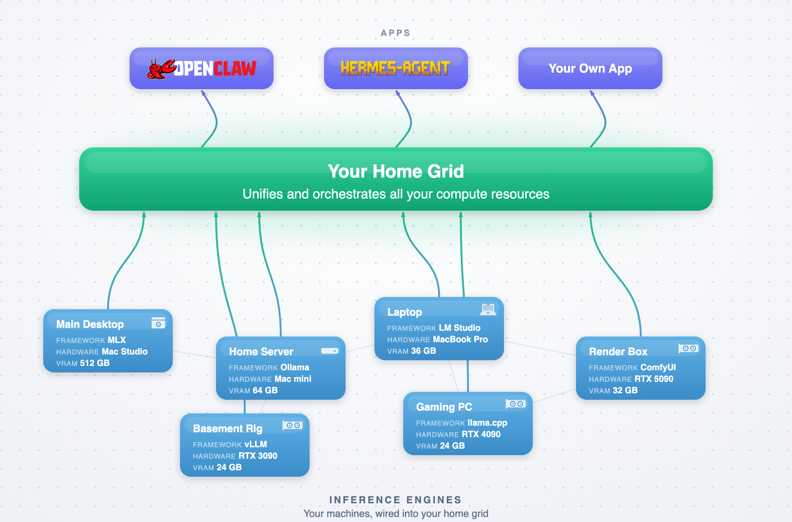

<div align="center">

# ⚡ Grid

### Orchestrate the computers you already own to run AI inference.

[](https://github.com/autonomous-ai/autonomous-grid/actions/workflows/ci.yml)
[](LICENSE)

[](#contributing)

[**Quickstart**](#quickstart) · [Two modes](#two-modes) · [How it works](#how-it-works) · [CLI reference](docs/cli.md) · [Contributing](#contributing)



</div>

Grid pools the computers you already have — your Mac, your NVIDIA desktop, the workstation in the corner — behind **one OpenAI-compatible endpoint**, and routes each request to whichever one is running the right model.

The inference servers you run (Ollama, vLLM, LM Studio, MLX, llama.cpp, ComfyUI) stay where they are — Grid just ties them together.

Run it on your **local** network, or sign in to reach your computers **remotely** through **Autonomous Relay**, our hosted connection. Same commands, two modes.

## Two modes

Grid runs in one of two **modes**, and the same verbs (`up`, `join`, `chat`, `info`) work in both:

| | **`local`** _(default)_ | **`remote`** |
|---|---|---|
| What it is | Unauthenticated, local-only proxy | Signed-in thin client to Autonomous Relay (our hosted connection) |
| Reach | Same network only | From anywhere |
| Sign-in | None | `grid login` (your account) |
| API key | `local-grid` placeholder — auth is off | Your per-grid access token |
| How requests flow | Engines poll the relay for work; apps consume through it | |

The chosen mode is persisted to **`~/.grid/state.json`**, and each mode remembers its own active grid there.
Switch any time with `grid mode local|remote`, or override a single command with `--local` / `--remote`. A computer
with no state file behaves exactly as a `local`-only install.

## Quickstart

**Install** — on each computer (macOS / Linux):

```bash
curl -fsSL https://grid.autonomous.ai/install.sh | bash
```

You get `grid` (and the `agrid` alias) on your PATH — a self-contained binary on Linux, or a
[uv](https://docs.astral.sh/uv/)-managed install on macOS. Pin a release with `GRID_VERSION=0.1.0`.
Contributors can instead clone and `uv tool install -e . --force`.

Every step below gives the **🌐 Remote** command and the **🏠 local** command.

### 1 · Choose your mode

`grid mode` writes your choice to `~/.grid/state.json` and keeps it until you switch again — so the rest of
your commands target the same mode without repeating yourself.

**🌐 Remote**
```bash
grid mode remote
# remote
# Remote mode: `grid login` to sign in, then `grid up` to bring a remote grid online …
```

**🏠 local** — the default; a fresh install is already here.
```bash
grid mode local
# local
```

### 2 · Sign in

**🌐 Remote** — sign in once with the device-code flow (opens a browser; `--no-browser` prints the code for headless computers):
```bash
grid login
# To sign in, open this URL and approve with Google:
#   https://grid.autonomous.ai/login?user_code=ABCD-1234
#   Code: ABCD-1234
# Signed in as you@example.com. 2 grid(s) available: research, team.
# Run `grid use <name>` to pick one.
```

**🏠 local** — _nothing to do._ The local proxy is unauthenticated, so there is no sign-in — skip to step 3.

### 3 · Bring a grid online

**🌐 Remote** — create (or start) a hosted grid, then make it your active one. Creating needs an explicit name:
```bash
grid up research --type permissioned-public   # --type is optional (this is the default)
grid use research
# grid=research
# grid_url=https://grid.autonomous.ai/…        ← apps reach the grid here, with your token
```
`grid ls` lists the grids your sign-in can reach; `--type permissioned-providers` restricts who may serve to it.

Invite people with `grid members add research <email>`. See [Members](docs/cli.md#members).

**🏠 local** — bring up the default `home` grid on this computer:
```bash
grid up
# grid=home
# grid_url=http://192.168.1.25:8090            ← the one address engines + apps use
```

### 4 · Add an engine

Point Grid at an inference server you already run (here, a computer running vLLM to serve `qwen3-coder`), and name it.

**🌐 Remote** — serve your local engine to the remote grid. The engine polls the relay outbound, so `--at` is its address **on this computer** (`localhost`) — no inbound port or public IP needed:
```bash
grid join research --at http://localhost:8000/v1 -m qwen3-coder --name gpu-4090
# Joining research (pid=12345) — serving the union via the relay.
# models=qwen3-coder
```

**🏠 local** — join it to the `grid_url` from step 3. Here `--at` is the engine's **local address** — the grid forwards requests to it, so it must be reachable on your network:
```bash
grid join http://192.168.1.25:8090 --at http://192.168.1.20:8000/v1 -m qwen3-coder --name gpu-4090
# Joined engine gpu-4090 to http://192.168.1.25:8090 (pid=12345)
# models=qwen3-coder
```

Add as many computers as you like — repeat `grid join` for each MLX, vLLM, or Ollama you run.

> **🌐 Remote tip:** a beefy engine can serve **several requests at once** — pass
> `--max-concurrency N` to match its batch width (llama.cpp `--parallel`, vLLM `max_num_seqs`),
> so the relay keeps it fed in parallel instead of one job at a time:
> ```bash
> grid join research --at http://localhost:8000/v1 -m qwen3-coder --max-concurrency 4
> ```
> See what each engine is serving at with `grid engines`. Defaults to 1 (serial).

### 5 · Use a model

The same `grid chat` works in both modes — a quick smoke test, and a handy daily command:

**🌐 Remote** — routed through the relay with your access token:
```bash
grid chat -m qwen3-coder "write a haiku about local GPUs"
```

**🏠 local** — routed straight through the local proxy:
```bash
grid chat -m qwen3-coder "write a haiku about local GPUs"
```

> **🏠 local tip:** see every model across every joined computer with `grid models --verbose`:
> ```text
> MODEL        ENGINE      WHERE
> qwen3-coder  gpu-4090    http://192.168.1.20:8000/v1
> gemma4-31b   mac-studio  http://192.168.1.10:8080/v1
> ```
> Two computers, two frameworks — one endpoint serves both. (The same `grid models` and `grid engine ls` now work for remote grids too — `grid models --verbose` shows each model's engine and where it runs.)

### 6 · Point your apps at the grid

`grid info --env` prints copy-pasteable `OPENAI_*` exports for whichever mode you're in:

**🌐 Remote** — the relay base URL and your real per-grid token (the grid must be up):
```bash
grid info --env
# export OPENAI_BASE_URL="https://grid.autonomous.ai/relay/v1"
# export OPENAI_API_KEY="<your access token>"
```

**🏠 local** — the local endpoint and a placeholder key (auth is off on your local network):
```bash
grid info --env
# export OPENAI_BASE_URL="http://192.168.1.25:8090/v1"
# export OPENAI_API_KEY="local-grid"
```

Wire those two values — `OPENAI_BASE_URL` and `OPENAI_API_KEY` — into any OpenAI-compatible client.
The examples below use the local values; remote users paste their relay URL and token instead.

**OpenClaw** — add Grid as a provider in `~/.openclaw/openclaw.json` ([docs](https://docs.openclaw.ai/concepts/model-providers)):

```json
{
  "agents": { "defaults": { "model": { "primary": "grid/qwen3-coder" } } },
  "models": {
    "providers": {
      "grid": {
        "baseUrl": "http://192.168.1.25:8090/v1",
        "apiKey": "local-grid",
        "api": "openai-completions",
        "models": [{ "id": "qwen3-coder", "name": "Qwen3 Coder (via Grid)" }]
      }
    }
  }
}
```

**Hermes** — set the endpoint in `~/.hermes/config.yaml` ([docs](https://hermes-agent.nousresearch.com/docs/user-guide/configuration)):

```yaml
model:
  provider: custom
  default: qwen3-coder
  base_url: http://192.168.1.25:8090/v1
```

```bash
echo 'OPENAI_API_KEY=local-grid' >> ~/.hermes/.env     # remote: use your access token
```

**Your own app** — point any OpenAI SDK at the values from `grid info --env`:

```python
from openai import OpenAI

client = OpenAI(base_url="http://192.168.1.25:8090/v1", api_key="local-grid")
client.chat.completions.create(
    model="qwen3-coder",                # routed to the 4090 computer automatically
    messages=[{"role": "user", "content": "hello"}],
)
```

**That's it.** Every model on every computer answers at one endpoint — on your local network, or remotely. Add another computer anytime with `grid join`.

### No engine on a computer yet?

Grid ships built-in engines — `llama.cpp` for text, ComfyUI for media. Install one, pull a model, then serve it
with `grid join --serve`. `grid engine install` and `grid pull` work the same in both modes; only the grid you join
differs (a remote grid **name**, or a local **`grid_url`**).

```bash
grid engine install llama.cpp           # install the text engine (both modes)
grid pull qwen36-35b-a3b-mtp            # download a text MODEL (see `grid catalog`, or any HF GGUF)

grid join research --serve qwen36-35b-a3b-mtp                    # 🌐 remote: your grid name
grid join http://192.168.1.25:8090 --serve qwen36-35b-a3b-mtp   # 🏠 local: your grid_url
```

Media serving (ComfyUI images + video) works in **both modes** — `grid engine install` and
`grid engine pull` set up the ComfyUI engine the same way; only the grid you join and consume
from differs.

```bash
grid engine install comfyui             # install the media engine (both modes)
grid engine pull image_generation       # download a media BUNDLE (also: image_editing, i2v)
```

**🌐 Remote** — serve to your grid by **name** (the engine polls the relay), then `grid image`
routes through your active grid:
```bash
grid join research --media --bundle image_generation
grid image "a compact walnut desk beside a sunlit window"
```

**🏠 local** — serve to your **`grid_url`**, and point `grid image` at it with `--grid`:
```bash
grid join http://192.168.1.25:8090 --media --bundle image_generation
grid image "a compact walnut desk beside a sunlit window" --grid http://192.168.1.25:8090   # --grid: use-commands take the grid as a flag (positional = prompt)
```

### No GPU at all? Join with an API key

No capable hardware anywhere? A provider can still contribute capacity with just a paid **OpenAI**
account. `grid join --api openai` serves OpenAI's models to your grid under your own key — an **API
engine**, **remote only**. See what a join would serve first (no key, no network call):

```bash
grid catalog --api openai
# Models a `grid join --api openai` would serve (verified 2026-07-08):
#   openai:gpt-5.5           1,050,000 ctx   tools, vision, json, structured
#   openai:gpt-5.4-mini        400,000 ctx   tools, vision, json, structured
#   …
```

Then join. The key comes from `OPENAI_API_KEY` (or a hidden prompt) — never a command-line flag — and
is stored `0o600` for later joins; it survives `grid logout` (it's your vendor credential, not your
grid sign-in). With no `-m` you serve every whitelisted model your key can see:

```bash
export OPENAI_API_KEY=sk-…
grid join research --api openai                       # or -m openai:gpt-5.4-mini to narrow
grid chat -m openai:gpt-5.4-mini "hello from the grid"
```

Requests to `openai:*` models **leave the grid for OpenAI**, under your key and your own account's
terms — the `openai:` prefix keeps that visible in every model list. There's no grid-side spend cap;
put a budget limit on the key's OpenAI project if you want one. Full contract, key store, and rotation
in [docs/cli.md](docs/cli.md#engines).

### Don't know which model to ask for? Send `auto`

A grid's catalog is heterogeneous and shifts as engines join and leave. Instead of hardcoding a model
name, an app can send the reserved name **`auto`** and the grid picks a capable model that's free — so
requests don't queue behind a busy model while idle ones sit unused. The owner turns it on for a grid
they own and points it at a **Ranker** (any OpenAI-compatible endpoint — start with OpenAI, move to
OpenRouter or your own later):

```bash
export GRID_RANKER_API_KEY=sk-…
grid router set-ranker research 1 --base-url https://api.openai.com/v1 --model gpt-5.4-mini
grid router enable research
grid chat -m auto "summarize this file in one line"   # the grid ranks its models and picks one
```

Only a **bounded excerpt** of each request — never the full conversation — goes to the Ranker (on the
owner's key); a dead Ranker falls back to a deterministic pick, so `auto`'s availability equals the
grid's, not a vendor's. The `model` field and `X-Grid-Routed-Model` header name whichever model
actually answered. Full contract and the transparency table in
[docs/cli.md](docs/cli.md#router); rationale in [ADR 0013](docs/adr/0013-auto-routing.md).

## How it works

Grid sits **above** your computers — like an API gateway above your services, or Tailscale above
your network. Each computer runs one or more inference servers (an **engine** — Ollama, vLLM, llama.cpp,
ComfyUI); your grid is the one address everything talks through, and your apps draw from it.

- **the grid** — one endpoint that routes each request to a computer serving that model. On your **local** it's a
  local proxy you create with `grid up`; in **remote** it's a hosted grid on Autonomous Relay you bring up the
  same way after `grid login`.
- **engines** — the tools you already run. `grid join` advertises a computer's engines and heartbeats them; Grid
  never restarts or replaces them. On local they register directly with the grid; in remote they poll the relay
  outbound for work, so they serve from behind a NAT with no inbound port.
- **apps** — anything that speaks the OpenAI API. Text on `/v1/chat`, images and video on `/v1/media`.

Full request flow in **[ARCHITECTURE.md](docs/ARCHITECTURE.md)**; the complete command surface — including
membership (`grid members`) and remote grid types — in **[docs/cli.md](docs/cli.md)**.

## Contributing

Grid is small and readable by design — clone to PR in minutes.

```bash
git clone https://github.com/autonomous-ai/autonomous-grid
cd autonomous-grid
uv sync --extra dev
uv run --extra dev pytest
```

Good first PRs: add a model to the catalog (`shared/models/catalog.py`) or a media bundle
(`shared/models/media_bundles.py`). Start with **[CONTRIBUTING.md](docs/CONTRIBUTING.md)** and
**[ARCHITECTURE.md](docs/ARCHITECTURE.md)**.

Local state lives under `~/.grid` (override with `GRID_HOME`).

## License

MIT — see [LICENSE](LICENSE).
