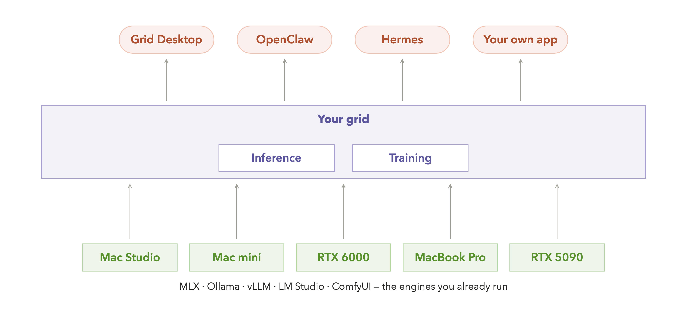

<div align="center">

# ⚡ Grid

### Inference and training on the computers you already own.

[](https://github.com/autonomous-ai/autonomous-grid/actions/workflows/ci.yml)
[](LICENSE)

[](#contributing)

[**Quickstart**](#quickstart) · [Inference](#inference) · [Training](#training) · [How it works](#how-it-works) · [CLI reference](docs/cli.md) · [Contributing](#contributing)



</div>

Grid pools the computers you already have — your Mac, your NVIDIA desktop, the workstation in the
corner — behind **one OpenAI-compatible endpoint**, and does two things with them.

**Inference.** Each request routes to whichever computer runs the right model. The inference servers
you already run — Ollama, vLLM, LM Studio, MLX, llama.cpp, ComfyUI — stay exactly where they are.
Grid only ties them together.

**Training.** The same fleet teaches a small model *your* work, and the data, the attempts and the
weights never leave your network. This belongs here rather than in a separate tool for one reason:
RL fine-tuning is roughly 75% sampling, sampling is inference, and inference is what a grid already
does. The expensive part of training is work your fleet is already good at.

Run it on your own network, or sign in to reach the same computers from anywhere through
**Autonomous Relay**, our hosted connection.

---

## Quickstart

**Install** — on each computer (macOS / Linux):

```bash
curl -fsSL https://grid.autonomous.ai/install.sh | bash
```

You get `grid` (and the `agrid` alias) on your PATH — a self-contained binary on Linux, or a
[uv](https://docs.astral.sh/uv/)-managed install on macOS. Pin a release with `GRID_VERSION=0.1.0`.
Contributors can instead clone and `uv tool install -e . --force`.

The four steps below are the **local** path — your own network, no account, nothing to sign into.
[Working from anywhere](#working-from-anywhere) is the same four steps with three commands changed.

### 1 · Start a grid

```bash
grid up
# grid=home
# grid_url=http://192.168.1.25:8090            ← the one address engines and apps use
```

### 2 · Add a computer

Point Grid at an inference server you already run — here a machine running vLLM — and name it.
`--at` is the engine's address on your network, since the grid forwards requests to it.

```bash
grid join http://192.168.1.25:8090 --at http://192.168.1.20:8000/v1 -m qwen3-coder --name gpu-4090
# Joined engine gpu-4090 to http://192.168.1.25:8090 (pid=12345)
# models=qwen3-coder
```

Repeat for each computer. No inference server on it yet? See [Bring your own engine](#bring-your-own-engine).

> A beefy engine can serve **several requests at once** — `--max-concurrency N` matches its batch
> width (llama.cpp `--parallel`, vLLM `max_num_seqs`) so it stays fed in parallel rather than one
> job at a time. Defaults to 1. `grid engines` shows what each is serving.

### 3 · Ask it something

```bash
grid chat -m qwen3-coder "write a haiku about local GPUs"
grid models --verbose
# MODEL        ENGINE      WHERE
# qwen3-coder  gpu-4090    http://192.168.1.20:8000/v1
# gemma4-31b   mac-studio  http://192.168.1.10:8080/v1
```

Two computers, two frameworks, one endpoint.

### 4 · Point your apps at it

`grid info --env` prints copy-pasteable exports for whichever mode you are in:

```bash
grid info --env
# export OPENAI_BASE_URL="http://192.168.1.25:8090/v1"
# export OPENAI_API_KEY="local-grid"
```

Wire those two values into any OpenAI-compatible client.

<details>
<summary><b>OpenClaw</b>, <b>Hermes</b>, and <b>your own code</b></summary>

**OpenClaw** — add Grid as a provider in `~/.openclaw/openclaw.json`
([docs](https://docs.openclaw.ai/concepts/model-providers)):

```json
{
  "agents": { "defaults": { "model": { "primary": "grid/qwen3-coder" } } },
  "models": {
    "providers": {
      "grid": {
        "baseUrl": "http://192.168.1.25:8090/v1",
        "apiKey": "local-grid",
        "api": "openai-completions",
        "models": [{ "id": "qwen3-coder", "name": "Qwen3 Coder (via Grid)" }]
      }
    }
  }
}
```

**Hermes** — set the endpoint in `~/.hermes/config.yaml`
([docs](https://hermes-agent.nousresearch.com/docs/user-guide/configuration)):

```yaml
model:
  provider: custom
  default: qwen3-coder
  base_url: http://192.168.1.25:8090/v1
```

```bash
echo 'OPENAI_API_KEY=local-grid' >> ~/.hermes/.env     # remote: use your access token
```

**Your own app** — point any OpenAI SDK at the values from `grid info --env`:

```python
from openai import OpenAI

client = OpenAI(base_url="http://192.168.1.25:8090/v1", api_key="local-grid")
client.chat.completions.create(
    model="qwen3-coder",                # routed to the 4090 computer automatically
    messages=[{"role": "user", "content": "hello"}],
)
```

</details>

**That's it.** Every model on every computer answers at one endpoint.

### Working from anywhere

The four steps above run on your own network. To reach the same computers from outside it, switch
to **remote** mode: engines poll Autonomous Relay outbound, so they serve from behind a NAT with no
inbound port and no public IP.

```bash
grid mode remote     # persisted to ~/.grid/state.json; --local / --remote overrides one command
grid login           # device-code flow, opens a browser; --no-browser prints the code
```

**Three commands change. Everything else — `chat`, `models`, `info`, and your apps — is identical.**

| | 🏠 local | 🌐 remote |
|---|---|---|
| **start a grid** | `grid up` | `grid up research` then `grid use research` |
| **add a computer** | `grid join <grid_url> --at <address on your network>` | `grid join research --at http://localhost:8000/v1` |
| **API key** | `local-grid` — auth is off | your per-grid token, from `grid info --env` |

Remote `--at` is `localhost` because the engine polls outbound; nothing has to reach *in*.
`grid ls` lists the grids your sign-in can reach, `--type permissioned-providers` restricts who may
serve to one, and `grid members add research <email>` invites people ([Members](docs/cli.md#members)).

---

## Inference

<p align="center">

</p>

### Bring your own engine

No inference server on a computer yet? Grid ships two — `llama.cpp` for text, ComfyUI for media.
Install, pull a model, and serve it in one join. These work the same in both modes; only the grid
you join differs (a remote **name**, or a local **`grid_url`**).

```bash
grid engine install llama.cpp           # the text engine
grid pull qwen36-35b-a3b-mtp            # a text MODEL — see `grid catalog`, or any HF GGUF
grid join <grid> --serve qwen36-35b-a3b-mtp

grid engine install comfyui             # the media engine
grid engine pull image_generation       # a media BUNDLE — also image_editing, i2v
grid join <grid> --media --bundle image_generation
grid image "a compact walnut desk beside a sunlit window"
```

On local, `grid image` needs `--grid <grid_url>` — use-commands take the grid as a flag, because
the positional argument is the prompt.

### No GPU at all? Join with an API key

A provider can contribute capacity with just a paid **OpenAI** account. `grid join --api openai`
serves OpenAI's models to your grid under your own key — an **API engine**, **remote only**. See
what a join would serve first, with no key and no network call:

```bash
grid catalog --api openai
#   openai:gpt-5.5           1,050,000 ctx   tools, vision, json, structured
#   openai:gpt-5.4-mini        400,000 ctx   tools, vision, json, structured

export OPENAI_API_KEY=sk-…
grid join research --api openai         # or -m openai:gpt-5.4-mini to narrow
```

The key comes from the environment or a hidden prompt — never a command-line flag — and is stored
`0o600`. It survives `grid logout`, being your vendor credential rather than your grid sign-in.
Requests to `openai:*` models **leave the grid for OpenAI** under your own account's terms, which
the prefix keeps visible in every model list. There is no grid-side spend cap; put a budget on the
key's OpenAI project if you want one.

**A ChatGPT subscription instead of a key?** `grid join --api codex` contributes a Codex
**subscription seat** — no API key; the CLI signs into your ChatGPT account (browser OAuth,
`--no-browser` for headless) and probes the seat and your egress IP before advertising anything.
Datacenter and VPS addresses are typically refused, so serve from a residential connection.

```bash
grid catalog --api codex        # per-tier table, offline, no sign-in
grid join research --api codex
```

`codex:*` models serve OpenAI's **Responses API** for external Codex apps — point a Codex
CLI/Desktop at your grid using `grid info --env`
([how](docs/cli.md#pointing-a-codex-app-at-your-grid-using-codex-models)); `grid chat` refuses them
with that same guidance. Jobs spend the seat's own monthly allowance.
Walkthrough: [docs/codex-quickstart.md](docs/codex-quickstart.md) · [ADR 0015](docs/adr/0015-codex-subscription-engine.md).

### Don't know which model to ask for? Send `auto`

A grid's catalog shifts as engines join and leave. Rather than hardcoding a model name, an app can
send the reserved name **`auto`** and the grid picks a capable model that is free — so requests
don't queue behind a busy model while idle ones sit unused.

```bash
grid router set-advisors openai:gpt-5-mini --grid research   # by name — no key, no URL
grid router enable --grid research
grid chat -m auto "summarize this file in one line"
```

Only a **bounded excerpt** of each request — never the full conversation — reaches the Advisor, on
the platform's key. A dead Advisor falls back to a deterministic pick, so `auto`'s availability
equals your grid's rather than a vendor's. The `model` field and the `X-Grid-Routed-Model` header
name whichever model actually answered.
Contract and transparency table in [docs/cli.md](docs/cli.md#router) · [ADR 0013](docs/adr/0013-auto-routing.md).

---

## Training

Serving is half of it. The other half is **teaching a small model your own work** — your tickets,
your repos, your deals — on the same machines, where the data, the attempts and the weights never
leave your network.

<p align="center">

</p>

Why bother, when the models you can rent are so good? Because they know nothing about you, and
waiting for a bigger general model does not fix that: the information was never on the internet to
begin with. It is sitting in your systems. What you get on the other side of that gap is an **expert
in your work rather than a generalist** — worse than the frontier at everything, better than the
frontier at your thing. That is the trade you want, because most of what your team does all day is
your thing.

```bash
grid train packs                        # ready-made setups for real business data
grid train init --pack support-replies  # tickets -> a reply-drafting model
grid train serve                        # run THIS Mac as a rollout node (Apple Silicon)
grid train run                          # the climb
grid train ui                           # watch the reward and eval curves
```

The grid generates the rollouts across its nodes, one machine holds the trainer, and the trained
LoRA adapter is pushed back to the serving nodes under a stable name — where `auto` keeps routing
to it. Inference by day, training at night, on the same hardware.

**Training needs local nodes.** API nodes (`--api openai`, `--api codex`) cannot serve rollouts:
vendors return neither the token ids they sampled nor their logprobs, and you cannot own an
improvement to a model you rent. In a **hybrid** grid that becomes the useful loop — `auto` sends
what the local model can't do yet to a frontier node, those tasks are exactly what tonight's run
consumes, and the frontier share shrinks as the local model catches up.

**Both backends train.** vLLM returns sampled ids and logprobs natively, and `grid train serve`
does it from MLX — so an all-Apple-Silicon fleet needs no CUDA and no vLLM. A trainer on one
backend can feed nodes on the other via `grid train convert-adapter`.

Try the hello world first — a complete GRPO climb in minutes, no GPU required:

```bash
python -m train.torch_grpo_hello        # any machine, CUDA or CPU
python -m train.mlx.grpo_hello          # Apple Silicon, needs: pip install mlx-lm
```

Full explainer with figures and measured curves: **[train/README.md](train/README.md)**. One Mac:
[docs/start-on-a-mac.md](docs/start-on-a-mac.md) · two machines:
[docs/two-node-training.md](docs/two-node-training.md) · which topologies make sense:
[docs/topologies.md](docs/topologies.md) · design and honest limits:
[ADR 0019](docs/adr/0019-rl-training-plane.md).

---

## How it works

Grid sits **above** your computers — like an API gateway above your services, or Tailscale above
your network. Each computer runs one or more inference servers (an **engine** — Ollama, vLLM,
llama.cpp, ComfyUI); your grid is the one address everything talks through.

- **the grid** — one endpoint that routes each request to a computer serving that model. Locally
  it's a proxy you create with `grid up`; remotely it's a hosted grid on Autonomous Relay you bring
  up the same way after `grid login`.
- **engines** — the tools you already run. `grid join` advertises a computer's engines and
  heartbeats them; Grid never restarts or replaces them. Locally they register directly with the
  grid; remotely they poll the relay outbound, so they serve from behind a NAT with no inbound port.
- **apps** — anything that speaks the OpenAI API. Text on `/v1/chat`, images and video on
  `/v1/media`.
- **the trainer** — a *consumer* of the grid, not a second control plane. It holds your tasks and
  the weights, asks the grid for completions like any other client, and pushes the adapter it
  produces back to the serving nodes.

Full request flow in **[ARCHITECTURE.md](docs/ARCHITECTURE.md)**; the complete command surface —
including membership (`grid members`) and remote grid types — in **[docs/cli.md](docs/cli.md)**.

## Contributing

Grid is small and readable by design — clone to PR in minutes.

```bash
git clone https://github.com/autonomous-ai/autonomous-grid
cd autonomous-grid
uv sync --extra dev
uv run --extra dev pytest
```

Good first PRs: add a model to the catalog (`shared/models/catalog.py`) or a media bundle
(`shared/models/media_bundles.py`). Start with **[CONTRIBUTING.md](docs/CONTRIBUTING.md)** and
**[ARCHITECTURE.md](docs/ARCHITECTURE.md)**. Figures follow **[docs/STYLE.md](docs/STYLE.md)**.

Local state lives under `~/.grid` (override with `GRID_HOME`).

## License

MIT — see [LICENSE](LICENSE).
