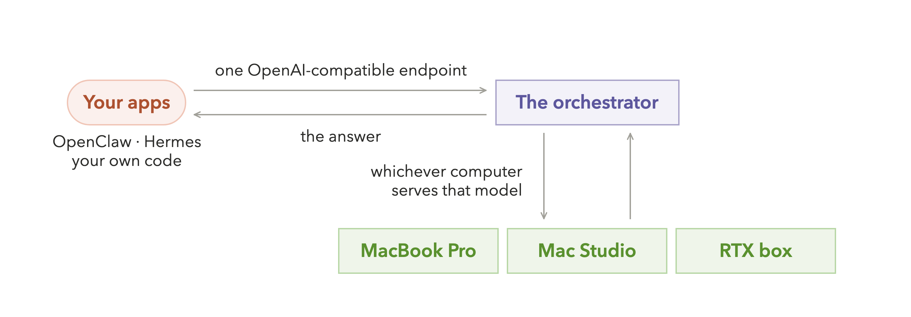

<div align="center">

# ⚡ AI Grid

### Your AI intranet: network the computers you already own for inference and training.

[](https://github.com/autonomous-ai/autonomous-grid/releases)

[**Quickstart**](#quickstart) · [From anywhere](#working-from-anywhere) · [Inference](#inference) · [Training](#training-experimental) · [How it works](#how-it-works) · [CLI reference](docs/cli.md) · [Contributing](#contributing)

https://github.com/user-attachments/assets/9573e961-423f-45ae-ada6-b7a8a361f188

</div>

**Grid** puts every computer you own behind one OpenAI-compatible endpoint, and sends each request
to whichever one runs the right model. Local by default — no account, no relay, nothing to sign
into.

If you want a desktop app instead of a terminal, get it at [autonomous.ai/grid](https://www.autonomous.ai/grid).
If your computers are in different places, start here then switch to [remote mode](#working-from-anywhere).
If you already run Ollama, vLLM or LM Studio, keep them — Grid networks them, it does not replace them.

## Install

On every computer, macOS or Linux:

```bash
curl -fsSL https://grid.autonomous.ai/install.sh | bash
```

That installs a command called `grid`. Check it with `grid --version`.

> [!TIP]
> "command not found" — open a new terminal and try again.

---

## Quickstart

Two computers: one hosts the grid, the other runs a model for it. They can be the same computer —
or more than two; add each one the same way. Follow these steps in order.

**Step 1 — the computer that will host the grid.** It only routes requests, so it does not need a
graphics card:

```bash
grid start
```
```
✓ Grid 'home' running — http://192.168.1.25:8090
```

Copy that address — the other computers join at it, and your apps send every request to it.
Lost it? `grid info` prints it again.

**Step 2 — the computer that will run a model.** A different machine from step 1:

```bash
# Install the program that runs models on this computer
grid engine install llama.cpp

# Download a model — several gigabytes, once. A repo with more than one file lists
# them and asks; press Enter to take the flagged default.
grid pull unsloth/gemma-3-4b-it-GGUF
```
```
Saved /Users/you/.grid/models/gemma-3-4b-it-Q4_K_M.gguf
Supports vision. Downloading unsloth/gemma-3-4b-it-GGUF/mmproj-F16.gguf ...
Saved /Users/you/.grid/models/gemma-3-4b-it-Q4_K_M.mmproj.gguf
```

This one also reads images — `grid pull` fetched the second file it needs for that automatically.

Now hand it to the grid. Four values, three of them yours to fill in:

```bash
grid join <grid-url> \
    --serve "<model-file>" \
    --advertise-as "<model-name>" \
    --name "<computer-name>"
```

| | what to put there |
|---|---|
| `<grid-url>` | the address step 1 printed |
| `<model-file>` | the filename `grid pull` just saved, ending `.gguf` |
| `<model-name>` | what apps will ask for — anything short and readable |
| `<computer-name>` | a label for this computer, so you can tell it apart later |

**Step 3 — back on the computer hosting the grid:**

```bash
# What the grid can answer right now
grid models

# Ask it something — the <model-name> you chose above
grid chat -m "<model-name>" "write a haiku about local GPUs"
```

**Step 4 — point your apps at it.** Anything that speaks the OpenAI API:

```bash
grid info --env
```
```
export OPENAI_BASE_URL='http://192.168.1.25:8090/v1'
export OPENAI_API_KEY='local-grid'
```

That is the whole path. Done for now? See [Stopping, leaving, deleting](#stopping-leaving-deleting).
The rest of this page explains the pieces.

### What a grid is

A model runs on one computer, and only that computer can use it.

A **grid** is a single address standing in front of several computers. Send a request there and it
goes to whichever computer holds the right model. Add a computer and its models join the pool; stop
one and the rest keep working.

- **grid** — the address apps send requests to. One computer hosts it.
- **engine** — the program that runs a model. Grid installs one for you.
- **model** — the AI itself. One file, several gigabytes, downloaded once.

Every grid has two ways to refer to it, and commands take one or the other:

| | what it looks like | what takes it |
|---|---|---|
| **grid name** | `home`, `research` | `grid start`, `grid stop`, `grid delete`, `grid use` |
| **grid url** | `http://192.168.1.25:8090` | `grid join`, and your apps |

`grid join` takes either. A third thing that looks similar but is not a grid at all: `--name` at
join time labels **the computer** you are joining, not the grid.

### Picking a model

```bash
grid catalog
```
```
Grid can pull:
  unsloth/Qwen3.6-35B-A3B-MTP-GGUF:Qwen3.6-35B-A3B-UD-IQ3_S.gguf  unsloth/Qwen3.6-35B-A3B-MTP-GGUF/Qwen3.6-35B-A3B-UD-IQ3_S.gguf (Apple Silicon, min 32 GB, language)
  unsloth/Qwen3.6-27B-MTP-GGUF:Qwen3.6-27B-UD-Q5_K_XL.gguf  unsloth/Qwen3.6-27B-MTP-GGUF/Qwen3.6-27B-UD-Q5_K_XL.gguf (NVIDIA, min 24 GB, language)
```

Each row twice: first what to pull, then the same repo and file as a path you can open on
huggingface.co. Copy the first one:

```bash
grid pull unsloth/Qwen3.6-35B-A3B-MTP-GGUF:Qwen3.6-35B-A3B-UD-IQ3_S.gguf
```
```
Downloading unsloth/Qwen3.6-35B-A3B-MTP-GGUF/Qwen3.6-35B-A3B-UD-IQ3_S.gguf ...
Saved /Users/you/.grid/models/Qwen3.6-35B-A3B-UD-IQ3_S.gguf
```

The path after `Saved` is your own home directory, not literally `/Users/you`. What matters is the
**filename** at the end — the same one already visible in the `grid catalog` line above, after the
last `/`. That filename is what `grid join --serve` needs.

**Not in the catalog?** Any GGUF repo on Hugging Face works — just the repo, nothing else:

```bash
grid pull unsloth/gemma-3-4b-it-GGUF
```

A repo like this does not hold one file — it holds the *same* model saved several times, each a
different size (that is what "quantized" means). In a real terminal you get all of them to choose
from, biggest quality, smallest download flagged as the default:

```
unsloth/gemma-3-4b-it-GGUF ships 26 files:
  1. gemma-3-4b-it-BF16.gguf
  ...
  10. gemma-3-4b-it-Q4_K_M.gguf  <- default
  ...
  15. gemma-3-4b-it-Q8_0.gguf
Pick a number [1-26], or press Enter for the default:
```

Piped or scripted (no terminal to prompt), it takes that default — `Q4_K_M`, a reasonable middle
ground. Already know which file you want? Name it in full after a `:` and there is no prompt:

```bash
grid pull unsloth/gemma-3-4b-it-GGUF:gemma-3-4b-it-Q8_0.gguf
```

Those are the only two ways: **the repo alone** and pick from the list, or **the repo plus the
exact filename**. Half of a filename (`:Q8_0`) is refused rather than guessed at — it matches
`gemma-3-4b-it-Q8_0.gguf` and `gemma-3-4b-it-UD-Q8_0.gguf` equally well, and neither is a choice
you made.

- `--advertise-as` gives the grid a short name again, so apps ask for something readable instead of
  a filename.
- Vision models need a second file. `grid pull` fetches it automatically and `--serve` finds it —
  nothing extra to type.

### Three ways to join a computer

`<grid-url>` below is the address the computer hosting the grid printed at `grid start`.

**Nothing installed on it yet** — install the engine Grid ships, download a model, then join:

```bash
grid engine install llama.cpp
grid pull unsloth/gemma-3-4b-it-GGUF
```

Then join with the filename `grid pull` just printed on its `Saved` line:

```bash
grid join <grid-url> --serve "<model-file>" --advertise-as "<model-name>"
```

`grid engine install` picks the build for that machine: Metal on macOS, Vulkan on a Linux box with
an NVIDIA card, CPU otherwise. It also says whether a faster CUDA build is possible there.

| | you get | costs you | pick it when |
|---|---|---|---|
| **Vulkan** (default on Linux) | GPU inference now | one download | you want to be running today |
| **CUDA** `--from-source` | the fastest backend | CUDA toolkit + a long compile | the box is a permanent node |

**It already runs Ollama, vLLM or LM Studio** — keep it, and point Grid at it:

```bash
grid join <grid-url> --at <engine-url> -m "<model-name>" --name "<computer-name>"
```

`<engine-url>` is where that program already listens, and `<model-name>` is a model it already
serves — Grid does not download it or start it, it only routes to it:

```bash
grid join http://192.168.1.25:8090 --at http://192.168.1.20:11434/v1 -m "qwen3-coder" --name "gpu-4090"
```

`11434` is Ollama's port; vLLM is usually `8000` and LM Studio `1234`.

**It is somewhere else** — another office, a friend's house, behind a VPN. Local mode needs every
computer on the same network, so this one needs [remote mode](#working-from-anywhere).

The engine sizes itself to whatever machine it lands on: at load it measures free memory and takes
the largest context that fits. `--ctx-size N` pins it instead. `--n-predict`, `--parallel`,
`--temp`, `--flash-attn` and `--endpoint-port` are there too — see `grid join --help`.

### Stopping, leaving, deleting

Three different commands, easy to mix up:

- **`grid leave`** — this computer stops serving. Everyone else on the grid keeps working.
- **`grid stop`** — pauses the grid itself. Nothing is lost; `grid start` brings it back exactly
  as it was.
- **`grid delete`** — removes a grid's local config for good. Cannot be undone.

```bash
# Done serving from this computer
grid leave
```
```
Left engine <computer-name> on <grid-name>.
```

Serving more than one thing from here? Say which — the `--name` you gave at join works, so does
the model it serves:

```bash
grid leave --engine "<computer-name>"
grid leave --engine "<model-name>"
grid leave --all      # everything this computer joined
```

```bash
# Pause the grid itself
grid stop
```
```
✓ Grid 'home' stopped. Its setup is kept.
```

Deleting removes a grid for good, not just pauses it — it asks to confirm first:

```bash
grid delete <grid-name>
```
```
Delete grid '<grid-name>' (ag-a1b2c3d4)? This removes its local config and cannot be undone. [y/N] y
Deleted grid '<grid-name>'.
```

A grid name with a space needs quotes: `grid delete "my grid"`.

### Running commands from another computer

`grid models` and `grid chat` need no arguments on the computer that hosts the grid. From anywhere
else, name the grid by its URL:

```bash
grid models http://192.168.1.25:8090
grid chat --grid http://192.168.1.25:8090 -m "<model-name>" "hello"
```

`No grid on this computer yet` means *this* machine has no grid set up — not that yours has stopped.

### More than one grid

Your first grid is called `home`. Pass a name to make another one:

```bash
grid start <grid-name>
```
```
✓ Grid '<grid-name>' running — http://192.168.1.25:8091
```

Starting it does not switch to it — `grid info`, `grid models` and `grid chat` still mean `home`
until you switch:

```bash
grid use <grid-name>
```

With one grid, none of this comes up.

### Pointing apps at the grid

Every app below needs the two values `grid info --env` printed: `OPENAI_BASE_URL` becomes
`baseUrl` / `base_url`, `OPENAI_API_KEY` becomes `apiKey`.

<details>
<summary><b>OpenClaw</b></summary>

Add Grid as a provider in `~/.openclaw/openclaw.json`
([docs](https://docs.openclaw.ai/concepts/model-providers)):

```json
{
  "agents": { "defaults": { "model": { "primary": "grid/<model-name>" } } },
  "models": {
    "providers": {
      "grid": {
        "baseUrl": "http://192.168.1.25:8090/v1",
        "apiKey": "local-grid",
        "api": "openai-completions",
        "models": [{ "id": "<model-name>", "name": "<model-name> (via Grid)" }]
      }
    }
  }
}
```

</details>

<details>
<summary><b>Hermes</b></summary>

Set the endpoint in `~/.hermes/config.yaml`
([docs](https://hermes-agent.nousresearch.com/docs/user-guide/configuration)):

```yaml
model:
  provider: custom
  default: <model-name>
  base_url: http://192.168.1.25:8090/v1
```

```bash
echo 'OPENAI_API_KEY=local-grid' >> ~/.hermes/.env
```

</details>

<details>
<summary><b>Your own code</b></summary>

Any OpenAI SDK works the same way:

```python
from openai import OpenAI

client = OpenAI(base_url="http://192.168.1.25:8090/v1", api_key="local-grid")
client.chat.completions.create(
    model="<model-name>",               # routed to whichever computer serves it
    messages=[{"role": "user", "content": "hello"}],
)
```

</details>

### The commands

| | |
|---|---|
| `grid start` / `grid stop` | start or stop the grid on this computer |
| `grid delete` | remove a grid's local config for good |
| `grid join` / `grid leave` | add or remove this computer from a grid |
| `grid engine install` | install the engine that runs models |
| `grid catalog` | models available to pull, and models already here |
| `grid pull` | download a model |
| `grid models` | what the grid can answer right now |
| `grid chat` | send one message |
| `grid info` | the address and key for apps |
| `grid ls` / `grid use` | list grids, pick the active one |
| `grid mode` | switch between local and remote |

`grid up` and `grid down` still work — older names for `start` and `stop`. Full reference:
[docs/cli.md](docs/cli.md).


## Working from anywhere

Local mode needs every computer on the same network. Remote mode drops that: each machine dials
out to Autonomous Relay, so it serves from behind a NAT with no inbound port and no public IP.

```bash
# Switch this computer to remote mode — remembered until you switch back
grid mode remote

# Sign in; opens a browser
grid login
```

- The mode is remembered. `--local` / `--remote` overrides one command.
- `grid login` opens a browser. `--no-browser` prints a code to type instead.
- Requests pass through our relay, which local mode never does. We forward and keep nothing — no
  stored prompts, no training on your traffic.

Three commands change. `chat`, `models`, `info` and your apps are identical.

| | 🏠 local | 🌐 remote |
|---|---|---|
| **start a grid** | `grid start` | `grid start <grid-name>` then `grid use <grid-name>` |
| **add a computer** | `grid join <grid-url> --at <engine-url>` | `grid join <grid-name> --at <engine-url>` |
| **API key** | `local-grid` — auth is off | your per-grid token, from `grid info --env` |

Remote `--at` is `localhost` because the engine dials out; nothing reaches in.

- `grid ls` — the grids your sign-in can reach
- `grid start <grid-name> --type permissioned-providers` — restrict who may serve
- `grid members add <grid-name> someone@example.com` — invite people ([Members](docs/cli.md#members))
- `grid leave` and `grid stop` work exactly like [local](#stopping-leaving-deleting). `grid delete`
  doesn't — a remote grid lives on the account that created it, not your disk. Delete it for
  everyone from the grid's page on [autonomous.ai/grid](https://www.autonomous.ai/grid) instead.

---

## Inference

<p align="center">

</p>

### Images and video

Grid ships a second engine, ComfyUI, for media:

```bash
# Install the media engine
grid engine install comfyui

# Download the model files for making images
grid engine pull image_generation

# Join this computer as a media engine
grid join http://192.168.1.25:8090 --media --bundle image_generation

# Make an image
grid image "a compact walnut desk beside a sunlit window" --grid http://192.168.1.25:8090
```

- `grid engine pull` also takes `image_editing` and `i2v`.
- `grid image` needs `--grid` on local — its positional argument is the prompt, so the grid is a flag.

### No GPU? Join with an API key

`grid join --api openai` serves OpenAI's models to your grid under your own key. Remote only.

See what a join would serve first — no key, no network call:

```bash
grid catalog --api openai
```
```
openai:gpt-5.5           1,050,000 ctx   tools, vision, json, structured
openai:gpt-5.4-mini        400,000 ctx   tools, vision, json, structured
```

```bash
# The key is read from the environment, never passed as a flag
export OPENAI_API_KEY=sk-…
grid join <grid-name> --api openai
```

- The key comes from the environment or a hidden prompt, never a flag. Stored `0o600`.
- It survives `grid logout` — it is your vendor credential, not your grid sign-in.
- Requests to `openai:*` leave the grid under your own account's terms. The prefix keeps that
  visible in every model list.
- No grid-side spend cap. Put a budget on the key's OpenAI project.

A ChatGPT subscription works instead of a key:

```bash
# See what a codex seat would serve — offline, no sign-in
grid catalog --api codex

# Sign into ChatGPT in a browser, then serve the seat
grid join <grid-name> --api codex
```

- No API key — the CLI signs into your ChatGPT account by browser OAuth (`--no-browser` for headless).
- It probes the seat and your egress IP before advertising anything. Datacenter and VPS addresses
  are typically refused, so serve from a residential connection.
- `codex:*` models serve the Responses API for external Codex apps. Point one at your grid with
  `grid info --env` ([how](docs/cli.md#pointing-a-codex-app-at-your-grid-using-codex-models));
  `grid chat` refuses them with the same guidance.
- Jobs spend the seat's own monthly allowance.

Walkthrough: [docs/codex-quickstart.md](docs/codex-quickstart.md).

### Run Claude Code on your grid

```bash
grid launch claude
```

`grid launch` starts an app already pointed at your grid.

- Endpoint, credential and model names go into that app's own process environment and nowhere else.
  Nothing exported to your shell, nothing written to a config file, nothing to undo.
- Remote only — Claude Code speaks the Anthropic Messages dialect, and only the relay translates it.
- It picks **no model for you**. Your own Claude Code config and `/model` still decide, so check
  `grid models` and point the app at a name the grid serves.

Walkthrough: [docs/claude-code-quickstart.md](docs/claude-code-quickstart.md).

### Don't know which model to ask for? Send `auto`

A grid's catalog shifts as engines join and leave. Instead of hardcoding a model name, an app can
send the reserved name `auto`, and the grid picks a capable model that is free.

```bash
# Pick the model that decides where each request goes
grid router set-advisors openai:gpt-5-mini --grid <grid-name>
grid router enable --grid <grid-name>

# Now ask for "auto" instead of a model name
grid chat -m auto "summarize this file in one line"
```

- Only a bounded excerpt of each request reaches the Advisor — never the full conversation — on the
  platform's key.
- A dead Advisor falls back to a deterministic pick, so `auto`'s availability equals your grid's
  rather than a vendor's.
- The `model` field and the `X-Grid-Routed-Model` header name whichever model actually answered.

Details in [docs/cli.md](docs/cli.md#router).

---

## Training (Experimental)

> The loop runs end to end and the measured runs in [`train/README.md`](train/README.md) are real,
> but the capture path, the gate and the MLX backend are young. The join from real outcomes back
> into tasks exists only where your app reports a verdict —
> [what is and is not built](train/README.md#not-built-yet).

<p align="center">

</p>

The models you can rent know nothing about you, and a bigger one will not fix that: the information
was never on the internet. It is in your systems. **What you get is an expert in your work rather
than a generalist — worse than the frontier at everything, better at your thing.**

```bash
# Ready-made setups for real business data
grid train packs

# Turn support tickets into a reply-drafting model
grid train init --pack support-replies

# Run this Mac as a rollout node (Apple Silicon)
grid train serve

# The climb
grid train run

# Watch the reward and eval curves
grid train ui
```

- The grid samples rollouts across its nodes; one machine holds the trainer.
- The LoRA adapter it produces goes back to the serving nodes under a stable name, where `auto`
  keeps routing to it.
- API nodes (`--api openai`, `--api codex`) cannot serve rollouts. Vendors return neither the token
  ids they sampled nor their logprobs, and you cannot own an improvement to a model you rent.
- In a hybrid grid that becomes the useful loop: `auto` sends what the local model can't do yet to
  a frontier node, those tasks are what tonight's run consumes, and the frontier share shrinks as
  the local model catches up.
- Both backends train. vLLM returns sampled ids and logprobs natively; `grid train serve` does it
  from MLX, so an all-Apple-Silicon fleet needs no CUDA. `grid train convert-adapter` moves an
  adapter between them.

A complete GRPO climb, no GPU:

```bash
# Any machine, CUDA or CPU — about six minutes
python -m train.torch_grpo_hello

# Apple Silicon, needs `pip install mlx-lm` — about one minute
python -m train.mlx.grpo_hello
```

Figures and measured curves: [train/README.md](train/README.md). One Mac:
[docs/start-on-a-mac.md](docs/start-on-a-mac.md) · two machines:
[docs/two-node-training.md](docs/two-node-training.md) · topologies:
[docs/topologies.md](docs/topologies.md).

---

## How it works

Grid sits above your computers the way an API gateway sits above services: one address in front of
many. The analogy stops there — a gateway routes by path, Grid routes by model name.

- **the grid** — one endpoint routing each request to a computer serving that model. Locally a
  proxy from `grid start`; remotely a hosted grid on Autonomous Relay after `grid login`.
- **engines** — what runs a model, yours or one Grid installed. `grid join` advertises a computer's
  engines and heartbeats them; Grid never restarts or replaces them. Locally they register with the
  grid directly, remotely they poll the relay outbound — behind a NAT, no inbound port.
- **apps** — anything speaking the OpenAI API. Text on `/v1/chat`, media on `/v1/media`.
- **the trainer** — a consumer of the grid, not a second control plane. It holds your tasks and the
  weights, asks for completions like any other client, and pushes its adapter back to the serving
  nodes.

Two things run on the same fleet: **inference**, and **training** *(experimental)* — the same
machines teaching a small model your work, where the data, the attempts and the weights never leave
your network. *Intranet* is the old word for a private network.

```bash
# What each computer serves, and how many requests it takes at once
grid engines

# Every model, and which computer answers for it
grid models --verbose
```

`engines` lists what each computer serves and how many requests it takes at once; `models` lists
every model and which computer answers for it.

Request flow: [ARCHITECTURE.md](docs/ARCHITECTURE.md). Full command surface, including membership
and remote grid types: [docs/cli.md](docs/cli.md).

## Contributing

```bash
git clone https://github.com/autonomous-ai/autonomous-grid
cd autonomous-grid

# Create the environment, with test dependencies
uv sync --extra dev

# Run the tests
uv run --extra dev pytest
```

Good first PRs: add a model to the catalog (`shared/models/catalog.py`) or a media bundle
(`shared/models/media_bundles.py`). Start with [CONTRIBUTING.md](docs/CONTRIBUTING.md) and
[ARCHITECTURE.md](docs/ARCHITECTURE.md). Figures follow [docs/STYLE.md](docs/STYLE.md).

Local state lives under `~/.grid` (override with `GRID_HOME`).

## License

MIT — see [LICENSE](LICENSE).
