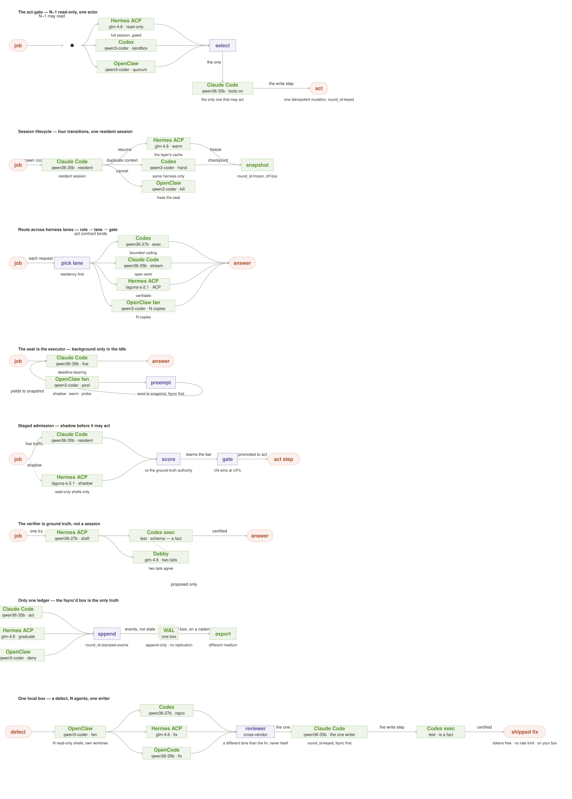
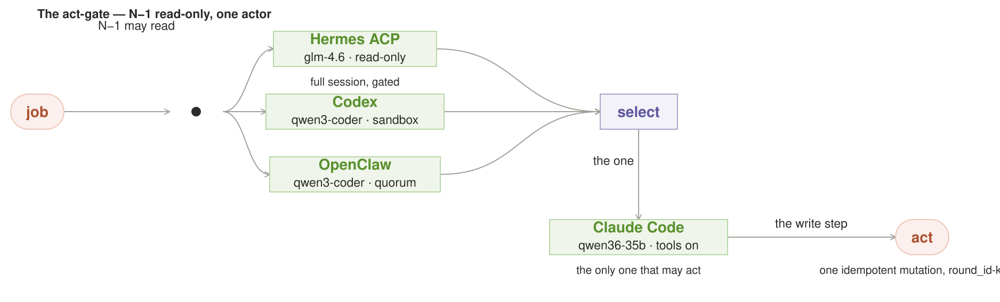
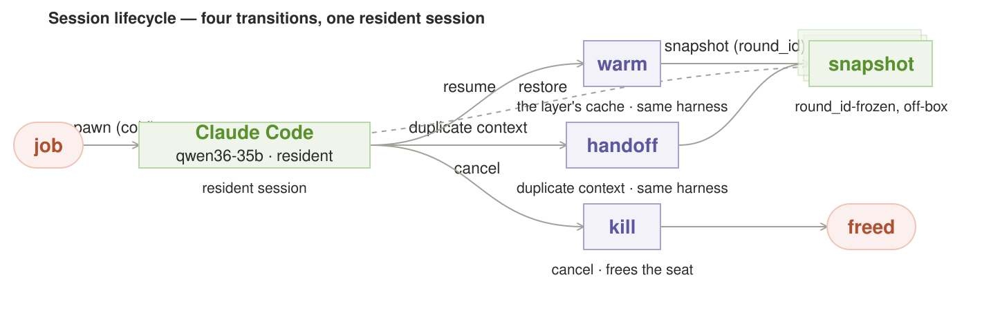
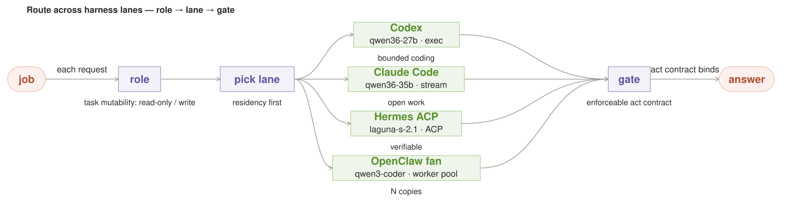
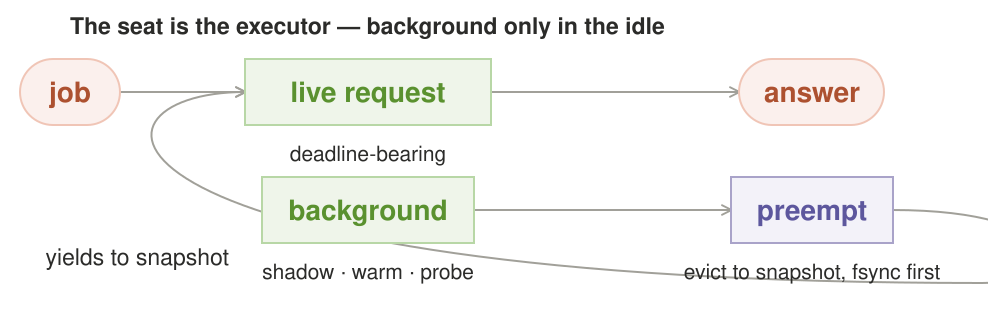
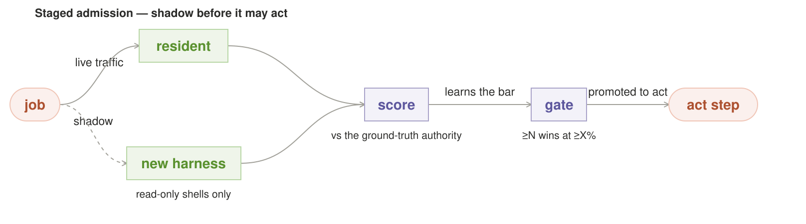
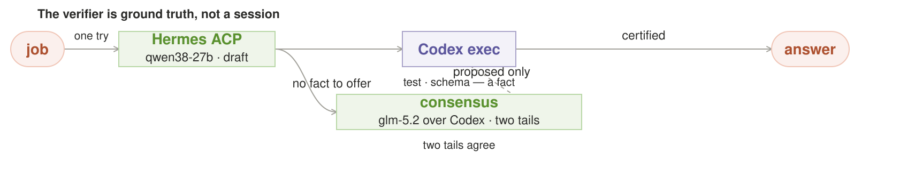
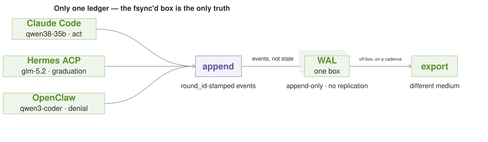
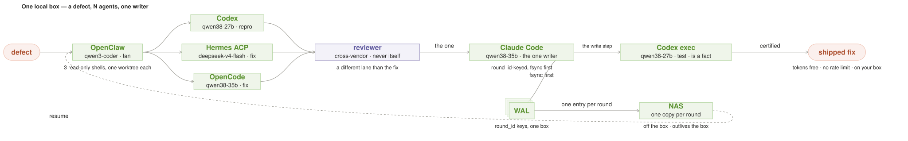

# Local AI Orchestration Patterns — the agent layer

The second half of the catalog. The
[model layer](../model_orchestration_patterns/README.md) routes and combines
*local inference*; this one routes and combines **agents** — harness
frameworks running as workers. Where the model layer asks *how many samples
does a request deserve, and how are they pooled*, the agent layer asks *which
agent gets the task — and how do agents sharing one box stay honest about
what they touch*. Read the model layer first; it is the foundation every
entry here runs on, and the cross-references are numbered by its catalog.

**What changes when the worker is an agent.** The model-layer patterns treat
a worker as a stateless read: sample in, answer out, discard. An **agent** is
not that. An agent is a *session* — a harness framework pinned to a model,
holding a working directory, a context window, tool access, and credentials,
and able to do things that *persist*: write files, run code, call an API, send
a message, mutate state that outlives the request. That changes the
economics in exactly three ways:

1. **The scarce thing is the seat, not the tokens.** A model read is free
   locally; an agent session occupies a seat (a resident, VRAM-backed model +
   harness runtime) for its whole lifetime. Fan-out in the model layer is N
   reads; fan-out in the agent layer is N sessions, and N sessions that can
   *act* is N executions the box has to pay for in wall-clock and in risk.
2. **Side effects are the risk surface, not the answer.** A wrong model read
   costs tokens. A wrong agent write costs you a file, an API call, a sent
   message. The agent layer's whole discipline is that *only one worker may
   act* — every redundant agent runs read-only, and a single selected agent
   carries the world-touching step.
3. **State is the product, and it's durable.** An agent's value is largely
   its context — the session that remembers the codebase, the customer, the
   six prior turns. That context is crash-recoverable state on a local box,
   and unlike a model read it must be *managed*: spawned, warmed, handed off,
   resumed, killed. This catalog is as much about session lifecycle as about
   routing.

**The harness lanes (the agent layer's "models").** Where the model layer
routes across model families, the agent layer routes across **harness
frameworks** — the engines the router can drive as workers. Each is a lane
with a different act contract:

Lane                | Runs on          | May it act?                          | Observability
--------------------|------------------|--------------------------------------|----------------------------
Hermes (ACP)        | ACP / JSON-RPC   | read-only by default; tool scope is voluntary | structured tool calls
Claude Code         | stream-json      | `--no-tools` for read-only           | token-stream per tool step
Codex               | `exec --json`    | sandbox / read-only flag              | per-tool JSON events
OpenClaw            | fan-out worker   | each copy is a full agent, act step gated by the router | N parallel sessions

**On names: ACP is the wire, Hermes Agent is the product.** The first lane's
"ACP" is **Agent Client Protocol** — the open, editor-and-agent-neutral wire
(`agentclientprotocol/agent-client-protocol`), the transport a harness speaks,
not a product. **Hermes Agent** (Nous Research, `NousResearch/hermes-agent`)
is one *product that speaks* that wire; a reader should never read "Hermes ACP
the lane" as "Hermes Agent the home-base" — the lane is how it is driven, the
home-base is what it remembers. Where this catalog writes the lane it says
"Hermes ACP"; where it means the memory product it says "Hermes Agent".

The coding-agent engines (Cursor, OpenCode, Pi, Command Code, Devin, Aider)
sit in the same seat pool — Pi is a Fleet coding-engine, *not* a
model and *not* a lane; it joins the fan when a task is agent-shaped, never
when the router is just picking model reads.

**Which exec seat for which shape.** The coding engines in that pool are not
interchangeable at the lane — each is a different *default posture* on the
same role, and the pick is the shape of the task, not a benchmark:

**Exec seats, at a glance.** The same summary-first shape as the home
bases above; the bullets that follow are the *why* and the *when-not*.

| Exec seat | Default posture | Reach for it when |
|-----------|-----------------|-------------------|
| **Aider** | thin, git-native pair-programming seat | you drive small-to-medium repo diffs and steer |
| **OpenCode** | open, configurable terminal TUI across many models | you want the harness itself transparent and yours |
| **Command Code** | learns your taste; portable `taste.md` | the harness should absorb and replay how you like code |
| **Codex** | supervised, sandboxed exec + worktrees/PR pipelines | the game is N supervised lanes |
| **Claude Code** | ergonomic single-developer workspace | the game is depth in one repo |
| **Pi** | minimal: no permissions/plan/sub-agents, under *your* loop | you want the thinnest auditable engine under your own orchestration |
| **Cursor** | managed desktop IDE | you hand the loop to a GUI product |
| **Devin** | managed autonomous SWE fleet | you hand the entire loop to a product, not a lane |

- **Aider** (`aider-chat`) is the pair-programming seat: a thin, git-native
  edit loop for a developer driving small-to-medium repo changes — the TL that
  writes diffs while you steer, not a supervised fleet.
- **OpenCode** (`anomalyco/opencode`) is the open terminal TUI: a configurable,
  auditable, hackable harness that works across many models — the seat when
  you want the harness itself to be transparent and yours.
- **Command Code** (`command-code`) is the seat that *learns your taste*: its
  Taste compiler imports Claude/Codex/Cursor sessions and writes portable
  `taste.md` packages, so your preferences follow you across tools — the pick
  when the harness should absorb and replay how you like code written.
- **Codex** and **Claude Code** are the two "default" coding seats with
  different reach — Codex the supervised, sandboxed exec with worktrees and
  PR pipelines (fleet), Claude Code the ergonomic single-developer workspace
  (one repo done well). Reach for Codex when the game is N supervised lanes,
  Claude Code when the game is depth in one repo.
- **Pi** is the minimal seat (DIY discipline: no permissions, plan, or
  sub-agents) when you want the thinnest auditable engine under *your*
  orchestration; **Cursor** and **Devin** are the managed GUI/fleet ends
  (desktop IDE / autonomous SWE) when you hand the loop to a product instead
  of a lane.

**Which harness for which job.** The lanes above are *how to drive* a session;
*which harness to drive* is a separate decision, and it is settled by the
**layer of work**, not by a benchmark score. Five layers of agent work, five
home bases:

**Five home bases, at a glance.** One line per layer tells you which
harness to reach for before the detail below; the prose that follows is the
*why* and the *when-not*.

| Layer | Home base | Distinctive strength | Grab it when |
|-------|-----------|----------------------|--------------|
| Channel | **OpenClaw** | sits *in* Slack/Telegram/Discord/email; reaches tools by plugin | the task starts where you already operate and spans several tools |
| Memory | **Hermes Agent** | builds skills, remembers you across sessions, provider-agnostic | the value is an agent that *accumulates* context, not a one-shot answer |
| Desktop | **Claude Cowork** | turnkey managed desktop agent, no terminal | a non-technical professional delegates file/browser/spreadsheet work |
| Coding | **Claude Code** | repo-aware single-developer workspace; parallel sessions and subagents | the deliverable is a code change under an engineering loop |
| Command-center | **Codex** | worktrees, cloud envs, PR throughput for many agents × many repos | you supervise many agents across many repos |


- **Channel layer — OpenClaw.** If the task starts where the operator already
  lives (Slack, Telegram, Discord, email) and the answer spans several tools,
  OpenClaw is the substrate: a self-hostable agent that sits *in* the channel,
  reaches browsers, files, and other agents by plugin, and is at its best
  orchestrating messy operational work around you. Its weakness is that
  governance is yours — it ships rope, not a permission model, so it rewards a
  team that will own audit logs, secrets management, and human approval gates.
- **Memory layer — Hermes Agent.** If the value is an agent that *remembers* —
  builds skills from experience, carries a persistent model of you across
  sessions, and swaps providers freely — Hermes Agent (Nous Research) is the
  home base. It is model-agnostic (OpenRouter, NVIDIA NIM, Hugging Face, and
  the OpenAI/Anthropic endpoints are interchangeable backends), and it is
  strongest where failures are *context* failures, not reasoning failures. (It is
  also channel-native — Telegram, Discord, Slack, WhatsApp, Signal, CLI, from one
  gateway process, on local/Docker/SSH or a serverless VM — so the layer pick is
  about which value is *distinctive*, not which is exclusive: OpenClaw wins when the
  task lives in the channel, Hermes when the value has to *remember*.) Its
  weakness is that self-improvement needs review: you must be able to state
  what it learned and why before it keeps the memory.
- **Desktop layer — Claude Cowork.** If the worker is a non-technical
  professional delegating file, browser, and spreadsheet work with no terminal
  in sight, Claude Cowork is the intent: agentic execution packaged behind a
  managed desktop app. You trade self-hosting and deep customization for turnkey
  ergonomics, and Anthropic is explicit that it is not for regulated workloads.
- **Coding layer — Claude Code.** If the deliverable is a code change under an
  engineering loop — read the repo, edit, diff, test, review, merge — Claude
  Code is the ergonomic fit: a repo-aware developer workspace with parallel
  sessions, subagents, plugins, connectors, and local/remote/SSH environments.
  Its cost is that it assumes engineering discipline and permission hygiene on
  your side.
- **Command-center layer — Codex.** If the work is *many* agents across *many*
  repos running in parallel, Codex is the intent: an engineering operations
  layer with worktrees, cloud environments, and PR-oriented throughput — less a
  single-developer cockpit than a way to supervise a fleet.

**The harnesses are not rivals; they are home bases that reach outward.**
OpenClaw reaches layers 2–4 by plugin; Codex is deeply capable at the coding
layer too. The decision is which *home* matches the task's layer — not which
tool is "better" in the abstract.

**Pi is the "bring your own discipline" seat.** Pi is neither a model nor a
lane but a *minimal agent harness*: it ships strong defaults and deliberately
skips sub-agents and plan mode, so you compose the loop yourself and extend it
with packages (skills, prompt templates, themes) via npm or git. Pick it when
you want the thinnest, most auditable engine under *your* orchestration — the
harness that most literally matches this catalog's "you are the router"
stance. Its weakness is the flip side: nothing is handed to you, so governance,
planning, and sub-agent splitting are all yours to build.

**And when *not* to reach for each home.** Knowing which base fits the work is half the decision; the other half is knowing which one is the *wrong* base for it, so the guide closes each home with the case that should send you elsewhere:

- **OpenClaw** — *not* when the job has no channel boundary and no tool span: a single bounded code change is one Claude Code / Codex session, and OpenClaw's orchestration muscle and its "governance is yours" cost are wasted on a one-shot ask you cannot also audit.
- **Hermes Agent** — *not* for a deterministic, single-shot answer with no accumulated context (you pay for a memory layer that does nothing), and *not* when you cannot review what it "learned" — self-improvement without review is how a persistent model of you quietly goes stale.
- **Claude Cowork** — *not* for anything you must retain, script, or audit in CI, and *never* for regulated workloads (Anthropic is explicit); it is a managed GUI app, not a composable worker you can drive as a lane.
- **Claude Code** — *not* the base for *many* agents across *many* repos you don't own: it is a single-developer workspace, not a fleet supervisor, and its ergonomics assume you supply the permission hygiene.
- **Codex** — *not* for a one-file, one-session task a thin harness resolves faster (worktrees and PR pipelines are overhead on one bounded change), and *not* where you want the thinnest auditable seat — that home is Pi.
- **Pi** — *not* when you want the harness to hand you planning, sub-agents, or governance: Pi deliberately ships none of those, so pick it only when you are ready to build and own the loop.

**Where these claims come from — each home-base is a live project, not an
abstraction.** The taxonomy above is not a taste judgment; every base is a
real, current, checkable thing, and the layer it owns is the layer its own
surface ships. For the record, as of this writing: **OpenClaw** is
`openclaw/openclaw` ("your own personal AI assistant… any OS, any platform"),
**Hermes Agent** is `NousResearch/hermes-agent` ("the agent that grows with
you," with its self-evolution and agent-governance siblings), **Claude Code**
is `anthropics/claude-code` (the terminal agentic coder), **Codex** is
`openai/codex` (the lightweight terminal coding agent), and **Pi** is
`earendil-works/pi` (the Pi agent harness — an agent runtime, a coding-agent
CLI, and a unified LLM API) whose README states the property this catalog leans
on hardest for it: *no built-in permission system; it runs with the
permissions of the user and process that launched it.* **Claude Cowork** is
Anthropic's managed desktop agent (no public repo; the name is confirmed by
the many open reimplementations that describe themselves as "Open Source
version of Claude Cowork"). The coding engines that join the fan's seat pool
are the same kind of live, checkable thing: **OpenCode** is `sst/opencode` —
*now maintained as `anomalyco/opencode`*, "the open source coding agent," the
terminal TUI that leads this area's open-CLI re-engineering (be warned there
are two "OpenCode" projects: the other, `opencode-ai/opencode` from the Charm
team, is *archived* and continues as `charmbracelet/crush` — the working-tree
engine this catalog names is the SST/Anomaly lineage, not the archived one).
**Aider** is `Aider-AI/aider`, "AI pair programming in your terminal," the
6.8M-install (PyPI) pair-programming seat. **Command Code** is the newer CLI
coding agent — `CommandCodeAI/command-code`, "the coding agent that
continuously learns your coding taste" (a learned *Taste* preference compiler
that imports Claude/Codex/Cursor sessions and writes portable `taste.md`
packages), on npm as `command-code`, with a "Command Code Go" subscription
tier; Pi, Hermes Agent, and DeepSeek Harness already ship adapters for its
API, but its ergonomics are still the object of active churn. **Cursor** and
**Devin** are the managed GUI and fleet ends of the pool — Cursor the desktop
IDE (cursor.com), Devin Cognition's managed agent (devin.ai) — both with no
public product repo, the same closed-harness shape as Claude Cowork. Point the
list above at those sources and the "which job" layer follows; the rosters
move, the layers do not.

Two routing rules hold across the whole layer:

- **The harness adds a tooling reflex, not a training tail.** Two agents on
  the same harness + same model share one training tail *because they share
  the model*; the harness contributes the reflex (prompt, tool schema, exec
  behavior), nothing to the tail. "Different lane" is a real divergence when
  *either* the harness *or* the model tail differs — but same-model,
  different-harness is reflex divergence only, which is weak compared to the
  family independence the model layer (#2/#11) buys with different families.
- **The fan shape is computed from live seats, not named.** A 1-seat box holds
  ~1–2 resident sessions; a 3-agent fan is queued serial swaps on the
  critical path, each costing seconds of load. Those are parameters, not
  measurements — the live-node inventory reports what a given box's VRAM
  residency actually allows. Spawn `min(N, free seats)` parallel, queue the
  rest — the model-layer rule, now applied to sessions.

**A word on the examples — and what "local" gets you.** Every `On the Grid
stack` block, and every harness × model tag drawn on a figure's worker nodes,
is an *illustrative* concrete build, not a shipped configuration. Real model
names (`qwen38-27b-mtp`, `qwen3-coder`, `glm-5.2`, `deepseek-v4-flash`) and
hardware sizes ("24 GB NVIDIA") are placeholders for "whatever is resident on
your box" — parameters, not a billable stack. Treat them as worked examples of
the shape, not as the shape itself.

The hardware claim, though, is not a placeholder — it is the point of this
catalog. This is a **local** multi-agent system: the box is yours, and it
changes the economics against a cloud multi-agent stack (OpenAI/Claude/Codex
hosted) in three ways that the patterns lean on:

- **Tokens are free.** No per-token metering, so a fan of N readers and a
  red-team pass and a cross-vendor consensus arm cost nothing to *run* — the
  only price is seats and wall-clock. Patterns can afford redundancy the cloud
  bills for.
- **There is no rate limit.** A resident model on a box you own is not quota
  -- it is a 24/7 worker. Fan-out is bounded by VRAM residency, not by an API
  RPM cap, so "N agents" means what the GPU's working set allows, not what a
  provider lets you send.
- **Compute is fast and close.** Inference runs on your own RTX 6000 Ada
  (48 GB) or RTX 5090 (32 GB), a Mac at 32 GB unified, or a server of B300s
  (288 GB) — latency off the critical path of a remote provider, and a big
  enough working set that several resident models can co-reside. The patterns
  treat this as the normal case.

None of this removes the bind this catalog is really about — the *seat* is
still scarce, and *actions* are still risky, so every pattern is discipline on
top of free compute. But the economics are the opposite of a cloud multi-agent
system: the cost to avoid is not tokens, it is load-and-swap wall-clock and
unbounded world-touching writes.

**Where this sits in the multi-agent landscape.** A meta-harness — a layer
that wraps several coding-agent CLIs and SDKs (Claude Code, Codex, Cursor,
OpenCode, OpenClaw, Pi, Devin, and the rest) behind one session API — is now
a solved, cloud-shaped problem. **Omnigent** (Databricks, Inc.,
Apache-2.0, `github.com/omnigent-ai/omnigent`) is the clearest working example:
agents are YAML files; a runner sandboxes each session and a server holds
policies and shared history; **Polly** is an orchestrator that writes no code
and dispatches per-vendor sub-agents into parallel git worktrees; and its
**Polly/Debby** moves are the interesting ones — route each diff to a
*reviewer from a different vendor than the one that wrote it* (cross-vendor
verifier as policy), run a two-head debate to convergence, and hold a
three-level ALLOW/DENY/ASK policy stack where the stricter session rules are checked first. That is
the cloud-side version of the same discipline this catalog describes.

This catalog is deliberately **not** the meta-harness. It is the *local*
version, and it holds three positions the cloud meta-harness does not:

- **The spine is the box, not the provider.** Omnigent is cloud-shaped — it
  is one more gateway on top of hosted agents and hosted inference (Ollama /
  vLLM show up as *an option*, not the spine). Here the GPU is resident on the
  user's own hardware and the session cache lives next to it. The model layer
  is the spine the agent layer runs on; the meta-harness is a layer *above*
  Grid, not a replacement for it.
- **We are the agents, not the platform.** Omnigent is infrastructure that
  *manages* anonymous sessions. This catalog is the routing and trust model of
  *named, personified* products (Intern, Harness, the fleet) that already have
  a body and a job — the pattern's worker is a product, not a row in a policy
  table.
- **The physical layer is the moat.** A YAML agent that writes no code can be
  re-won by a better gateway. A local, seat-bound, round_id-keyed trust model
  running on hardware the user owns, wired to the physical products, is the
  part that cannot be commoditized by shipping a better FastAPI server.

So this catalog takes what is good and drops what is not: the **cross-vendor
verifier as policy** (Omnigent's Polly/Debby) is #6's strong-arm principle
lifted to admission (#5); the **three-level, session-wins ALLOW/DENY/ASK**
policy stack is the act-gate (#1) made a policy hierarchy; and the
**LLM-classifier routing** is #3's *pick the lane* decision, made explicit.
What it does not do is re-win the meta-harness race — that ship has sailed
cloud-side, and the differentiator here is the box.

**Key terms for the outside reader.** *Grid* is a local-first,
OpenAI-compatible inference router: one endpoint, dispatch by model name to
the engines you chose. A *seat* is the agent layer's scarce resource — one
resident, VRAM-backed model + harness runtime that a session occupies for its
lifetime. A *session* is a harness framework pinned to a model, holding a
working directory, context, tool access, and credentials, able to act in ways
that persist. A *lane* is one harness route (Hermes ACP, Claude Code
stream-json, Codex `exec --json`, an OpenClaw worker pool). An *actor* is the
single selected session permitted to act; every other member of a fan is a
*reader*. A *round_id* is the key stamped on every session, snapshot, and
ledger event, so a replay reproduces the actual path a request took. A *WAL*
is the write-ahead log that backs the state ledger. These recur throughout;
where a term is loaded before it is defined here, the definition lives in
this block.

Read the register before you draw or write. The figure style the diagrams in
this catalog follow is written up in `docs/STYLE.md` and `docs/DIAGRAMS.md`;
the canonical standard that vendors them is
`autonomous-org/knowledge/diagram-style.md` (and its companion
`technical-writing-style.md`), which you may not have locally. The agent
figures are generated from the *same token set* as the model layer's —
imported, not copied — so the two catalogs share one geometry, one palette,
one type scale, and cannot drift apart.

---

**How to read a pattern.** Every pattern below is documented under the same
skeleton, so the catalog can be scanned and then read deep. The headings are
fixed and mean the same thing in every pattern:

- **Intent** — the shape in one sentence, and what it buys.
- **Also Known As** — the other names the idea travels under, so you can find
  it by what you already call it.
- **Motivation** — the concrete pressure that makes the pattern worth having;
  the failure it answers.
- **Applicability** — the crisp “use it when / avoid it when” test, so you
  can apply the pattern without first reading the whole entry.
- **Structure** — the diagram and the parts it names.
- **Mechanics** — how the parts collaborate: who decides, who waits, what
  crosses which edge.
- **Consequences** — what the pattern costs and what it forgives.
- **Known Uses** — real systems and techniques that already run this shape, so the abstraction is anchored, not invented.
- **Failure mode** — the specific way this pattern goes wrong, and the honest
  version of its promise.
- **Refinements** — how to build it: the concrete rules that keep the promise
  honest (present where the pattern has implementation guidance to separate).
- **Sample Code** — a short, runnable-in-spirit sketch of the shape, so the
  mechanism isn't left to prose (illustrative, not the shipped stack).
- **On the Grid stack** — one concrete local build, to keep the economics
  honest. **Related Patterns** ends each entry and points at the same family.

Read the **one-sentence table** first to choose a shape, then a pattern's
**Intent** to confirm, then its **Failure mode** before you build it — the
liability is where a pattern is actually decided. The patterns are numbered
and cross-reference each other by `#number`; where a pattern lifts from the
model layer it is named with its model-layer `#`, and where it needed a
re-cut for agents the re-cut is flagged.

**How to read the figures.** Every figure uses one fixed visual language, so
any diagram is readable at a glance — where a request enters, where compute
happens, where a decision is made, and which edges loop back.

- **Coral pills** are the request's entry (`job`) and its exit (`answer`) —
  the two points where the pattern touches the outside world.
- **Green boxes** are *work*: a reader, a draft, a snapshot, a checkpoint —
  a unit that occupies a seat.
- **Purple boxes** are *decisions*: the select, the score, the gate — where
  the shape is decided, not executed. A green box never decides; a purple box
  never does the work.
- **Arrows** run forward along the answer. A **dashed** arrow is a stateful or
  boundary edge — a shadow, a resume, an eviction, a may-not-cross constraint
  (like the verifier's proposed-only loop). It signals "this edge does not
  proceed forward; it loops, restores, or fences."
- **A stacked deck** is the one durable object on the box — the WAL, the
  off-box store. Everything else in a figure is a session or a step.
- **Every green worker carries its harness × model tag.** The harness is the
  node's label — Claude Code, Codex, Hermes ACP, OpenClaw, OpenCode, a fan —
  and the model it runs is the smaller line beneath it (`qwen3-coder`,
  `glm-5.2`, `deepseek-v4-flash`). That pairing *is* the routing decision, so
  the figure draws it on the node instead of leaving it to prose. The model
  names are an illustrative roster, not a billable stack (see *A word on the
  examples*).

The same roles and edge types appear in all seven figures; `docs/DIAGRAMS.md`
is the formal register, and this block is the field guide.

**Three binds, seven shapes.** *(If you read one thing, read this — it is
the shape of the whole agent layer.)* The model layer decides *how many
samples* and *how they pool*; the agent layer runs on top and decides what a
sample is *allowed to do*. Its seven shapes are not seven unrelated ideas —
they are the same three scarce things, defended once each. **The seat** is
VRAM residency: the box holds a handful of resident sessions, so #4 (the seat
is the executor — background work lives only in the idle) and #2 (session
lifecycle — the resident session is a cache that must outlive the request and
the crash) make residency a first-class unit, not a side effect. **The act**
is a world-touching write: #1 (the act-gate — N−1 read, one `round_id`-keyed
actor) bounds a fan's writes to one mutation, and #3 (route across harness
lanes — role → lane → gate) settles *which* resident session may own the task
at all. **The fact** is what may certify: #5 (staged admission — a new harness
earns the act) gates who is trusted, #6 (the verifier is ground truth — a test
is a fact, a session is a report) gates what may certify a verdict, and #7
(only one ledger) makes the act log durable enough to survive the box that
wrote it. A fan only needs an act-gate if seats are real, and only needs a
verifier and a ledger if acts are real — so the natural read runs seat (#4,
#2) → act (#1, #3) → fact (#5, #6, #7).

## The one sentence per pattern

| # | Pattern | The move | Use it when |
|---|---------|----------|-------------|
| 1 | **The act-gate** | N−1 agents read, one selected agent acts — one `round_id`-keyed mutation | a fan must grow without its risk growing with it |
| 2 | **Session lifecycle** | four transitions — spawn, warm, handoff, kill — keep one resident session alive | the session's context must outlive the request, and the crash |
| 3 | **Route across harness lanes** | pick the lane by the act contract, then residency, then model | the task is agent-shaped and the harness is part of the decision |
| 4 | **The seat is the executor** | background work preempts to snapshot and yields to the deadline-bearing request | canaries, warming, and probes assume an idle executor that isn't built yet |
| 5 | **Staged admission** | a new harness shadows read-only until it beats the ground-truth authority | you're admitting a harness you don't trust yet |
| 6 | **The verifier is ground truth** | a test is a fact, a session is a report | a label changes routing, equity, or admission |
| 7 | **Only one ledger** | every durable event appends to one fsync'd log, exported off-box | the act log must survive the box that wrote it |

**Choosing a pattern — the decision order.** The table lists the *what*; this
is the *which* — the order in which to ask, because the first question that
binds is the one that decides:

1. **Will this task touch the world?** → #1 before anything else. Every fan
   spawns N−1 read-only readers and one actor; if no enforceable act-gate
   exists on the resident box, the task routes elsewhere — not onto a
   weaker lane.
2. **Which harness owns the task, and is it resident?** → #3. Residency
   first; stage a lane swap only when the task genuinely needs a harness the
   box isn't running. (For *which* harness to reach for at all — the layer of
   work it lives in — see **Which harness for which job** above; residency
   picks the lane, the layer picks the harness.)
3. **Is the session already warm?** → #2. Before paying a spawn, reuse the
   resident session's context; same-harness resume is the real primitive and
   cross-lane "handoff" is a restart, priced as one. The lifecycle join —
   spawn / warm / handoff / kill — is what makes the seat the router just
   picked affordable, and it is always the step right after the route.
4. **Does the plan assume background work?** → #4. If the box can't name the
   idle threshold, the preemption trigger, and the residency bound, the
   "runs in the background" promise isn't real yet.
5. **Is the harness new, or the verdict trust-affecting?** → #5 to earn the
   act step, #6 to certify the label — consensus may propose, but only a
   deterministic fact (or the escalation seat) certifies.
6. **Will anything have to survive this box dying?** → #7. Snapshots,
   reputation, and the act log all append to one log, exported to a
   different medium on a cadence.

## The catalog, as one figure



---

## 1. The act-gate — only one worker may act



**Intent.** Any fan that spawns N agents spawns **N−1 read-only sessions and
one actor**; the selected agent carries the world-touching step, and that step
is one idempotent, checkable mutation. This is the agent layer's first law.

**Also Known As.** single-writer discipline; one-actor fan-out; the
constitution

**Motivation.** The model layer (#6 Brute-Force) already caps its fan to
"only the selected worker may act." At the agent layer that is not a
refinement — it is the constitution. A wrong model read costs tokens; a wrong
agent write costs a file, an API call, a sent message. Every redundant agent
that *can* act is an N× risk multiple you did not price, so the fan's risk
must be independent of its size.

**Applicability.** Use it when a fan spawns agents and more than one of them
*can* touch the world, and you want the fan to grow without its risk growing
with it — every redundant reader is fine only because it cannot act. Avoid it
when the readers' read-only cannot be enforced by a mechanism: a gate asserted
in a prompt (a harness that can still `git push`) is a hope, not a gate, and it
turns the fan into N actors wearing N−1 masks. And there must be one
idempotent, `round_id`-keyed mutation to hand the single actor — no key, no
gate.

**Structure.** Coral `job` in, a dot where the fan splits, N−1 green
read-only sessions, a purple `select`, one green `actor` below it, and the
coral exit is the one `act` step — a single idempotent mutation, keyed by
`round_id`.

**Mechanics.** The losing agents simulate, reason, and propose — they may not
write a file, run a mutating command, or call an external API. Selection is a
decision (purple); acting is work (green), and there is exactly one of it.
"Simultaneous" is the wrong mental model on a 1–2-seat box: the fan is
*serial swaps*, the sessions don't co-reside, so the gate is enforced
per-invocation and the N is a scheduler choice, not N parallel seats. The
losers are not cheap shells either — each is a full session: warm,
context-bearing, VRAM-resident, seat-holding. The act-gate's economics rest on
that: read them as free-and-light and the fan's seat cost quietly under-counts
N−1 seats as expensive as the actor's.

**Consequences.** Risk decouples from fan size — three readers and three
hundred readers expose the same world surface. The price is N−1 seats of
warm-session cost and the scheduler's serial-swap time, so the gate must be
paired with a budget that prices it.

**Known Uses.** Single-writer / single-flight discipline wherever N readers could each act: a PostgreSQL advisory lock, an etcd/leader lease, an actor's single-threaded mailbox, an idempotent etag-or-CAS mutation. Every one enforces 'N−1 may read, one may write,' the same way the act-gate caps a fan. On a local stack today the same single-flight runs as Codex's per-repo worktree gating its one PR merge, OpenClaw's tool-approval covering the single world-touching call, and Omnigent's session-wins ALLOW/DENY/ASK policy stack — N−1 read, one write, whatever the substrate.

**Failure mode.** The gate is *asserted* in a prompt instead of *enforced* by
a mechanism. Read-only that can't be mechanically enforced is a hope, and a
losing agent that can `git push` makes the whole fan N× actors wearing N−1
masks.

**Refinements.** Two halves make the gate real. (1) **Mutate-path gating** —
force the readers read-only with a lane's actual mechanism, and name which one
per lane: Claude Code `--no-tools` / read-only mode, Codex's sandbox /
read-only flag, Hermes ACP's voluntary tool-scope. Then state what stops what
a compliant harness won't gate — a `git push`, an API call — network egress
rules, read-only working-tree mounts, a no-credential session. (2)
**Disclose-path honesty** — read-only governs *mutation*, not what a reader
can *see*. A read-only session that reads a credential or a secret tree can
exfiltrate through its own reads the instant its output returns to the router;
scope the read surface or treat what it read as exposed. And the actor's
"one idempotent mutation" needs a key, not a sentiment: scope it to a
`round_id` action-replay key so a re-run of the same request lands the same
effect once, never twice.

**Sample Code.** *(A working sketch, not the shipped stack — every name is a parameter, per "A word on the examples".)*
```python
# N-1 readers propose; exactly one actor mutates, keyed by round_id.
def settle(round_id, prompt, readers, pick_winner, actor, mutate):
    proposals = [r.reason(prompt) for r in readers]      # read-only; no creds
    winner = pick_winner(proposals)                      # purple: decide
    effect = apply_once(mutate, key=f"round:{round_id}") # green: act once
    return proposals, effect
```

**On the Grid stack.** A code-fix request fans to three drafters on **three
different lanes**, so each reader's read-only gate belongs to its own harness:
A drafts on **OpenClaw** (gated by the router's quorum — its act step is never
its own), B re-derives on **Codex** (sandbox / read-only flag), C red-teams the
diff on **Hermes ACP** (tool-scope, read-only by default). They need not share
a model — A and B can each be `qwen3-coder` on the resident seat (a
same-model read costs a context swap, not a VRAM load) while C is `glm-5.2`
for a genuinely independent read. Only then does the router pass one concrete
patch through to **Claude Code (stream-json)** with tools enabled for the one
write step, and only that actor holds the approval to open the network for the
one `git push`. The fan is N=4: three readers plus a separate actor — the N−1
arithmetic is 3 losing + 1, one seat, serial swaps. And the fan
needs a number or "fan it" has no bound an operator can trust overnight: a
**seat-seconds / serial-swap budget keyed on distinct model loads, not worker
count** — `swap_cost × (distinct models touched)`, because same-model members
swap context (cheap) and it is the distinct resident-model loads that pay the
expensive VRAM swap. `swap_cost` comes from the live-node inventory, not
from a constant; the router refuses a fan that exceeds the request's
depth-of-thought budget and logs the refusal, so a later review sees the cheap
path was chosen because the expensive one was priced out, not because nobody
priced it.

---

**Related Patterns.** Session lifecycle (#2) is what makes the N−1 readers
cheap enough to run; Route across harness lanes (#3) picks which lanes carry
them; Only one ledger (#7) stamps the `round_id` this gate keys on.

## 2. Session lifecycle — the cache is the session



**Intent.** A model read has no lifecycle; a session does. The router manages
four transitions — **spawn, warm, handoff, kill** — as scheduled work, not as
an afterthought, because the session's context is the agent layer's best asset
and the only thing that compounds across requests.

**Also Known As.** session residency management; the warm-state cache

**Motivation.** State is the product and it's durable: the session that
remembers the codebase, the customer, the six prior turns is worth more than
any single read it performs. Left unmanaged, that state is a leak — a
resident session that is never killed is a politely named resource leak on a
1-seat box. Managed, it is a cache: a `round_id`-frozen snapshot you can
restore in a context swap instead of paying a cold start.

**Applicability.** Use it when a session's context must outlive the request —
and ideally the crash — and warm-state reuse is cheaper than a cold start, so
the four transitions (spawn, warm, handoff, kill) earn their management. Avoid
it when the traffic is stateless one-shot reads: a cold start is fine and a
resident session that is never killed is a politely named leak. And use
handoff sparingly — it is a genuine primitive only within the same harness;
cross-lane "handoff" is a restart, and pricing it as a free context move
over-claims the pattern.

**Structure.** Coral `job` in, one green `seat` (the resident session) at the
center, and the four transitions as purple decisions fanned out above and
below it: `warm` (the layer's cache, same harness), `handoff` (duplicate
context, same harness), `kill` (cancel, frees the seat) — all flowing toward
the stacked `snapshot` deck (the `round_id`-frozen, off-box state). The
terminal `free` exits the killed seat, and a dashed `restore` edge brings the
seat back from the snapshot.

**Mechanics.** The four transitions and what each is *not*:

- **Spawn** — a fresh session on a free seat; costs a VRAM load + context cold
  start. The expensive path the other three exist to avoid.
- **Warm / resume** — restore a `round_id`-frozen session snapshot (working
  tree + context) instead of starting cold. Cheaper than spawn; this is where
  the agent layer's cache actually lives.
- **Handoff** — the model-layer #16 straggler re-cut for sessions, and the one
  transition that must not over-claim. *Duplicate the overdue agent's context
  onto the other seat* only works **within the same harness**. Session context
  is harness-specific — a Claude Code session file, Hermes ACP JSON-RPC state,
  a Codex exec blob — and no harness exposes replaying another harness's live
  context. Cross-lane "handoff" is not context transfer; it is a *restart from
  the checkpoint artifact* — name it that and price the cold start.
- **Kill / cancel** — the cheapest primitive, and the one a fan needs most:
  stop the straggler, cancel the losing lanes, free the seat. It pairs with
  warm — a killed session is worth something only if its state was snapshotted
  first.

**Consequences.** The session becomes a first-class resource with a cost model
(load, swap, restore) instead of a fire-and-forget call. Warm/resume converts
most requests from cold-start into context-swap, which is what makes the
N−1-reader fan in #1 affordable at all.

**Known Uses.** Session and connection lifecycle management: connection pools that warm and reuse instead of cold-starting, OS process/container lifecycle, browser session-restore, and keep-alive caches — all turn an expensive spawn into a cheap resume, which is exactly what the warm/handoff/kill transitions do for a resident session. On the local stack it is the keep-alive on an Ollama or llama.cpp server, the warm pool on a Codex cloud environment, and Hermes' one gateway process holding a persistent session across Telegram/Discord/CLI instead of cold-spawning per message.

**Failure mode.** Handoff over-claiming. The moment a router treats
cross-harness handoff as a free context move, it will route an overdue Claude
Code session onto a Codex seat and get a cold restart back — slower than the
straggler it was trying to escape. Same-harness resume is the real primitive;
cross-lane is a restart, priced as one.

**Refinements.** Freeze every snapshot by `round_id`, not by wall clock, so a
replay and a warm restore land on the same state. Keep the snapshot format
per-harness and restore through that harness's own `--resume`-equivalent —
don't build a universal session format no harness will read. And make kill the
fan's exit path: a fan that cannot cancel its losing lanes is a fan that holds
the seat hostage after it has won.

**Sample Code.** *(A working sketch, not the shipped stack — every name is a parameter, per "A word on the examples".)*
```python
class Seat:  # the resident harness + model runtime
    def __init__(self, snap_home):
        self.session = None
        self.snap_home = snap_home
    def spawn(self, prompt):            # cold start on a free seat
        self.session = self._load(prompt)
        return self.session
    def warm(self, prompt):             # stay resident, reuse context
        return self.session.resume(prompt)
    def handoff(self, prompt):          # freeze to snapshot, then move
        self._persist(); self.session = self._load(prompt)
        return self.session
    def kill(self):                     # always preceded by the snapshot
        self._persist(); self.session = None
    def _persist(self):                 # fsync before the seat frees
        write(self.snap_home, self.session.snapshot()); fsync()
    def _load(self, prompt):            # restore the round_id-frozen snapshot
        snap = read(self.snap_home)     # none on a fresh seat -> cold start
        return Session(prompt, resume=snap) if snap else Session(prompt)
```

**On the Grid stack.** On a 1–2-seat box the `seat` is the one resident model
+ harness, so the four transitions are the whole scheduler. Warm/resume is the
hot path — the fan in #1 reads the same `qwen3-coder` seat three times by
swapping context, not by loading three models. Handoff never crosses a lane in
this build: an overdue Claude Code reader is restored onto the same Claude Code
seat, and if it must move to Codex, that is a restart from the snapshot,
priced as one. Kill is what frees the seat between requests, and it is always
preceded by the snapshot in #4's preemption, so the warm cache survives the
session.

---

**Related Patterns.** The seat is the executor (#4) is the machine that
schedules these transitions; The act-gate (#1) is why kill is a fan's exit
path; Only one ledger (#7) exports the snapshots this pattern freezes.

## 3. Route across harness lanes — role → lane → gate



**Intent.** The model layer's #1/#5 pick a *model*; the agent layer adds a
decision on top — **which harness** owns this task — and the two are the same
decision point. Pick the role, that names the lane, that names the act-gate
the router must be able to enforce.

**Also Known As.** harness routing; act-contract matching

**Motivation.** A unit test that must be right goes to the deterministic,
verifiable lane; open-ended research goes to the deep streaming interpreter;
a bounded, scriptable coding task goes to the exec seat. The *model* inside
the lane is the second question. Route by the model and you'll put a
verifiable job on a lane whose act-gate you can't actually enforce.

**Applicability.** Use it when the task is agent-shaped and the harness is
part of the decision — the act contract, the residency, then the model decide
which lane carries it. Avoid it when the task is a pure model read with no
session to hold: route that at the model layer, not here. And don't read the
lane table as a menu of warm seats — a 1–2-seat box does not hold five lanes;
each row is "role → lane → the model that fits *if* it is the resident one."

**Structure.** Coral `job` in, a purple `pick lane` (residency first), four
green lanes — Codex exec (bounded coding), Claude Code (open work), Hermes ACP
(verifiable), OpenClaw fan (N copies) — each flowing to the coral `answer`.

**Mechanics.** Three rules decide the lane, in order:

- **Match the act contract to the task's mutability.** Read-only research can
  go anywhere; anything that writes must go to a lane whose act-gate you can
  actually enforce. A role with no enforceable gate on the resident box is a
  reason to route elsewhere, not a job to force onto the wrong harness.
- **Residency first.** On a single box the lane you *want* may not be the
  lane that's resident. Prefer the resident session; stage a lane swap only
  when the task genuinely needs a harness the box isn't running.
- **Exploration lives off the critical path.** Trying a new or untested
  harness is #4's slack work, never the hot path — the same rule the model
  layer applies to probing unknown models (#24).

**Consequences.** The decision becomes checkable: every task can be stated as
*role → lane → the gate that lane enforces*, and any one of the three missing
is a mis-route caught before dispatch. The harness stops being an
implementation detail and becomes part of the routing decision it always was.

**Known Uses.** Policy routing by declared role: RBAC where a role names the lanes it may enter, and network/harness traffic-engineering where the routing decision is 'role → lane → gate,' not a per-request ad-hoc pick. CI platforms route a job to the runner that may run it the same way. On today's stack the lane is real: OpenClaw scopes its plugins to the channel the task lives in, Codex routes each PR through its own worktree, and the harness×model seat table in the companion routes a task to the resident harness that may run it.

**Failure mode.** The lane table read as a menu of warm seats. A five-lane
table on a 1-GPU/Apple box is not five resident lanes — the box holds ~1–2
resident models and swaps the rest on demand, and the three build-family
members (`27b` + `35b-a3b` + `qwen3-coder`) do not co-reside. Read a row as
"role → lane → the model that fits *if* it is the resident one," and let the
scheduler, not the table, decide which rows are warm.

**Refinements.** Keep the role language — "deterministic, verifiable lane",
"deep streaming interpreter", "exec seat" — bound one-to-one to the lane
names, so a builder doesn't have to reverse it by hand. The pairing
(harness × model) is per-lane guidance, not a law; an illustrative roster:
the exec seat pairs Codex with `qwen38-27b-mtp` (24 GB NVIDIA, sandbox /
read-only flag on the `exec` step); the deep interpreter pairs Claude Code
with `qwen38-35b-a3b-mtp` (32 GB Apple, `--no-tools`); the verifiable lane
pairs Hermes with a local pin, where test-pass is the gate and tool-scope is
*voluntary* — route write-possible work off it, use it read-only by default;
the fan pairs OpenClaw with an open-weight coder, act step gated behind the
router's quorum, never the worker's; and the escalation seat — reached only
when local judgment runs dry — pairs Grid Enterprise with a cross-vendor
model, full act-gate, the only one that opens an externally observable action.

**Sample Code.** *(A working sketch, not the shipped stack — every name is a parameter, per "A word on the examples".)*
```python
# role -> lane -> the act-gate that lane can enforce.
ROUTES = {                       # role: (lane, gate)
    "verifiable": ("hermes-acp", "tool-scope, read-only"),
    "open":       ("claude-code", "--no-tools"),
    "script":     ("codex",      "sandbox / read-only flag"),
    "fan":        ("openclaw",   "router quorum, never the worker"),
}
def route(role, residents):
    lane, gate = ROUTES[role]
    if lane not in residents:        # residency first
        return defer(role)           # stage a swap; don't force the task
    return lane, gate
```

**On the Grid stack.** Every task on this box arrives at the table first:
the test-that-must-be-right lands on Hermes ACP read-only (its voluntary
tool-scope is exactly why write-possible work stays off it); the open refactor
lands on the resident Claude Code stream-json seat; the bounded scriptable fix
lands on Codex `exec --json` with the sandbox on; the N-copy fan lands on
OpenClaw. Residency first means the same role can land on different lanes on
different nights — whichever of the listed models is actually resident wins —
and a lane the box isn't running only gets staged when the task genuinely
needs it.

---

**Related Patterns.** The act-gate (#1) is the contract this pattern matches;
The seat is the executor (#4) supplies the residency the rules trade on;
Staged admission (#5) is how a lane that fails this match earns a second
chance.

## 4. The seat is the executor — background only in the idle



**Intent.** The model layer's #26 slack-stealing scheduler is named there as
the machine the learners assume and none build. At the agent layer it is not
optional: **the seat is the session's runtime.** A box cannot serve live
requests and run canary shadows, warming sessions, and probe batteries until
there is an idle scheduler with a definition of idle, preemption, and a
residency bound. Build it first.

**Also Known As.** slack stealing, re-cut; the seat scheduler

**Motivation.** Every other pattern in this catalog that says "in the
background" — #5's shadow admission, #3's off-critical-path exploration, #2's
warm cache — assumes an executor that can be *taken back* when a deadline
lands. On a 1–2-seat box there is no such machine until the seat itself is the
executor, with preemption and a residency bound. No agent-layer pattern that
promises background work is real until this exists.

**Applicability.** Use it when canaries, warming, or shadow admission assume
background work that must yield to a deadline-bearing request — the executor is
only real once the seat itself carries preemption and a residency bound. Avoid
it when you can't name the idle threshold, the preemption trigger, the residency
bound, and the snapshot destination: until those are numbers, "runs in the
background" is a mandate, not a spec, and the box either starves the live
request or starves the cache.

**Structure.** Two rows. The live row on top: coral `job` → green `live`
(request, deadline-bearing) → coral `answer`. The background row beneath:
green `background jobs` (shadow · warm · probe — one pool, varies by job) →
purple `preempt` (evict to snapshot, fsync first) → a dashed arrow **up**
into the live row — background *yields to snapshot*, never to bare kill. A
second dashed edge runs from `job` down to the background pool, labelled
*spawned when idle*, marking the only door into background work.

**Mechanics.** Background work claims the seat only in the idle — *no live
request for N ms, or a deadline horizon*. When a live request lands on a seat
held by a background session, the router evicts that session **to its
`round_id` snapshot, fsyncs it, then frees the seat** — snapshot-persist-then-kill,
not kill. That order is the whole pattern: killing a background session bare
throws away the warm/resume cache #2 is built around, and only buys back a
seat at the cost of the layer's best asset. Residency is bounded in bytes: a
model stays resident only while its working set fits the GPU with the live
roster, and the probe battery never exceeds the VRAM left after the live
sessions.

**Consequences.** "Background" becomes a schedulable, preemptible,
VRAM-bounded state instead of a wish. Live work gets the seat with a bounded
cost (a snapshot write); background work gets the idle it was always going to
use. The scheduler has four numbers an operator actually sets — the idle
threshold, the preemption trigger, the residency bound, and the snapshot's
home.

**Known Uses.** Preemptive scheduling: OS time-slicing, cloud spot/preemptible instances, and Kubernetes eviction all treat the running unit as preemptible and restartable from a checkpoint — the seat-as-executor pattern is that discipline on a 1-seat GPU box. On the GPU today it is Ollama/vLLM continuous batching preempting to yield a seat to the deadline-bearing request — the executor *is* the seat, so background work runs only in the idle.

**Failure mode.** A policy statement with no numbers. Until the idle
threshold, preemption trigger, residency bound, and snapshot destination are
filled in, "background work runs when idle" is a mandate, not a spec — and the
box either starves the live request (background never yields) or starves the
cache (everything yields to bare kill).

**Refinements.** A concrete starting point for one box: idle = *no live
request for a few seconds* (or the request's `predicted_deadline` horizon,
whichever is shorter); preemption = *a live request lands and only a
background session holds the seat it needs — evict to snapshot and hand
over*; residency = *the live roster's working set, probe battery capped at
the VRAM left after the live sessions*. These are examples to tune, not laws —
the live-node inventory is what turns them, and #1's `swap_cost`, into the
numbers the budget actually gates on. And give the snapshot a home in #7's
off-box store, not a second un-exported pile.

**Sample Code.** *(A working sketch, not the shipped stack — every name is a parameter, per "A word on the examples".)*
```python
def scheduler(live, background):
    while True:
        if live.arriving_now():                # a deadline-bearing request
            background.preempt_to_snapshot()   # fsync, then free the seat
            yield live.run()
        else:
            yield background.run_until_idle_ms(IDLE_MS)  # fill the idle only
```

**On the Grid stack.** On this box the seat is the one resident
model+harness pair. Shadow admission (#5) runs the new harness in the
background row — it only gets the seat between live requests, and a live
code-fix that lands mid-shadow evicts the shadow to its `round_id` snapshot
(fsync'd to the off-box store) before taking the seat. The shadow resumes from
that snapshot on the next idle, so admission progress survives preemption
instead of restarting. The probe battery for a new model is capped at whatever
VRAM the live seat leaves, so a resident `qwen38-35b-a3b-mtp` can keep serving
while a smaller probe runs in the remainder — and when it can't, the battery
waits, it never evicts the live roster.

---

**Related Patterns.** Session lifecycle (#2) is the cache this pattern
protects; Staged admission (#5) is the background work that queues for it;
Only one ledger (#7) is where the snapshots land and are exported.

## 5. Staged admission — earn the right to act



**Intent.** A harness must **shadow before it is allowed to take a real
request's act step** — run the fan's read-only shells, get scored against the
ground-truth authority, and clear the bar before the router lets it act on
live traffic.

**Also Known As.** canary trust-equity, re-cut; shadow-then-promote

**Motivation.** The model layer admits a *model* this way (#18). The agent
layer admits a *harness* and a *session class* the same way, because the thing
being admitted can now touch the world. A new coding engine that gets an act
step on day one is an N× risk multiple with no reputation — the exact thing
#1 exists to prevent, at admission time instead of per-request.

**Applicability.** Use it when a harness, a credential scope, or a tool-sink
you don't yet trust must earn the act step — shadow read-only first, then
bounded act, then full act, scored against a ground-truth authority. Avoid it
when there is no new actor to admit (trust is uniform), and *especially* when
the authority isn't grounded: if #6 is an ungrounded vote, the shadow scores
against noise and the bar certifies promotion of whatever flatters the
verifier.

**Structure.** Coral `job` in, splitting into a green `resident` (live
traffic) and a green `new harness` (shadow, read-only shells only, dashed
edge) — both flowing to a purple `score` (against the ground-truth authority),
then a purple `gate` (≥ N wins at ≥ X%), then the coral `act step` exit.

**Mechanics.** The new harness runs only the read-only side of the fan — #1's
N−1 shells — on live traffic's requests. Its outputs are scored against the
verifier (#6) for every request, not self-graded. Only when it clears the bar
does the router promote it: shadow → bounded act (its act step gated behind
the router's quorum, as OpenClaw's already is) → full act. The same rule gates
a new credential scope and a new tool-sink — first shadow, then bounded act,
then full act.

**Consequences.** Trust becomes earned, measured state instead of a trust
boundary you configure once and hope. A new harness (or a new scope) enters the
box at the same read-only risk level every fan already accepts, and only climbs
as the evidence says. The admission bar itself is a number the builder sets
from its own verifier run — N wins at X% agreement with the authority — not a
universal threshold.

**Known Uses.** Progressive delivery and staged trust: canary → controlled → full rollouts, and CI trust ladders (build → test → integration → production) that grant a new actor a little more reach only as evidence accumulates — Staged Admission is the agent-layer version of that ladder. On the local stack it is admitting a new model or harness as a read-only shadow, running it in the router's idle slack until it beats the ground-truth authority on labeled wins, then granting the `round_id`-keyed act step only at the top rung — the canary ladder made concrete on one-box residency.

**Failure mode.** The bar set before the verifier is trustworthy. If #6's
authority is an ungrounded vote, the shadow is scoring against noise and "≥ N
wins" certifies nothing — you've automated the promotion of whatever flatters
the verifier. Admission is only as sound as the authority it scores against.

**Refinements.** Keep the three stages visible in the ledger (#7) as
`shadow → bounded → full` events, so a replay shows exactly when a harness
crossed each line. Score on the ground-truth arm first: where a test or schema
can certify the shadow's output, use it; reserve the weak consensus arm for
what has no mechanical check, and never let the weak arm promote a harness to
an act step. And run the shadow in the idle row of #4 — shadow traffic is
background work, and a shadow that starves a live request has inverted the
order the whole layer depends on.

**Sample Code.** *(A working sketch, not the shipped stack — every name is a parameter, per "A word on the examples".)*
```python
# Three stages, each a ledger event (#7); the deterministic arm scores first.
# Bounded mode's act step itself is gated behind a router quorum (#1).

def admit(harness, authority, ledger, idle):
    stage = ledger.stage(harness)                      # replay from the log
    if stage == "full": return harness                # already earned the act
    shadow = harness.shadow(read_only=True)           # #1's N−1 shells, no creds
    score = authority.score_ground_truth_first(shadow) # #6: fact arm, then weak
    if stage == "shadow":
        if score.wins >= TRUST_BAR.WIN_N:              # e.g. ≥ 20 labeled wins
            harness.mode = "bounded"                   # act gated behind quorum
            ledger.append(harness, "shadow -> bounded")
            return harness
        idle.run(shadow)                               # #4: shadow in idle slack
        return deny(harness)
    # bounded -> full: the act step now needs the round_id key (#1)
    if stage == "bounded" and score.wins >= TRUST_BAR.WIN_N_2:
        harness.mode = "full"; harness.grant_scope(round_key=True)
        ledger.append(harness, "bounded -> full")
        return harness
    return deny(harness)                               # scores against the bar
```

**On the Grid stack.** A new coding engine lands on this box as an OpenClaw
shadow: it runs the fan's read-only shells on live requests, its outputs scored
by the deterministic arm (#6 — the Codex `exec --json` schema/test call)
against what the resident Claude Code seat ships. It gets the seat only in the
idle (#4), evicted to snapshot the moment a live request lands. After its
admission run clears the bar the router sets for it — say ≥ 20 labeled wins at
≥ 90% agreement, numbers this box's own verifier run produced, not a borrowed
threshold — the engine moves to bounded act (its act step gated behind the
router's quorum) and, later, to the full act step with a `round_id`-keyed
mutation and a credential scope it earned. Each crossing is a ledger event, so
a replay answers "when did this harness earn the right to push?"

---

**Related Patterns.** The verifier is ground truth (#6) is the authority it
scores against; The seat is the executor (#4) is the idle the shadow runs in;
The act-gate (#1) is the contract the promoted harness inherits.

## 6. The verifier is ground truth, not a session



**Intent.** A test is a fact; a session is a report. One independent,
tool-grounded authority certifies every trust-affecting label — and it **must
not be an agent you also fan out**.

**Also Known As.** the deterministic-authority branch; fact-over-report

**Motivation.** The model layer's cross-cut already says no pattern may issue
a trust-affecting label from an ungrounded model vote. The agent layer
sharpens it, because the tempting fallback is *an agent*: an agent verifier is
a session with the same tool callouts, the same working tree, the same prior
as the workers — it confirms the shared session, not the fact. Where the layer
can, verify against a deterministic external fact — a test pass, a schema
check. Those anchor the verdict outright; they do not depend on the model's
prior.

**Applicability.** Use it when a label changes routing, equity, or admission
and an external deterministic fact — a test pass, a schema check — can certify
it. The verifier outranks any session's report because it shares none of the
workers' prior. Avoid it when no mechanical check exists: the weak, consensus
arm may *propose* and log a judgment call, but never certify it — certifying
from a shared session is two runs of one prior agreeing, unanimous-but-wrong
in a lab coat.

**Structure.** Coral `job` in, a green `draft` (one try), a purple `check`
(test · schema — a fact) on the main row to the coral `answer` (certified).
Below, a green `consensus` (two tails agree) reached by a solid edge from the
draft when no fact is to offer, and a **dashed** edge from consensus back to
check labeled *proposed only* — the loop that can never certify.

**Mechanics.** Two arms, deliberately unequal. **The strong arm** — a passing
test or conformance check — grounds the verdict against a deterministic
external fact, and it is the only arm that may certify. **The weak arm** —
route the second read to a *different* harness+model tail so the divergence is
real — is labeled weaker on purpose: two independent tails agreeing is
error-correlation, not ground truth; they can share the same training data and
the same task, so winning agreement only lowers the odds of *shared* prior
failure and never certifies the fact. The consensus arm may **propose but
never certify**: when no test, schema, or lookup exists, two agreeing tails
produce a *proposed* verdict logged `proposed_by: consensus`. A
**non-trust-affecting** label may be adopted as a low-confidence read with no
trust score; a **trust-affecting** label — one that changes routing, equity,
or staged admission — can never be adopted from two models' agreement and
escalates to the real authority instead.

**Consequences.** Every "verified / correct / error" label in the system has
a named ground, and a replay can tell a fact-forced verdict from a consensus
guess. The weak arm buys coverage where no mechanical check exists — and
nothing more, which is exactly why it stays a proposal.

**Known Uses.** Tests, schema checks, and CI as the ground-truth authority: a passing suite or conformance check certifies a change regardless of the model's prior, and a reward model is a verifier the same way a test is — an independent, grounded fact outranks any session's report. On the local stack the deterministic arm is a test or schema gate running in the router's own pipeline — a suite pass, a conformance check — and a reward model is a verifier the same way a test is, both outranking any session's report of its own success.

**Failure mode.** The verifier as a session. The moment a fan's own sibling —
same harness, same working tree, same prior — is allowed to certify, "the
verifier passed" means "two runs of one prior agreed," which is the unanimous
but wrong (#2, model layer) failure in a lab coat. Same hazard in the weak
arm: calling a live API response or a git-diff *review* "deterministic" — a
live response is external but not reproducible, and a diff review pairs a fact
with a judgment. Each is a useful check; neither is the deterministic anchor.
Keep the strong label for the core two.

**Refinements.** Keep the escalation honest: it is an **off-box, paid**
action — the Grid Enterprise escalation seat (or ultimately a human) needs
network reachability, a provisioned account, and credentials on the node. A
box that walks away overnight trusting that trust labels get reviewed is
implicitly trusting that dependency — state its availability and cost up
front, or accept that a disconnected single node degrades to the weaker
"accept as low-confidence, never certify" arm and *logs the escalation it
could not make*. And own the blind-spot caveat even on the strong arm: a
schema or test is an authored artifact, and an author who framed the task the
same way the draft was framed can share the draft's blind spot while sharing
no model prior — the check grounds the verdict against a possibly imperfect
artifact; blind-spot independence stays the property of live cross-vendor
consensus, and that arm stays labeled (not) an authority.

**Sample Code.** *(A working sketch, not the shipped stack — every name is a parameter, per "A word on the examples".)*
```python
def certify(draft, check, consensus):
    fact = check.fact(draft)             # a test/schema: deterministic, external
    if fact is not None:
        return fact, "grounded"          # only this arm may certify
    verdict = consensus.propose(draft)   # two tails agreeing: the weak arm
    return verdict, "proposed_by: consensus"  # may propose, never certify
```

**On the Grid stack.** A config change drafts on `qwen38-27b-mtp` over Hermes
ACP; the verdict is certified by a **Codex (`exec --json`)** tool call that
validates the result against the config schema and, where the change is code,
runs the test suite — a deterministic external fact that shares none of the
draft's model prior. Only when no schema, test, or live API can certify — a
judgment call with no mechanical check — does the router reach the weak arm,
and it does **not** certify from it: a second read on the different tail,
`glm-5.2` cross-vendor over Codex, yields a `proposed_by: consensus` verdict
recorded in the ledger (#7) as ungrounded. A non-trust-affecting label may
adopt it as a low-confidence read; a trust-affecting one escalates to the Grid
Enterprise authority. And own the swap cost this arm pays on one box, exactly
as the model layer's #12 does: `glm-5.2` is not resident beside the Qwen
draft, so the fallback read is a serial VRAM swap on the critical path —
priced there, and only reached when the deterministic arm really has nothing
to offer.

---

**Related Patterns.** Staged admission (#5) scores against this authority;
Only one ledger (#7) records which arm certified each label; The act-gate (#1)
is the act step these labels govern.

## 7. Only one ledger — the fsync'd box is the only truth



**Intent.** All durable events — act, graduation, denial — append to **one**
fsync'd, `round_id`-stamped log, and the log is exported to a different
medium on a cadence. One truth, append-only, no replication — but *not* one
point of total loss.

**Also Known As.** the WAL; the single truthful log

**Motivation.** The model layer's closing rule stands unmodified: one state
ledger, append-only, keyed by request-class, and on a single fsync'd box the
ledger is the only truth; there is no replication. The agent layer inherits it
with new state the sessions introduce — context snapshots, the reputation
ledger per harness+class, the act log — all `round_id`-stamped events in that
one truthful log. A session's action, a canary graduation, an act-gate denial
are *events*, not silent state mutations; a replay must reproduce the actual
path a request took, including which agent acted and when.

**Applicability.** Use it when the act log, context snapshots, and per-harness
reputation must survive the box that wrote them and you can hold exactly one
writer — one fsync'd, `round_id`-stamped log, exported off-box on a cadence.
Avoid it when "only truth" collapses into "only copy": a single box that never
exports is a single point of total loss, and replay-from-log is impossible when
the log itself dies.

**Structure.** Three green events — `act`, `graduation`, `denial` — converging
on a purple `append` (round_id-stamped events), into a stacked-deck `WAL`
(append-only, one box, no replication), with a green `export` off to the
right: the one edge that leaves the box, on a cadence.

**Mechanics.** Every durable thing in the layer is an append, not a mutation:
#1's act and its denials, #5's shadow→bounded→full crossings, #2's and #4's
snapshots, the per-harness+class reputation. `round_id` keys all of it, so a
replay reproduces the *actual* path, not a plausible one. The ledger has one
edge that crosses the box: a **periodic export to a different physical
medium** — a second disk, a NAS, the Personal AI Rig, object storage — with a
stated retention. #4's "fsync it first" preemption snapshot and #2's
warm/resume snapshots export under the same cadence, so a preempted session's
cache and the audit of what it did survive the box, not just the session.

**Consequences.** "Only truth" stays true: one log, one writer, one key, and
a replay that answers "what actually happened, in what order." The export
buys recoverability — the one upgrade the single-box rule allows — without
introducing a second truth that could diverge from the first.

**Known Uses.** Write-ahead logging: PostgreSQL's WAL, SQLite's rollback journal, and every append-only event log make the durable log the single source of truth for crash recovery and replay — Only-One-Ledger is the WAL discipline with an explicit periodic export so 'one box' never means 'one point of loss.' On a local stack the ledger is one append-only event log beside the engine (SQLite WAL or a plain JSONL file) that the router fsyncs on every act, with a periodic export to a different medium — so one box never means one point of loss.

**Failure mode.** "Only truth" read as "only copy." On a single box the WAL
*is* the node, so a disk wipe silently destroys the very state the layer
prices highest — the warm-context cache #2/#4 build around, plus the act log
that is the whole audit of what an agent touched the world with — and
replay-from-log is impossible when the log itself died. The tell is an export
that lands on the same disk it protects: on a consumer 1-disk node that is not
an export at all.

**Refinements.** The export must land on a **different physical medium** than
the box it protects. On a consumer 1-disk node — the exact box this pattern
is about — no second medium exists until the operator provisions one, so the
honest stance is: a single-disk box accepts a single point of total loss for
its warm cache and act log *unless* the operator points the export at object
storage, which needs network and an account — price that dependency, or state
that the box gives up recoverability by choice. And route the agent layer's
own persistence through that same off-box store, never a second un-exported
pile: a second pile is a second truth in disguise, and the moment it exists
nobody says which one is right.

**Sample Code.** *(A working sketch, not the shipped stack — every name is a parameter, per "A word on the examples".)*
```python
def append(event, wal):     # every durable event -> one fsync'd log
    wal.append(serialize(event))
    fsync()                 # durable before we reply
    wal.export_off_box()    # snapshots, rep, act log all fan out from here
```

**On the Grid stack.** This box's WAL is one append-only log next to the
seat. The act log records each `git push` with its `round_id`, actor lane, and
the `round_id`-keyed replay proof; the graduation log records when a harness
crossed shadow→bounded→full in #5; the snapshot store holds the #2/#4
session freezes. All three export on the box's cadence — here, to the
Personal AI Rig over the LAN, a genuinely different medium — so a wiped
consumer box loses its day, not its history. On a true 1-disk node the
README's honest line applies verbatim: no second medium until one is
provisioned, and a disconnected box that can't reach object storage logs the
export it could not make, the same way #6 logs the escalation it could not
make.

---

**Related Patterns.** Every pattern feeds this ledger: The act-gate (#1)
stamps its acts, Session lifecycle (#2) and The seat is the executor (#4)
export their snapshots, Staged admission (#5) records its crossings, and The
verifier is ground truth (#6) records which arm certified each label.

## The one decision an agent router makes

Strip every pattern away and the agent layer reduces to one choice per
request: **which agent — which harness, which model tail, which session —
gets the task, and is that agent permitted to act or only to read?**
Everything else — the fan, staged admission, the scheduler, the act-gate, the
ledger — exists to make that one choice safe on a box where sessions persist,
act, and share one GPU. The model layer makes the *answer* reliable; the
agent layer makes the *action* reliable. That is the boundary: samples are
free, but actions — and the sessions that take them — are scarce, durable,
and worth managing like state.

---

## The whole system, one box, one defect



This is one concrete multi-agent system, end to end, and it is the catalog in
one figure: every node is a named harness × model pairing, every pattern does
one job, the state layer is rendered (the WAL deck, the off-box export, and the
dashed resume edge), and the economics are the *local* ones — free tokens, no
rate limit, fast on your own GPU.

**The problem.** `dispatcher.acquire()` holds the seat lock past the 30 s
nightly-batch deadline; the flaky repro is `test_dispatch_batch_timeout`, which
hangs at 96 s on 3 of 50 runs — intermittent dispatch lockups in production. A
single model asked cold will hallucinate a "fix" for what it half-remembered.
So we fan out, gate the write, and certify by fact — all on one box, no
provider, no token bill.

**The fan (#3 route, #1 act-gate).** A `defect` request enters and an
**OpenClaw** fan (the fan-shaped lane) dispatches three read-only shells, each
in its own git worktree so they never step on each other's working tree:

| Step | Harness | Model | What it does |
|------|---------|-------|--------------|
| repro | **Codex** `exec --json`, sandboxed/read-only | `qwen38-27b-mtp` | Reproduces the 96 s hang with a minimal harness script — can't write anything but its own worktree |
| fix A | **Hermes ACP** (ACP/JSON-RPC), read-only by default | `deepseek-v4-flash` | Drafts the dispatcher patch against the repro |
| fix B | **OpenCode** | `qwen3-coder` | A second, independent draft from a fully different harness+model tail — real divergence, not twin priors |
| reviewer | cross-vendor pass — never itself | — | Routes *each* diff to a reviewer from a **different** harness than the one that wrote it: fix A (Hermes) is reviewed on the **OpenCode** lane; fix B (OpenCode) on the **Hermes** lane. That is Omnigent's Polly rule and exactly #6's "weak arm diverges on purpose" |

Every worker is read-only. The `reviewer` is purple — it proposes; it never
writes.

**The write (#1 act-gate).** Only after the reviewers converge does the router
select **one** actor — **Claude Code** (stream-json, tools *enabled*) running
`qwen38-35b-a3b-mtp` — and that single seat performs the one
world-touching step. It
is idempotent and `round_id`-keyed, so a retry of the same request applies the
same patch once, never twice. N−1 agents read; exactly one acts. That is the
whole gate. **Converge** has a rule: accept when *both* diffs pass the Codex
test/schema arm, or when one diff is selected on ≥1 green deterministic run and
the other is explicitly discarded. **Non-convergence** has a path, not a stare:
either escalates to #6's off-box authority (a human or a fresh independent
lane), or the patch is dropped and the failed round is logged with its repro.

**The certify (#6 verifier).** The patch is not trusted because an agent said
so. It is certified by a **Codex `exec --json`** tool call (`qwen38-27b-mtp · test`
— the runner is deterministic, its act is a fact) that runs the actual test
suite and validates against the schema — a deterministic external fact that
shares none of the writer's model prior. The `shipped fix` exit is only reached
after that pass is green; if no mechanical check can certify a judgment call,
the consensus arm proposes-and-logs it but never certifies (see #6). The whole
run owes one concrete budget on the write: the gate refuses a fan whose
`swap_cost × (distinct model loads)` — a real seat-seconds number from the
box's live-node inventory, not a constant — exceeds the request's
depth-of-thought budget.

**The state (#2 lifecycle, #7 ledger).** The fan's `round_id`-keyed snapshot
is written to the **WAL deck** before any act, fsync first, and exported one
copy per round to the **NAS** (off the box, it outlives the box). Between
requests the box keeps the worktrees warm (#2), and the dashed resume edge
brings a wiped or preempted seat back from the last snapshot instead of
cold-starting. Every event — the fan dispatch, the review, the `git push`, the
certification — appends to the one ledger (#7), so a wiped consumer box loses
a day, not the audit of what the fleet touched.

**Why this is local.** On hosted Claude/OpenAI/Codex this exact system is
billable per token and capped per minute, so the fan stays small, the
cross-vendor reviewers cost real money, and a long red-team pass is priced
like a premium feature. On the user's own RTX 6000 Ada (48 GB) / RTX 5090
(32 GB) / Mac (32 GB unified) / B300 server (288 GB), tokens are free, there
is no RPM ceiling, and inference rounds-trips in milliseconds on the same
board the sessions live on. The only real costs left — the ones every pattern
above exists to manage — are the scarce seat and the risk of an agent *acting*
on the world. Fan it wide, write once, certify by fact: that is the local
multi-agent system.

---

**Related catalog.** The model layer
[../model_orchestration_patterns/README.md](../model_orchestration_patterns/README.md)
is the foundation this one runs on; its entries are the `#` references used
here.

**Read with.** [`agents.md`](agents.md) — the agent-layer execution
companion in this directory (the session/seat model these seven patterns run
on). The model layer's companions — `ROUTER.md` (what the router does today)
and `router-execution.md` (how it executes the model layer's machinery) —
live in `autonomous-org/projects/grid-orchestration/`. Draw before you write:
`knowledge/diagram-style.md`, `knowledge/technical-writing-style.md`.
