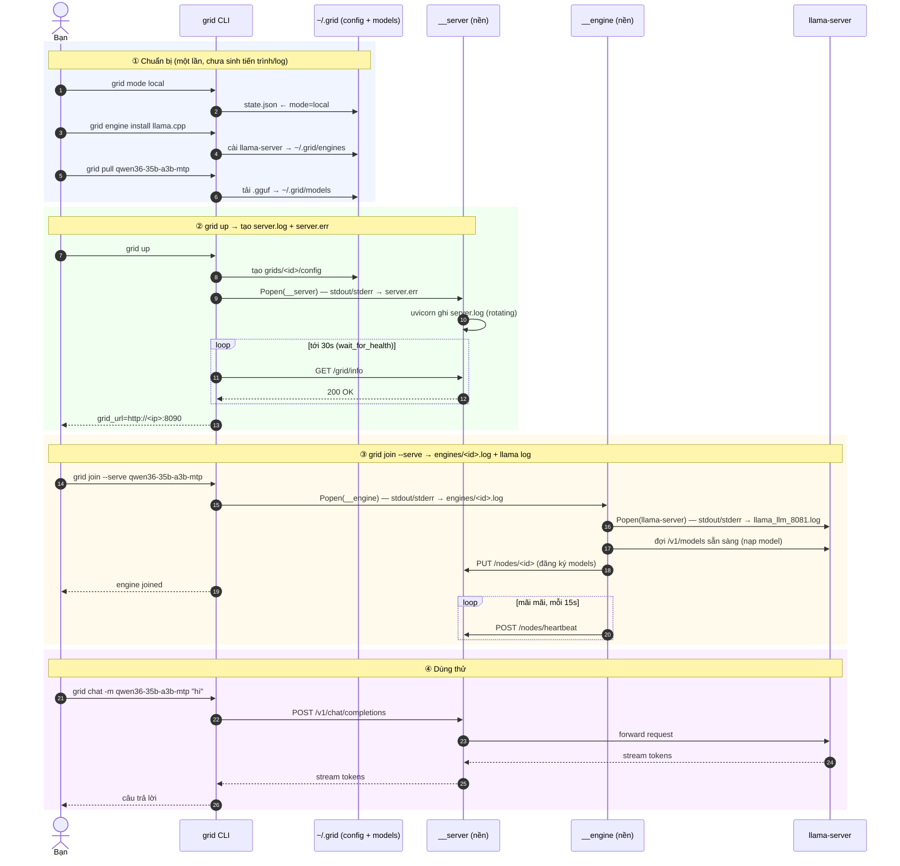
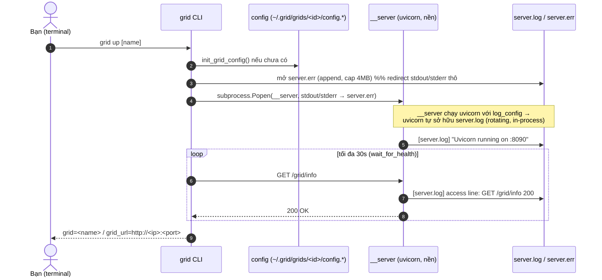
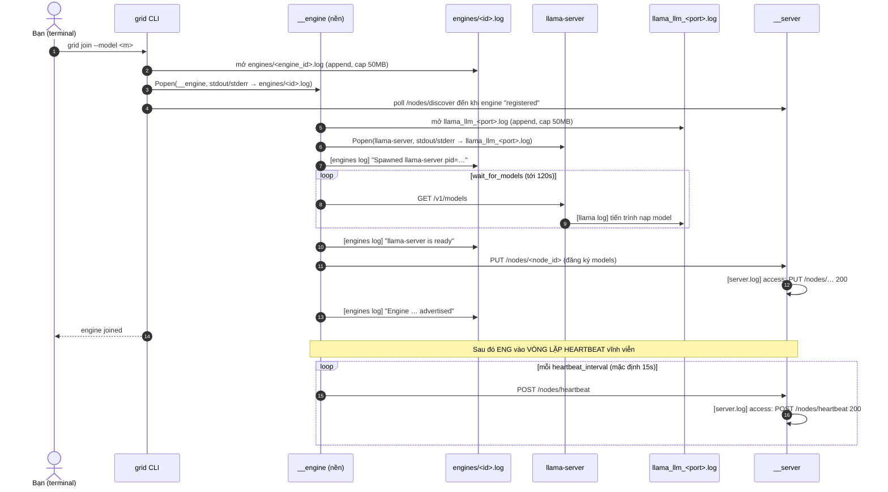
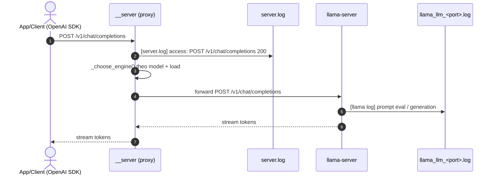
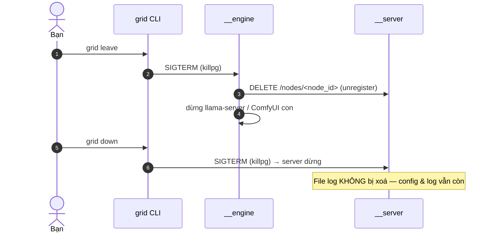

# Luồng Local Mode & Điểm ghi log

Tài liệu này mô tả *ai chạy cái gì* trong local mode và *log được ghi vào đâu, khi nào* — để dễ
hình dung khi debug hoặc khi lo về chuyện "log nhiều".

> Tóm tắt một dòng: local mode có **1 server** (uvicorn, chạy nền) + **N engine** (mỗi engine là 1
> tiến trình nền, tự spawn llama-server/ComfyUI). Mọi tiến trình nền đều ghi log ra file dưới
> `~/.grid/`. Server ghi **mỗi HTTP request** một dòng → đây là nguồn phình nhanh nhất.

---

## 1. Các tiến trình trong local mode

| Tiến trình | Vòng đời | Sinh ra bởi | Vai trò |
|---|---|---|---|
| `grid …` (CLI) | ngắn (chạy xong thoát) | bạn gõ lệnh | Đọc/ghi config, gọi HTTP tới server, spawn tiến trình nền |
| `grid __server <grid_id>` | **dài** (nền, detached) | `grid up` | uvicorn signaling server — sổ đăng ký engine + proxy `/v1/*` |
| `grid __engine <grid_id> <engine_id>` | **dài** (nền, detached) | `grid join` | Vòng lặp heartbeat; tự spawn llama-server / ComfyUI / media server |
| `llama-server` | dài | `__engine` | Backend LLM thật (OpenAI-compatible trên `:endpoint_port`) |
| `ComfyUI` | dài | `__engine` (nếu `--media`) | Backend sinh ảnh/video |
| `grid __media-server` | dài | `__engine` (nếu `--media`) | uvicorn nhỏ, cầu nối HTTP → ComfyUI |

`detached` = `start_new_session=True`: tiến trình nền **sống tiếp sau khi CLI thoát**. Vì thế chúng
phải ghi log ra **file** (không có terminal để in ra).

---

## 2. Set-up một grid local từ số 0

Đây là hành trình bạn thực sự gõ, từ máy trắng đến lúc gọi được model. Local mode = **mọi thứ chạy
trên máy bạn**, không cần đăng nhập, API key chỉ là placeholder `local-grid`.

### 2.1 Các bước (lệnh → làm gì → sinh ra tiến trình/log nào)

| # | Lệnh | Làm gì | Tiến trình nền | Log tạo ra |
|---|---|---|---|---|
| 1 | `grid mode local` | Ghi mode vào `~/.grid/state.json` (nhớ luôn) | — | — |
| 2 | `grid engine install llama.cpp` | Cài binary llama-server vào `~/.grid/engines` | — | — |
| 3 | `grid pull qwen36-35b-a3b-mtp` | Tải file model `.gguf` vào `~/.grid/models` (xem `grid catalog`) | — | — |
| 4 | `grid up` | Tạo grid `home` + **khởi động server** | `__server` | **`server.log`**, `server.err` |
| 5 | `grid join --serve <model>` | **Khởi động llama-server + engine** rồi đăng ký vào grid | `__engine` → `llama-server` | `engines/<id>.log`, `llama_llm_8081.log` |
| 6 | `grid chat -m <model> "…"` | Gửi thử 1 câu qua endpoint | — | +1 dòng `server.log` + log llama |
| 7 | `grid info --env` | In `OPENAI_*` để trỏ app OpenAI SDK vào grid | — | — |

> Bước 1–3 là **chuẩn bị một lần**. Bước 4–5 là cái tạo ra các tiến trình nền & file log. Từ bước 5,
> engine bắt đầu vòng lặp heartbeat 15s → `server.log` bắt đầu tăng đều (xem mục 4).

Lệnh xem trạng thái bất kỳ lúc nào:

```bash
grid ls                  # các grid đang có
grid engines             # engine nào đang join, còn sống không
grid models --verbose    # model nào chạy được, trên engine nào
grid info                # endpoint + số engine + models
```

Tắt: `grid leave` (gỡ engine) rồi `grid down` (tắt server). Config & log **vẫn được giữ**.

### 2.2 Sequence diagram: toàn bộ set-up



> **Biến thể `--at` (engine có sẵn):** nếu bạn đã chạy sẵn một engine OpenAI-compatible (vLLM,
> Ollama, MLX…) thì thay bước 5 bằng `grid join --at http://localhost:8000/v1 -m <model>`. Khi đó
> `__engine` **không** spawn llama-server (không có `llama_llm_*.log`) — nó chỉ đăng ký URL đó và
> heartbeat. Grid proxy sẽ forward thẳng tới engine của bạn.

---

## 3. Sequence diagram chi tiết từng lệnh

### 3.1 `grid up` — đưa grid online (khởi động server)



Điểm mấu chốt: `server.err` chỉ nhận **output thô lúc bootstrap/crash** (traceback trước khi uvicorn
kịp cấu hình logging). Còn `server.log` do **chính uvicorn** ghi qua rotating handler bên trong tiến
trình → đây là file chứa access log.

### 3.2 `grid join` — gắn engine vào grid (khởi động engine + llama)



> ⚠️ **Nguồn "log nhiều" ở trạng thái ổn định:** vòng lặp heartbeat. Mỗi engine gửi 1 request/15s →
> **~5.760 dòng access/ngày/engine** vào `server.log`, ngay cả khi không ai dùng grid. Cộng thêm
> health-check của desktop app. Đây chính là lý do `server.log` cần rotation.

### 3.3 Một request suy luận (client OpenAI → server → engine)



Mỗi lần gọi suy luận: **1 dòng** vào `server.log` (access) + log chi tiết của llama vào
`llama_llm_<port>.log`.

### 3.4 `grid down` / `grid leave` — tắt



---

## 4. Bảng: log ghi vào đâu, khi nào, bị chặn thế nào

Tất cả nằm dưới `~/.grid/` (override bằng biến môi trường `GRID_HOME`).

| File | Tiến trình ghi | Ghi **khi nào** | Cách chặn phình |
|---|---|---|---|
| `grids/<grid_id>/server.log` | `__server` (uvicorn) | **mỗi HTTP request**: health `/grid/info`, `/nodes` (register), `/nodes/heartbeat` (~15s/engine), `/nodes/discover`, proxy `/v1/chat`, `/v1/media/*` | **Rotating in-process** 100MB × 5 file, gzip. Guard cắt file cũ quá cỡ lúc khởi động |
| `grids/<grid_id>/server.err` | `__server` (redirect thô) | chỉ traceback bootstrap/crash trước khi uvicorn logging lên | Truncate lúc (re)start, cap 4MB |
| `run/engines/<grid_id>/<engine_id>.log` | `__engine` | các dòng `print()`: "Spawned llama-server", "advertised", lỗi heartbeat, unregister | Truncate lúc (re)start, cap 50MB |
| `logs/llama_llm_<port>.log` | `llama-server` | nạp model + mỗi request suy luận | Truncate lúc (re)start, cap 50MB |
| `logs/comfyui_<port>.log` | `ComfyUI` | khởi động + mỗi workflow sinh ảnh/video | Truncate lúc (re)start, cap 50MB |
| `logs/media_provider_<port>.log` | `__media-server` (uvicorn) | mỗi request media | Truncate lúc (re)start, cap 50MB |
| `logs/app.log`, `logs/app_cli.log` | **App desktop macOS (Swift)** — *không thuộc repo Python này* | vòng đời app, mỗi lần gọi CLI, kiểm tra update | Do app macOS quản lý |

### Hai kiểu chặn phình khác nhau

1. **Rotation thật trong tiến trình** — *chỉ* `server.log`. uvicorn là app do ta khởi động nên gắn
   được `GzipRotatingFileHandler`: khi file chạm 100MB → đổi tên + gzip thành `server.log.1.gz`,
   giữ 5 bản, xoá bản cũ nhất. Chặn tuyệt đối, kể cả tiến trình chạy hàng tháng.

2. **Truncate lúc (re)start** — các log engine/llama/ComfyUI/media. Đây là tiến trình *ngoài*, không
   gắn handler Python vào stdout của chúng được. Nên chỉ cắt file khi vượt cap **mỗi lần khởi động
   lại** (giữ ~2MB đuôi vào `<file>.oversized`). Chặn được qua các lần restart; nhưng **một tiến
   trình chạy liên tục rất lâu vẫn có thể phình file đang mở trong 1 phiên** — muốn chặn tuyệt đối
   phải thêm reader-thread bơm vào rotating handler (hiện chưa làm).

### Các nút chỉnh qua biến môi trường

| Biến | Mặc định | Tác dụng |
|---|---|---|
| `GRID_SERVER_LOG_MAX_BYTES` | 100 MB | Ngưỡng rotate của `server.log` |
| `GRID_SERVER_LOG_BACKUP_COUNT` | 5 | Số bản `.gz` giữ lại |
| `GRID_ENGINE_LOG_MAX_BYTES` | 50 MB | Cap cho engine/llama/ComfyUI/media log |
| `UVICORN_LOG_LEVEL` | `info` | Đổi thành `warning` để **bỏ hẳn** access log (giảm log mạnh nhất) |

> 💡 Muốn giảm log nhiều nhất mà không đụng code: đặt `UVICORN_LOG_LEVEL=warning`. Khi đó
> `server.log` không còn ghi mỗi heartbeat/health-check nữa, chỉ còn cảnh báo/lỗi.

---

## 5. Sơ đồ thư mục log

```
~/.grid/
├── grids/
│   └── <grid_id>/
│       ├── config.*              # cấu hình grid
│       ├── server.log            # ← uvicorn access log (ROTATING + gzip)
│       ├── server.log.1.gz …     # ← các segment đã xoay & nén
│       └── server.err            # ← crash bootstrap (cap 4MB)
├── run/
│   └── engines/
│       └── <grid_id>/
│           └── <engine_id>.log   # ← print() của __engine (cap 50MB)
└── logs/
    ├── llama_llm_<port>.log      # ← llama-server (cap 50MB)
    ├── comfyui_<port>.log        # ← ComfyUI (cap 50MB)
    ├── media_provider_<port>.log # ← media server (cap 50MB)
    ├── app.log                   # ← app macOS (ngoài repo)
    └── app_cli.log               # ← app macOS (ngoài repo)
```

Xem thêm chi tiết cơ chế rotation ở [shared/logging_setup.py](../shared/logging_setup.py).
