# Building Effective Local AI Agents: Design Patterns

Local AI is not cloud AI with the invoice removed. When inference runs on
machines you control, the system gains new freedoms—abundant attempts, private
data paths, exact model identity, owned idle time, and offline continuity—and
new constraints: finite memory, bandwidth, energy, heat, seats, and wall-clock.

Those forces change how an agent should be designed.

This is a pattern language for agents that reason, use tools, keep context,
coordinate workers, act on the world, and learn from outcomes on an owned
runtime. It combines the earlier model- and agent-orchestration catalogs into
one system. Their technical distinction remains important, but it no longer
requires two separate reader journeys:

> **Model workers produce evidence. Agents hold state, use tools, and may act.**
> The moment a worker can touch the world, the execution patterns in this
> language become mandatory.

The goal is not maximum autonomy. The goal is the smallest system that can
complete the work honestly: inside its boundary, within the current box, with
enough evidence, one bounded action, and a durable account of what happened.

## What local changes

| Owned advantage | New design question |
|---|---|
| **No marginal API bill or provider quota** | How much search, checking, and repair is useful before physical cost or delay outweighs the gain? |
| **Owned models and runtime** | Which exact build is resident, what fits now, and what must load or yield? |
| **Owned data path** | Can inference move to the data instead of moving raw data to a service? |
| **Owned idle time** | Which evaluation, indexing, training, or cache work may run without stealing foreground capacity? |
| **No mandatory network dependency** | Which complete useful workflows can survive disconnection? |
| **Persistent local sessions** | Which context should remain warm, recover after a crash, and be deleted on demand? |
| **Tools beside the model** | Which capabilities may be exposed, and which one result is allowed to act? |

Local tokens are **unmetered, not free**. Hardware, electricity, cooling,
memory bandwidth, queue delay, operator attention, and the consequence of a
bad action remain scarce. A good local-first design spends those resources
deliberately instead of pretending either that inference is infinite or that
every extra attempt is an API purchase.

## The agent, in one picture


The diagram contains four planes that belong to one system:

- **Reasoning plane:** route, chain, search, divide, compare, and repair model
  work until the required evidence exists.
- **Execution plane:** preserve sessions, expose typed tools, verify effects,
  allow one actor, and record durable state.
- **Runtime plane:** bind the logical workflow to exact model artifacts,
  residency, memory, seats, energy, and deadlines.
- **Sovereignty plane:** keep data, memory, logs, and dependencies inside the
  operator's chosen boundary and preserve a useful offline path.

Do not implement these as isolated middleware stacks. One request crosses all
four planes. The boundary limits the workflow; the consequence sets its proof
bar; the live box limits its physical form; the act gate limits its effect; and
verified outcomes alone may alter the next run.

## Start with the augmented local agent

The smallest useful building block is one admitted model with five explicit
attachments:

```text
model + scoped context + typed tools + durable state + policy
```

Start there. Add a workflow when the path is known in advance. Add an agentic
loop when the path cannot be known until intermediate results arrive. Add more
workers only when independent work, separate context windows, or a measurable
quality curve justifies them.

The common failure is to begin with a fleet. Multi-worker systems multiply
context, tool calls, latency, coordination work, and failure modes. Local
ownership makes that spend available; it does not make the spend wise.

## Pattern discipline

Every harness component encodes an assumption: the current model cannot plan
far enough, retain enough context, use a tool reliably enough, evaluate its own
work, or recover safely without that structure. Model capability changes, so
performance scaffolding must be removable and periodically ablated against a
simpler baseline.

Safety and sovereignty contracts are different. A stronger model does not make
an unauthorized data crossing legal, a duplicate write idempotent, an
unversioned artifact reproducible, or an in-memory event durable. Keep these two
classes distinct:

- **Performance patterns**—routing, search, councils, planner-workers, and
  repair loops—must demonstrate lift over one augmented agent and should be
  simplified when the lift disappears.
- **Integrity patterns**—typed tools, boundaries, act gates, artifact identity,
  durable sessions, verifiers, and ledgers—encode system authority and failure
  semantics. Model capability may simplify their implementation, but cannot
  replace their guarantees.

Prefer workflows when the route can be known before execution. Use an agentic
loop when the next step depends on observations made during the run. Prefer one
agent until independent work or separate context windows provide measurable
value.

## How this pattern language is written

A pattern is not a prompt, product feature, framework primitive, or clever
algorithm name. It captures a recurring **context**, a **problem** created by
conflicting **forces**, and a reusable arrangement that resolves those forces
with known **consequences**.

The form combines the generative pattern-language tradition with the
structured software catalog form. Every entry answers the same questions:

- **Intent** — the move and the result it buys.
- **Context** — the recurring situation in which the problem appears.
- **Problem** — the design conflict, independent of one implementation.
- **Forces** — the pressures that prevent a trivial answer.
- **Solution** — the invariant arrangement that resolves those forces.
- **Structure and participants** — the roles and their responsibilities.
- **Mechanics** — how one request moves through the collaboration.
- **Invariants** — what must remain true for this still to be the pattern.
- **Consequences** — benefits, liabilities, and the resulting context.
- **Applicability** — when to use it and when a simpler or different pattern
  is more honest.
- **Failure and safe exit** — the characteristic lie and the allowed non-success
  behavior.
- **Implementation** — practical refinements without tying the pattern to one
  framework.
- **Measure** — the baseline and signals that can falsify its value.
- **Evidence status** — what is established, emerging, or still a candidate.
- **Related patterns** — the larger language this pattern helps generate.

Patterns should be applied in sequence, not collected like features. Each
solution creates the context in which later patterns become useful.

## Choosing a pattern

Settle these contracts in order:

1. **Boundary:** What data, tools, logs, models, and fallbacks may cross the
   owned boundary?
2. **Consequence:** What happens if the answer or action is wrong, and which
   non-answer is acceptable?
3. **Workflow:** Is one read enough, is the path known, can work be divided, or
   is an adaptive agent loop required?
4. **Evidence:** Is there an objective oracle, an independent reviewer, or only
   uncertainty that must be disclosed?
5. **Physical plan:** Which exact builds, seats, memory, energy, and deadline
   make the workflow runnable now?
6. **Action:** Which one selected result may touch the world?
7. **Learning:** Which independently measured outcomes may change later
   routing, trust, context, or residency?

| Need | Reach for |
|---|---|
| One adequate answer | [Risk-Bounded Route](#1-risk-bounded-route) |
| A known sequence of transformations | [Typed Pipeline](#2-typed-pipeline) |
| Many constructible answers with an objective test | [Parallel Search](#3-parallel-search) |
| Independent judgment without a cheap oracle | [Independent Council](#4-independent-council) |
| A large task with separable responsibilities | [Orchestrator–Workers](#5-orchestratorworkers) |
| A failed check that provides useful feedback | [Verify and Repair](#6-verify-and-repair) |
| Long-lived but finite context | [Context Steward](#7-context-steward) |
| Work spanning requests, crashes, or context windows | [Durable Session](#8-durable-session) |
| Models that need external capabilities | [Typed Tool Boundary](#9-typed-tool-boundary) |
| Any world-touching side effect | [Single Act Gate](#10-single-act-gate) |
| A verdict that changes routing, trust, or release | [Ground-Truth Verifier](#11-ground-truth-verifier) |
| A new model, harness, prompt, or workflow | [Staged Trust](#12-staged-trust) |
| Decisions and outcomes that must survive | [Outcome Ledger](#13-outcome-ledger) |
| A logical plan that must fit real hardware | [Fit the Box](#14-fit-the-box) |
| Useful work that may consume only genuine slack | [Idle Shift](#15-idle-shift) |
| Sensitive data and controlled egress | [Privacy Boundary](#16-privacy-boundary) |
| A useful path with no network or vendor account | [Offline Island](#17-offline-island) |

---

## I. Shape the reasoning

### 1. Risk-Bounded Route

**Intent.** Choose the smallest admitted model or workflow that can meet the
request's evidence floor, then add effort only while measured uncertainty and
consequence justify it.

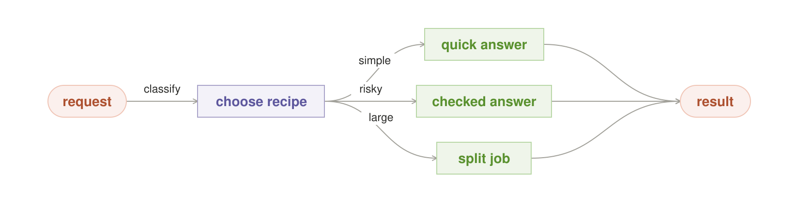

#### Context

The local roster contains models with different capabilities, warm states,
context limits, tool access, and hardware costs. Requests range from reversible
drafts to consequential actions. Several workflows could answer each request.

#### Problem

Always using the largest model wastes latency, memory, and energy. Always using
the warmest or smallest model mistakes availability for adequacy. Always using
a multi-agent workflow spends coordination without proving that the task needs
it. How should one request receive enough—not maximum—orchestration?

#### Forces

- Quality usually improves with stronger models, more context, or more checks.
- Warm small models reduce latency and avoid load churn.
- Consequence, not prompt length, determines the required evidence.
- Local attempts have no API meter but still occupy seats and delay other work.
- The route must obey privacy and tool policy before capability is considered.
- Confidence from the same model is weak evidence about that model's error.

#### Solution

**Classify boundary, consequence, task shape, and live capacity before work
begins. Select the smallest named recipe whose evidence contract meets the
request. Permit bounded escalation only on observable gaps.**

A recipe names its workers, tools, evidence rule, stop condition, safe exit,
and physical budget. It is not a floating prompt. A cheap route may be one warm
read. A risky route may be Parallel Search followed by a Ground-Truth Verifier
and one Act Gate.

#### Structure and participants

- **Request classifier** assigns data class, task shape, consequence, deadline,
  and allowed outcome.
- **Recipe registry** stores versioned workflows and their evidence contracts.
- **Roster** exposes exact admitted models, harnesses, tools, and warm state.
- **Effort controller** may widen or deepen only within a declared budget.
- **Decision record** explains the chosen route and any degradation.

#### Mechanics

1. Reject routes that violate the boundary or lack the required act contract.
2. Determine the proof floor from the cost of error.
3. Choose the smallest recipe expected to meet that floor on the live roster.
4. Bind it through Fit the Box.
5. Run it and inspect registered evidence gaps—not self-reported confidence.
6. Escalate, answer, defer, or refuse at the declared boundary.

#### Invariants

- Boundary and consequence are evaluated before model preference.
- Every route resolves to exact versioned participants before execution.
- Escalation has a maximum depth, deadline, or physical budget.
- A degraded route discloses the evidence floor it could not meet.
- Verified outcomes, not popularity or eloquence, update later routing.

#### Consequences

Simple work remains fast while difficult or consequential work can spend more.
The price is a maintained recipe registry, calibrated routing data, and more
observable state. A bad classifier can create systematic under-spend, so the
single-read baseline and route-specific failure rates must remain visible.

#### Applicability

Use it whenever more than one model, harness, or workflow could serve a request.
Avoid learned routing when the roster is tiny and one static rule is clearer.
Do not use adaptive effort where no observable evidence can justify another
round; choose a fixed budget and disclose uncertainty instead.

#### Failure and safe exit

The characteristic failure is routing by a cheap proxy—prompt length, model
confidence, or current warmth—that does not predict adequacy. The safe exit is
an explicit stronger route, defer, or refusal; never quietly lower the proof
bar because the preferred model is unavailable.

#### Implementation

Begin with a small decision table. Record route id, participant contracts,
boundary decision, evidence floor, predicted and actual physical cost, outcome,
and verifier result. Add learned routing only after enough verified outcomes
exist, with decay and exploration bounded by policy.

#### Measure

Compare with one fixed-route baseline. Track verified success, abstention,
policy denial, escalation, p50/p99 latency, load churn, tokens, seat-seconds,
joules, and regret by request class.

#### Evidence status

Routing and consequence-based assurance are established mechanisms. A learned
router over a changing owned roster remains an emerging local operating policy.

#### Related patterns

Typed Pipeline, Parallel Search, Independent Council, Orchestrator–Workers, Fit
the Box, Privacy Boundary, Ground-Truth Verifier, and Outcome Ledger.

### 2. Typed Pipeline

**Intent.** Decompose a known workflow into stages with explicit input, output,
validation, and failure contracts.

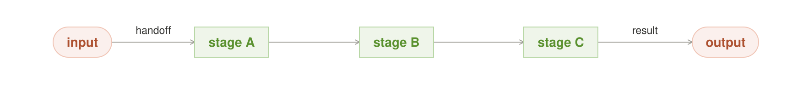

#### Context

The work is naturally sequential: retrieve, extract, transform, check, publish;
or inspect, plan, edit, test, review. Later stages depend on artifacts produced
by earlier ones, and each stage may suit a different model or tool.

#### Problem

One giant prompt hides intermediate contracts and makes failures hard to locate.
An unconstrained agent loop may reorder required steps, skip validation, or
carry an ever-growing transcript. How can the workflow remain inspectable and
recoverable without removing useful model judgment inside each stage?

#### Forces

- Clear stages improve observability and allow specialist models.
- Every boundary adds serialization, latency, schema work, and failure handling.
- Free-form prose is easy to produce but brittle to consume.
- Replaying the whole pipeline wastes successful earlier work.
- Context should contain the artifact needed now, not the entire history by
  default.

#### Solution

**Represent the workflow as a directed sequence of typed stage contracts. A
stage consumes a versioned artifact, performs one responsibility, validates its
output, and commits it before the next stage begins.**

#### Structure and participants

- **Stage contract** names input schema, output schema, tools, model role,
  timeout, validator, and safe exit.
- **Artifact store** preserves immutable intermediate results and provenance.
- **Pipeline runner** schedules stages, retries only idempotent work, and
  resumes from the last valid checkpoint.
- **Context builder** supplies the minimum stage-local context.

#### Mechanics

Resolve the pipeline version, validate the initial input, and run each stage in
order. Commit a stage result only after its schema and semantic checks pass.
Later stages receive the committed artifact plus necessary provenance, not an
unbounded hidden transcript. On failure, retry that stage, route to repair, or
stop at its declared exit.

#### Invariants

- Every edge carries a named artifact contract.
- A downstream stage never reads an uncommitted upstream draft.
- Replays are idempotent or protected by the Single Act Gate.
- Pipeline version and artifact provenance survive the run.
- Stages may use agentic loops internally, but the outer ordering remains fixed.

#### Consequences

Failures become local, intermediate work becomes reusable, and models can be
specialized per stage. The cost is schema evolution, more storage, and latency
from serialization. Excessive stages turn judgment into bureaucracy.

#### Applicability

Use it when order is known and intermediate artifacts are meaningful. Prefer
Orchestrator–Workers when decomposition depends on discoveries made during the
run. Prefer one model call when no intermediate contract earns its overhead.

#### Failure and safe exit

The characteristic failure is passing persuasive prose where a typed artifact
was required. Stop at the failing stage with its evidence; do not let a later
model guess what the upstream stage meant.

#### Implementation

Use content-addressed artifacts, schema versions, idempotency keys, stage-local
deadlines, and explicit compensation for unavoidable side effects. Keep prompts
inside stage contracts rather than making prompt text the pipeline definition.

#### Measure

Track end-to-end and per-stage verified success, latency, retries, cache hits,
schema failures, resume success, context size, and the fraction of failures
localized without replaying earlier stages.

#### Evidence status

Pipeline and prompt-chaining structures are established. The local advantage is
mainly low-jitter stage loops, private artifacts, and the ability to bind each
stage to exact owned models.

#### Related patterns

Risk-Bounded Route selects the pipeline. Context Steward curates stage context.
Verify and Repair may wrap a stage. Durable Session is useful when a stage spans
multiple context windows.

### 3. Parallel Search

**Intent.** Generate meaningfully different candidates, judge all of them with
one objective oracle, and keep one proven winner.

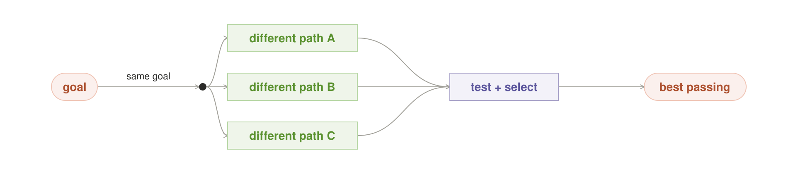

#### Context

Constructing a solution is hard, but checking one is cheap and objective. Code
has tests, a plan has a simulator, a configuration has a validator, a query has
expected invariants, or an optimization candidate has a measurable score.

#### Problem

A single model attempt is brittle. Asking for more attempts can improve the
chance of success, but correlated copies waste capacity and majority agreement
does not prove correctness. How should owned inference abundance become useful
search rather than repeated guessing?

#### Forces

- More independent attempts raise the chance that at least one succeeds.
- Local attempts have no per-call invoice but consume finite physical capacity.
- Model families, prompts, seeds, and decompositions often share failure modes.
- Early winners reduce latency; premature selection may miss a better result.
- Only an oracle independent of the candidates can certify success.

#### Solution

**Pre-register a bounded set of distinct approaches. Run them read-only,
evaluate every candidate with the same independent oracle, and select exactly
one passing result according to a declared rule.**

If a candidate nearly passes and the oracle supplies actionable evidence,
handoff to Verify and Repair. If no candidate passes, return the evidence and
defer.

#### Structure and participants

- **Search plan** specifies attempt count, diversity dimensions, budget, and
  early-stop rule.
- **Candidate workers** construct independently and cannot act.
- **Diversity gate** rejects duplicated lineage or strategy before execution.
- **Oracle** tests candidates without reading their confidence or popularity.
- **Selector** chooses one passing artifact by a registered secondary rule.

#### Mechanics

Create distinct approach ids, schedule them concurrently or in waves through
Fit the Box, run the same oracle, and cancel remaining work only when the
registered early-stop condition is satisfied. Preserve every test result. Pass
one winner to the Act Gate or return the failure set.

#### Invariants

- Attempt width is bounded before or by an observable stop rule.
- Diversity is structural, not merely different wording.
- All candidates face the same oracle and data revision.
- Candidate workers remain read-only.
- No passing candidate means no winner.

#### Consequences

Local abundance directly buys a higher chance of verified success and exposes
multiple failure modes. The cost is queue delay, energy, memory pressure, and
correlated waste. A broad serial search on one accelerator may be slower than a
stronger single attempt.

#### Applicability

Use it when verification is cheap and objective. Avoid it for subjective
judgment without a defensible oracle; use Independent Council and disclose
uncertainty. Avoid it when attempts cannot be made meaningfully different.

#### Failure and safe exit

The characteristic lie is calling the most popular or highest-confidence
candidate “verified.” The safe exit is evidence plus defer when the fixed
budget expires without a pass.

#### Implementation

Vary algorithms, decompositions, model lineages, retrieval paths, or tool
strategies. Record attempt ids and cancel cooperatively. Schedule from live
capacity; “parallel” describes independence, not a promise that all attempts
co-reside.

#### Measure

Compare pass@1, pass@N, and verified-pass@N on held-out tasks. Track marginal
gain by attempt, correlation, time to first pass, total seat-seconds, joules,
queue impact, and false acceptance by the oracle.

#### Evidence status

Search-and-verify is established. Its normal use as a frequent local quality
policy is emerging and should be justified by measured quality curves.

#### Related patterns

Risk-Bounded Route sizes the search. Fit the Box places it. Verify and Repair
uses near-pass evidence. Ground-Truth Verifier owns the oracle. Single Act Gate
releases one result.

### 4. Independent Council

**Intent.** Obtain genuinely independent judgments, expose disagreement, and
combine them with a rule that permits abstention.

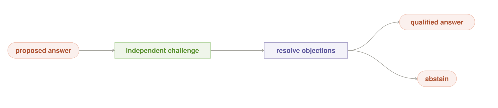

#### Context

The question matters, but no cheap objective oracle exists. Several models or
agents can inspect the same evidence from different lineages, roles, or methods.
Examples include review, forecasting, ambiguous classification, and policy
interpretation.

#### Problem

One reader may miss an issue. More readers may all repeat the same prior. A vote
can turn correlated error into false confidence, while open discussion can
anchor later participants on the first answer. How can multiple judgments add
evidence without pretending that agreement is truth?

#### Forces

- Independent reads can reveal ambiguity and rare failure modes.
- Shared training data, prompts, retrieval, or judges create correlation.
- Voting is clear for discrete choices but weak for open-ended answers.
- Debate improves critique but can reward rhetoric and conformity.
- Consequential disagreement should produce more evidence or abstention.

#### Solution

**Collect judgments independently before exposure to one another. Require
declared diversity, preserve minority objections, and combine results with a
task-appropriate rule that includes abstention. Add a tiebreaker only when it
introduces new evidence.**

#### Structure and participants

- **Independent readers** have isolated initial context and named lineages.
- **Diversity gate** checks model, prompt, retrieval, and method dependence.
- **Pooler** applies majority, median, robust weighting, anonymous revision, or
  one-round challenge according to the output type.
- **Tiebreaker** is a tool or divergent judge, never another correlated copy.
- **Decision record** retains the split and unresolved objections.

#### Mechanics

Pre-register the question, roster, output schema, and pooling rule. Collect
private first reads. Reject or down-weight duplicated evidence paths. Pool
discrete labels, numeric estimates, or structured objections appropriately.
When the result remains split, seek new evidence or abstain.

#### Invariants

- First judgments are independent and timestamped before discussion.
- The pooling rule is chosen before reading preferred answers.
- Agreement is a consistency signal, not proof.
- Material minority objections survive the summary.
- The council never grants permission to act.

#### Consequences

The system becomes less dependent on one read and makes uncertainty visible.
It spends more context and coordination and may still share blind spots. Honest
abstention can lower apparent answer rate while improving trustworthiness.

#### Applicability

Use it when judgment is unavoidable and independent perspectives are
available. Prefer Parallel Search when an objective oracle exists. Prefer one
expert route when the supposed council cannot be made diverse.

#### Failure and safe exit

The characteristic failure is unanimous correlated error. The safe exit is a
qualified answer with preserved objections, a new evidence source, escalation,
or abstention—not another vote from the same lineage.

#### Implementation

Use anonymous first rounds for estimates, median or trimmed means for numeric
outputs, majority only for well-defined discrete labels, and one independent
skeptic for high-value prose. Calibrate readers on held-out outcomes before
assigning weights.

#### Measure

Track accuracy and calibration against one-reader baselines, disagreement,
abstention, minority-correct cases, pairwise error correlation, diversity-gate
rejection, and cost per corrected error.

#### Evidence status

Voting, robust ensembles, Delphi-style estimation, and independent review are
established. Treat any specific council roster and pooling policy as an
empirical design, not a universal truth mechanism.

#### Related patterns

Parallel Search when an oracle exists; Ground-Truth Verifier when a factual
authority can be introduced; Staged Trust before a new reader gains weight;
Single Act Gate before any selected recommendation acts.

### 5. Orchestrator–Workers

**Intent.** Let one planner decompose an open-ended task into named,
independently executable responsibilities, then synthesize their artifacts.

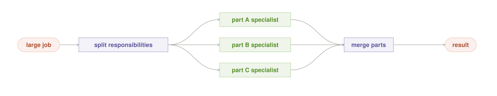

#### Context

The work is too broad for one context window or contains several responsibilities
that can proceed independently: research directions, repository components,
data partitions, expert reviews, or tool domains. The decomposition depends on
the request and may not be known at design time.

#### Problem

A single agent becomes context-bound and sequential. A fixed pipeline cannot
express decomposition discovered during the run. Naive delegation duplicates
work, creates vague assignments, and returns summaries that cannot be checked
or synthesized. How can extra workers add capacity without losing ownership of
the whole task?

#### Forces

- Separate context windows add reasoning and retrieval capacity.
- Parallel work helps only when responsibilities are truly separable.
- Delegation consumes tokens, tools, seats, and synthesis attention.
- Workers need enough context to act but not the entire parent transcript.
- A planner can under-specify tasks or spawn recursively without bound.
- Workers that can mutate the world multiply blast radius.

#### Solution

**Give one orchestrator ownership of the plan and final synthesis. Delegate
bounded tasks with explicit scope, deliverable, tools, budget, and done
condition. Keep workers read-only unless one later crosses the Act Gate.**

#### Structure and participants

- **Orchestrator** plans, assigns non-overlapping responsibilities, monitors,
  and synthesizes.
- **Worker contract** names goal, context slice, allowed tools, output schema,
  budget, dependencies, and completion evidence.
- **Workers** explore independently and return artifacts with provenance.
- **Task graph** represents dependencies and cancellation.
- **Synthesizer** reconciles artifacts and preserves unresolved conflicts.

#### Mechanics

The orchestrator first states a plan and identifies work that can proceed
without shared mutable state. It issues bounded contracts, schedules them
through Fit the Box, and watches for duplication, failure, or missing evidence.
Workers return compact artifacts and source references. The orchestrator checks
coverage, resolves conflicts, and produces one candidate result.

#### Invariants

- Every worker has a non-overlapping responsibility and explicit done condition.
- Fan-out depth, width, tool calls, and physical spend are bounded.
- Workers return artifacts and provenance, not only narrative summaries.
- Shared mutable state has one owner.
- Redundant workers are read-only; one selected actor may act later.

#### Consequences

The system gains breadth, specialization, and separate context windows. It also
introduces coordination failure, synthesis bottlenecks, duplicated searches,
and high spend. Tasks with tight cross-dependencies may perform worse than one
coherent agent.

#### Applicability

Use it for breadth-first work, separable components, or tasks exceeding one
context window. Prefer Typed Pipeline for a fixed order. Prefer one Durable
Session when most work depends on shared evolving context.

#### Failure and safe exit

The characteristic failure is delegation theater: many workers receive vague
copies of the same task and return overlapping prose. The safe exit is to stop
spawning, surface incomplete responsibilities, synthesize only supported
coverage, and defer the rest.

#### Implementation

Make task contracts machine-readable. Include parent id, worker id, scope,
input artifact digests, expected output, allowed tools, deadline, and return
budget. Give the orchestrator a coverage table. Favor shallow fans; recursive
delegation requires a stricter global budget.

#### Measure

Compare with one strong agent. Track verified task success, coverage,
duplication, critical-path latency, total tokens and tool calls, seat-seconds,
synthesis time, orphaned work, and errors introduced at handoff boundaries.

#### Evidence status

Planner-worker decomposition is established, and multi-agent breadth has
documented value on suitably parallel work. General real-time coordination on
highly dependent tasks remains unreliable and expensive.

#### Related patterns

Risk-Bounded Route chooses the fan. Context Steward constructs worker slices.
Fit the Box schedules seats. Ground-Truth Verifier checks returned artifacts.
Single Act Gate prevents an N-worker fan from becoming N actors.

### 6. Verify and Repair

**Intent.** Turn concrete check failures into bounded repair attempts, and
release only a result that passes the registered verifier.

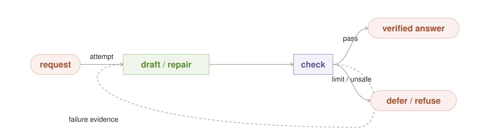

#### Context

A candidate can be checked by tests, schemas, compilers, constraints,
simulators, policy engines, or an independent evaluator with concrete criteria.
A failure explains something actionable about how the candidate is wrong.

#### Problem

One-shot generation wastes useful feedback. Unbounded self-correction can loop,
overfit the checker, or change unrelated behavior. How can failure evidence
improve a candidate without weakening the release condition?

#### Forces

- Tight local model-tool loops avoid WAN jitter and per-retry billing.
- A useful verifier is narrower and more authoritative than the generator.
- Repairs may fix one check while regressing another.
- Repeated access to hidden tests can leak or overfit the evaluation.
- Some failures are unsafe or non-repairable and should stop immediately.

#### Solution

**Register the verifier and repair budget before generation. On failure, return
minimal concrete evidence to a repair worker, re-run the complete required
check set, and stop only on pass, exhaustion, or a hard safety condition.**

#### Structure and participants

- **Generator/repairer** proposes the draft and bounded revisions.
- **Verifier** produces pass or typed failure evidence.
- **Repair policy** limits rounds, changed scope, and test disclosure.
- **Regression set** rechecks previously passing requirements.
- **Release gate** accepts only a passing artifact.

#### Mechanics

Generate, check, classify the failure, and decide whether policy permits repair.
Provide the smallest useful failure slice. Apply a scoped change, then run the
full release suite. Stop on pass, budget, deadline, repeated failure signature,
or unsafe behavior.

#### Invariants

- The generator cannot alter the verifier or release threshold.
- Every repair is traceable to concrete evidence.
- The complete required suite runs before release.
- Repair depth and changed scope are bounded.
- No pass means no release.

#### Consequences

Verification becomes ordinary control flow and local abundance buys reliability.
Latency and compute rise, and a weak checker can produce perfectly optimized
wrongness. The quality of the loop is bounded by the authority of its verifier.

#### Applicability

Use it when failure evidence is specific and actionable. Prefer Parallel Search
when independent reconstruction is more promising than repair. Avoid it when
the “verifier” is merely the same model restating confidence.

#### Failure and safe exit

The characteristic failure is evaluator capture: the repairer learns to satisfy
a proxy while violating intent. Stop on repeated signatures, guardrail failure,
or exhausted budget and return the evidence, not an unverified draft.

#### Implementation

Separate generator and verifier permissions. Hash check definitions. Use
property tests and held-out cases where possible. Restrict repair diffs,
preserve checkpoints, and add circuit breaking for toxic failure classes.

#### Measure

Track pass@1, final verified pass rate, repairs per success, regression rate,
failure-signature recurrence, oracle false acceptance, time to pass, and
physical cost versus a fresh-attempt baseline.

#### Evidence status

Evaluator-optimizer and test-repair loops are established. The local operating
point—making repair routine rather than exceptional—should still be measured
per task family.

#### Related patterns

Parallel Search may supply a near-pass. Ground-Truth Verifier defines authority.
Outcome Ledger records failures without turning them into trusted memories.
Single Act Gate releases one passing effect.

---

## II. Hold context and authority

### 7. Context Steward

**Intent.** Curate the smallest useful context for the current step while
keeping durable memory private, attributable, fresh, and deletable.

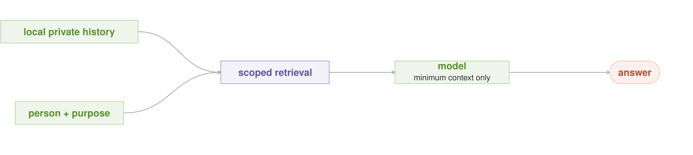

#### Context

An agent operates over many turns and may draw from messages, retrieved files,
tool results, instructions, working notes, user preferences, project decisions,
and prior outcomes. The possible context grows without bound; the model window
does not.

#### Problem

Passing everything creates context pollution, stale assumptions, privacy leaks,
high latency, and attention competition. Passing too little makes the agent
repeat work or act without necessary facts. How should an agent decide what to
remember, retrieve, compact, and forget?

#### Forces

- More context can improve recall but reduce effective attention.
- Durable personal and organizational memory creates privacy and deletion
  obligations.
- Summaries save tokens but can erase provenance, uncertainty, and reversals.
- Tool definitions and large results can crowd out task evidence.
- Context changes every turn; a one-time prompt design cannot govern it.
- Different workers and stages need different slices of the same history.

#### Solution

**Treat context construction as a policy-controlled runtime operation. Build a
fresh, purpose-scoped context package for every inference step from immutable
sources, compact working state, on-demand tools, and explicitly authorized
memory. Preserve provenance and validity separately from the summary.**

#### Structure and participants

- **Context manifest** names purpose, subject, sources, revisions, cutoff time,
  token budget, and omissions.
- **Working state** holds current goals, plan, completed work, open questions,
  and artifact pointers.
- **Memory store** keeps durable records with scope, source, validity, and
  deletion semantics.
- **Retriever** selects the minimum authorized slice.
- **Compactor** produces a smaller representation without becoming the source
  of truth.
- **Tool catalog** exposes relevant capabilities on demand.

#### Mechanics

Authenticate the subject and purpose, compute allowed scopes, retrieve current
sources, and rank them by utility and freshness. Include system constraints,
task state, essential evidence, and only the tools needed for this step. When
the window approaches its bound, checkpoint structured state before compacting
prose. Later steps can expand from source artifacts rather than repeatedly
summarizing summaries.

#### Invariants

- Every context item has a source, scope, purpose, and revision or timestamp.
- A classifier may narrow access but never grant authorization.
- Compaction does not replace authoritative artifacts or the Outcome Ledger.
- Memory deletion and source correction invalidate derived context.
- Tool discovery is lazy; irrelevant tool schemas do not occupy the window.
- A worker receives only the context its contract requires.

#### Consequences

Agents sustain longer work with less pollution and can personalize without
centralizing private history. The price is retrieval policy, provenance,
invalidations, and debugging a context package that changes each step.

#### Applicability

Use it for every multi-turn or memory-bearing agent. A one-shot model with a
small static prompt may not need durable memory, but it still benefits from an
explicit context manifest when sensitive sources are involved.

#### Failure and safe exit

The characteristic failure is a confident answer grounded in stale,
unauthorized, or recursively summarized context. Drop the suspect item,
disclose the missing source, retrieve again under policy, or defer.

#### Implementation

Separate working notes, durable memory, immutable artifacts, and the event
ledger. Store pointers and provenance before prose. Use purpose ids, source
revisions, freshness windows, token budgets, on-demand tool search, and a
human-visible “why this context” trace.

#### Measure

Track task success against context tokens, retrieval precision and recall,
stale-use incidents, scope denials, deletion propagation, compaction loss,
tool-schema load, context cache hits, and failures resolved by source expansion.

#### Evidence status

Retrieval, compaction, structured notes, and external memory are established
techniques. Purpose-limited private memory with end-to-end deletion remains an
emerging local contract.

#### Related patterns

Typed Pipeline uses stage-local packages. Orchestrator–Workers uses worker-local
slices. Durable Session checkpoints working state. Privacy Boundary authorizes
retrieval and egress. Outcome Ledger remains the durable fact source.

### 8. Durable Session

**Intent.** Preserve the useful identity and working state of an agent across
requests, context windows, preemption, and crashes through explicit lifecycle
transitions.


#### Context

An agent may work for minutes, hours, or days. It has a task identity, context,
open artifacts, tool state, leases, and permissions. Local models and harnesses
may remain resident, be evicted, yield to foreground work, or restart after a
power loss.

#### Problem

Treating each request as stateless wastes accumulated context. Treating a
process as immortal makes state unrecoverable and permissions linger. A handoff
between harnesses is not equivalent to resuming the same session. How should
agent continuity become explicit, recoverable state?

#### Forces

- Warm sessions reduce latency and repeated context construction.
- Resident sessions consume scarce memory and seats while idle.
- Long tasks exceed context windows and process lifetimes.
- A crash can separate external effects from in-memory beliefs.
- Handoffs lose hidden state and change tool semantics.
- Credentials and leases must end even when memory remains useful.

#### Solution

**Give every agent session a durable identity and a small lifecycle: spawn,
warm, checkpoint, resume or handoff, and kill. Persist structured task state and
artifact pointers before yielding; reacquire permissions and physical leases on
resume.**

#### Structure and participants

- **Session id** ties context, artifacts, decisions, and acts to one task life.
- **Session manifest** names harness, model contract, tool policy, owner, and
  current lifecycle state.
- **Checkpoint** stores goal, plan, completed work, open work, artifact digests,
  and last durable event.
- **Lifecycle manager** allocates, warms, snapshots, resumes, hands off, and
  kills.
- **Lease manager** controls seats, tools, credentials, and working directories.

#### Mechanics

Spawn from a versioned manifest. Warm only after admission. Before context
reset, preemption, eviction, or planned handoff, commit a checkpoint and append
its digest to the ledger. Resume the same session only after validating the
checkpoint and reacquiring current policy and leases. A cross-harness handoff
creates a new session linked to the old one; it never claims invisible state
survived.

#### Invariants

- Session identity is independent of one process or context window.
- Every externally visible act is durable before the session reports success.
- Checkpoints contain structured state and artifact references, not only prose.
- Resume revalidates policy, model identity, tools, and physical capacity.
- Kill revokes leases and credentials; retained memory has separate policy.
- A handoff discloses which state could not be transferred.

#### Consequences

Long-running agents become recoverable and warm context can be reused. The
system now needs lifecycle reconciliation, schema evolution, checkpoint tests,
and garbage collection. Stale sessions can occupy capacity or retain authority
unless expiry is enforced.

#### Applicability

Use it when work spans requests, context windows, restarts, or foreground
preemption. Prefer a stateless model read when no task state needs to survive.

#### Failure and safe exit

The characteristic failure is “resume” from an unaudited transcript while
assuming tools, policy, files, or external state are unchanged. Reconcile from
the Outcome Ledger, reopen artifacts by digest, and defer if the state cannot
be made consistent.

#### Implementation

Use explicit lifecycle state transitions, monotonic checkpoint revisions,
content-addressed artifacts, renewable leases, TTLs, idempotent resume, and a
reconciler that compares session belief with external facts after a crash.

#### Measure

Track cold versus warm latency, checkpoint duration and size, successful
resume, stale-session occupancy, handoff loss, duplicate acts after recovery,
lease leaks, and useful work preserved after forced termination.

#### Evidence status

Durable workflow and actor lifecycles are established. Session-aware local
model residency and cross-harness handoff remain emerging implementations.

#### Related patterns

Context Steward defines checkpoint content. Fit the Box governs residency.
Idle Shift requires preemptible checkpoints. Single Act Gate and Outcome Ledger
make recovery safe.

### 9. Typed Tool Boundary

**Intent.** Expose external capabilities through narrow, discoverable, typed
interfaces that separate model reasoning from execution and route every
mutation through explicit authority.

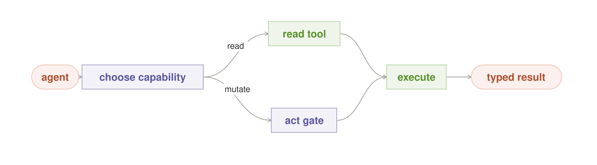

#### Context

An agent needs files, search, databases, code execution, browsers, devices, and
business APIs. A real system may have hundreds of possible operations, large
schemas, verbose results, different execution environments, and both read-only
and mutating capabilities.

#### Problem

Loading every tool definition consumes the context needed for the task. Generic
shells and broad APIs are hard for models to use reliably and expose a large
blast radius. Tool results can flood context, hide provenance, or blur whether
an operation only observed state or changed it. How should reasoning reach the
world through a stable, safe, context-efficient interface?

#### Forces

- Models choose tools better when names, inputs, and results match task concepts.
- Large tool catalogs and intermediate results compete for finite context.
- Broad capabilities are flexible but difficult to authorize and evaluate.
- Execution environments fail independently of the model and session.
- Read, simulate, propose, and mutate require different authority.
- Tool interfaces should remain stable as models, harnesses, and execution
  backends change.

#### Solution

**Separate the reasoning loop from execution behind a catalog of small typed
capabilities. Discover and load tools on demand. Classify every operation as
read, simulate, or mutate; require the Single Act Gate for mutation. Return
compact typed results plus handles to full artifacts and provenance.**

#### Structure and participants

- **Capability catalog** provides name, intent, input/output schema,
  consequence class, cost, latency, and execution location.
- **Discovery tool** searches the catalog without loading every definition.
- **Executor** maps one stable capability contract to a local process, remote
  service, device, or sandbox.
- **Policy adapter** binds identity, data labels, credentials, and the Act Gate.
- **Result envelope** carries status, typed data, artifact handles, provenance,
  side-effect receipt, and retry guidance.
- **Evaluator** tests whether agents can find and use the capability correctly.

#### Mechanics

The agent first searches or filters the catalog using the task and current
context. It loads only the selected contract, validates arguments before
execution, and resolves the allowed execution location. Read and simulation
calls run under read-only credentials. A mutation becomes an act request. The
executor returns a bounded result envelope; large bodies stay in an artifact
store and enter context only when explicitly read.

#### Invariants

- Tool name and schema express one coherent task-level capability.
- Inputs and outputs validate at the boundary; prose is not an implicit API.
- Read-only and mutating credentials are physically distinct.
- Tool discovery does not itself grant permission.
- Execution may fail or move without destroying the reasoning session.
- Large results remain addressable artifacts with provenance, not unbounded
  transcript text.
- Every mutation returns an external receipt or an explicit unknown state.

#### Consequences

Agents use tools more reliably, context stays focused, and execution backends
can evolve independently of reasoning. The system pays for catalog curation,
schema/version management, result storage, policy adapters, and tool-specific
evals. Too many tiny tools can make planning harder; one giant tool recreates
the original problem.

#### Applicability

Use it whenever a model reaches external data, code, or side effects. A small
fixed workflow with one local function still benefits from typed input and
output, but may not need dynamic discovery.

#### Failure and safe exit

The characteristic failure is an agent given a generic shell, broad credential,
or giant tool catalog and expected to infer safety from descriptions. Deny the
operation, narrow the capability, return validation evidence, or require a
human-controlled tool path.

#### Implementation

Design tools around natural task divisions rather than raw backend endpoints.
Use JSON Schema or equivalent validation, stable semantic versions, capability
search, least-privilege credentials, sandboxed code execution, artifact
handles, pagination, structured errors, timeouts, cancellation, idempotency,
and replayable tool evals.

#### Measure

Track tool-selection accuracy, schema-validation failures, unnecessary tool
calls, context tokens loaded for definitions and results, execution latency,
read/mutate misclassification, policy denials, unknown outcomes, recovery from
tool failure, and success on held-out tool-use tasks.

#### Evidence status

Typed interfaces, capability security, lazy discovery, process isolation, and
structured errors are established. Model-friendly tool catalog design and
large-scale dynamic discovery remain fast-moving empirical practices.

#### Related patterns

Context Steward controls tool visibility and result expansion. Single Act Gate
controls mutations. Privacy Boundary controls execution location and data
release. Durable Session survives executor failure. Ground-Truth Verifier uses
tools without giving their model callers authority over results.

### 10. Single Act Gate

**Intent.** Allow exactly one selected, authorized, idempotent mutation after
any number of read-only workers have proposed what to do.


#### Context

One or more model workers or agents can inspect data, propose changes, review
alternatives, or simulate actions. At least one candidate result may write a
file, send a message, call a mutating API, change a website, deploy code, or
otherwise alter durable state.

#### Problem

Parallel reasoning is often safe; parallel side effects are not. If every
worker can act, search width multiplies blast radius, races, duplicate messages,
and conflicting writes. A prompt saying “do not act” is not enforcement.

#### Forces

- More read-only workers can improve evidence.
- Tool access is often bundled with a harness rather than granted per step.
- Failures and retries can repeat an already completed effect.
- Some actions require approval, separation of duties, or a fresh policy check.
- Selection and execution may occur on different machines or at different
  times.
- Useful autonomy needs a narrow path to act, not universal tool denial.

#### Solution

**Run redundant workers without mutation capability. Select one result, then
grant one actor a narrow capability for one idempotent, decision-keyed action.
Revalidate policy and preconditions immediately before commit.**

#### Structure and participants

- **Read-only workers** gather evidence, simulate, and propose.
- **Selector** chooses one candidate under a registered rule.
- **Act request** names decision id, action type, target, arguments, expected
  state, policy revision, and evidence digest.
- **Gate** authenticates, authorizes, checks idempotency and preconditions, and
  grants a single-use capability.
- **Actor** performs the action and records the outcome.

#### Mechanics

Workers produce proposals incapable of mutation. The selector creates one act
request. The gate checks current identity, consequence, evidence, target state,
and whether this decision id already committed. It issues the smallest
capability needed. The actor executes once, captures the external receipt, and
appends it to the Outcome Ledger before reporting success.

#### Invariants

- Fan size does not increase the number of actors.
- Read-only is mechanically enforced at tools, filesystem, network, or
  credential boundaries.
- One decision id maps to at most one committed semantic effect.
- Selection does not itself grant authority.
- Preconditions and policy are checked at act time, not only at planning time.
- The outcome, including uncertainty, is durably recorded.

#### Consequences

Reasoning can fan broadly while side-effect risk stays bounded. The price is
capability plumbing, idempotency design, approval latency, and an explicit
semantic boundary around each action. Some legacy tools cannot be made narrow
enough and must remain outside autonomous use.

#### Applicability

Use it for every world-touching action, even with one agent. A read-only answer
does not need an act capability. A workflow with multiple independent actions
needs one separately keyed gate crossing per action, not one blanket approval.

#### Failure and safe exit

The characteristic failure is a “read-only” worker that still holds a write
credential or unrestricted shell. Deny the plan when enforcement is absent.
Return the selected proposal for human execution rather than pretending a
prompt is a security boundary.

#### Implementation

Use capability tokens, sandbox policies, separate read/write credentials,
network egress controls, filesystem overlays, compare-and-swap, idempotency
keys, transactional outboxes, and human approval for consequence classes that
cannot be safely delegated.

#### Measure

Track denied acts, duplicate suppression, unauthorized attempts, stale
preconditions, approval latency, rollback, reconciliation failures, and the
number of workers that physically lacked mutation capability.

#### Evidence status

Single-writer, least-capability, idempotency, and transactional-outbox
techniques are established. Enforcing them uniformly across heterogeneous
agent harnesses remains an active engineering problem.

#### Related patterns

Ground-Truth Verifier supplies evidence. Privacy Boundary constrains the target
and fields. Durable Session survives retries. Outcome Ledger makes idempotency
and reconciliation durable.

### 11. Ground-Truth Verifier

**Intent.** Give release, trust, and learning decisions to the strongest
available independent authority—not to the agent whose work is being judged.


#### Context

An agent produces an answer, artifact, action proposal, model evaluation, or
route outcome that may change the world or alter future trust. Possible judges
include tests, schemas, simulators, source records, observed outcomes,
independent evaluators, and humans.

#### Problem

Models are persuasive and can grade toward their own assumptions. Consensus can
amplify shared error. A proxy metric can be optimized while the real objective
degrades. Which evidence is allowed to certify a result?

#### Forces

- Deterministic checks are strong but cover only what they encode.
- Model judges scale but inherit training and prompt biases.
- Human review is flexible but scarce and inconsistent.
- Real-world outcomes are authoritative but delayed and confounded.
- The required authority rises with consequence and irreversibility.
- No single verifier covers correctness, policy, quality, and side effects.

#### Solution

**Define an authority ladder before execution. Use the least expensive
independent verifier strong enough for the consequence. Separate proposal,
verification, release, and later outcome measurement. Permit “unknown” when no
available authority can certify the claim.**

#### Structure and participants

- **Evidence contract** names claims, required checks, authority order, and
  allowed unknowns.
- **Mechanical verifier** runs tests, schemas, invariants, or simulations.
- **Independent judge** evaluates criteria not mechanically decidable.
- **Human or external authority** handles unresolved consequential judgment.
- **Release gate** consumes signed evidence, not persuasive prose.

#### Mechanics

Decompose the result into claims. Route each claim to its strongest affordable
authority. Preserve failures and uncertainty. Aggregate evidence according to
the predeclared contract; do not average a hard failure away. Release only when
all required claims meet their floor. Later observed outcomes may supersede
provisional judgments.

#### Invariants

- The subject cannot modify or impersonate its verifier.
- Verification uses the exact artifact, model contract, policy, and data
  revision that may be released.
- Hard guardrails dominate soft aggregate scores.
- Missing evidence remains missing; agreement cannot fill it.
- Trust and learning updates require attributable verified outcomes.

#### Consequences

The system distinguishes reports from facts and can improve without learning
from confidence. It must maintain test quality, judge independence, and
authority provenance. Some useful work will remain uncertifiable and require a
qualified answer or human decision.

#### Applicability

Use it whenever a result acts, ships, changes trust, updates routing, or becomes
durable memory. A casual reversible draft may use a lower authority, but its
status must not later be upgraded without evidence.

#### Failure and safe exit

The characteristic failure is an evaluator that rubber-stamps the generator or
a metric that rewards the wrong behavior. Quarantine the result, retain the
incumbent, seek a stronger authority, or return unknown.

#### Implementation

Version check suites and criteria. Run verifiers in separate permission
domains. Preserve raw evidence and artifact digests. Use held-out cases,
adversarial tests, inter-rater calibration, blind review, and delayed outcome
reconciliation where appropriate.

#### Measure

Track false acceptance and rejection, verifier coverage, disagreement among
authorities, regression escapes, outcome calibration, judge drift, human
overturn rate, and cost per prevented harmful release.

#### Evidence status

Independent testing, review, and outcome measurement are established. General
model-as-judge reliability remains task-specific and should never borrow the
authority of deterministic ground truth.

#### Related patterns

Verify and Repair consumes failure evidence. Independent Council remains
advisory unless it reaches a stronger authority. Staged Trust uses registered
verifiers. Single Act Gate and Outcome Ledger consume the resulting decision.

### 12. Staged Trust

**Intent.** Let a new model, harness, prompt, tool, or workflow earn authority
through read-only observation and registered evidence before it can act.

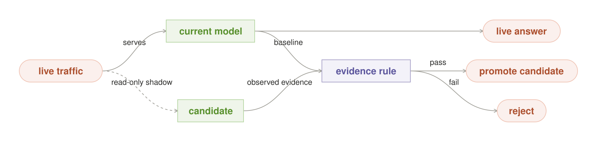

#### Context

The local stack changes: a new model build, quantization, prompt, tool version,
harness, retrieval policy, or workflow may be faster or better, but its behavior
on private real workloads is not yet trusted.

#### Problem

Offline benchmarks miss live distribution and tool interactions. Immediate
promotion exposes users and data to unknown failures. Requiring perfect proof
prevents improvement. How can a candidate learn from realistic work without
receiving unearned authority?

#### Forces

- Private representative tasks are more useful than generic leaderboards.
- Shadowing consumes owned capacity and may duplicate sensitive context.
- Agreement with an incumbent does not prove correctness.
- Repeated peeking can bias promotion decisions.
- Different roles require different capability and safety floors.
- Rollback must restore an exact known-good contract.

#### Solution

**Move candidates through explicit stages—offline audition, read-only shadow,
bounded canary, then full role—using predeclared evidence and rollback rules.
Authority increases only after an independent verifier accepts the exact
candidate contract.**

#### Structure and participants

- **Candidate contract** pins model, prompt, adapter, runtime, tools, and policy.
- **Private task pack** represents the intended role and failure history.
- **Shadow lane** receives live-shaped inputs but cannot serve or act.
- **Promotion rule** names sample, metrics, guardrails, looks, and thresholds.
- **Incumbent** remains the trusted fallback.
- **Registry** atomically promotes, retains, quarantines, or rolls back.

#### Mechanics

Audition the exact candidate offline. If it clears compatibility and quality
floors, shadow a sampled, policy-approved stream. Record paired outcomes under a
fixed design. Promote to a bounded canary only at registered evidence looks.
Increase scope gradually; hard guardrail failure immediately returns to the
incumbent.

#### Invariants

- Candidate identity is immutable throughout one evaluation.
- Shadow outputs never reach users, tools, memory, or routing labels.
- Promotion criteria exist before result inspection.
- The incumbent and rollback state remain available.
- Trust is role-specific and expires when contract or environment changes.
- Candidate confidence and incumbent agreement are not ground truth.

#### Consequences

The stack can improve using private workloads without turning users into an
uncontrolled test. The cost is duplicated compute, experiment design, task-pack
maintenance, and slower adoption. A candidate may remain unassigned despite
promising aggregate scores.

#### Applicability

Use it for any participant that may gain live influence or action authority.
Small formatting-only prompt changes may use a lighter stage, but a versioned
contract and rollback still matter.

#### Failure and safe exit

The characteristic failure is promoting on cherry-picked examples, confidence,
or agreement with a flawed incumbent. Retain the incumbent, quarantine the
candidate, preserve evidence, and revise the test design before another round.

#### Implementation

Separate evaluation and training slices. Use immutable manifests, exposure
sampling, paired comparison, sequential-testing controls, role-specific floors,
side-effect firewalls, atomic registry updates, and automated rollback probes.

#### Measure

Track task-pack coverage, live-shadow deltas, guardrail failures, promotion and
rollback, time in stage, candidate resource cost, distribution drift, and
post-promotion regressions against the registered baseline.

#### Evidence status

Canary, shadow, and staged rollout techniques are established. Their exact
application to local model/harness authority is emerging and must be measured
on the operator's workload.

#### Related patterns

Ground-Truth Verifier owns promotion evidence. Idle Shift supplies safe
evaluation capacity. Fit the Box admits duplicate load. Privacy Boundary limits
shadow inputs. Outcome Ledger records every stage transition.

### 13. Outcome Ledger

**Intent.** Make decisions, acts, verifier evidence, and observed outcomes one
durable source of truth that can survive the agent and safely improve later
runs.


#### Context

Agents run across processes and machines, call external tools, checkpoint,
retry, act, receive delayed outcomes, and update routing or trust. In-memory
state and conversational transcripts are incomplete and can disappear.

#### Problem

After a crash, the agent may not know whether an action committed. Separate
logs disagree. Learning systems may train on unverified drafts or outcomes that
cannot be attributed to a decision. How can one system recover, audit, and
learn without inventing history?

#### Forces

- Durable writes add latency to interactive loops.
- External systems may commit before a local acknowledgment arrives.
- One event stream must serve recovery, audit, metrics, and learning.
- Sensitive context should not be copied into every log.
- Derived views are convenient but can drift from their source.
- A single local disk is not durable against loss of the box.

#### Solution

**Append every state transition, evidence decision, act request, external
receipt, and attributable outcome to one ordered, durable event ledger. Build
all mutable views from it. Export it beyond the failure domain and learn only
from verified terminal events.**

#### Structure and participants

- **Event envelope** carries event id, time, request/session/decision ids,
  contract revisions, artifact digests, and privacy class.
- **Append authority** serializes durable transitions.
- **Act receipt** reconciles requested, attempted, committed, denied, and
  unknown effects.
- **Outcome joiner** connects delayed observations to the responsible decision.
- **Materialized views** serve sessions, routing, trust, metrics, and audit.
- **Export** copies encrypted events outside the box's failure domain.

#### Mechanics

Append intent before a non-transactional act, then append the external receipt
or unknown state. On restart, replay events and reconcile incomplete acts by
idempotency key. Join later outcomes only with valid exposure and decision ids.
Publish verified terminal records to routing or training views; rebuild those
views when policy or interpretation changes.

#### Invariants

- Durable state has one authoritative order.
- Events are append-only; corrections supersede rather than erase history.
- Sensitive payloads are referenced by protected artifact digest when possible.
- Every act and outcome is attributable to exact contracts and policy.
- Unknown external state remains unknown until reconciled.
- Learning consumes only authorized, verified terminal events.

#### Consequences

Crash recovery, audit, idempotency, and measured improvement share one factual
base. The system pays storage, serialization, privacy classification, export,
retention, and schema-evolution costs. A ledger records bad policy faithfully;
it does not make the policy good.

#### Applicability

Use it for any agent that acts, spans sessions, changes trust, or learns from
outcomes. A stateless read-only model endpoint may need ordinary request logs,
but not the full event contract.

#### Failure and safe exit

The characteristic failure is treating an in-memory success message as proof
that an external action committed. Mark the act unknown, reconcile with the
target system, and prevent replay until its state is resolved.

#### Implementation

Use WAL or event-store semantics, monotonic ids, fsync or equivalent durability,
checksums, schema versions, privacy tiers, transactional outboxes where
possible, idempotency keys, periodic snapshots, and encrypted off-box export.

#### Measure

Track append latency, loss and corruption tests, recovery point and time,
unknown acts, duplicate suppression, reconciliation duration, outcome join
rate, view rebuild consistency, export lag, and unauthorized payload findings.

#### Evidence status

Write-ahead logging, event sourcing, idempotency, and outbox patterns are
established. The agent-specific event vocabulary and privacy policy are local
system designs that require operational validation.

#### Related patterns

Durable Session rebuilds from the ledger. Single Act Gate uses it for
idempotency. Staged Trust stores promotion evidence. Risk-Bounded Route learns
from verified outcomes. Privacy Boundary controls retention and export.

---

## III. Own the runtime and boundary

### 14. Fit the Box

**Intent.** Compile a logical workflow into an honest physical plan over exact
model artifacts, resident sessions, memory, seats, energy, and deadlines.

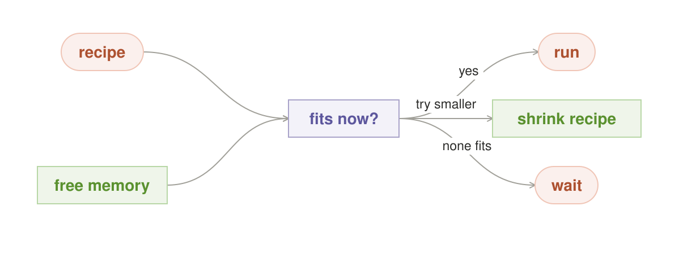

#### Context

A local agent can choose among models, harnesses, tools, and multi-worker
recipes, but the owned fleet has changing free memory, model residency, KV
state, power, temperature, foreground load, and failure domains.

#### Problem

A logical graph can request workers that cannot co-reside, count serial loads as
parallel seats, ignore model swap latency, or exceed a thermal envelope. Hosted
endpoints hide much of this state; a local runtime must face it. How can the
agent promise only work the current box can actually execute?

#### Forces

- Larger models and longer context consume more memory and load time.
- Warm residency improves latency but reduces space for other roles.
- Serial attempts preserve correctness but change deadlines.
- Energy, heat, acoustics, and battery can be hard constraints.
- Live state changes between planning and dispatch.
- Exact weights, tokenizer, template, adapter, quantization, and runtime affect
  behavior and must travel as one contract.

#### Solution

**Resolve every logical role to an immutable model/harness contract, snapshot
the live fleet, enumerate feasible placements, and atomically lease one plan.
If the requested recipe does not fit, take a named degradation, wait, or defer.**

#### Structure and participants

- **Artifact contract** pins weights, tokenizer, template, adapter,
  quantization, runtime, and serving parameters.
- **Live inventory** reports residency, free memory, seats, load/evict cost,
  throughput, health, power, and temperature.
- **Planner** produces full and degraded placement candidates.
- **Joint lease** reserves memory, seats, and physical budget against an
  inventory revision.
- **Runtime monitor** enforces hard limits and detects stragglers or toxic
  routes.

#### Mechanics

Resolve exact contracts, snapshot the inventory, subtract foreground and safety
reserves, and simulate candidate placements. Choose the best plan that meets
the deadline and evidence contract. Acquire a versioned joint lease and
revalidate immediately before dispatch. Monitor load, memory, latency, power,
and health; checkpoint optional work or trip a circuit breaker on hard limits.

#### Invariants

- Floating model names never enter execution.
- Desired concurrency is not admitted concurrency.
- Memory includes weights, runtime overhead, KV/cache growth, and reserves.
- A plan runs only under a current lease; stale snapshots cannot dispatch.
- Degradation is named and does not lower boundary or proof requirements.
- Power, thermal, and foreground limits are enforceable during execution.

#### Consequences

The system uses owned hardware efficiently and stops lying about parallelism.
It gains placement complexity, telemetry dependencies, and races between
planning and dispatch. Conservative estimates can underuse the machine;
optimistic estimates create failures and latency spikes.

#### Applicability

Use it whenever a workflow can choose among builds, machines, contexts, or
worker counts. A single fixed model on one dedicated box still benefits from an
artifact contract but may not need a general planner.

#### Failure and safe exit

The characteristic failure is overcommit followed by unplanned eviction,
out-of-memory termination, or silent recipe shrinkage. Release leases,
checkpoint recoverable work, disclose the unavailable plan, and wait or defer.

#### Implementation

Benchmark exact contracts on exact hardware. Maintain conservative memory and
throughput profiles, warm-set value scores, foreground reserves, lease TTLs,
straggler thresholds, route-specific circuit breakers, and last-known-good
rollback artifacts.

#### Measure

Track admission accuracy, out-of-memory events, cold-load latency, residency
hit rate, evictions, lease conflicts, p50/p99 queue and run time, throughput,
joules, thermal throttling, straggler hedges, and degradation frequency.

#### Evidence status

Resource admission, bin packing, leases, circuit breakers, and model pinning
have established lineages. An integrated local-agent physical-plan compiler is
still a candidate that must be measured on real heterogeneous fleets.

#### Related patterns

Risk-Bounded Route supplies the logical recipe. Durable Session supplies warm
state. Parallel Search and Orchestrator–Workers request seats. Idle Shift uses
only capacity left after foreground leases.

### 15. Idle Shift

**Intent.** Convert genuinely spare owned capacity into checkpointable
evaluation and improvement work without stealing foreground service or
promoting unverified changes.

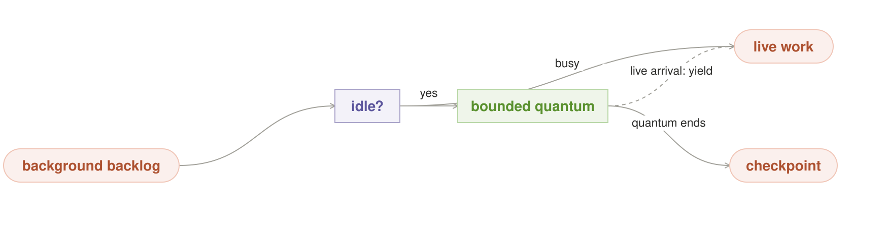

#### Context

Owned machines have quiet periods. Useful deferred work includes evaluation,
indexing, cache construction, synthetic data, model audition, training,
quantization, preloading, and failure replay. Foreground latency remains the
primary obligation.

#### Problem

Idle capacity is valuable but unpredictable. A “background” job can occupy
memory, heat the device, block model loads, or leave half-applied state when
interrupted. Improvement work can also promote its own output and corrupt the
live system. How can spare time become useful without becoming hidden load or
unearned trust?

#### Forces

- Local idle cycles have no opportunity value only while demand is absent.
- Many training and indexing jobs are not naturally preemptible.
- Checkpointing too often reduces useful throughput.
- Warm background models may displace foreground residents.
- Evaluation and construction have different authority.
- Energy price, battery, heat, and noise vary over time.

#### Solution

**Admit only typed background jobs that can run in bounded quanta, checkpoint,
and yield on a declared foreground or physical signal. Stage every produced
artifact; promote it only through Staged Trust and Ground-Truth Verifier.**

#### Structure and participants

- **Foreground reserve** defines seats, memory, latency, power, and thermal
  capacity that background work cannot consume.
- **Idle detector** combines queue, residency, energy, and host signals.
- **Background backlog** contains versioned job contracts with checkpoints,
  quanta, priority, and expiry.
- **Preemption controller** stops admission and triggers yield.
- **Staging registry** isolates incomplete and untrusted outputs.

#### Mechanics

Compute slack only after active leases and reserves. Admit one bounded quantum
whose worst-case yield time fits policy. Checkpoint at the quantum boundary or
on an earlier live-demand signal. Release resources promptly. Validate completed
artifacts independently; promotion is a separate event.

#### Invariants

- Foreground reserve is subtracted before declaring idle capacity.
- Every job names a maximum non-preemptible interval.
- Checkpoint and resume are tested, not asserted.
- Background output cannot alter live routing, memory, weights, or tools by
  itself.
- Hard power and thermal limits stop work even if the logical job remains.
- Failure leaves the last trusted live state unchanged.

#### Consequences

Unused hardware produces lasting value and local evaluation can run on private
workloads. The system gains a scheduler, checkpoints, staging storage, thermal
controls, and a backlog that must be governed. Tiny idle windows may not repay
setup and checkpoint cost.

#### Applicability

Use it for interruptible, non-urgent work with independently checkable outputs.
Do not run deadline-sensitive or irreversible work in stolen slack. Do not call
a scheduled overnight job “idle” unless it yields to real demand.

#### Failure and safe exit

The characteristic failure is background work that cannot release its seat
when a live request arrives. Kill or quarantine the job, restore the last
checkpoint, and keep its artifact staged. Foreground service wins.

#### Implementation

Use quanta, cooperative cancellation, resumable data shards, copy-on-write
artifacts, staged registries, foreground admission reserves, energy windows,
thermal sensors, and promotion manifests. Price cold-load and checkpoint cost
before admitting short slack.

#### Measure

Track useful background work per idle hour, foreground p99 impact, yield
latency, killed and resumed quanta, checkpoint overhead, energy, temperature,
resident-set churn, artifact verification, and post-promotion regressions.

#### Evidence status

Idle scheduling, checkpointing, and staged deployment are established. A
general local-agent improvement shift that spans evaluation, training, memory,
and residency is an emerging composition.

#### Related patterns

Fit the Box defines real slack. Durable Session supplies checkpoints. Staged
Trust controls promotion. Outcome Ledger records every staged artifact and
decision.

### 16. Privacy Boundary

**Intent.** Compile data labels and purpose into an enforceable graph in which
raw private data stays with its owner and every external crossing is explicit,
minimal, and auditable.

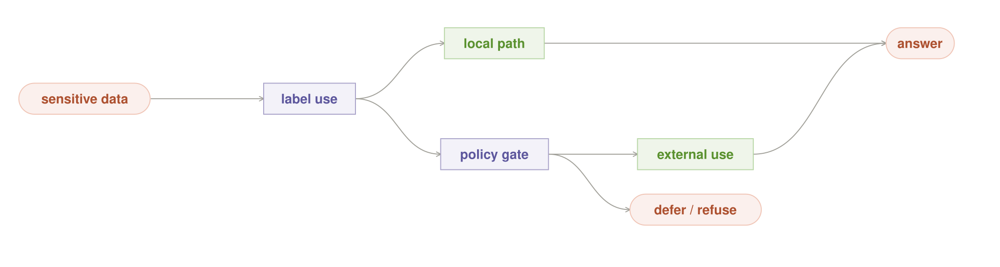

#### Context

An agent can reach local files, databases, personal memory, cameras, tools,
logs, remote models, telemetry, backups, and messaging systems. Some data may
remain on one device, within a LAN, inside an organization, or in a specific
jurisdiction.

#### Problem

“The model is local” does not make the workflow private. A remote verifier,
embedding service, tool, crash reporter, log sink, or fallback can still leak
raw context. How can the complete dependency graph enforce the owner's data
boundary rather than relying on component promises?

#### Forces

- Rich context improves usefulness but increases disclosure risk.
- Raw data is often easier to centralize than derived results.
- Tools and telemetry have their own sinks and retention behavior.
- Purpose and consent can differ by field, subject, and action.
- A remote fallback may improve quality but weaken sovereignty.
- Local compromise and overbroad memory remain risks even without egress.

#### Solution

**Label data at its source, propagate labels through the concrete execution
graph, move inference to data when possible, and enforce every crossing at a
field-level policy gate. Release the minimum derived result. Treat remote use
as an explicit branch, never an invisible fallback.**

#### Structure and participants

- **Data owner/source** assigns subject, sensitivity, purpose, retention, and
  allowed sinks.
- **Boundary compiler** resolves models, tools, logs, storage, backups, and
  fallback edges before execution.
- **Local worker** reads raw data at its owning node.
- **Release gate** applies minimization, redaction, aggregation, and policy.
- **Egress monitor** observes network and tool crossings.
- **Manifest** records the admitted graph, policy, digests, and actual sinks.

#### Mechanics

Authenticate identity and purpose. Label requested fields and derived
artifacts. Resolve the full graph, including helper models and observability.
Reject illegal edges before compute. Execute at the data node or within the
allowed boundary. At each permitted crossing, release only approved fields or
derived results and append the event to the ledger.

#### Invariants

- Authorization comes from identity, purpose, and source policy—not model
  classification alone.
- Every model, tool, log, store, backup, and fallback is a graph node.
- Labels propagate to derived artifacts until a registered release rule changes
  them.
- Remote fallback is visible, field-gated, and deniable.
- Data minimization applies inside the local boundary too.
- Deletion and source correction propagate to memory and caches.

#### Consequences

Sensitive data can remain on-device or on the owning LAN while agents remain
useful. The system gains policy compilation, label propagation, egress
enforcement, deletion, and more explicit degraded paths. Local processing does
not remove the need for endpoint security and least privilege.

#### Applicability

Use it whenever an agent touches personal, proprietary, regulated, or
security-sensitive data. A public-data read-only task may use a simpler graph,
but its tool and log sinks should still be known.

#### Failure and safe exit

The characteristic failure is hidden egress through a helper, tool result,
telemetry, or emergency fallback. Deny the edge, continue on a declared local
degradation, redact under policy, or defer. Never make privacy conditional on
the remote service being unavailable.

#### Implementation

Use data classification at ingestion, information-flow labels, process and
network sandboxing, field-level release schemas, local embedding and retrieval,
purpose-bound credentials, encrypted stores, retention jobs, egress tests, and
packet-level audit for critical claims.

#### Measure

Track raw and derived egress by class, denied edges, over-retrieval, redaction,
policy compile failures, deletion propagation, stale cache use, unauthorized
tool attempts, and useful task completion under local-only policy.

#### Evidence status

Information-flow control, data minimization, least privilege, and compute-to-
data architectures are established. The complete local-agent boundary contract
across models, tools, memory, and fallbacks remains a candidate implementation.

#### Related patterns

Context Steward retrieves the minimum slice. Single Act Gate controls
world-touching release. Offline Island closes the dependency path. Outcome
Ledger records crossings without duplicating sensitive payloads.

### 17. Offline Island

**Intent.** Preserve a complete useful agent path with no network, provider
service, or vendor account, and reconcile deliberately when connectivity
returns.

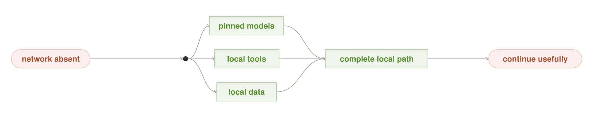

#### Context

The agent must remain useful during travel, outage, account failure, disaster,
network isolation, or deliberate air-gapping. It depends on models, tools,
data, retrieval indexes, policies, identity, keys, schemas, logs, and durable
state.

#### Problem

Caching model weights is not enough. One undeclared remote embedding service,
license check, tool, identity provider, telemetry sink, or policy lookup can
break the workflow. Offline actions can also conflict or duplicate when the
network returns. How can the useful dependency closure be owned end to end?

#### Forces

- Complete local replicas consume storage and require update discipline.
- Fresh remote truth may be unavailable offline.
- Credentials and policy must work without central identity while remaining
  revocable.
- Queued actions can conflict with changes made elsewhere.
- A smaller local route may be useful but less capable.
- Reconnection is a state transition, not permission to upload private history.

#### Solution

**Define and continuously test an offline manifest containing every dependency
required for a bounded useful outcome. Execute against local identity, models,
tools, data, policy, and state. Mark freshness honestly, queue only idempotent
acts, and reconcile through explicit conflict and egress policy on reconnect.**

#### Structure and participants

- **Offline manifest** pins dependency digests, minimum versions, and freshness
  limits.
- **Local identity and policy** authorize use without a live account service.
- **Local stack** contains admitted models, tools, retrieval, memory, and logs.
- **Freshness monitor** labels stale or unavailable sources.
- **Outbox** stores idempotent, policy-approved pending effects.
- **Reconciler** applies conflict and disclosure rules after reconnect.

#### Mechanics

At install or update time, resolve and verify the manifest. Periodically run a
cold-boot network-deny test. During disconnection, answer from admitted local
sources, disclose freshness, and reject work outside the offline contract.
Record local acts durably. On reconnect, reauthenticate, refresh policy, and
reconcile each outbox item without releasing unrelated private state.

#### Invariants

- Every dependency on the useful path is local and versioned.
- “Offline” is verified with network denial, not inferred from intent.
- Missing or stale sources are disclosed.
- Queued acts have idempotency keys and conflict rules.
- Reconnection does not automatically authorize egress or memory upload.
- Failure of one optional dependency has a named degradation or honest stop.

#### Consequences

The agent becomes resilient to network and vendor failure and can serve
air-gapped contexts. It pays storage, update, key management, local identity,
freshness, reconciliation, and a potentially lower capability ceiling.

#### Applicability

Use it where continuity or sovereignty matters enough to own the complete
closure. Do not claim it for a demo that answers one cached prompt while its
tools, identity, or state still require the network.

#### Failure and safe exit

The characteristic failure is a hidden dependency discovered only during an
outage. Disclose the missing capability, use a declared smaller route, queue
safe work, or defer. Do not fabricate remote facts from stale local memory.

#### Implementation

Use signed manifests, reproducible model and tool bundles, local indexes,
offline-capable identity, encrypted key rotation bundles, network-deny tests,
freshness metadata, transactional outboxes, deterministic conflict rules, and
last-known-good rollback packages.

#### Measure

Track cold offline startup, useful task completion, hidden dependency failures,
stale-answer incidents, outbox conflicts, duplicate suppression, power-loss
recovery, update rollback, egress on reconnect, and time since last verified
offline drill.

#### Evidence status

Offline-first data and outbox techniques are established. A complete local AI
agent dependency closure is a candidate contract that must be proved by fault
injection and real disconnected operation.

#### Related patterns

Privacy Boundary defines allowed crossings. Fit the Box proves loadability.
Durable Session and Outcome Ledger preserve state. Risk-Bounded Route chooses a
smaller local recipe before any explicit remote fallback.

---

## The pattern sequence

The patterns form a generative sequence rather than one mandatory architecture:

```text
Privacy Boundary
    ↓
Risk-Bounded Route
    ↓
one read / Pipeline / Parallel Search / Council / Orchestrator–Workers
    ↓
Context Steward + Durable Session
    ↓
Typed Tool Boundary
    ↓
Fit the Box
    ↓
Verify and Repair + Ground-Truth Verifier
    ↓
Single Act Gate
    ↓
Outcome Ledger
    ↓
Staged Trust and later routing updates
```

Offline Island constrains the dependency closure around the whole sequence.
Idle Shift consumes only capacity left by live execution and may produce only
staged candidates.

### Worked example: one local code-change agent

A private repository contains an intermittent concurrency defect. No source may
leave the LAN, and no untested patch may be committed.

1. **Privacy Boundary** compiles a local-only graph over repository, retrieval,
   models, tests, logs, and artifacts. **Offline Island** verifies that the
   necessary toolchain and identity are present.
2. **Risk-Bounded Route** classifies the patch as consequential but reversible
   and chooses Parallel Search with a deterministic test floor.
3. **Context Steward** gives four workers the same defect and relevant source,
   but different approach contracts. **Parallel Search** keeps them read-only.
4. **Typed Tool Boundary** exposes repository reads and test execution through
   narrow contracts while reserving mutation for the later act step.
5. **Fit the Box** discovers that only two workers co-reside, so it runs two
   waves instead of claiming four-way parallel execution.
6. Three candidates fail. One near-pass receives the concrete failing test
   through **Verify and Repair** and clears the full regression suite.
7. The **Ground-Truth Verifier** certifies the exact artifact. One actor receives
   one commit capability through the **Single Act Gate**.
8. The **Outcome Ledger** records attempts, tests, contracts, physical cost,
   commit receipt, and later CI outcome. That verified terminal record may
   improve the next route.

If no candidate passes, the agent returns test evidence without a write. If the
device reaches a hard thermal limit, optional work checkpoints. If a model
fails repeatedly, its route opens a circuit breaker. None of those failures
permit remote source disclosure or a weaker release standard.

## Common anti-patterns

| Anti-pattern | Why it fails | Replace it with |
|---|---|---|
| **Largest model always** | spends memory and latency without relating capability to consequence | Risk-Bounded Route |
| **Infinite local tokens** | replaces an API bill with hidden queue, energy, and thermal debt | Fit the Box and measured stop rules |
| **Consensus is truth** | correlated models can agree on the same error | Independent Council plus Ground-Truth Verifier |
| **Prompt-enforced read-only** | a worker holding credentials can still act | Single Act Gate with mechanical capability control |
| **One giant tool surface** | schemas and results consume context while broad credentials expand blast radius | Typed Tool Boundary |
| **Transcript as state** | context compaction, crashes, and handoffs erase or distort it | Context Steward, Durable Session, Outcome Ledger |
| **Model grades itself** | proposal and authority share the same blind spot | Ground-Truth Verifier |
| **Background means free** | hidden work steals residency, latency, power, and heat | Idle Shift |
| **Silent remote fallback** | local-first privacy disappears exactly on hard requests | Privacy Boundary and an explicit route |
| **Multi-agent by default** | coordination and synthesis consume more than they contribute | begin with one augmented local agent |
| **Learning from confidence** | eloquence becomes self-reinforcing trust | Staged Trust and verified outcomes |

## Legacy catalog map

This guide is the canonical reader-facing language. The earlier catalogs remain
as detailed research references. Every previous entry is accounted for here;
renames and merges reflect a smaller vocabulary, not discarded engineering.

### Earlier model-orchestration entries

| Earlier pattern | Home in this guide |
|---|---|
| Best Fit | Risk-Bounded Route |
| Recipe Router | Risk-Bounded Route |
| Adaptive Effort | Risk-Bounded Route refinement |
| Risk Ladder | Risk-Bounded Route and Ground-Truth Verifier |
| Routing Memory | Outcome Ledger feeding Risk-Bounded Route |
| Brute Force | Parallel Search |
| Check and Retry | Verify and Repair |
| Vote | Independent Council refinement |
| Challenge | Independent Council refinement |
| Diversity Gate | Parallel Search and Independent Council invariant |
| Tiebreaker | Independent Council and Ground-Truth Verifier refinement |
| Ensemble | Independent Council numeric refinement |
| Blind Estimate | Independent Council anti-anchoring refinement |
| Split Work | Orchestrator–Workers |
| Pipeline | Typed Pipeline |
| Answer Cache | Context Steward refinement |
| Shadow Model | Staged Trust |
| Model Audition | Staged Trust offline stage |
| Night Shift | Idle Shift producing staged candidates |
| Pinned Model | Fit the Box artifact contract |
| Fit the Box | Fit the Box |
| Keep It Warm | Fit the Box and Durable Session refinement |
| Idle Worker | Idle Shift |
| Power Budget | Fit the Box physical envelope |
| Straggler Backup | Fit the Box scheduling refinement |
| Circuit Breaker | Fit the Box and Risk-Bounded Route refinement |
| Local Cascade | Privacy Boundary plus Risk-Bounded Route |
| Data Stays Put | Privacy Boundary compute-to-data refinement |
| Privacy Boundary | Privacy Boundary |
| Offline Island | Offline Island |
| Private Memory | Context Steward |

### Earlier agent-orchestration entries

| Earlier pattern | Home in this guide |
|---|---|
| The act-gate | Single Act Gate |
| Session lifecycle | Durable Session |
| Route across harness lanes | Risk-Bounded Route and Typed Tool Boundary |
| The seat is the executor | Fit the Box and Idle Shift |
| Staged admission | Staged Trust |
| The verifier is ground truth | Ground-Truth Verifier |
| Only one ledger | Outcome Ledger |

## Evidence and further reading

The pattern form follows three durable lessons from the software-pattern
tradition:

1. A pattern names a recurring context, conflict of forces, reusable
   collaboration, and consequences—not merely a solution shape.
2. A catalog entry must make applicability, participants, dynamics, trade-offs,
   known uses, and related patterns inspectable.
3. A pattern language becomes generative only when entries create the contexts
   in which other entries can be applied.

Useful foundations include the original
[design-patterns paper](https://doi.org/10.1007/3-540-47910-4_21), the
[pattern-language introduction](https://www.patternlanguage.com/bios/douglea.htm),
and the [Hillside pattern-writing language](https://www.hillside.net/index.php/a-pattern-language-for-pattern-writing).

Contemporary agent-engineering evidence informing this guide includes work on
[simple composable agent workflows](https://www.anthropic.com/engineering/building-effective-agents),
[multi-agent breadth and its coordination cost](https://www.anthropic.com/engineering/multi-agent-research-system),
[context engineering](https://www.anthropic.com/engineering/effective-context-engineering-for-ai-agents),
[long-running harnesses](https://www.anthropic.com/engineering/effective-harnesses-for-long-running-agents),
[generator/evaluator harnesses](https://www.anthropic.com/engineering/harness-design-long-running-apps),
[agent evaluations](https://www.anthropic.com/engineering/demystifying-evals-for-ai-agents),
[tool design](https://www.anthropic.com/engineering/writing-tools-for-agents),
and [separating agent reasoning, execution, and durable sessions](https://www.anthropic.com/engineering/managed-agents).

These sources support mechanisms and engineering forces; they do not prove that
every local formulation here is mature. A pattern earns trust through repeated
implementation, measurement against a simpler baseline, honest failure
behavior, and independent evidence.

## Detailed references

- [Earlier model-orchestration catalog](../model_orchestration_patterns/README.md)
- [Model research reference](../model_orchestration_patterns/portable_patterns.md)
- [Archived physical-contract reference](../model_orchestration_patterns/six_pattern_reference.md)
- [Earlier agent-orchestration catalog](../agent_orchestration_patterns/README.md)
- [Flagship local-AI compositions](../model_orchestration_patterns/flagship_compositions.md)

Regenerate the overview figure with:

```text
python3 docs/local_ai_agent_patterns/build_figures.py
```
