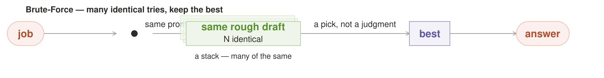
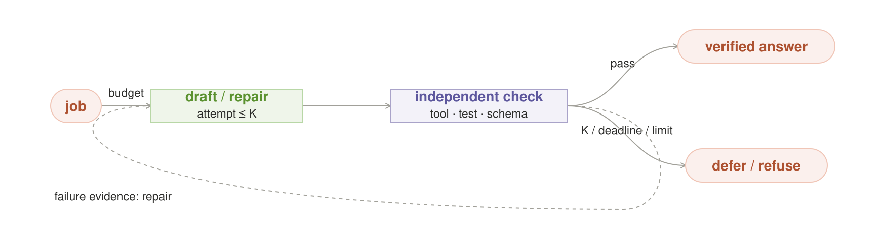
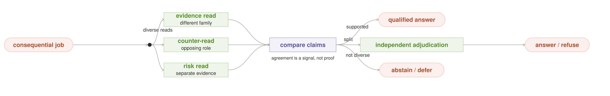

# Local AI Orchestration Patterns — spend owned compute, control owned state

Local AI changes orchestration in **two** different ways. First, owned
inference has no marginal API-token invoice and asks no vendor quota or rate
limit for each additional attempt. Repeated search, independent checking, and
bounded retry can become normal quality policy instead of exceptional spend.
Second, the operator controls the inference substrate itself: exact artifacts,
accelerator memory, KV cache, idle time, power and thermal state, network
boundary, and physical failure domains.

This catalog keeps a small, quality-first set from both families:

- **Local-abundance patterns** spend unmetered-but-bounded inference to buy
  quality. Their graph can run in the cloud, but metering and provider control
  change its useful operating point.
- **Local-substrate patterns** depend on physical or lifecycle state hidden by
  a black-box model API.

Local tokens are **free of the API meter, not free of physics**. Seats, VRAM,
memory bandwidth, electricity, heat, wall-clock, wear, and foreground queue
delay remain finite. A local serving stack also has throughput and concurrency
limits even though it has no vendor-controlled rate limit.

## The line between portable and local

[Anthropic's production-oriented catalog](https://www.anthropic.com/engineering/building-effective-agents)
already describes routing, prompt chaining, parallel sectioning and voting,
orchestrator-workers, and evaluator-optimizer loops. Those topologies remain
useful whether their workers are local processes or hosted API calls. But
**cloud-capable does not mean architecturally equivalent under metering and
provider control**.

This catalog uses two tests:

> **Abundance test:** keep the topology, but restore a metered,
> provider-controlled call for every attempt. If that materially shrinks the
> intended sample count, retry depth, redundancy, or duty cycle—and repeated
> inference is the mechanism rather than an incidental optimization—the
> pattern is **local-abundance**.

> **Substrate test:** replace every local inference worker with a black-box
> hosted API. If required decision state disappears—artifact identity,
> residency, owned idle time, energy, temperature, or physical placement—the
> pattern is **local-substrate**.

If neither the mechanism nor its declared operating policy changes materially,
the pattern remains portable-only. Here `local` means **operator-controlled
inference**, not a latitude and longitude. A private rack or rented bare
accelerator can qualify; a black-box API cannot expose the same substrate.

Every main-catalog pattern must therefore:

1. pass the abundance test or the substrate test and state which;
2. own a distinct, recurring force rather than rename an existing workflow;
3. name its scarce local resources and bounded admission or stop policy;
4. provide an explicit safe exit—`answer / defer / refuse`, or
   `promote / retain / checkpoint / abort`; and
5. state what evidence would show that its extra complexity is not worthwhile.

Agreement between models is never presented as proof. Consequential output
needs an independent oracle or tool check; otherwise the catalog labels
agreement only as a weaker consistency signal.

```text
request + consequence ──► reasoning topology ──► desired quality spend ──┐
quality evidence + stop rule ─────────────────────────────────────────────┤
artifacts + residency + boundary + host state ──► feasible placement ────┤
                                                                         ▼
                                                run / degrade / defer / refuse
```

The reasoning topology says what to try. The abundance policy decides how
many attempts or checks are justified. The substrate policy decides which
exact artifacts can run, where, and for how long. Together they produce one
bounded physical plan.

## The focused set

### Three local-abundance patterns

| ID | Pattern | The local move | Honest stop |
|---|---|---|---|
| A1 | **Brute-Force Search** | try genuinely different approaches because attempt N adds no API bill or vendor quota event | one objective oracle passes a result, or the fixed budget expires |
| A2 | **Bounded Verify-and-Repair** | make failed checks ordinary control flow and use their evidence in another attempt | release only a passing result; otherwise defer, refuse, or escalate at K/deadline |
| A3 | **Diverse Council** | spend several independent full-context reads when no cheap truth oracle exists | answer on adequate evidence; disclose uncertainty or abstain on a split |

### Three local-substrate patterns

| ID | Pattern | Local state it owns | The move |
|---|---|---|---|
| L1 | **Resident-Set Planner** | loaded weights, KV footprint, free seats, load/evict cost | compile the logical graph into what actually fits in memory |
| L2 | **Verified Night Shift** | owned idle cycles, checkpoints, verified local outcomes | improve the box while it sleeps, promote only on proof |
| L3 | **Energy Envelope** | power, battery, temperature, acoustics, time-of-use | spend joules and thermal headroom, not imaginary free tokens |

### Two supporting foundations

| ID | Foundation | Operator-controlled state | Why it is a foundation |
|---|---|---|---|
| F1 | **Model Artifact Contract** | weights, tokenizer, template, quantization, adapter, runtime | immutable deployment and version pinning also exist in cloud systems |
| F2 | **Boundary-Compiled Graph** | data labels, graph sinks, egress policy and manifest | information-flow compilation and enforcement are portable security mechanisms |


In every figure, coral pills are external entries or exits, green boxes are
owned state or work, and purple boxes are decisions. The labels carry the same
meaning without color.

A-patterns are not claimed as topologies a cloud system cannot execute. Their
claim is that owned inference changes the viable operating point enough to
change the default architecture. L-patterns make the stronger claim that API
substitution removes state required by the mechanism. F1 and F2 support both
families without satisfying either claim on their own.

All six patterns are **proposals in the pattern incubator**, not claims of
universal best practice. Their underlying mechanisms have established
lineages, but these exact local-AI formulations still need direct
implementations, measurements, and at least three independently documented
successful uses before promotion to mature patterns.

## Why use a pattern catalog

The durable contribution of the Gang of Four was not a large list. It was a
shared vocabulary for recurring design pressure, written so context,
collaboration, consequences, and tradeoffs could be inspected and composed.
The authors' original paper describes patterns as named, reusable
micro-architectures that preserve design experience—not prescriptions that
make a system correct merely by being named
([Gamma et al., 1993](https://doi.org/10.1007/3-540-47910-4_21)).

Every pattern entry therefore states which local force it exploits, whether
its topology is portable, what changes at the local operating point, when it
applies, how participants collaborate, what it costs, how it stops, and what
evidence would falsify its value. A clever analogy without recurring uses and
falsifiable measurements stays a refinement, not a new pattern.

## How to compose them

The patterns and foundations do not form one mandatory pipeline. They make a
few small recipes:

- **Quality spend:** choose A1 when different search paths can be judged by one
  objective oracle. Choose A2 when a failed check supplies useful repair
  evidence. Choose A3 when no cheap truth oracle exists but independent reads
  can expose ambiguity. A1 may feed its best near-pass into A2; A3 must never
  replace A1's objective selector with a popularity vote.

- **Foreground service:** F2 first emits boundary constraints. F1 resolves exact
  model roles, while an ordinary deployment registry resolves tool, telemetry,
  storage, and backup components. F2 then signs that concrete closure with its
  contract ids, executable/config digests, and sinks. The chosen A-pattern
  declares desired width or retry depth. L1 contributes feasible residency
  candidates and L3 contributes energy constraints to one physical-plan
  coordinator. Only that coordinator selects the bounded plan, atomically
  acquires its versioned joint lease, and revalidates it immediately before
  dispatch.
- **Verified improvement:** L2 borrows only capacity left by L1 and L3, obeys
  F2, and emits an immutable staged result. A model build becomes a new F1
  candidate only after an independent validator accepts that exact digest; a
  failed result changes nothing.
- **Offline continuity:** the Sovereign Island recipe combines F2's local-only
  graph, F1's pinned artifacts, L1's loadability proof, and ordinary
  offline-first freshness and outbox mechanics.

Host state can change after planning, so the physical plan is not immutable.
The **decision record** is append-only: for one `round_id`, its compile event
records graph/policy hashes, artifact contracts, inventory version, leases,
telemetry bucket, and chosen degradation; its terminal event records actual
egress. Exactly one act gate may commit a side effect.

```python
def bind_physical_plan(graph, request, resources):
    snapshot = resources.snapshot()  # memory + energy, one unified version
    plans = resident_candidates(graph, request, snapshot)  # L1
    envelope, plans = energy_filter(request, plans, snapshot)  # L3
    plan = best_verified(plans)
    if not plan:
        return defer_or_refuse(request)
    lease = resources.try_reserve(plan, expected_version=snapshot.version)
    if not lease or not lease.revalidate():
        return defer("physical state changed")
    return monitor_hard_limits(plan.bind(lease), envelope)
```

---

## A1. Brute-Force Search — try many ways, prove one winner



**Plain English.** Do not ask one model attempt to be right. Give the same goal
to several isolated attempts, make them search in meaningfully different ways,
run the same external test over every result, and keep exactly one winner.

**Why local-abundance.** The fan shape is portable, but its normal operating
point changes locally. Attempt N creates no Nth API invoice, consumes no vendor
allowance, and needs no provider admission. The operator can choose N from the
quality curve and the box's deadline, seat-time, watts, heat, and foreground
load. On one GPU the attempts may be serial; local means unmetered by an API,
not magically parallel.

**Use it when.** Constructing is hard but checking is cheap and objective:
patches with tests, structured output with a schema, schedules with constraints,
solver witnesses, counterexamples, or generated artifacts with measurable
acceptance criteria. Do not use it when “best” is only another model's taste.

**Contract.** Every attempt receives the same goal and acceptance contract but
a different seed, decomposition, heuristic, evidence slice, or model family.
Attempts are read-only, run under a fixed `N + deadline + resource` budget, and
cannot see or anchor one another. One deterministic or externally grounded
oracle tests them all. Only the selected result may cross the idempotent act
gate.

**Failure and safe exit.** N copies of one approach are pretend breadth. A weak
oracle selects the best test-gamer, and side-effecting workers can act N times.
If no candidate passes, the result is `defer / refuse / escalate`—never “ship
the least bad attempt.”

**Measure.** Compare against `N=1`: passing-result rate, marginal gain per
attempt, realized output diversity, wall-clock, joules, model swaps, and
foreground queue delay. Shrink or retire the fan when additional attempts stop
buying verified wins.

**Evidence status.** Proposal. Generate-and-test, randomized restarts, and
best-of-N have strong portable lineage; Grid has not yet published the local
quality-versus-physical-cost curve required to promote this formulation.

**Example.** Six read-only patch attempts try a minimal edit, call-path
decomposition, invariant-first reasoning, and seeded restarts. The same tests
and patch-size tie-break judge all six. Five attempts disappear; one passing
diff may commit once. The deeper portable lineage is cataloged as
[Brute-Force #6](portable_patterns.md#6-brute-force--many-approaches-keep-the-best).

---

## A2. Bounded Verify-and-Repair — make failure useful



**Plain English.** Produce one draft, check it with a real verifier, feed the
failure evidence into a changed repair attempt, and repeat only while the
declared budget remains. Release a result only after it passes.

**Why local-abundance.** A failed generation can become ordinary control flow:
another repair cycle adds no API invoice or vendor quota event. It still spends
local seat-time, wall-clock, energy, and queue capacity, so both an attempt cap
and a deadline are part of the pattern—not optional tuning.

**Use it when.** The check is cheaper and more reliable than generation and
returns actionable evidence: compiler errors, failing tests, linter findings,
schema violations, citation mismatches, calculator results, or constraints.
When retries cannot learn from the failure, use A1's independent search instead.

**Contract.** The verifier is deterministic or tool-grounded wherever
possible, is independent of the generator's confidence, and names what it
checked. Each repair receives concrete failure evidence and must change the
attempt. The loop stops at `K`, the deadline, an energy/thermal limit, or
foreground preemption—whichever comes first.

**Failure and safe exit.** A rubber-stamp verifier creates confident failure;
an incomplete check trains the generator to exploit the check; identical
retries repeat one mistake. Exhaustion produces `defer / refuse / escalate`.
The last failed draft never becomes the answer merely because the budget ran
out.

**Measure.** Compare pass rate and end-to-end latency against one-shot and A1
baselines. Record attempts-to-pass, repeated-error rate, false accepts on
held-out bad drafts, joules, deadline exits, and foreground interference.

**Evidence status.** Proposal. Generator-verifier loops are established; the
bounded local policy and its foreground/energy effects still need a measured
Grid implementation.

**Example.** A local model writes a configuration change; a schema validator
rejects one field and returns the exact path. The next attempt repairs that
field. If validation still fails after three tries or the time box closes, the
system returns the failure report instead of an unvalidated config. The
portable ancestor is [Verifier Gate #8](portable_patterns.md#8-verifier-gate--one-draft-a-check-retry-on-fail).

---

## A3. Diverse Council — buy independent reads, not extra confidence theater



**Plain English.** When no cheap truth oracle exists, ask a small set of
genuinely different readers to inspect the same consequential problem. Compare
their claims and evidence. Agreement may raise confidence; disagreement is a
signal to investigate, disclose uncertainty, or stop—not a nuisance to vote
away.

**Why local-abundance.** Several full-context reads and an adjudication pass can
be routine without paying for every voice or consuming a vendor allowance.
Private context can also remain inside the owned boundary. The budget still
binds on seats, model swaps, time, power, heat, and the cost of delaying other
local work.

**Use it when.** The answer matters, ambiguity is real, and no objective check
can settle it cheaply: design review, risk discovery, interpretation, or a
classification whose edge cases need independent readings. If a truth oracle
does exist, prefer A1 or A2.

**Contract.** Diversity is constructed, not assumed: use meaningfully different
model families, evidence partitions, or roles such as proposal, counterexample,
and risk review. The comparison tracks claims back to evidence and reports the
independence actually obtained. Majority is a consistency signal, never proof.

**Failure and safe exit.** Sibling quantizations or differently worded prompts
can share one blind spot. A judge model may share it too. Insufficient diversity
or unresolved material disagreement leads to a deterministic tool, an
independent adjudicator, a human, or `abstain / defer`; it never forces a winner
just to terminate.

**Measure.** Compare against one strong read: novel defects found, externally
confirmed corrections, disagreement resolution, calibration, false consensus,
latency, swaps, and joules. Remove a council lane that adds correlated volume
without independent evidence.

**Evidence status.** Proposal. Multi-read review and adversarial critique have
portable lineage, but this council's independence contract and abstention policy
need direct evaluation; agreement alone is not validating evidence.

**Example.** Three local readers review a migration: one checks invariants, one
hunts counterexamples, and one maps operational rollback risk. Shared,
source-grounded conclusions may answer with disclosed confidence. A material
split goes to tests or a human. This pattern deliberately narrows the portable
[Fan-Out](portable_patterns.md#2-fan-out--same-prompt-n-answers-a-vote) and
[Adversarial](portable_patterns.md#4-adversarial--two-careful-reads-a-judge)
ancestors: it does not equate a vote with truth.

---

## F1. Model Artifact Contract — route to a build, not a name


**Intent.** Make the routable unit an evaluated serving tuple:
`{weights digest, tokenizer, template, quantization, adapters, runtime/kernels,
generation profile, tool schema, hardware/driver compatibility, source,
license}`. Trust, evaluation history, caches, and rollback bind to that tuple,
not to an alias such as `qwen` or `latest`.

**Forces.** Friendly names make routing and upgrades easy, but local conversion,
quantization, templates, adapters, kernels, sampler defaults, and context policy
can all change behavior independently. Exact identity improves reproducibility
at the cost of storage, qualification work, and slower upgrades.

**Local role.** Version pinning also exists in cloud APIs, so this is a
foundation rather than a local-substrate pattern. Local ownership makes the
contract unusually complete: the operator can atomically retain the bits,
generation profile, and runtime that a hosted provider normally hides. A BYO
artifact endpoint may preserve that control; a black-box API does not.

**Applicability.** Use it for every served local model, especially when
quantizations, adapters, templates, or runtimes change independently. Avoid a
false sense of precision: a digest proves artifact identity, not quality or
safety; admission still needs evaluation and provenance checks.

**Invariant.** No evaluated outcome, trust label, cache entry, or response may
refer only to a floating alias. Every execution reports one exact contract id.

**Structure.** Request role → purple `resolve contract` → purple
`provenance + eval` gate → green exact build → answer. A failed candidate
causes the last trusted contract to be re-admitted for this request or refuses.

**Mechanics.** The registry stores immutable contracts and a mutable alias that
points to one admitted version. Admission verifies hashes, provenance and
license policy, tokenizer/template/runtime compatibility, the generation
profile, hardware support, and a held-out task pack. Promotion is an atomic
alias change. A fallback is not automatically safe merely because it was once
trusted: it must be re-admitted against the current request, boundary,
hardware, residency, and deadline.

```python
def resolve_model(role, registry, request):
    choices = (registry.resolve(role), registry.last_trusted(role))
    for contract in choices:
        if contract and admission_gate.allows(contract, request):
            return contract
    return refuse("no currently admissible serving contract")
```

**Observe.** Record the resolved contract id, alias revision, evaluation-pack
revision, fallback/rollback count, compatibility rejects, and quality/latency
delta between candidate and incumbent.

**Consequences.** Replays and regressions become explainable, upgrades become
reversible, and a Q4 conversion cannot inherit a full-precision build's trust.
The costs are artifact storage, an admission suite, registry durability, and
operational friction when an operator would prefer `latest` to mean “whatever
appeared today.”

**Failure and safe degradation.** The dangerous failure is silent retargeting:
an alias changes weights, tokenizer, template, or adapter while retaining old
trust. Quarantine the candidate, keep the last admitted contract, or refuse.
Never silently substitute an unmeasured artifact.

**Mechanism lineage.** Content-addressed deployment and progressive delivery
supply the identity/rollback lineage. Local model conversion makes the need
concrete: llama.cpp documents quantized files as separately produced artifacts
and warns that requantization can reduce quality
([llama.cpp quantization](https://github.com/ggml-org/llama.cpp/blob/master/tools/quantize/README.md)).

**Worked example.** In a conforming implementation, `qwen38-27b-mtp` resolves
to build A of
[Qwen3.8-27B](https://huggingface.co/Qwen/Qwen3.8-27B), including Grid's exact
digest, quantization, template, runtime, and generation profile. Build B uses a
new quantization and fails the held-out tool-calling floor, so the alias remains
on A. The failed build never inherits A's cache or trust labels.

**Evidence status.** Proposal with partial primitives. Grid fingerprints
evaluated adapter bytes in [`train/evaluate.py`](../../train/evaluate.py),
keeps deploy rollbacks in [`train/deploy.py`](../../train/deploy.py), and hashes
runtime downloads in
[`shared/engine/installer.py`](../../shared/engine/installer.py). Its
[`shared/models/catalog.py`](../../shared/models/catalog.py) is not yet a
full-tuple registry. No three independent direct uses are documented here.
**Related:** F2 constrains where a contract may run; L1 and L3 decide whether it
can run now; L2 may produce a candidate contract.

---

## L1. Resident-Set Planner — compile the graph into real memory


**Intent.** Choose the co-resident weights and KV working set before realizing
a fan, pipeline, or single call. Cold loads, evictions, context growth, and
serial swaps are explicit tasks; “call model” is never assumed to be free or
parallel.

**Forces.** Stronger or more diverse models can improve an answer, but weights,
adapters, runtime buffers, and KV cache compete for finite memory. Moving a
small request to warm weights is cheap; loading or evicting a model is slow and
can destroy another session's locality.

**Why local-substrate.** An elastic API hides its placement, memory pressure,
load/evict state, and seat leases. Substitution therefore removes the state and
actions this planner controls.

**Applicability.** Use it on every finite local accelerator and across a home
grid. It matters most when several approved models do not co-reside. On a
single permanently loaded model it collapses to a cheap invariant check.

**Invariant.** For every node, `weights + runtime + adapters + worst-case KV +
safety margin <= usable memory`. Execution holds a versioned lease for that
capacity; a diagram may claim parallel lanes only when distinct seats are
actually leased.

**Structure.** Portable graph + live inventory → purple `plan resident set` →
green warm lanes, budgeted cold-load lanes, or an admitted degradation; coral
`queue / refuse` is the non-execution exit. Candidate lanes converge on the
shared purple physical-plan coordinator; L1 itself does not reserve or run.

**Mechanics.** Each heartbeat reports the exact F1 contract ids resident on a
node, free seats, usable memory, KV budget, active contexts, measured load/evict
time, physical-domain labels, inventory version, and lease expiry. The planner
compares:

`network + queue + prefill` versus `load + eviction + restore + generation`.

It prefers moving the request to an already resident compatible build. A cold
load is a scheduled state transition with a deadline, an eviction victim, and
a per-node cold-load budget—not an invisible side effect. The planner and L3
contribute constraints to the shared physical-plan coordinator; L1 never
reserves on its own. Repeated A→B→A swaps inside one request are a compile
error. Follow-up turns may lease a warm KV/session entry, bounded by tenant,
memory, and expiry.

```python
def resident_candidates(graph, request, snapshot):
    plans = resident_planner.propose(graph, snapshot)
    admitted = [p for p in plans
                if p.fits_memory_with_margin()
                and p.meets(request.deadline)]
    return admitted + preevaluated_degradation_candidates(graph, request)
```

**Observe.** Report resident reuse, cold-load and eviction counts, bytes by
weights/KV/runtime, queue and load latency, lease conflicts, OOM escapes,
serialized lanes, and physical-domain labels. Keep physical availability
separate from model-family diversity.

**Consequences.** Warm latency improves and diagrams stop lying about parallel
workers on one GPU. The tradeoff is that the fastest resident build may be
weaker than a cold alternative, and state becomes volatile: stale inventory can
still produce an OOM or a thundering herd of loads.

**Failure and safe degradation.** Stale heartbeats, hidden KV growth, a lease
race, or an eviction loop make the plan invalid. Cancel before acting, re-read
inventory, and choose only a pre-evaluated degradation plan above the request's
quality floor: reduce optional fan width, use an admitted resident contract,
serialize if the deadline permits, queue, or refuse. Never silently truncate
required evidence or describe serial swaps as parallel confidence.

**Mechanism lineage.** Model servers already expose pieces of this state. vLLM
configures KV-cache capacity and memory behavior explicitly
([vLLM cache configuration](https://docs.vllm.ai/en/latest/api/vllm/config/cache/));
Grid's draft protocol states the corresponding placement inversion: move the
task to the node holding the resident model
([AI MapReduce](../draft/protocol.md)).

**Worked example.** A Mac Studio keeps Qwen3.8-27B resident while a
high-memory grid node keeps
[DeepSeek-V4-Flash](https://huggingface.co/deepseek-ai/DeepSeek-V4-Flash), whose
official card lists 284B total / 13B activated parameters. The planner moves
each prompt to the node already holding the required contract; it does not
pretend that Flash is a casual laptop swap or load both models for every fan.

**Evidence status.** Proposal with partial model-aware dispatch. Grid's
[`local/server.py`](../../local/server.py) routes toward a registered engine
serving the model with low active load, and
[`remote/serve.py`](../../remote/serve.py) reports model/load/memory state. It
does not yet report exact resident contracts or KV/load/evict costs, acquire
leases, or compile graphs. **Related:** F1 supplies contract sizes and
compatibility, L3 co-admits the plan, and physical failure-domain placement
refines this planner without changing portable pooling semantics.

---

## F2. Boundary-Compiled Graph — reject illegal paths before compute


**Intent.** Label the request and compile the whole plan—advisor, model,
embedding, verifier, tool, telemetry, cache, update check, and backup—inside the
operator's permitted boundary. Any external edge requires an explicit policy,
declassification, or human decision.

**Forces.** More tools and remote fallbacks increase capability, while each
embedding, verifier, crash report, update check, or backup adds a possible data
path. A human may authorize optional disclosure, but consent cannot override a
prohibited residency or legal rule.

**Local role.** Information-flow control is portable, so this is a foundation.
Its local formulation compiles and enforces an **all-local executable cut**
across an operator-owned model/tool/telemetry graph. Hosted inference becomes a
manifested external edge; policy may authorize it or force `defer / refuse`,
but the compiler itself survives the substitution.

**Applicability.** Use it whenever locality is motivated by privacy, data
residency, offline work, or control of training data. The boundary may be one
device, a trusted LAN, or a named hybrid policy; it must never be inferred from
the word `local`.

**Invariant.** Every actual network, tool, telemetry, storage, and backup sink
is a subset of the signed egress manifest. Undeclared sinks are denied at the
runtime/OS boundary, not merely discouraged in a component declaration.

**Structure.** Labeled request → purple `compile boundary` → green approved
local graph. A proposed external edge reaches a separate purple
`redact + authorize` gate, then either a visibly external lane or
`defer / refuse`.

**Mechanics.** A first pass constrains eligible component classes and sinks. F1
resolves exact model artifacts/runtimes; a deployment registry resolves every
non-model executable and configuration. A second pass propagates labels across
that concrete closure and signs a manifest bound to F1 contract ids,
executable/config digests, and sinks; it never mutates edges while iterating.
Deny-by-default network and process controls enforce the manifest. The
execution envelope reports actual sinks, redactions, and policy authorization.
Automatic “use cloud if local fails” is forbidden unless policy permits that
data class and the requester authorizes the optional disclosure.

```python
def compile_boundary(logical_graph, data_class, policy,
                     model_registry, component_registry):
    constraints = policy.constrain(logical_graph, data_class)
    graph = resolve_concrete_graph(
        constraints, model_registry, component_registry
    )
    compiled = Graph()
    for edge in graph.topological_edges():
        labels = propagate_labels(edge, data_class, compiled)
        if policy.allows(labels, edge.sink, edge.fields):
            compiled.add(edge, labels)
        else:
            replacement = policy.local_substitute(edge, labels)
            if not replacement or not policy.allows(
                labels, replacement.sink, replacement.fields
            ):
                return defer_or_refuse(edge, labels)
            compiled.add(replacement, labels)
    manifest = compiled.signed_egress_manifest()
    sandbox.enforce(compiled, manifest)
    return compiled, manifest
```

**Observe.** Persist the graph and policy hashes, manifest, actual socket/DNS/
tool/storage events, denied and substituted edges, redacted fields, and the
authorization behind every allowed external edge.

**Consequences.** Privacy becomes testable end-to-end and hybrid escalation is
honest. The cost is lost capability when no approved local substitute exists,
plus policy maintenance for tools and telemetry that change over time.

**Failure and safe degradation.** The classic failure is hidden egress from an
apparently local workflow. Disable the optional component, substitute an
on-device implementation, redact and ask permission, defer, or refuse. Never
silently fall back to a vendor.

**Mechanism lineage.** Information-flow control, data-loss prevention, and
zero-trust policy compilation supply the lineage. The local contribution is to
treat inference, embeddings, evaluators, tools, telemetry, and backups as one
compiled graph rather than granting privacy because its first model is local.

**Worked example.** A private contract analysis may use Qwen3.8-27B,
a local embedding model, a local text extractor, and an encrypted LAN snapshot.
A DeepSeek-V4-Flash node is eligible only if it sits inside the request's
approved boundary; a hosted endpoint with the same model name is a different
edge and requires an explicit egress decision.

**Evidence status.** Proposal with adjacent controls. Grid has per-task egress
allowlists in [`remote/task_sandbox.py`](../../remote/task_sandbox.py), but no
data-label propagation, signed graph manifest, or end-to-end sink audit.
[ADR 0019](../adr/0019-rl-training-plane.md) also records an unauthenticated
local endpoint-redirection risk that must be closed before this claim is
credible. **Related:** F1 identifies allowed
builds; L1 places them; Sovereign Island is this foundation's local-only
compilation mode plus offline mechanics.

---

## L2. Verified Night Shift — improve the box while it sleeps


**Intent.** Convert owned idle cycles into **typed staged improvements** such as
an evaluated model build, adapter, retrieval index, or verified eval pack. Work
runs in bounded, preemptible units. The validator is read-only; only a separate,
trusted promotion participant may change a live pointer.

**Forces.** Unused hardware can improve future quality or latency, but
background work competes with foreground responsiveness, heat, energy, storage
wear, and the same resident weights. Promotion creates lasting risk, so the
builder cannot certify its own result.

**Why local-substrate.** The operator owns the idle interval and the staged result.
A cloud API customer neither owns unused provider accelerators nor controls the
provider's model or index lifecycle. Removing the local machine deletes both
the schedulable resource and the promotable artifact.

**Applicability.** Use it for always-on hardware with measurable idle, thermal,
and power headroom. Avoid it for non-checkpointable jobs on an interactive
single-seat box, or when “improvement” is labeled only by the same model that
will learn from it.

**Invariant.** Every job declares `{artifact type, resource envelope, maximum
drain time, checkpoint semantics, staging target}`. Trusted artifact-type
policy—not the builder or job—selects the read-only validator and authorized
promoter. Foreground arrival or a hard host limit always wins within the
declared drain bound; an incomplete result cannot become live.

**Structure.** Typed improvement backlog → purple `idle eligible?` → green
bounded quantum → green immutable staged artifact → purple type-specific
validator → atomic promotion of that same digest. A live arrival requests
preemption; failed or incomplete work returns to the backlog without touching
production.

**Mechanics.** A foreground-aware scheduler starts one finite quantum per safe
window. Eligibility requires no live work, host-idle signal, L1/L3 leases,
resident-set compatibility, and a measured cancellation bound. A live-arrival
watcher stops new decode/training work immediately and waits only to the next
declared safe boundary; unsupported checkpoints are discarded. Captured
examples need a real label: correction, accepted outcome, deterministic tool
result, or approved external teacher—not self-agreement. Each result remains in
staging until trusted type policy's held-out or deterministic validator passes;
the promoter accepts only that validator's receipt for the same staged digest.

```python
def night_shift(backlog, host, foreground, trust_policy):
    job = backlog.next_typed()
    if not job:
        return retain("no eligible staged work")
    validator, promoter = trust_policy.for_artifact_type(job.artifact_type)
    lease = host.try_idle_lease(job.resource_envelope, job.max_drain)
    if not lease:
        return retain("no safe idle window")
    result = run_quantum(
        job,
        lease,
        cancel_when=(foreground.arrives, host.hard_limit_reached),
        drain_timeout=job.max_drain,
    )
    if not result.complete:
        return job.checkpoint_or_abort(result)
    staged = job.stage(result)
    receipt = validator.check_read_only(staged)
    if not receipt.accepted:
        return retain("independent validation failed")
    return promoter.promote_atomically(staged.digest, receipt)
```

**Observe.** Measure eligible idle time, useful completed work, cancelled and
discarded work, maximum drain latency, foreground latency delta, joules,
validator pass rate, promotions, rollbacks, and artifact type.

**Consequences.** The same purchased machine gets better or faster between
interactive requests without a per-token bill or vendor allowance. Electricity,
heat, SSD writes, and wear are real; saturated machines may make no background
progress, which is a valid outcome.

**Failure and safe degradation.** Background load can steal the resident set,
miss a cancellation bound, train on its own errors, or promote a partial
artifact. Request cancellation immediately, discard uncommitted partials, keep
the last trusted contract, and report that the night produced no promotion.
“Nothing changed” is success when the evidence gate did not clear.

**Mechanism lineage.** Preemptible batch work, staged promotion, and held-out
evaluation are established mechanisms. Grid's experimental training plane
already specifies an `idle → train → prove → ship-only-on-pass` nightly cycle
and host-priority gates
([ADR 0019](../adr/0019-rl-training-plane.md)).

**Worked example.** Overnight, the box evaluates a newly converted
Qwen3.8-27B contract against the incumbent on a frozen held-out pack. The job
can checkpoint between cases and must yield within its measured drain bound.
If quality stays above the registered floor and latency improves, the staged
build becomes an F1 candidate; otherwise the morning state is unchanged.

**Evidence status.** Proposal with one narrower Grid implementation:
[`train/nightly.py`](../../train/nightly.py) checks mains/idle once, trains one
adapter, evaluates held-out work, and deploys only on pass. It does not yet
implement the typed job protocol, live foreground preemption, thermal stop, or
measured drain bound proposed here. **Related:** L1 and L3 supply its leases, F2
its boundary, and F1 its model promotion target.

---

## L3. Energy Envelope — spend joules, not tokens


**Intent.** Compile inference under an operator-defined power, battery,
temperature, acoustic, UPS-reserve, and time-of-use envelope. Quality spend is
admitted in physical units and wall-clock, not justified by “free tokens.”

**Forces.** More samples, context, and concurrency may improve an answer, but a
home machine shares a room, circuit, battery, cooling system, UPS, and owner.
Sustained generation can throttle the device or make it unpleasant to use;
over-conservative limits can refuse valuable work.

**Why local-substrate.** A hosted API hides the serving host's power, battery,
temperature, fan, and UPS state and gives the caller no authority over them.
Substitution therefore removes both the governor's sensors and actuators.

**Applicability.** Use it on laptops, workstations, and always-on home servers;
it is load-bearing for Night Shift. Avoid using temperature as a proxy for
answer importance: request consequence and host headroom are different inputs.

**Invariant.** No plan starts unless a calibrated upper-confidence cost,
including load, execution, cancellation/drain, and checkpoint reserve, fits the
current envelope and its quality stays above the request's registered floor.
Hard limits remain continuously monitored during execution.

**Structure.** Request consequence + power/temperature/battery/activity signals
→ purple `admit envelope` → candidate physical plans → shared coordinator →
green monitored execution. Runtime branches to `answer` or
`defer / refuse` on a foreground hard limit, while measured cost updates the
next calibration. When L2 is the caller, it converts the same cancellation into
its background-only `checkpoint / abort` exit.

**Mechanics.** Policy declares hard limits (battery reserve, temperature,
acoustics, UPS floor) and soft budgets (joules or seat-ms per class). L3 filters
L1's pre-evaluated candidates; the shared physical-plan coordinator alone
chooses and reserves one. Each cost model is keyed by
artifact, generation profile, hardware/driver, context, concurrency, initial
temperature, and ambient bucket, with an uncertainty margin. A runtime governor
continuously enforces hard limits. Hysteresis and minimum cooldown prevent
oscillation. Unknown or stale sensors take a declared safe default; they never
mean infinite headroom.

```python
def energy_filter(request, plans, snapshot):
    envelope = policy.envelope(request.consequence, snapshot)
    eligible = [p for p in plans
                if p.quality_floor >= request.quality_floor
                and calibrated_upper_cost(p, snapshot).fits(envelope)]
    return envelope, eligible
```

**Observe.** Record joules, peak/starting temperature, throttling, fan/acoustic
band, battery/UPS delta, ambient and model-key bucket, prediction error,
cooldowns, hard-limit stops, and quality-preserving degradations.

**Consequences.** The router can run all day without monopolizing the owner's
machine, and performance claims include the physical cost. Measurement and
calibration are hardware-specific; a plan learned on an RTX workstation does
not transfer automatically to Apple silicon.

**Failure and safe degradation.** Bad sensors, changing ambient conditions, or
a controller without hysteresis create thermal thrash. Stop or checkpoint
background work first, then choose a pre-evaluated lower-cost plan above the
quality floor, cool down, defer, or refuse. Do not silently cut required context
or swap to an unmeasured low-bit build merely because the fan is hot.

**Mechanism lineage.** OS power management, real-time admission control, and
thermal governors supply the lineage. Grid's current
[`hostsignals.py`](../../train/hostsignals.py) measures mains/battery and
keyboard idle, while [`shared/system/gpu.py`](../../shared/system/gpu.py)
reports GPU power, temperature, and memory. [ADR
0019](../adr/0019-rl-training-plane.md) explicitly leaves thermal-aware
placement to phase 2.

**Worked example.** During quiet hours the workstation permits a
longer Qwen3.8 reasoning budget. When a laptop moves to battery or crosses its
thermal band, it stops Night Shift, preserves the interactive resident model,
and declines a multi-model fan rather than heating and swapping through it.

**Evidence status.** Proposal with telemetry and two coarse Night Shift
admission signals, but no calibrated inference envelope or continuous thermal
governor. **Related:** L1 co-compiles the physical plan; L2 may use only its
leftover envelope.

---

## Two useful compositions, not two more patterns

Quality improves when the catalog refuses to mint a name for every useful
combination.

**Sovereign Island** is a recipe: F2 compiles from a dependency-capability
vector (LAN, DNS, vendor APIs, auth, relays, update source) and freezes the full
concrete manifest for the attempt. F1 pins its model contracts, L1 proves those
models are loadable, and ordinary capability probes verify the non-model
executables and data are locally available. Add offline-first freshness labels
and a durable outbox. An effect's intent enters the WAL before the response is
acknowledged; replay is at-least-once, revalidates current preconditions, relies
on sink idempotency, and marks committed only after confirmation. A full or
unavailable WAL refuses side effects. It does not need another pattern because
no new local-AI collaboration appears. Legal request exits remain `answer with
disclosed freshness / defer / refuse`; cloud fallback is never silent.

**Failure-domain placement** is an L1 refinement applied to a portable fan.
Inventory labels each worker by host, accelerator, switch/network path,
storage, and power group. Requirements are stated per failure type or cut set
(`host >= 2`, while `power = 1` is disclosed), never as one “effective quorum.”
Model family, training lineage, prompt, and runtime are separate common-mode
quality axes; the portable graph still decides how results are pooled. Three
processes on one GPU provide one physical domain, and a consequence that
requires two hosts must defer or refuse when only one exists.

---

## Three honest home profiles

Hardware figures are illustrative. Quantization, context length, KV cache,
runtime overhead, and co-residency determine the real capacity; measure it.

| Profile | Abundance patterns | Substrate and foundations | Honest limit |
|---|---|---|---|
| **One laptop / one seat** | A1 and A2 run serially under a short deadline; A3 only if genuine diversity is available | F1 + L1; F2 for boundary-sensitive work; L3 under sustained load | an N-way fan is N turns on one seat, not N-way parallelism |
| **One workstation / two resident lanes** | A1 and A2 as measured; A3 when the two reads are actually decorrelated | F1 + L1; F2 and L3 when their forces apply; short L2 after its drain bound is measured | two lanes on one host still share power and failure domains |
| **Home grid / independent hosts** | A1–A3 with width and depth calibrated from outcomes | apply L1–L3 where their forces recur; add F1/F2 as needed | report model-lineage, host, network, storage, and power independence separately |

## What remains portable-only

Local execution alone does not promote every workflow into this focused
catalog. Plain one-model routing, fixed pipelines, generic planner-worker
graphs, ordinary caches and breakers, and undisciplined “ask more models” all
remain portable when local deployment changes only a constant factor.

Fan-out, best-of-N, and evaluator loops are also portable as bare graph shapes.
A1–A3 are narrower contracts: they declare the additional spend that owned
inference makes viable, the evidence used to select or stop, the physical
budget consumed, and an honest failure exit. More samples without diversity or
verification are merely more correlated guesses.

The [research archive](portable_patterns.md) retains the broader survey—routing,
pipelines, planners, voting, debate, ensembles, caches, resilience controls,
and learning policies—without putting every useful idea on equal footing with
the focused six.

## Admission and review rule

A proposed local mechanism begins in the incubator. Give it a stable
**A-number** when it passes the abundance test, or an **L-number** when it
passes the substrate test. In either case it must:

1. own a distinct recurring force and collaboration;
2. name bounded local resources and safe degradation;
3. provide an implementable baseline; and
4. state a falsifiable quality-versus-cost measurement plan.

An A-pattern must compare against `N=1` and report quality gain per additional
attempt alongside wall-clock, queue delay, energy, and memory pressure. An
L-pattern must name the operator-controlled state its mechanism requires and
show how black-box API substitution removes that state.

Promote a proposal to **Candidate** only after one measured implementation.
Promote it to **Established** only after at least three independent, documented
successful uses that instantiate the same forces and collaboration. Imported
analogies count as lineage, not direct uses.

Model names are examples, checked on 2026-08-25, not architectural roles.
Diagrams use generic roles; the examples map those roles to current artifacts.
The catalog is living design guidance, not a library or a claim that all six
patterns are shipped in Grid today.
