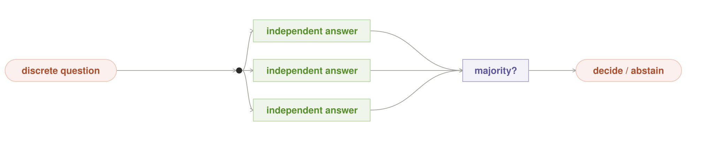
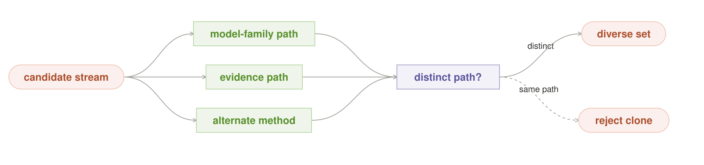
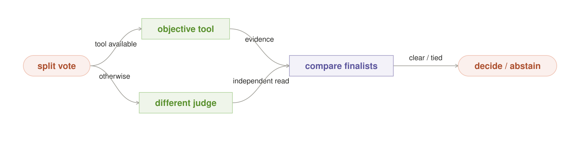
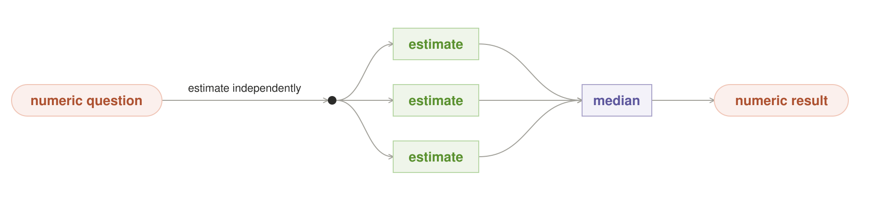
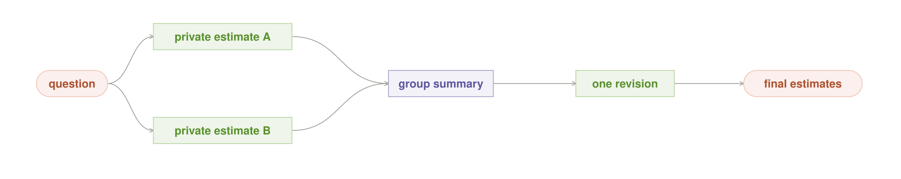

# Local-First AI Orchestration Patterns

Local-first patterns are orchestration ideas shaped around an AI runtime you
own. **Local-first means the owned path is the default**; a remote service may
remain as an explicit, policy-approved fallback. A pattern does not have to be
impossible in the cloud. It belongs here when local inference makes the move
practical to repeat, able to keep data inside an owned boundary, available
offline, or aware of models, memory, idle time, and power the operator controls.

Tokens generated on that local path have **no API meter**, but they still
consume time, memory, and energy. The local path has no vendor-controlled quota
or rate limit, but the box has real throughput limits. That tension—unmetered
inference on finite owned hardware—is the center of this catalog.

## What local changes

| Local advantage | What it makes natural |
|---|---|
| **No marginal API bill** | try, compare, verify, and retry more than once |
| **No vendor quota** | choose effort from the problem, not an account allowance |
| **No mandatory network hop** | stream locally and run tight model/tool loops without WAN jitter |
| **Owned data boundary** | keep sensitive context on-device when the whole dependency path stays local |
| **Offline continuity** | keep useful behavior when the network, vendor, or account is unavailable |
| **Owned idle time** | evaluate, cache, learn, and improve while the machine would otherwise wait |
| **Owned models and hardware** | pin exact builds and reason about residency, memory, energy, and failure |

## Start with seven

These are the shortest path into the catalog. Together they expose the local
advantages that a cloud-only catalog usually treats as unavailable or hidden.

| Pattern | Local-first reason to reach for it |
|---|---|
| [**Brute Force**](#brute-force) | try many approaches without a per-attempt API bill or provider quota |
| [**Check and Retry**](#check-and-retry) | make verification and repair ordinary control flow |
| [**Idle Worker**](#idle-worker) | turn otherwise-unused owned cycles into useful background work |
| [**Fit the Box**](#fit-the-box) | choose a workflow from real memory, not an abstract model menu |
| [**Local Cascade**](#local-cascade) | keep the owned path first and make remote use an explicit decision |
| [**Data Stays Put**](#data-stays-put) | move inference to private data instead of centralizing the data |
| [**Offline Island**](#offline-island) | preserve a complete useful path with no network or vendor account |

## How to read a pattern

Each pattern follows one rule: **one problem, one move, one clear local-first
advantage, and one tradeoff**. The small shape is the pattern. Algorithms,
thresholds, ledgers, and implementation protocols belong in the linked deep
references. Every diagram uses one visual language: coral pills are entries or
exits, green boxes are work or owned state, purple boxes are decisions, and a
dashed arrow is a retry, feedback, or later return.

| Need | Patterns |
|---|---|
| **Choose and spend** | Best Fit · Recipe Router · Adaptive Effort · Risk Ladder · Routing Memory |
| **Search and compare** | Brute Force · Check and Retry · Vote · Challenge · Diversity Gate · Tiebreaker · Ensemble · Blind Estimate |
| **Divide and reuse** | Split Work · Pipeline · Answer Cache |
| **Learn and trust** | Shadow Model · Model Audition · Night Shift |
| **Own the box** | Pinned Model · Fit the Box · Keep It Warm · Idle Worker · Power Budget · Straggler Backup · Circuit Breaker |
| **Stay sovereign** | Local Cascade · Data Stays Put · Privacy Boundary · Offline Island · Private Memory |

---

## Choose and spend

### Best Fit

*Use the smallest local model that can do the job.*

**Problem.** Sending every request to the largest model wastes memory, power,
and time. **Move.** Classify the job and choose one adequate model. **Local-first.**
The router can see which owned models are loaded and fast on this box.
**Tradeoff.** A hard request misclassified as easy silently gets a weak answer.

### Recipe Router

*Choose the workflow before the work begins.*

**Problem.** One workflow cannot serve quick questions, risky decisions, and
large jobs equally well. **Move.** Classify the request and select one known
pattern or small recipe before execution. **Local-first.** With no API meter,
multi-pass recipes become normal choices rather than separately purchased
calls. **Tradeoff.** A bad classification chooses a cheap recipe for a
deceptively hard request.

### Adaptive Effort

*Start small; spend more only while uncertainty remains.*

**Problem.** A fixed number of attempts either wastes easy work or under-serves
hard work. **Move.** Begin with a small budget and expand only when a real check
says uncertainty remains. **Local-first.** Extra attempts consume owned capacity,
not another API purchase or provider allowance. **Tradeoff.** A poor confidence
signal stops too early or turns “free tokens” into runaway local work.

### Risk Ladder

*Raise the proof bar as the cost of being wrong rises.*

**Problem.** A reversible suggestion and an irreversible action should not
receive the same scrutiny. **Move.** Map consequence classes to increasing
evidence and verification budgets. **Local-first.** With no marginal API
charge, deeper checking can be reserved for high-risk work. **Tradeoff.** A
stale or incorrect risk label gives dangerous work the cheap path.

### Routing Memory

*Remember which route works for each kind of job.*

**Problem.** The best route varies by workload and changes over time. **Move.**
Record verified outcomes by workload and prefer routes that worked before.
**Local-first.** A stable owned model roster makes private route history
reusable. **Tradeoff.** Bad labels or drift can lock routing onto the wrong
choice.

---

## Search and compare

### Brute Force

*Try many ways; keep the one that proves itself.*

**Problem.** One attempt can miss even when success is easy to recognize.
**Move.** Generate genuinely different candidates, apply the same objective
test, and return only the winner. **Local-first.** Breadth adds no per-attempt
API bill or claim on a provider allowance. **Tradeoff.** Cloned attempts add no
coverage, and a weak test selects the candidate that games the test best.

### Check and Retry

*Turn failed checks into the next repair attempt.*

**Problem.** A plausible draft may contain an error a cheap tool can identify.
**Move.** Check, return concrete failure evidence, and retry within a fixed
limit. **Local-first.** Retries become ordinary control flow instead of new API
purchases. **Tradeoff.** A bad checker rubber-stamps errors; an unbounded loop
burns the machine.

### Vote

*Ask independent workers a discrete question; use a majority or abstain.*

**Problem.** One model answer gives no signal about its own stability.
**Move.** Collect independent answers and use a majority as a confidence signal.
**Local-first.** Redundant reads can consume spare local capacity without a
per-read invoice or vendor rate limit. **Tradeoff.** Correlated models can agree
on the same wrong answer; consensus is not proof.

### Challenge

*Give every important answer a skeptic.*

**Problem.** A single model rarely notices its own assumptions. **Move.** Have a
different reader attack the answer, then resolve the concrete disagreement in
one or a few bounded rounds. **Local-first.** Extra critique rounds add no
marginal API bill. **Tradeoff.** The answer, skeptic, and judge may share one
blind spot and manufacture confidence.

### Diversity Gate

*Admit only answers that add a genuinely different path.*

**Problem.** Repeating one prompt often produces the appearance of breadth
without new evidence. **Move.** Admit a candidate only when it adds a distinct
model family or evidence path. **Local-first.** An owned roster makes model
lineage visible to the gate. **Tradeoff.** A shallow similarity test may mistake
cosmetic differences for independence.

### Tiebreaker

*When a vote splits, add new evidence—not more of the same.*

**Problem.** A simple vote can crown a weak answer when workers form several
conflicting camps. **Move.** Compare the finalists with an objective tool or a
genuinely different judge. **Local-first.** Extra ranking passes are viable
without API charges. **Tradeoff.** A supposedly independent adjudicator may
share the same prior and only add confidence.

### Ensemble

*Combine several numeric estimates with one robust rule.*

**Problem.** One estimate is noisy, while a plain average can preserve shared
bias. **Move.** Aggregate independent estimates with one declared robust rule.
**Local-first.** Repeated estimates carry no per-sample API bill. **Tradeoff.**
Correlated models still produce a precise-looking wrong number.

### Blind Estimate

*Estimate alone before seeing the group.*

**Problem.** Early confident answers anchor later estimates. **Move.** Collect
independent estimates, reveal only the summary, and allow one revision.
**Local-first.** Several blind rounds add no per-round API bill. **Tradeoff.**
The group can converge tightly around a shared wrong assumption.

---

## Divide and reuse

### Split Work

*Break one large job into named parts and give each part a specialist.*

**Problem.** One model may be poor at a task that contains several different
kinds of work. **Move.** Split by responsibility, run suitable specialists, and
merge their outputs. **Local-first.** Several small owned models can specialize
without per-stage API charges. **Tradeoff.** A bad split creates missing context
or incompatible pieces.

### Pipeline

*Pass work through a fixed sequence of transformations.*

**Problem.** Some jobs have a natural order that one giant prompt obscures.
**Move.** Give every stage one responsibility and an explicit handoff.
**Local-first.** A fully local chain adds no per-stage API charge. **Tradeoff.**
An early error contaminates everything downstream unless stages validate
inputs.

### Answer Cache

*Reuse a verified answer until its source changes.*

**Problem.** The same expensive question recurs under slightly different
wording. **Move.** Store a verified result under a key made from the request's
meaning and source version. **Local-first.** The verified result remains
available on-device. **Tradeoff.** A stale key or weak verifier turns one wrong
answer into a persistent shared answer.

---

## Learn and trust

### Shadow Model

*Let a new model observe real work before it receives live traffic.*

**Problem.** Benchmarks alone do not prove a new model is safe for the owner's
real workload. **Move.** Run it read-only beside the current model and promote
only under a predeclared evidence rule. **Local-first.** Continuous shadow
inference has no per-call API bill. **Tradeoff.** Agreement with a wrong current
model is mistaken for skill.

### Model Audition

*Test a candidate on a private offline task pack before real traffic.*

**Problem.** A newly downloaded model's strengths, compression effects, and
tool behavior are unknown. **Move.** Audition it against tasks and failure cases
that resemble real use. **Local-first.** Private representative benchmarks can
run entirely on the owned box. **Tradeoff.** A stale or gameable test pack stops
predicting production behavior.

### Night Shift

*Stage improvements away from live state; promote only what proves better.*

**Problem.** An improving system must not rewrite live state while it serves.
**Move.** Stage changes away from the live path and promote only after an
independent proof. **Local-first.** Owned idle cycles make repeated improvement
runs practical. **Tradeoff.** A builder that verifies its own work can promote
its own mistakes.

---

## Own the box

### Pinned Model

*Route to an exact model build, not a floating name.*

**Problem.** Compression, template, adapter, and runtime changes can alter
behavior while the model name stays the same. **Move.** Bind trust and routing
to one immutable build bundle. **Local-first.** The operator controls and can
retain the exact runtime artifacts. **Tradeoff.** Pinning consumes storage and
qualification effort; identity alone does not prove quality.

### Fit the Box

*Choose a version of the recipe that actually fits in live memory.*

**Problem.** A recipe may name models that do not fit in memory together.
**Move.** Before running, choose only a model combination that fits current
memory; otherwise shrink the recipe or wait. **Local-first.** The router can see
the box's real free memory. **Tradeoff.** Shrinking may reduce quality, while
waiting adds latency.

### Keep It Warm

*Keep the models you use most already loaded.*

**Problem.** Loaded models compete for finite memory, and swaps are slow.
**Move.** Keep a measured hot set resident and change it when demand changes.
**Local-first.** Residency is real state the owner can observe and control.
**Tradeoff.** The wrong hot set monopolizes memory and makes rare but important
work wait.

### Idle Worker

*Use idle compute, but yield immediately to live work.*

**Problem.** Evaluation, indexing, and learning are valuable but should not
hurt interactive use. **Move.** Run them in small, preemptible quanta only when
the device is idle. **Local-first.** The operator owns otherwise-wasted cycles
and can improve the system offline overnight. **Tradeoff.** Work that cannot
checkpoint or preempt turns “background” into foreground latency.

### Power Budget

*Keep AI work inside a power and heat ceiling.*

**Problem.** Sustained local inference can drain a battery, heat a room, or
throttle the device. **Move.** Reduce or pause work when a declared device limit
is reached. **Local-first.** The machine owner controls the relevant power and
temperature signals. **Tradeoff.** Bad calibration either harms the device
experience or refuses useful work unnecessarily.

### Straggler Backup

*Duplicate only the parallel lane that is unusually late.*

**Problem.** One slow model or node can delay the whole parallel job. **Move.**
Start a backup only after the lane crosses its measured latency threshold.
**Local-first.** Owned spare nodes can absorb speculative work without a second
API charge. **Tradeoff.** A bad threshold duplicates normal work and can create
a backup storm.

### Circuit Breaker

*Stop routing to a model that keeps failing.*

**Problem.** Repeated model failures can trap every request in the same broken
route. **Move.** Stop routing after a threshold, use a safe fallback, and probe
before reopening. **Local-first.** Runtime health is visible and controllable at
the owned router. **Tradeoff.** A temporary slowdown can trip the breaker, and
the fallback may share the same failure.

---

## Stay sovereign

### Local Cascade

*Try the owned path first; cross the boundary only on purpose.*

**Problem.** An automatic remote fallback silently turns local-first into
cloud-by-default. **Move.** Start locally and escalate remotely only through an
explicit policy decision. **Local-first.** The owned path has no API meter and
remains normal.
**Tradeoff.** A weak local attempt adds delay, while a loose gate makes the
local-first promise meaningless.

### Data Stays Put

*Move inference to private data; return only the minimum result.*

**Problem.** Centralizing raw personal or organizational data creates a larger
privacy and security boundary. **Move.** Run inference where the data lives and
return only the derived result needed upstream.
**Local-first.** Raw data stays on its original device or LAN node. **Tradeoff.**
Data may be fragmented or its device unavailable, and even a derived result can
reveal sensitive facts.

### Privacy Boundary

*Keep sensitive work local; make every external crossing explicit.*

**Problem.** A hidden advisor, tool, log, or fallback can leak the very context
local AI was meant to protect. **Move.** Label data and require an explicit
policy decision or consent before any external use. **Local-first.** Models,
tools, monitoring, and storage can all remain inside the owned boundary.
**Tradeoff.** An unclassified dependency silently defeats the guarantee.

### Offline Island

*Keep a complete useful path that requires no network or vendor account.*

**Problem.** “Local” is not offline if authentication, retrieval, monitoring, or
fallback still depends on the cloud. **Move.** Pin the full dependency path and
degrade honestly when fresh external data is unavailable. **Local-first.** The
system remains useful through outages, travel, or vendor loss. **Tradeoff.**
Cached knowledge gets stale, and queued side effects need careful replay.

### Private Memory

*Keep long-lived memory local and reveal only the slice a worker needs.*

**Problem.** A useful assistant needs memory, but a global transcript creates
privacy leaks and cross-task contamination. **Move.** Store memory locally,
scope it by person and purpose, and retrieve the minimum relevant slice.
**Local-first.** Personal history can remain owned and absent from vendor
retention when the selected path stays local. **Tradeoff.** Stale, poisoned, or
wrongly scoped memory can quietly distort every later answer.

---

## Three small recipes

- **Reliable patch:** Brute Force proposes several read-only fixes; Check and
  Retry uses tests to repair a near-pass; Pinned Model records which exact build
  produced the result.
- **Private assistant:** Data Stays Put keeps raw files at their source;
  Private Memory supplies only relevant history; Privacy Boundary and Local
  Cascade gate external use; Offline Island preserves a useful path without
  the network.
- **Quiet home grid:** Keep It Warm protects interactive latency; Idle Worker
  uses spare cycles; Power Budget limits heat; Circuit Breaker contains a bad
  model or host.

## Deep references

- [Pattern lineage](pattern_lineage.md) records where every idea in the earlier
  27-pattern research set went.
- [Research reference](portable_patterns.md) keeps the detailed algorithms,
  refinements, examples, code, and generated diagrams.
- [Archived six-pattern engineering reference](six_pattern_reference.md)
  preserves the detailed artifact, residency, boundary, idle-work, energy, and
  physical-plan contracts from the earlier proposal.
- [Agent orchestration patterns](../agent_orchestration_patterns/README.md)
  cover sessions that hold credentials, use tools, and act on the world.

These names are working design vocabulary, not claims that every pattern is
already implemented in Grid. A pattern earns its keep when the simple move
recurs and its local-first advantage survives measurement.
