# Local-First AI Orchestration Patterns

Local-first patterns are orchestration ideas shaped around an AI runtime you
own. **Local-first means the owned path is the default**; a remote service may
remain as an explicit, policy-approved fallback. A pattern does not have to be
impossible in the cloud. It belongs here when local inference makes the move
practical to repeat, able to keep data inside an owned boundary, available
offline, or aware of models, memory, idle time, and power the operator controls.

Tokens generated on that local path have **no API meter**, but they still
consume time, memory, and energy. The local path has no vendor-controlled quota
or rate limit, but the box has real throughput limits. That tension—unmetered
inference on finite owned hardware—is the center of this catalog.

This volume is the **model layer**: which model reads, how many attempts run,
how evidence is pooled, and how the logical recipe binds to owned hardware and
data. When a participant holds credentials, uses tools, edits files, sends
messages, or otherwise acts on the world, the
[agent-layer patterns](../agent_orchestration_patterns/README.md) supply the
session lifecycle, verifier authority, durable ledger, and single-actor gate.
More model votes never grant more permission to act.

## What local changes

| Local advantage | What it makes natural |
|---|---|
| **No marginal API bill** | try, compare, verify, and retry more than once |
| **No vendor quota** | choose effort from the problem, not an account allowance |
| **No mandatory network hop** | stream locally and run tight model/tool loops without WAN jitter |
| **Owned data boundary** | keep sensitive context on-device when the whole dependency path stays local |
| **Offline continuity** | keep useful behavior when the network, vendor, or account is unavailable |
| **Owned idle time** | evaluate, cache, learn, and improve while the machine would otherwise wait |
| **Owned models and hardware** | pin exact builds and reason about residency, memory, energy, and failure |

### The admission test

The topology of a pattern may also appear in a cloud system. Its **local-first
differential** must still pass at least one of three tests:

1. **Abundance test.** Restoring per-attempt billing or a provider quota would
   materially shrink the pattern's intended width, depth, or frequency. Brute
   Force and Check and Retry pass here.
2. **Substrate test.** The pattern requires exact state or control that a
   black-box endpoint hides: artifact identity, residency, free memory, idle
   time, power, device failure, or private route history. Fit the Box and Pinned
   Model pass here.
3. **Sovereignty test.** The pattern constructs a boundary or continuity
   guarantee that disappears when the dependency path is provider-controlled.
   Data Stays Put and Offline Island pass here.

A portable mechanism adapted to a local runtime is still useful, but the entry
must say so. “It has no token bill” is not enough by itself; the pattern must
name the operating policy that changes, the scarce local resource that replaces
the invoice, and the stop or admission rule that keeps abundance honest.

## Start with seven

These are the shortest path into the catalog. Together they expose the local
advantages that a cloud-only catalog usually treats as unavailable or hidden.

| Pattern | Local-first reason to reach for it |
|---|---|
| [**Brute Force**](#brute-force) | try many approaches without a per-attempt API bill or provider quota |
| [**Check and Retry**](#check-and-retry) | make verification and repair ordinary control flow |
| [**Idle Worker**](#idle-worker) | turn otherwise-unused owned cycles into useful background work |
| [**Fit the Box**](#fit-the-box) | choose a workflow from real memory, not an abstract model menu |
| [**Local Cascade**](#local-cascade) | keep the owned path first and make remote use an explicit decision |
| [**Data Stays Put**](#data-stays-put) | move inference to private data instead of centralizing the data |
| [**Offline Island**](#offline-island) | preserve a complete useful path with no network or vendor account |

## A pattern language, not a list of prompts

A pattern names a problem that returns, the forces that make the problem hard,
and a reusable arrangement that resolves those forces with known consequences.
It is not a prompt, a product feature, or an algorithm with a new name. The
implementation can change while the relationship between its participants
stays recognizable.

The patterns below form a language. **Choose and spend** decides how much owned
inference to use. **Search and compare** turns that inference into evidence.
**Divide and reuse** shapes work and preserves proven results. **Learn and
trust** changes the roster without inheriting unearned confidence. **Own the
box** binds the logical plan to real memory, latency, power, and failure.
**Stay sovereign** keeps data, operation, and memory inside boundaries the
operator controls. Related Patterns at the end of every entry are therefore
part of the pattern, not an appendix: they show which larger designs can be
composed safely.

The editorial model follows the catalog discipline described by the
[Gang of Four's early patterns paper](https://cseweb.ucsd.edu/~wgg/CSE210/ecoop93-patterns.pdf)
and Christopher Alexander's account of a
[pattern language](https://www.patternlanguage.com/archive/timeless.html): keep
the recurring context, problem, collaboration, and consequences together, then
connect the entries so they can generate a coherent system rather than a pile
of individually good ideas.

## How to read a pattern

Following the format of classic design-pattern catalogs, every entry uses the
same questions in the same order:

- **Classification** — its family, local-first differential, and maturity.
- **Also Known As / Lineage** — names used for the same family of ideas and the
  earlier work from which this formulation descends.
- **Diagram** — the compact collaboration, shown before the detailed sections.
- **Intent** — the arrangement and the result it buys, in one sentence.
- **Motivation** — a concrete pressure or failure that makes the pattern
  necessary.
- **Context** — the recurring situation before the pattern becomes relevant.
- **Problem** — the design problem, stated independently of its solution.
- **Forces** — the quality, latency, privacy, evidence, and physical constraints
  that pull in different directions.
- **Applicability** — when to use it, and when another pattern is more honest.
- **Solution** — the reusable, generative move rather than one product-specific
  implementation.
- **Local-First Differential** — what changes when inference, models, data, and
  hardware are owned rather than rented per call, and which local resource
  replaces the invoice or hidden substrate.
- **Structure** — how to read the compact diagram.
- **Participants** — the roles and responsibilities that make the structure
  real.
- **Collaborations / Mechanics** — how those participants interact for one
  request.
- **Contract and Invariants** — what must remain true for this still to be the
  named pattern.
- **Consequences** — what improves, what becomes more expensive, and which new
  constraints appear.
- **Failure Mode and Safe Exit** — the characteristic way the pattern lies and
  the honest answer, defer, refuse, checkpoint, or escalation path.
- **Implementation / Refinements** — limits, variants, and techniques that
  preserve the invariant.
- **Observe and Measure** — the baseline, quality, physical cost, and failure
  signals that can falsify the pattern's value.
- **Sample Code** — a small, implementation-neutral sketch of the control
  flow.
- **Known Uses and Evidence Status** — the established systems or research
  families behind the pattern and whether this local formulation is
  Established, Emerging, or a Candidate.
- **Worked Local Example** — one concrete request, roster, resource bound,
  outcome, and failure path.
- **Related Patterns** — the patterns that commonly precede, refine, or contain
  it.

Every diagram uses one visual language: coral pills are entries or exits,
green boxes are work or owned state, purple boxes are decisions, and a dashed
arrow is a retry, feedback, or later return. Labels sit clear of the flow so
the structure remains legible at GitHub width.

| Maturity | Meaning |
|---|---|
| **Established** | the collaboration has repeated documented uses; local application does not change its core contract |
| **Emerging** | the portable mechanism is established and credible local implementations exist, but the complete local operating policy is still being measured |
| **Candidate** | the forces and solution are coherent, but the local formulation still needs a measured implementation before it should be treated as settled |

## Choosing a pattern

Settle each contract in order; each constrains the next:

1. **What must stay owned or keep working offline?** Establish Privacy Boundary,
   Data Stays Put, Private Memory, Offline Island, and Local Cascade before
   choosing a model topology. A workflow that violates the boundary is not a
   candidate plan.
2. **What is the consequence of being wrong?** Risk Ladder sets the evidence
   floor and the allowed non-answer. Reversible advice may use one read; an
   irreversible act may require independent evidence and an act gate.
3. **Which logical collaboration produces that evidence?** Best Fit handles one
   adequate model; Pipeline orders transformations; Split Work creates named
   responsibilities; Answer Cache may remove repeated work. When success has an
   objective oracle, prefer Brute Force or Check and Retry. Otherwise choose
   among Vote, Challenge, Diversity Gate, Tiebreaker, Ensemble, and Blind
   Estimate without mistaking agreement for proof. Recipe Router binds the
   resulting composition, and Adaptive Effort may change its bounded spend.
4. **Can the current box run it honestly?** Pinned Model identifies exact builds;
   Fit the Box, Keep It Warm, and Power Budget turn the logical recipe into
   admitted seats. Straggler Backup covers an isolated tail, Circuit Breaker
   covers repeated faults, and Idle Worker uses only genuinely spare capacity.
5. **May the selected result touch the world?** The model layer produces
   evidence, not permission. A world-touching result crosses the agent-layer
   Act Gate once or leaves without acting.
6. **Which verified outcomes may change the future?** Routing Memory changes
   later choices. Shadow Model, Model Audition, and Night Shift change which
   builds may be trusted. None learns from confidence, popularity, or an
   ungraded draft.

This order makes the catalog generative: boundary and consequence constrain the
logical recipe; the substrate constrains its physical form; the act contract
constrains its effect; verified outcomes alone may change the next run.

## Catalog at a glance

| Family | Pattern | The move | Local-first lever |
|---|---|---|---|
| Choose and spend | [**Best Fit**](#best-fit) | choose one smallest adequate admitted build | exact warm roster and live capacity |
| Choose and spend | [**Recipe Router**](#recipe-router) | choose a named workflow before work begins | multi-pass recipes are not separately metered calls |
| Choose and spend | [**Adaptive Effort**](#adaptive-effort) | add work only while measured uncertainty remains | effort follows the problem rather than a provider quota |
| Choose and spend | [**Risk Ladder**](#risk-ladder) | raise evidence and proof with consequence | deeper checking spends owned capacity |
| Choose and spend | [**Routing Memory**](#routing-memory) | let verified outcomes improve the next route | private history over a stable owned roster |
| Search and compare | [**Brute Force**](#brute-force) | try distinct approaches and prove one winner | broad search has no per-attempt API invoice |
| Search and compare | [**Check and Retry**](#check-and-retry) | turn concrete check failures into bounded repair | tight local model/tool loops make retry ordinary flow |
| Search and compare | [**Vote**](#vote) | ask independent readers a discrete question; majority or abstain | redundant reads consume spare local capacity, not allowance |
| Search and compare | [**Challenge**](#challenge) | give an important answer an independent skeptic | critique rounds can be routine and private |
| Search and compare | [**Diversity Gate**](#diversity-gate) | reject candidates that add no new lineage or evidence path | the operator can inspect the owned roster and its provenance |
| Search and compare | [**Tiebreaker**](#tiebreaker) | resolve a split with new evidence, not another copy | an extra tool or divergent judge adds no API charge |
| Search and compare | [**Ensemble**](#ensemble) | pool numeric estimates with a declared robust rule | repeated private estimates and calibration stay local |
| Search and compare | [**Blind Estimate**](#blind-estimate) | estimate privately before one anonymous revision | multiple anti-anchoring rounds are practical |
| Divide and reuse | [**Split Work**](#split-work) | divide by responsibility, specialize, then merge | several smaller owned models can carry named parts |
| Divide and reuse | [**Pipeline**](#pipeline) | pass typed work through an explicit sequence | stages avoid per-call billing and WAN jitter |
| Divide and reuse | [**Answer Cache**](#answer-cache) | reuse a verified result until its validity closure changes | the cache and its private provenance remain owned |
| Learn and trust | [**Shadow Model**](#shadow-model) | observe live-shaped work read-only before promotion | continuous shadow inference has no per-call invoice |
| Learn and trust | [**Model Audition**](#model-audition) | test a candidate on a private offline task pack | private workloads can evaluate owned artifacts in place |
| Learn and trust | [**Night Shift**](#night-shift) | stage improvement in idle time and promote only independent proof | unused owned cycles become a safe improvement window |
| Own the box | [**Pinned Model**](#pinned-model) | route to one exact serving build, never a floating name | the operator controls weights, template, adapter, and runtime |
| Own the box | [**Fit the Box**](#fit-the-box) | compile the recipe into real memory or take an explicit degradation | residency, KV, load cost, and leases are visible |
| Own the box | [**Keep It Warm**](#keep-it-warm) | retain the builds that save the most expected delay | model residency is owned and observable state |
| Own the box | [**Idle Worker**](#idle-worker) | run checkpointable background quanta only in genuine slack | otherwise-unused local seats belong to the operator |
| Own the box | [**Power Budget**](#power-budget) | keep inference inside a device energy and heat envelope | physical telemetry and actuation are locally controlled |
| Own the box | [**Straggler Backup**](#straggler-backup) | duplicate only an abnormal tail on independent spare capacity | an occasional hedge adds no second API charge |
| Own the box | [**Circuit Breaker**](#circuit-breaker) | quarantine repeated route failures and probe before reopening | exact build, runtime, and device health are visible |
| Stay sovereign | [**Local Cascade**](#local-cascade) | try the owned path first and cross only through policy | remote use becomes an explicit exception |
| Stay sovereign | [**Data Stays Put**](#data-stays-put) | move inference to the data owner and return the minimum result | raw private data remains on its source device or LAN node |
| Stay sovereign | [**Privacy Boundary**](#privacy-boundary) | compile and enforce every allowed external crossing | models, tools, logs, and storage can stay inside one boundary |
| Stay sovereign | [**Offline Island**](#offline-island) | preserve a complete useful path without network or vendor account | the dependency closure is owned end to end |
| Stay sovereign | [**Private Memory**](#private-memory) | retrieve the minimum purpose-scoped slice of local history | durable personal context remains owned and deletable |

---

## Choose and spend

These patterns decide which local capability to use, which orchestration
recipe to run, and how much owned compute or evidence a request deserves.

### Best Fit

*Use the smallest local model that can do the job.*

**Classification.** Choose and spend · single-route baseline · owned-substrate
refinement · **Maturity:** established topology, emerging local policy

**Also Known As / Lineage.** Best-fit routing; single-model dispatch;
Mate-in-One in the earlier research catalog

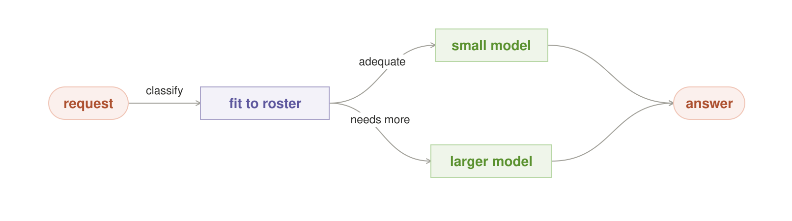

#### Intent

Choose one adequate model for the request and run it once. Best Fit is the
quality, latency, and resource baseline against which every multi-pass pattern
should be measured.

#### Motivation

A local roster often contains several useful models rather than one universal
winner: a compact extractor already resident on the accelerator, a stronger
reasoning model that requires a cold load, and a specialist tuned for code or
vision. Sending every request to the largest build wastes memory, energy, and
time. Always choosing the warmest model is no better; availability does not
prove adequacy. The recurring design problem is to make one explicit,
defensible choice between those forces.

#### Context

The operator has an admitted roster of exact model builds, a rough capability
profile for each build, and live knowledge of residency and capacity. The
request can be classified well enough to state a minimum quality floor.

#### Problem

How should the router select one model that is capable enough for this request
without paying the latency and physical cost of a larger or colder model that
adds no useful quality?

#### Forces

- Capability differs by task class; parameter count is not a universal rank.
- Warm models answer quickly, while cold loads and evictions disrupt other
  sessions.
- A one-shot route has the lowest orchestration overhead but no internal
  second opinion.
- Router uncertainty is dangerous: an easy-looking tail request can be
  confidently under-routed.
- Exact builds drift when weights, quantization, templates, or runtimes change,
  even if their friendly names do not.

#### Applicability

Use Best Fit when the request class is familiar, one answer is sufficient, and
the roster contains a model with measured performance above the required
floor. Avoid it when the class is new, the consequence of error is high, or
the classifier cannot distinguish an easy request from a deceptive one. Those
conditions call for Adaptive Effort, Risk Ladder, or an explicitly verified
recipe.

#### Solution

Filter the current roster by policy, compatibility, and minimum capability.
Rank the remaining exact builds by a declared objective such as expected
quality subject to deadline, residency, memory, and energy constraints. Bind
one build, record why it won, and run it once.

#### Local-First Differential

The portable lineage is ordinary model routing: hosted systems also choose one
model by predicted quality, cost, or latency. Local ownership changes both the
inputs and the objective. The router can see exact artifacts, warm residency,
free memory, load and eviction time, device power, and private workload
history—state a black-box API normally hides. There is no per-token API price
to minimize, so the useful local question is: *which admitted model meets the
quality floor with the least disruption to this box?*

The scarce resources are foreground latency, memory, energy, and the risk of a
wrong one-shot classification. If no eligible model clears the floor, the
pattern does not silently choose the least bad one.

#### Structure

The request reaches one routing decision, which binds exactly one model. That
model performs the work and returns one answer. The diagram deliberately has
no retry or fan-out edge: adding either would create a different pattern.

#### Participants

- **Request classifier** — extracts the task class, consequence, output type,
  and deadline.
- **Admitted roster** — describes exact builds, measured capabilities, and
  compatibility.
- **Live inventory** — reports residency, free memory, seats, and load cost.
- **Ranker** — applies the declared quality floor and selection objective.
- **Selected model** — performs the single generation.
- **Outcome recorder** — associates later verified results with the exact
  route; it does not change the current answer.

#### Collaborations / Mechanics

1. The classifier turns the request into routing features and a minimum
   capability requirement.
2. Policy removes models that violate data, tool, license, or hardware rules.
3. The inventory marks which eligible builds are warm and what a cold choice
   would displace.
4. The ranker selects one adequate build and records its score and policy
   version.
5. The selected build runs once. A later verifier may record the outcome for
   Routing Memory, but it does not retroactively create a second route.

#### Contract and Invariants

- Exactly one model build executes.
- Every candidate is identified by an immutable build contract, not a floating
  alias.
- Adequacy is a hard floor; residency and speed rank only candidates that
  clear it.
- A fallback is explicit and currently admissible. It is never an undeclared
  substitution.
- The decision record contains the request class, selected build, inventory
  version, and routing-policy version.

#### Consequences

Best Fit minimizes orchestration overhead and is often the only honest shape
on a one-seat device. It also creates a clean baseline: a more elaborate
pattern must demonstrate enough added quality to justify its additional
attempts, swaps, or delay. The liability is concentrated risk. A wrong
classification produces one weak answer with no disagreement signal, and a
policy that overvalues residency can systematically starve a stronger cold
model.

#### Failure Mode and Safe Exit

The characteristic failure is **confident under-routing**: a hard request is
classified as easy and sent to a model that cannot expose its own miss. If the
router's margin is below a declared threshold, if the class is unseen, or if
no admitted build clears the quality floor, exit to a stronger predeclared
recipe, ask for clarification, defer, or refuse. Never convert “none is
adequate” into “pick the fastest anyway.”

#### Implementation / Refinements

Begin with a small auditable rule table before training a learned router.
Separate *capability* from *availability* so a warm model cannot inherit trust
from its residency. Add hysteresis to prevent two nearly equal builds from
thrashing in and out of memory. Re-evaluate a route when any part of the exact
model contract changes. For learned routing, keep a conservative uncertainty
branch and calibrate on held-out tail requests, not only average traffic.

#### Observe and Measure

Compare with an always-largest and an always-warm baseline. Record verified
success by request class and build, router regret, under-route rate, p50/p95
latency, cold loads, evictions, energy, and escalation rate. A smaller build is
“best” only when it meets the quality floor in measured use.

#### Sample Code

~~~python
def best_fit(request, roster, inventory, policy):
    need = classify_need(request)
    if need.unknown or need.margin < policy.classification_floor:
        return defer_or_choose_stronger_recipe(request)
    eligible = [
        build for build in roster
        if policy.allows(build, request)
        and build.measured_floor(need.klass) >= need.quality_floor
        and inventory.can_run(build, request.deadline)
    ]
    if not eligible:
        return defer_or_choose_stronger_recipe(request)
    selected = min(eligible, key=lambda b: physical_cost(b, inventory))
    record_route(request, selected, inventory.version, policy.version)
    return run_once(selected, request)
~~~

#### Known Uses and Evidence Status

The portable mechanism is established. Production model serving routinely
routes a query to one endpoint, and
[RouteLLM](https://arxiv.org/abs/2406.18665) demonstrates learned routing
between stronger and weaker LLMs from preference data. Anthropic also presents
routing as a standard composable workflow in
[Building Effective Agents](https://www.anthropic.com/engineering/building-effective-agents).

The specifically local formulation—ranking exact owned builds with residency,
load/evict cost, memory, energy, and a hard adequacy floor—is **emerging**.
Promote it to established local practice only after several independent
deployments publish quality-versus-physical-cost results.

#### Worked Local Example

A home server keeps an 8B extraction build warm and stores a measured 27B
generalist on the same accelerator. A request to extract invoice fields has a
schema-defined output and the 8B build clears the held-out accuracy floor, so
Best Fit selects it without evicting the active model. A request to reconcile
contradictory contract clauses does not clear that floor for the extractor.
The router chooses the 27B build if it fits the deadline; if not, it defers to
a verified recipe rather than returning the extractor's fluent guess. Both
routes stay inside the owner's data boundary.

#### Related Patterns

**Pinned Model** supplies the exact build identity. **Fit the Box** determines
whether an otherwise adequate choice can run now. **Recipe Router** chooses a
multi-stage shape when one model is not enough. **Adaptive Effort** and
**Risk Ladder** are the uncertainty and consequence exits. **Routing Memory**
can improve future Best Fit choices from verified outcomes.

---

### Recipe Router

*Choose the workflow before the work begins.*

**Classification.** Choose and spend · orchestration meta-pattern · local
abundance plus owned-substrate compilation · **Maturity:** established
portable idea, candidate local formulation

**Also Known As / Lineage.** Strategy; plan selection; workflow router;
orchestration-plan compiler

#### Intent

Classify a request before execution and bind it to one known, inspectable
orchestration recipe. The selected recipe may contain several models, checks,
or stages, but the choice itself happens once and is recorded.

#### Motivation

One workflow cannot serve a quick fact lookup, a private document analysis, a
risky repository change, and a long background evaluation equally well. A
single-model default under-serves hard work; an always-deliberate workflow
wastes easy work. Hiding all variation behind an “auto” endpoint creates a
third failure: nobody can explain which graph ran, why it was allowed, or how
it should degrade when the box changes underneath it.

#### Context

The system has a small registry of named recipes whose inputs, outputs,
participants, resource needs, boundary rules, and safe exits are known. The
router can classify the request's shape and inspect the local inventory before
work begins.

#### Problem

How can one endpoint choose an appropriate orchestration shape without
hard-coding a single workflow or improvising an opaque graph for every
request?

#### Forces

- Different requests need different topologies: one model, a pipeline, a fan,
  a verifier loop, or a composition.
- Every extra stage adds quality opportunity and also latency, failure
  surface, and resource contention.
- Some pattern combinations are invalid: a numeric aggregate cannot pool
  prose, and a side-effecting fan cannot have several actors.
- Local feasibility changes moment to moment with residency, memory, power,
  foreground load, and connectivity.
- Users need stable names and inspectable decisions, not an unversioned “auto”
  heuristic.

#### Applicability

Use Recipe Router when the request mix is heterogeneous and a small set of
recurring workflows can be named, tested, and compared. Avoid it when there is
only one honest workflow, or when the classifier and recipe contracts are too
weak to distinguish valid plans. A recipe registry must reduce ambiguity, not
move it into configuration.

#### Solution

Define a versioned registry of typed recipes. Classify each request by output
type, consequence, data boundary, deadline, and difficulty. Choose one recipe,
bind its abstract roles to currently admissible local builds and tools,
validate the resulting physical plan, and execute that immutable plan or take
its declared safe exit.

#### Local-First Differential

The portable lineage includes GoF Strategy, request routing, prompt chaining,
parallelization, and orchestrator-worker workflows. Those shapes also run over
hosted APIs. Local ownership changes which recipes are ordinary and what the
compiler must know. Multi-pass recipes carry no per-call API invoice or vendor
allowance, while the planner can inspect exact model builds, residency, free
memory, power, private tools, and network policy.

The local router therefore compiles two things at once: the *logical recipe*
that should answer well and the *physical plan* that can run safely on this
box. The scarce resources are seats, wall time, memory, heat, and foreground
responsiveness—not an imaginary infinity of free compute.

#### Structure

The request enters one decision that selects a named recipe. The chosen recipe
then runs to an answer, defer, refuse, or escalation exit. The small catalog
diagram shows only the selection boundary; the recipe's own diagram explains
its internal collaboration.

#### Participants

- **Request classifier** — identifies output type, consequence, privacy class,
  deadline, and uncertainty.
- **Recipe registry** — stores versioned logical graphs and their contracts.
- **Policy compiler** — selects a recipe and checks type, boundary, and
  side-effect invariants.
- **Physical planner** — binds roles to exact builds and reserves feasible
  local resources.
- **Graph executor** — runs the immutable bound plan with cancellation.
- **Decision record** — preserves recipe version, bindings, policy, resources,
  and terminal outcome.

#### Collaborations / Mechanics

1. Classify the request and determine its non-negotiable constraints.
2. Filter recipes whose output type, evidence contract, or boundary cannot
   satisfy the request.
3. Score the remaining recipes by measured quality and physical cost.
4. Bind abstract roles to exact local models, verifiers, and tools.
5. Validate compatibility and acquire a versioned resource lease.
6. Execute the plan without silently inserting stages. If the lease or policy
   changes, use the recipe's declared degrade, defer, or refuse path.

#### Contract and Invariants

- A recipe has a stable name, version, typed inputs and outputs, and a declared
  terminal set.
- Every side-effecting graph has one enforceable act gate.
- External egress is explicit in the compiled graph.
- Optional stages may be removed only through a pre-evaluated degradation,
  never ad hoc.
- The logical recipe and physical bindings are recorded before dispatch.
- Invalid or infeasible plans do not execute.

#### Consequences

Recipe Router gives one endpoint a rich policy without hiding orchestration
behind a model name. Recipes can be tested, compared, replayed, and discussed
as design vocabulary. The cost is a real compiler: schemas, compatibility
rules, versions, resource admission, and degradation paths must evolve
together. A perfectly valid graph can still be the wrong graph if the request
was misclassified.

#### Failure Mode and Safe Exit

The characteristic failure is a **well-formed bad plan**: a difficult or
consequential request looks cheap, so the router chooses the quick recipe and
every structural check passes. Low classification margin, unknown request
classes, or disagreement between risk and difficulty signals must select a
conservative recipe, request clarification, or defer. If no recipe is both
valid and feasible, refuse rather than improvise.

#### Implementation / Refinements

Start with three to five named recipes, not an unrestricted graph generator.
Keep recipe selection separate from role binding: “verified patch” should
remain the same logical recipe whether its drafter is warm model A or admitted
model B. Validate recipe schemas in CI. Make the default conservative under
uncertainty, and keep a monotonic one-model baseline for degraded operation.
Only add learned selection after the rule-based registry has produced
auditable outcome data.

#### Observe and Measure

Record selection frequency, verified success per recipe and class,
misclassification regret, graph compile rejects, degradation frequency,
resource-lease failures, p50/p95 latency, joules, model swaps, and foreground
delay. Compare every elaborate recipe with Best Fit; retire recipes whose
extra stages do not buy verified improvement.

#### Sample Code

~~~python
def route_recipe(request, recipes, inventory, policy):
    need = classify_request(request)
    logical = [
        recipe for recipe in recipes
        if recipe.accepts(need) and policy.allows(recipe, request)
    ]
    selected = choose_conservatively(logical, need)
    if selected is None:
        return defer_or_refuse(request)
    plan = bind_roles(selected, inventory)
    validate_types_boundary_and_act_gate(plan, request)
    lease = inventory.reserve(plan)
    if lease is None:
        return selected.degrade_or_defer(request)
    record_plan(request, selected.version, plan, lease.version)
    return execute(plan, request, lease)
~~~

#### Known Uses and Evidence Status

Strategy selection, workflow routing, and graph compilation have mature
portable lineages. Anthropic's
[Building Effective Agents](https://www.anthropic.com/engineering/building-effective-agents)
documents routing, prompt chaining, parallelization, orchestrator-workers, and
evaluator-optimizer as recurring workflow shapes.

The exact pattern here—a named recipe chosen first, then compiled against
owned artifact, residency, boundary, and power state—is a **Candidate**. The
mechanism has strong components but needs independently reported local
deployments demonstrating that typed compilation and explicit degradation
outperform an opaque auto-router.

#### Worked Local Example

A private coding endpoint exposes three recipes: **Quick Answer** runs Best
Fit once; **Verified Patch** drafts, runs tests, repairs within three attempts,
and crosses one commit gate; **Offline Review** uses pinned models, local
retrieval, and no network sinks. A request to explain a function chooses Quick
Answer. A request to edit authentication code chooses Verified Patch. A
repository marked confidential and offline cannot select a remote advisor even
if it would be faster; the compiler binds Offline Review to the currently
resident models or defers. The decision record names the recipe and exact
bindings in every case.

#### Related Patterns

**Best Fit** is the one-model recipe and baseline. **Adaptive Effort** changes
budget inside an admitted recipe. **Risk Ladder** constrains which recipes may
serve each consequence class. **Routing Memory** may learn recipe preferences
from verified outcomes. **Fit the Box**, **Power Budget**, and **Privacy
Boundary** constrain physical compilation.

---

### Adaptive Effort

*Start small; spend more only while uncertainty remains.*

**Classification.** Choose and spend · feedback-controlled test-time compute ·
local-abundance pattern · **Maturity:** emerging

**Also Known As / Lineage.** Adaptive test-time compute; closed-loop
budgeting; PID Confidence Loop as an advanced refinement

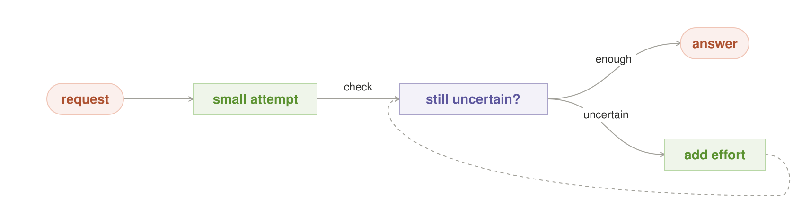

#### Intent

Begin with the cheapest adequate attempt, measure whether useful uncertainty
or failure remains, and add bounded effort only while the next attempt is
likely to improve the answer.

#### Motivation

A fixed attempt count treats every request as equally hard. One attempt
under-serves a difficult but solvable problem; eight attempts waste an easy
one and delay the next user. Local inference removes the per-attempt API
invoice, which makes adaptive depth practical, but it does not remove
wall-clock, energy, memory bandwidth, heat, or queueing. The budget should
follow evidence, not enthusiasm for “free” tokens.

#### Context

The chosen recipe can be expanded in meaningful increments, and each
increment can be evaluated by a grounded progress signal: tests, constraints,
schema checks, externally scored candidates, or a calibrated uncertainty
measure. The runtime exposes a hard deadline and resource ceiling.

#### Problem

How can the system spend enough compute on hard requests without fixing every
request at the hard-case budget or allowing an unbounded retry loop?

#### Forces

- Difficulty is unknown before work begins.
- Additional attempts often have diminishing returns.
- A controller cannot be more reliable than its progress signal.
- Same-prompt retries may repeat one blind spot rather than add evidence.
- Local effort competes with foreground latency, power, heat, and other
  sessions.
- Stopping below the desired confidence must remain an honest outcome.

#### Applicability

Use Adaptive Effort when attempts can change their search or repair behavior,
checks are cheaper than full generation, and the next increment can be
justified from evidence. Avoid it when “confidence” is merely a model
self-report, retries cannot learn from failure, or no hard bound can be
enforced. Use Brute Force for independent search and Check and Retry when a
failed verifier supplies a specific repair.

#### Solution

Declare an initial budget, an expansion quantum, a grounded check, and hard
limits on attempts, time, and physical resources. Run the initial attempt,
measure the result, and either answer, add one justified quantum of effort, or
exit. Make every additional attempt different in a declared way and report
the achieved evidence when the bound closes.

#### Local-First Differential

Iterative refinement and adaptive test-time compute are portable. Local
ownership changes their normal operating point: another attempt does not buy
another API call or consume a vendor allowance, tight generator-verifier loops
avoid WAN jitter, and the controller can read the box's foreground load,
energy, and temperature. That makes adaptive depth a routine quality policy
rather than a premium exception.

The local scarce resources are still real. The controller must optimize
verified gain per millisecond, joule, or occupied seat—not maximize tokens.

#### Structure

One attempt runs first. A decision checks whether uncertainty remains. A pass
releases the answer; a justified failure or uncertainty signal returns to the
work with a larger but still bounded budget. The feedback edge is the pattern.

#### Participants

- **Budget controller** — owns the current command and hard limits.
- **Worker or recipe** — performs each attempt.
- **Grounded sensor** — measures pass, failure evidence, or calibrated
  uncertainty.
- **Resource monitor** — reports deadline, foreground load, energy, and heat.
- **Class history** — optionally records verified difficulty and prior effort.
- **Terminal policy** — answers, defers, refuses, or escalates when the loop
  closes.

#### Collaborations / Mechanics

1. Initialize the request at the minimum admitted effort.
2. Run an attempt and evaluate it with the grounded sensor.
3. If the acceptance contract passes, stop immediately.
4. Otherwise estimate whether another changed attempt has positive expected
   value under the remaining time and resource budget.
5. Expand by one quantum, not directly to the maximum.
6. Stop at success or the first binding hard limit and emit the actual reason.

#### Contract and Invariants

- The sensor is independent of the worker's self-confidence.
- Attempts, deadline, and physical resource ceilings are fixed before the
  loop.
- Each retry changes a seed, decomposition, evidence slice, model, or repair
  based on concrete failure evidence.
- A failed final draft never becomes the answer solely because the budget
  expired.
- The response reports attempts, stop reason, and what was actually checked.

#### Consequences

Easy requests stay cheap while hard-but-solvable work can use the capacity the
owner already has. The pattern also exposes difficulty as observable behavior:
attempts-to-pass becomes a useful signal for later routing. Its liabilities
are variable latency and controller complexity. A bad sensor can stop early,
and a permissive controller can consume every spare cycle on a hopeless
request.

#### Failure Mode and Safe Exit

The defining failure is **confident control from a bad sensor**. A
rubber-stamp verifier or model self-report tells the loop it is converging when
it is not. The second failure is runaway local work: “tokens cost zero” is
mistaken for “resources are infinite.” On sensor doubt, repeated identical
errors, negative progress, foreground preemption, or limit exhaustion, stop
and return the verification report, defer, refuse, or escalate. Never force a
below-bar answer.

#### Implementation / Refinements

Start with a proportional rule: add one quantum when a concrete gap remains.
Only introduce integral history or derivative trend—PID-like control—after
the sensor is calibrated and class history is durable. Use hysteresis so a
noisy score near the threshold does not oscillate. Cap per-class escalation
and reserve foreground capacity. For generative tasks without an objective
oracle, prefer a simple time box plus disclosed uncertainty over a fabricated
confidence loop.

#### Observe and Measure

Compare with fixed one-attempt and fixed-maximum baselines. Record verified
pass rate, attempts-to-pass, marginal gain by attempt number, repeated-error
rate, false accepts, abandoned confidence, p50/p95 latency, joules, thermal
events, preemptions, and foreground queue delay. Retire expansion quanta whose
marginal verified gain is consistently non-positive.

#### Sample Code

~~~python
def adaptive_effort(request, attempt, check, limits, resources):
    result = None
    for budget in limits.quanta:
        if resources.foreground_waiting() or limits.expired():
            return defer_with_evidence(result, "resource bound")
        result = attempt(request, budget=budget, previous=result)
        verdict = check(result)
        if verdict.passed:
            return answer(result, effort=budget, verified_by=check.name)
        if not verdict.actionable or verdict.progress <= 0:
            return escalate_or_refuse(request, verdict)
    return defer_with_evidence(result, "attempt bound")
~~~

#### Known Uses and Evidence Status

Adaptive computation and test-time scaling have strong portable research
lineage. Recent work such as
[The Art of Scaling Test-Time Compute for Large Language Models](https://arxiv.org/abs/2512.02008)
studies dynamic inference effort across model type, problem difficulty, and
compute budget.

The catalog's local-first controller—grounded checks, owned resource telemetry,
preemption, and explicit physical stop rules—is **emerging**. PID is a possible
implementation, not evidence that the pattern itself is mature. Establishment
requires measured local quality curves and sensor false-accept rates across
independent systems.

#### Worked Local Example

A local coding assistant has four effort quanta. It first asks one resident
model for a patch and runs the repository tests. A passing patch returns at
once. If tests fail with a specific assertion, the second attempt receives
that evidence and repairs the failure. If the same failure repeats, the third
quantum switches decomposition rather than restating the prompt. A fourth
attempt is allowed only while no interactive request is waiting and the
device remains below its power limit. Exhaustion returns the failing test
report and no patch, rather than committing the last draft.

#### Related Patterns

**Recipe Router** selects the expandable recipe. **Check and Retry** is the
special case driven by actionable verifier failures. **Brute Force** spends a
fixed independent search budget. **Risk Ladder** chooses the required
evidence bar before adaptation begins. **Routing Memory** can initialize
future effort from verified class history. **Power Budget** and **Idle Worker**
bound physical execution.

---

### Risk Ladder

*Raise the proof bar as the cost of being wrong rises.*

**Classification.** Choose and spend · consequence-based assurance ·
local-abundance pattern · **Maturity:** emerging

**Also Known As / Lineage.** Evidence-Bar Ladder; consequence-priced proof;
tail-risk budgeting; CVaR as an optional budget estimator

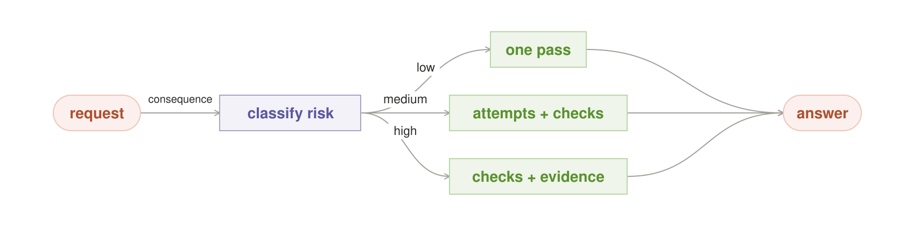

#### Intent

Classify requests by consequence and reversibility, then require progressively
stronger evidence before releasing an answer or allowing an action.

#### Motivation

A spelling suggestion, a local file edit, and a production deployment should
not cross the same proof threshold. A single confidence number hides which
mistake matters: acting when wrong, or refusing when right. Average difficulty
hides another danger—the rare request that looks normal but has catastrophic
downstream cost. Risk Ladder makes those consequences an explicit input to
orchestration rather than an afterthought.

#### Context

The system can classify requests into a small number of consequence tiers and
can state what evidence each tier requires. High-risk work has an enforceable
act gate or a terminal answer policy, so failing the bar can actually stop the
operation.

#### Problem

How should an orchestrator spend attempts and verification when the cost and
reversibility of an error vary far more than the apparent difficulty of the
request?

#### Forces

- False action and false refusal have different costs.
- Consequence can change while a request class name stays the same.
- Higher proof bars improve assurance but add delay, energy, and user friction.
- Model agreement is consistency evidence, not ground truth.
- Tail-risk estimates need enough history and a real loss definition.
- Resource pressure must not silently downgrade a high-risk request.

#### Applicability

Use Risk Ladder when requests can be grouped into stable consequence classes
with distinct evidence needs: advice, reversible local mutation, privileged
external action, or safety-critical decision. Avoid it when the tiers are
decorative labels with no enforceable gate, or when nobody can define which
error is more costly. Unknown or drifting consequence defaults upward, not
downward.

#### Solution

Define a small ordered ladder. Each rung states the consequence class, error
bias, required independent evidence, allowed orchestration budget, and safe
exit. Classify before execution, satisfy every requirement of the selected
rung, and never release or act below the bar merely because the budget ran
out.

A practical three-rung form is:

1. **Reversible** — one adequate attempt plus cheap structural checks.
2. **Consequential** — independent verification, bounded repair, and a single
   act gate.
3. **Irreversible or externally consequential** — diversified evidence,
   objective checks where possible, explicit approval, and abstain or refuse
   on unresolved ambiguity.

#### Local-First Differential

Risk-tiered assurance is portable and widely used outside AI. Local inference
changes the viable proof budget. Extra attempts and checks do not generate
additional API invoices or vendor-quota events; sensitive evidence can remain
on-device; and high-risk work can retain an offline proof path. That makes
“spend more where error matters” a routine local policy.

The local cost is paid in seat-time, latency, memory, and energy. Those limits
may cause a high rung to defer, but they may never lower its evidence
requirement. CVaR or expected-shortfall estimates may refine how much compute
to reserve for a risky tail, but the pattern is the ladder, not the estimator.

#### Structure

The request reaches a consequence decision. Increasing rungs allocate more
independent attempts, stronger checks, and stricter terminal gates before an
answer or action may leave. The diagram shows the monotonic relationship; it
does not imply that every rung uses the same internal recipe.

#### Participants

- **Consequence classifier** — assigns cost, reversibility, and error bias.
- **Ladder policy** — maps each rung to evidence and terminal requirements.
- **Evidence gatherers** — models, tools, tests, retrieval, or independent
  reviewers.
- **Grounded verifier** — certifies facts where a deterministic check exists.
- **Budget allocator** — reserves the maximum allowed local effort.
- **Act or release gate** — enforces the rung and owns abstain, approval,
  defer, or refuse.
- **Audit record** — stores the class, evidence, policy version, and outcome.

#### Collaborations / Mechanics

1. Classify consequence independently of estimated model difficulty.
2. Load the required evidence contract and maximum budget for that rung.
3. Choose a recipe capable of producing the named evidence.
4. Gather and verify evidence; agreement alone cannot certify a grounded fact.
5. The gate compares actual evidence with the rung, not with remaining budget.
6. If the bar is met, release or act once. Otherwise escalate, request
   approval, defer, or refuse.

#### Contract and Invariants

- Rungs are monotonic: higher consequence never requires weaker evidence.
- Resource pressure cannot downgrade the selected rung.
- The error bias—prefer false refusal or false action—is explicit.
- Every trust-affecting label names its verifier and evidence.
- Unknown consequence takes a conservative rung.
- Rung changes and policy versions are auditable.

#### Consequences

Risk Ladder spends local abundance where it matters and keeps cheap reversible
work responsive. It gives reviewers a shared language for why one request
received one pass while another required a council, tests, and approval. The
cost is policy maintenance. Over-ranking routine work creates latency and
friction; under-ranking irreversible work creates a false aura of safety.

#### Failure Mode and Safe Exit

The characteristic failure is **stale consequence**: a request once considered
reversible now triggers an external deployment, but its class remains on the
cheap rung. Revalidate consequence at every boundary where tools, credentials,
or external effects change. When the classifier is uncertain, choose the
higher plausible rung. If its evidence cannot be produced within the physical
budget, defer, request human approval, or refuse; do not ship at a lower bar.

#### Implementation / Refinements

Begin with a short policy table and concrete examples. Avoid pseudo-precision:
plain rungs are better than an uncalibrated risk score. Split consequence from
difficulty—a simple action can be irreversible. Attach the rung to tool
capabilities so adding a mutating tool automatically triggers reclassification.
Use tail-risk estimators only after measuring a loss function and the response
curve from extra effort to reduced verified loss.

#### Observe and Measure

Record outcomes by rung, false accepts, false refusals, human overrides,
under-rank incidents, evidence-gate failures, latency and energy premium, and
the marginal error reduction from each stronger recipe. Audit drift whenever
tools or side effects change. A high rung is valuable only if its additional
evidence actually catches failures.

#### Sample Code

~~~python
def risk_ladder(request, policy, inventory):
    consequence = classify_consequence(request)
    rung = policy.conservative_rung(consequence)
    recipe = choose_recipe_that_satisfies(rung.evidence_contract, inventory)
    if recipe is None:
        return defer_or_request_approval(request, rung)
    result = execute_bounded(recipe, request, max_budget=rung.max_budget)
    evidence = collect_named_evidence(result)
    if not rung.accepts(evidence):
        return rung.safe_exit(request, evidence)
    return release_or_act_once(result, rung)
~~~

#### Known Uses and Evidence Status

Risk-tiered assurance, staged approvals, and consequence-based controls are
established portable practices; the
[NIST AI Risk Management Framework](https://www.nist.gov/itl/ai-risk-management-framework)
is one broad example of organizing AI controls around risk. Legal evidentiary
standards and safety cases supply useful analogies, but they do not validate a
particular LLM threshold.

The exact local-AI ladder—mapping consequence to attempts, independent
verification, owned physical budget, and honest abstention—is **emerging**.
CVaR-based sizing remains a candidate refinement until deployments publish a
measured relationship between added local compute and reduced tail loss.

#### Worked Local Example

The same local coding system receives three requests. Renaming a private note
is reversible: one model proposes the change and a syntax check is enough.
Editing an authentication configuration is consequential: two independent
reads feed a schema validator, and one actor writes only after it passes.
Pushing a change that starts production deployment is externally
consequential: the system requires tests, a diversified review, an explicit
approval, and one idempotent push. If the laptop is too hot to run the final
review locally, it waits or refuses; it never falls back to the note-taking
bar.

#### Related Patterns

**Recipe Router** supplies a recipe for each rung. **Adaptive Effort** expands
within the rung's fixed ceiling. **Check and Retry**, **Challenge**, and
**Tiebreaker** provide progressively stronger evidence shapes. **Privacy
Boundary** constrains where evidence may travel. **Power Budget** may defer a
rung but cannot weaken it.

---

### Routing Memory

*Remember which route works for each kind of job.*

**Classification.** Choose and spend · stateful learning router · owned-data
and local-abundance pattern · **Maturity:** emerging

**Also Known As / Lineage.** Outcome-aware routing; Pheromone Router;
posterior router; contextual-bandit routing; Thompson sampling as a refinement

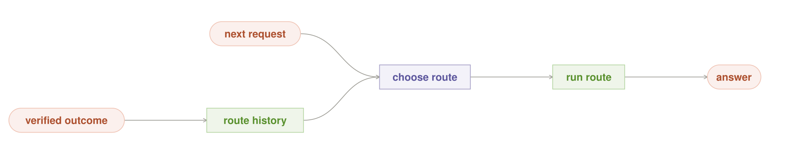

#### Intent

Record verified outcomes by workload class and exact route, then use that
private history to improve the next choice while preserving bounded
exploration and adaptation to drift.

#### Motivation

A static router assumes the best model or recipe for a class never changes.
In practice, local workloads differ from public benchmarks, model builds are
upgraded, quantization changes behavior, and request mixes drift. Repeating the
same classification mistake wastes the most valuable evidence the owner has:
what actually worked on this box for this person's work.

#### Context

Requests recur in recognizable classes, candidate routes can be identified by
exact model and recipe versions, and at least some outcomes can be verified
independently. The operator can maintain a durable local ledger and is willing
to devote a bounded share of traffic or idle work to exploration.

#### Problem

How can a local router learn from its own verified experience without locking
onto an early winner, amplifying bad labels, leaking private workload history,
or making decisions impossible to replay?

#### Forces

- Exploitation serves the known winner; exploration discovers a better or
  newly improved route.
- Outcome labels can be sparse, delayed, or wrong.
- Workloads and model behavior drift.
- A stable owned roster makes history valuable, but exact builds still change.
- Learning state is private, durable, and tenant-scoped.
- Stochastic routing conflicts with deterministic replay.
- Sparse classes cannot support elaborate per-arm statistics.

#### Applicability

Use Routing Memory when the same workload classes recur, several admissible
routes compete, and grounded outcomes arrive often enough to distinguish them.
Avoid it when labels are self-reported, traffic is too sparse, or policy
requires a frozen deterministic route. In those cases keep Best Fit static and
collect shadow evidence first.

#### Solution

Append every independently verified outcome to a durable, tenant-scoped
ledger keyed by workload class, exact model build, recipe version, policy
round, and result. Derive route scores from that ledger, decay or window stale
evidence, reserve a declared exploration budget, and choose only among routes
currently allowed by boundary, breaker, capacity, and consequence policy.
Freeze the policy snapshot and random draw for replay.

#### Local-First Differential

Contextual bandits, reinforcement routing, and posterior sampling are portable.
Local ownership makes their memory unusually useful and governable. The model
roster is stable and inspectable, private task labels and outcomes can stay on
the owner's machine, and exploration consumes owned capacity rather than a
new API purchase. The operator can also keep the exact policy state and replay
it.

A hosted route learner may still be effective, but provider-side model changes
and hidden serving state weaken the meaning of old outcomes. The local
formulation binds learning to exact artifacts and treats the outcome history
as private owned memory, not vendor telemetry.

#### Structure

A verified result is appended to route history. On a later request, the router
reads the appropriate class history, chooses one eligible route, runs it, and
feeds only a newly verified outcome back into the ledger. The forward path
answers; the feedback path learns.

#### Participants

- **Workload classifier** — assigns a stable class with an uncertainty flag.
- **Route registry** — identifies recipe, exact model build, template, and
  required resources.
- **Grounded verifier** — supplies the only labels allowed to change trust.
- **Outcome ledger** — append-only, tenant-scoped source of learning truth.
- **Policy learner** — derives scores or posteriors with decay and uncertainty.
- **Router** — samples or selects among currently eligible routes.
- **Policy guards** — apply privacy, consequence, breaker, and capacity rules
  before learning preferences.

#### Collaborations / Mechanics

1. Classify the request and load one frozen policy snapshot for that class.
2. Remove routes that are currently prohibited, broken, or physically
   infeasible.
3. Choose among eligible routes using an exploit/explore rule.
4. Execute and obtain a label from the grounded verifier.
5. Append the outcome exactly once; never update from model agreement alone.
6. Derive the next policy from the ledger using decay or a sliding window.
7. Record the snapshot and random draw so the decision can be replayed.

#### Contract and Invariants

- Only independently verified outcomes update route trust.
- Keys include exact build and recipe versions; aliases cannot inherit history.
- Learning state is isolated by tenant, purpose, workload class, and exact
  route; an alias cannot merge histories.
- Every outcome append is idempotent.
- Policy and posterior state are snapshots, not mutable hidden context.
- Exploration has a visible budget and cannot override risk, boundary,
  breaker, or capacity policy.
- A route with insufficient evidence is marked unknown, not bad.

#### Consequences

The router adapts to the owner's real workload and can discover that a smaller
specialist beats a generalist on one class. Private experience becomes a
durable system asset. The price is stateful complexity: storage, calibration,
exploration cost, drift policy, and reproducible random decisions. A bad
verifier does more harm here than in a one-shot route because learning
amplifies its mistake across future requests.

#### Failure Mode and Safe Exit

The defining failure is **confident learned wrongness**. A rubber-stamp label
rewards a weak route until exploration disappears and future requests inherit
the error. A second failure is stale lock-in: an old winner retains enough
history to starve a newly good route. Quarantine suspect labels, rebuild policy
from the immutable ledger, widen or reset a drifted window, and return to
static Best Fit while the learner is untrusted. Never “repair” the ledger by
silently rewriting outcomes.

#### Implementation / Refinements

Begin with transparent counts or exponentially weighted verified success,
including uncertainty intervals. Add minimum evidence and decay before using a
winner. Thompson sampling is a principled refinement when exploration matters:
sample each eligible arm's posterior and select the highest draw. Match the
likelihood to the reward; Beta updates apply only to consistently defined
binary outcomes. Persist lazily for routes actually used, and serialize
per-key updates. Use shadow or idle probes for cold start, while retaining a
small explicit live exploration share if production distribution matters.

#### Observe and Measure

Compare against static Best Fit. Record verified reward and regret by class,
route entropy, exploration share, posterior or confidence calibration,
time-to-detect drift, stale-winner incidents, label reversals, policy rebuilds,
state size, and physical cost of exploration. Report every exploratory choice
to the caller or audit stream.

#### Sample Code

~~~python
def route_with_memory(request, routes, ledger, guards, policy_round):
    klass = classify_workload(request)
    histories = {
        route.exact_id: ledger.events(
            tenant=request.tenant,
            purpose=request.purpose,
            workload_class=klass,
            route=route.exact_id,
        )
        for route in routes
    }
    snapshot = learn_policy(histories, window="recent")
    eligible = [r for r in routes if guards.allow(r, request)]
    if not eligible:
        return defer_or_refuse(request)
    selected, draw = snapshot.choose_with_bounded_exploration(eligible)
    result = run(selected, request)
    label = grounded_verifier.verify(request, result)
    ledger.append_once(
        outcome(
            request_id=request.id,
            tenant=request.tenant,
            purpose=request.purpose,
            workload_class=klass,
            route=selected.exact_id,
            label=label,
            policy_round=policy_round,
        )
    )
    release = selected.release_gate.evaluate(request, result, label)
    if not release.passed:
        return defer_or_refuse(request, release)
    return result, {"route": selected.exact_id, "policy_draw": draw}
~~~

#### Known Uses and Evidence Status

Online learning and contextual-bandit routing have established portable
lineage. [Thompson Sampling for Contextual Bandits with Linear
Payoffs](https://arxiv.org/abs/1209.3352) provides a primary account of
posterior sampling in contextual bandits, and learned LLM routing systems such
as [RouteLLM](https://arxiv.org/abs/2406.18665) establish the broader
outcome-aware routing problem.

The exact local-first pattern—private per-workload history bound to immutable
model builds, grounded labels, owned exploration, and replayable policy
snapshots—is **emerging**. Pheromone decay, PID history, and Thompson sampling
are implementation options, not separate maturity claims.

#### Worked Local Example

A private development server handles recurring **mechanical refactor** and
**concurrency diagnosis** classes. Verified test outcomes show that a compact
code model is faster and equally successful on mechanical refactors, while a
larger reasoning build wins concurrency diagnoses. Routing Memory learns those
separate preferences. After the compact model is requantized, it receives a
new exact identity and starts in shadow rather than inheriting the old build's
trust. A small posterior-sampling budget occasionally tests the larger model
on refactors and the compact model on diagnosis. All prompts, labels, and
policy state remain on the owner's LAN.

#### Related Patterns

**Best Fit** is the static baseline. **Recipe Router** supplies the routes that
memory may prefer. **Shadow Model** and **Model Audition** seed evidence for a
new build. **Adaptive Effort** may read class difficulty history without
sharing its controller state. **Pinned Model** defines route identity.
**Circuit Breaker** and **Fit the Box** remove ineligible arms before the
learned preference is applied.

---

## Search and compare

These patterns spend owned inference on additional attempts, checks, or
independent views. Their shared rule is that repetition must buy new evidence:
different search paths, actionable verifier failures, independent judgments,
or a declared pooling rule. Agreement is never presented as proof, and every
loop or fan has a physical budget and an honest non-answer exit.

### Brute Force

*Try many ways; prove one winner.*

**Classification.** Search and compare · local-abundance pattern ·
generate-and-test topology · **Maturity:** established portable mechanism,
candidate local operating policy

**Also Known As / Lineage.** Best-of-N selection; randomized restarts;
generate-and-test; portfolio search; Brute-Force Search in the earlier focused
catalog

#### Intent

Spend a bounded amount of owned inference on several genuinely different
approaches to the same goal, then retain one result that passes an objective
test. Search broadly, verify cheaply, and act at most once.

#### Motivation

Some problems are easier to recognize than to construct. A test suite can
identify a valid patch, a solver can check a witness, and a schema can accept
an artifact even when no planner can predict which search path will produce
it. Betting on one attempt makes the first decomposition or sampling accident
decisive. When extra attempts carry no marginal API bill, broad search can
become an ordinary quality policy—but only if the breadth is real and the
winner is proved by something stronger than model preference.

#### Context

The operator controls one or more local inference seats. A request has many
plausible solution paths, a deterministic tool or externally grounded fact can
recognize success, and speculative workers can be kept read-only until a
winner is selected.

#### Problem

How can the system buy more solution coverage when the winning approach is
unknown, without turning repeated guesses into unbounded physical work,
correlated confidence theater, or repeated side effects?

#### Forces

- Construction may be difficult while verification is cheap and reliable.
- Different search paths improve coverage; cloned attempts only imitate it.
- Every candidate must face the same acceptance contract.
- A larger search cannot repair a weak oracle; it finds better ways to satisfy
  that oracle.
- Local attempts have no marginal API invoice, but consume finite seat-time,
  wall-clock, memory bandwidth, energy, heat, and foreground capacity.
- A logical fan may run serially on one seat; local does not imply parallel.
- Increasing search width must not multiply mutation risk.

#### Applicability

Use Brute Force for patches checked by tests, structured output checked by a
schema, plans checked against constraints, solver witnesses, counterexamples,
or generated artifacts with measurable acceptance criteria. Avoid it when
quality is primarily subjective, when “best” means another model's taste, when
attempts cannot be isolated from side effects, or when their physical impact
cannot be bounded.

#### Solution

Declare a search envelope containing an attempt limit, deadline, seat or
concurrency limit, and relevant device constraints. Give the same goal and
acceptance contract to several isolated, read-only attempts, but vary their
search policies deliberately. Test every candidate with the same deterministic
or externally grounded oracle. Among passing candidates, choose one with a
predeclared tie-break. If none passes before the envelope closes, defer,
refuse, or escalate. Never ship the least-bad failed candidate because the
budget expired.

#### Local-First Differential

The fan-and-select topology is portable. The local-first differential is its
normal operating width and who controls the budget. Attempt N adds no Nth API
invoice, consumes no vendor allowance, and requires no provider admission.
The operator chooses N from the measured verified-quality curve against owned
seat-time, deadline, model swaps, energy, heat, and foreground load. Restoring
per-attempt metering or provider quotas materially shrinks that width, so this
pattern passes the abundance test.

The scarce resources are physical, not monetary tokens: accelerator time,
memory bandwidth, latency, joules, and the opportunity cost of delaying live
work. One GPU may execute all approaches serially. “No API bill” never means
“unbounded” or “parallel.”

#### Structure

A request enters a fan. Each green worker explores a visibly different path,
such as direct construction, decomposition, counterexample-first search, or a
different model family. Their candidates converge on one purple
`test + select` decision. Only a passing candidate reaches the answer. A
conforming implementation adds an explicit non-answer exit when no candidate
passes.

#### Participants

- **Request contract** — supplies the goal, acceptance rule, consequence
  class, and resource envelope.
- **Approach portfolio** — names the distinct search policies to try.
- **Local scheduler** — admits attempts against live seats, memory, deadline,
  power, and foreground policy.
- **Attempt workers** — generate candidates independently and read-only.
- **Objective oracle** — applies one deterministic or externally grounded
  acceptance rule to every candidate.
- **Selector** — chooses among passing candidates with a stable tie-break.
- **Act gate** — permits only the selected artifact to mutate, when the result
  touches the world.

#### Collaborations / Mechanics

1. Bind the goal, oracle, tie-break, and physical budget before generation.
2. Select approaches that differ by method, evidence, seed, decomposition, or
   evaluated model lineage.
3. Admit only the attempts that fit current resources; serialize them when the
   box has one seat.
4. Run every admitted attempt in an isolated read-only context without access
   to peer drafts.
5. Apply the same oracle to each candidate and record its evidence.
6. Choose one passing candidate by the declared tie-break, cancel remaining
   work only when early success is legal, and route the winner through one act
   gate.
7. If no candidate passes, return the verification evidence and take the safe
   exit.

#### Contract and Invariants

- All attempts receive the same goal and acceptance contract.
- Every attempt is read-only; only the selected artifact may reach an actor.
- The approach portfolio is declared before results are observed.
- The budget includes attempt count, deadline, and the scarce local resources
  relevant to the device.
- The oracle is deterministic or externally grounded wherever possible and
  reports what it checked.
- A failed candidate cannot win by popularity or by being the last survivor.
- One `round_id` produces at most one committed side effect.

#### Consequences

Verified success can rise quickly when approaches fail independently, and the
mechanism is simple to schedule across available seats. It converts spare local
capacity into measurable coverage and makes collective failure visible. In
return it consumes physical capacity, requires a maintained portfolio of real
approaches, and adds serial latency on a one-seat box. Correlated attempts
create confidence theater. An incomplete oracle turns a wider search into a
more effective test-gaming contest.

#### Failure Mode and Safe Exit

The characteristic failures are **pretend diversity** and **oracle gaming**.
In the first, N attempts repeat one blind spot; in the second, breadth discovers
increasingly effective ways to satisfy the wrong test. Detect collapse through
approach ids, output fingerprints, model/evidence lineage, and held-out oracle
checks. If the pool collapses to clones, inject a materially new path or stop.
If no candidate passes, return `defer / refuse / escalate` with the oracle
evidence. Never choose a failed candidate merely to terminate.

#### Implementation / Refinements

Vary the search, not the contract: seeds, decompositions, heuristics, evidence
slices, and model families may differ; the success test does not. Express the
budget as a tuple such as
`{N, deadline, seat_seconds, joules, max_foreground_delay}`. Measure realized
diversity rather than trusting prompt labels. Prefer tests, compilers, schemas,
solvers, calculators, and measured scores to model preference. Declare
tie-breaks before seeing results—for example smallest passing patch, best
validated score, lowest latency, then stable submission order. Permit early
cancellation only when one passing result is sufficient under the contract.

#### Observe and Measure

Compare with `N=1`. Record passing-result rate, marginal verified gain per
additional attempt, approach and output diversity, oracle false accepts on
held-out bad artifacts, p50/p95 wall-clock, seat-seconds, model loads and
evictions, joules, early cancellations, safe exits, and foreground queue
delay. Shrink or retire width that no longer buys verified wins.

#### Sample Code

~~~python
def brute_force(request, approaches, executor, verify, budget):
    candidates = executor.map_bounded(
        lambda approach: run(request, approach, read_only=True),
        approaches,
        deadline=budget.deadline,
        seats=budget.seats,
    )
    passing = []
    for candidate in candidates:
        result = verify(candidate)
        if result.passed:
            passing.append((candidate, result))
    if not passing:
        return defer("no candidate passed the acceptance contract")
    return choose_by_declared_tiebreak(passing)
~~~

#### Known Uses and Evidence Status

Best-of-N test-time sampling, randomized-restart search, fuzzing,
property-based generation, solver portfolios, and systems that generate
patches until tests pass all use the same portable collaboration: vary
construction, hold verification constant, retain one winner.

That portable lineage is established. The specifically local formulation is a
**Candidate**: it should remain a proposal until measured implementations
publish verified gain versus `N=1`, realized diversity, latency, energy, model
swaps, foreground interference, and honest no-winner exits across independent
deployments.

#### Worked Local Example

A concurrency regression receives six read-only patch attempts. One tries the
smallest lock-order change, one decomposes by call path, one searches for a
minimal counterexample first, and three use seeded restarts over different
edit plans. The same tests judge all six; patch size and stable order break
ties between passing diffs. On one GPU they run serially. Five candidates
disappear. One passing diff may cross the repository's act gate once. If no
diff passes, the system returns the failed-test evidence instead of the most
persuasive patch.

#### Related Patterns

**Diversity Gate** rejects correlated attempts. **Check and Retry** repairs one
near-pass from concrete verifier evidence. **Vote** selects by agreement rather
than an objective oracle. **Adaptive Effort** chooses width dynamically.
**Fit the Box** and **Power Budget** constrain the physical plan. **Pinned
Model** records the exact builds that produced the candidates. The agent-layer
**Act Gate** ensures that N speculative workers still produce at most one
mutation.

---

### Check and Retry

*Turn failed checks into the next repair attempt.*

**Classification.** Search and compare · local-abundance pattern · bounded
feedback loop · **Maturity:** established portable mechanism, candidate local
operating policy

**Also Known As / Lineage.** Bounded Verify-and-Repair; Verifier Gate;
generator-verifier loop; evaluator-optimizer loop

#### Intent

Produce one draft, check it with a real verifier, feed concrete failure
evidence into a changed repair attempt, and repeat only within a declared
bound. Release a result only after it passes.

#### Motivation

One-shot generation creates a wasteful choice: ship a plausible unchecked
artifact or discard a nearly correct result whose defect was cheap to
identify. Compilers, tests, schemas, and calculators often know exactly what
failed. That failure can become useful input to a repair instead of a terminal
verdict. Locally, the extra cycle is not a new purchase, so verify-and-repair
can become normal control flow—provided that the verifier is real and the
loop has an honest end.

#### Context

A generator can produce plausible but imperfect work. A cheaper, more
reliable verifier can detect relevant errors and return findings specific
enough to guide a repair. The request permits another attempt within a finite
deadline and physical resource envelope.

#### Problem

How can the system use failed verification to improve a near-pass without
lowering the release bar, replaying the same mistake indefinitely, or letting
an incomplete checker become the definition of correctness?

#### Forces

- Verification should be cheaper and more trustworthy than generation.
- A repair needs actionable evidence, not only a pass/fail bit.
- Each retry must change the attempt enough to make progress.
- The verifier must be independent of the generator's confidence and state
  what it checked.
- Local retries add no API bill but consume wall-clock, seats, energy, heat,
  and foreground queue capacity.
- Exhaustion must remain a failure; it cannot silently lower the quality bar.
- Optimizing repeatedly against one incomplete check can produce a better
  check-gamer rather than a better artifact.

#### Applicability

Use Check and Retry for compiler errors, failing tests, linter findings,
schema violations, citation mismatches, calculator checks, constrained plans,
and other failures that are cheaper to detect than to avoid. Use Brute Force
when attempts cannot learn from one another. Avoid this pattern when the
checker cannot see the important error, returns no useful evidence, or is
nearly as subjective as the generator.

#### Solution

Generate a draft, run a deterministic or tool-grounded check, and release
immediately on pass. On failure, return the exact findings to a repair attempt
and require a material change. Stop at the first of the attempt cap, deadline,
resource ceiling, unsafe condition, non-actionable failure, or repeated error.
On exhaustion, return the failure evidence and defer, refuse, or escalate.

#### Local-First Differential

The evaluator-optimizer topology is portable. Local abundance changes its
practical depth and default frequency: another repair creates no API invoice
or vendor-quota event, local tools can stay beside private data, and tight
model-tool loops avoid WAN jitter. Restoring metering or provider limits
materially reduces the intended retry depth, so the pattern passes the
abundance test.

Retries are still paid for in seat-time, wall-clock, model residency, energy,
heat, and foreground interference. Both an attempt cap and a deadline are part
of the pattern contract, not optional tuning.

#### Structure

A request reaches green `draft / repair`, then purple `check`. A pass reaches
`verified answer`. A dashed feedback path carries concrete failure evidence
back to repair. The separate `defer / refuse` exit is taken when the declared
limit binds or continuing would be unsafe. A failed check never points at the
answer.

#### Participants

- **Generator** — produces the first draft and changed repairs.
- **Verifier** — names what it checked and returns structured findings.
- **Loop controller** — owns the attempt cap, deadline, device limits, and stop
  reason.
- **Attempt record** — stores candidate identity, findings, verifier version,
  and change from the prior attempt.
- **Release gate** — accepts only a result that passes the full current check.
- **Escalation target** — receives the failure report when the loop cannot
  finish safely.

#### Collaborations / Mechanics

1. Bind the verifier, acceptance bar, attempt cap, deadline, and resource
   ceiling before the first draft.
2. Generate a candidate and run the full verifier independently of generator
   confidence.
3. On pass, record the verifier identity and release the candidate.
4. On failure, classify the findings as actionable, repeated, non-actionable,
   or unsafe.
5. Feed actionable evidence into a changed repair; never ask merely to “try
   again.”
6. Re-run the complete verifier from scratch after each repair.
7. On repetition, exhaustion, deadline, or host limit, stop and return the
   findings through the safe exit.

#### Contract and Invariants

- Only a passing result may cross the release gate.
- The verifier is pinned and attributable; its coverage is stated.
- Every repair receives concrete failure evidence and must materially change
  the candidate or strategy.
- The loop stops at the first declared logical or physical bound.
- The final verification checks the entire artifact, not only the latest diff.
- A verifier failure, crash, or timeout is not a pass.
- The last failed draft never becomes the answer because the budget expired.

#### Consequences

Cheap failures become useful input, so a near-pass can be repaired instead of
discarded. Verification becomes visible and release semantics become stronger
than one-shot generation. The costs are additional latency and local compute,
verifier engineering, and the risk of optimizing against an incomplete check.
Repeated local edits may also make an artifact more complex than a fresh
independent attempt would have been.

#### Failure Mode and Safe Exit

The characteristic failure is a **rubber-stamp verifier**: a shallow check
confirms the same wrong artifact, or teaches repairs to exploit what it omits.
A second failure is a retry that repeats the same error under slightly
different prose. Measure false accepts on held-out bad artifacts and detect
repeated failure fingerprints. If the check is non-actionable, repeats, fails
itself, or the bound expires, return `defer / refuse / escalate` with the last
complete findings. Never ship the final failed draft.

#### Implementation / Refinements

Bound by both attempts and time; add battery, temperature, or foreground
limits where relevant. Prefer deterministic tools, then independently
evaluated model verifiers only when tools cannot express the contract. Make
findings structured and attributable. Require each repair to address at least
one finding or change strategy. Detect a repeated error early rather than
spending all K attempts. Separate generator and verifier artifacts, prompts,
and state where possible. Keep a held-out suite of known bad candidates to
measure the verifier's false-accept rate.

#### Observe and Measure

Compare with one-shot generation and Brute Force. Record verified pass rate,
attempts-to-pass, first-pass rate, repeated-error rate, non-actionable findings,
false accepts on held-out bad artifacts, verifier crashes and timeouts,
deadline and host-limit exits, p50/p95 latency, seat-seconds, joules, and
foreground delay. A deeper loop earns its cost only when it converts real
failures into independently verified passes.

#### Sample Code

~~~python
def check_and_retry(request, generate, verify, limit):
    evidence = None
    for attempt in range(1, limit.max_attempts + 1):
        if limit.deadline_or_host_limit_reached():
            break
        candidate = generate(request, failure_evidence=evidence)
        result = verify(candidate)
        if result.passed:
            return verified(candidate, by=result.verifier_id)
        if not result.actionable or result.repeats(evidence):
            evidence = result.findings
            break
        evidence = result.findings
    return defer("verification did not pass", evidence=evidence)
~~~

#### Known Uses and Evidence Status

Compile-and-fix loops, test-guided program repair, schema validation with
correction, counterexample-guided synthesis, and workflows that revise an
artifact from deterministic lint or constraint failures share this portable
structure. Generator-verifier loops are established mechanisms.

The bounded local policy is a **Candidate**. It needs independently measured
implementations that report pass-rate improvement, attempts-to-pass, verifier
false accepts, repeated errors, deadline exits, joules, model residency, and
foreground impact rather than counting retries as success.

#### Worked Local Example

A local model writes a configuration change. A schema validator rejects one
field and returns its exact path, expected type, and received value. The next
attempt repairs that field, and the entire document is validated again. If it
still fails after three attempts or the interactive deadline closes, the
system returns the validation report instead of an unchecked configuration.
Every model call, check, and failure report remains on the owned machine.

#### Related Patterns

**Brute Force** uses independent approaches rather than repair feedback.
**Challenge** supplies critique when no deterministic checker exists.
**Pipeline** can place a cheap contract between stages. **Adaptive Effort**
may change the retry budget, while **Risk Ladder** changes the required
evidence. **Circuit Breaker** stops routing to a verifier or generator that
repeatedly fails.

---

### Vote

*Ask independent workers a discrete question; use a majority or abstain.*

**Classification.** Search and compare · local-abundance pattern · discrete
pooling topology · **Maturity:** established portable mechanism, candidate
local population contract

**Also Known As / Lineage.** Fan-Out; majority pool; self-consistency vote;
redundant read; the voting branch of Diverse Council

#### Intent

Obtain several independent answers to one discrete question and use a declared
majority as a signal of answer stability. If a valid majority or adequate
independence is absent, abstain rather than manufacture consensus.

#### Motivation

A single answer reveals nothing about whether a small change in sampling,
framing, evidence, or model would reverse it. Several private reads can expose
that instability and turn disagreement into a useful signal. The danger is
that countable voices look like evidence even when they share one training
tail or retrieval error. Vote is useful only when it says exactly what a
majority warrants: consistency across the declared population, not truth.

#### Context

The request can be reduced to a finite, unambiguous answer vocabulary. Several
models or sampling paths can inspect the same evidence privately, and the
router can describe enough of their lineage to state an independence claim.
The consequence policy defines whether a majority is sufficient or only a
reason to continue.

#### Problem

How can redundant reads reveal answer stability without turning correlated
copies, lossy normalization, or a narrow plurality into false proof?

#### Forces

- Majority pooling is simple, deterministic, and easy to explain.
- Its warrant depends on independence that shared training, prompts,
  retrieval, and runtimes can violate.
- Normalizing free text into labels can erase meaningful disagreement.
- Waiting for every worker raises tail latency; returning early can ignore a
  possible reversal.
- Extra reads have no local API bill but spend seats, swaps, energy, and queue
  time.
- Consequential decisions require stronger evidence than agreement alone.
- A legal abstention is more honest than forcing a winner from a split pool.

#### Applicability

Use Vote for discrete classification, candidate selection, or bounded factual
questions where genuinely different reads are available and a stability signal
is useful. Avoid it for open-ended prose, numeric estimation, populations
dominated by one lineage, or high-consequence claims that an objective tool can
check. Use Ensemble for numbers, Brute Force for an objective winner, and
Challenge when dissent matters more than count.

#### Solution

Predeclare the answer vocabulary, population, quorum, diversity floor, and
abstention rule. Fan the same question and evidence to independent, read-only
workers without showing earlier answers. Normalize each response under a
deterministic contract, count valid votes, and return the majority together
with its distribution and independence disclosure. Abstain on a split,
malformed responses, inadequate diversity, or a consequence class that
requires external proof.

#### Local-First Differential

Voting is portable. The local-first abundance move is to make several full
reads routine without a per-read API charge, vendor quota, or mandatory WAN
hop. An owned roster can also expose exact builds and keep private evidence
inside the operator's boundary. Restoring metering materially reduces routine
fan width, so the pattern passes the abundance test.

Owned execution does not create epistemic independence. Different processes,
quantizations, or temperatures may still sample one prior; separate hosts may
still share one training tail. The local budget includes seats, model swaps,
wall-clock, heat, energy, and foreground delay.

#### Structure

A discrete question enters a fan of peer workers. Their answers converge on
the purple `majority?` decision. The exit is deliberately
`decide / abstain`: the diagram does not claim that a majority is always
available or that it constitutes proof.

#### Participants

- **Question contract** — defines the allowed answers and normalization rules.
- **Population selector** — chooses workers and records model, prompt,
  evidence, and physical lineage.
- **Voters** — answer privately and read-only without seeing earlier ballots.
- **Normalizer** — deterministically accepts or rejects each response as a
  ballot.
- **Counter** — applies the quorum and abstention rules.
- **Evidence gate** — decides whether the majority is sufficient for the
  request's consequence class.
- **Audit record** — preserves ballots, effective arity, missing votes, and
  the confidence claim actually made.

#### Collaborations / Mechanics

1. Bind the label schema, voter population, independence floor, quorum, and
   consequence rule before dispatch.
2. Send identical question evidence to private read-only voters.
3. Normalize each answer without consulting the other ballots; reject
   ambiguous or malformed responses.
4. Compute both raw run count and effective independent arity.
5. Apply the majority rule only to the admitted ballots.
6. Return early only when the outcome is mathematically irreversible or the
   policy explicitly permits a first quorum.
7. Release the label with its distribution and lineage disclosure, or abstain
   and pass the split to an approved next pattern.

#### Contract and Invariants

- The answer vocabulary and quorum are declared before voting.
- Voters cannot observe prior ballots or act on the world.
- A ballot is counted only if it satisfies the fixed normalization contract.
- `runs` and effective independent `arity` are reported separately.
- Agreement is a consistency signal, never an external-truth claim.
- A tie, inadequate diversity, or insufficient consequence warrant has an
  explicit abstain exit.
- No random or hidden rule converts a split into a winner.

#### Consequences

Vote makes answer instability observable, is easy to explain, and can use
several warm local workers without a per-read invoice. A clear irreversible
majority can permit cancellation of late work. Its central liability is false
consensus: correlated workers can agree more confidently than one worker while
adding no new evidence. The pattern also spends redundant compute on easy
questions and may expose a population split without resolving it.

#### Failure Mode and Safe Exit

The characteristic failure is **unanimous-but-wrong**: workers share one prior,
retrieval error, or framing and certify it by repetition. A second failure is
lossy normalization that turns nuanced disagreement into the same label.
Disclose effective independence and retain rationales for audit where policy
permits. If the pool is split, too correlated, malformed, or consequential
beyond the vote's warrant, `abstain / defer` and invoke a Tiebreaker,
objective tool, or human review.

#### Implementation / Refinements

Pin the label schema and reject ambiguous mappings. Require a minimum number
of valid, sufficiently independent ballots, not merely a majority of whatever
returned. Construct diversity with model lineage, evidence partitions, or
method differences and disclose what was actually obtained. Use an odd nominal
N only as a convenience; abstention still remains legal. Cancel outstanding
workers only after a declared irreversible quorum. Expose counts,
abstentions, missing votes, build contracts, and population-policy version.

#### Observe and Measure

Compare with one strong read. Record externally verified accuracy and
calibration, vote margin, tie and abstention rate, false-consensus cases,
effective versus nominal arity, lineage concentration, normalization rejects,
early cancellations, p50/p95 latency, seat-seconds, model swaps, joules, and
foreground delay. Do not use internal agreement as the outcome label that
validates the vote.

#### Sample Code

~~~python
def vote(request, workers, contract, policy):
    ballots = []
    for worker in workers:
        raw = worker.answer(request, private=True, read_only=True)
        ballot = contract.normalize(raw)
        if ballot is not None:
            ballots.append((worker.lineage, ballot))
    if not policy.diverse_enough(ballots):
        return abstain("insufficient independent reads")
    result = policy.majority(ballots)
    if result is None or policy.requires_external_proof(request):
        return abstain("no sufficient majority", ballots=ballots)
    return decision(result.label, distribution=result.counts)
~~~

#### Known Uses and Evidence Status

Ensemble classifiers, replicated review, jury-style pooling, and
self-consistency decoding all use repeated discrete judgments and a majority
rule. The portable mechanism is established as a way to measure population
stability; it is not a proof system.

The local population contract is a **Candidate**. It needs independently scored
deployments that report accuracy and calibration against one strong read,
effective independence, false-consensus rate, latency, swaps, energy, and the
quality of abstentions. Agreement by itself is not validating evidence.

#### Worked Local Example

A support ticket must be labeled `billing`, `security`, or `product`. Three
local readers inspect it without seeing one another's answers. Two evaluated
families return `security`; a sibling build returns `product`. The router
reports a 2–1 majority and the lineage composition. Because the label only
chooses a review queue, policy may route it. If the label would automatically
disclose data or close an account, the same vote invokes an independent policy
check instead of acting.

#### Related Patterns

**Diversity Gate** constructs a less-correlated population. **Tiebreaker**
handles a material split. **Challenge** seeks defects rather than votes.
**Ensemble** pools numeric estimates, while **Blind Estimate** prevents early
anchoring. **Brute Force** chooses by an objective test instead of popularity.

---

### Challenge

*Give every important answer a skeptic.*

**Classification.** Search and compare · local-abundance pattern ·
adversarial review topology · **Maturity:** established portable lineage,
candidate local skeptic-resolver contract

**Also Known As / Lineage.** Adversarial; dissent gate; red-team pass;
generator-critic; bounded debate; part of the earlier Diverse Council

#### Intent

Subject a consequential proposed answer to an independent, evidence-seeking
challenge before release. Resolve concrete objections in a bounded process,
qualify the answer where warranted, and abstain when a material disagreement
remains.

#### Motivation

The costliest model failures are often quiet: a fluent answer omits a
condition, assumes the disputed premise, or cites only evidence that supports
its frame. Asking the proposer to “double-check” usually preserves that frame,
and a vote rewards agreement rather than the one useful objection. A separate
skeptic gives dissent a defined role and makes unresolved risk an acceptable
result instead of a nuisance to summarize away.

#### Context

A plausible answer already exists, no cheap objective oracle can fully settle
it, and quiet omissions or shared assumptions are materially dangerous. A
second reader can be given a genuinely different model lineage, evidence
partition, or failure-hunting method.

#### Problem

How can the system make independent dissent productive without creating an
endless debate, rewarding rhetorical opposition, or transferring all trust to
another unexamined model that may share the same blind spot?

#### Forces

- Independent critique can expose quiet wrongness but always adds a full read.
- Diversity must be engineered rather than requested in a prompt.
- Objections should trace to claims and evidence, not rhetorical style.
- A resolver may share the same blind spot as both proposer and skeptic.
- More rounds can sharpen a disagreement or entrench it.
- Local critique has no per-round API bill but consumes seats, time, swaps,
  power, and foreground responsiveness.
- An abstention is valuable only when material disagreement is preserved for
  the next authority.

#### Applicability

Use Challenge for design reviews, interpretations, risk discovery,
consequential recommendations, and other work where no complete deterministic
verifier exists but an independent reading can expose defects. Avoid it for
cheap factual lookups, when proposer and skeptic cannot be made meaningfully
different, or when an objective test can settle the question directly. Use
Check and Retry when verifier failures are actionable.

#### Solution

Give the proposed answer and its evidence to an independent skeptic with a
structured mandate: identify unsupported claims, conflicting evidence,
counterexamples, missing risks, and conditions under which the answer fails.
Send the objections to a resolver that must address each material item with
evidence, revise or qualify the answer, invoke an objective tool, or abstain.
Bound the exchange to one or a few rounds and never treat exhaustion as
permission to force a ruling.

#### Local-First Differential

Adversarial review is portable. Locally, a second full-context read and a
bounded resolution pass create no marginal API bill or provider-quota event,
and sensitive evidence can remain inside an owned boundary. That changes
critique from an exceptional purchase into a routine quality policy, so the
pattern passes the abundance test when the extra read is its default
mechanism.

The local budget still binds on round count, seat-time, model loads, energy,
and interactive latency. Owned execution does not guarantee independence:
proposer, skeptic, and resolver can all share one training prior.

#### Structure

A proposed answer enters an independent green `challenge`. The skeptic's
objections reach purple `resolve objections`, which has two honest exits: a
qualified answer or abstention. The concise diagram shows one round. Bounded
additional rounds are a refinement, not an unbounded loop hidden from the
reader.

#### Participants

- **Proposer** — supplies the candidate answer, claims, assumptions, and
  evidence trace.
- **Skeptic** — searches read-only for counterevidence, missing conditions,
  and failure cases.
- **Objection contract** — defines required fields and materiality classes.
- **Resolver** — maps each material objection to uphold, revise, qualify,
  tool-check, or unresolved.
- **Oracle or human authority** — handles disputes model participants cannot
  ground.
- **Round controller** — enforces deadline, resource budget, and terminal
  outcomes while preserving the review trace.

#### Collaborations / Mechanics

1. Freeze the proposed answer, its claims, and available evidence.
2. Select a skeptic that differs in the dimension relevant to the risk.
3. Ask the skeptic for structured objections, each tied to a claim, evidence,
   severity, and possible resolution test.
4. Filter only by declared materiality; do not suppress uncomfortable dissent
   because it is inconvenient to resolve.
5. Let the resolver answer every material objection with evidence, revision,
   qualification, a tool check, or an unresolved marker.
6. Release a qualified answer only when no material objection remains hidden.
7. At the round cap or on unresolved conflict, preserve the trace and abstain
   or escalate.

#### Contract and Invariants

- The skeptic is read-only and cannot alter the proposed artifact.
- Every material objection names the challenged claim and its evidence or
  counterexample.
- The resolver records a disposition for every material objection.
- A model's confidence is not a resolution criterion.
- Round count, deadline, and resource ceiling are declared before review.
- Exhaustion cannot force a winner.
- An unresolved material objection remains visible in the answer or safe exit.

#### Consequences

Challenge makes quiet assumptions and dissent visible and often improves the
evidence behind an answer rather than merely its wording. It supports
qualification and abstention, both of which winner-only workflows tend to
erase. The costs are at least one additional read, more latency, and a new
high-trust resolver. A weak skeptic adds ceremony; an overaggressive one can
block useful answers; a shared prior can make all participants confidently
wrong.

#### Failure Mode and Safe Exit

The characteristic failure is **inherited framing**: proposer, skeptic, and
resolver share the same blind spot, so no material objection appears. Another
is forced resolution, where a resolver chooses a side because it lacks an
abstain outcome. If a material objection remains, return a qualified answer
that exposes it when safe, or `abstain / defer / escalate` to a tool or human.
Never erase dissent merely to terminate.

#### Implementation / Refinements

Use a structured objection schema containing challenged claim, severity,
evidence or counterexample, and proposed resolution test. Prefer a different
model family or evidence partition; a devil's-advocate prompt alone is weak
independence. Hide proposer identity when it would anchor the skeptic. Define
materiality before execution. Whenever possible, give the resolver a
tool-grounded check rather than a larger same-family judge. Keep the default to
one pass; add rounds only when reading the other side's objection can introduce
new evidence, and always retain the hard cap.

#### Observe and Measure

Compare with one strong review and self-critique. Record novel defects found,
externally confirmed corrections, unsupported objection rate, material
objections unresolved, answer qualifications, abstentions, resolver overrides,
model/evidence lineage, rounds used, p50/p95 latency, model swaps, seat-seconds,
joules, and foreground delay. Agreement among the participants is not the
ground-truth label.

#### Sample Code

~~~python
def challenge(proposal, skeptic, resolver, policy):
    objections = skeptic.review(
        proposal.answer,
        evidence=proposal.evidence,
        require_structured=True,
    )
    material = policy.material_objections(objections)
    if not material:
        return qualified(proposal.answer, objections=[])
    result = resolver.resolve(proposal, material, tools=policy.tools)
    if result.unresolved_material:
        return abstain("material objection unresolved", trace=result.trace)
    return qualified(result.answer, objections=result.resolutions)
~~~

#### Known Uses and Evidence Status

Independent code review, red-team review, generator-critic systems,
adversarial peer review, Socratic checking, and multi-agent debate instantiate
the portable separation between a proposal and an intentionally skeptical
read. That lineage is substantial.

The local skeptic-resolver contract is a **Candidate**. Promote it only after
measured deployments compare it with one strong review and report externally
confirmed defects, false objections, unresolved-risk handling, latency, and
physical cost. Agreement or defect discovery inside the model group is not
validating evidence by itself.

#### Worked Local Example

A proposed database migration claims that a column can be made non-null
without downtime. An independent local skeptic inspects rollback and
replication behavior and finds that old application instances can still write
nulls during the deployment window. The resolver confirms the write path from
source and revises the plan to add a compatibility phase. If production
behavior cannot be established from local evidence, the system publishes the
unresolved risk and abstains from approving the migration.

#### Related Patterns

**Vote** measures agreement; Challenge deliberately seeks disagreement.
**Diversity Gate** helps construct an independent skeptic. **Tiebreaker** adds
new evidence when several camps remain. **Check and Retry** is cheaper when a
tool can return actionable failure evidence. **Risk Ladder** decides which
answers require a skeptic or stronger external proof.

---

### Diversity Gate

*Admit only answers that add a genuinely different path.*

**Classification.** Search and compare · population-selection guard · local
abundance strengthened by owned lineage · **Maturity:** established diversity
lineage, candidate local evidence-path contract

**Also Known As / Lineage.** Negative Selection; forced divergence; diversity
screen; novelty gate; the independence guard from Diverse Council

#### Intent

Build a candidate or reviewer population whose members differ in ways that
can expose different errors. Admit a result only when it adds a materially
distinct model lineage, evidence path, or method—not merely different prose.

#### Motivation

Repeated inference makes it easy to produce the appearance of breadth. Five
answers can be five paraphrases of one prior, one retrieved source, or one
failed tool call. A later vote then counts those echoes as independent support.
Diversity Gate moves the independence question before pooling: if a candidate
adds no new path, it cannot strengthen the confidence claim merely by existing.

#### Context

A later pattern will search, vote, challenge, or combine several answers. The
system can inspect some combination of exact model build, training lineage,
prompt or method, retrieved sources, tool calls, output fingerprints, and
measured error history before treating those answers as independent.

#### Problem

How can a router reject correlated copies before they become votes or
“independent” reviewers, while avoiding a novelty contest that rewards merely
unusual answers?

#### Forces

- Diversity is multidimensional; no single proxy proves independence.
- Text distance is easy to measure but weak: different prose may cite the same
  source and make the same inferential leap.
- Exact artifact lineage is unusually visible on an owned roster but cannot
  reveal every shared training influence.
- Forcing novelty can reject a correct conventional answer or reward eccentric
  error.
- Screening costs compute and may leave too few candidates to proceed.
- The gate's own metric model, thresholds, and lineage data must be pinned and
  evaluated.
- Model-family, evidence, method, runtime, host, and physical failure domain
  are separate axes and must not be collapsed into one diversity score.

#### Applicability

Use Diversity Gate before voting, adversarial review, best-of-N search, or
ensembling when common-mode error matters and candidate lineage can be
observed. Avoid it when only one meaningful model/evidence path exists, when
the metric cannot distinguish relevant failures, or when novelty has no
relationship to the downstream quality claim. In those cases, run one honest
path or disclose correlated redundancy.

#### Solution

Declare the diversity axes required by the downstream claim. Annotate every
candidate with available model-build lineage, approach id, evidence and
retrieval sources, tool trace, and output fingerprint. Compare each candidate
with the admitted set under a pinned policy. Admit it only when it adds a
required distinct path; otherwise mark it as a clone and exclude it from
effective arity. If the set cannot reach its minimum independent size, seek a
materially new path or abstain.

#### Local-First Differential

Diversity screening is portable, but local ownership changes both its normal
width and its observable state. Redundant candidates create no per-call
invoice or vendor-quota event, while the operator can record exact weights,
quantizations, adapters, retrieval stores, and tool traces that a black-box
endpoint may hide. The pattern is primarily an abundance guard strengthened
by owned substrate.

It does not pass a magical “local models are independent” test. Local workers
can share training data, one host, one retrieval error, and one power domain.
The scarce resources include rejected candidate compute, lineage collection,
metric evaluation, seats, swaps, time, and energy.

#### Structure

A candidate stream takes several visible paths: model-family, evidence, and
alternate method. The purple `distinct path?` gate either emits a diverse set
or sends a duplicate to `reject clone`. The decision appears before any vote
or aggregate because diversity must be established before it can support a
confidence claim.

#### Participants

- **Candidate producer** — emits an answer plus structured model, evidence,
  method, and tool lineage.
- **Diversity contract** — names required axes and the minimum effective set
  size for the downstream consumer.
- **Metric bundle** — computes pinned equivalence classes, fingerprints, or
  distances.
- **Admitted set** — holds candidates already counted as distinct.
- **Gate** — records a deterministic admission or rejection reason.
- **Downstream consumer** — receives the admitted population, rejected list,
  and effective arity.

#### Collaborations / Mechanics

1. The downstream pattern declares what kind of independence its confidence
   claim requires.
2. Producers return candidates with structured lineage rather than prose
   alone.
3. The gate validates that lineage and compares each candidate with the
   admitted set under the pinned metric policy.
4. A candidate that adds a required path is admitted; a correlated copy is
   rejected and cannot count toward arity.
5. If arity is too small, the router may request a materially different path
   within budget.
6. The gate returns the accepted set, rejected reasons, and policy version—or
   abstains if the minimum cannot be formed.

#### Contract and Invariants

- Nominal runs and effective admitted arity are always reported separately.
- Textual novelty alone cannot prove a new evidence or error path.
- Metric models, thresholds, and lineage schemas are versioned dependencies.
- Diversity admission does not replace an adequacy or correctness check.
- A rejected clone cannot vote, judge, or add confidence downstream.
- Missing or unverifiable lineage is handled by declared policy, never assumed
  independent.
- Failure to form the minimum set produces an explicit abstention.

#### Consequences

The gate makes independence a setup property and prevents a downstream
majority from counting correlated echoes as evidence. It makes population
quality inspectable and creates a concrete place to improve coverage. The
costs are lineage collection, metric maintenance, rejected compute, and
smaller pools. A strict gate may discard a right answer because it resembles
another right answer; a loose gate preserves the confidence theater it was
introduced to prevent.

#### Failure Mode and Safe Exit

The characteristic failure is **proxy diversity**: outputs are far apart in
embedding space but share the same source, tool error, or training prior.
Another is novelty bias, where an unusual but unsupported path wins admission
simply by being different. Validate the gate against known common-mode
failures and enforce evidential adequacy separately. If the minimum diverse
set cannot be formed, report the shortfall and `abstain / defer`; never lower
the diversity floor silently.

#### Implementation / Refinements

Screen evidence and method before prose. Useful axes include the exact Pinned
Model contract, declared training family, retrieval source set, tool trace,
decomposition, prompt family, and historically measured error covariance.
Pin any embedding model and threshold used for semantic screening. Require
workers to carry structured evidence lineage because it cannot be recovered
reliably from polished text. Use a two-stage gate: first enforce hard lineage
requirements, then use softer similarity metrics only as supporting evidence.
Keep physical-host diversity separate from epistemic model diversity.

#### Observe and Measure

Record nominal runs, admitted arity, rejection reasons, lineage completeness,
metric and threshold versions, output and evidence distances, model-family and
source concentration, common-mode errors found, false admissions, false
rejections, downstream verified win or defect rate, screening latency,
rejected seat-seconds, swaps, and joules. Compare equal-cost screened and
unscreened populations on externally labeled outcomes.

#### Sample Code

~~~python
def diversity_gate(candidates, contract, metric):
    accepted, rejected = [], []
    for candidate in candidates:
        trace = candidate.lineage_trace()
        if contract.adds_required_path(trace, accepted, metric):
            accepted.append(candidate)
        else:
            rejected.append((candidate.id, "no material new path"))
    if len(accepted) < contract.minimum_arity:
        return abstain("could not form a diverse set", rejected=rejected)
    return diverse_set(
        accepted,
        rejected=rejected,
        policy_version=contract.version,
    )
~~~

#### Known Uses and Evidence Status

Decorrelated ensemble selection, negative-correlation learning, novelty search,
N-version programming, and red-team methods that assign different evidence or
failure-hunting roles share the portable principle of constructing difference
before combining results.

That diversity lineage is established; this model/evidence-lineage gate is a
**Candidate**. It needs implementations showing that admitted sets find more
externally confirmed errors or verified wins than equal-cost unscreened sets,
without excessive false rejection. Textual distance alone is not sufficient
evidence.

#### Worked Local Example

Five local workers review a storage migration. Two use sibling model builds
and cite the same design note; one is rejected as a clone. A third traces
invariants from code, a fourth searches operational incident history, and a
fifth runs a compatibility probe. The accepted three differ by both evidence
and method. Their later agreement is disclosed as a three-path result, not as
five independent votes.

#### Related Patterns

**Brute Force** needs distinct approaches, **Vote** needs an independent
electorate, and **Challenge** needs a skeptic outside the proposer's frame.
**Ensemble** can use measured error covariance as a stronger screen.
**Tiebreaker** should add a path the gate would consider new. **Pinned Model**
supplies exact build identity but does not prove diversity.

---

### Tiebreaker

*When a vote splits, add new evidence—not more of the same.*

**Classification.** Search and compare · selective adjudication pattern ·
local-abundance second phase · **Maturity:** established adjudication lineage,
candidate local policy

**Also Known As / Lineage.** Adjudication; appeal; runoff; pairwise comparison;
dissent resolution; simplified from Byzantine Adjudicator and Condorcet
Pairwise Pooling

#### Intent

Resolve a material split by introducing evidence or judgment independent of
the process that produced it. Prefer an objective tool; otherwise use a
genuinely different adjudicator. Abstain if the new evidence does not
distinguish the finalists.

#### Motivation

A narrow plurality can crown a weak answer, and more samples from the same
population often preserve the split or amplify its largest correlated camp.
Designating one more model as “judge” does not solve the problem when that
model shares the same prior. A useful tiebreak must change the evidence, not
just the number of opinions. Its value is selective: pay the extra phase only
when the first pool exposes real ambiguity.

#### Context

A Vote, Challenge, or candidate pool has produced two or more credible camps.
The finalists and their evidence can be frozen before adjudication. Policy can
name an objective comparison for some request classes or identify a judge,
tool, or human authority outside the original camps.

#### Problem

How can the system break a material tie without disguising another correlated
opinion as proof, silently falling back to plurality, or allowing second-phase
latency to become unbounded?

#### Forces

- Objective checks are strongest but are not available for every question.
- A new judge costs another full inference and must be independent in the
  dimension that caused the split.
- Two finalists permit direct comparison; three or more camps may require a
  complete pairwise ranking.
- Pairwise methods can produce cycles and need a named fallback.
- Ranking calls add a second critical path and can suffer stragglers.
- Any forced-winner rule hides irreducible ambiguity, so abstention must remain
  legal.
- Local adjudication has no extra API invoice but still spends seats, swaps,
  tools, wall-clock, and energy.

#### Applicability

Use Tiebreaker when several credible discrete answers remain and a genuinely
new source of evidence can compare them. Avoid it when the tool does not test
the disputed property, the only available judge shares the original lineage,
or the consequence requires a human authority regardless of model agreement.
A routine clear majority does not need this second phase.

#### Solution

Freeze the finalists and evidence, classify the split, and select a
predeclared adjudication path. If a deterministic tool or external fact can
compare them, use it. Otherwise obtain blind comparisons from a model family,
evidence path, or human outside the original camps. Apply a declared rule:
direct comparison for two finalists, optionally a reported pairwise method for
three or more. Return a winner only when the rule clears its evidence bar;
otherwise abstain.

#### Local-First Differential

Adjudication is portable. Locally, a tool run, ranking pass, or divergent judge
adds no marginal API invoice or provider-quota event; private candidates and
evidence can remain on the owned box. This makes selective second-phase work a
practical default response to material splits, so the pattern passes the
abundance test.

The second phase is not free of physics. On one accelerator, a different model
family may require another serialized load. Tool execution, complete rankings,
and human escalation remain real costs, and a genuinely independent judge may
not exist on the current roster.

#### Structure

A split vote branches to an `objective tool` when one is available and
otherwise to a `different judge`. Tool evidence or the independent read
reaches purple `compare finalists`, whose honest exit is
`decide / abstain`. The branch makes the source of the extra warrant visible.

#### Participants

- **Split record** — contains finalists, vote distribution, rationales, and
  population lineage.
- **Adjudication policy** — maps request class and consequence to approved
  tools, judges, rules, and evidence floors.
- **Objective tool** — tests the property under dispute and returns grounded
  evidence.
- **Independent judge** — compares anonymized finalists outside the original
  camp lineage.
- **Comparator** — applies direct or pairwise decision rules.
- **Audit record** — names escalation depth, actual pooling method, decision
  basis, and abstention reason.

#### Collaborations / Mechanics

1. Freeze the split before any candidate can revise in response to the judge.
2. Determine whether an approved objective tool tests the disputed property.
3. If so, run the tool against every finalist under the same contract.
4. Otherwise select a judge that clears the declared lineage and evidence
   independence requirements, then blind candidate authorship and order.
5. Apply direct comparison for two finalists or a declared complete-ranking
   method for three or more.
6. Record the actual rule and any fallback used.
7. Decide only when the evidence floor clears; otherwise abstain and escalate.

#### Contract and Invariants

- Finalists, evidence, and adjudication policy are frozen before comparison.
- The tiebreak path introduces a declared new tool, evidence source, or judge
  lineage.
- Every finalist faces the same objective check or comparison contract.
- The rule and cycle fallback are named before rankings are observed.
- Tiebreaking completes before any result commits.
- The audit record reports escalation depth and actual pooling method.
- Missing rankings, an unavailable independent judge, or inconclusive evidence
  produce abstention rather than silent plurality.

#### Consequences

Tiebreaker spends expensive second-phase work only on ambiguous cases and makes
the reason for overriding a plurality inspectable. Objective adjudication can
turn disagreement into a real quality improvement. The costs are additional
latency, class-specific tool integration, and concentrated trust in the
adjudicator. A poor judge can make the result look more authoritative while
adding no independent information.

#### Failure Mode and Safe Exit

The characteristic failure is a **same-prior judge** that ratifies its
preferred camp. Other failures include a tool that measures the wrong
property, a classifier that fires after the result has shipped, incomplete
pairwise rankings, and cyclic preferences. Require adjudication before
commitment and disclose its basis. If new evidence is not decisive, return
`abstain / defer / escalate`. Never fall back silently to plurality after
promising pairwise or tool-grounded adjudication.

#### Implementation / Refinements

Choose the adjudication path before seeing which answer it favors. Prefer
tests, source lookups, solvers, calculators, or policy engines. Blind the judge
to author identity and randomize candidate order. For three or more camps,
obtain complete preference rows and compute pairwise contests locally; report
the actual fallback when no Condorcet winner exists. Bound ranking calls and
handle missing rows explicitly. A small initial disagreement classifier may
distinguish random scatter from two confident camps, but it must run before
commitment and use a numeric, evaluated rule rather than a vibe.

#### Observe and Measure

Record initial vote shape, finalist count, objective-tool availability,
adjudicator lineage, judge/tool disagreement with later outcomes, escalation
depth, pooling rule and fallback, cycles, incomplete rankings, abstention rate,
corrections versus mis-adjudications, p50/p95 second-phase latency, model loads,
seat-seconds, tool cost, and joules. Compare with leaving the original split
unresolved and with a human or objective baseline where available.

#### Sample Code

~~~python
def tiebreak(split, policy):
    tool = policy.objective_tool(split.request_class)
    if tool is not None:
        evidence = tool.compare(split.finalists)
        assessment = policy.evaluate_tool_evidence(tool, evidence)
        if assessment.clears_floor:
            return decision(evidence.winner, basis=assessment.digest)
    judge = policy.independent_judge(excluding=split.lineages)
    if judge is None:
        return abstain("no independent adjudicator")
    verdict = judge.compare(anonymize(split.finalists))
    contract = policy.adjudication_contract(
        split.request_class,
        judge_contract=judge.contract_id,
    )
    assessment = contract.evaluate(verdict, required=split.evidence_floor)
    if not assessment.complete or not assessment.clears_floor:
        return abstain("new evidence did not resolve the split")
    return decision(
        verdict.winner,
        basis={
            "judge": judge.contract_id,
            "contract": contract.digest,
            "evidence": assessment.digest,
        },
    )
~~~

#### Known Uses and Evidence Status

Test-based patch adjudication, appeals to an independent reviewer, runoff
elections, ranked pairwise and Condorcet methods, and systems that consult an
external calculator or source when answers split all provide portable lineage.
Objective testing and pairwise social-choice methods are established within
their proper domains.

The combined local policy is a **Candidate**. It needs measured uses showing that
it corrects more split decisions than it mis-adjudicates, with explicit
judge-independence, abstention, latency, and physical-cost results. A judge's
confidence is not evidence of correctness.

#### Worked Local Example

Two patch proposals tie in a local review. One adds a lock; the other changes
operation ordering. The router runs the relevant concurrency test under both
patches, and only the ordering change passes. The test—not a fourth model's
preference—breaks the tie. If the dispute were an architectural tradeoff with
no decisive tool, a different-family reviewer would compare the named risks;
unresolved material differences would go to human review rather than a forced
winner.

#### Related Patterns

**Vote** produces the split; **Diversity Gate** helps ensure the adjudicator is
new evidence. **Challenge** exposes objections before a tie forms. **Check and
Retry** should replace judgment when a deterministic failure report can guide
repair. **Risk Ladder** decides whether a tool, different model, or human is
required.

---

### Ensemble

*Combine several numeric estimates with one robust rule.*

**Classification.** Search and compare · local-abundance pattern · numeric
pooling topology · **Maturity:** established statistical mechanism, candidate
local model policy

**Also Known As / Lineage.** Robust ensemble; forecast combination; median
pool; trimmed-mean ensemble; Ensemble and Markowitz Ensemble in the earlier
research catalog

#### Intent

Reduce random error in a numeric estimate by combining several independent
estimates with a declared robust statistic. Return the aggregate together with
its dispersion and provenance, not a precision-looking number detached from
the samples that produced it.

#### Motivation

A forecast, duration, probability, or coordinate rarely deserves to depend on
one stochastic sample. Voting discards the numeric distribution, while
choosing one “best” estimate invents a ranking problem. Pooling can reduce
noise, but the naive arithmetic mean is fragile: one absurd value drags it,
and several correlated models can form a beautifully tight cluster around the
same wrong assumption. A robust ensemble must make both its statistic and its
uncertainty visible.

#### Context

The question has a numeric answer whose units, admissible range, and precision
can be defined. Several models, prompts, evidence partitions, or estimation
methods can produce commensurable private values, and random variation is a
material part of their error.

#### Problem

How can the router combine several noisy numeric estimates without hiding
outliers, mixing incompatible quantities, or presenting correlated precision
as accuracy?

#### Forces

- Independent unbiased errors average down; correlated bias does not.
- Median and trimmed-mean rules resist outliers but can suppress meaningful
  tail information.
- Dispersion exposes open disagreement but cannot detect a tight shared prior.
- Correlation-aware weights require labeled outcome history and minimum sample
  counts.
- Units, ranges, missing values, and precision must be normalized before
  arithmetic is meaningful.
- Additional estimates have no local API bill but spend seats, swaps,
  wall-clock, memory bandwidth, and energy.
- A point estimate is useful, but the distribution and its assumptions are
  part of the answer contract.

#### Applicability

Use Ensemble for forecasts, durations, quantities, probabilities, coordinates,
scores, and other values for which robust pooling has a defensible meaning.
Avoid it for prose, mutually exclusive categories, quantities with incompatible
assumptions, or a pool whose errors are known to move together. Use Vote for
discrete labels and Blind Estimate when early estimates would anchor later
ones.

#### Solution

Obtain private, independent estimates under one numeric contract. Reject
malformed values and normalize units. Apply a predeclared robust rule, using
the median as the safe baseline and a trimmed mean where justified. Return the
estimate with sample count, range or interquartile spread, and member
provenance. Escalate or disclose uncertainty when dispersion exceeds a
class-specific bar. Use correlation-weighted pooling only after labeled
outcomes support the covariance estimate; otherwise report an unweighted
aggregate honestly.

#### Local-First Differential

Numeric ensembling is portable. Locally, several serious estimates can be
routine without a per-sample invoice, provider allowance, or mandatory network
hop, while the operator can retain private member outputs and calibration
history. Restoring metering materially shrinks the intended sample count, so
the pattern passes the abundance test.

The scarce resources are serial model loads, wall-clock, memory bandwidth,
energy, and the opportunity cost of delaying live work. Local ownership can
expose exact estimator builds and outcome history; it does not make their
errors independent or unbiased.

#### Structure

A numeric question fans to peer estimate workers. Their values converge on the
purple `median` decision and produce one numeric result. The diagram names the
baseline pooling rule explicitly: the pattern does not allow an undeclared
“smart aggregate” to change after observing the answers.

#### Participants

- **Numeric contract** — defines units, range, precision, valid arity, and
  missing-value behavior.
- **Estimators** — work privately from declared evidence and return values,
  rationales, and build lineage.
- **Validator** — normalizes units and rejects invalid samples.
- **Aggregator** — applies the pinned robust statistic.
- **Dispersion gate** — decides whether to report, qualify, or escalate.
- **Outcome ledger** — optionally stores later ground truth for calibration
  and measured error covariance.
- **Reporter** — exposes aggregate, spread, sample attribution, and actual
  weighting mode.

#### Collaborations / Mechanics

1. Bind the numeric contract, estimator population, pooling rule, and
   dispersion threshold.
2. Collect private estimates without exposing earlier values.
3. Normalize units and ranges; reject invalid, missing, or non-finite samples.
4. Confirm that valid arity and diversity floors are met.
5. Apply the median or other predeclared robust statistic.
6. Compute and report spread and member provenance.
7. Qualify or escalate a wide distribution. Use measured covariance weights
   only after the outcome ledger clears its observation floor.

#### Contract and Invariants

- Every sample uses the same units, range, and target definition.
- The pooling rule is declared before estimates are observed.
- Invalid values and dropped members are reported, not silently coerced.
- The result includes valid arity, dispersion, and estimator attribution.
- Unmeasured covariance cannot produce “optimized” weights.
- Low dispersion is not labeled high accuracy without external calibration.
- A pool below minimum valid arity exits rather than fabricating a statistic.

#### Consequences

Robust pooling reduces sensitivity to sampling noise and single extreme values
while preserving a visible distribution. It is deterministic and inexpensive
once estimates exist. The pattern is narrow: it applies only to compatible
numeric outputs. It can also make a shared bias look more trustworthy by
reducing variance around the wrong center, and correlation-aware refinements
introduce a stateful calibration system whose errors can dominate the result.

#### Failure Mode and Safe Exit

The characteristic failure is a **tight wrong cluster**: every estimator shares
one assumption, so low spread is misread as high accuracy. Other failures
include mixed units, unbounded outliers, too few valid samples, and confident
covariance weights learned from sparse or unlabeled history. Keep assumptions
visible and compare with held-out outcomes. `Qualify / abstain / escalate` when
dispersion is high or the population lacks a defensible independence story;
never report more precision than the contract and spread support.

#### Implementation / Refinements

Pin the aggregation rule by request class. Validate units and finite ranges
before pooling; reject `NaN`, infinities, and impossible magnitudes. Require a
minimum valid arity and report dropped samples. Return median plus IQR or
median absolute deviation rather than the point estimate alone. Preserve
member Pinned Model contracts in the audit record. Gate covariance-based
weights on a declared minimum of graded outcomes per class and label the
result `weighting=unmeasured` until that bar is met. When no decorrelated
member exists, say that the ensemble is correlated rather than inventing a
variance claim.

#### Observe and Measure

Compare with one strong estimate, arithmetic mean, and the chosen robust rule.
Record externally verified absolute and relative error, calibration, bias,
coverage of reported intervals, spread, outlier rejects, valid and effective
arity, estimator covariance on labeled outcomes, weighting mode, p50/p95
latency, model swaps, seat-seconds, and joules. Segment by request class;
average success can hide a disastrous numeric tail.

#### Sample Code

~~~python
def ensemble(request, estimators, contract, policy):
    samples = []
    for estimator in estimators:
        value = estimator.estimate(request, private=True)
        normalized = contract.normalize(value)
        if normalized is not None:
            samples.append((estimator.contract_id, normalized))
    if len(samples) < policy.minimum_arity:
        return abstain("too few valid estimates")
    values = [value for _, value in samples]
    result = median(values)
    spread = interquartile_range(values)
    if spread > policy.max_spread(request):
        return qualify_or_escalate(result, spread, samples)
    return estimate(result, spread=spread, members=samples)
~~~

#### Known Uses and Evidence Status

Median forecast aggregation, trimmed-mean estimators, bagged model predictions,
sensor fusion, and correlation-aware portfolio ensembles all combine numeric
estimates rather than select one member. Robust statistics and forecast
combination are established portable techniques.

Their use as a policy over an owned local model roster is a **Candidate**. It
needs evaluation against one strong estimate and the arithmetic mean, with
accuracy, calibration, outlier behavior, correlation, energy, latency, and
effective sample independence reported. Low dispersion is not evidence of
accuracy.

#### Worked Local Example

Four local estimators predict a data migration will take 82, 87, 91, and 310
minutes. The contract normalizes every value to minutes. The median-based
result is 89 minutes rather than the arithmetic mean's 142.5. The system
reports the wide spread and the 310-minute rationale, so the operator sees the
tail risk instead of a falsely precise point. Later observed durations feed
the outcome ledger; they do not justify weights before enough examples exist.

#### Related Patterns

**Vote** is the categorical cousin. **Blind Estimate** protects initial
samples from anchoring. **Diversity Gate** constructs a less-correlated pool.
**Routing Memory** can retain verified per-estimator history, and **Risk
Ladder** decides when the point estimate needs stronger tail evidence.

---

### Blind Estimate

*Estimate alone before seeing the group.*

**Classification.** Search and compare · local-abundance pattern ·
anti-anchoring numeric elicitation · **Maturity:** established human-method
lineage, candidate local-model formulation

**Also Known As / Lineage.** Blind first round; anonymous estimation;
independent-then-revise; bounded Delphi; Delphi Consensus in the earlier
research catalog

#### Intent

Preserve independent judgment by collecting private first estimates before any
worker sees the group. Reveal only an anonymous summary, allow one bounded
revision, and retain both the final distribution and any defensible dissent.

#### Motivation

Sequential estimates are path-dependent. The first number becomes an anchor,
a confident identity dominates, and later workers revise toward the group
before their own evidence has been recorded. A later ensemble then appears to
combine independent views that were never independent. Blind Estimate captures
the unanchored distribution first, then permits one controlled opportunity to
learn from the group without turning convergence into the objective.

#### Context

Several workers must estimate a number or ordered quantity, seeing an early
answer would bias later judgments, and each worker can form an initial estimate
from the request alone. The router can hold private round state and reveal a
summary without peer identities.

#### Problem

How can the system preserve genuine first judgments while still allowing
group information to correct misunderstandings, without manufacturing
convergence or leaking identities that recreate the anchor?

#### Forces

- Private first estimates protect independence.
- Summary feedback can reveal that a worker is far from the group, but can
  also cause herding.
- Raw answers and identities reveal more than a median and spread.
- Short-lived attribution may still be needed for delivery, movement audit,
  and deletion.
- One revision limits cost and feedback coupling; multiple rounds need a
  stricter Delphi contract.
- A correct outlier can remain outside a confidently wrong shared prior.
- Local rounds have no per-round API bill, but serial model swaps and latency
  can be substantial.

#### Applicability

Use Blind Estimate for forecasts, schedules, costs, quantities, and confidence
judgments where anchoring is likely and independent first views matter. Avoid
it when an objective calculation can answer directly, when workers have no
distinct evidence or priors, or when the output is not numeric or ordered. Use
Ensemble when no feedback round is needed; use Challenge when reasons and
counterarguments matter more than the number.

#### Solution

Collect and seal each worker's estimate and concise rationale before revealing
any peer result. Compute an anonymous summary such as median and interquartile
range. Show workers only that summary—not names or the raw ordered list—and
permit one independent revision with a reason for changing or holding. Return
the final estimates, robust aggregate, spread, movement, and surviving outlier
rationales. Do not require convergence.

#### Local-First Differential

Anonymous estimation is portable. Locally, several private first reads plus a
revision create no per-round API charge or provider allowance event, and
sensitive estimates and rationales can stay on the owned box. That makes the
anti-anchoring pass practical as routine policy, so the pattern passes the
abundance test.

The physical and privacy costs remain real: one-seat execution serializes the
round, multiple model families may swap through memory, and the router owns
sensitive attribution state. More local rounds are not automatically better;
they can spend energy to manufacture agreement.

#### Structure

A question reaches private estimate A and B without an earlier group answer.
Their values converge on the purple `group summary`. One green `revision`
follows, then the final estimates leave. The structure records a single
feedback event rather than hiding an open-ended consensus loop.

#### Participants

- **Estimation contract** — defines units, range, summary statistic, revision
  count, and privacy scope.
- **Estimators** — produce sealed first-round values and concise rationales.
- **Round store** — retains private first estimates under a `round_id` and
  deletion policy.
- **Summary service** — computes anonymous median and spread.
- **Revision controller** — gives every worker the same summary and accepts one
  revised or reaffirmed estimate.
- **Reporter** — preserves first and final distributions, movement, dissent,
  and the actual attribution-retention policy.

#### Collaborations / Mechanics

1. Bind the numeric contract, worker set, summary fields, revision count, and
   privacy policy.
2. Collect all first estimates and rationales privately before releasing any
   group information.
3. Validate values, seal the first round, and compute the anonymous summary.
4. Give every worker only its own prior value and the same group statistics.
5. Collect one revision or explicit decision to hold, with a reason.
6. Produce the final distribution, robust center, spread, movement, and
   surviving dissent.
7. Delete or retain attribution according to policy; qualify or escalate when
   the remaining spread exceeds the consequence threshold.

#### Contract and Invariants

- No worker observes a peer value, identity, or submission order before its
  first estimate is sealed.
- Units and target definition are identical across workers and rounds.
- Every worker receives the same anonymous summary fields.
- The baseline permits exactly one revision; additional rounds form a declared
  Delphi refinement with a separate bound.
- Original and revised estimates remain distinguishable in the audit record.
- Convergence is never required and narrow spread is not labeled truth.
- Attribution is retained only for a declared purpose and lifetime.

#### Consequences

The first-round distribution becomes a genuine record of independent
judgment, and one revision lets workers correct misunderstandings without
exposing a dominant voice. Movement and dissent remain visible rather than
being flattened into one average. The pattern costs at least two estimation
passes, adds privacy-sensitive round state, and can still herd workers toward
a wrong median. On one seat, every round may serialize several model loads.

#### Failure Mode and Safe Exit

The characteristic failure is **false convergence**: workers share one
mistaken prior, see the same median, and tighten around it. Other failures are
an anonymity leak, first estimates produced after partial feedback, and a
correct outlier pressured into conformity. Preserve the first round, surface
held-firm outlier reasons, and compare later with external outcomes. If
estimates remain materially split or the summary is insufficient for the
consequence, `qualify / abstain / escalate`; do not add rounds solely to make
the spread smaller.

#### Implementation / Refinements

Collect all first estimates before releasing the summary and store them
immutably for the round. Validate units and ranges first. Use a robust summary,
normally median and IQR, and never reveal author identity or submission order.
Record each worker's movement so the report can distinguish correction from
automatic herding, but retain the identity mapping only as long and as
privately as policy requires. A multi-round Delphi refinement needs a round
cap, minimum rounds, an independent non-feedback probe, and escalation for
persistent dissent; it is not an unbounded extension of the baseline.

#### Observe and Measure

Compare with visible sequential estimates, no-feedback Ensemble, and one
strong estimate. Record first-round versus final accuracy, calibration,
movement toward the median, corrections away from it, surviving outliers,
externally vindicated dissent, spread change, attribution-retention time,
privacy incidents, p50/p95 latency, rounds, model swaps, seat-seconds, and
joules. A smaller final IQR is not itself a success metric.

#### Sample Code

~~~python
def blind_estimate(request, workers, contract):
    first = []
    for worker in workers:
        value = contract.normalize(worker.estimate(request))
        if value is not None:
            first.append((worker, sealed(worker.id, value)))
    if len(first) < contract.minimum_arity:
        return abstain("too few valid private estimates")

    sealed_first = [estimate for _, estimate in first]
    summary = anonymous_summary(sealed_first, fields=("median", "iqr"))
    final = []
    for worker, own in first:
        revision = worker.revise(
            request,
            own=own.value,
            summary=summary,
            reveal_peers=False,
        )
        normalized = contract.normalize(revision)
        if normalized is not None:
            final.append(sealed(worker.id, normalized))
    if len(final) < contract.minimum_arity:
        return abstain("too few valid revised estimates")

    spread = contract.spread([estimate.value for estimate in final])
    if spread > contract.maximum_final_spread(request):
        return qualify_or_escalate(final, spread)
    return estimation_report(
        sealed_first,
        final,
        summary,
        final_spread=spread,
        retain_peer_anonymity=True,
    )
~~~

#### Known Uses and Evidence Status

The Delphi method, independent forecast elicitation, planning poker's
simultaneous reveal, and structured expert judgment preserve private first
estimates before exposing group information. That human decision-support
lineage is established.

The one-revision local-model formulation is a **Candidate**. It needs comparison
with visible sequential estimates and simple ensembling on externally scored
tasks, including anchoring, accuracy, calibration, dissent retention, latency,
energy, and anonymity failures. A narrower spread is not evidence of a truer
estimate.

#### Worked Local Example

Three local workers estimate a storage migration at 6, 9, and 22 hours and
privately state their assumptions. They then see only `median=9` and the group
spread. The 6-hour worker notices it omitted verification and revises to 10;
the 22-hour worker holds because it includes a full rollback rehearsal. The
final report gives the robust center and preserves the 22-hour risk case. It
does not average dissent away or run rounds until everyone says ten.

#### Related Patterns

**Ensemble** robustly pools numeric estimates without feedback. **Vote**
handles discrete answers. **Diversity Gate** improves the independence of the
initial population. **Challenge** preserves reasoned dissent, and
**Tiebreaker** adds external evidence when the final estimates gate a decision
that cannot tolerate the remaining spread.

---

## Divide and reuse

These patterns reshape one large request into smaller work or preserve the
result of work already proved. They differ in where the structure comes from:
Split Work discovers independent parts, Pipeline follows a fixed order, and
Answer Cache avoids repeating an unchanged computation.

### Split Work

*Break one large job into named parts and give each part a specialist.*

**Classification.** Divide and reuse · planner-worker decomposition · local
abundance plus owned-substrate scheduling · **Maturity:** established topology,
emerging local execution contract

**Also Known As / Lineage.** Orchestrator-workers; planner-specialist
decomposition; split-and-merge; Master / Slave in the earlier research catalog

#### Intent

Decompose a heterogeneous job into named, bounded parts, assign each part to a
suitable specialist, and merge the results under one explicit integration
contract.

#### Motivation

Some requests are several different jobs wearing one coat. A repository
migration may require dependency analysis, mechanical edits, test design,
documentation, and rollback review. One generalist must hold every concern at
once and is likely to neglect one. Specialists can be simpler and more
reliable, but only when the decomposition exposes real seams and the merge
preserves the whole.

#### Context

The request contains parts that can be named by responsibility, their
dependencies can be represented explicitly, and the system has suitable
models, tools, or agents for at least some parts. A coordinator can keep all
workers read-only until one integrated result is accepted.

#### Problem

How can an orchestrator exploit specialization on a composite job without
losing shared context, pretending serial local work is parallel, or creating
pieces that cannot be safely recombined?

#### Forces

- Specialized models can outperform one generalist on narrow responsibilities.
- A planner adds cost and can cut the job at the wrong seam.
- Parts may be independent, ordered by dependency, or coupled through shared
  invariants.
- Parallel diagrams overstate reality on a one-seat accelerator.
- Context copied to every worker wastes memory and expands the privacy surface.
- Merge is a substantive responsibility, not string concatenation.
- Several side-effecting workers multiply risk unless acting is separated from
  proposing.

#### Applicability

Use Split Work when the job has a clean, nameable decomposition and each part
can produce a typed artifact that another participant can inspect. Avoid it
when every decision depends on the full evolving context, when the split is
arbitrary, or when merge conflicts cost more than specialization saves. If the
steps are always the same and naturally ordered, use Pipeline instead.

#### Solution

Have a planner produce a typed task manifest: each part's responsibility,
inputs, dependencies, output contract, selected specialist role, resource
bound, and acceptance check. Execute ready parts within actual seat limits.
Validate every part, then merge according to the manifest and verify the
integrated result. Keep workers read-only; only the accepted whole may cross a
single act gate.

#### Local-First Differential

Planner-worker decomposition is portable and appears in many hosted agent
systems. Local ownership changes its useful economics and its physical truth.
Several small owned specialists can perform serious passes without a
per-worker API invoice or provider rate limit; private source material can
remain inside the box or LAN; and the scheduler can route each part toward an
already resident exact build.

The box still has finite seats. On one GPU, a three-way fan is usually three
queued specialist calls, not parallel work. The local value is often *fit* and
privacy rather than wall-clock speed. Real parallelism requires separately
leased seats or nodes, and every diagram or metric must say which occurred.

#### Structure

One planning decision splits the request into named parts. Specialist workers
produce typed pieces. A separate merge decision combines them into one result.
The fan expresses independent responsibility, not a promise of simultaneous
execution.

#### Participants

- **Planner** — creates the task manifest and dependency graph.
- **Task manifest** — names parts, inputs, outputs, checks, and budgets.
- **Specialists** — perform one bounded responsibility each.
- **Seat-aware executor** — schedules ready work against actual local capacity.
- **Part validators** — enforce typed contracts before merge.
- **Merger or integrator** — resolves the pieces against global invariants.
- **Final verifier** — checks the integrated result.
- **Act gate** — permits at most one accepted mutation.

#### Collaborations / Mechanics

1. The planner identifies responsibilities and shared invariants.
2. It emits a dependency graph rather than a flat list when parts are not
   independent.
3. The physical planner binds each role to an admitted exact build and
   schedules only work that fits.
4. Specialists receive the minimum required context plus the global contract.
5. Each output is validated before it becomes merge input.
6. The integrator combines pieces, reports conflicts, and may request a
   bounded re-plan.
7. The final verifier checks the whole. Only one accepted result may act.

#### Contract and Invariants

- Every part has one responsibility and a typed output.
- Dependencies and shared invariants are explicit.
- No specialist silently broadens its scope or mutates shared state.
- “Parallel” is claimed only for concurrently leased seats.
- Merge validates global completeness and consistency.
- Re-planning is bounded by attempt and deadline.
- One act gate separates N proposals from one world-touching result.

#### Consequences

Split Work makes composite jobs understandable and lets small specialists
contribute where one large model would be wasteful or weak. Parts can be
retried and measured independently, and a multi-node grid can exploit genuine
parallelism. The pattern pays for planning, context packaging, scheduling, and
integration. A bad split is worse than none: the system spends on the planner,
wrong specialists, and a merger forced to reconcile incompatible artifacts.

#### Failure Mode and Safe Exit

The defining failure is **the miscut seam**. The planner separates concerns
that share an unstated invariant, producing locally plausible pieces that
cannot form a correct whole. Reject invalid manifests before execution when
possible. If part validation or merge exposes a missing dependency, allow one
bounded re-plan with the conflict evidence. Otherwise return the partial
artifacts and failure report, defer, or escalate. Never hide integration
failure by concatenating the pieces.

#### Implementation / Refinements

Use structured manifests rather than prose task lists. Make dependencies a DAG
and schedule only ready nodes. Carry source identifiers and provenance in
every artifact. Prefer responsibility splits—research, edit, test,
review—over arbitrary equal chunks. Keep a context budget per part and a
small global invariant document shared by all. Measure load and swap cost
before assigning one specialist model per part; specialization that forces
constant model thrash may lose to one warm generalist.

#### Observe and Measure

Compare with one strong generalist. Record final verified success, planner
rejects, merge-conflict rate, part retries, missing-context defects, per-part
quality, context duplication, seat utilization, serialized versus parallel
time, swaps, energy, and foreground delay. Retire a specialist or seam that
adds orchestration without independently confirmed improvement.

#### Sample Code

~~~python
def split_work(request, planner, registry, executor, validate, merge):
    manifest = planner.decompose(request)
    validate.manifest(manifest)
    pieces = {}
    for part in manifest.ready_order():
        specialist = registry.bind(part.role, part.constraints)
        pieces[part.id] = executor.run(
            specialist,
            part.input_from(pieces),
            read_only=True,
        )
        validate.part(part, pieces[part.id])
    integrated = merge(manifest, pieces)
    validate.whole(request, integrated)
    return validated_proposal(integrated, act_key=request.round_id)
~~~

#### Known Uses and Evidence Status

Divide-and-conquer, MapReduce, workflow DAGs, and planner-worker agents provide
an established portable lineage. Anthropic describes
[orchestrator-workers](https://www.anthropic.com/engineering/building-effective-agents)
as a workflow in which a central model dynamically breaks down tasks,
delegates them, and synthesizes the results.

The local-first execution contract—resident exact builds, honest
serialization on one seat, bounded context disclosure, and one act gate—is
**emerging**. The topology is established; claims that several small local
specialists beat one warm generalist require deployment-specific evidence.

#### Worked Local Example

A two-node home grid plans a repository migration into four parts: dependency
inventory, mechanical edits, test additions, and rollback documentation. The
inventory and documentation specialists share a compact resident model on one
node and therefore run serially. A code specialist and test runner occupy the
second node and can run concurrently once the dependency manifest is ready.
All workers operate in read-only worktrees. The integrator checks that every
changed dependency has a test and rollback note; one selected patch crosses
the commit gate. If the code and rollback parts disagree about a renamed
service, the system re-plans that seam once rather than merging by guesswork.

#### Related Patterns

**Pipeline** handles a fixed natural sequence; Split Work handles a
request-specific decomposition. **Recipe Router** chooses when decomposition
is worthwhile. **Fit the Box** and **Keep It Warm** bind specialists to real
capacity. **Straggler Backup** may duplicate one overdue independent part.
**Check and Retry** repairs a failing part, while **Brute Force** may search
several approaches within one part.

---

### Pipeline

*Pass work through a fixed sequence of transformations.*

**Classification.** Divide and reuse · sequential workflow · local abundance
and boundary-preserving composition · **Maturity:** established topology

**Also Known As / Lineage.** Prompt chaining; staged processing; handoff;
sequential transforms

#### Intent

Express a job with a natural order as a fixed sequence of focused stages, each
consuming a typed artifact from the previous stage and producing one for the
next.

#### Motivation

Some work already contains its own plan. A document must be extracted before
it can be summarized, a draft must exist before it can be formatted, and a
patch must build before tests can assess it. Packing every responsibility into
one giant prompt obscures failure and makes intermediate results impossible to
inspect. Adding a planner is unnecessary when the order is stable.

#### Context

The transformations recur in the same order, each stage can have a narrow
responsibility, and intermediate artifacts can be represented by explicit
contracts. The whole job may stay inside one owned boundary.

#### Problem

How can the system preserve a natural sequence of model and tool work without
turning the chain into an opaque prompt or allowing an early error to
silently contaminate every later stage?

#### Forces

- A fixed order is simpler and more reproducible than dynamic planning.
- Narrow stages are easy to test and replace.
- Every handoff can lose context or provenance.
- Sequential latency accumulates even when each stage is cheap.
- An upstream error compounds downstream.
- Different stages may prefer different resident models or tools, creating
  swap cost.
- A hidden remote stage can violate an otherwise local privacy promise.

#### Applicability

Use Pipeline when the job has a stable natural order and each handoff can be
typed. Avoid it when the next step depends on a dynamic discovery, when several
parts are genuinely independent, or when no stage can validate its input.
Use Split Work for request-specific decomposition and Recipe Router when the
shape itself must be selected.

#### Solution

Define a versioned sequence of single-responsibility stages. Give every stage
an input contract, output contract, bounded resource policy, and failure exit.
Carry the original request and provenance alongside transformed artifacts.
Validate each interface before dispatching the next stage; abort or repair at
the first broken seam.

#### Local-First Differential

Prompt chaining and ETL-style pipelines are portable. Local inference changes
their operating cost and boundary. A five-stage chain adds no per-stage API
invoice, avoids WAN latency between tight model-tool loops, and can keep raw
private artifacts, intermediate embeddings, and logs on the owner's machine.
Exact local builds also let the operator pin every stage for reproducibility.

Those advantages do not make stages free. Serial wall time, model swaps,
context growth, energy, and heat accumulate. The physical planner may bind
several logical stages to one warm model when specialization would cost more
than it buys, but it may not remove a required contract check.

#### Structure

The input passes through a single line of work nodes. Every arrow is a typed
handoff, not a conversational suggestion. The order is the plan; there is no
planning decision. Conditional repair or retry belongs to Check and Retry
around a stage, not to Pipeline's core shape.

#### Participants

- **Pipeline definition** — orders versioned stages and their contracts.
- **Stage executor** — dispatches one eligible stage at a time.
- **Transform stages** — each perform one named responsibility.
- **Interface validators** — check schema, type, provenance, and required
  fields.
- **Context carrier** — preserves the original request and source identity.
- **Failure handler** — aborts, repairs, defers, or escalates at a broken seam.
- **Boundary policy** — admits every model, tool, log, and store in the chain.

#### Collaborations / Mechanics

1. Validate the initial input and bind the pipeline version.
2. For each stage, select an admitted implementation that satisfies its
   contract and current physical constraints.
3. Run the stage with its predecessor's artifact plus guarded original
   context.
4. Validate the output before it becomes the next input.
5. Record the artifact version and provenance at the handoff.
6. Abort or invoke one declared stage-repair policy on failure.
7. Release only the final artifact that completed every required stage.

#### Contract and Invariants

- Stage order is fixed for the pipeline version.
- Every stage has one responsibility and a typed interface.
- The original request and source provenance remain available for grounding.
- A failed interface check stops forward propagation.
- Every dependency, including tools and telemetry, obeys the declared boundary.
- Required stages cannot be silently skipped under load.
- Repair loops are bounded and visible.

#### Consequences

Pipeline makes intermediate work observable, replaces one giant prompt with
small testable contracts, and allows stage implementations to vary
independently. A fully local chain also provides strong privacy and offline
continuity. Its main liability is serial compounding: latency adds across
stages, and a shallow contract may permit a semantically wrong artifact to
poison everything downstream.

#### Failure Mode and Safe Exit

The characteristic failure is **silent compounding**. An extraction drops a
negation, the summarizer faithfully compresses the wrong text, and the final
formatter makes the result look authoritative. Stop at the first failed
contract. If a cheap check can provide actionable evidence, repair that stage
within a fixed bound. Otherwise preserve the last valid artifact and return a
failure report, defer, or escalate. Never feed a known-bad artifact forward.

#### Implementation / Refinements

Prefer small schemas and source references over unstructured handoffs. Carry
both the transformed artifact and its provenance. Version the pipeline and
each stage so cached outputs and replays know what produced them. Fuse adjacent
stages only after measuring that the lost seam is not a useful validation
boundary. Where several stages use the same model, reuse residency and KV
state without letting hidden conversational context become an undeclared
input.

#### Observe and Measure

Record end-to-end verified success, per-stage rejects, first-failure stage,
repair rate, provenance loss, semantic defects found downstream, serial
latency, model loads and evictions, tokens, energy, and boundary violations.
Compare with a one-prompt baseline and remove a stage only when quality does
not fall.

#### Sample Code

~~~python
def pipeline(request, definition, registry, boundary):
    artifact = InputArtifact(request, provenance=request.sources)
    for stage in definition.stages:
        implementation = registry.bind(stage.role)
        boundary.admit(implementation, artifact)
        stage.input_contract.check(artifact)
        artifact = implementation.run(
            artifact,
            original_request=request,
        )
        stage.output_contract.check(artifact)
        record_handoff(definition.version, stage.version, artifact.provenance)
    return artifact
~~~

#### Known Uses and Evidence Status

Unix pipes, compiler passes, ETL systems, and workflow engines give sequential
transformation an established software lineage. Anthropic describes
[prompt chaining](https://www.anthropic.com/engineering/building-effective-agents)
as decomposing a task into a sequence in which each LLM call processes the
previous call's output, with programmatic checks between steps.

Pipeline is therefore **established as a portable topology**. The local-first
differential—an entirely pinned, private, offline-capable chain with
residency-aware stage binding—is operationally credible but still needs
published local measurements for claims about superior cost, latency, or
quality.

#### Worked Local Example

A private legal-document pipeline runs entirely on a laptop: local OCR
produces page text, a compact model extracts clauses into a schema, a stronger
resident model analyzes obligations, a deterministic checker confirms every
citation points to an extracted span, and a formatter creates the report. The
original page and span identifiers travel with every artifact. If extraction
omits a required party field, the schema check stops before analysis. With the
network disabled, the same pinned stages remain useful; the system reports
that external law is stale rather than inserting a hidden retrieval call.

#### Related Patterns

**Split Work** dynamically decomposes a job; Pipeline follows a fixed order.
**Check and Retry** may wrap one failing stage. **Answer Cache** can preserve a
verified stage or final artifact under versioned source keys. **Keep It Warm**
reduces repeated stage loads. **Privacy Boundary** and **Offline Island**
govern the whole dependency chain.

---

### Answer Cache

*Reuse a verified answer until its source changes.*

**Classification.** Divide and reuse · verified semantic cache · owned-state
and offline-continuity pattern · **Maturity:** established mechanism, emerging
trust contract

**Also Known As / Lineage.** Semantic cache; memoized answer; Materialized
Answer; verified materialized view

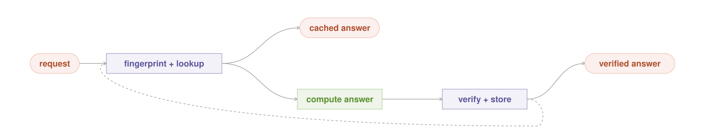

#### Intent

Return a previously verified result when the request meaning, source state,
model and recipe contracts, and trust policy are still equivalent; otherwise
compute once, verify, and store the new result locally.

#### Motivation

Some expensive local requests recur: summarize this repository, extract the
same policy, explain an unchanged function, or answer a question over a stable
document collection. Local tokens carry no API price, but recomputation still
costs time, energy, heat, and interactive capacity. A verified result can
become an owned durable asset—if the system can prove that the result is still
about the same world.

#### Context

The workload contains repeated or semantically equivalent requests, relevant
source state can be fingerprinted, and a verifier can state what the cached
answer passed. The cache can remain inside the same privacy and tenant
boundary as the request.

#### Problem

How can a local system reuse costly verified work without serving stale,
cross-tenant, wrongly keyed, or formerly trusted answers as if they were fresh?

#### Forces

- Broad semantic matching raises hit rate and collision risk.
- Exact keys are safe but miss harmless paraphrases.
- Source data, model builds, prompts, tools, and policies all change validity.
- Verification makes writes safer but one bad verifier can amplify an error to
  every future hit.
- Private cached answers are sensitive long-lived memory.
- Concurrent misses can duplicate the expensive computation.
- Offline hits are valuable, but fresh external facts may be unavailable.

#### Applicability

Use Answer Cache for repeatable, retrieval-shaped work whose source and
execution dependencies can be versioned. Avoid it for high-entropy creative
requests, rapidly changing external facts without freshness metadata, or
answers whose validity cannot be re-established from a key and verification
stamp. A cache should never turn an unverifiable judgment into durable truth.

#### Solution

Resolve the complete concrete execution closure, then construct a versioned
key from its digest plus normalized request meaning, tenant, and purpose. The
closure includes source state; exact model and runtime builds; prompt,
template, recipe, and generation settings; tool and retriever configuration;
index, embedding, memory, and data revisions; verifier; and policy. If any
meaning-affecting dependency cannot be fingerprinted, compute without reading
or writing the cache. On a valid hit, return the answer with explicit age and
provenance. On a miss, acquire a per-key single-flight lease, compute, verify,
and atomically store the stamped result. Invalidate on closure change,
verifier doubt, expiry, or explicit bypass.

#### Local-First Differential

Caching and materialized views are portable. Local ownership makes the result
private, offline-available, and tied to artifacts the operator can actually
retain. The cache converts owned inference time into a durable asset without
sending prompts or embeddings to a vendor. Exact local build and tool
identities also allow precise invalidation when the execution contract
changes.

The fact that local generation has no marginal API bill does not weaken the
pattern. Latency, energy, model-load disruption, and offline continuity remain
valuable. The cache itself consumes owned storage and becomes part of the
privacy boundary.

#### Structure

The request is fingerprinted and looked up. A valid hit goes directly to the
answer. A miss runs the named recipe, passes verification, and stores the
result before returning. The feedback edge means “verified write-back,” never
“cache every answer.”

#### Participants

- **Closure resolver and key builder** — captures semantic intent and every
  concrete dependency that can change the answer or its trust status.
- **Source fingerprinter** — represents the data state the answer describes.
- **Local cache store** — isolates tenant and purpose and stores stamped
  entries.
- **Validity policy** — checks age, source, contract, and verifier status.
- **Compute recipe** — produces a miss result.
- **Verifier** — gates every write-back.
- **Single-flight coordinator** — joins concurrent misses.
- **Invalidator and bypass** — remove doubt and force fresh computation.

#### Collaborations / Mechanics

1. Normalize the request without discarding distinctions relevant to the
   answer.
2. Resolve and fingerprint the complete concrete execution closure; if that is
   impossible, take an uncached compute path.
3. Build a tenant-and-purpose-scoped key from the closure digest and read the
   entry.
4. Validate the entry against freshness and doubt rules.
5. Return a marked hit, or join/acquire one in-flight miss.
6. Compute and independently verify the miss.
7. Store atomically only above the declared trust floor, then return with
   provenance.

#### Contract and Invariants

- Every entry is tenant- and purpose-scoped.
- The key includes a digest of the full resolved execution closure; an
  unfingerprintable dependency forces a miss and prohibits write-back.
- Only verified results may be written.
- A hit reports age, fingerprint, recipe, model, and verifier identity.
- Bypass and invalidation are always available.
- On doubt means miss, not best-effort hit.
- Single-flight prevents duplicate work; idempotent write-back prevents
  duplicate state.

#### Consequences

Answer Cache can turn the slowest recurring requests into instant local hits,
reduce energy and model swaps, and preserve useful answers offline. It also
amplifies trust: a good verification is reused many times, while a bad one is
reused many times too. Key design, invalidation, encrypted storage, retention,
and user-visible freshness become core product responsibilities.

#### Failure Mode and Safe Exit

The characteristic failure is **confident staleness**. The source changes
without changing the fingerprint, or a semantic key collides, and the system
serves an old answer with the authority of a verified one. Another failure is
globalized verifier error: one rubber-stamped write poisons all future hits.
Any source mismatch, verifier-version change, policy change, age violation,
collision signal, or user request for freshness turns the lookup into a miss.
If fresh computation is impossible offline, return the marked stale entry only
when policy permits and the user can see the limitation; otherwise defer.

#### Implementation / Refinements

Prefer source-native fingerprints such as commit SHA, content digest, database
snapshot, or signed document version over modification time alone. Make the
closure resolver enumerate prompt and generation settings, tools, retrieval
and embedding state, memory and data snapshots, runtime, model, recipe,
verifier, and policy—not merely the fields convenient to key today. Start with
exact keys, then add semantic equivalence only behind conservative thresholds
and collision evaluation. Stamp complete dependency metadata. Encrypt
sensitive entries, set retention by purpose, and never share a cache across
tenants by default. Re-verify important entries after verifier upgrades, and
separate “freshness expired” from “trust revoked.”

#### Observe and Measure

Record hit rate, verified hit accuracy, collision and stale-hit incidents,
age at use, bypass rate, invalidations by cause, single-flight joins, compute
saved, latency and energy saved, store size, retention deletes, and privacy
boundary violations. Test invalidation deliberately by changing each key
dependency and proving the old entry cannot hit.

#### Sample Code

~~~python
def answer_cache(request, sources, contracts, store):
    closure = contracts.resolved_execution_closure(request, sources)
    if not closure.fully_fingerprintable:
        fresh = run_recipe(request, closure)
        return verify_or_refuse(request, fresh, closure.verifier)

    key = semantic_key(
        tenant=request.tenant,
        purpose=request.purpose,
        meaning=normalize(request),
        execution=closure.digest,
    )
    entry = store.get(key)
    if entry and entry.valid_for(closure) and not request.force_fresh:
        return marked_hit(entry)
    with single_flight(key) as flight:
        if not flight.owner:
            return flight.await_result()
        result = run_recipe(request, closure)
        verdict = closure.verifier.verify(request, result)
        if not verdict.passed:
            return defer_or_refuse(request, verdict)
        store.put_once(key, stamp(result, verdict, closure))
        return marked_miss(result, verdict)
~~~

#### Known Uses and Evidence Status

Memoization, content-addressed storage, materialized views, CDNs, and cache
invalidation are established portable mechanisms. Projects such as
[GPTCache](https://github.com/zilliztech/gptcache) demonstrate semantic caching
for LLM applications.

The catalog's complete trust contract—verified-only write-back, exact
model/recipe/verifier keys, private local retention, doubt invalidation, and
offline disclosure—is **emerging**. The cache mechanism is mature; the claim
that a cached AI answer remains trustworthy requires independent stale-hit,
collision, and verifier-error evidence.

#### Worked Local Example

A local assistant summarizes a repository at commit 8f2c. The key contains the
normalized request, repository commit, selected recipe version, exact model
build, verifier suite, and tenant. A paraphrased request for “the architecture
of this repo” hits the same entry and returns instantly with the commit and age
visible. After a new commit, the source fingerprint changes and the request
misses. Two simultaneous callers join one recomputation. The new summary is
stored only after link and file-reference checks pass. On an airplane, the old
commit's summary remains available; a request for the latest upstream issues
does not masquerade as fresh because external state cannot be fingerprinted.

#### Related Patterns

**Pipeline** can cache a verified intermediate stage as well as the final
answer. **Pinned Model** and **Recipe Router** provide versioned key
dependencies. **Check and Retry** supplies verified write-back. **Private
Memory** governs sensitive retention and retrieval scope. **Offline Island**
uses valid local hits during disconnection. **Night Shift** may refresh or
re-verify entries in owned idle time.

---

## Learn and trust

An owned roster can change without becoming a roster that trusts strangers.
These patterns separate three different questions: how a candidate behaves on
real-shaped traffic, what roles it can prove in a controlled examination, and
whether a staged improvement deserves to replace live state. In every case,
observation is cheaper than authority and promotion is a logged decision—not a
side effect of finishing some work.

### Shadow Model

*Let a candidate observe real work before it receives authority over real work.*

**Classification.** Learn and trust · progressive model trust · local
abundance refinement · **Maturity:** established canary mechanism, candidate
local trust contract

**Also Known As / Lineage.** Shadow traffic; dark launch; observation-only
canary; progressive trust; Canary Trust-Equity; Trial Sequential Analysis

#### Intent

Run a candidate beside an incumbent on representative work, keep
the candidate unable to affect the caller, and grant authority only after
independent evidence clears a predeclared rule.

#### Motivation

A new model wins a public benchmark and looks excellent on a
small test pack. Once deployed, it mishandles the owner's shorthand, long-tail
documents, tool schemas, or local language. Replacing the incumbent made the
first real request part of the experiment. Merely comparing the two models'
text would not have fixed this: agreement can mean that both models share the
same blind spot. The candidate needs realistic exposure, an evidence authority
other than itself, and no power over the live answer while that evidence is
being earned.

#### Context

A trusted incumbent serves a named request class. A newly admitted
Pinned Model contract can execute the same read-only input. The operator can
obtain at least some delayed outcome, deterministic check, accepted correction,
or independently graded label, and can retain paired observations without
mixing tenants or request classes.

#### Problem

How can a local roster measure a candidate on realistic work
without granting it unearned authority or mistaking similarity to the
incumbent for correctness?

#### Forces

- Synthetic tests are safe but miss production shape.
- Live traffic is representative but may contain sensitive data and
  irreversible tool calls.
- Running two models consumes memory, latency, energy, and perhaps a scarce
  accelerator seat even when tokens have no marginal price.
- Independent truth is strong but often delayed or sparse.
- Easy cases fill a ledger quickly while revealing little.
- Repeatedly peeking at a lucky streak makes premature promotion look
  statistically respectable.

#### Applicability

Use Shadow Model when a candidate can process a lawful,
read-only copy or replay of representative requests and when a meaningful
comparison signal will eventually exist. It is especially useful for model,
quantization, runtime, template, or adapter changes that may behave differently
on the owner's distribution. Do not use it when duplication itself violates a
privacy boundary, when the candidate can trigger tools or side effects, when
the only label is raw agreement with the incumbent, or when the box cannot
provide shadow capacity without breaking foreground service. In those cases,
begin with Model Audition or wait for an explicit evaluation window.

#### Solution

Give the candidate an observation-only lane. Bind both lanes to
exact contracts and one immutable request snapshot, but let only the incumbent
reach the caller. Quarantine the candidate output and compare the paired
results only when the declared label authority is available. Accumulate
deduplicated evidence per request class, including a stratified hard-case
slice. Freeze the endpoint, minimum effect, observation floor, and promotion or
futility rule before inspecting the results. Promotion atomically changes a
role binding; failure retains the incumbent and may quarantine the candidate.

#### Local-First Differential

Shadow inference can be sampled broadly or replayed
during idle windows without buying another API call or consuming a provider
allowance. The operator can keep private examples, candidate outputs, and the
trust ledger inside the owned boundary and can identify the exact serving
contracts. This is abundance, not magic: a shadow still occupies memory,
joules, and wall-clock time, and a single-seat box must choose between an
in-band sample and a deferred replay rather than pretending both lanes are
free.

#### Structure

Live traffic reaches the incumbent and an observation-only candidate. The
incumbent alone supplies the live answer. Evidence from both lanes reaches one
declared rule, which may promote or reject the candidate only after the rule's
requirements are satisfied.

#### Participants

- **Incumbent** — owns current authority for one role.
- **Candidate** — is an exact, admitted contract with no live vote.
- **Traffic sampler or replay store** — supplies immutable paired cases.
- **Side-effect firewall** — prevents candidate tools, writes, and messages.
- **Label authority** — provides tool-grounded, human-accepted, or otherwise
  independent outcomes.
- **Evidence ledger** — stores paired observations exactly once.
- **Promotion gate** — applies the frozen rule.
- **Role registry** — performs an atomic promotion or retains the incumbent.

#### Collaborations / Mechanics

1. Select an eligible request class and create a request snapshot with a stable
   pair id.
2. Run the incumbent normally.
3. Either run the candidate on a spare seat at the same time or replay the
   snapshot later under the same relevant policy and data revision.
4. Suppress all candidate side effects and discard candidate prose from the
   caller path.
5. When the label authority resolves the case, append one paired outcome.
6. At registered evidence looks, evaluate class-specific quality, safety,
   latency, and hard-case floors.
7. If the promotion boundary clears, create a new logged role-binding
   revision; otherwise continue, retain, or quarantine according to the frozen
   design.

#### Contract and Invariants

- A shadow output never becomes a live answer, tool call, memory write,
  notification, or cache entry.
- Every pair names the request snapshot, policy revision, label source, and
  both Pinned Model contract ids.
- A pair is counted once.
- Trust is earned per role and request class, never inherited globally.
- Incumbent agreement is labeled as consistency rather than truth.
- Promotion is an atomic, reversible registry event and cannot be performed by
  the candidate or comparison worker.

#### Consequences

Candidates meet the owner's distribution before they gain
authority, regressions can be attributed to exact builds, and promotion gains
an auditable evidence trail. The price is duplicate inference, sensitive
paired data to retain, delayed promotion, and a comparison system that can
become more complex than the model change. Sparse labels may leave a good
candidate in shadow for a long time; that is preferable to inventing evidence.

#### Failure Mode and Safe Exit

The characteristic failure is circular trust:
the candidate earns authority by agreeing with an incumbent or judge that
shares its error. Other failures include side effects escaping the shadow
lane, easy-traffic bias, double-counted pairs, and promotion after repeated
unregistered peeks. Disable the candidate lane, preserve the evidence for
audit, retain the incumbent, and restart only with an independent authority and
a new registered design. “No promotion” is the safe successful outcome when
the evidence is weak.

#### Implementation / Refinements

Choose one resource mode explicitly. A
multi-seat node may shadow a sampled request in parallel; a single-seat node
should replay adjudicated snapshots through Idle Worker. Redact or exclude
requests whose policy does not allow duplication. Stub tool interfaces with
read-only fixtures and reject any undeclared effect. Key ledgers by tenant,
request class, candidate contract, incumbent contract, and design id. Balance
ordinary traffic with a frozen hard-case stratum. Use registered sequential
looks or a fixed horizon, not a confidence threshold checked after every lucky
result. Decay or re-open earned trust when workload or artifacts change.

#### Observe and Measure

Record eligible and sampled traffic, shadow seat-ms,
added foreground latency, label coverage and authority, paired hard-case count,
quality and safety deltas, disagreement classes, promotion-boundary state,
quarantines, and every role-binding revision. Report incumbent-only agreement
separately from tool- or human-grounded correctness.

#### Sample Code

~~~python
def shadow(request, incumbent, candidate, design, ledger):
    pair = snapshot_once(request, design.policy_revision)
    live = incumbent.answer(pair)                  # the only caller-visible lane
    if policy.may_duplicate(pair) and capacity.may_shadow(candidate):
        observed = candidate.run_read_only(pair, tools=NO_SIDE_EFFECTS)
        ledger.stage(pair.id, incumbent.id, candidate.id, observed)
    return live

def grade_shadow(pair_id, independent_label, design, ledger):
    ledger.append_pair_once(pair_id, independent_label)
    decision = design.decision_at_registered_look(ledger.pairs(design.id))
    if decision == "promote":
        registry.promote_atomically(design.role, design.candidate_contract)
    elif decision == "reject":
        registry.quarantine(design.candidate_contract)
~~~

#### Known Uses and Evidence Status

Dark launches, mirrored traffic, canary
deployments, and progressive delivery establish the operational lineage. The
model-trust formulation is developed as
[Canary Trust-Equity](portable_patterns.md#18-canary-trust-equity--earn-a-vote-before-you-ever-cast-one),
with registered promotion discipline supplied by
[Trial Sequential Analysis](portable_patterns.md#22-trial-sequential-analysis--policy-changes-only-at-registered-evidence-looks).
Grid has held-out candidate-versus-incumbent evaluation machinery, but no
production shadow lane, side-effect firewall, paired live-outcome ledger, or
registered promotion gate. Shadow Model is therefore a **Candidate**, not a
claim about a shipped Grid feature.

#### Worked Local Example

A private invoice assistant serves extraction with
build A. Build B uses a smaller quantization and may be faster. For two weeks,
the box replays a sampled, policy-approved set of adjudicated invoices through
B during idle periods. B never writes to the accounting system. Its evidence
ledger contains exact paired outcomes, including handwritten and multilingual
hard cases. B clears the latency gain but misses the registered tax-id safety
floor, so the registry retains A and quarantines B for that role. The experiment
worked because production did not change.

#### Related Patterns

**Model Audition** supplies controlled evidence before shadowing. **Pinned
Model** makes both lanes reproducible. **Idle Worker** pays for deferred replay.
**Privacy Boundary** decides which requests may be duplicated. **Risk Ladder**
sets stronger promotion evidence for consequential roles. **Night Shift** may
produce a candidate, but **Shadow Model**—not the builder—earns live trust.
**Routing Memory** begins learning only after authority is granted.

---

### Model Audition

*Give every new build a private, role-specific examination before real work.*

**Classification.** Learn and trust · role-specific qualification · local
abundance and private-workload refinement · **Maturity:** established test
mechanism, candidate local admission contract

**Also Known As / Lineage.** Qualification pack; model tryout; role screening;
offline capability exam; Type-Revelation Screening

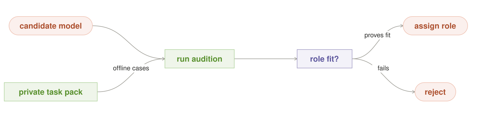

#### Intent

Measure an exact candidate on private, representative tasks and
failure probes, then admit it only to the roles it has actually demonstrated.

#### Motivation

A downloaded model arrives with a leaderboard position and a
friendly name, not with evidence about this quantization, runtime, template,
tool schema, language mix, or owner's work. A global score can hide a dangerous
shape: excellent summarization, weak citation discipline; strong extraction,
unreliable tool arguments. Trusting the model everywhere wastes its real
specialties and exposes its blind spots. The operator needs a controlled exam
that produces a narrow role assignment rather than a vague “good model” label.

#### Context

The operator can identify an immutable candidate build, has a
taxonomy of roles, and can maintain versioned private cases with known or
independently judged outcomes. The candidate can run on the hardware and
runtime that would serve it, away from live side effects.

#### Problem

How can a local roster discover what a candidate is fit to do
without exposing private evaluation cases, overfitting to a public benchmark,
or turning one aggregate score into universal trust?

#### Forces

- Public benchmarks are comparable but gameable and unlike local work.
- Private packs are representative but expensive to curate and can grow stale.
- Deterministic checks are strong but cover only checkable behavior.
- Model-graded cases scale but can reproduce the candidate's priors.
- A large pack improves confidence but consumes idle time, energy, and storage.
- Reusing the same pack makes trends comparable while increasing leakage and
  overfitting risk.
- Narrow role admission is safer but complicates routing.

#### Applicability

Use Model Audition for every new model, quantization,
adapter, template, runtime, tool schema, or materially changed generation
profile before it receives a trusted role. It is valuable when private work
differs from public leaderboards or when several owned models may specialize.
Do not use it as the sole basis for high-consequence live promotion when the
pack cannot reproduce production conditions; follow with Shadow Model. Avoid
pretending an uncalibrated synthetic probe predicts real success.

#### Solution

Create a versioned task pack per role with ordinary cases,
boundary cases, known failure probes, and resource measurements. Separate pack
development from a frozen held-out admission slice. Run the exact Pinned Model
contract under its intended runtime and tools, with side effects replaced by
fixtures. Score every required dimension independently. Apply hard safety and
compatibility floors before any aggregate ranking. Admit the candidate only to
roles whose registered floors it clears; reject it or return it for repair
elsewhere. Keep the evidence bound to the contract and pack revision.

#### Local-First Differential

Proprietary examples, failure cases, and candidate
outputs can remain on the owned box. The operator can run many probes during
idle time without a per-case invoice or rate limit and can measure the exact
local quantization and hardware behavior rather than a vendor alias. The real
cost is curation, compute, energy, and the risk of teaching candidates the
exam—not tokens.

#### Structure

The candidate and a private task pack meet in an offline audition. One
role-fit decision assigns a proved role or rejects the candidate. The branch is
role-specific: failure for one role does not prove uselessness for every role.

#### Participants

- **Candidate contract** — names exact weights and serving behavior.
- **Role catalog** — defines responsibilities and minimum evidence.
- **Task-pack curator** — creates representative cases without training-pack
  leakage.
- **Fixture boundary** — replaces live tools and writes.
- **Audition runner** — executes reproducibly.
- **Scorers** — include deterministic checks, calibrated graders, latency,
  memory, and safety probes.
- **Admission gate** — binds passing evidence to allowed roles.
- **Evidence registry** — keeps the pack and policy revisions beside the
  result.

#### Collaborations / Mechanics

1. Resolve the candidate contract and hardware compatibility.
2. For each requested role, load the frozen pack revision and run ordinary and
   hard cases under declared decoding settings.
3. Capture outputs, tool proposals, latency, memory, and failures without
   applying effects.
4. Score with the same authority registered for every candidate.
5. Check non-negotiable safety and schema floors first, then the role's quality
   and resource thresholds.
6. Publish a signed or content-addressed evidence card.
7. Add only the roles that passed. Changing any behavioral part of the
   contract invalidates inheritance and requires another audition.

#### Contract and Invariants

- Every result names one candidate contract, pack revision, scorer revision,
  hardware/runtime profile, and admission policy.
- Test cases cannot reach live side effects.
- Required floors cannot be averaged away.
- A pass is scoped to a role and workload class.
- Pack development cases do not count as the held-out admission result.
- A changed contract receives no trust from an older build merely because its
  display name is the same.

#### Consequences

The roster gains measured specialization, weak builds fail
before serving users, and route decisions can cite concrete evidence. The
system inherits test-pack maintenance, evaluation storage, scorer calibration,
and slower admission. A model may learn the pack's surface form, and a narrow
role map increases configuration work. Honest rejection can leave no candidate
for a desired role.

#### Failure Mode and Safe Exit

The characteristic failure is exam capture: a
static, leaked, or gameable pack stops correlating with real work while its
scores remain impressive. Other failures include model-on-model rubber
stamping, averaging away a safety regression, and testing a different runtime
from the one deployed. Retire the compromised pack, freeze admission, keep the
last trusted build, and create a new pack revision with an untouched held-out
slice. A candidate with ambiguous evidence remains unassigned rather than
receiving a generic role.

#### Implementation / Refinements

Keep a small immutable core for trend
comparison and rotate a larger hidden slice. Include metamorphic tests,
adversarial reframes, invalid tool schemas, abstention cases, and examples from
verified production failures. Measure the pack's predictive power against later
Shadow Model outcomes. Separate capability, reliability, safety, latency, and
resource columns. Run probes only on uncontended capacity and commit a
preempted case atomically or not at all. Encrypt sensitive packs and limit
their readers. Do not tune a candidate on the held-out slice that will admit
it.

#### Observe and Measure

Record pass rate by role and case stratum, hard-floor
violations, abstention quality, tool-schema accuracy, scorer disagreement,
latency and memory distributions, interrupted cases, pack age, pack-to-live
correlation, admissions, rejections, and later shadow regressions.

#### Sample Code

~~~python
def audition(candidate, role, pack_revision, policy):
    pack = packs.frozen(role, pack_revision)
    runs = runner.read_only(
        contract_id=candidate.id,
        cases=pack.held_out,
        tools=pack.fixtures,
        generation=policy.generation_profile,
    )
    card = scorers.score(runs, pack.answers, candidate.hardware_profile)
    if not policy.hard_floors_pass(role, card):
        return registry.reject(candidate.id, role, card)
    return registry.assign_role(candidate.id, role, evidence=card.digest)
~~~

#### Known Uses and Evidence Status

Qualification suites, hardware acceptance
tests, model cards, conformance tests, and private benchmark harnesses provide
the established lineage. The proactive role-discovery ancestor is
[Type-Revelation Screening](portable_patterns.md#24-type-revelation-screening--probe-a-models-type-in-idle-before-trust).
Grid's [`train/evaluate.py`](../../train/evaluate.py) already compares a staged
candidate and incumbent on held-out prompts with per-grader regression checks.
It is useful adjacent machinery, not yet a general multi-role private pack,
fixture boundary, predictive-calibration loop, or role admission registry.
Model Audition remains a **Candidate** with a narrower implemented foundation.

#### Worked Local Example

A newly converted 7B model is auditioned for three
roles on a laptop: receipt extraction, short drafting, and tool selection. It
clears extraction accuracy and memory limits, misses the drafting factuality
floor, and emits invalid arguments on two tool probes. The registry admits the
exact Q4 contract only as `receipt-extractor`. It receives no general assistant
or tool-using role. A later template change produces a new contract and a new
audition rather than inheriting the old pass.

#### Related Patterns

**Pinned Model** defines the examined unit. **Idle Worker** runs the pack
without stealing foreground service. **Power Budget** limits an audition's
physical cost. **Shadow Model** tests the admitted role against realistic
traffic. **Risk Ladder** determines how strong admission evidence must be.
**Diversity Gate** helps curate probes that exercise genuinely different
capabilities. **Night Shift** may create or schedule candidates but cannot
assign its own roles.

---

### Night Shift

*Stage improvements while the box is quiet; promote only independently proven artifacts.*

**Classification.** Learn and trust · staged artifact promotion · local
substrate pattern · **Maturity:** emerging with a narrower Grid implementation

**Also Known As / Lineage.** Verified Night Shift; preemptible batch work;
staged local improvement; prove-before-promotion maintenance

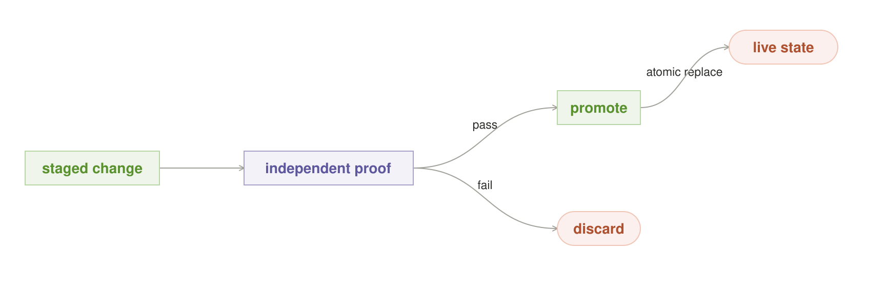

#### Intent

Convert owned idle capacity into typed, immutable candidate
artifacts while keeping live state untouched until an independent validator
authorizes an atomic promotion.

#### Motivation

A local box has quiet hours in which it could train an adapter,
convert a quantization, rebuild an index, refresh a cache, or evaluate a model.
But “background” work can evict the live model, heat the device, continue after
a user returns, train on its own errors, or replace production simply because a
job exited successfully. The most dangerous participant is a builder allowed
to declare its own output better. Improvement needs a staging boundary, a
foreground-yield contract, evidence independent of construction, and a
promoter distinct from both.

#### Context

The operator owns an intermittently idle machine, has valuable
non-urgent work that can be divided or safely aborted, can keep candidate state
separate from live state, and has a type-specific validator and rollback target
for every artifact allowed to change production.

#### Problem

How can unused local capacity improve future service without
stealing the current service or allowing incomplete, self-certified work to
become live?

#### Forces

- Larger jobs amortize setup but yield slowly to foreground work.
- Small quanta preempt cleanly but add checkpoints and repeated loads.
- Idle inference has no API charge, yet electricity, heat, storage wear, and
  user latency are real.
- The builder understands the artifact but has a conflict of interest in
  grading it.
- Some artifacts have deterministic validation; others need frozen held-out
  evidence.
- Atomic promotion simplifies rollback but requires immutable staging and
  durable receipts.

#### Applicability

Use Night Shift on always-on or regularly idle owned
hardware for resumable evaluation, training, conversion, indexing, and cache
maintenance whose result can remain immutable in staging. Avoid it for jobs
that cannot meet a declared drain time on an interactive seat, for irreversible
side effects, for artifacts without an independent validation authority, or
for devices whose power and thermal policy forbids discretionary work.

#### Solution

Require every background job to declare its artifact type,
resource envelope, maximum drain time, checkpoint semantics, and staging
target. Admit bounded quanta only while foreground, memory, power, and thermal
policy allow. Write completed results as immutable staged artifacts. Let
trusted type policy choose a read-only validator and a separate authorized
promoter. The validator issues a receipt bound to the staged digest; only that
receipt permits an atomic live-pointer change. Failure, cancellation, or weak
evidence leaves the current live state unchanged.

#### Local-First Differential

The operator owns both the idle interval and the
artifact that can improve. A cloud API customer owns neither unused provider
accelerators nor the provider's weights, runtime, or index lifecycle. Night
Shift is therefore genuinely local-substrate: removing the owned machine
removes the schedulable resource and the promotable object. Its economics are
bounded by joules, thermals, wear, and responsiveness rather than a token bill.

#### Structure

A staged change reaches an independent proof gate. A passing artifact is
promoted through an atomic replacement; a failing artifact is discarded. The
compact figure shows the trust boundary. Idle admission, checkpoints, and
foreground preemption surround this structure and do not weaken it.

#### Participants

- **Typed backlog** — contains bounded improvement jobs.
- **Foreground monitor** — defines when discretionary work may run.
- **Resource governors** — enforce memory, seat, power, thermal, and drain
  limits.
- **Builder** — creates an artifact but has no promotion authority.
- **Staging store** — gives the result an immutable digest.
- **Validator** — checks the artifact read-only under type-specific policy.
- **Promotion authority** — accepts only a valid receipt for that digest.
- **Live registry** — retains the current and last trusted pointers.

#### Collaborations / Mechanics

1. Select one eligible job and acquire a bounded idle lease.
2. Run a quantum until it completes, checkpoints, or receives a foreground or
   hard-limit signal.
3. Return incomplete work to the backlog or discard it according to its
   declared semantics.
4. Seal a complete result in staging.
5. Resolve the validator from trusted artifact-type policy, not from job input.
6. Validate against deterministic checks or a frozen held-out set.
7. If the receipt passes, atomically bind the live role to that same digest and
   record a rollback pointer.
8. Otherwise leave production exactly as it was.

#### Contract and Invariants

- Every job declares type, resource envelope, maximum drain time, checkpoint
  behavior, and staging target before admission.
- Foreground arrival closes new background admission and contested resources
  are released within the drain bound.
- Partial state cannot become live.
- The builder cannot choose or impersonate its validator or promoter.
- A receipt identifies the exact staged digest, policy revision, evidence set,
  and result.
- Promotion is atomic and preserves an admissible rollback target.

#### Consequences

Purchased hardware can improve quality and latency between
requests, private examples need not leave the box, and a failed night becomes a
recorded no-op rather than a production incident. The system gains scheduler,
checkpoint, staging, validation, promotion, and storage complexity. Saturated
or battery-powered devices may make no progress. Independent validation can
cost as much as construction, and preserving rollback artifacts consumes disk.

#### Failure Mode and Safe Exit

The characteristic failure is promotion by
completion: a builder finishes and its output becomes live without independent
proof. Related failures are missed preemption, partial checkpoints treated as
artifacts, self-labeled training data, a receipt for a different digest, and
rollback to an artifact that no longer passes current policy. Cancel or abort
the job, quarantine the staging digest, retain the current live pointer, and
report no promotion. If drain time cannot be met, move the job to a declared
maintenance window rather than calling it idle work.

#### Implementation / Refinements

Use an OS scheduler to invoke one cycle
rather than a permanent opaque daemon. Quantize long work at safe boundaries
and test cancellation under actual load. Treat weights, adapters, indexes,
evaluation packs, and caches as distinct artifact types with distinct
validators. Keep captured examples only when they have a real label—accepted
correction, deterministic outcome, or approved teacher. Sign or content-address
receipts, transact the pointer swap, and verify rollback periodically. Make
unknown sensor state take an explicit conservative policy, never infinite
headroom.

#### Observe and Measure

Record eligible idle time, admitted and completed
quanta, checkpoint and discard counts, maximum preemption drain, foreground
latency delta, energy and thermal stops, bytes written, artifact type, validator
pass rate, promotions, rollback tests, and the reason every night made no
change.

#### Sample Code

~~~python
def night_shift(job, host, foreground, trust_policy):
    lease = host.try_idle_lease(job.resources, max_drain=job.max_drain)
    if not lease:
        return retain("no safe idle window")
    result = run_quantum(job, lease, cancel_when=foreground.arrives)
    if not result.complete:
        return job.checkpoint_or_abort(result)

    staged = staging.seal(job.artifact_type, result.output)
    validator, promoter = trust_policy.for_type(job.artifact_type)
    receipt = validator.check_read_only(staged)
    if not receipt.accepted:
        return retain("independent validation failed")
    return promoter.promote_atomically(staged.digest, receipt)
~~~

#### Known Uses and Evidence Status

Preemptible batch queues, blue-green
deployment, immutable artifacts, held-out evaluation, and transactional
promotion supply the established mechanisms. The complete local formulation is
documented as
[Verified Night Shift](six_pattern_reference.md#l2-verified-night-shift--improve-the-box-while-it-sleeps).
Grid has a narrower real implementation: [`train/nightly.py`](../../train/nightly.py)
checks AC power and user idle once, trains an adapter, invokes the held-out
comparison in [`train/evaluate.py`](../../train/evaluate.py), and deploys only
on pass while logging the result. It does not yet provide typed jobs, live
foreground preemption, continuous thermal stops, measured drain bounds, or a
separate receipt-bound promotion authority. Night Shift is therefore
**Emerging**, with a useful implemented slice and a larger unshipped contract.

#### Worked Local Example

At 11 p.m. a workstation begins evaluating a newly
converted coding model against the incumbent on a frozen private pack. Each
case is a checkpoint boundary, and a foreground arrival must release the GPU
within two seconds. The candidate completes after several quiet windows. Its
quality floor passes but its tool-schema regression does not, so the validator
issues a rejection and the promoter receives no usable receipt. In the morning,
the incumbent is still live and the failed candidate remains inspectable in
staging.

#### Related Patterns

**Idle Worker** supplies bounded slack scheduling. **Power Budget** and **Fit
the Box** co-admit every quantum. **Pinned Model** defines model artifacts and
rollback targets. **Model Audition** can be the validator for a new role;
**Shadow Model** may be required before live promotion. **Privacy Boundary**
constrains captured examples and external teachers. **Circuit Breaker**
contains a bad builder or validator path. **Answer Cache** and **Keep It Warm**
may be maintained by **Night Shift** but cannot bypass their own validity
contracts.

---

## Own the box

These patterns bind orchestration to the machine that actually runs it. They
make exact artifacts, memory residency, foreground priority, power, tail
latency, and repeated failure part of the design rather than invisible
deployment details.

### Pinned Model

*Route to an exact model build, not a floating name.*

**Classification.** Own the box · local-substrate foundation · immutable
identity · **Maturity:** candidate local formulation built on established
content-addressing practice

**Also Known As / Lineage.** Model Artifact Contract; immutable serving bundle;
content-addressed model deployment; deployment lockfile

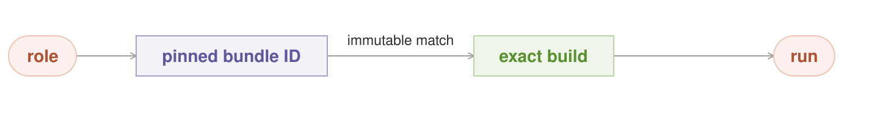

#### Intent

Make one evaluated serving build—not a friendly model name—the unit of routing,
trust, caching, rollback, and audit.

#### Motivation

An operator evaluates model-x and approves it. Later, the quantized weights are
replaced while the alias stays unchanged. Or the weights remain fixed but the
tokenizer, chat template, adapter, runtime kernel, generation profile, or tool
schema changes. The router still reports model-x, yet the behavior that earned
the trust label no longer exists. Local stacks make this failure especially
easy because the owner can independently convert, combine, and update every
piece of the serving path.

#### Context

Several local builds can fill the same role; builds can be upgraded or rolled
back; and durable state such as evaluations, permissions, routing outcomes,
caches, or audit records depends on knowing exactly which behavior produced a
result.

#### Problem

How can an owned runtime preserve reproducibility and earned trust when a
model's observable behavior is determined by more than its weights and display
name?

#### Forces

- Friendly role names make operation simple, while exact identities make
  results explainable.
- Quantization, adapters, templates, kernels, and generation defaults save
  resources or add capability, but each can change behavior.
- Retaining old builds enables rollback but consumes storage and qualification
  time.
- A digest proves that bits are the same; it does not prove quality, safety,
  compatibility, provenance, or permission to use them.
- A fallback improves availability only if it still meets the current
  request's admission policy.

#### Applicability

Use Pinned Model for every build that can receive trusted traffic, particularly
when weights, quantization, adapters, templates, runtimes, or tool contracts
change independently. Use a lighter experimental identifier for disposable
runs that cannot create durable trust or side effects. Do not treat pinning as
a quality pattern: a perfectly identified bad build remains bad.

#### Solution

Represent a routable build as an immutable contract containing at least the
weights digest, tokenizer, prompt or chat template, quantization, adapters,
runtime and kernels, generation profile, tool schema, hardware compatibility,
provenance, and license. Evaluate and admit that whole contract. Let a mutable
role alias point atomically to one admitted contract, while retaining a known
good contract for explicit rollback.

#### Local-First Differential

The portable lineage is content-addressed deployment: lockfiles, container
digests, and reproducible builds all replace mutable names with exact
identities. The local-first differential is the scope of the identity. An owned
runtime can fingerprint the full behavioral tuple—weights through kernels and
templates—that a hosted model endpoint normally hides behind a provider name.
It can also retain the bits for replay and rollback without asking the provider
to preserve an old revision.

This is an ownership pattern, not a free-compute pattern. Its local advantages
come from visibility and control over artifacts; its costs are storage,
qualification, provenance management, and compatibility work.

#### Structure

A role first resolves through the registry to one immutable, admitted contract.
Only that contract reaches the runtime. Changing the role's target is a
transactional promotion, not an implicit request to download whatever is
latest.

#### Participants

- **Role** — names the capability requested by the orchestration recipe.
- **Artifact registry** — stores immutable contracts and their evidence.
- **Admission gate** — checks provenance, policy, compatibility, and measured
  task floors.
- **Alias manager** — atomically binds a friendly role to one admitted
  contract.
- **Runtime** — loads the contract and reports its identity on every run.
- **Evidence store** — keys evaluations, trust, caches, and outcomes by the
  immutable identity.

#### Collaborations / Mechanics

1. A router asks the registry to resolve a role.
2. The registry returns the exact contract currently bound to the alias and
   the admission evidence for the present policy revision.
3. The admission gate rechecks the request, hardware, and contract rather than
   trusting the alias alone.
4. The runtime loads and reports that contract id with the result.
5. Promotion atomically retargets the alias after independent admission;
   rollback retargets it to a retained, still-admissible contract.
6. Evaluation, cache, and routing records never transfer to a replacement
   merely because its display name is unchanged.

#### Contract and Invariants

- Every execution reports exactly one immutable model contract id.
- No trust label, cache entry, evaluation, or rollback target is keyed only by
  a floating alias.
- Every behaviorally meaningful serving component is inside the contract or
  referenced by an immutable digest.
- Alias changes are atomic and auditable.
- A retained fallback must pass current admission; historical trust is not a
  permanent exemption.

#### Consequences

Replays become explainable, regressions can be attributed, and a change in
quantization or template cannot silently inherit old evidence. Upgrades become
reversible and cache invalidation becomes principled. The liabilities are
duplicate storage, a durable registry, slower promotions, and the operational
friction of qualifying every behaviorally meaningful change. Exact identity
also exposes uncomfortable facts: two supposedly identical nodes may not be
running the same serving tuple.

#### Failure Mode and Safe Exit

The characteristic failure is **silent retargeting**: a role points to new
bits while old evidence and caches remain attached. A second failure is partial
identity, such as pinning weights while allowing the template or adapter to
float. When a contract is missing, corrupted, incompatible, or unadmitted,
quarantine it. Resolve a retained fallback only if it passes present policy;
otherwise queue or refuse. Never substitute an unmeasured build merely to keep
the route alive.

#### Implementation / Refinements

Use a canonical serialization and cryptographic digest for the contract, plus
content digests for every artifact it references. Include generation defaults,
stop rules, and tool schemas because they change observable behavior. Bind
provenance and license metadata, and sign manifests where the threat model
requires it. Store evaluation-pack and policy revisions with each admission
decision. Promote aliases transactionally. Garbage-collect a contract only
after aliases, audits, caches, rollback windows, and reproducibility
obligations no longer reference it.

#### Observe and Measure

Record the contract id and alias revision for every run; admission and
evaluation-pack revisions; fallback and rollback counts; compatibility rejects;
artifact verification and load failures; storage retained for rollback; and
quality or latency deltas between candidate and incumbent. Periodically test
whether a recorded result can still be replayed from the retained contract.

#### Sample Code

~~~python
def resolve_pinned(role, request, registry, admission):
    candidates = registry.current_then_last_trusted(role)
    for contract in candidates:
        if contract is not None and admission.allows(contract, request):
            return contract
    raise LookupError("no admitted model contract")

def run_role(role, request, registry, admission, runtime):
    contract = resolve_pinned(role, request, registry, admission)
    result = runtime.run(contract_id=contract.identifier, request=request)
    result.metadata["model_contract"] = contract.identifier
    return result
~~~

#### Known Uses and Evidence Status

Content-addressed files, package lockfiles, reproducible builds, and container
image digests establish the portable identity mechanism. The
[OCI image descriptor](https://github.com/opencontainers/image-spec/blob/main/descriptor.md)
is a primary example of identifying content by digest. The model-specific
contract is developed in
[Model Artifact Contract](six_pattern_reference.md#f1-model-artifact-contract--route-to-a-build-not-a-name).

Grid already fingerprints some downloaded and evaluated artifacts. A registry
that binds the complete serving tuple, its admission evidence, aliases, and
rollback state remains a **Candidate** local pattern rather than a documented,
widely replicated Grid implementation.

#### Worked Local Example

A coding role points to build A: exact weights, Q4 quantization, tokenizer,
template, runtime, generation profile, and tool schema. Build B changes only
the quantization and is smaller, but it misses the held-out tool-calling floor.
The admission gate leaves the alias on A; B inherits neither A's caches nor its
trust record. A later regression report names A's full contract id, so the
operator can reproduce the actual path instead of guessing what model-x meant
that week.

#### Related Patterns

**Model Audition** produces admission evidence. **Shadow Model** exercises a
candidate on live-shaped work before promotion. **Fit the Box** checks whether
the pinned build can execute on current hardware, and **Keep It Warm** decides
whether it should remain resident. **Answer Cache** includes the model contract
in its validity closure. **Night Shift** may construct a candidate but cannot
promote it by itself.

---

### Fit the Box

*Compile the recipe into a plan that fits the machine now.*

**Classification.** Own the box · local-substrate admission · physical-plan
compiler · **Maturity:** candidate

**Also Known As / Lineage.** Resident-Set Planner; physical-plan compilation;
memory admission; resource-aware orchestration

#### Intent

Compile a logical orchestration recipe into a physical variant that can run on
the memory and seats available now, or take an explicit degradation or
non-execution exit.

#### Motivation

A council diagram shows three models in parallel. The owned box has one
accelerator, any two models exceed usable memory, and loading the third would
evict a warm interactive model. Invoking all three does not create three
independent seats; it creates cold loads, serial swaps, queueing, and perhaps
an out-of-memory crash. The logical recipe may be sound while its imagined
physical plan is impossible.

#### Context

The router has one or more evaluated variants for a request and owns live
inventory describing resident contracts, usable device memory, runtime
buffers, adapters, KV demand, active contexts, load and eviction costs, seats,
and leases.

#### Problem

How can the router preserve a recipe's required evidence while binding it
honestly to finite, changing local hardware?

#### Forces

- Stronger or more diverse lanes can improve quality, but weights, adapters,
  runtime buffers, and KV cache compete for the same memory.
- Warm reuse is fast; cold loading and eviction consume time, I/O, and power.
- Serial execution may fit in memory yet miss the request deadline.
- Shrinking a recipe can meet latency while falling below its evidence floor.
- Inventory can change between planning and dispatch because contexts grow and
  other requests acquire resources.
- Conservative bounds waste capacity; optimistic bounds cause OOM failures or
  eviction loops.

#### Applicability

Use Fit the Box before every multi-model or multi-lane recipe on finite
accelerators, and whenever context growth or concurrency can invalidate a
previously feasible plan. It reduces to a cheap assertion when one permanently
resident build owns a dedicated seat. Do not use it to disguise safety
degradation: if every lane is required, the valid exits are wait, another
owned node, escalation, or refusal.

#### Solution

Snapshot the live inventory. Enumerate only predeclared, evaluated physical
variants of the logical recipe. Admit a variant when its weights, runtime,
adapters, worst-case KV, and safety margin fit; its seats are real; and its
estimated load, queue, and execution time meet the deadline. Acquire the
required resources as one versioned lease and revalidate immediately before
dispatch. If the full variant does not fit, select an approved shrink,
serialize, wait, or non-execution path—never invent a weaker plan silently.

#### Local-First Differential

The portable lineage is physical planning and admission control: databases,
operating systems, schedulers, and GPU servers all map logical work onto finite
resources. The local-first differential is that orchestration itself can use
exact resident model identities, free memory, KV commitments, load and eviction
times, and seat leases. A hosted API presents elastic calls and hides these
facts; an owned box exposes them and makes the application responsible for
honest placement.

Local execution removes neither scarcity nor concurrency. It replaces token
price and provider quota with memory, state transitions, deadlines, and the
cost of disrupting other local work.

#### Structure

The logical recipe and one versioned inventory snapshot enter a physical
planner. The compact figure shows its three visible outcomes: run an admitted
plan, select an explicitly approved shrink or serialization, or wait. A joint
lease is an invariant of execution between planning and dispatch; it is not a
separate lane drawn in the figure.

#### Participants

- **Logical recipe** — names required and optional lanes plus their evidence
  contract.
- **Pinned build descriptions** — provide exact sizes and compatibility.
- **Inventory snapshot** — reports residency, memory components, contexts,
  seats, and current leases.
- **Physical planner** — evaluates known variants against resources and time.
- **Quality policy** — declares which degradations preserve the request's
  evidence floor.
- **Lease manager** — reserves joint capacity and detects stale plans.
- **Scheduler** — dispatches the bound variant and releases its leases.

#### Collaborations / Mechanics

1. The planner reads one inventory version and the recipe's evaluated variants.
2. For each variant it accounts for weights, runtime state, adapters,
   worst-case KV, margin, seats, queueing, loads, evictions, restores, and
   generation time.
3. It discards variants that violate memory, deadline, or evidence.
4. It ranks the remaining variants, usually preferring a compatible resident
   plan over a disruptive cold plan of equal quality.
5. It acquires all required capacity as one lease.
6. Immediately before dispatch it revalidates the inventory version; a conflict
   returns to planning before any lane acts.

#### Contract and Invariants

- For every admitted node: **weights + runtime + adapters + worst-case KV +
  margin ≤ usable memory**.
- Parallel lanes exist only when distinct seats are leased for their overlap.
- Required evidence is never removed by an improvised degradation.
- Every executable variant names exact Pinned Model contracts.
- The inventory version used for planning is revalidated at dispatch.
- Leases are released on success, cancellation, timeout, and failure.

#### Consequences

Architecture diagrams stop lying about parallelism, warm state is reused, and
out-of-memory escapes become rarer. A recipe can explain whether it ran full,
serialized, or reduced. The costs are planning latency, conservative headroom,
lease machinery, and a catalog of evaluated variants. Volatile inventory turns
feasibility into a transactional problem rather than a one-time calculation.
The best physically feasible variant can also be weaker than a cold plan that
would have met quality after the deadline.

#### Failure Mode and Safe Exit

The characteristic failures are stale inventory, hidden KV growth, partial
lease acquisition, and repeated A→B→A model swaps. Cancel before acting when
revalidation fails, refresh inventory, and plan again with bounded retries. If
no variant satisfies memory, seats, deadline, and evidence together, queue,
route to another admitted owned node, or refuse. Never label serial swapping as
parallel confidence, and never drop a required verifier because memory is
tight.

#### Implementation / Refinements

Measure usable rather than advertised memory. Profile runtime and KV overhead
per exact model contract and context bucket. Treat loads, evictions, and
restores as scheduled tasks with victims and deadlines. Compile common recipes
into a small evaluated set rather than dynamically deleting arbitrary lanes.
Reserve resources jointly rather than lane by lane. Coordinate memory and
power admission from one snapshot so independent planners cannot approve an
impossible combination. Add hysteresis or swap penalties to suppress residency
thrashing.

#### Observe and Measure

Record resident reuse, cold loads, evictions, bytes by weights/runtime/KV,
lease conflicts, replan count, serialized lanes, OOM escapes, planning latency,
swap loops, queue delay, selected degradation, deadline success, and verified
quality by physical variant. Compare declared parallelism with measured overlap
on the hardware.

#### Sample Code

~~~python
def fit_the_box(recipe, request, resources):
    snapshot = resources.snapshot()
    feasible = [
        plan for plan in recipe.approved_variants
        if plan.fits(snapshot)
        and plan.meets_deadline(request.deadline, snapshot)
        and plan.meets_evidence_floor(request.evidence_floor)
    ]
    plan = max(feasible, key=lambda item: item.quality_rank, default=None)
    if plan is None:
        return wait_or_refuse(request)
    lease = resources.try_joint_lease(plan, expected=snapshot.version)
    if lease is None:
        return retry_planning("capacity changed", max_attempts=1)
    with lease:
        if not lease.revalidate():
            return retry_planning("inventory changed", max_attempts=1)
        return dispatch(plan, lease=lease)
~~~

#### Known Uses and Evidence Status

Database query planning, bin packing, admission control, and accelerator model
servers establish the portable distinction between a logical job and a
feasible physical execution. vLLM documents concrete
[KV-cache sizing and memory controls](https://docs.vllm.ai/en/v0.15.1/api/vllm/config/cache/),
illustrating one important component of the physical state. The complete local
orchestration formulation is
[Resident-Set Planner](six_pattern_reference.md#l1-resident-set-planner--compile-the-graph-into-real-memory).

Grid exposes partial model, load, and memory facts, but not yet the complete
model contract, worst-case KV accounting, evaluated physical variants, and
joint lease protocol. The integrated pattern therefore remains a **Candidate**.

#### Worked Local Example

A three-reader review calls for three distinct pinned builds. Only two fit
together. For a routine request, the recipe catalog contains an evaluated
variant with two required readers and one optional tie lane; the two-reader
variant clears the declared floor, so the planner leases its two resident seats
and records the omitted optional lane. For a high-risk request, the Risk Ladder
requires all three independent reads. The same box queues the job or transfers
it to another owned node rather than silently shrinking the evidence.

#### Related Patterns

**Recipe Router** selects the logical recipe. **Pinned Model** supplies exact
sizes and compatibility. **Keep It Warm** shapes the inventory the planner will
see later. **Power Budget** should co-admit the same plan. **Adaptive Effort**
may request more lanes, while Fit the Box decides whether they physically
exist. **Straggler Backup** can launch only from spare capacity that this
pattern reserves rather than assumes.

---

### Keep It Warm

*Keep the builds that save the most expected delay already loaded.*

**Classification.** Own the box · local-substrate residency policy · retained
state · **Maturity:** emerging

**Also Known As / Lineage.** Warm set; model residency cache; hot-model pool;
weighted cache retention

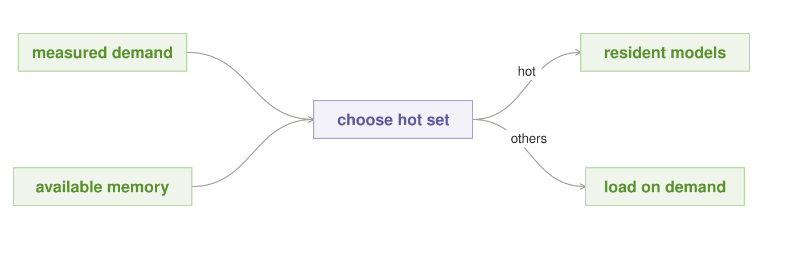

#### Intent

Keep the admitted model builds that save the most expected delay resident,
while preserving execution headroom and a bounded eviction path for less
frequent work.

#### Motivation

A local assistant repeatedly alternates between a general model and a coding
model. Loading either from storage takes longer than many of its requests. A
naive last-used rule makes the two useful builds evict one another, while a
rarely used large build can monopolize memory after one request. Residency has
become an orchestration policy whether or not the router acknowledges it.

#### Context

Several exact Pinned Model contracts are admitted; not all can co-reside; cold
load and eviction costs are measurable; requests recur enough for reuse to
matter; and the runtime can deliberately retain or unload weights and related
state between calls.

#### Problem

Which builds should occupy scarce accelerator memory between requests so the
local system remains responsive without starving rare but important work or
consuming the headroom needed to execute?

#### Forces

- A larger warm set reduces cold starts but leaves less memory for KV cache,
  live contexts, and transient runtime buffers.
- Recency follows changing demand; frequency protects steady demand.
- Large builds are expensive both to reload and to retain.
- Demand varies by time, user activity, and role, so yesterday's hot set can be
  wrong today.
- Evicting too eagerly destroys locality; retaining too stubbornly blocks
  higher-priority cold work.
- Speculative warming costs I/O, power, and wear before it helps any request.

#### Applicability

Use Keep It Warm when model load latency is material and request classes recur.
Use a trivial fixed set when only one build exists or every admitted build fits
comfortably. Avoid elaborate prediction when traffic is sparse and irregular,
and never let residency preference override the admission or evidence contract
of a higher-priority request.

#### Solution

Reserve memory for worst-case live execution before allocating a residency
budget. Score each admitted build by expected delay avoided, using decayed
demand, measured reload cost, size, and role priority. Pack a hot set inside
the remaining budget. Change membership only when the estimated benefit clears
an eviction-and-reload threshold. Let an admitted cold request displace warm
state when its priority and deadline justify the transition.

#### Local-First Differential

The portable lineage is cache retention: buffer pools, page caches, and
connection pools keep expensive state near expected demand. The local-first
differential is that whole model builds are unusually large, slow to load, and
behaviorally versioned. The owner can see exact residency, private request
history, device-specific load cost, and the victim of every eviction—placement
facts a hosted endpoint hides.

No provider rate limit or per-token fee is involved, but memory retained over
time remains scarce. The correct local objective is avoided foreground delay
per retained byte, subject to priority, power, and safety headroom.

#### Structure

Measured demand and the memory reserve enter a residency policy that selects a
hot set of exact contracts. A request for a hot contract takes the warm path. A
request for another admitted contract goes through Fit the Box, which either
leases a safe load-and-evict transition or chooses a wait or refusal exit.

#### Participants

- **Demand tracker** — records decayed request demand by role and exact
  contract.
- **Residency policy** — estimates the value and disruption of retention.
- **Hot set** — contains exact admitted contracts, not floating names.
- **Capacity reserve** — protects live KV, transient buffers, and safety
  margin.
- **Loader and evictor** — carry out bounded, observable state transitions.
- **Foreground scheduler** — may override cache preference for admitted
  priority work.
- **Idle Worker** — optionally performs preemptible speculative loads.

#### Collaborations / Mechanics

1. After requests, and on a slower control cadence, the demand tracker updates
   recency, frequency, role priority, and prediction windows.
2. The policy combines that demand with measured reload time, memory size, and
   disruption cost.
3. It packs a candidate hot set only after subtracting execution and KV
   reserves.
4. Hysteresis keeps the incumbent set unless the expected benefit of a change
   clears the full transition cost.
5. A cold request asks Fit the Box for an explicit transition and lease before
   any eviction begins.
6. Foreground work can cancel speculative warming and reclaim the seat.

#### Contract and Invariants

- Every resident entry identifies one exact Pinned Model contract.
- Warm occupancy never consumes the execution, KV, or safety reserve.
- Loads and evictions are bounded, observable tasks with declared victims.
- A minimum residence period or hysteresis rule limits oscillation.
- Priority admission can override cache preference.
- Warming cannot make an unadmitted contract routable.

#### Consequences

Repeated requests avoid cold starts, session locality improves, and the router
can reason about predictable warm paths. The system gains retained state,
prediction machinery, eviction policy, and more complicated memory accounting.
A bad forecast punishes rare work; a frequency-only policy can entrench
yesterday's use; and warming spends I/O, energy, and memory before it creates
value. Optimizing warm-hit percentage alone may retain tiny cheap builds while
failing to avoid the most painful loads.

#### Failure Mode and Safe Exit

The characteristic failures are **thrashing** and **residency monopoly**. In
thrashing, nearly equal builds repeatedly evict and reload each other. In
monopoly, a historically popular build never yields to important cold work.
Detect both through swap rate, useful latency avoided, and priority wait. Freeze
speculative membership changes, retain the smallest safe baseline, and route
other work through explicit load, queue, or refusal paths until demand or
capacity stabilizes.

#### Implementation / Refinements

Estimate value as request probability multiplied by measured reload delay,
then adjust for memory bytes, priority, eviction victims, and transition power.
Decay old observations, cap the influence of bursts, and use time-windowed
profiles for cyclical demand. Track weights separately from reusable session or
KV state because their reuse and privacy contracts differ. Preload only
admitted builds. Use minimum dwell times and separate enter/leave thresholds.
Run speculative loads through Idle Worker so foreground demand can stop them.

#### Observe and Measure

Track warm-hit rate and, more importantly, foreground milliseconds actually
avoided; cold loads; evictions; retained bytes; transition energy; swap loops;
priority wait; load cancellation; speculative-warm usefulness; prediction
error; and quality by route. Compare the policy with fixed-resident, LRU, and
no-retention baselines on the same trace.

#### Sample Code

~~~python
def choose_hot_set(contracts, demand, memory_budget):
    ranked = sorted(
        contracts,
        key=lambda contract: (
            demand.decayed(contract.identifier)
            * contract.reload_ms
            * contract.role_priority
            / contract.memory_bytes
        ),
        reverse=True,
    )
    return pack_with_hysteresis(ranked, memory_budget)

def admit_cold_request(request, resources):
    return fit_the_box(request.recipe, request, resources)
~~~

#### Known Uses and Evidence Status

Operating-system page caches, database buffer pools, connection pools, and
server keep-alive controls establish the portable retained-state mechanism.
Model servers commonly expose settings that retain a loaded model, but that is
not yet the full orchestration policy described here. Keep It Warm is extracted
from the richer
[Resident-Set Planner](six_pattern_reference.md#l1-resident-set-planner--compile-the-graph-into-real-memory).

Warm model pools are established operational practice. A demand-, contract-,
lease-, priority-, and execution-reserve-aware local policy with published
comparative measurements remains **Emerging**.

#### Worked Local Example

A 32 GB desktop reserves 8 GB for live KV and runtime headroom. During the day
it keeps a general assistant and a small verifier resident because together
they avoid most interactive loads. A larger coding build has high reload cost
but lower daytime demand; a time-windowed forecast schedules it into the hot
set before the owner's evening coding session. A rare high-risk review can
still evict either incumbent because Risk Ladder marks its evidence lanes
required and Fit the Box admits that explicit transition.

#### Related Patterns

**Pinned Model** defines each resident unit. **Fit the Box** owns feasibility
and eviction transitions. **Idle Worker** can perform speculative warming
without stealing foreground service. **Routing Memory** learns which builds
produce good outcomes, whereas Keep It Warm learns which already-admitted
builds are valuable to retain. **Power Budget** may suppress warming even when
memory is free. **Circuit Breaker** can remove an unhealthy build from the hot
set.

---

### Idle Worker

*Spend idle local compute in bounded pieces that yield to live work.*

**Classification.** Own the box · local-abundance scheduler · foreground
protection · **Maturity:** emerging

**Also Known As / Lineage.** Slack-Stealing Scheduler; background executor;
opportunistic worker; preemptible maintenance lane

#### Intent

Convert otherwise unused owned capacity into bounded background progress
without weakening the foreground latency contract.

#### Motivation

Evaluation packs, indexing, cache refresh, model auditions, and staged
improvement all promise to run in the background. On a one-seat box,
background is not a separate place; it is the time left after interactive
work. A five-minute job that cannot checkpoint can turn the next request into a
five-minute wait. Without an enforceable preemption contract, use idle cycles
is only a hope.

#### Context

The operator owns valuable non-urgent work, can observe foreground demand, and
has an executor whose seats, memory, I/O, or power overlap with interactive
inference. Background jobs can be divided into resumable or safely discardable
units.

#### Problem

How can the system exploit otherwise-wasted local compute while making
foreground priority enforceable rather than advisory?

#### Forces

- Large quanta improve throughput and amortize setup; small quanta reduce
  preemption delay.
- Some work checkpoints cheaply, while some must restart or cannot be stopped.
- False-idle signals create foreground contention.
- Repeated interruption can starve valuable background work indefinitely.
- Loading a background model may evict the exact warm state foreground work
  needs.
- Local inference has no provider quota, but battery, heat, noise, I/O, and
  responsiveness remain scarce.

#### Applicability

Use Idle Worker for evaluation, indexing, warming, cache maintenance, private
learning, and staged improvement whose units can checkpoint or be discarded.
Do not admit irreversible side effects, jobs that cannot meet the maximum drain
time, or work whose resource release is unbounded. A long non-preemptible job
belongs in an explicit maintenance window, not this pattern.

#### Solution

Define idle from observable foreground conditions. Divide background jobs into
bounded quanta, each with a checkpoint-or-abort path and a release deadline.
Admit one quantum only when seats, memory, power, and a minimum predicted idle
window are available. On foreground arrival, close background admission
immediately and require the running unit to checkpoint or terminate within the
declared maximum drain time.

#### Local-First Differential

The portable lineage is slack stealing and preemptible batch scheduling:
operating systems and clusters use idle resources for lower-priority work. The
local-first differential is the economic and privacy opportunity. The owner can
spend unlimited unused inference attempts without an API invoice, quota, or
data export, and can use private foreground signals unavailable to a remote
provider.

Local abundance is conditional rather than absolute. Only cycles that can be
reclaimed inside the foreground drain bound are idle. Memory displacement,
thermal debt, and delayed cancellation count against that slack even when the
token price is zero.

#### Structure

The foreground monitor and physical budgets gate a queue of resumable jobs. An
idle decision admits one bounded quantum. Completion may admit another; a live
request takes the checkpoint-or-abort edge, releases the contested resources,
and closes the background gate.

#### Participants

- **Foreground monitor** — defines idleness from queues, leases, and recent
  demand.
- **Background queue** — stores resumable jobs, priorities, and starvation age.
- **Quantizer** — cuts work into units shorter than the drain contract.
- **Executor** — runs only currently admitted quanta.
- **Checkpoint store** — records resumable state keyed by exact job and model
  versions.
- **Preemption gate** — stops admission and signals the running unit.
- **Resource and power admission** — proves each quantum is temporarily safe.

#### Collaborations / Mechanics

1. The monitor requires the idle condition to remain true for a debounce
   interval.
2. The scheduler selects a resumable job using priority plus starvation age.
3. Fit the Box and Power Budget admit one quantum whose deadline precedes the
   maximum drain bound.
4. The executor runs the unit with cancellation and checkpoint callbacks.
5. Foreground arrival closes admission immediately and signals the unit.
6. The unit checkpoints or aborts, releases its leases within the drain bound,
   and resumes from durable progress during a later idle window.

#### Contract and Invariants

- No background quantum runs without a cancellation deadline and resource
  lease.
- Foreground arrival prevents new background admission immediately.
- Contested seats and memory are released within the maximum drain time.
- Checkpoints name the exact job input, code, and Pinned Model contract that
  produced them.
- Discretionary work never consumes a reserve required for foreground service.
- Side effects are staged until a separate authority allows them.

#### Consequences

Owned capacity produces evaluation, indexing, and maintenance rather than
sitting unused. Private improvement can repeat without token charges, and
foreground latency stays bounded when the release contract is real. The costs
are scheduler complexity, checkpoint storage, wasted partial work, and more
device wear. Conservative idle detection can starve improvement; aggressive
detection can harm the foreground. Very small quanta can spend more time
loading and checkpointing than doing useful work.

#### Failure Mode and Safe Exit

The characteristic failure is a supposedly background task that will not
yield. On foreground arrival, abort it if safe. If it cannot checkpoint, abort,
and release resources inside the drain bound, remove that job class from Idle
Worker and assign it a declared maintenance window. Unknown foreground, power,
lease, or checkpoint state closes admission. After repeated preemption, age the
job toward a scheduled window rather than weakening foreground priority.

#### Implementation / Refinements

Define idle from queue depth, active leases, recent arrival rate, user activity,
device mode, and eviction impact—not CPU utilization alone. Debounce entry and
exit. Make quanta smaller than the allowed drain time and checkpoint at their
boundaries. Warm required artifacts only if the foreground hot set remains
protected. Use aging to surface starved work for explicit scheduling. Separate
safe computation from durable side effects; run the latter through a distinct
act or promotion gate.

#### Observe and Measure

Record foreground p50/p95 latency with and without background work; maximum and
distribution of preemption drain time; drain deadline misses; useful background
throughput; checkpoint overhead; aborted compute; starvation age; evictions;
joules; thermal crossings; and how often predicted idle windows were wrong.

#### Sample Code

~~~python
def idle_tick(queue, foreground, resources, power, policy):
    if not foreground.is_idle_for(policy.debounce_ms):
        return None
    job = queue.next_resumable_with_aging()
    if job is None or not power.allows_background():
        return None
    quantum = job.next_quantum(max_ms=policy.max_drain_ms)
    lease = resources.try_lease(quantum)
    if lease is None:
        return None
    try:
        return run_until_done_or_preempt(quantum, checkpoint=job.save)
    finally:
        lease.release()
~~~

#### Known Uses and Evidence Status

Operating-system idle tasks, preemptible batch queues, garbage collectors, and
work-stealing schedulers establish the portable scheduling lineage. The
model-specific ancestor is
[Slack-Stealing Scheduler](portable_patterns.md#26-slack-stealing-scheduler--run-background-work-only-in-the-idle-a-live-request-leaves-free),
while staged local improvement appears in
[Verified Night Shift](six_pattern_reference.md#l2-verified-night-shift--improve-the-box-while-it-sleeps).

The scheduling mechanisms are established. A local-model executor that jointly
enforces preemption drain, exact checkpoint identity, residency, foreground
leases, and energy admission is **Emerging**.

#### Worked Local Example

While a desktop has no interactive queue, Idle Worker evaluates one 20-second
shard of a private model audition. A request arrives after eight seconds. The
shard records its current case index, releases the accelerator in 1.3 seconds,
and resumes later, within the declared two-second drain bound. A training phase
that requires ten uninterrupted minutes cannot meet that contract, so it is
rejected from the idle queue and assigned a scheduled night window instead.

#### Related Patterns

**Night Shift** stages the improvement pipeline often executed here and adds
independent promotion. **Model Audition** and **Shadow Model** produce bounded
background jobs. **Keep It Warm** may use idle windows for speculative loads.
**Fit the Box** and **Power Budget** jointly admit each quantum. **Answer Cache**
may refresh through Idle Worker but retains its own validity contract.

---

### Power Budget

*Spend owned inference inside an explicit energy and thermal envelope.*

**Classification.** Own the box · local-substrate admission · physical-cost
governor · **Maturity:** candidate

**Also Known As / Lineage.** Energy Envelope; thermal admission; device-aware
budget; power-capped scheduling

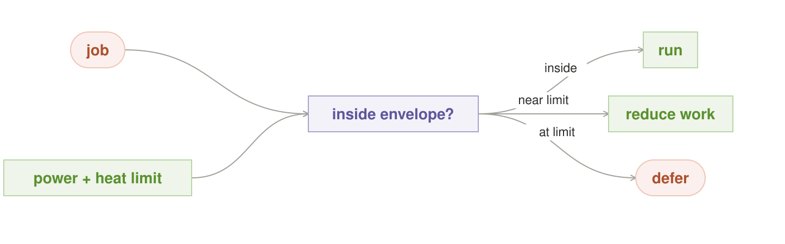

#### Intent

Admit and continuously shape local AI work so measured energy, temperature,
battery reserve, and noise remain inside an operator-declared envelope without
silently weakening required evidence.

#### Motivation

A wide local search appears free when counted in API tokens. On a laptop it
drains the battery; on a desktop it heats the room and spins fans; on a shared
server it causes throttling that slows every foreground request. A scheduler
that reasons only about memory and deadlines can turn free tokens into an
unpleasant or unavailable machine.

#### Context

The runtime controls admission, concurrency, and at least some generation
settings. It can read a useful subset of device power, accumulated energy,
temperature, battery, fan or noise mode, throttling, or a platform-provided
power profile. Recipes distinguish required work from optional effort and have
bounded cancellation paths.

#### Problem

How can an orchestration policy spend owned inference without treating the
device, its user, and its physical environment as an unlimited utility?

#### Forces

- More attempts can improve quality, while energy and thermal debt accumulate.
- High instantaneous power can finish quickly; slower execution can consume
  more total energy.
- Sensors are delayed, noisy, differently calibrated, and sometimes absent.
- Hardware safety limits require immediate action; battery and comfort
  preferences benefit from smooth control and hysteresis.
- Reducing concurrency can protect thermals but extend a deadline.
- Required verification cannot be traded away merely because a cheaper
  physical plan is available.

#### Applicability

Use Power Budget on battery-powered, thermally constrained, shared, or always-on
devices, and for any background or wide search whose physical cost is material.
A dedicated, well-cooled server still benefits when electricity, acoustic
limits, or capacity are shared. Do not treat software estimates as replacements
for firmware or hardware protection, and do not use this pattern to downgrade
mandatory evidence.

#### Solution

Attach an energy and thermal envelope to each device mode and request class.
Estimate candidate plans conservatively before admission. Select a full plan,
an evaluated variant that preserves the same required evidence, or a defer or
non-execution exit. During execution, monitor hard signals. As soft thresholds
approach, remove optional lanes, reduce optional effort, lower discretionary
concurrency, or slow generation according to the declared policy. At a hard
limit, checkpoint or cancel optional work. Restore capacity only after a lower
recovery threshold and dwell time.

#### Local-First Differential

The portable lineage is energy-aware and power-capped scheduling used in mobile
systems and clusters. The local-first differential is that the AI router can
observe the owner's actual battery, temperature, fan mode, electricity policy,
and foreground experience, then coordinate those signals with model residency
and recipe structure. A remote API hides the provider's physical cost and
cannot optimize for the heat or battery state of the user's box.

Zero per-token price makes this pattern more necessary, not less: it removes a
natural economic brake on brute-force search. The local budget is measured in
joules, thermal headroom, noise, and opportunity cost.

#### Structure

A candidate physical plan and a fresh device envelope meet at admission. The
plan runs unchanged, runs through an evaluated same-evidence variant, waits, or
does not run. Live telemetry feeds a governor that can trim or stop explicitly
optional work while preserving the recipe's required core.

#### Participants

- **Device profile** — declares comfort, battery, and safety limits by mode.
- **Telemetry adapter** — reports physical state, units, calibration, and
  freshness.
- **Cost model** — estimates upper energy and power cost for candidate plans.
- **Admission coordinator** — combines the envelope with Fit the Box and the
  recipe's evidence contract.
- **Runtime governor** — actuates optional concurrency, effort, speed, or
  cancellation.
- **Hysteresis policy** — defines recovery thresholds and dwell time.
- **Audit record** — records both planned and measured physical cost.

#### Collaborations / Mechanics

1. The coordinator reads memory and physical telemetry from one versioned,
   freshness-checked snapshot.
2. The cost model estimates each recipe variant against the active device
   profile and remaining request envelope.
3. Admission removes any plan that violates physical limits, deadline, or
   required evidence.
4. The selected plan receives a resource lease and live threshold callbacks.
5. A soft crossing first removes declared optional work or reduces
   discretionary concurrency.
6. A hard crossing checkpoints or cancels optional work immediately; required
   work follows its predeclared safe exit.
7. Capacity returns only after cooldown and hysteresis conditions are met.

#### Contract and Invariants

- Unknown, stale, or uncalibrated required telemetry never expands the budget.
- Firmware and hardware safety controls remain authoritative.
- Power policy may remove optional effort but cannot silently lower a Risk
  Ladder evidence floor or required verification contract.
- Every cancellable lane has a bounded checkpoint-or-stop path.
- Admission and runtime enforcement use the same device-profile revision.
- The terminal record states the actual physical exit: complete, reduced
  optional work, deferred, checkpointed, or cancelled.

#### Consequences

Local AI becomes compatible with the machine's real purpose, and no token bill
no longer hides joules. Brute-force patterns can run aggressively when the
owner has physical headroom and stop when that headroom disappears. Quality,
latency, and throughput may vary by device mode; telemetry adapters and
calibration are platform-specific; conservative models underuse hardware; and
aggressive control can oscillate or trigger throttling. Operators must decide
whose comfort and foreground work the envelope protects.

#### Failure Mode and Safe Exit

The characteristic failures are stale telemetry, bad calibration, and control
oscillation. If freshness or actuation is unknown, admit only a proven
conservative baseline or defer discretionary work. At a hard limit, stop the
optional lane even when its logical budget remains. If the remaining physical
envelope cannot satisfy required evidence and deadline together, queue, move to
another admitted owned node, or refuse—do not return an under-verified answer
under a reassuring label.

#### Implementation / Refinements

Calibrate per device, model contract, quantization, context bucket, and
concurrency level; do not copy watt estimates between machines. Distinguish
instantaneous power, total energy, temperature, battery reserve, acoustic mode,
and throttling. Use separate soft and hard thresholds and different enter/exit
values. Charge speculative lanes their worst credible cost before admission,
then reconcile against measurement. Reduce background work and optional fan
width before required evidence. Coordinate with Fit the Box from the same
snapshot to avoid incompatible independent decisions.

#### Observe and Measure

Record joules per completed and per verified answer; peak and sustained power;
thermal threshold crossings; time throttled; battery reserve; fan or acoustic
mode; optional work removed; deferrals; cancellations; deadline success;
foreground latency; and quality by device profile. Compare estimated upper cost
with actual consumption and recalibrate systematic errors.

#### Sample Code

~~~python
def admit_under_power(plans, telemetry, profile, request):
    state = telemetry.fresh_snapshot()
    if state is None:
        return conservative_or_defer(plans, request)
    admissible = [
        plan for plan in plans
        if plan.upper_joules <= profile.remaining_joules(state)
        and plan.meets_evidence_floor(request.evidence_floor)
        and profile.allows_peak(plan.peak_watts, state)
    ]
    return max(admissible, key=lambda item: item.quality_rank, default=None)

def on_hard_limit(active_run, profile):
    active_run.checkpoint_or_cancel_optional()
    state = active_run.telemetry.fresh_snapshot()
    if state is None or not active_run.required_work_fits(profile, state):
        return active_run.predeclared_safe_exit("hard power limit")
    return active_run.continue_required_only()
~~~

#### Known Uses and Evidence Status

Mobile power modes, processor thermal throttling, data-center power caps, and
energy-aware schedulers establish the portable envelope mechanism. The richer
local model formulation appears as
[Energy Envelope](six_pattern_reference.md#l3-energy-envelope--spend-joules-not-tokens).

The component mechanisms are established. A measured cross-platform policy
that joins model-specific energy estimates, evidence-preserving recipe
variants, live telemetry, and bounded AI-work cancellation remains a
**Candidate**.

#### Worked Local Example

A laptop on battery receives a high-risk analysis. Risk Ladder requires two
independent reads and a verifier. The current profile cannot admit that plan
inside the requested deadline, and no evaluated lower-power variant preserves
the same evidence floor. Power Budget therefore offers to queue the analysis
until AC power or transfer it to another owned node; it does not delete one
reader. Later, while the full plan runs on AC, a temperature hard limit stops an
optional explanatory follow-up, but the required verifier completes before any
answer is released.

#### Related Patterns

**Adaptive Effort** and **Brute Force** request additional work; Power Budget
places its physical ceiling. **Fit the Box** and this pattern should use one
admission snapshot. **Idle Worker** consumes only discretionary envelope.
**Risk Ladder** defines which evidence is non-negotiable. **Keep It Warm** may
skip a speculative load when retention would violate the current profile.

---

### Straggler Backup

*Duplicate only the parallel lane that is abnormally late.*

**Classification.** Own the box · local-abundance refinement · tail-latency
control · **Maturity:** established portable technique, emerging local-model
formulation

**Also Known As / Lineage.** Speculative execution; hedged lane; tail backup;
late-task duplication

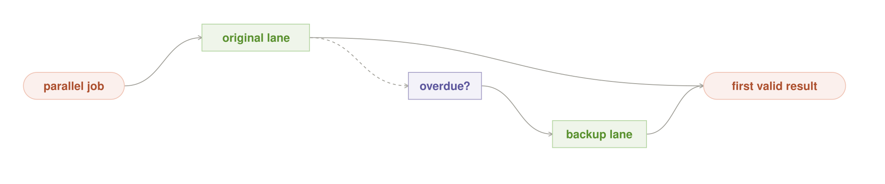

#### Intent

Protect a parallel recipe from one abnormal tail without paying to duplicate
every lane from the start.

#### Motivation

Four specialist lanes must join before a report can complete. Three finish in
their normal range; one model is delayed by a cold load, a wedged runtime, or a
slow node. The whole answer inherits the slowest lane. Starting two copies of
every lane would hide some tails, but doubles ordinary work and consumes the
spare seat needed by live requests. The useful redundancy is selective and
late.

#### Context

A recipe contains independent parallel lanes; the join waits for an individual
lane; a late lane can be re-run safely; comparable latency distributions are
measured; and a different admitted seat sometimes has enough deadline and
physical budget to finish a duplicate.

#### Problem

How can a local join reduce tail latency without turning every request into
unconditional redundancy or creating a backup storm precisely when the system
is already slow?

#### Forces

- Earlier hedges reduce more latency but duplicate more normal work.
- Later hedges conserve capacity but may not finish before the deadline.
- A backup on the same device, runtime, storage path, or model state can share
  the primary's failure.
- Cancellation may be delayed, so the losing attempt can keep consuming memory
  and power.
- The first answer is useful only if it passes the lane's validation contract.
- Local duplicates add no API invoice but consume scarce seats, residency,
  energy, and queue position.

#### Applicability

Use Straggler Backup when a parallel job waits for one measurable long-tail
lane, the work is read-only or idempotent, an independent placement exists, and
a duplicate can still beat the deadline. Avoid it for globally slow workloads,
side-effecting lanes, one-seat systems without useful alternative placement,
or results that cannot be validated before first-winner selection.

#### Solution

Estimate a tail threshold by exact model contract, request class, prompt-size
bucket, residency state, and node. Start one primary. When it crosses the
threshold, check the remaining deadline and a bounded speculation budget. If an
independent feasible seat exists, start at most one backup with the same input
and acceptance contract. Accept the first result that validates, cancel the
other attempt, and release both leases. Cap hedges per request and globally.

#### Local-First Differential

The portable lineage is speculative execution and hedged requests in
distributed systems. The local-first differential is not the algorithm but the
economics and placement knowledge. Owned spare nodes can absorb occasional
duplicates without a second API fee or provider quota, and the scheduler can
see model residency, device health, storage paths, and runtime placement well
enough to choose a genuinely different failure domain.

The free-attempt advantage exists only when capacity is reserved. A backup that
evicts foreground state, violates Power Budget, or queues behind the primary is
not spare and may worsen the tail it was meant to fix.

#### Structure

One primary lane starts normally. A tail detector opens a second edge only
after the threshold and only through physical admission. Primary and backup
meet at a first-valid join. The winner continues the recipe; the loser receives
cooperative cancellation. All other lanes remain single-copy.

#### Participants

- **Primary lane** — performs the original independent task.
- **Tail detector** — compares elapsed time with a class-specific distribution.
- **Speculation budget** — limits duplicate seats per request and system-wide.
- **Backup planner** — finds a feasible placement with the greatest practical
  failure-domain independence.
- **Validator** — applies the lane's ordinary acceptance contract to each
  result.
- **First-valid join** — selects the winner and rejects fast invalid output.
- **Cancellation path** — stops the loser and releases resources.

#### Collaborations / Mechanics

1. The scheduler timestamps the primary and attaches the appropriate measured
   latency class.
2. At the threshold, the detector checks whether the lane remains incomplete.
3. The planner checks deadline, global hedge count, Fit the Box, Power Budget,
   foreground priority, and placement independence.
4. If admitted, the backup receives identical immutable input and validation
   criteria on the best independent seat available.
5. The join ignores invalid responses and accepts the first valid result.
6. It cancels the other attempt, releases leases, and records whether the hedge
   launched, won, or failed with the primary.

#### Contract and Invariants

- At most one backup exists per lane unless a differently named policy is
  explicitly configured.
- Both attempts are read-only or idempotent and receive the same immutable
  input contract.
- The winner must pass validation; fastest is not equivalent to valid.
- Placement records the independence actually obtained.
- Cancellation and late-result suppression are keyed by request and lane id.
- Speculative work never bypasses foreground, memory, power, or privacy policy.

#### Consequences

Join-tail latency can fall sharply while the common path pays no duplication.
The pattern uses spare capacity exactly when a system may be entering overload,
adds cancellation and winner-selection complexity, and can hide an unhealthy
build if operators watch only joined latency. Diverse placement may also
produce different but individually valid answers, requiring the lane contract
to define equivalence. A hedge pool held in reserve may look like underused
capacity until it prevents a deadline miss.

#### Failure Mode and Safe Exit

The characteristic failures are over-hedging and correlated duplication. A
threshold that labels normal work late launches backups everywhere; a same-node
backup shares the original stall. If no independent seat, power envelope, or
deadline remains, continue the primary or take the recipe's ordinary timeout
exit. If neither result validates, report lane failure. Never pick the faster
invalid result, and disable new hedges under system-wide overload.

#### Implementation / Refinements

Learn thresholds per model contract, request class, prompt bucket, residency,
and node rather than using one global timeout. Prefer a high tail quantile plus
a minimum elapsed floor. Reserve a small global hedge pool and account for
cancellation drain. Choose a different device or runtime when the suspected
cause is local. Propagate cooperative cancellation into the generation engine
and discard late tokens by lane id. Open Circuit Breaker when repeated hedges
reveal health failure rather than isolated slowness.

#### Observe and Measure

Track p95, p99, and maximum lane and join latency; hedge launch and win rates;
duplicated compute and joules; cancellation drain; both-copy failure;
independence achieved; foreground delay; queue depth at hedge time; and the same
latency distribution with hedging disabled. A low win rate with high duplicate
cost indicates a threshold or placement problem.

#### Sample Code

~~~python
async def run_with_straggler_backup(task, primary, alternatives, deadline):
    first = start(primary, task)
    await wait_until(threshold_for(primary, task.kind))
    if first.done() or not hedge_budget.allows(task, deadline):
        result = await first
        return result if task.validate(result) else lane_failure(task)
    placement = best_independent(alternatives, task)
    if placement is None:
        result = await first
        return result if task.validate(result) else lane_failure(task)
    backup = start(placement, task)
    winner = await first_valid(first, backup, validate=task.validate)
    if winner is None:
        cancel_all(first, backup)
        return lane_failure(task)
    cancel_all_except(winner, first, backup)
    return winner.result
~~~

#### Known Uses and Evidence Status

MapReduce speculative execution and hedged requests establish the portable
technique. Google's
[The Tail at Scale](https://research.google/pubs/the-tail-at-scale/)
describes tail-tolerant techniques for large distributed services. The
model-specific ancestor is
[Straggler Backup](portable_patterns.md#16-straggler-backup--duplicate-only-the-overdue-worker).

Measured-tail duplication is **Established** in distributed systems. Applying
it to exact local model contracts with residency-aware independent placement,
foreground reserves, power admission, validation, and cancellation is
**Emerging**.

#### Worked Local Example

A four-part document analysis runs across two owned nodes. One extraction lane
passes its warm p95 because its node began an unrelated storage load. The other
node already holds a compatible pinned extractor and the reserved hedge seat is
free. The router launches one backup there. Its schema-valid result finishes
first, the original is cancelled, and the join completes. When both nodes are
serving interactive work, the hedge budget closes and the same lane follows its
ordinary timeout path instead.

#### Related Patterns

**Split Work**, **Brute Force**, and **Vote** create joins whose tails may need
protection. **Fit the Box** proves backup capacity exists. **Keep It Warm** can
prevent cold tails before duplication is necessary. **Circuit Breaker** handles
repeated route failure, whereas Straggler Backup handles an isolated slow lane.
**Power Budget** and **Idle Worker** decide whether apparent spare capacity is
actually available.

---

### Circuit Breaker

*Quarantine a route that keeps failing, then restore it through a bounded probe.*

**Classification.** Own the box · resilience refinement · stateful quarantine
· **Maturity:** established resilience pattern, emerging model-health scope

**Also Known As / Lineage.** Failure quarantine; model bulkhead; half-open
probe; fail-fast route isolation

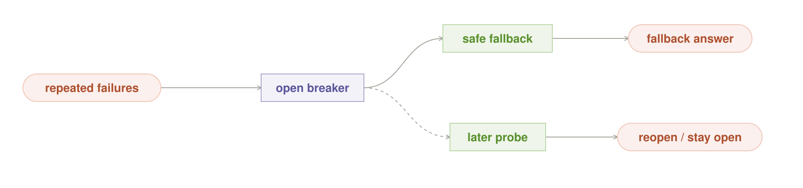

#### Intent

Stop sending ordinary traffic to a repeatedly failing model route long enough
to protect requests and healthy local capacity, then restore that route only
through a bounded, observable probe.

#### Motivation

A corrupted artifact, incompatible adapter, wedged runtime, bad prompt
template, or recurring out-of-memory loop makes the same route fail repeatedly.
Ordinary retry sends each new request into the same fault, reloads the same
state, and can starve healthy models. Permanent removal is also wrong for a
transient failure. The route needs memory: fail fast while unhealthy, then test
recovery without exposing every live request to the experiment.

#### Context

The router observes terminal outcomes by exact model contract, runtime, node,
and request class. It can classify at least major runtime and validation
failures, persist short-lived health state, prevent normal selection of a route,
and choose an explicit admitted fallback, queue, or refusal.

#### Problem

How can the system stop amplifying a repeated local fault while distinguishing
a broken route from a difficult request, an isolated slow lane, or a shared
device failure?

#### Forces

- Fast tripping protects capacity but creates false positives from small
  samples or hard prompts.
- Broad breaker keys are easy to manage but quarantine healthy request classes
  or nodes with the unhealthy one.
- Narrow keys isolate precisely but fragment evidence and delay detection.
- Fallbacks preserve service only when they meet present quality, privacy,
  memory, and deadline policy.
- Recovery probes consume capacity and can repeat a toxic load sequence.
- A model may succeed syntactically while failing schema, factual, or verified
  quality checks.

#### Applicability

Use Circuit Breaker for repeated load errors, runtime crashes, timeouts,
invalid-output rates, or class-specific verified quality failures with an
observable denominator. Do not use it as a substitute for per-request
uncertainty: a single hard prompt belongs in Adaptive Effort or Risk Ladder.
Do not trip a model-level breaker for a known device-wide or storage-wide fault;
isolate the actual shared dependency.

#### Solution

Maintain a scoped breaker with **closed**, **open**, and **half-open** states.
While closed, count classified failures over a bounded window with minimum
sample requirements. At the threshold, open the affected route. Normal traffic
uses only a predeclared, currently admitted fallback or a non-execution exit.
After cooldown, permit a small number of half-open health probes. Close
progressively only after probes satisfy the relevant runtime and semantic
health contract; otherwise reopen with backoff.

#### Local-First Differential

The portable lineage is the classic circuit breaker used around unreliable
services. The local-first differential is precision and remediation. An owned
router can key health to the exact model contract, adapter, runtime, device,
storage path, and request class; inspect local logs and telemetry; unload the
bad artifact; and run private probes before restoring traffic. A generic cloud
client normally sees an endpoint and status code rather than this serving
tuple.

This is not a zero-cost-compute pattern. Its value comes from owning the route
and the failure boundary. Local ownership also creates the duty to provide the
state machine, durable counters, and safe fallback policy that a managed
provider might otherwise supply.

#### Structure

The compact figure begins at the recovery slice: repeated classified failures
open the breaker, which redirects requests to an explicit fallback or
non-execution path. After cooldown, a bounded probe tests recovery. The closed
state and ordinary success path still belong to the full state machine, but
are omitted from this concise figure; a valid probe restores them
progressively, while failure returns to open state.

#### Participants

- **Failure classifier** — maps terminal outcomes to a cause and breaker scope.
- **Breaker state** — stores closed, open, or half-open state, counters,
  cooldown, and backoff.
- **Router** — prevents an open route from receiving ordinary traffic.
- **Fallback policy** — selects an admitted alternative, queue, or refusal.
- **Probe runner** — executes a bounded health workload after cooldown.
- **Health contract** — defines runtime, schema, latency, and relevant semantic
  success for recovery.
- **Bulkhead** — limits resources consumed by the failing route and its probes.

#### Collaborations / Mechanics

1. Every terminal outcome is classified against the narrowest meaningful
   route key and updates a window with a denominator.
2. A threshold plus minimum sample count opens the breaker and records the
   triggering cause.
3. The router removes that route from normal selection and rechecks any
   fallback against current request and physical policy.
4. After a jittered cooldown, the probe runner admits only a small half-open
   workload through the bulkhead.
5. The health contract evaluates both execution and relevant output validity.
6. Success restores capacity progressively; failure reopens the breaker with a
   longer bounded backoff.

#### Contract and Invariants

- Breakers are keyed narrowly enough to isolate the observed fault: exact
  contract, runtime or node, and relevant request class.
- Open means the ordinary router cannot select that route.
- Fallback never silently crosses a privacy, quality, tool, or hardware
  boundary.
- Probe traffic is bounded in concurrency, memory, power, and frequency.
- Recovery uses the same relevant health contract that justified the trip.
- Breaker state expires or is requalified when the contract or dependency
  identity changes.

#### Consequences

Repeated faults fail fast, healthy capacity is protected, and recovery becomes
an explicit observable process. The router gains state, timers, classification
policy, and possible persistence. False trips remove useful capacity; an
over-broad key turns quarantine into an outage; an overly attractive fallback
can conceal the broken route indefinitely; and semantic health needs verified
signals that may arrive later than runtime failures. Restart behavior becomes
part of correctness because forgetting an open breaker can recreate the storm.

#### Failure Mode and Safe Exit

The characteristic failure is a breaker keyed to the wrong cause. A device-wide
OOM can trip every model independently; one malformed prompt can condemn a
healthy build; or a fallback can share the failed storage path. When cause or
fallback safety is uncertain, queue or refuse the affected request instead of
guessing. If the fallback shares the dependency, open a bulkhead at that shared
scope. If probe admission itself would overload the box, keep the route open
and delay recovery rather than turning the probe into another incident.

#### Implementation / Refinements

Separate artifact and load failures, runtime failures, timeouts, invalid
outputs, and verified quality misses. Use both absolute counts and rates with a
minimum denominator. Persist enough state to avoid restart amnesia, but expire
stale observations. Add jittered cooldown, exponential backoff with a ceiling,
half-open concurrency limits, and progressive reclose. Give manual operation a
recorded override, not a hidden counter reset. Couple the breaker to a
resource bulkhead so toxic loads cannot occupy every seat while failing.

#### Observe and Measure

Record failure rate and denominator by scope and class; trip and reopen cause;
time open; probe count and success; false-trip rate; fallback use and verified
quality; shared-cause incidents; load attempts avoided; capacity protected;
requests queued or refused; and restart behavior. Track whether hedges and
retries repeatedly mask the same route before it trips.

#### Sample Code

~~~python
def route_with_breaker(route, request, breakers, runtime):
    key = (route.contract_id, route.node_id, request.kind)
    breaker = breakers.for_scope(key)
    if breaker.is_open():
        return admitted_fallback_or_refuse(request)
    outcome = runtime.run(route, request, probe=breaker.is_half_open())
    event = classify_terminal_outcome(outcome)
    breaker.observe(event)
    if event.succeeded:
        return outcome
    return admitted_fallback_queue_or_refuse(request, event)
~~~

#### Known Uses and Evidence Status

Circuit breakers, bulkheads, health checks, and progressive recovery are
established service-resilience techniques. Microsoft's
[Circuit Breaker pattern](https://learn.microsoft.com/en-us/azure/architecture/patterns/circuit-breaker)
documents the closed, open, and half-open state machine and its distinction
from retry. The model-orchestration ancestor is
[Circuit Breaker + Bulkhead](portable_patterns.md#20-circuit-breaker--bulkhead--fail-fast-quarantine-the-toxic-class).

The core state machine is **Established**. Exact local model scoping, semantic
health signals, model-load bulkheads, and evidence-aware fallback remain an
**Emerging** integration whose thresholds must be validated per deployment.

#### Worked Local Example

After an adapter update, one pinned coding contract fails three consecutive
loads on a particular node. Its contract-and-node breaker opens and prevents
new requests from repeating the load. Routine coding questions use the last
admitted smaller contract; high-risk repository changes refuse because that
fallback misses their quality floor. After the adapter is repaired, a half-open
probe loads it under a one-seat bulkhead, runs a schema and tool-use health
pack, and restores only a small fraction of traffic before fully closing.

#### Related Patterns

**Pinned Model** supplies the precise breaker identity. **Fit the Box** and
**Power Budget** admit probes and fallbacks. **Straggler Backup** handles an
isolated slow lane; repeated tail or validity failure should graduate to this
pattern. **Check and Retry** repairs individual requests, while Circuit
Breaker remembers route health across requests. **Shadow Model** can exercise a
repaired contract before progressive reclose.

---

## Stay sovereign

Local inference is not a privacy guarantee by itself. A workflow remains
sovereign only when its routes, data placement, dependencies, egress, and
long-lived memory obey boundaries the operator can name and test. These
patterns turn “keep it local” from an aspiration into explicit control flow,
including honest exits when the permitted local path is not enough.

### Local Cascade

*Try the owned path first; cross the boundary only through a deliberate gate.*

**Classification.** Stay sovereign · hybrid boundary control · local-first
policy refinement · **Maturity:** established cascade mechanism, candidate
sovereign gate

**Also Known As / Lineage.** Local-first fallback; edge-to-cloud cascade;
tiered serving; sovereign escalation; gated hybrid route

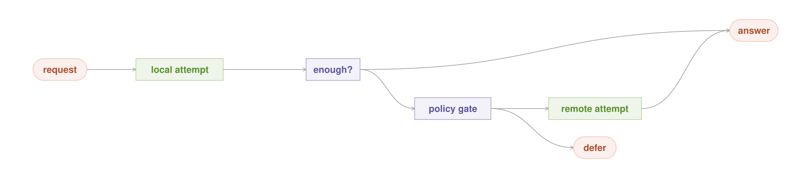

#### Intent

Make owned inference the normal path and treat every remote
escalation as a policy-authorized disclosure with an explicit defer or refuse
alternative.

#### Motivation

A product advertises local AI but catches every timeout,
uncertain answer, or unsupported tool with `call_cloud()`. Over time the local
model becomes a latency tax before the real service, sensitive requests leave
without a conscious decision, and an outage or expired vendor key breaks the
supposedly local product. The problem is not that remote capability exists. It
is that an exception handler silently became the architecture's privacy and
cost policy.

#### Context

A hybrid system has at least one useful owned route and one
external route with capabilities the local roster may lack. Requests can be
classified by data sensitivity, consequence, purpose, permitted fields, and
whether optional disclosure has been authorized. The local attempt can return
structured evidence about adequacy rather than only prose or an exception. The
original Risk Ladder rung and its allowed labeled degradations are frozen before
the cascade begins.

#### Problem

How can a hybrid assistant use remote capability for the hard tail
without turning local-first into cloud-by-default or leaking data whenever the
local path is merely inconvenient?

#### Forces

- A local attempt preserves control and avoids per-call cost, but it adds delay
  when escalation was inevitable.
- A remote model may improve quality but expands the trust, retention,
  jurisdiction, cost, and availability boundary.
- Consent can authorize optional disclosure but cannot override legal or
  organizational prohibition.
- Sending less context protects privacy while possibly removing what the
  remote worker needs.
- Automatic fallback improves apparent availability while hiding a material
  decision.
- Refusal is honest but may frustrate the user.

#### Applicability

Use Local Cascade when the owned route is adequate for a
meaningful fraction of work and remote use is permitted for some—not all—data
classes or purposes. It is especially useful for assistants with a small local
default and an optional frontier tail. Do not use a speculative local attempt
when it can never meet the request's minimum floor; ask for authorization and
route directly through the gate instead. Do not include a remote branch when
policy forbids it. A prohibited crossing ends in defer or refuse, not a more
creative payload.

#### Solution

Freeze the original Risk Ladder rung, its evidence floor, and any permitted
labeled degradation before execution. Run an approved local recipe and require
it to return an answer plus typed adequacy evidence such as passed checks,
unsupported capability, uncertainty, or resource refusal. If the result clears
the request's floor, return it. Otherwise submit a proposed external plan—not
yet a serialized prompt—to a policy gate. The gate evaluates data labels,
purpose, destination, fields, consequence, authorization, retention, and an
egress manifest. On approval, minimize and send only the allowed payload
through a named remote route. On denial or ambiguity, return a predeclared
labeled degradation only when the original rung already permits it; otherwise
defer or refuse. Audit the decision either way.

#### Local-First Differential

Most volume can run on owned models with no API
meter, vendor rate limit, or external retention, while rare permitted work can
still reach frontier capability. The local roster, checks, and policy state are
under one operator's control. This is not “free fallback”: the first attempt
uses local time and energy, and the remote branch still incurs money, latency,
and disclosure. The unique value is that remote use becomes an exception the
owner can see and revoke.

#### Structure

The request first reaches a local attempt. An adequate result goes directly to
the answer. An inadequate result can approach the remote lane only through a
policy gate; the other exit is defer. No arrow connects local failure directly
to remote execution.

#### Participants

- **Request classifier** — attaches sensitivity, consequence, purpose, and
  minimum quality.
- **Local recipe** — attempts the work and returns structured adequacy
  evidence.
- **Adequacy gate** — decides whether local evidence clears the request floor.
- **Boundary policy** — owns allowed destinations and fields.
- **Authorization source** — records user or organizational permission where
  relevant.
- **Payload minimizer** — constructs the approved disclosure only after
  admission.
- **Remote route** — names an exact vendor, model, retention mode, and tool
  set.
- **Audit ledger** — records the decision and actual sinks.

#### Collaborations / Mechanics

1. Freeze the request's original risk rung, evidence floor, and permitted
   labeled degradations, then compile and run the local plan under one request
   id.
2. Verify its answer or classify its typed failure against that frozen floor.
3. If the floor is not met, build a proposed remote manifest from metadata
   without rendering sensitive content.
4. Ask policy whether this data class, purpose, destination, and field set are
   allowed and whether fresh authorization is required.
5. If admitted, redact and serialize the minimum payload, execute the named
   remote plan, verify the returned result, and record actual egress.
6. If policy denies, authorization is absent, or the remote route fails, return
   only a predeclared labeled degradation the original rung allows; otherwise
   take the declared defer/refuse path rather than trying another undeclared
   endpoint.

#### Contract and Invariants

- Local exceptions cannot invoke remote inference.
- The boundary gate runs before external serialization, DNS, sockets,
  telemetry, or tool calls.
- Every external attempt names a policy revision, authorization, destination,
  field manifest, and retention class.
- The sent payload is a subset of the admitted fields.
- A denied, unknown, or unavailable route cannot fail open.
- The original risk rung and evidence floor are immutable for the request;
  egress denial cannot lower either one.
- A degraded local output is released only when it was predeclared, is labeled
  as degraded, and the original rung permits it.
- A remote result still passes the request's verification and action gate;
  frontier provenance is not proof.

#### Consequences

External use, cost, and disclosure become measurable; pure
local behavior remains available; and operators can tighten policy without
rewriting every workflow. The cascade adds local latency on escalated requests,
policy and consent UX, redaction errors, and two quality paths to test. A very
weak local default may annoy users while saving little disclosure. Strict
policy may produce more honest refusals.

#### Failure Mode and Safe Exit

The characteristic failure is catch-all
fallback: any local error, timeout, or low confidence silently reaches the
cloud. Other failures are consent remembered beyond its scope, redaction after
network contact, a remote tool opening a second undeclared sink, and cascading
through vendors until one answers. Disable the external branch. Return a local
result only when it is a predeclared labeled degradation already permitted by
the original risk rung; otherwise return a clear defer/refuse response naming
the missing capability. Never lower the evidence floor after egress denial or
disguise a boundary denial as a transient local error.

#### Implementation / Refinements

Represent local outcomes as typed states
such as `verified`, `unsupported`, `uncertain`, `resource_limited`, and
`policy_denied`; do not infer policy from exceptions. Keep the remote manifest
declarative and resolve exact endpoints at compilation. Ask for authorization
as late as possible and scope it to purpose, fields, destination, and time.
Minimize on the trusted side of the boundary. Bind retries to the same approved
manifest. Provide a policy mode that forbids remote even when a user asks, for
residency obligations. Test the path with networking denied so local adequacy
cannot depend on remote success.

#### Observe and Measure

Record local completion rate, adequacy failure reason,
escalation proposals, policy approvals and denials, authorization prompts,
fields and bytes disclosed, named sinks, remote cost and latency, redaction
failures, remote verification failures, and the number of useful requests that
still complete with networking disabled.

#### Sample Code

~~~python
def local_cascade(request):
    rung = risk_policy.frozen_rung(request)
    local = local_recipe.run(request)
    if adequacy.clears(local.evidence, rung.evidence_floor):
        return local.answer

    proposal = remote_plan.describe_without_payload(request, local.failure)
    permit = boundary.authorize(proposal, request.labels, request.consent)
    if not permit.allowed:
        return rung.release_predeclared_degradation_or_safe_exit(
            local,
            reason=permit.reason,
        )

    payload = minimize(request, permit.allowed_fields)
    remote = permit.route.run(payload, manifest=permit.manifest)
    return verify_or_refuse(remote, rung.evidence_floor)
~~~

#### Known Uses and Evidence Status

Tiered storage, edge-to-cloud inference,
service fallback, and hybrid model serving establish the broad mechanism. The
repository's [topology guide](../topologies.md#hybrid--local-for-the-many-frontier-for-the-few)
describes a hybrid local-many/frontier-few goal, while
[ADR 0013](../adr/0013-auto-routing.md) proposes an external Advisor with a
deterministic local availability fallback and explicitly marks that design as
pre-merge. Neither supplies the data-label, consent, field-minimization, and
sink-audit gate defined here. Local Cascade is careful original synthesis and
remains a **Candidate**.

#### Worked Local Example

A contract assistant summarizes a confidential draft
with an owned model and local retrieval. The result passes citation checks and
stays local. A later request asks for an unfamiliar foreign-law comparison.
The local route returns `unsupported_jurisdiction`, not invented prose. Policy
forbids sending the contract text but permits the user to authorize a remote
query containing jurisdiction names and a redacted issue list. The user
declines. The already verified local summary remains available as a separately
labeled artifact, but the comparison defers because its original rung permits
no degraded comparison. No hidden fallback or post-denial lowering occurs.

#### Related Patterns

**Best Fit** and **Recipe Router** choose the local path. **Check and Retry**
determines whether it is adequate. **Risk Ladder** sets the floor. **Privacy
Boundary** compiles and enforces the external manifest. **Data Stays Put** may
supply local evidence without centralizing raw data. **Offline Island** is the
cascade with no permitted remote branch. **Circuit Breaker** prevents repeated
external failures. **Private Memory** must not be included in a remote payload
unless the same gate authorizes the exact slice.

---

### Data Stays Put

*Move approved computation to the data-owning node and return only a bounded result.*

**Classification.** Stay sovereign · compute-to-data placement · local
data-gravity substrate · **Maturity:** established adjacent mechanisms,
candidate local orchestration contract

**Also Known As / Lineage.** Compute-to-data; query shipping; federated query;
data-local inference; bring the model to the records

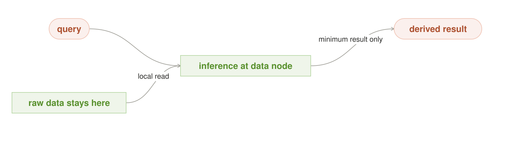

#### Intent

Execute a constrained inference plan where sensitive raw data
already lives and release only a policy-approved derived result with enough
provenance to verify it.

#### Motivation

A household, clinic, factory, or company grid may hold mail on
one machine, camera footage on another, and records on a third. Copying all raw
data into one assistant creates a larger breach target, duplicates retention,
breaks residency rules, and spends bandwidth before any useful computation
begins. Yet “run near the data” is incomplete: a malicious query can encode raw
records into its answer, logs can capture source text, and repeated small
answers can reconstruct the dataset. Data needs an execution boundary and the
result needs a release boundary.

#### Context

One or more owned nodes hold authoritative data that should not be
centralized. Each node can run an admitted model or tool, identify a data
revision, enforce a query capability, and return a declared result schema. The
requester needs a fact, feature, aggregate, or small evidence set rather than
the entire source corpus.

#### Problem

How can a multi-node local system use distributed private data
without moving the raw data into a central prompt or allowing the derived
result to become an unbounded exfiltration channel?

#### Forces

- Moving code is usually cheaper and safer than moving large private data, but
  the data node may be slow, offline, or unable to host the desired model.
- A small result reduces exposure but may omit evidence needed for trust.
- Exact records improve usefulness while aggregates improve privacy.
- Several results may be safe alone but revealing in combination.
- Strong sandboxes limit queries while increasing deployment and compatibility
  work.
- Fresh local data improves accuracy, but consistent cross-node snapshots are
  difficult.

#### Applicability

Use Data Stays Put when raw data is sensitive, large,
residency-bound, or already partitioned across owned nodes, and when the task
can be expressed as a bounded local computation followed by a smaller result.
It fits search, extraction, classification, feature computation, and federated
aggregation. Do not use it when the requested output is effectively the raw
dataset, when the data node cannot verify or confine the computation, or when a
cross-source join requires more disclosure than policy permits. Refuse or ask
for a different query instead of smuggling the join through prose.

#### Solution

Resolve the query to a signed or content-addressed computation
plan containing an admitted model/tool contract, declared source set, purpose,
resource bounds, result schema, and release policy. Send that plan to the node
that owns the data. The node authorizes the requester and purpose, executes in
a confined environment with raw reads available only inside the boundary, and
constructs a result no richer than the release schema. Attach source revision,
plan digest, and check evidence. Apply per-purpose query and disclosure budgets
before releasing it. Merge only approved derived results upstream.

#### Local-First Differential

Owned nodes can place inference beside files,
databases, sensors, and indexes without uploading them to a model vendor or
paying per record. The operator controls storage, model contracts, execution,
network policy, and retention on both sides of the request. This local substrate
makes compute-to-data practical for small deployments. It also makes the owner
responsible for node hardening, result leakage, availability, and data
revision—not a cloud provider.

#### Structure

The query and raw data meet only at the data-owning inference node. The only
outgoing lane carries a derived result. “Minimum result only” is a release
contract, not a suggestion to the model.

#### Participants

- **Requester** — needs a bounded answer and presents an identity and purpose.
- **Data catalog** — maps sources to owning nodes and labels.
- **Plan compiler** — resolves exact model, tool, and result schema.
- **Capability issuer** — grants a narrow, expiring read and release authority.
- **Data node sandbox** — confines code, raw reads, logs, and network.
- **Local inference worker** — produces candidate results.
- **Release gate** — enforces schema, sensitivity, aggregation, and query
  budget.
- **Provenance receipt** — binds the result to plan and source revisions.

#### Collaborations / Mechanics

1. Classify the request and locate the authoritative source.
2. Compile a bounded plan without copying source content.
3. Have the data node validate the plan digest, caller, purpose, expiry, source
   labels, and resource envelope.
4. Execute the admitted worker against a pinned source snapshot or named
   revision.
5. Use deterministic checks and a release transformer to reduce the output to
   allowed fields, aggregates, redactions, or references.
6. Consult cumulative query budgets, append an audit record without raw
   content, and return the result plus provenance.
7. Combine several such results upstream only under a second release policy.

#### Contract and Invariants

- Raw source bytes, embeddings, prompts containing raw records, and
  source-bearing logs never leave the declared data boundary.
- Every execution names an authorized purpose, exact plan, exact model/tool
  contracts, source revision, maximum resources, result schema, and expiry.
- The released value is a subset of the approved schema and disclosure budget.
- Unknown labels, stale capabilities, unavailable sandboxes, and unprovable
  source revisions fail closed.
- A derived result is still sensitive and keeps its propagated label.

#### Consequences

Data copies and breach radius shrink, residency becomes
enforceable by placement, and fresh source-side indexes can answer without
centralization. The system gains distributed authorization, deployment,
versioning, result-policy, and availability problems. Nodes may produce
results from different snapshots. A bounded answer can be less helpful, and
privacy budgets can reject individually reasonable follow-up questions.

#### Failure Mode and Safe Exit

The characteristic failure is answer-channel
exfiltration: a worker encodes raw data in free-form text, citations, timing, or
many repeated “small” results. Other failures include verbose logs, an
untrusted computation plan, stale replicas, and a missing data node. Reject
undeclared output, close network access, revoke the capability, and return
`unavailable`, `stale`, or `policy_denied` with no raw fallback. Never copy the
dataset centrally merely because its owner is offline.

#### Implementation / Refinements

Prefer declarative query plans and fixed
result schemas over arbitrary remote code. Use short-lived capability tokens
bound to caller, purpose, source, plan digest, and result limit. Run models and
tools without external network access, cap output bytes and rows, and scrub
logs. Treat model text as untrusted until a deterministic release transformer
parses it. Maintain cumulative per-purpose query budgets; add aggregation
thresholds, rate limits, or calibrated noise when the use case requires them.
For cross-node work, name snapshot time and tolerate partial results explicitly.

#### Observe and Measure

Record plan digest, source and model contract ids,
source revision, authorization and purpose, execution time, rows or bytes read
as counts, result schema and byte size, release denials, budget consumption,
node unavailability, and actual network sinks. Keep raw values out of ordinary
telemetry.

#### Sample Code

~~~python
def execute_where_data_lives(query, source, requester):
    plan = compiler.compile(
        query=query,
        source_id=source.id,
        result_schema=query.allowed_result,
        model_contract=registry.local_worker_for(source),
    )
    capability = policy.issue_capability(requester, plan)
    node = catalog.owner_of(source.id)
    result = node.run_confined(plan, capability, network="deny")
    released = node.release_gate.enforce(result, capability.result_budget)
    return released.with_provenance(plan.digest, source.revision)
~~~

#### Known Uses and Evidence Status

Stored procedures, query shipping,
federated analytics, edge inference, data clean rooms, and federated learning
all move constrained computation toward data rather than centralizing raw
records. The complete pattern here—local-model execution plus a schema- and
budget-governed result channel—is careful original synthesis. Grid can place
work on provider nodes, but it does not currently expose a data-ownership
catalog, purpose-bound computation capability, raw-data confinement contract,
or derived-result release gate. Data Stays Put is a **Candidate**.

#### Worked Local Example

A small business keeps payroll on an office server
that no assistant node may copy. A manager asks for departments with unusual
overtime growth. The planner sends a signed aggregate query and a pinned local
anomaly model to the payroll node. The node reads individual records, returns
only department, percentage band, count, and source revision for groups above
the minimum size, and charges the disclosure to the manager's audit-purpose
budget. No employee row, free-form model explanation, or raw embedding leaves
the payroll server.

#### Related Patterns

**Privacy Boundary** compiles the plan and blocks undeclared sinks. **Pinned
Model** and **Model Audition** identify an admitted worker. **Fit the Box**
checks whether the data node can run it. **Local Cascade** must not replace an
unavailable data node with remote upload. **Offline Island** preserves
data-local operation without a network. **Private Memory** is a specialized
local data store whose retrieval result obeys the same minimization rule.
**Split Work** can divide a query across sources, and **Tiebreaker** can compare
bounded evidence upstream.

---

### Privacy Boundary

*Compile the entire workflow inside a named boundary and gate every external edge.*

**Classification.** Stay sovereign · information-flow foundation · local
substrate enforcement · **Maturity:** established security lineage, candidate
end-to-end graph contract

**Also Known As / Lineage.** Boundary-Compiled Graph; information-flow
control; egress manifest; policy-compiled workflow; local execution cut

#### Intent

Resolve models, tools, retrieval, telemetry, storage, and fallbacks
into one concrete graph whose actual sinks are a subset of an enforced policy
manifest.

#### Motivation

The first model runs locally, so the product calls the workflow
private. An embedding service receives the document, a remote verifier receives
the draft, crash telemetry records the prompt, a tool follows a URL, or a
backup syncs the cache. Privacy failed through a component nobody drew. A list
of “local models” cannot describe an information boundary; only the full
resolved graph and its actual sinks can.

#### Context

Requests and data can carry classifications and purposes. The
orchestrator can enumerate every model, adapter, tool, retriever, evaluator,
log, cache, update check, storage target, and fallback before execution. The
runtime or operating system can deny undeclared network, process, file, and
storage access.

#### Problem

How can a local-first workflow prove that sensitive information
stayed within the operator's permitted boundary when capability is spread
across many components and optional fallbacks?

#### Forces

- More components increase capability while multiplying paths.
- Static policy is understandable but tools and endpoints change.
- Human consent can authorize optional disclosure but cannot erase residency
  or legal prohibitions.
- Redaction preserves some remote utility but may fail on context or metadata.
- Application declarations are expressive but can lie; OS enforcement is
  strong but coarser.
- Deny-by-default protects data while making missing manifests visible as lost
  functionality.

#### Applicability

Use Privacy Boundary whenever locality is motivated by
privacy, residency, confidential training data, offline work, or control of
retention. Define the boundary as one device, a trusted LAN, or an explicit
hybrid policy—never infer it from the word `local`. It may be lightweight for a
single sealed process, but it remains necessary. Do not claim the pattern when
components can open undeclared sockets or when data labels stop at the first
model.

#### Solution

Compile in two passes. First, propagate request labels and
purpose through the logical graph to constrain eligible component classes and
sinks. Resolve those constraints to exact model contracts, executables,
configurations, endpoints, storage, and telemetry. Second, propagate labels
again across that concrete closure, replacing disallowed edges with approved
local substitutes or explicit gates. Produce a signed egress manifest bound to
the graph, artifacts, fields, and policy revision. Enforce it below the
components. Any optional external edge requires permitted labels, minimum
fields, and appropriate authorization; otherwise defer or refuse.

#### Local-First Differential

An owned stack can replace remote embeddings,
evaluators, storage, and telemetry with inspectable local components and can
enforce network policy at the host or LAN boundary. The operator can retain the
compiled graph and actual sink log. Locality does not eliminate policy work;
it makes an all-local executable cut possible and testable rather than asking a
provider to attest to hidden infrastructure.

#### Structure

Sensitive data is labeled before routing. The local lane reaches the answer
inside the boundary. Any external lane must pass a separate policy gate and can
instead terminate in defer or refuse. The full implementation applies that
same gate to every tool, log, store, and fallback edge—not only the visible
model call.

#### Participants

- **Labeler** — assigns data class, tenant, purpose, and consequence.
- **Logical planner** — describes desired work.
- **Component registries** — resolve exact models, tools, configurations, and
  sinks.
- **Boundary compiler** — propagates labels and constructs the concrete graph.
- **Policy authority** — admits, substitutes, declassifies, or denies edges.
- **Authorization source** — records optional user decisions.
- **Manifest signer** — binds the approved closure.
- **Runtime sandbox and network enforcer** — deny undeclared behavior.
- **Sink auditor** — compares actual with approved events.

#### Collaborations / Mechanics

1. Label the request before any optional component sees content.
2. Constrain the logical graph, resolve exact components, and propagate labels
   through every edge and derived value.
3. Replace an illegal dependency with an admitted local one when available.
4. For an optional external edge, compute the minimum fields and ask policy and
   authorization.
5. If any required edge remains illegal, stop compilation.
6. Sign the graph and egress manifest, configure the sandbox, then execute.
7. Record actual DNS, socket, tool, storage, telemetry, and backup events and
   fail the request if they exceed the manifest.

#### Contract and Invariants

- Every executed component, configuration, field flow, and sink belongs to the
  signed concrete graph.
- Actual sinks are a subset of the manifest.
- Unknown dependencies and labels are denied.
- Authorization is scoped and cannot override a prohibition.
- Redaction and declassification occur inside the trusted boundary before an
  external edge.
- Fallbacks are graph edges, not exception handlers.
- Logs, caches, metrics, update checks, and backups obey the same policy as
  inference.

#### Consequences

Privacy and hybrid behavior become inspectable end to end;
hidden dependencies fail during compilation; and policy changes produce a
new, reviewable graph. The costs are registry completeness, label propagation,
manifest signing, sandbox integration, blocked capabilities, and operational
work whenever a tool adds a sink. A strict boundary can expose how much of an
apparently local product was actually remote.

#### Failure Mode and Safe Exit

The characteristic failure is hidden egress
from an apparently local path. Other failures are an unregistered executable,
label loss after transformation, stale authorization, a manifest enforced only
in application code, and telemetry that bypasses the tool graph. Stop the
component, revoke network access, substitute an admitted local implementation,
redact and request permission, defer, or refuse. Preserve the attempted and
actual sink evidence. Never widen the manifest automatically to make a request
succeed.

#### Implementation / Refinements

Maintain a registry for non-model
executables and configurations as carefully as Pinned Model maintains weights.
Use one canonical graph serialization and content digests. Enforce network and
file policy at the OS/container layer as well as the orchestrator. Make empty
egress mean deny all. Test DNS, redirects, subprocesses, telemetry, crash
reports, and package/update paths. Propagate labels to derived values rather
than declaring every summary harmless. Keep manifests small by compiling named
recipes and cache only when graph, policy, and artifact revisions match.

#### Observe and Measure

Persist graph, policy, and manifest hashes; component
and contract ids; declared and actual sockets, DNS, tools, files, stores, and
telemetry; substituted and denied edges; redacted fields; authorization ids;
and sandbox violations. Alerts should name the undeclared sink without logging
the sensitive payload that exposed it.

#### Sample Code

~~~python
def compile_private(logical_graph, labels, policy, registries):
    constrained = policy.constrain(logical_graph, labels)
    concrete = registries.resolve_exact(constrained)
    approved = Graph()
    for edge in concrete.topological_edges():
        edge_labels = propagate(labels, approved, edge)
        candidate = edge if policy.allows(edge_labels, edge) \
            else policy.local_substitute(edge_labels, edge)
        if candidate is None or not policy.allows(edge_labels, candidate):
            return defer_or_refuse(edge, edge_labels)
        approved.add(candidate, edge_labels)
    manifest = approved.sign_egress_manifest(policy.revision)
    sandbox.enforce(manifest)
    return approved, manifest
~~~

#### Known Uses and Evidence Status

Information-flow control, data-loss
prevention, zero-trust policy, capability security, service-mesh egress, and
reproducible deployment provide the mechanism lineage. The local formulation
is developed in
[Boundary-Compiled Graph](six_pattern_reference.md#f2-boundary-compiled-graph--reject-illegal-paths-before-compute).
Grid's [`remote/task_sandbox.py`](../../remote/task_sandbox.py) supplies a real
per-task network allowlist and file/credential confinement, including a
measured deny-all egress configuration. It does not propagate data labels,
resolve an end-to-end inference graph, sign a sink manifest, or audit every
runtime edge. Privacy Boundary is a **Candidate** with adjacent enforcement
primitives, not a completed privacy claim.

#### Worked Local Example

A private contract-review recipe requests a local
extractor, local embeddings, a local evidence checker, a file tool, and crash
telemetry. Compilation resolves exact builds and discovers that telemetry posts
to an external service. Policy has no authorization for contract text in that
sink, so the compiler replaces telemetry with a local counter and signs a
zero-egress manifest. A later request for external legal research is a separate
graph with explicitly redacted fields and user authorization; it cannot reuse
the zero-egress graph's authority.

#### Related Patterns

**Pinned Model** identifies model edges. **Recipe Router** gives the compiler a
bounded logical graph. **Local Cascade** exposes optional remote edges. **Data
Stays Put** binds raw reads to their node. **Offline Island** compiles an
all-local closure and tests it without a network. **Private Memory** propagates
person and purpose labels. **Answer Cache**, **Shadow Model**, and **Night
Shift** must declare their stores, duplicate reads, teachers, and telemetry as
ordinary edges.

---

### Offline Island

*Keep one complete useful path that survives without network, vendor, or control plane.*

**Classification.** Stay sovereign · disconnected operation · local
resilience substrate · **Maturity:** established offline-first lineage,
candidate end-to-end island contract

**Also Known As / Lineage.** Sovereign island; disconnected operation;
offline-first; offline-complete path; local survival mode; transactional outbox

#### Intent

Assemble and continuously prove a bounded end-to-end workflow whose
models, tools, data, identity, policy, and user interface remain useful when
every external dependency is absent.

#### Motivation

A model file is on the laptop, so the assistant is called
offline. During a flight it tries to refresh an authentication token, download
a tokenizer, resolve a license, query a hosted embedding index, load a web
font, call telemetry, or use cloud speech. The first missing dependency breaks
the path. “Local model” described one component; the user's task depended on a
distributed product. Offline operation must be an end-to-end property tested
under disconnection.

#### Context

The operator needs useful work during outages, travel, vendor
loss, incident isolation, or intentionally disconnected operation. A bounded
set of tasks can run from owned models, local tools, local data or snapshots,
and locally enforceable identity and policy. Some fresh information and
external side effects may be unavailable.

#### Problem

How can a local system remain predictably useful without the
network while distinguishing safe stale reads, impossible fresh reads, and
side effects that must wait?

#### Forces

- Pinning more dependencies improves survival but increases storage, update,
  and vulnerability burden.
- Cached data enables work but becomes stale.
- Local identity avoids control-plane dependence but needs secure key and
  policy distribution.
- Queuing external actions preserves intent while risking replay after context
  changes.
- Silent degradation feels seamless but can produce confidently obsolete
  answers.
- Testing disconnection catches dependencies that documentation misses.

#### Applicability

Use Offline Island when outages or intentional isolation are
normal requirements: travel, field work, industrial sites, homes, emergency
operations, or regulated enclaves. Define a bounded useful task set rather than
promising parity with the connected product. Do not queue irreversible actions
that cannot be made idempotent and reauthorized. If a task fundamentally
requires current external truth, say so and defer it.

#### Solution

Compile an offline bill of materials for each supported recipe:
exact model and tokenizer contracts, runtimes, tool executables, indexes, data
snapshots, schemas, UI assets, identity material, policy, and local telemetry.
Install and verify the closure before it is needed. Give the orchestrator an
explicit disconnected mode that forbids network and selects only offline-
admitted recipes. Mark snapshot age and unavailable capabilities in answers.
Put optional external side effects into a durable, idempotent outbox, then
revalidate policy, authorization, preconditions, and user intent before any
replay after reconnection.

#### Local-First Differential

Owned weights, tools, indexes, and storage can keep
working after a provider outage or account loss, with no rate limit, external
authentication, or per-call billing. The operator controls the dependency
closure and can test it inside a network-denied sandbox. This is a local-
substrate capability: a black-box API cannot be made available by the customer
when its network or vendor disappears.

#### Structure

When the network is absent, pinned models, local tools, and local data converge
into one complete local path. The output promises useful continuation, not
freshness or capability that the island does not possess.

#### Participants

- **Offline recipe catalog** — names supported tasks.
- **Dependency manifest** — closes every required artifact and configuration.
- **Pinned Models and local runtimes** — provide inference.
- **Local tool and data stores** — provide effects and context that remain
  available.
- **Local identity and policy store** — authorizes work without a control-plane
  round trip.
- **Freshness marker** — describes snapshot age.
- **Network-denied runtime** — proves no hidden edge.
- **Outbox** — stores permitted future effects.
- **Reconnection reconciler** — revalidates rather than blindly replays.

#### Collaborations / Mechanics

1. Resolve the requested task to an offline-admitted recipe and verify the
   installed manifest.
2. Enter a runtime profile with networking denied, then run only pinned local
   components.
3. Carry the revision and age of any snapshot read into the result.
4. Produce an explicit limited/defer response when a required artifact or fresh
   source is missing.
5. If policy permits queuing an external effect, store a content-addressed
   intent with idempotency key, preconditions, expiry, and required
   reauthorization.
6. On reconnection, refresh policy and data, present changed intent when
   necessary, and execute at most once.

#### Contract and Invariants

- A supported offline recipe performs no DNS, socket, hosted authentication,
  remote license, update, telemetry, font, model, tool, or storage access.
- Every required artifact and policy revision exists in the manifest and
  passes integrity checks.
- Answers distinguish local-current, snapshot-stale, and unavailable facts.
- Queued effects never imply completion and never replay without fresh policy
  and precondition checks.
- An incomplete closure cannot be advertised as offline support.

#### Consequences

The assistant remains useful through outages and vendor
loss, private work can continue inside isolation, and hidden dependencies are
discovered before emergencies. The costs are duplicated artifacts, local key
and policy management, patching, stale snapshots, reduced capability, and an
outbox reconciliation protocol. Offline tests may fail whenever an innocuous UI
or telemetry dependency changes—which is exactly the failure the pattern is
meant to expose.

#### Failure Mode and Safe Exit

The characteristic failure is “mostly
offline”: one hidden dependency prevents startup or leaks a request when
connectivity returns. Other failures are unmarked stale data, expired local
identity, a missing tokenizer, and automatic replay of an obsolete action.
Block the undeclared edge, disable the affected capability, keep the remaining
island available, and explain what needs connection. Quarantine outbox entries
whose policy, authorization, preconditions, or intent no longer match.

#### Implementation / Refinements

Generate the dependency manifest from the
resolved concrete graph, not a hand list. Vendor all runtime-critical UI assets
and schemas. Use content digests and periodic integrity drills. Run end-to-end
tests in a network namespace or sandbox with DNS and sockets denied; unplugging
Wi-Fi is not enough when cached connections exist. Provide local recovery for
identity and encrypted stores. Set explicit maximum age by data class. Keep
outbox effects narrow, observable, expiring, and idempotent. Practice vendor-
loss drills, not only short network outages.

#### Observe and Measure

Track offline recipe coverage, manifest integrity,
undeclared network attempts, startup and task success under network denial,
artifact and snapshot age, unavailable capabilities, stale-answer markers,
outbox depth and age, reconciliation refusals, and the longest tested
disconnected interval. Telemetry itself must remain local until policy permits
export.

#### Sample Code

~~~python
def run_offline(request):
    recipe = offline_catalog.resolve(request)
    manifest.verify_installed(recipe)
    with sandbox.network_denied():
        result = recipe.run(
            models=pinned_models,
            tools=local_tools,
            data=local_snapshots.with_freshness(),
        )
    return result.mark_staleness()

def reconnect():
    for intent in outbox.pending():
        if policy.reauthorize(intent) and intent.preconditions_still_hold():
            execute_once(intent.idempotency_key, intent)
        else:
            outbox.quarantine(intent)
~~~

#### Known Uses and Evidence Status

Offline-first applications, disconnected
field systems, edge computing, local package mirrors, transactional outboxes,
and disaster-recovery drills establish the lineage. Grid documents a
[pure-local topology](../topologies.md#pure-local--everything-on-machines-you-own)
and contains individual local paths, but a topology statement is not proof of
an offline dependency closure. The repository has no complete recipe manifest,
network-denied conformance suite, freshness contract, or revalidated effect
outbox for this purpose. Offline Island is therefore a **Candidate**, despite
real local building blocks.

#### Worked Local Example

Before travel, a journalist's laptop verifies an
offline research recipe containing a pinned model, tokenizer, PDF extractor,
local search index, notes database, citations checker, and UI assets. On the
plane it can summarize and cross-reference the snapshot, marking that news and
web sources are current only to the last sync. A request to email an editor is
stored as an unsigned draft, not reported as sent. After landing, changed
recipients and attachments are shown for confirmation before one idempotent
send.

#### Related Patterns

**Privacy Boundary** produces the all-local concrete graph. **Pinned Model**
and **Answer Cache** bind artifacts and reusable results. **Data Stays Put**
keeps raw sources on their offline nodes. **Private Memory** supplies local
continuity. **Keep It Warm** improves responsiveness without adding
dependencies. **Local Cascade** reduces to its local and defer branches.
**Circuit Breaker** opens external routes during outage, while **Recipe Router**
selects an explicitly offline-admitted recipe.

---

### Private Memory

*Keep durable memory under local control and reveal only the authorized slice a task needs.*

**Classification.** Stay sovereign · purpose-limited durable context · owned
local state · **Maturity:** established privacy lineage, candidate memory
contract

**Also Known As / Lineage.** Scoped memory; sovereign memory; purpose-bound
retrieval; least-context memory; namespaced retrieval; provenance-aware memory

#### Intent

Store durable personal or organizational memory in locally
controlled scopes and give each model only the minimum provenance-bearing
context authorized for its current person, purpose, and task.

#### Motivation

A useful assistant should remember a preferred writing style,
an accepted project decision, and where a task stopped. The easiest
implementation appends every conversation to one searchable transcript and
injects the nearest chunks into every prompt. A family member sees another's
medical note; a coding agent receives a banking preference; an old model
summary becomes a permanent false fact; a retrieved document's instruction
overrides the user's request. Memory made the system fluent and untrustworthy.
Durability needs namespaces, provenance, purpose, minimization, correction, and
deletion—not just vector search.

#### Context

An assistant serves repeated tasks for identifiable people,
projects, or roles. Some facts and decisions deserve continuity beyond one
request. The operator can keep encrypted local state, authenticate the current
principal, obtain purpose from trusted task metadata or explicit authorization,
label sensitivity, run retrieval locally, and control what any selected model
receives. A classifier may suggest a purpose but cannot grant one.

#### Problem

How can an assistant gain useful long-lived context without
creating a global transcript, leaking across people or purposes, or allowing
stale and poisoned memories to silently govern future work?

#### Forces

- More memory improves continuity while increasing exposure and prompt
  contamination.
- Fine scopes protect privacy but can hide a relevant cross-project fact.
- Semantic retrieval finds paraphrases but embeddings and indexes are
  sensitive state too.
- Automatic writes capture more context but promote model guesses into facts.
- Deletion and correction conflict with append-only audit.
- Remote models may be stronger but every retrieved item sent to them crosses
  a new retention boundary.
- Small context windows force useful minimization but can remove important
  provenance.

#### Applicability

Use Private Memory when continuity across requests creates
real value and the operator can identify the principal and purpose before
retrieval. It fits preferences, project decisions, approved facts, task state,
and user-curated knowledge. Avoid durable storage for ephemeral chat, secrets
that should live in a credential vault, or inferred personal attributes the
user did not authorize. If identity, authorized purpose, or scope is ambiguous,
use only the current request and ask rather than search every namespace.

#### Solution

Represent each memory as a typed record with principal, scope,
purpose, sensitivity, provenance, author, confidence authority, creation and
source revisions, expiry, and correction/deletion state. Encrypt records and
indexes locally under scope-aware keys. Before retrieval, authenticate the
principal and resolve purpose from trusted task metadata or explicit
authorization. A classifier may propose a purpose for confirmation, but its
output never expands access by itself. Compile the allowlist from the authorized
purpose and policy. Search only eligible scopes, then minimize, rank, and cap
the result. Give the model provenance-bearing data separated from instructions.
Stage proposed writes and require an allowed authority—often explicit user
confirmation—for durable facts. Propagate correction and deletion through
indexes and caches.

#### Local-First Differential

Personal history, embeddings, retrieval queries,
and memory access logs can remain on hardware the operator owns, outside vendor
retention and training. Local models can consume the selected slice without any
disclosure. The operator can encrypt, export, correct, and delete the store on
their terms. If a remote route is chosen, only Privacy Boundary can authorize a
specific minimized slice; calling the database local does not make the prompt
sent to a vendor private.

#### Structure

Local private history and the current person-plus-purpose scope meet at a
retrieval decision. The model receives only the minimum eligible context and
produces an answer. The scope decision precedes similarity search; relevance
cannot grant access.

#### Participants

- **Principal authenticator** — identifies the person or service.
- **Purpose classifier** — may suggest why memory is needed but grants no
  access.
- **Purpose authority** — resolves trusted task metadata or explicit
  authorization to the purpose that policy may use.
- **Memory policy** — compiles eligible scopes and fields.
- **Encrypted record store** — holds typed source records.
- **Local index** — supports search without becoming a second ungoverned store.
- **Retriever and minimizer** — select a bounded slice.
- **Context assembler** — separates memory data from instructions and retains
  provenance.
- **Write gate** — validates new memory.
- **Correction and deletion service** — updates records, indexes, caches, and
  derived summaries.

#### Collaborations / Mechanics

1. Authenticate the principal and resolve purpose from trusted task metadata or
   explicit authorization; treat any classifier result only as a suggestion.
2. Have policy choose eligible namespaces from that authorized purpose before
   any similarity operation.
3. Search those namespaces locally, filter expiry and correction state,
   diversify results, and choose the smallest set that meets the task's
   evidence need.
4. Add source, date, scope, and confidence metadata, and quote or structure
   memories as untrusted data.
5. Run the selected model.
6. Stage any proposed durable write separately from the answer, classify it by
   type and sensitivity, and admit it through the appropriate authority.
7. Log access and mutation events without copying private content into
   telemetry.

#### Contract and Invariants

- Access control precedes relevance ranking.
- Purpose comes from trusted task metadata or explicit authorization; a
  classifier's output alone grants no scope or field access.
- Every memory has principal, purpose scope, provenance, and lifecycle
  metadata.
- A model-generated summary is not silently upgraded to a user fact.
- Retrieved content cannot change system policy or become instructions merely
  because it contains imperative text.
- The model receives no item outside the compiled allowlist and no more than
  the context budget.
- Deletion and correction reach all indexes and validity-dependent caches.
- External disclosure is separately authorized and manifested.

#### Consequences

The assistant gains continuity while reducing cross-person
and cross-purpose leakage, users can inspect and correct what is remembered,
and local retrieval avoids repeated disclosure. The costs are identity and
policy plumbing, encryption and key recovery, lifecycle management, retrieval
misses, additional latency, and a difficult migration story when scopes
change. Strict minimization can omit context and produce a less personalized
answer; that is an explicit trade rather than accidental over-sharing.

#### Failure Mode and Safe Exit

The characteristic failure is scope collapse:
all memory becomes one similarity pool and relevance is mistaken for
permission. A related failure lets a purpose classifier infer a broad purpose
and thereby grant itself access. Other failures are poisoned retrieved
instructions, stale facts, model-authored false memories, embeddings left after
deletion, and a remote worker receiving local history. Disable cross-scope
retrieval, return to current-request context, quarantine suspect writes,
rebuild affected indexes, and ask the user to confirm or correct the fact. When
identity, authorized purpose, keys, or deletion state are uncertain, retrieve
nothing.

#### Implementation / Refinements

Separate source records from derived
summaries and make summaries invalid when sources change. Use envelope
encryption with per-principal or per-scope keys and a tested recovery path. Run
embedding and retrieval locally for private scopes. Apply metadata filters
before vector search where the engine permits it; otherwise partition indexes.
Store tombstones and index-generation ids so deletion is testable. Treat
retrieved text as quoted data, strip or flag instructions, and cap influence of
one source. Provide memory review, export, correction, forget, and “do not
remember this” controls.

#### Observe and Measure

Record scope and purpose ids, candidate and released
item counts, context bytes, provenance coverage, retrieval misses, stale and
expired filters, user corrections, rejected writes, cross-scope denials,
deletion propagation time, index generation, remote-disclosure decisions, and
answer quality with and without memory. Avoid logging memory text or embedding
vectors as ordinary metrics.

#### Sample Code

~~~python
def answer_with_private_memory(request, principal):
    suggested = purposes.classify(request)
    purpose = purpose_authority.resolve(
        task_metadata=request.trusted_task_metadata,
        explicit_authorization=request.explicit_purpose_authorization,
        suggestion=suggested,
    )
    if purpose is None:
        return model.answer(request, context=[])
    allowed = memory_policy.allowed_scopes(principal, purpose)
    if not allowed:
        return model.answer(request, context=[])

    candidates = local_index.search(request, scopes=allowed)
    context = minimize([
        item for item in candidates
        if item.active and memory_policy.may_read(principal, purpose, item)
    ], max_tokens=purpose.memory_budget)
    answer = model.answer(request, context=as_untrusted_evidence(context))
    memory_write_gate.stage(answer.proposed_memories, principal, purpose)
    return answer
~~~

#### Known Uses and Evidence Status

Purpose limitation, least privilege,
personal data vaults, namespaced retrieval, event sourcing, and provenance-
aware knowledge systems provide the lineage. Grid has adjacent continuity
machinery: [`remote/task_agent.py`](../../remote/task_agent.py) scopes agent
transcripts and a provider's `memory/` by project member and conversation, and
[`remote/task_repo.py`](../../remote/task_repo.py) transports that conversation
through a separate ref. Those files do not implement a locally encrypted,
purpose-filtered, minimum-context memory store; their transcript can travel as
project state and must not be cited as proof of local privacy. Private Memory
is careful original synthesis and remains a **Candidate**.

#### Worked Local Example

A home assistant stores one user's approved writing
preference in a personal scope and a team's accepted API decision in a project
scope. A request to draft the project changelog authenticates that user, and
trusted task metadata authorizes `project-communication`; policy permits both
the project decision and the writing preference, so the retriever supplies
those two records with dates and sources. A classifier suggestion without that
metadata would grant nothing. A later household health question has a different
authorized purpose and can see neither. When the API decision is reversed, its
source record is corrected, the derived summary becomes invalid, and the next
changelog receives only the new decision.

#### Related Patterns

**Privacy Boundary** compiles access and any external disclosure. **Data Stays
Put** keeps the memory store at its owning node. **Offline Island** preserves
local continuity and keys without a service account. **Answer Cache** must
include memory and policy revisions in its validity closure. **Routing Memory**
stores verified route outcomes, not personal content. **Pinned Model** records
which build consumed a slice. **Model Audition** probes retrieval and
prompt-injection behavior. **Local Cascade** may disclose a memory only through
an explicit field-level gate.

---
## Composing a local multi-AI team

Patterns compose in layers; they are not interchangeable boxes in an arbitrary
chain. A trustworthy team normally settles six contracts in this order:

1. **Boundary contract.** What data, tools, logs, models, and fallbacks may cross
   which owned boundary?
2. **Consequence contract.** What evidence is required, and what non-answer is
   acceptable, before this class of result can be used?
3. **Logical recipe.** Which workers search, check, compare, divide, or reuse?
4. **Physical plan.** Which exact builds, seats, memory, deadline, and energy
   make that recipe real on the current box?
5. **Act contract.** Which selected result, if any, may touch the world once?
   This is owned by the
   [agent-layer Act Gate](../agent_orchestration_patterns/README.md#1-the-act-gate--only-one-worker-may-act),
   not by a model vote.
6. **Learning contract.** Which independently verified outcomes may alter future
   routing, trust, residency, or memory?

Skipping an earlier contract cannot be repaired by adding a later pattern. A
five-model council does not legalize an external data crossing; a perfect
memory plan does not make a weak verifier true; consensus does not authorize
five agents to act.

### Worked composition — a private code-change team

A private repository contains a concurrency regression. The operator wants a
patch by morning, but no source may leave the LAN and no untested change may be
committed.

1. **Privacy Boundary** compiles a local-only path: repository, retrieval,
   model calls, tests, logs, and artifacts remain on owned nodes. **Local
   Cascade** has no admitted remote branch for this data class. **Offline
   Island** confirms that the models, toolchain, test fixtures, and
   authentication needed for the run are already local.
2. **Risk Ladder** classifies a patch as consequential and reversible before
   commit. It requires deterministic tests, one independent review, and the
   safe exit `return evidence without acting` if either is absent.
3. **Recipe Router** selects a composition: **Brute Force** creates four
   read-only approaches; **Check and Retry** may repair one near-pass from test
   output; **Challenge** reviews the winning diff for an invariant the tests may
   miss. The same tests judge every candidate. A majority is not used because
   an objective oracle exists.
4. **Pinned Model** resolves each role to exact admitted builds. **Fit the Box**
   finds that only two builds co-reside, so the logical fan executes in two
   waves rather than pretending to have four parallel seats. **Power Budget**
   admits the overnight envelope; **Idle Worker** checkpoints immediately if
   interactive work arrives.
5. Three candidates fail. One nearly passes, receives the concrete failing test
   through Check and Retry, and then clears the full suite. Challenge finds no
   unresolved material objection. Only this verified artifact crosses the
   agent-layer Act Gate for one `round_id`-keyed commit. Every losing worker was
   read-only.
6. The run records contract ids, approach ids, tests, physical cost, and the
   verified outcome. **Routing Memory** may use that evidence for future
   concurrency bugs. It does not learn from the winning model's confidence or
   from an ungraded draft.

If no candidate passes, the system returns the test evidence and defers. If a
model repeatedly fails to load, Circuit Breaker quarantines that exact route;
it does not silently cross the privacy boundary. If the device reaches its hard
thermal limit, optional attempts checkpoint even though the logical attempt
budget remains. The composition therefore defines its non-success behavior as
carefully as its happy path.

### Three reference teams

| Team | Core composition | Honest failure exit |
|---|---|---|
| **Verified builder** | Risk Ladder → Recipe Router → Brute Force → Check and Retry → Challenge; Pinned Model + Fit the Box bind the run; one agent Act Gate commits | no passing artifact means evidence is returned without a write |
| **Private knowledge team** | Data Stays Put executes near each source; Private Memory retrieves a purpose-scoped slice; Privacy Boundary and Local Cascade govern egress; Offline Island provides continuity | unavailable or stale sources are disclosed; the system never substitutes an undeclared remote copy |
| **Quiet home grid** | Best Fit handles ordinary traffic; Keep It Warm protects latency; Idle Worker runs auditions and cache work; Power Budget limits the device; Circuit Breaker contains a failed route | background work checkpoints, degraded routes disclose their floor, and unsafe work waits |

These recipes are examples, not new patterns. Change their members when the
forces change, but preserve the boundary, evidence, physical, act, and learning
contracts that make the composition honest.

## Deep references

- [Pattern lineage](pattern_lineage.md) records where every idea in the earlier
  27-pattern research set went.
- [Research reference](portable_patterns.md) keeps the detailed algorithms,
  refinements, examples, code, and generated diagrams.
- [Archived six-pattern engineering reference](six_pattern_reference.md)
  preserves the detailed artifact, residency, boundary, idle-work, energy, and
  physical-plan contracts from the earlier proposal.
- [Agent orchestration patterns](../agent_orchestration_patterns/README.md)
  cover sessions that hold credentials, use tools, and act on the world.

These names are working design vocabulary, not claims that every pattern is
already implemented in Grid. A pattern earns its keep when the simple move
recurs and its local-first advantage survives measurement.
