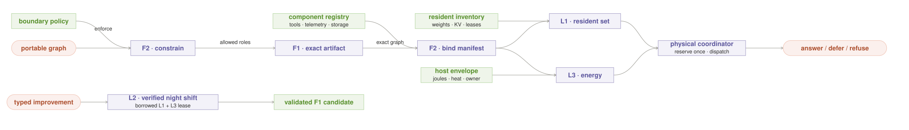
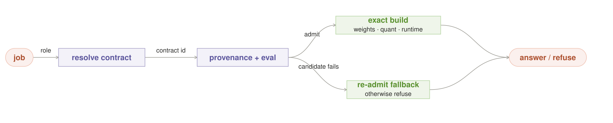
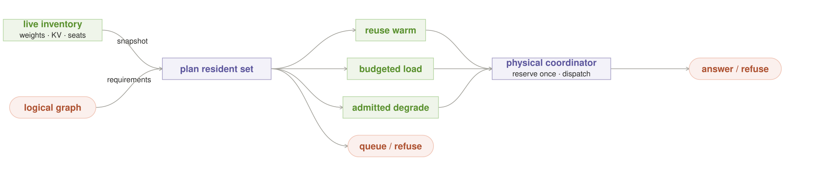
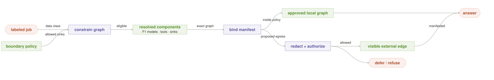
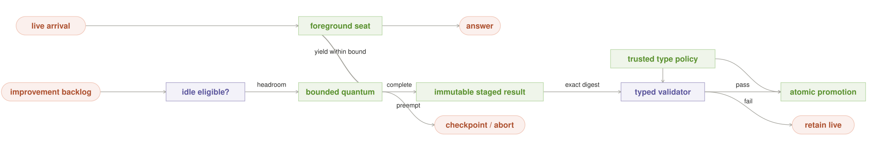
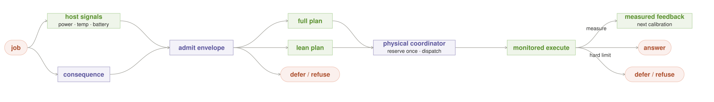

# Local AI Orchestration Patterns — the sovereign model layer

Local AI is not distinguished by calling models more often. Cloud systems can
route, chain, fan out, vote, delegate, critique, and retry too. Local AI becomes
architecturally different when the application operator owns the inference
substrate: the exact model artifacts, accelerator memory, KV cache, machine
idle time, power and thermal envelope, network boundary, and physical failure
domains.

This catalog offers **three local-native pattern proposals** for that layer,
plus two supporting foundations. They are deliberately few. Generic reasoning
workflows remain useful, but they live in the
[portable research catalog](portable_patterns.md) and are not claimed as
uniquely local.

## The line between portable and local

[Anthropic's production-oriented catalog](https://www.anthropic.com/engineering/building-effective-agents)
already describes routing, prompt chaining, parallel sectioning and voting,
orchestrator-workers, and evaluator-optimizer loops. Those patterns keep the
same intent and structure whether their workers are local processes or hosted
API calls.

The test used here is stricter:

> **API-substitution test:** replace every local inference worker with an
> elastic hosted API. If the decision state and mechanism survive, the pattern
> is portable. If the substitution removes the state that makes the decision,
> the pattern is local-native.

Here `local` means **operator-controlled inference substrate**, not a latitude
and longitude. A private rack or rented bare accelerator can instantiate some
of these patterns; a black-box model API cannot. The differentiator is control
of the artifacts and physical runtime, not whether the machine sits under a
desk.

A local-native pattern must therefore satisfy all four conditions:

1. it consumes state a hosted API caller normally cannot own or inspect;
2. it changes placement, admission, or lifecycle—not merely the prompt graph;
3. it names costs in artifacts, bytes, seat-time, joules, temperature,
   connectivity, or egress rather than pretending local tokens are free; and
4. it has an explicit safe exit: `answer / defer / refuse` on the request plane,
   or `promote / retain / checkpoint / abort` for background work.

Local AI orchestration has two layers:

```text
request + consequence ─────► portable reasoning graph ──┐
                                                        ├─► physical local plan
artifacts + residency + boundary + host state ──────────┘          │
                                                                   ▼
                                                        answer / defer / refuse
```

The portable graph says *what reasoning should happen*. The local plan binds
that graph to exact artifacts and machines, decides whether it fits now, and
states what happens when it does not.

## The three local-native proposals

| ID | Pattern | Local state it owns | The move |
|---|---|---|---|
| L1 | **Resident-Set Planner** | loaded weights, KV footprint, free seats, load/evict cost | compile the logical graph into what actually fits in memory |
| L2 | **Verified Night Shift** | owned idle cycles, checkpoints, verified local outcomes | improve the box while it sleeps, promote only on proof |
| L3 | **Energy Envelope** | power, battery, temperature, acoustics, time-of-use | spend joules and thermal headroom, not imaginary free tokens |

## Two supporting foundations

| ID | Foundation | Operator-controlled state | Why it is not counted as local-native |
|---|---|---|---|
| F1 | **Model Artifact Contract** | weights, tokenizer, template, quantization, adapter, runtime | immutable deployment and version pinning also exist in cloud systems |
| F2 | **Boundary-Compiled Graph** | data labels, graph sinks, egress policy and manifest | information-flow compilation and enforcement are portable security mechanisms |



In every figure, coral pills are external entries or exits, green boxes are
owned state or work, and purple boxes are decisions. The labels carry the same
meaning without color.

Only L1–L3 are claimed as local-native proposals. F1 and F2 stay visible because
they make local control auditable, but their generic mechanisms survive API
substitution and therefore fail the uniqueness test. This is a deliberate
quality cut, not a claim that foundations matter less.

All three patterns are **proposals in the pattern incubator**, not claims of
universal best practice. Their underlying mechanisms have established lineages
in serving systems, operating systems, distributed systems, and progressive
delivery; the exact local-AI formulations still need direct implementations,
measurements, and at least three independently documented successful uses
before promotion to a mature pattern.

## Why use a pattern catalog

The durable contribution of the Gang of Four was not a large list. It was a
shared vocabulary for recurring design pressure, written so context,
collaboration, consequences, and tradeoffs could be inspected and composed.
The authors' original paper describes patterns as named, reusable
micro-architectures that preserve design experience—not prescriptions that
make a system correct merely by being named
([Gamma et al., 1993](https://doi.org/10.1007/3-540-47910-4_21)).

Every pattern entry therefore answers the same questions: what local state makes
it possible, why API substitution destroys the mechanism, when it applies,
how participants collaborate, what it costs, how it fails and degrades, what a
conforming build would look like, what Grid actually ships, and how strong its
evidence is. A clever analogy without recurring uses and falsifiable
measurements stays a refinement, not a new pattern.

## How to compose them

The patterns and foundations do not form one mandatory pipeline. They make
three small recipes:

- **Foreground service:** F2 first emits boundary constraints. F1 resolves exact
  model roles, while an ordinary deployment registry resolves tool, telemetry,
  storage, and backup components. F2 then signs that concrete closure with its
  contract ids, executable/config digests, and sinks. L1 contributes residency
  candidates and L3 contributes energy constraints to one physical-plan
  coordinator. Only that coordinator selects a plan, atomically acquires its
  versioned joint lease, and revalidates it immediately before dispatch.
- **Verified improvement:** L2 borrows only capacity left by L1 and L3, obeys
  F2, and emits an immutable staged result. A model build becomes a new F1
  candidate only after an independent validator accepts that exact digest; a
  failed result changes nothing.
- **Offline continuity:** the Sovereign Island recipe combines F2's local-only
  graph, F1's pinned artifacts, L1's loadability proof, and ordinary
  offline-first freshness and outbox mechanics.

Host state can change after planning, so the physical plan is not immutable.
The **decision record** is append-only: for one `round_id`, its compile event
records graph/policy hashes, artifact contracts, inventory version, leases,
telemetry bucket, and chosen degradation; its terminal event records actual
egress. Exactly one act gate may commit a side effect.

```python
def bind_physical_plan(graph, request, resources):
    snapshot = resources.snapshot()  # memory + energy, one unified version
    plans = resident_candidates(graph, request, snapshot)  # L1
    envelope, plans = energy_filter(request, plans, snapshot)  # L3
    plan = best_verified(plans)
    if not plan:
        return defer_or_refuse(request)
    lease = resources.try_reserve(plan, expected_version=snapshot.version)
    if not lease or not lease.revalidate():
        return defer("physical state changed")
    return monitor_hard_limits(plan.bind(lease), envelope)
```

---

## F1. Model Artifact Contract — route to a build, not a name



**Intent.** Make the routable unit an evaluated serving tuple:
`{weights digest, tokenizer, template, quantization, adapters, runtime/kernels,
generation profile, tool schema, hardware/driver compatibility, source,
license}`. Trust, evaluation history, caches, and rollback bind to that tuple,
not to an alias such as `qwen` or `latest`.

**Forces.** Friendly names make routing and upgrades easy, but local conversion,
quantization, templates, adapters, kernels, sampler defaults, and context policy
can all change behavior independently. Exact identity improves reproducibility
at the cost of storage, qualification work, and slower upgrades.

**Local role.** Version pinning also exists in cloud APIs, so this is a
foundation rather than a local-native pattern. Local ownership makes the
contract unusually complete: the operator can atomically retain the bits,
generation profile, and runtime that a hosted provider normally hides. A BYO
artifact endpoint may preserve that control; a black-box API does not.

**Applicability.** Use it for every served local model, especially when
quantizations, adapters, templates, or runtimes change independently. Avoid a
false sense of precision: a digest proves artifact identity, not quality or
safety; admission still needs evaluation and provenance checks.

**Invariant.** No evaluated outcome, trust label, cache entry, or response may
refer only to a floating alias. Every execution reports one exact contract id.

**Structure.** Request role → purple `resolve contract` → purple
`provenance + eval` gate → green exact build → answer. A failed candidate
causes the last trusted contract to be re-admitted for this request or refuses.

**Mechanics.** The registry stores immutable contracts and a mutable alias that
points to one admitted version. Admission verifies hashes, provenance and
license policy, tokenizer/template/runtime compatibility, the generation
profile, hardware support, and a held-out task pack. Promotion is an atomic
alias change. A fallback is not automatically safe merely because it was once
trusted: it must be re-admitted against the current request, boundary,
hardware, residency, and deadline.

```python
def resolve_model(role, registry, request):
    choices = (registry.resolve(role), registry.last_trusted(role))
    for contract in choices:
        if contract and admission_gate.allows(contract, request):
            return contract
    return refuse("no currently admissible serving contract")
```

**Observe.** Record the resolved contract id, alias revision, evaluation-pack
revision, fallback/rollback count, compatibility rejects, and quality/latency
delta between candidate and incumbent.

**Consequences.** Replays and regressions become explainable, upgrades become
reversible, and a Q4 conversion cannot inherit a full-precision build's trust.
The costs are artifact storage, an admission suite, registry durability, and
operational friction when an operator would prefer `latest` to mean “whatever
appeared today.”

**Failure and safe degradation.** The dangerous failure is silent retargeting:
an alias changes weights, tokenizer, template, or adapter while retaining old
trust. Quarantine the candidate, keep the last admitted contract, or refuse.
Never silently substitute an unmeasured artifact.

**Mechanism lineage.** Content-addressed deployment and progressive delivery
supply the identity/rollback lineage. Local model conversion makes the need
concrete: llama.cpp documents quantized files as separately produced artifacts
and warns that requantization can reduce quality
([llama.cpp quantization](https://github.com/ggml-org/llama.cpp/blob/master/tools/quantize/README.md)).

**Worked example.** In a conforming implementation, `qwen38-27b-mtp` resolves
to build A of
[Qwen3.8-27B](https://huggingface.co/Qwen/Qwen3.8-27B), including Grid's exact
digest, quantization, template, runtime, and generation profile. Build B uses a
new quantization and fails the held-out tool-calling floor, so the alias remains
on A. The failed build never inherits A's cache or trust labels.

**Evidence status.** Proposal with partial primitives. Grid fingerprints
evaluated adapter bytes in [`train/evaluate.py`](../../train/evaluate.py),
keeps deploy rollbacks in [`train/deploy.py`](../../train/deploy.py), and hashes
runtime downloads in
[`shared/engine/installer.py`](../../shared/engine/installer.py). Its
[`shared/models/catalog.py`](../../shared/models/catalog.py) is not yet a
full-tuple registry. No three independent direct uses are documented here.
**Related:** F2 constrains where a contract may run; L1 and L3 decide whether it
can run now; L2 may produce a candidate contract.

---

## L1. Resident-Set Planner — compile the graph into real memory



**Intent.** Choose the co-resident weights and KV working set before realizing
a fan, pipeline, or single call. Cold loads, evictions, context growth, and
serial swaps are explicit tasks; “call model” is never assumed to be free or
parallel.

**Forces.** Stronger or more diverse models can improve an answer, but weights,
adapters, runtime buffers, and KV cache compete for finite memory. Moving a
small request to warm weights is cheap; loading or evicting a model is slow and
can destroy another session's locality.

**Why local-native.** An elastic API hides its placement, memory pressure,
load/evict state, and seat leases. Substitution therefore removes the state and
actions this planner controls.

**Applicability.** Use it on every finite local accelerator and across a home
grid. It matters most when several approved models do not co-reside. On a
single permanently loaded model it collapses to a cheap invariant check.

**Invariant.** For every node, `weights + runtime + adapters + worst-case KV +
safety margin <= usable memory`. Execution holds a versioned lease for that
capacity; a diagram may claim parallel lanes only when distinct seats are
actually leased.

**Structure.** Portable graph + live inventory → purple `plan resident set` →
green warm lanes, budgeted cold-load lanes, or an admitted degradation; coral
`queue / refuse` is the non-execution exit. Candidate lanes converge on the
shared purple physical-plan coordinator; L1 itself does not reserve or run.

**Mechanics.** Each heartbeat reports the exact F1 contract ids resident on a
node, free seats, usable memory, KV budget, active contexts, measured load/evict
time, physical-domain labels, inventory version, and lease expiry. The planner
compares:

`network + queue + prefill` versus `load + eviction + restore + generation`.

It prefers moving the request to an already resident compatible build. A cold
load is a scheduled state transition with a deadline, an eviction victim, and
a per-node cold-load budget—not an invisible side effect. The planner and L3
contribute constraints to the shared physical-plan coordinator; L1 never
reserves on its own. Repeated A→B→A swaps inside one request are a compile
error. Follow-up turns may lease a warm KV/session entry, bounded by tenant,
memory, and expiry.

```python
def resident_candidates(graph, request, snapshot):
    plans = resident_planner.propose(graph, snapshot)
    admitted = [p for p in plans
                if p.fits_memory_with_margin()
                and p.meets(request.deadline)]
    return admitted + preevaluated_degradation_candidates(graph, request)
```

**Observe.** Report resident reuse, cold-load and eviction counts, bytes by
weights/KV/runtime, queue and load latency, lease conflicts, OOM escapes,
serialized lanes, and physical-domain labels. Keep physical availability
separate from model-family diversity.

**Consequences.** Warm latency improves and diagrams stop lying about parallel
workers on one GPU. The tradeoff is that the fastest resident build may be
weaker than a cold alternative, and state becomes volatile: stale inventory can
still produce an OOM or a thundering herd of loads.

**Failure and safe degradation.** Stale heartbeats, hidden KV growth, a lease
race, or an eviction loop make the plan invalid. Cancel before acting, re-read
inventory, and choose only a pre-evaluated degradation plan above the request's
quality floor: reduce optional fan width, use an admitted resident contract,
serialize if the deadline permits, queue, or refuse. Never silently truncate
required evidence or describe serial swaps as parallel confidence.

**Mechanism lineage.** Model servers already expose pieces of this state. vLLM
configures KV-cache capacity and memory behavior explicitly
([vLLM cache configuration](https://docs.vllm.ai/en/latest/api/vllm/config/cache/));
Grid's draft protocol states the corresponding placement inversion: move the
task to the node holding the resident model
([AI MapReduce](../draft/protocol.md)).

**Worked example.** A Mac Studio keeps Qwen3.8-27B resident while a
high-memory grid node keeps
[DeepSeek-V4-Flash](https://huggingface.co/deepseek-ai/DeepSeek-V4-Flash), whose
official card lists 284B total / 13B activated parameters. The planner moves
each prompt to the node already holding the required contract; it does not
pretend that Flash is a casual laptop swap or load both models for every fan.

**Evidence status.** Proposal with partial model-aware dispatch. Grid's
[`local/server.py`](../../local/server.py) routes toward a registered engine
serving the model with low active load, and
[`remote/serve.py`](../../remote/serve.py) reports model/load/memory state. It
does not yet report exact resident contracts or KV/load/evict costs, acquire
leases, or compile graphs. **Related:** F1 supplies contract sizes and
compatibility, L3 co-admits the plan, and physical failure-domain placement
refines this planner without changing portable pooling semantics.

---

## F2. Boundary-Compiled Graph — reject illegal paths before compute



**Intent.** Label the request and compile the whole plan—advisor, model,
embedding, verifier, tool, telemetry, cache, update check, and backup—inside the
operator's permitted boundary. Any external edge requires an explicit policy,
declassification, or human decision.

**Forces.** More tools and remote fallbacks increase capability, while each
embedding, verifier, crash report, update check, or backup adds a possible data
path. A human may authorize optional disclosure, but consent cannot override a
prohibited residency or legal rule.

**Local role.** Information-flow control is portable, so this is a foundation.
Its local formulation compiles and enforces an **all-local executable cut**
across an operator-owned model/tool/telemetry graph. Hosted inference becomes a
manifested external edge; policy may authorize it or force `defer / refuse`,
but the compiler itself survives the substitution.

**Applicability.** Use it whenever locality is motivated by privacy, data
residency, offline work, or control of training data. The boundary may be one
device, a trusted LAN, or a named hybrid policy; it must never be inferred from
the word `local`.

**Invariant.** Every actual network, tool, telemetry, storage, and backup sink
is a subset of the signed egress manifest. Undeclared sinks are denied at the
runtime/OS boundary, not merely discouraged in a component declaration.

**Structure.** Labeled request → purple `compile boundary` → green approved
local graph. A proposed external edge reaches a separate purple
`redact + authorize` gate, then either a visibly external lane or
`defer / refuse`.

**Mechanics.** A first pass constrains eligible component classes and sinks. F1
resolves exact model artifacts/runtimes; a deployment registry resolves every
non-model executable and configuration. A second pass propagates labels across
that concrete closure and signs a manifest bound to F1 contract ids,
executable/config digests, and sinks; it never mutates edges while iterating.
Deny-by-default network and process controls enforce the manifest. The
execution envelope reports actual sinks, redactions, and policy authorization.
Automatic “use cloud if local fails” is forbidden unless policy permits that
data class and the requester authorizes the optional disclosure.

```python
def compile_boundary(logical_graph, data_class, policy,
                     model_registry, component_registry):
    constraints = policy.constrain(logical_graph, data_class)
    graph = resolve_concrete_graph(
        constraints, model_registry, component_registry
    )
    compiled = Graph()
    for edge in graph.topological_edges():
        labels = propagate_labels(edge, data_class, compiled)
        if policy.allows(labels, edge.sink, edge.fields):
            compiled.add(edge, labels)
        else:
            replacement = policy.local_substitute(edge, labels)
            if not replacement or not policy.allows(
                labels, replacement.sink, replacement.fields
            ):
                return defer_or_refuse(edge, labels)
            compiled.add(replacement, labels)
    manifest = compiled.signed_egress_manifest()
    sandbox.enforce(compiled, manifest)
    return compiled, manifest
```

**Observe.** Persist the graph and policy hashes, manifest, actual socket/DNS/
tool/storage events, denied and substituted edges, redacted fields, and the
authorization behind every allowed external edge.

**Consequences.** Privacy becomes testable end-to-end and hybrid escalation is
honest. The cost is lost capability when no approved local substitute exists,
plus policy maintenance for tools and telemetry that change over time.

**Failure and safe degradation.** The classic failure is hidden egress from an
apparently local workflow. Disable the optional component, substitute an
on-device implementation, redact and ask permission, defer, or refuse. Never
silently fall back to a vendor.

**Mechanism lineage.** Information-flow control, data-loss prevention, and
zero-trust policy compilation supply the lineage. The local contribution is to
treat inference, embeddings, evaluators, tools, telemetry, and backups as one
compiled graph rather than granting privacy because its first model is local.

**Worked example.** A private contract analysis may use Qwen3.8-27B,
a local embedding model, a local text extractor, and an encrypted LAN snapshot.
A DeepSeek-V4-Flash node is eligible only if it sits inside the request's
approved boundary; a hosted endpoint with the same model name is a different
edge and requires an explicit egress decision.

**Evidence status.** Proposal with adjacent controls. Grid has per-task egress
allowlists in [`remote/task_sandbox.py`](../../remote/task_sandbox.py), but no
data-label propagation, signed graph manifest, or end-to-end sink audit.
[ADR 0019](../adr/0019-rl-training-plane.md) also records an unauthenticated
local endpoint-redirection risk that must be closed before this claim is
credible. **Related:** F1 identifies allowed
builds; L1 places them; Sovereign Island is this foundation's local-only
compilation mode plus offline mechanics.

---

## L2. Verified Night Shift — improve the box while it sleeps



**Intent.** Convert owned idle cycles into **typed staged improvements** such as
an evaluated model build, adapter, retrieval index, or verified eval pack. Work
runs in bounded, preemptible units. The validator is read-only; only a separate,
trusted promotion participant may change a live pointer.

**Forces.** Unused hardware can improve future quality or latency, but
background work competes with foreground responsiveness, heat, energy, storage
wear, and the same resident weights. Promotion creates lasting risk, so the
builder cannot certify its own result.

**Why local-native.** The operator owns the idle interval and the staged result.
A cloud API customer neither owns unused provider accelerators nor controls the
provider's model or index lifecycle. Removing the local machine deletes both
the schedulable resource and the promotable artifact.

**Applicability.** Use it for always-on hardware with measurable idle, thermal,
and power headroom. Avoid it for non-checkpointable jobs on an interactive
single-seat box, or when “improvement” is labeled only by the same model that
will learn from it.

**Invariant.** Every job declares `{artifact type, resource envelope, maximum
drain time, checkpoint semantics, staging target}`. Trusted artifact-type
policy—not the builder or job—selects the read-only validator and authorized
promoter. Foreground arrival or a hard host limit always wins within the
declared drain bound; an incomplete result cannot become live.

**Structure.** Typed improvement backlog → purple `idle eligible?` → green
bounded quantum → green immutable staged artifact → purple type-specific
validator → atomic promotion of that same digest. A live arrival requests
preemption; failed or incomplete work returns to the backlog without touching
production.

**Mechanics.** A foreground-aware scheduler starts one finite quantum per safe
window. Eligibility requires no live work, host-idle signal, L1/L3 leases,
resident-set compatibility, and a measured cancellation bound. A live-arrival
watcher stops new decode/training work immediately and waits only to the next
declared safe boundary; unsupported checkpoints are discarded. Captured
examples need a real label: correction, accepted outcome, deterministic tool
result, or approved external teacher—not self-agreement. Each result remains in
staging until trusted type policy's held-out or deterministic validator passes;
the promoter accepts only that validator's receipt for the same staged digest.

```python
def night_shift(backlog, host, foreground, trust_policy):
    job = backlog.next_typed()
    if not job:
        return retain("no eligible staged work")
    validator, promoter = trust_policy.for_artifact_type(job.artifact_type)
    lease = host.try_idle_lease(job.resource_envelope, job.max_drain)
    if not lease:
        return retain("no safe idle window")
    result = run_quantum(
        job,
        lease,
        cancel_when=(foreground.arrives, host.hard_limit_reached),
        drain_timeout=job.max_drain,
    )
    if not result.complete:
        return job.checkpoint_or_abort(result)
    staged = job.stage(result)
    receipt = validator.check_read_only(staged)
    if not receipt.accepted:
        return retain("independent validation failed")
    return promoter.promote_atomically(staged.digest, receipt)
```

**Observe.** Measure eligible idle time, useful completed work, cancelled and
discarded work, maximum drain latency, foreground latency delta, joules,
validator pass rate, promotions, rollbacks, and artifact type.

**Consequences.** The same purchased machine gets better or faster between
interactive requests without a per-token bill or vendor allowance. Electricity,
heat, SSD writes, and wear are real; saturated machines may make no background
progress, which is a valid outcome.

**Failure and safe degradation.** Background load can steal the resident set,
miss a cancellation bound, train on its own errors, or promote a partial
artifact. Request cancellation immediately, discard uncommitted partials, keep
the last trusted contract, and report that the night produced no promotion.
“Nothing changed” is success when the evidence gate did not clear.

**Mechanism lineage.** Preemptible batch work, staged promotion, and held-out
evaluation are established mechanisms. Grid's experimental training plane
already specifies an `idle → train → prove → ship-only-on-pass` nightly cycle
and host-priority gates
([ADR 0019](../adr/0019-rl-training-plane.md)).

**Worked example.** Overnight, the box evaluates a newly converted
Qwen3.8-27B contract against the incumbent on a frozen held-out pack. The job
can checkpoint between cases and must yield within its measured drain bound.
If quality stays above the registered floor and latency improves, the staged
build becomes an F1 candidate; otherwise the morning state is unchanged.

**Evidence status.** Proposal with one narrower Grid implementation:
[`train/nightly.py`](../../train/nightly.py) checks mains/idle once, trains one
adapter, evaluates held-out work, and deploys only on pass. It does not yet
implement the typed job protocol, live foreground preemption, thermal stop, or
measured drain bound proposed here. **Related:** L1 and L3 supply its leases, F2
its boundary, and F1 its model promotion target.

---

## L3. Energy Envelope — spend joules, not tokens



**Intent.** Compile inference under an operator-defined power, battery,
temperature, acoustic, UPS-reserve, and time-of-use envelope. Quality spend is
admitted in physical units and wall-clock, not justified by “free tokens.”

**Forces.** More samples, context, and concurrency may improve an answer, but a
home machine shares a room, circuit, battery, cooling system, UPS, and owner.
Sustained generation can throttle the device or make it unpleasant to use;
over-conservative limits can refuse valuable work.

**Why local-native.** A hosted API hides the serving host's power, battery,
temperature, fan, and UPS state and gives the caller no authority over them.
Substitution therefore removes both the governor's sensors and actuators.

**Applicability.** Use it on laptops, workstations, and always-on home servers;
it is load-bearing for Night Shift. Avoid using temperature as a proxy for
answer importance: request consequence and host headroom are different inputs.

**Invariant.** No plan starts unless a calibrated upper-confidence cost,
including load, execution, cancellation/drain, and checkpoint reserve, fits the
current envelope and its quality stays above the request's registered floor.
Hard limits remain continuously monitored during execution.

**Structure.** Request consequence + power/temperature/battery/activity signals
→ purple `admit envelope` → candidate physical plans → shared coordinator →
green monitored execution. Runtime branches to `answer` or
`defer / refuse` on a foreground hard limit, while measured cost updates the
next calibration. When L2 is the caller, it converts the same cancellation into
its background-only `checkpoint / abort` exit.

**Mechanics.** Policy declares hard limits (battery reserve, temperature,
acoustics, UPS floor) and soft budgets (joules or seat-ms per class). L3 filters
L1's pre-evaluated candidates; the shared physical-plan coordinator alone
chooses and reserves one. Each cost model is keyed by
artifact, generation profile, hardware/driver, context, concurrency, initial
temperature, and ambient bucket, with an uncertainty margin. A runtime governor
continuously enforces hard limits. Hysteresis and minimum cooldown prevent
oscillation. Unknown or stale sensors take a declared safe default; they never
mean infinite headroom.

```python
def energy_filter(request, plans, snapshot):
    envelope = policy.envelope(request.consequence, snapshot)
    eligible = [p for p in plans
                if p.quality_floor >= request.quality_floor
                and calibrated_upper_cost(p, snapshot).fits(envelope)]
    return envelope, eligible
```

**Observe.** Record joules, peak/starting temperature, throttling, fan/acoustic
band, battery/UPS delta, ambient and model-key bucket, prediction error,
cooldowns, hard-limit stops, and quality-preserving degradations.

**Consequences.** The router can run all day without monopolizing the owner's
machine, and performance claims include the physical cost. Measurement and
calibration are hardware-specific; a plan learned on an RTX workstation does
not transfer automatically to Apple silicon.

**Failure and safe degradation.** Bad sensors, changing ambient conditions, or
a controller without hysteresis create thermal thrash. Stop or checkpoint
background work first, then choose a pre-evaluated lower-cost plan above the
quality floor, cool down, defer, or refuse. Do not silently cut required context
or swap to an unmeasured low-bit build merely because the fan is hot.

**Mechanism lineage.** OS power management, real-time admission control, and
thermal governors supply the lineage. Grid's current
[`hostsignals.py`](../../train/hostsignals.py) measures mains/battery and
keyboard idle, while [`shared/system/gpu.py`](../../shared/system/gpu.py)
reports GPU power, temperature, and memory. [ADR
0019](../adr/0019-rl-training-plane.md) explicitly leaves thermal-aware
placement to phase 2.

**Worked example.** During quiet hours the workstation permits a
longer Qwen3.8 reasoning budget. When a laptop moves to battery or crosses its
thermal band, it stops Night Shift, preserves the interactive resident model,
and declines a multi-model fan rather than heating and swapping through it.

**Evidence status.** Proposal with telemetry and two coarse Night Shift
admission signals, but no calibrated inference envelope or continuous thermal
governor. **Related:** L1 co-compiles the physical plan; L2 may use only its
leftover envelope.

---

## Two useful compositions, not two more patterns

Quality improves when the catalog refuses to mint a name for every useful
combination.

**Sovereign Island** is a recipe: F2 compiles from a dependency-capability
vector (LAN, DNS, vendor APIs, auth, relays, update source) and freezes the full
concrete manifest for the attempt. F1 pins its model contracts, L1 proves those
models are loadable, and ordinary capability probes verify the non-model
executables and data are locally available. Add offline-first freshness labels
and a durable outbox. An effect's intent enters the WAL before the response is
acknowledged; replay is at-least-once, revalidates current preconditions, relies
on sink idempotency, and marks committed only after confirmation. A full or
unavailable WAL refuses side effects. It does not need another pattern because
no new local-AI collaboration appears. Legal request exits remain `answer with
disclosed freshness / defer / refuse`; cloud fallback is never silent.

**Failure-domain placement** is an L1 refinement applied to a portable fan.
Inventory labels each worker by host, accelerator, switch/network path,
storage, and power group. Requirements are stated per failure type or cut set
(`host >= 2`, while `power = 1` is disclosed), never as one “effective quorum.”
Model family, training lineage, prompt, and runtime are separate common-mode
quality axes; the portable graph still decides how results are pooled. Three
processes on one GPU provide one physical domain, and a consequence that
requires two hosts must defer or refuse when only one exists.

---

## Three honest home profiles

Hardware figures are illustrative. Quantization, context length, KV cache,
runtime overhead, and co-residency determine the real capacity; measure it.

| Profile | Likely applicable | Add only after measurement | Honest limit |
|---|---|---|---|
| **One laptop / one seat** | F1 + L1; F2 for boundary-sensitive work; L3 under sustained load | a short L2 job only when its drain bound is measured | one physical domain; a fan is serial unless another seat exists |
| **One workstation / two resident lanes** | F1 + L1; F2 and L3 when their stated forces apply | typed L2 work after foreground impact is measured | one host/power group is not high availability |
| **Home grid / independent hosts** | apply only L1–L3 where their forces recur; add F1/F2 as needed | Sovereign Island and failure-domain placement | report host, network, storage, and power guarantees separately |

## What is not a local-native pattern

These remain valuable, but belong to the portable reasoning layer:

- route one request to one specialist;
- prompt chaining and fixed pipelines;
- parallel sectioning, fan-out, voting, and best-of-N;
- orchestrator-workers and planner/specialists;
- evaluator-optimizer, critique, verifier, and debate loops;
- caches, circuit breakers, canaries, sequential tests, and bandit policies.

Local deployment changes their viable sample count, latency, privacy, and
placement. It does not make their topology new. The
[research archive](portable_patterns.md) retains the deeper survey and its
worked diagrams without putting those ideas on equal footing with the three
local-native proposals.

## Admission and review rule

A proposed local mechanism begins in the incubator. Give it a stable L-number
only if:

1. it passes the API-substitution test;
2. no existing proposal already owns the force;
3. it names the local state consumed and the safe degradation;
4. it names an implementable baseline and a falsifiable measurement plan.

Promote a proposal to **Candidate** only after one measured implementation.
Promote it to **Established** only after at least three independent, documented
successful uses that instantiate the same forces and collaboration. Imported
analogies count as lineage, not direct uses.

Model names are examples, checked on 2026-08-25, not architectural roles.
Diagrams use generic roles; the examples map those roles to current artifacts.
The catalog is living design guidance, not a library or a claim that all three
patterns are shipped in Grid today.
