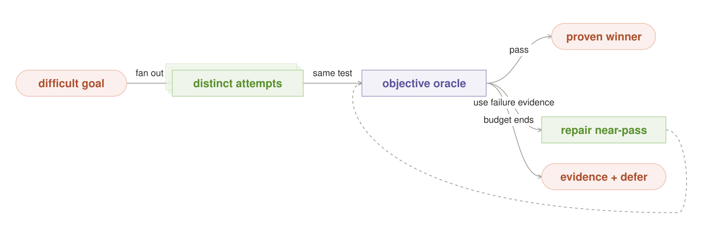
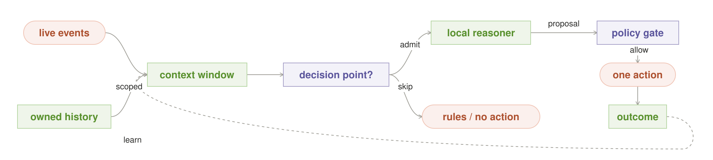
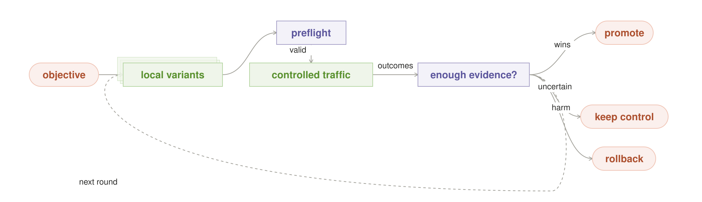
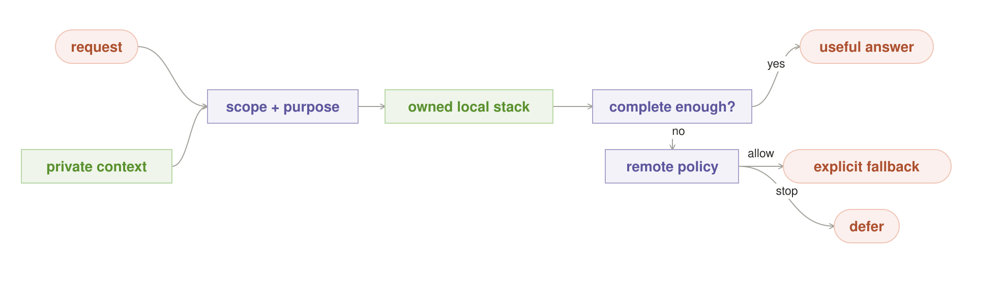

# Flagship local-AI compositions

> These capability recipes now sit beneath the canonical pattern language,
> [Building Effective Local AI Agents: Design
> Patterns](../local_ai_agent_patterns/README.md). This page remains the
> composition-focused reference.

Individual patterns name reusable moves. Compositions turn those moves into
capabilities a user can see: search until evidence proves a result, reason over
fresh private context, improve a live system from measured outcomes, or keep a
complete useful path running without a network.

These compositions are the shortest way to demonstrate why owning inference
changes an architecture. They are not four new primitive patterns. Each one
settles the catalog's boundary, consequence, logical, physical, act, and
learning contracts by combining existing entries. The composition is honest
only while the contracts of all its members remain intact.

| Composition | Owned advantage | Visible promise |
|---|---|---|
| [**Verified Search Engine**](#verified-search-engine) | unmetered but bounded attempts | try many ways and return one proven result |
| [**Live Decision Loop**](#live-decision-loop) | frequent inference beside fresh private data | turn a meaningful live event into one bounded next action |
| [**Measured Optimization Loop**](#measured-optimization-loop) | continuous candidate generation and evaluation | propose broadly; promote only what outcomes prove |
| [**Private Offline Copilot**](#private-offline-copilot) | owned models, tools, data, memory, and identity | remain private and useful when the network disappears |

## The composition contract

Every composition resolves six questions in order:

1. **Boundary.** Which data, models, tools, logs, and fallbacks may cross which
   owned boundary?
2. **Consequence.** What evidence is required before a result may be used, and
   which non-answer is acceptable?
3. **Logical recipe.** Which patterns search, check, route, divide, retrieve, or
   learn?
4. **Physical plan.** Which exact builds, seats, memory, deadline, and energy
   can run that recipe now?
5. **Act authority.** Which one selected result, if any, may touch the world?
6. **Learning authority.** Which independently measured outcomes may change
   the next route, candidate, or policy?

Later contracts cannot repair an earlier violation. More attempts do not make
an illegal data crossing safe; an impressive conversion estimate does not
authorize a page change; a warm model does not make stale context current.

## Verified Search Engine

**Promise.** Do not require one model attempt to be right. Generate genuinely
different approaches on owned capacity, judge every candidate with the same
objective oracle, repair a near-pass when failure evidence is useful, and
release exactly one passing result—or the evidence that none passed.



### Why local changes the operating point

The topology is portable, but a metered call makes every additional attempt
another purchase and may consume a provider allowance. On an owned runtime,
attempt N consumes finite seat-time, memory bandwidth, energy, and wall-clock,
but it does not create an Nth API invoice. Search width can therefore follow
the value of a correct result, the measured quality curve, current capacity,
and the deadline.

### Pattern stack

| Responsibility | Pattern |
|---|---|
| Set the evidence floor and allowed non-answer | [Risk Ladder](README.md#risk-ladder) |
| Generate multiple approaches | [Brute Force](README.md#brute-force) |
| Reject copied strategies before spending on them | [Diversity Gate](README.md#diversity-gate) |
| Turn concrete failure evidence into bounded repair | [Check and Retry](README.md#check-and-retry) |
| Bind desired width to actual seats and memory | [Fit the Box](README.md#fit-the-box) |
| Release one world-touching result | [Agent-layer Act Gate](../agent_orchestration_patterns/README.md#1-the-act-gate--only-one-worker-may-act) |

### Contract and invariants

- Every attempt receives the same goal and oracle, but a distinct approach id,
  seed, decomposition, model lineage, or evidence path.
- The selector is independent of candidate confidence and model popularity.
- A deterministic test, simulator, constraint checker, or externally measured
  score outranks agreement among candidates.
- Attempt count, repair depth, deadline, and physical budget are fixed or
  bounded before the run.
- Failed attempts remain read-only. At most one passing artifact may cross the
  act gate.
- If no candidate passes, return test evidence and defer; never relabel the
  least-bad candidate as verified.

### Mechanics

1. Classify consequence and register the oracle, resource budget, and safe
   exit.
2. Ask for several meaningfully different approaches. Diversity Gate removes
   duplicates before they occupy scarce seats.
3. Fit the Box schedules the admitted fan concurrently or in waves without
   pretending serial attempts are parallel.
4. Run the same oracle over every candidate. A first passing candidate may end
   the run when the policy permits early exit.
5. If nothing passes, optionally send the best near-pass and its concrete
   failure evidence through a bounded Check and Retry loop.
6. Release one passing artifact, or return the evidence and stop.

### Demonstration

Give a local coding model a task whose first attempt fails hidden tests. Fan
out eight approaches, show every test result live, repair one near-pass, and
return the first implementation that clears the complete suite. Display:

- attempts admitted, rejected as duplicates, executed, and cancelled;
- first-attempt pass rate versus final pass rate;
- time to first passing result and total wall-clock;
- tokens, seat-seconds, joules, and peak memory;
- equivalent metered calls, without claiming local electricity or hardware is
  free; and
- the exact tests that authorize the winner.

### Evidence required

Measure pass@1 against pass@N and verified-pass@N on the same held-out task
pack. The composition earns its complexity only if the quality gain survives
the extra latency, energy, queue delay, and correlated-failure rate.

## Live Decision Loop

**Promise.** Convert a fresh, purpose-scoped view of operational context into
one policy-approved action while the decision is still useful, then attach the
measured outcome to the decision that produced it.



### Why local changes the operating point

Per-event API metering encourages sparse calls and stale batch summaries. An
owned runtime can serve a high-frequency decision loop beside the order,
product, support, or device data it needs. The advantages are amortized
capacity at sustained utilization, lower network jitter, and a boundary in
which raw history need not leave the operator's infrastructure.

Local does not make one million users free or make an LLM the right consumer
for every raw event. A stream processor should maintain compact features; the
reasoner should run only at declared decision points where a new decision can
still change an outcome.

### Pattern stack

| Responsibility | Pattern |
|---|---|
| Keep raw history at its owner | [Data Stays Put](README.md#data-stays-put) |
| Retrieve only context authorized for this purpose | [Private Memory](README.md#private-memory) |
| Use the smallest adequate warm route | [Best Fit](README.md#best-fit) |
| Spend more only when uncertainty and value justify it | [Adaptive Effort](README.md#adaptive-effort) |
| Reuse a verified decision while its context remains valid | [Answer Cache](README.md#answer-cache) |
| Enforce every model, tool, log, and action crossing | [Privacy Boundary](README.md#privacy-boundary) |
| Learn only from attributable outcomes | [Routing Memory](README.md#routing-memory) |
| Shed a failing request class or route | [Circuit Breaker](README.md#circuit-breaker) |

### Contract and invariants

- Raw events become a versioned context snapshot with an event-time cutoff,
  purpose, subject, feature revision, and freshness limit.
- A trigger admits inference only when a decision is timely, actionable, and
  inside the current capacity budget.
- The model chooses from a typed, policy-approved action vocabulary; prose is
  not permission to invent a new action.
- Rules, a valid cache entry, a smaller model, or no action are first-class
  degradation paths.
- Every released action has one decision id, policy revision, context cutoff,
  model contract, and act-gate record.
- Learning uses delayed outcomes attributable to that decision. Confidence,
  clicks without exposure records, and ungraded model prose do not update the
  route.

### Capacity model

Size the system from admitted decision points rather than daily users alone:

```text
average decisions/s = DAU × admitted decisions per user per day ÷ 86,400
average tokens/s    = average decisions/s × admitted tokens per decision
planned tokens/s    = average tokens/s × measured peak factor × headroom
```

For an illustrative one-million-DAU product with four admitted decisions per
user per day, the average is about 46 decisions per second. At 600 admitted
input-plus-output tokens per decision, that is about 27,800 tokens per second
before peak and headroom factors. This is a workload description, not a claim
that one machine can serve it. Fit the Box must bind it to measured throughput,
queueing, memory, and failure domains on the actual fleet.

### Mechanics

1. Stream processing maintains compact, timestamped facts from order history,
   product usage, the live session, and policy state.
2. A trigger recognizes a meaningful decision point—for example checkout
   friction, a failed workflow, or a support escalation—not every click.
3. Best Fit selects the smallest adequate admitted model. Adaptive Effort may
   escalate boundedly when the decision is uncertain and valuable.
4. The reasoner returns one typed proposal such as `offer_help`,
   `recommend_compatible_item`, `request_human_review`, or `no_action`.
5. Privacy Boundary and the agent-layer Act Gate validate fields, frequency,
   consent, consequence, and destination before one action occurs.
6. The outcome ledger later joins exposure, action, conversion, cancellation,
   return, complaint, or other registered signals to the decision id.

### Honest degradation

When the queue, model, data, or policy is unavailable, use a declared smaller
route, a still-valid cached decision, deterministic rules, or no action. Never
silently use stale customer state, cross to a remote model with undisclosed raw
history, or increase action frequency to compensate for uncertainty.

### Demonstration

Replay a realistic event stream for many customers. For one selected session,
show the context cutoff, the reason inference was admitted, the minimum history
retrieved, the typed action, the policy decision, and the later outcome. Then
increase load until the system visibly degrades to rules or no action while
preserving latency and privacy limits.

### Evidence required

Compare against the current rules or batch baseline on decision quality, p50
and p99 latency, throughput, queue drops, outcome lift, calibration, no-action
rate, policy denials, data egress, cost per admitted decision, and guardrail
metrics such as refunds, complaints, and long-term retention.

## Measured Optimization Loop

**Promise.** Use abundant local inference to propose many bounded changes,
expose valid candidates through a controlled experiment, and promote only a
winner established by registered outcomes.



### Why local changes the operating point

Continuous candidate generation, critique, rendering, accessibility review,
and experiment analysis can make API metering dominate the improvement loop.
Owned inference makes it practical to search during idle capacity and keep
proprietary brand, product, traffic, and outcome data inside the operator's
boundary. The scarce resources become traffic, time, statistical power,
engineering attention, and the risk of exposing a bad candidate—not just
tokens.

### Pattern stack

| Responsibility | Pattern |
|---|---|
| Generate genuinely different candidates | [Brute Force](README.md#brute-force) |
| Repair schema, render, policy, or accessibility failures | [Check and Retry](README.md#check-and-retry) |
| Keep untrusted candidates observation-only | [Shadow Model](README.md#shadow-model) |
| Scale traffic and evidence with consequence | [Risk Ladder](README.md#risk-ladder) |
| Generate and preflight future rounds in idle time | [Night Shift](README.md#night-shift) |
| Remember verified strategy outcomes by segment | [Routing Memory](README.md#routing-memory) |
| Stop harmful variants and probe recovery | [Circuit Breaker](README.md#circuit-breaker) |

### Contract and invariants

- The LLM proposes candidates; it never grades its own business impact or
  promotes a candidate.
- The primary outcome, guardrails, attribution window, traffic policy, and
  evidence rule are registered before reading results.
- Assignment preserves a valid control and records exposure. A variant cannot
  learn from users who never saw it.
- Candidates are constrained artifacts: approved copy fields, asset ids,
  layout tokens, or feature flags—not arbitrary production writes.
- Brand, legal, security, rendering, performance, and accessibility checks run
  before live exposure.
- One promotion gate applies the registered evidence rule. Guardrail failure
  trips rollback even when the primary metric rises.
- Every round is reproducible from candidate digest, prompt and model contract,
  policy revision, traffic assignment, metrics, and decision record.

### Mechanics

1. Register a primary metric close to the real objective. `add_to_cart` alone
   is usually weaker than completed contribution margin or retained revenue.
2. Register guardrails such as page latency, accessibility, cancellation,
   return rate, complaints, inventory pressure, and segment-level harm.
3. Brute Force generates diverse copy, asset, layout, or offer candidates
   inside an allowed schema. Check and Retry uses concrete preflight failures
   to repair them.
4. The experiment service—not the LLM—assigns eligible traffic under the
   registered A/B, multivariate, bandit, or sequential design.
5. The evidence gate promotes one candidate, retains the control when evidence
   is weak, or rolls back immediately when a hard guardrail fails.
6. Routing Memory records verified outcomes by candidate strategy and context;
   the next local generation round may use that evidence without copying a
   noisy winner blindly.

### Why this is not unrestricted hill climbing

A short-term increase can be noise, novelty, selection bias, or movement in a
proxy that damages the real objective. Repeated peeking also inflates false
discoveries. The loop therefore needs a defensible experiment design,
predeclared stopping rule, stable holdout, correction for repeated looks where
required, segment checks, and immutable rollback state. The optimizer may
climb only inside the policy and guardrail envelope.

### Demonstration

Give the local generator a product page and an allowed edit schema. Generate
several headline, supporting-copy, image-id, and call-to-action combinations.
Reject invalid or inaccessible candidates before exposure, simulate or replay
controlled traffic, and show the experiment authority—not the model—retain,
promote, or roll back. A live demonstration should make the control group and
guardrails as visible as the winning conversion metric.

### Evidence required

Measure candidate throughput, preflight rejection and repair rates, time to a
valid experiment, traffic consumed per conclusive result, false-positive rate,
primary lift, guardrail changes, rollback latency, long-term holdout behavior,
and human review load. Compare against the existing experimentation process,
not against doing nothing.

## Private Offline Copilot

**Promise.** Keep the entire useful dependency closure—models, retrieval,
memory, tools, policy, identity, logs, and state—inside an owned boundary so the
assistant remains private and useful when the network or vendor account is
absent.



### Why local changes the operating point

Privacy is not merely sending a prompt to a provider that promises retention
controls, and offline is not merely caching a chat page. The dependency path
must remain owned end to end. Local inference makes it possible to keep raw
personal or organizational context beside its source, pin the exact model and
runtime, and preserve continuity without a provider service, account, quota,
or network hop.

### Pattern stack

| Responsibility | Pattern |
|---|---|
| Retrieve purpose-scoped personal or project context | [Private Memory](README.md#private-memory) |
| Execute beside raw data and release the minimum result | [Data Stays Put](README.md#data-stays-put) |
| Compile and enforce every allowed crossing | [Privacy Boundary](README.md#privacy-boundary) |
| Resolve exact weights, tokenizer, template, adapter, and runtime | [Pinned Model](README.md#pinned-model) |
| Prove the complete path fits the available machine | [Fit the Box](README.md#fit-the-box) |
| Preserve the disconnected dependency closure | [Offline Island](README.md#offline-island) |
| Make a remote fallback an explicit policy exception | [Local Cascade](README.md#local-cascade) |

### Contract and invariants

- The offline manifest names every required model, tool, index, policy,
  credential, key, schema, and state transition with exact versions or
  digests.
- Retrieval is authenticated, purpose-scoped, minimal, source-attributed,
  freshness-bounded, and deletable.
- Logs, crash reports, model helpers, telemetry, backups, and update checks are
  part of the boundary audit; a hidden network dependency breaks the claim.
- A remote fallback is absent or field-gated by explicit policy. Reconnection
  alone never grants permission to disclose queued private context.
- Offline actions use durable ids, an outbox where needed, and conflict rules
  so reconnecting cannot duplicate or silently reorder side effects.
- Missing or stale dependencies produce a disclosed degraded answer, defer, or
  refusal—not a concealed remote call.

### Mechanics

1. Resolve the request's identity, purpose, data classes, and allowed sinks.
2. Retrieve the minimum private slice at the node that owns it.
3. Resolve exact local model and tool contracts and verify that the current
   device can load the complete useful path.
4. Execute with network-deny enforcement, local logs, durable state, and one
   act gate.
5. If the local result is insufficient, Local Cascade consults a field-level
   policy. It may use a redacted remote branch only when both policy and
   connectivity allow it; otherwise it defers.
6. On reconnection, reconcile only declared outbox records and update bundles.
   Never upload raw history merely because a network became available.

### Demonstration

Load a private knowledge assistant with local files and purpose-scoped memory,
then physically disconnect the network. Ask it to retrieve a source, reason
over it, run an approved local tool, and persist a result. Display the network
deny log and dependency manifest. Follow with a request whose required source
is missing and show an honest defer rather than invented context or hidden
egress.

### Evidence required

Run cold-boot and network-cut tests over the complete workflow. Measure useful
task completion, startup and p99 latency, dependency misses, stale-answer rate,
egress attempts, scope violations, deletion propagation, recovery after power
loss, outbox conflicts, and behavior after reconnection. A packet capture and
fault-injection suite should support the privacy and continuity claims.

## From showcase to measured pattern

These compositions are working reference architectures, not claims that Grid
already implements every contract. A composition should be promoted only
after a measured implementation demonstrates:

1. a baseline without the composition;
2. the local operating point and its real hardware, energy, latency, and labor
   cost;
3. an objective quality or outcome improvement;
4. safe behavior under overload, disconnection, stale data, failed models, and
   invalid candidates;
5. boundary and act-gate enforcement; and
6. enough repeated use to show that the collaboration recurs beyond one demo.

The catalog remains the vocabulary. These compositions are examples of the
larger systems that vocabulary can generate.

The four SVGs are reproducible with:

```text
python3 docs/model_orchestration_patterns/build_composition_diagrams.py
```
