# Portable orchestration research catalog — model layer

> **Research archive.** These twenty-seven entries are portable orchestration
> topologies, pooling rules, and transferred control ideas. They are retained
> for design provenance, not presented as the small set of patterns unique to
> owning local models and hardware. Start with the local-only
> [`README.md`](README.md).

A catalog of ways to route and combine local inference. Built for **Grid**
([github.com/autonomous-ai/autonomous-grid](https://github.com/autonomous-ai/autonomous-grid)),
the local router where the economics that make remote routers an *assignment
problem* stop holding: local inference has no marginal API token bill, but it
consumes finite seat-time, memory bandwidth, electricity, and wall-clock.

This is the **model-layer** half of the catalog — the shape of routing and
combining *local inference*: how many samples a request deserves and how the
samples are pooled into an answer. It pairs with
[`agent_orchestration_patterns/README.md`](../agent_orchestration_patterns/README.md),
the **agent-layer** half — orchestrating *harness
frameworks as workers* (act-gates, session lifecycles, harness routing, and a
single fsync'd ledger): sessions that hold context and credentials, tool calls
that touch the world, and the rule that only one worker may act. The two
layers differ in what is scarce. Here the router allocates finite model
compute; in the agent doc the scarce thing is the *seat*—one resident,
VRAM-backed model plus harness runtime that a request or agent occupies.

The companion documents (`ROUTER.md`, `router-execution.md`) live in the
sibling research doc at
`autonomous-org/projects/grid-orchestration/` and are cited here for
provenance. The agent-layer half is published at
[`agent_orchestration_patterns/`](../agent_orchestration_patterns/README.md)
and opens the layer above this one. Treat the bare names in the text as
pointers to that role, not to files in this catalog.

This is the "redesign the router" document. `ROUTER.md` analyzes the current
naive router; this file is the design space it should grow into — the execution
topologies, pooling rules, controllers, state policies, and runtime guards that
a local router composes into an orchestration plan.

**A word on the examples.** Every `On the Grid stack` block is an
*illustrative* concrete build, not a shipped configuration. Real model names
(`qwen38-27b-mtp`, `glm-5.2`) and hardware sizes ("24 GB NVIDIA") are
placeholders for "whatever is resident on your box" — they keep the pattern
honest by making the economics concrete, but they are parameters, not a
billable stack. Treat them as worked examples of the shape, not as the shape
itself.

**Key terms for the outside reader.** *Grid* is a local-first, OpenAI-compatible
inference router: it exposes one endpoint and dispatches by model name to the
engines you choose. A *lane* is one of those engine routes (Hermes ACP,
Claude Code stream-json, Codex exec, an OpenClaw worker pool). An *advisor* is
the small ranker LLM that classifies each request and picks a shape. A *seat*
is defined above. *WAL* is the write-ahead log that backs the state ledger.
These recur throughout; where a term is loaded before it is defined here, the
definition lives in this block.

## Why local changes the architecture

A cloud API makes every extra sample a metered purchase. It may also put the
request behind account quotas, rate limits, network latency, a vendor outage,
or a daily/weekly allowance. A local model reverses that optimization: the
machine is already yours, so another token creates **no marginal token bill**
and asks no vendor for permission. The prompt can stay on the home network,
the weights and runtime can be pinned, and an agent can keep working every
second of the day without consuming an API allowance.

That freedom does **not** make compute infinite or literally free. The local
bill is paid in hardware, electricity, heat, memory bandwidth, wall-clock, and
wear. A home box has a fixed number of seats; models that do not co-reside must
swap through RAM/VRAM; a long fan delays the next live request. Privacy also
holds only while every advisor, verifier, tool, telemetry sink, and backup stays
inside the boundary the operator chose. The useful distinction is therefore
**unmetered tokens, physically bounded execution**.

| Constraint | Cloud API | Local AI at home | Architectural consequence |
|---|---|---|---|
| marginal inference | billed or allowance-metered | no per-token invoice | spend extra samples where error is expensive |
| limiting resource | vendor quota, price, network | seats, VRAM/RAM, heat, wall-clock | schedule from live capacity; admit and degrade under load |
| model lifecycle | vendor chooses availability and upgrades | operator pins weights, quantization, runtime | make residency, swaps, and model identity explicit state |
| privacy boundary | request leaves the machine | can remain on-device/LAN | never hide an external advisor, tool, or escalation call |
| idle time | belongs to the vendor | belongs to the operator | use preemptible slack for probes, canaries, learning, and cache warming |
| continuity | service and account must remain available | can run offline and 24/7 | persist sessions and policy state; recover from local crashes |

The harness follows from those economics. It is not a cloud router with the
price column deleted. It needs a live-seat inventory, a bounded task-graph
executor, cancellation and preemption, warm-session reuse, one tool-grounded
truth path, one append-only state ledger, and a legal `answer / refuse /
escalate` outcome. Redundant workers stay read-only; exactly one selected actor
may touch the world. Those are the shared primitives underneath the catalog,
and every pattern below either consumes them or must degrade honestly when the
box cannot provide them.

**Example roster, checked 2026-08-25.** The concrete names are current,
open-weight reference points rather than requirements:
[`Qwen3.8-27B`](https://huggingface.co/Qwen/Qwen3.8-27B),
[`Qwen3.6-35B-A3B`](https://huggingface.co/Qwen/Qwen3.6-35B-A3B),
[`DeepSeek-V4-Flash`](https://huggingface.co/deepseek-ai/DeepSeek-V4-Flash),
[`GLM-5.2`](https://huggingface.co/zai-org/GLM-5.2), and
[`Laguna-S-2.1`](https://huggingface.co/poolside/Laguna-S-2.1). Grid aliases
such as `qwen38-27b-mtp` name a local build or quantization of those weights;
they are not claims that every model fits every home machine.

Read the register before you draw or write. The figure style that the
diagrams in this catalog follow is written up in `docs/STYLE.md` and
`docs/DIAGRAMS.md`; the canonical standard that vendors them is
`autonomous-org/knowledge/diagram-style.md` (and its companion
`technical-writing-style.md`), which you may not have locally.

---

**How to read a pattern.** Every pattern below is documented under the same
skeleton, so the catalog can be scanned and then read deep. The headings are
fixed and mean the same thing in every pattern:

- **Intent** — the shape in one sentence, and what it buys.
- **Also Known As** — the other names the idea travels under, so you can find
  it by what you already call it.
- **Motivation** — the concrete pressure that makes the pattern worth having;
  the failure it answers.
- **Applicability** — the crisp “use it when / avoid it when” test, so you
  can apply the pattern without first reading the whole entry.
- **Structure** — the diagram and the parts it names.
- **Mechanics** — how the parts collaborate: who decides, who waits, what
  crosses which edge.
- **Consequences** — what the pattern costs and what it forgives.
- **Known Uses** — real systems and techniques that already run this shape, so the abstraction is anchored, not invented.
- **Failure mode** — the specific way this pattern goes wrong, and the honest
  version of its promise.
- **Refinements** — how to build it: the concrete rules that keep the promise
  honest (present where the pattern has implementation guidance to separate).
- **Sample Code** — a short, runnable-in-spirit sketch of the shape, so the
  mechanism isn't left to prose (illustrative, not the shipped stack).
- **On the Grid stack** — one concrete local build, to keep the economics
  honest. **Related Patterns** ends each entry and points at the same family.

Read the **one-sentence table** first to choose a shape, then a pattern's
**Intent** to confirm, then its **Failure mode** before you build it — the
liability is where a pattern is actually decided. The patterns are numbered
and cross-reference each other by `#number`; read the primitives (#1–#5)
before their compositions, and treat the framing below as the map.

**How to read the figures.** Every figure uses one fixed visual language, so
any diagram is readable at a glance — where a request enters, where compute
happens, where a decision is made, and which edges loop back.

- **Coral pills** are the request's entry (`job`) and its exit (`answer`) —
  the two points where the pattern touches the outside world.
- **Green boxes** are *work*: a worker, a probe, a step — a unit that burns
  compute to produce something.
- **Purple boxes** are *decisions*: the rank, the vote, the gate, the
  aggregate, the posterior draw — where the shape is decided, not executed. A
  green box never decides; a purple box never does the work.
- **Arrows** run forward along the answer. A **dashed** arrow is a return
  path — a revise, retry, re-command, or decay — the edge that makes a
  pattern stateful.

The same four roles and two edge types appear in all twenty-seven figures;
`docs/DIAGRAMS.md` is the formal register, and this block is the field guide.

## The one sentence per pattern

| # | Pattern | The move | Use it when |
|---|---------|----------|-------------|
| 1 | **Mate-in-One** | pick the best-fit model for the job | you know the answer is cheap and single |
| 2 | **Fan-Out** | run N models on one prompt, keep the consensus | there is spare local compute and the answer is worth checking |
| 3 | **Master / Slave** | a planner splits the job, specialists each do a part | the job is many jobs wearing one coat |
| 4 | **Adversarial** | two careful reads, a judge on the disagreement | the answer is costly to get wrong |
| 5 | **Strategy** | compile compatible patterns into one typed plan | the request needs more than one policy stage |
| 6 | **Brute-Force** | try several search paths, keep the best verified result | coverage beats planning and success is cheap to check |
| 7 | **Ensemble** | same prompt, keep the average not a winner | the answer is numeric and noise-averaging helps |
| 8 | **Verifier Gate** | one draft, a check, retry on fail | cheap to check, costly to get wrong |
| 9 | **Debate** | two reads that loop until they agree | a single adversary isn't enough |
| 10 | **Pipeline** | each step consumes the last one's output | the job has a natural order of operations |
| 11 | **Negative Selection** | force the population *diverse*, then vote | agreement hides a shared blind spot |
| 12 | **Markowitz Ensemble** | weight the average by measured correlation | averaging correlated errors bakes in bias |
| 13 | **PID Confidence Loop** | set the sample spend from measured confidence error | one request-class keeps silently failing |
| 14 | **Pheromone Router** | learn pattern weights from verified wins, decay the rest | you don't know which pattern wins this class yet |
| 15 | **Byzantine Adjudicator** | classify the disagreement: noise or systematic, then dose | disagreement clusters, it doesn't scatter |
| 16 | **Straggler Backup** | duplicate only the overdue worker | one node on the tail is blocking you |
| 17 | **Materialized Answer** | cache the verified answer by a semantic key | the same expensive answer keeps recurring |
| 18 | **Canary Trust-Equity** | a new member shadows traffic, earns its vote | you're admitting a model you don't trust yet |
| 19 | **CVaR Budgeting** | size the spend by the worst tail, not the mean | a rare request is hard *and* costly to get wrong |
| 20 | **Circuit Breaker + Bulkhead** | trip fast on a failing member, serve degraded | a toxic node or class is eating the budget |
| 21 | **Delphi Consensus** | anonymous numeric rounds until the spread closes | the answer is a number that gates real spend |
| 22 | **Trial Sequential Analysis** | change learner policy only at registered evidence looks and boundaries | repeated peeking could promote a lucky challenger |
| 23 | **Evidence-Bar Ladder** | proof threshold scales with the cost of error | acting vs. omitting have very different costs |
| 24 | **Type-Revelation Screening** | probe a model's type in idle, before you trust it | you're allocating real work to models you don't know |
| 25 | **Condorcet Pairwise** | head-to-head beats plurality on a three-way split | N models split a request into 3+ camps |
| 26 | **Slack-Stealing Scheduler** | run background work only in preemptible GPU idle | learners/probes/shadow assume an idle executor that doesn't exist |
| 27 | **Thompson Posterior Router** | route by sampling a per-model posterior, not argmax | #14's greedy learner ratchets into a local optimum and never escapes |

The first is the baseline we already ship — naive remote-style routing. The
rest are portable possibilities whose feasible budgets and placement change
under local execution.

**Choosing patterns means compiling a plan, not picking one leaf.** The entries
are not twenty-seven mutually exclusive algorithms. A request becomes a small,
typed task graph assembled in this order:

1. admit or degrade under live capacity (#20, #26);
2. take a safe memory fast path when one exists (#17);
3. set the consequence and spend budgets (#13, #19, #23);
4. choose an execution topology (#1, #2, #3, #4, #6, #9, #10, with #16 as a
   latency wrapper);
5. choose and diversify the population (#11, #18, #24, #27);
6. choose a type-compatible pool (#7/#12 for numeric outputs, #25 for ranked
   candidate camps, ordinary voting only as a consistency signal); and
7. certify or refuse (#8, with #22 gating later learner changes rather than
   this request).

#5 compiles that graph. #14 and #27 learn some of its choices. #26 executes it.
A plan may use several patterns, and the compiler must reject incompatible
combinations rather than silently treating every entry as a leaf.

The following are **diagnostic questions**, not a first-match switch:

1. **Do you already know the one right model?** → #1. When the request is cheap
   to answer and its class is well-mapped, avoiding extra computation is
   the whole move. Everything that follows is what you trade this for when that
   confidence is missing.
2. **Is the answer worth checking, and does redundancy fit the budget?** → #2,
   then #7/#12 for
   a numeric answer (#12 when the pool's errors are *known* correlated). The
   vote is the cheapest insurance; distrust its agreement when you can't field
   genuinely different reads (#11).
3. **Is the request several requests with a named order?** → #10 pipeline; an
   *unfixed* order that needs a planner → #3.
4. **Is a wrong answer costly, and do two independent voices disagree?** → #4
   (one round) or #9 (loop until they close).
5. **Does the *same* expensive answer keep coming back?** → #17 (memorize it),
   or #14 when you don't yet know which *shape* wins the class.
6. **Is one request-class quietly failing?** → #13 (set spend from measured
   confidence error); one worker on the tail is blocking the group → #16.
7. **Is a node or class toxic?** → #20 (trip fast, quarantine); a rare request
   is hard *and* costly → #19; the proof bar turns on which error is worse
   → #23.
8. **Are you admitting a model you don't yet trust?** → #18 (shadow it on live
   traffic) or #24 (probe its type in idle); promoting a luck-streak winner
   → #22, and keep exploring losers → #27.
9. **Does the plan assume idle time that isn't there?** → #26 or equivalent
   isolation.

**Two answer-path levers, plus a control plane.** The answer-producing shapes
are usefully located by *how many samples* they run (1, N, or many) and *how
they pool them* (pick, vote, average, gate, loop, or handoff). That grid mainly
describes #1–#12, #15, #21, and #25. It does not honestly describe the whole
catalog. #13 and #19 control spend; #14, #18, #22, #24, and #27 manage learning
and trust; #17 is a stateful fast path; #20 is a guard; and #26 is execution
machinery. Those control-plane entries wrap or supply an answer graph rather
than competing to be its one selected leaf. The useful unit of design is
therefore the compiled plan: answer path plus guards, state, budgets, and safe
exits.

**The catalog, as one figure.** The map below lays out all twenty-seven
patterns arrayed *primitive → composition → stateful → epistemic → machinery*
— the same order the entries run — so the families the cross-references name
(the primitives #1–#5, their compositions #6–#10, the stateful #11–#21, the
epistemic #22–#25, the machinery #26–#27) are visible in one look before any
single pattern is read.

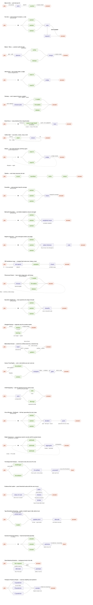

---

## 1. Mate-in-One — pick the best fit

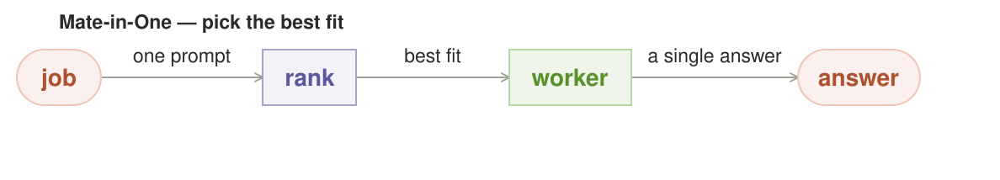

**Intent.** Decide which single model best fits a job, then run it once. This
is the current Grid router verbatim: a deterministic hard filter, an advisor
that ranks, and one winning worker. It is the baseline every other pattern is
measured against.

**Also Known As.** best-fit routing; single-model dispatch

**Motivation.** Routing is an assignment problem in the remote world because
every candidate costs money and seconds. When one model can do the job, the
optimal move is to avoid unnecessary extra computation. That logic stays true
locally — it is just no longer the *only* true answer.

**Applicability.** You know the answer is cheap and single, and the
request's class is well-mapped—avoiding unnecessary extra computation is the
whole move. Avoid it when the classification is genuinely uncertain or
untested: a confident-wrong SIMPLE call ships silently with no second read,
and there is no fallback in the loop.

**Structure.** A coral terminal where the request enters, a purple `rank`
that holds the decision, one green worker, a coral terminal where the answer
leaves.

**Mechanics.** The ranker answers a classification question — *is this
SIMPLE or DEMANDING?* — and maps it to the smallest adequate model or the
most capable one. It sees model facts and price, never queue depth or live
throughput, which a later pattern (#5) exploits: the ranker picks by
*capacity to do the job*, not by *who is free right now*.

**Consequences.** Cheapest answer in latency and tokens. But it is a single
point of failure on the ranker's judgment — one wrong `SIMPLE` call and the
whole answer is wrong, silently. There is no second read.

**Known Uses.** Route each request to exactly one model you already trust, with a monotonic fallback. Every model-serving layer ships this as its default path (a single model-id with a retry), and 'pick one by a cheap cost model, else fall back' is the shape of most production prompt-routers before they learn anything.

**Failure mode.** The ranker is confident and wrong. Familiar: a
classification that looks right in training data and fails on the tail.

**Sample Code.** *(A working sketch, not the shipped stack — every name is a parameter.)*
```python
def route_one(request, ranker):
    cls = ranker.classify(request, ("SIMPLE", "DEMANDING"))
    model = MATCH[cls]                # smallest adequate / most capable
    return run_once(model, request)   # one shot, no second read
```

**On the Grid stack.** A SIMPLE fact lookup lands on `qwen38-27b-mtp` (24GB NVIDIA) over the Hermes (ACP) lane: one run, one answer, no second read. The demand for a second read only appears when the request is DEMANDING — a hard code review where the advisor's SIMPLE/DEMANDING call decides whether a single run on the box is enough or the request should have been a fan-out (#2) or a verifier (#8). This is the baseline; every later pattern is measured against its one-shot, one-model bet. It is also the lane's honest floor: on a single-node box where the resident roster is two or three models sharing one GPU, "pick the best fit and run once" is often the only shape that fits in VRAM at all.

---

**Related Patterns.** Fan-Out (#2), Verifier Gate (#8), Strategy (#5) — the baseline every other shape is measured against.

## 2. Fan-Out — same prompt, N answers, a vote

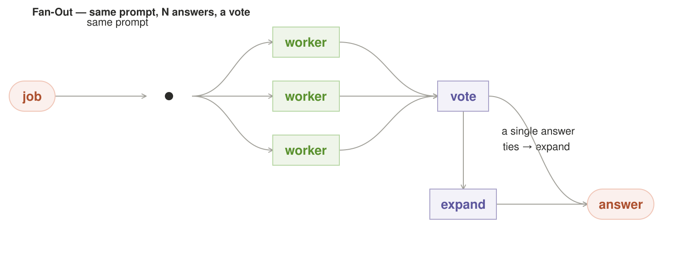

**Intent.** Run several independent models on the *same* prompt and keep the
one the majority agree on. This is best-of-N / self-consistency, made viable
by locally owned compute with no marginal API bill.

**Also Known As.** self-consistency voting; best-of-N vote

**Motivation.** Independent samples of a stochastic function disagree more where
the answer is genuinely hard, and agree on what is actually true. This is the
self-consistency result (Wang et al. 2022): majority over independent samples
beats greedy decoding, and the vote is more than a quorum — it is a confidence
signal. The one condition on the whole claim is *independent*: unanimity is
only evidence conditional on the samples being decorrelated, so "unanimous
cheap answers are trustworthy" is true only across genuinely different reads,
not across N runs of the same prior. Remote routers can't afford the
redundancy; a local router can, and it converts "is this answer trustworthy?"
from a guess into a measurement.

**Applicability.** Spare compute exists, the answer is worth checking, and
you can field genuinely different reads. Avoid it when you cannot — three
samples sharing one corpus tail agree happily wrong, and the vote certifies
internal agreement, not truth.

**Structure.** Terminal → a dot where the fan splits → three green workers
in a column → a purple `vote`. On a tie, a purple `expand` pulls a better
model in below, then the answer.

**Mechanics.** The workers are drawn as a *column of peers* — no leader, no
ordering, because ordering would imply the fan had a preference it doesn't
have. They run in parallel and return to a vote node that is strictly the
*decision* plane (purple). Ties are not a failure; they are the signal that
ignites the expand branch.

**Consequences.** The redundancy is the product — three answers where remote
would buy one. Cost is three answers' tokens you never paid for. The risk
is slow consensus: three models agreeing is great, three models each with a
plausible but different answer burns the win and falls to expand.

**Known Uses.** Self-consistency decoding: sample N completions of the same prompt and majority-vote the answer (Wang et al., 2022) — the canonical Fan-Out on the token level, and it is exactly how 'think harder' is spent in local math/code loops.

**Failure mode.** Unanimous-but-wrong. All three share the same blind spot
because they share the same tail of the web. The vote is a measurement of
*internal* agreement, and internal agreement is not the same as truth. This
is why #4 exists — and why #11 forces divergence by construction rather than
hoping for it.

**Refinements.** Three refinements make the vote a
stronger measurement without changing its shape. (1) **Quorum, not
full-call-for.** You don't need all N to agree to ship — wait for the first
⌊N/2⌋+1 matching answers and return early. This makes the cheap path cheaper
(3 answers agree fast) and keeps the hard path honest (a 2-of-3 near-split is
already the signal to spend more, not a tie you wait for). (2) **Early-return
on the fan-out join.** The three "parallel" workers on one GPU are contended,
so treat the first two matching answers as *sufficient*, not *necessary* —
stop the remaining workers and cancel them together. (3) **Vote on a
decorrelated population.** A vote is only evidence if the samples are
independent; same model + same prompt + same temperature re-samples one
distribution, so a "vote" of N same-model draws is N-fold rounding of one
judgment, not N judgments. Make the rule concrete: **a different model family
per lane — where the training tails actually differ.** That is the one
decorrelation the local stack can really do — same model at different
temperature or framing is still one prior with a different wiggle, and with a
single GPU and one strong model, N samples are N draws of that same prior; say
so directly instead of pretending it's a real vote. The family caveat carries
the reminder that even #7 and #9 state outright: two sibling quantizations of
one lineage (`qwen38-27b-mtp` vs `qwen36-35b-a3b-mtp`) share a training tail and
are still correlated, so "different family" has to mean *different where it
matters*, not merely a different build. When only one decorrelated family is
resident, the honest move is to downgrade the confidence claim (#2 → #1), not
to dress one prior in N hats.

**Sample Code.** *(A working sketch, not the shipped stack — every name is a parameter.)*
```python
def fan_out(request, models):
    reads = [m.read(request) for m in models]         # N independent samples
    quorum = first_agreeing(reads, need=len(models)//2 + 1)
    if quorum is not None:
        return quorum                 # the majority agrees
    return expand(reads)              # a better model joins on a tie
```

**On the Grid stack.** A ticket-classification request fans the same prompt to three workers over the OpenClaw lane — `qwen38-27b-mtp` and `qwen36-35b-a3b-mtp` on one node, `glm-5.2` (a cross-vendor counterweight) on another — then votes. The honest reading of this example is not "three voices agree" but **2-of-3 is a shared-family quorum that can pass on the Qwen tail**: the two Qwen workers share a training tail, so their agreement is evidence only *conditional on* `glm-5.2`'s genuine cross-vendor independence. Had all three been same-family, the "unanimity" would be fake — three runs of the same prior passing on the same blind spot, which the evaluator should treat as a *stronger* form of the single-read risk, not a weaker one, since the fan certifies rather than breaks it. The example exposes that the vote is a measurement of *internal* agreement, not of truth.

---

**Related Patterns.** Brute-Force (#6) is the same spend as a *selection* rather than a vote; Ensemble (#7) averages instead; Adversarial (#4) distrusts agreement.

## 3. Master / Slave — a planner splits the job

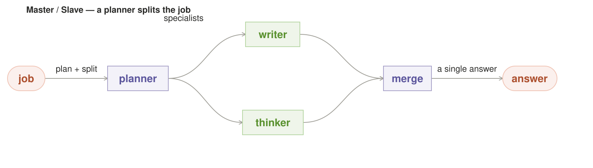

**Intent.** A planner decomposes the job, each piece goes to the specialist
built for it, and the results come back together. This is Anthropic's
orchestrator–worker, applied to a single request instead of a multi-day
research project.

**Also Known As.** planner/specialist decomposition; the split-and-merge

**Motivation.** Some jobs are heterogeneous — *write it* and *check it* and
*retrieve the fact* are different skills and no one model is best at all of
them. A planner buys the divide-and-conquer win: you stop running one
generalist on everything and let each specialist do its own one thing.

**Applicability.** The job is many jobs wearing one coat, with a clean,
nameable split between parts. Avoid it when the seam is arbitrary — a
miscut plan makes the merge reconcile parts never meant to join, and plan
quality is the whole bet.

**Structure.** Terminal → purple `planner` (label: *plan + split*) → two
green specialist lanes (*specialists*: writer, thinker) → purple `merge` →
terminal.

**Mechanics.** The planner is a decision node (purple), and the specialists
are work (green) — the diagram's whole colour argument. The planner does not
*do* the work; it *allocates* it. The merge is a separate decision from the
plan, because combining is a real skill too (the same reason a synthesis
pass is a distinct step). One honesty note that owns the whole pattern's
local truth: **on a single GPU, the fan is queued, not parallel.** Three
specialist lanes on a 1-seat box are three sequential calls once the planner
is done — genuinely parallel broadcast is a multi-seat / multi-node claim.
The local planner is a mastered chain, and that is fine: the win it buys is
not wall-clock parallelism but *fit* — each piece goes to the model built
for it — and a serialized lane that routes well beats a parallel lane that
runs the wrong generalist.

**Consequences.** The big win of the set for genuinely composite jobs — each
specialist is simpler, and simple specialists are more reliable. The cost is
the planner's own judgment: a bad split is worse than no split, because you
pay the planner, the wrong specialists, *and* a merge that has to stitch
mismatched parts.

**Known Uses.** Plan-then-execute and decompose agents: a master LLM writes a plan, slave workers execute each step, results flow back. This is the spine of plan-and-execute / ReAct-style hierarchical agents and most tool-orchestration frameworks.

**Failure mode.** The planner miscuts the seam and the merge has to reconcile
parts that were never meant to go together. Plan quality is the whole bet.

**Sample Code.** *(A working sketch, not the shipped stack — every name is a parameter.)*
```python
def split_and_merge(request, planner, specialists):
    plan = planner.plan_and_split(request)              # purple: allocate
    pieces = [specialists[s].run(p) for s, p in plan]   # green: the work
    return planner.merge(pieces)                        # purple: combine
```

**On the Grid stack.** A multi-file refactor: `qwen36-35b-a3b-mtp` (the strongest local reasoning model on the box) plans the change over the Claude Code (stream-json) lane, then the OpenClaw lane fans the sub-tasks to per-file workers — `qwen38-27b-mtp` for mechanical edits, `qwen3-coder` for boilerplate — and a merge stitches the parts. The bet is the seam cut: if the planner miscuts, the merge reconciles parts that were never meant to go together. On a one-GPU box the planner and the specialists contend for the same seat — a three-way fan is really three queued calls plus the plan — so the honest form of the pattern is a mastered chain, not a genuinely parallel broadcast.

---

**Related Patterns.** Pipeline (#10) is the mastered chain's sequential cousin; Strategy (#5) can select it per request.

## 4. Adversarial — two careful reads, a judge

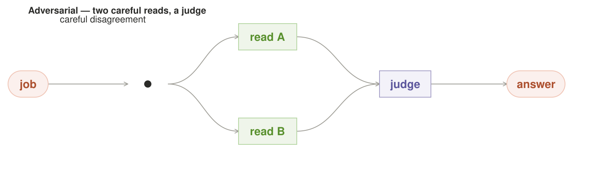

**Intent.** Two independent careful reads of the same job, and a judge who
settles where they disagree. This is multi-agent debate / the dissent gate,
run as a routing pattern.

**Also Known As.** multi-agent debate; the dissent gate; red-team routing

**Motivation.** The costliest failures in the whole system are the quiet ones —
the confident wrongness of #1 and the unanimous wrongness of #2. Adversarial
is the correction: instead of voting for agreement, you *train a
disagreement* and let disagreement force the system to look again. It is the
only pattern whose whole point is surfacing what the others hide.

**Applicability.** A wrong answer is costly and two independent careful
reads can genuinely disagree. Avoid it when both reads share the same
prompt and frame — disagreement that never surfaces is inherited by the
judge, and adversarial thwarts slips, not shared bias.

**Structure.** Terminal → dot → two green reads (`read A`, `read B`,
distinct lanes, label *careful disagreement*) → purple `judge` → terminal.

**Mechanics.** The two reads are peers, explicitly *not* told to agree — the
label "careful disagreement" is the instruction. The judge is the only
decision node and it sits at the end, where it can weigh a genuine
disagreement rather than rubber-stamp a consensus. The shape mirrors
`knowledge/guardrails.md` and `playbooks/red-team.md`: a single synthesizer
curates its own evidence, so an adversary is the fix.

**Consequences.** The surest hedge against quiet wrongness, but it never runs
the "easy" path — it spends two reads on every job, even the trivial ones.
That is the pattern's own misfit: #4 is wasted on a simple lookup.

**Known Uses.** Generator-versus-checker: the GAN's discriminator and today's 'judge LLM' both stand a separate model against the produced answer so a second pair of eyes (and a different inductive bias) audits the first. Socratic/calibration techniques use the same two-voice shape.

**Failure mode.** Both reads share the false frame and the judge inherits it
— disagreement that never happens because the two readers were given the same
prompt the same way. Adversarial thwarts *slips*, not *shared blind spots*.

**Refinements.** Two gates keep the pattern honest:
(1) **Divergence is a setup property, not an instruction.** "Careful
disagreement" told to two same-family models is two runs of the same prior.
Induce the disagreement — give read B a devil's-advocate / counter-reading
prompt, split the context differently, use a different family — or the pattern
silently degrades into #1 with a middleman. (2) **The judge needs an
escalate / abstain exit with a concrete trigger.** A judge that can't abstain
is a judge that rules on vibes because a ruling is the only available output
— so name the decision rule, not just the right to use it: abstain when the
two reads cite *incompatible groundings* (both firm, contradict each other),
or when judged confidence is below a stated floor, or when the reads agree on
the answer but disagree on why. On trigger, hand up — to a tool-grounded
check, a bigger model, or the human — instead of forcing a ruling. Prefer the
tool-grounded check over a bigger same-family judge: it is the one output
that breaks the shared prior for free (the judge shares the reads' family and
therefore their blind spot).

**Sample Code.** *(A working sketch, not the shipped stack — every name is a parameter.)*
```python
def adversarial(request, read_a, read_b, judge):
    a, b = read_a(request), read_b(request)
    if a == b:
        return a                      # the two reads agree
    verdict = judge(a, b)             # purple: decide
    if verdict is ABSTAIN:            # a judge needs an escalate/abstain exit
        return hand_up(request)       # tool check, bigger model, or human
    return verdict
```

**On the Grid stack.** A contract-clause interpretation gets two adversarial reads — `qwen36-35b-a3b-mtp` and the cross-vendor `glm-5.2` on separate nodes — and a third lane judges. The judge is not a bigger same-family model (it would share the reads' blind spot): the honest judge here is **Hermes (ACP)** running a tool-grounded check — it re-reads the cited clause with a deterministic extraction against the contract text rather than ruling from vibes. Two same-family reads would be two runs of the same prior, so the divergence is a setup property (here, across vendor), not an instruction. When even the tool check can't decide (both reads cite incompatible groundings), the judge abstains and hands up to the human on the Grid Enterprise lane — the abstain exit is the part of #4 that usually collapses into #1, so the example tests it.

---

**Related Patterns.** Debate (#9) is the looped form of the two reads; Verifier Gate (#8) is the single-read cost floor; Negative Selection (#11) attacks the shared blind spot.

## 5. Strategy — compile a compatible orchestration plan

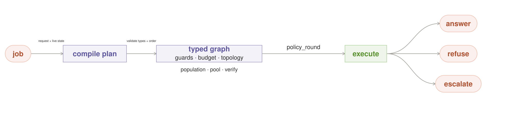

**Intent.** Compile each request into a validated orchestration plan: a
composable policy graph containing the topology, population, pooling,
verification, state, and runtime guards the request needs. Strategy chooses a
compatible set and order of patterns; it does not choose exactly one of them.

**Also Known As.** the meta-pattern; plan selection

**Motivation.** No single pattern wins on every request, and many catalog
entries are not answer shapes at all. A consequential local job might need a
breaker, a tail-risk budget, a diverse fan, a deterministic verifier, and a
one-actor commit gate. The `auto` name in Grid's ADR 0013 already gestures at
this, but today's router chooses among models, not among composed policies.

**Applicability.** The request mix is varied enough that no single pattern
wins on every request, and you can price the cost of picking wrong. Avoid
it when the cost heuristic itself is untrustworthy — a request that looks
cheap but is a trap gets routed to a single model that misses it.

**Structure.** Coral request → purple `compile plan` → a typed task graph
(`guards → budget → topology → diversify → pool → verify`) → coral
`answer / refuse / escalate`. Optional nodes are omitted; incompatible nodes
fail validation before work starts.

**Mechanics.** The compiler reads request consequence, output type, deadline,
live residency/capacity, and trusted state, then emits an immutable plan stamped
with `policy_round`. The schema names `guards`, `budget`, `topology`,
`population`, `pool`, `verify`, `state`, and `runtime`. Validation enforces
invariants: #12 accepts numeric estimates, #25 requires complete ranked
candidate rows, a side-effecting graph has one act-gate, and #26 may schedule
only work whose cancellation bound is known. The fixed-concurrency task-graph
executor runs the plan.

**Consequences.** One `auto` endpoint can express a rich policy without hiding
its spend or safety contracts. The price is a real compiler and schema: every
new stage needs type rules, ordering constraints, versioning, and an explicit
degrade path. An invalid or uncertain plan must fall back to the shipped
Mate-in-One baseline or refuse; it must not improvise an unvalidated graph.

**Known Uses.** GoF Strategy encapsulates interchangeable algorithms behind one
interface. Here each swappable policy stage is a strategy and the orchestration
plan composes those stages. The other catalog entries are not all Strategy:
caches, breakers, schedulers, controllers, and aggregators are collaborators in
the compiled graph.

**Failure mode.** A well-typed but badly estimated plan: a trap looks cheap,
the compiler emits a single read, and every downstream invariant still passes.
Schema validation prevents incompatible machinery; it cannot supply an honest
difficulty or consequence estimate. That estimate needs calibration, audit,
and a conservative uncertainty path.

**Sample Code.** *(A working sketch, not the shipped stack — every name is a parameter.)*
```python
def auto(request, inventory, state):
    plan = compile_plan(
        request=request,
        inventory=inventory,
        state=state,
        stages=(guards, budget, topology, population, pool, verify),
    )
    validate(plan, output_type=request.output_type,
             side_effects=request.side_effects)
    return task_graph_executor.run(plan, request)
```

**On the Grid stack.** For a consequential repository migration, the compiler
emits `#20 breaker/admission guard → #19 tail-risk budget → #2 fan-out → #11
forced divergence → #8 tool verifier → one act-gate`. It binds only resident
models that fit the deadline and records the graph plus `policy_round` in the
usage envelope. A cheap-looking trap can still be underestimated, but the plan
is inspectable and replayable instead of being hidden behind the word `auto`.

---

**Related Patterns.** Pheromone Router (#14) and Thompson Router (#27) learn
stage choices; Slack-Stealing Scheduler (#26) executes eligible work; every
other entry can supply or constrain a plan stage.

## 6. Brute-Force — many approaches, keep the best


**Intent.** Spend a fixed budget on several independent, read-only approaches
to the same goal, then keep the best result that passes an objective check.
This is generate-and-test made literal: search broadly, verify cheaply, commit
once.

**Also Known As.** best-of-N selection; randomized restarts; generate-and-test

**Motivation.** Some problems are easier to recognize than to construct: a
test can identify a valid patch, a solver can check a witness, a schema can
accept an artifact, but no planner knows which search path will reach it. Local
inference makes breadth affordable. Give attempts different seeds, search
orders, decompositions, or heuristics; let an objective gate reject them; stop
when the budget or success condition binds. If each attempt has independent
success probability *p*, N attempts find at least one success with probability
`1 - (1 - p)^N`. Correlated attempts earn less, which is why "N copies of one
prompt" is the degenerate form, not the design target.

**Applicability.** Use it when the solution space is broad, success is cheap
to check, and several plausible approaches can search independently. Avoid it
when quality is subjective or no external evaluator exists: "best" then means
"most persuasive to another model," and N samples only amplify that bias.

**Structure.** Terminal → fan → three visible green attempts (`direct`,
`decompose`, `search`) → purple `test + select` → terminal. Three is only the
diagram's readable stand-in for N. The fan communicates independent search;
the single purple join communicates one deterministic decision and one result.

**Mechanics.** Every attempt receives the same goal and acceptance contract but
a distinct search policy. Attempts do not coordinate, see one another's drafts,
or act on the world. A fixed-concurrency executor runs at most the free-seat
budget and may stop early once a result clears a sufficient score. `test +
select` must be deterministic or externally grounded (tests passed, constraints
satisfied, measured score), never an LLM asked which prose feels best. If
several attempts pass, use a predeclared tie-break such as fewest failing tests,
smallest valid patch, lowest latency, then stable submission order.

**Consequences.** The orchestration is simple and embarrassingly parallel, and
its success probability can rise quickly when attempts fail independently. It
is also sample-hungry, and diversity has a price: more prompts, seeds, or model
families to maintain. It cannot repair a blind evaluator; optimizing N
candidates against the wrong test produces a better test-gamer. On one GPU the
fan is serialized, so the operator spends wall-clock instead of money.

**Known Uses.** Best-of-N test-time sampling, randomized-restart search,
fuzzing, property-based generation, and "generate patches until the tests pass"
all use the same shape: vary the search path, apply one objective oracle, retain
one winner.

**Failure mode.** Apparent breadth is correlated repetition, or the evaluator
rewards the wrong property. The first wastes N runs on one blind spot; the
second selects the most effective exploit of that blind spot.

**Refinements.** Three rules turn search breadth into bounded coverage.

1. **Vary the search, not the acceptance contract.** Seeds, decompositions, and
   heuristics may differ; the success test stays identical across attempts.
2. **Measure realized diversity.** Log approach ids and output fingerprints; if
   the pool collapses to clones, either inject a new approach or stop paying for
   pretend breadth. #11 formalizes the stronger version that hard-filters
   duplicates before pooling.
3. **Only one worker may act.** N attempts are safe only as read-only sandboxes.
   The selected result crosses a separate, idempotent commit gate exactly once.

**Sample Code.** *(A working sketch, not the shipped stack — every name is a parameter.)*
```python
def brute_force(request, approaches, executor, check, tie_break):
    attempts = executor.map(                         # fixed concurrency; read-only sandboxes
        lambda approach: run(request, approach, read_only=True),
        approaches,
    )
    scored = [(attempt, check(attempt)) for attempt in attempts]
    passing = [(attempt, score) for attempt, score in scored if score.passed]
    if not passing:
        return refuse("no approach passed", attempts=len(attempts))
    winner = tie_break(passing)                      # objective score, then stable rule
    return commit_once(winner, key=request.round_id) # one actor after N simulations
```

**On the Grid stack.** A failing concurrency test gets six read-only patch
attempts: `Qwen3.8-27B` tries the smallest lock-order change and a decomposition
by call path, `DeepSeek-V4-Flash` tries a counterexample-first search, and three
seeded restarts explore other minimal diffs. The same test suite and patch-size
tie-break judge all six. On a one-seat home box they run serially; on a grid
they fill only free seats. Five losers never touch the working tree. The one
passing patch crosses the `round_id` commit gate once. The local advantage is
not magical parallelism—it is six serious attempts with no six-call API bill or
daily allowance consumed.

---

**Related Patterns.** Fan-Out (#2) votes while Brute-Force selects; Verifier
Gate (#8) supplies the objective check; Negative Selection (#11) rejects
correlated attempts when approach labels alone do not create real diversity.

## 7. Ensemble — same prompt, keep the average

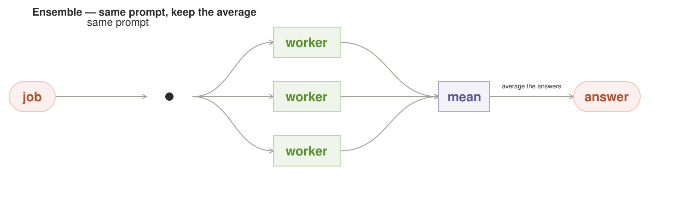

**Intent.** Run N answers and keep the *average*, not a winner. Where #2
*votes* and #6 *selects*, this *averages* — the anti-cleverness pooling rule.

**Also Known As.** numerical averaging; the arithmetic mean

**Motivation.** Some answers are noisy numbers: a forecast, a score, a
coordinate. For those, no single sample is reliable, and no vote is the
right reduction either — the average of many independent noisy samples is
provably more stable than any one of them, and the stability grows with N.
That is not the CLT; it is elementary: for independent samples
Var(mean) = σ²/N, so the mean shrinks noise as N grows. The CLT only earns its
keep when you want a confidence *interval* on the estimate — a different
question. The independence is the whole load-bearing word, and it is exactly
what a correlated Qwen family violates (see the On-the-Grid example). But the
statistic to lead with is the **median or trimmed-mean, not the arithmetic
mean**: averaging assumes all error is symmetric noise, and a single outlier
(NaN, a hallucinated huge number) drags an arithmetic mean the way it cannot
drag a median. Voting discards the distribution; a robust average keeps it.

**Applicability.** The answer is numeric and noise-averaging helps — a
forecast, a score, a coordinate where independent samples average down.
Avoid it when the errors are correlated: averaging bakes in the bias,
giving beautiful dials and the wrong needle (→ #12 instead).

**Structure.** Terminal → dot → three green workers (`same prompt`) → purple
`mean` (`average the answers`) → terminal.

**Mechanics.** The workers are peers in a column, per the fan rule. The
decision plane is one node but its act is arithmetic, not judgment — that is
the deliberate contrast with the judge in #4. The mean does not "decide"
which answer is better; it *combines* them.

**Consequences.** The best variance-reduction play in the catalog for numeric
answers. The costs: it only applies where averaging is a sensible reduction
(a number, a probability, a vector — not a piece of prose), and it inherits
the shared-bias problem — if every sample is biased the same way, the mean
is confidently wrong with small variance (the classic underestimation trap).

**Known Uses.** Averaging across ensemble members: ensemble distillation and weight/response averaging across checkpoints (and across differently initialized models) is Ensemble at the top of the stack.

**Failure mode.** Averaging bakes in the bias. Low variance is *not* the same
as accuracy — an ensemble of correlated erring answers has beautiful dials
and the wrong needle.

**Refinements.** Two more fixes repair the naive mean
beyond the robust statistic in the Motive: (1) **Never let the mean terminate
the pipeline.** Report dispersion alongside the mean and escalate on high
dispersion — a tight cluster with a shared prior is the trap, not good news.
(2) **Report the spread, don't hide it.** Mean ± the sample distribution (or
the N samples on request) — a mean without its variance looks more certain
than it is. #12 attacks the same bias from the pool side: weight by *measured*
correlation.

**Sample Code.** *(A working sketch, not the shipped stack — every name is a parameter.)*
```python
def ensemble(request, workers, trim=0.2):
    samples = [w(request) for w in workers]        # same prompt, N lanes
    est = trimmed_mean(samples, trim)               # robust, not arithmetic: one outlier can't drag
    spread = stdev(samples)
    if spread > ESCALATE_AT:                        # a tight shared prior is a trap, not good news
        return escalate(request, samples)
    return est, spread                              # the average with its dispersion, never mean alone
```

**On the Grid stack.** A numeric forecast request runs the same prompt on `qwen38-27b-mtp`, `qwen36-35b-a3b-mtp`, and `glm-5.2` over three lanes and averages. The example's point: if the three are correlated (two share the Qwen training tail), the ensemble has low variance and the wrong needle — averaging bakes in the shared bias. #12's covariance fix answers exactly this. The honest caveat rides on the report: a mean without its dispersion looks more certain than it is, and one garbage sample (a hallucinated huge number) drags a plain mean — which is why a median or trimmed-mean with outlier rejection is the defensible pooling rule here, not the arithmetic mean.

---

**Related Patterns.** Markowitz Ensemble (#12) fixes #7's central failure; Fan-Out (#2) is the categorical cousin.

## 8. Verifier Gate — one draft, a check, retry on fail

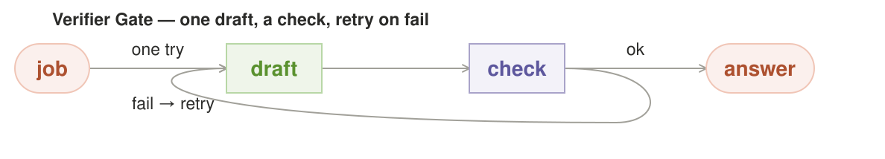

**Intent.** Run one draft, *verify* it, and let a failing check loop the work
back for another try. This is generator + verifier, and the loop is what
makes it local-native.

**Also Known As.** the verifier; the retry gate

**Motivation.** The cleanest split of *doing* from *checking*: generate freely,
then spend cheap, deterministic verification on the output. Its real power is
one local allows: you can afford to *retry on a failed check*, because a
failed check costs nothing extra. Remote routers retry sparingly (each retry
is paid); local can treat "the verifier said no" as a signal to loop, not a
rare emergency.

**Applicability.** Checking is far cheaper than getting it wrong — one
draft, a cheap deterministic check, retry on fail. Avoid it when the check
can't actually see the error: a rubber-stamping heuristic burns tokens
politely confirming the same wrong draft.

**Structure.** Terminal → green `draft` → purple `check` → terminal, plus a
**dashed elbow** that drops under both nodes and comes back into the draft —
*fail → retry*.

**Mechanics.** Two things make the dashed loop honest: it is dashed
("delegated / conditional / loop" in the register) and it re-enters the
*draft*, not the terminal — a failed check rework is a fresh generation, not
an answer. The verifier is purple (it decides: ok or not), but its decision
is cheap and repeatable, so the loop can fire many times — bounded by K
retries, then escalate; it must *not* read as "fire forever on a wrong draft"
(see the eval-pass cap).

**Consequences.** Turns a single unreliable generation into a bounded retry
loop — the per-attempt *get it wrong* probability decays geometrically with
tries only if retries are independent. The failure is when you can't check
cheaply (a free-text answer with no rubric) or the retry isn't independent
(the model repeats its own mistake). So the verifier needs a **measurable
bar**, not a vibe: it must actually *have* a false-accept error it can be
measured against (a tool check that passes on held-out bad drafts) or it is
not a check, it is a rubber stamp in a purple box. Design the verifier, not
the generator: a weak verifier means a confident "ok" on a wrong answer — the
quiet-fail case again.

**Known Uses.** LLM-as-a-judge / reward-model reranking: a separate verifier model scores one draft (rather than voting among many) and gates release — the reward-model reranker in RLHF is Verifier Gate under a different name.

**Failure mode.** The verifier rubber-stamps. Everything rides on the check
being a real check — if it's a cheap heuristic that can't see the error, the
loop burns tokens politely confirming the same wrong draft.

**Refinements.** Three hardenings make the strongest
pattern in the catalog actually safe to ride on: (1) **The verifier must be
independent of the generator.** A verifier that reads the draft plus the
same prompt shares the draft's flaw and rubber-stamps (the named failure,
left unfixed). Require a deterministic / rule-based check, a different family,
or — best, since Grid has tools — a **tool-grounded check** (a code runnner, a
calculator, a schema validator, a lookup). Tool grounding is the one check
that breaks the shared prior for free. (2) **Bound the loop and escalate on
exhaustion.** The "retry is free" claim holds only if retries are independent
— same model re-prompted the same way repeats its own mistake. Perturb prompt
or temperature across retries, cap K hard, and on a bounded-K miss escalate
to more compute or flag the human; never ship the last draft by default. (3)
**Make the check visible and attributable.** Report what was verified and by
what (schema, linter, tool call), so a confident-wrong answer can be traced
to a weak check.

**Sample Code.** *(A working sketch, not the shipped stack — every name is a parameter.)*
```python
def verifier_gate(request, draft, check, k=3):
    for attempt in range(1, k + 1):
        d = draft(request, attempt)                 # perturb across retries: independence
        if check(d):                                # deterministic / tool-grounded, not a vibe
            return d, {"verified_by": check.name}   # attributable: what, and by what
    return escalate(request)                        # K exhausted: hand up, never ship the last draft
```

**On the Grid stack.** A code edit drafts on `qwen38-27b-mtp`, then the verifier checks the output against the config schema via a Codex (`exec --json`) tool call — a deterministic check, not a second model reading the draft. Tool grounding is the one check that breaks the shared prior for free: the verifier does not share the generator's training tail the way a model-as-verifier would. The example names what was verified and by what (schema, linter, tool), so a confident-wrong answer that slips past a shallow check can be traced back to the weak check, and the check can be raised.

---

**Related Patterns.** Adversarial (#4) and Debate (#9) are heavier checks; Brute-Force (#6) needs #8 to make `best` deterministic.

## 9. Debate — two reads that loop until they agree

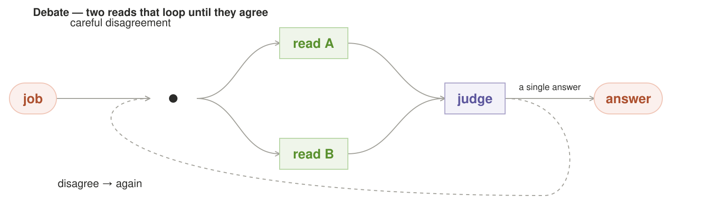

**Intent.** Like #4, two careful reads and a judge — but disagreement loops
the reads back for another round, instead of the judge ruling immediately.
This is multi-agent debate with rounds, and it's the natural extension of
the single-round adversarial in #4.

**Also Known As.** the rebuttal loop; adversarial debate

**Motivation.** #4's single judge has a ceiling: a genuine disagreement surfaces
once and is settled by whoever's framing was more convincing. A fiction that
a *second* read (of the other's objection) would have broken. Rounds buy
convergence — the reads keep sharpening each other until they either agree or
the judge rules on a position that has actually been stress-tested.

**Applicability.** A single adversary isn't enough and a second read of the
objection would have brokered the disagreement. Avoid it when both reads
share the same primed wrongness — K rounds of agreement then certify that
shared error as fake convergence.

**Structure.** Terminal → dot → two green reads (`careful disagreement`) →
purple `judge` → terminal, plus a dashed elbow from the judge back into
`read A` — *disagree → again*.

**Mechanics.** The generous read: the loop *terminates* on either agreement
(two reads converge → no judge needed) *or* K rounds exhausting. The honest
part is the second clause: **exhaustion does not mean a ruling.** The judge
carries #4's abstain exit into the loop — on non-convergence after K rounds it
must abstain and hand up (tool check, bigger model, human), never force a pick
to end the loop. The dashed elbow reads as conditional exactly because it is —
it only fires on disagreement; a loop that "converges" on round 1 off the same
prime is not convergence, it is the named failure firing at K=1, which is why
"genuinely converged" needs a definition: per-round delta below a threshold
for M consecutive rounds, not "they stopped talking." And the delta must be
measured **against a reference the reads don't share, not only against each
other** — with shared-prior reads, a stable read-vs-read delta is the shared
blind spot firing as "agreement" (the exact trap #7 warns low variance ≠
accuracy about), so convergence should be confirmed against a tool check or
ground-truth lookup where one exists, not certified by two correlated voices
going quiet together. As K grows, more compute is spent but the probability of
a wrong ruling falls; the bound keeps an open loop from becoming an open debate.

**Consequences.** The strongest *consensus-forcing* pattern — it turns a single
adversarial pass into a self-correcting one. Costs: it is the most
sample-hungry (K rounds × 2 reads + judgment), and it can *entrench* a shared
blind spot rather than break it if the two reads are the same model with the
same prompt — the loop then converges fast and confidently on the group's
shared error (the "everyone agrees because everyone was primed the same"
failure, worse than #4's single quiet slip).

**Known Uses.** Multi-agent debate (Du et al., 2023) and Socratic variants: two or more models argue through a problem until agreement, which both cross-checks and re-derives the reasoning.

**Failure mode.** Fake convergence — agreement that is really both reads
sharing the same primed wrongness, now certified by K rounds of agreement.

**Refinements.** Consensus-forcing is only worth it if
the consensus is real, and it isn't when the reads are the same family with
the same prime. One gate fixes it: **require hard divergence before the loop
is trusted.** The two reads must be different families or robustly different
framings — otherwise the loop is ceremony that certifies the shared error. If
the reads pre-converge on round 1 after priming, that's a red flag to
escalate, not a pass. (The cap-K and judge-abstain mechanics live in Mechanics
above — exhaustion is an escalator, never a forced ruling.)

**Sample Code.** *(A working sketch, not the shipped stack — every name is a parameter.)*
```python
def debate(request, read_a, read_b, judge, k=3):
    a, b = read_a(request), read_b(request)         # different families: hard divergence
    for r in range(k):
        if small_delta(a, b, streak=2) and confirmed(a, b):
            return a                                # converged against a reference, not "went quiet"
        a, b = read_a(b), read_b(a)                 # each reads the other's objection
    verdict = judge(a, b)
    if verdict is ABSTAIN:
        return hand_up(request)                     # K exhausted: abstain, never force a pick
    return verdict
```

**On the Grid stack.** Two reads of `qwen36-35b-a3b-mtp` and `qwen38-27b-mtp` loop until they agree on a borderline design call. Same-family reads converge fast — so this pattern only earns its loop if the reads are forced apart (two families, or a devil's-advocate framing on one side); otherwise "agreement" is both priming errors certified over K rounds, which is worse than #4's single quiet slip. The example logs per-round deltas: a prompt convergence is a success, and an oscillation that never converges is a signal to stop and hand the call to a non-debate arbiter — a tool check, a bigger model, or the human.

---

**Related Patterns.** Adversarial (#4) is the single-pass form; Verifier Gate (#8) is the cheaper check.

## 10. Pipeline — each step consumes the last

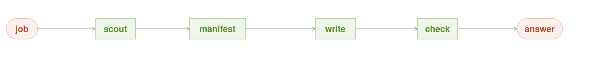

**Intent.** A *sequence* of specialist steps, each consuming the previous
one's output — scout → write → check → answer. This is #3's planner without
the planner: the order is implicit in the job, so no decomposition step is
needed.

**Also Known As.** the handoff; sequential stages

**Motivation.** Some jobs have a natural order of operations — you can't write
before you know what you're writing about, and you shouldn't check before
you write. For those, a fixed pipeline is *simpler than a planner*: no master
to get the seam wrong, just a chain where each link is a well-scoped
specialist. First-principles-before-analogy: don't add a planner to a job
whose shape is already a sequence.

**Applicability.** The job has a natural order of operations — you can't
write before you know the subject, you can't check before you write — and a
fixed sequence is simpler than a planner. Avoid it when an error can't be
contained at each seam: one small error serializes and compounds through
every later step.

**Structure.** Terminal → `scout` → `write` → `check` (all green, one lane)
→ terminal. Caption on the arrows: *each step consumes the last*. The
eval-pass contract check is a real node, not a caption: the manifest is a
small green diamond between steps (a deterministic non-judgment gate), so
the figure and the mechanics agree about where the chain can break.

**Mechanics.** The three nodes are peers *in a line* — the line itself is
the plan. Nothing is purple because nothing decides: the ordering is fixed,
and each step is pure work on the previous output. Deliberate contrast with
#3, where a purple planner has to invent the order.

**Consequences.** Dead simple, and every step is testable in isolation because
each consumes a well-defined artifact. But the chain is only as good as its
weakest link, and *errors are not caught* — nothing loops back (that's #8's
job; this pattern deliberately has no gate). A bad `scout` poisons the whole
pipeline and it ships anyway.

**Known Uses.** Chained LLM calls: topic→draft→summarize and tool pipelines where each step consumes the last output. MapReduce summarization and most 'agent workflows' that string discrete transforms are Pipeline, including the single-threaded local case this catalog warns about.

**Failure mode.** Silent compounding — a small error at the front is
serialized and magnified through every later step, with no check to break
the chain.

**Refinements.** The
original "no gate" was the worst robustness posture in the catalog: a job
with a *natural order* is exactly the job guaranteed to compound an upstream
error into the answer with zero interruption. The fix costs almost nothing
and doesn't invite #8's full LLM loop: (1) **Add cheap deterministic
interface contracts between steps** — schema, type, non-empty, required
artifact present. A contract is a typed manifest (fields, types, null-rules)
checked after each step — spec the manifest, not the sentiment — and one check
after `scout` before `write` would stop a poisoned scout from contaminating
the write, for near-zero cost and no judgment node. The pattern should say "no
*LLM* verifier," not "no check at all." (2) **Abort on fail.** A bad step must
halt the pipeline (and optionally restart or escalate — a FAIL → retry-once →
escalate exit), not feed a poisoned artifact forward — silent compounding is
only possible because the chain had no abort. (3) **Keep the
original request in every step's context.** Once `scout` compresses the
brief, later steps have no way to check their work against provenance; carry
the original request (or a guarded summary) through so any step or later
review can ground back.

**Sample Code.** *(A working sketch, not the shipped stack — every name is a parameter.)*
```python
def pipeline(request, steps, contract):
    out = request                                    # carry the original brief forward
    for step in steps:                               # fixed order: the line is the plan
        out = step(out, original=request)            # each step consumes the last
        if not contract.ok(out):                     # cheap deterministic manifest, not an LLM judge
            return abort(request, out)               # halt and escalate; never feed poison forward
    return out
```

**On the Grid stack.** A document pipeline — extract, summarize, translate, format — chains `qwen38-27b-mtp` steps through the Hermes lane, each consuming the last. The example shows a small extraction error at the front being serialized and magnified through every later step, and it demands a verifier somewhere in the chain (#8) to break the compounding before the wrong transcript ships onward. The original "no gate" posture is the worst robustness choice in the catalog: a natural-order job is exactly the one guaranteed to compound an upstream error, and a cheap deterministic interface contract after `extract` (non-empty, schema-shaped) costs almost nothing and does not invite #8's full LLM loop.

---

**Related Patterns.** Master / Slave (#3) is the parallelized form; Straggler Backup (#16) covers a failing stage.

## 11. Negative Selection — force divergence before you judge

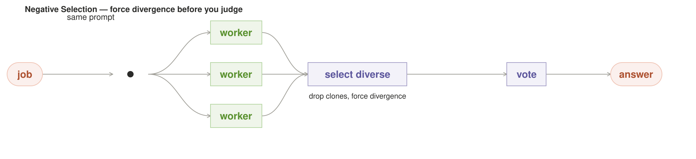

**Intent.** Run several models on the prompt, but *hard-filter the sample set
for dissimilarity before the vote* — the immune system training its
repertoire against self, applied to a fan-out.

**Also Known As.** forced divergence; diversity screening

**Motivation.** #2–#4 all sample then decide, and they all share the documented
blind spot: three models on the same corpus happily agree wrong. Agreement is
a consistency signal, not truth. Negative Selection is the only pattern that
selects the *input population* to be structurally divergent, so the
disagreement the judge sees is a real one — difference is checked
deterministically (embedding distance, sampling temperature, prompt-template
dissimilarity) before any probabilistic pooling.

**Applicability.** Agreement hides a shared blind spot — the model pool
shares a corpus prior and you need divergence before you judge. Avoid it
when the diversity metric is a proxy you don't trust: embeds far apart can
still both be wrong for correlated reasons.

**Structure.** Terminal → dot → three green workers (label: *same prompt*) →
purple `select diverse` (label: *drop clones, force divergence*) → purple
`vote` → terminal.

**Mechanics.** Diversity as a *setup property*, not a hope: each new
candidate's answer is measured against the emerging set, and any candidate
too close to the majority already returned is dropped — you want the surviving
pool guaranteed diverse, the way thymus screening guarantees a T-cell
repertoire that is blind to self. The selector is purple (it decides) but its
decision is a deterministic metric, not a judgment call. It can feed directly
off a #12-style correlation matrix. For workers that use tools, measure
diversity over the **evidence and tool-call lineage, not the prose** — two
answers can be embeds apart yet cite the same source and make the same leap;
what looks like divergence in the text is convergence in the reasoning path.
Screen on what they actually *consulted* and *did*, which is where a shared
blind spot actually lives.

**Consequences.** The direct answer to the catalog's loudest failure — it buys
divergence *by construction*, not by hoping for it. The cost is the extra
screening step and the fact that forcing difference can reject a genuinely
right-but-conventional answer: it trades some coverage for independence, which
is correct when shared bias is the bigger risk. Report `usage.arity` (workers
that *survived* the screen) alongside `usage.runs` (workers spawned) — a dropped
clone is a decision the caller should see, and the vote genuinely ran on fewer
than the fan-out launched. And if the surviving pool is under-populated, **abstain
rather than ship** an answer from a pool too small to call diverse: "could not form
a diverse set" is a legal refuse-exit, not a forced answer.

**Known Uses.** Forced-divergence prompt sets and adversarial diversity: prompting with deliberately different framing/role/persona so independent models don't converge on one shared blind spot — the LLM version of red-teaming and 'two hard votes' used in calibration work.

**Failure mode.** The diversity metric is a proxy, not the truth — two
answers far apart in embedding can still both be wrong for correlated reasons.
Diversity by construction reduces the shared prior; it does not remove it.

**Refinements.** Two reproducibility rules.

1. **Pin the divergence metric.** The screen is itself a model, not arithmetic:
   the embedding distance is a hidden dependency, so it belongs in the
   *metric-determinism* trust class. Name it to pin it — a fixed embedding
   model-file + quant + distance-threshold, resolved by the router like any
   pinned dependency, never a floating "some embedding, some drop rule."
2. **Carry the evidence lineage.** The tool-call-lineage screen has the same
   reproducibility problem one floor lower — the worker output contract must
   carry a structured evidence trace (`usage.evidence_lineage`) or the "screen
   on what they consulted" step has nothing to screen on.

**Sample Code.** *(A working sketch, not the shipped stack — every name is a parameter.)*
```python
def negative_selection(request, reads, judge):
    a = reads.A(request)                                  # the plain read
    b = reads.B(request, focus="what it would NOT say")   # divergence by construction
    if not diverge(a, b, metric=EMBEDDING_PINNED):        # screen is a pinned dependency, not arithmetic
        return hand_up(request)                           # same-family pair fails by construction
    return judge(a, b)                                    # judge only the forced-divergent pair
```

**On the Grid stack.** Before judging divergent answers, the router forces divergence by construction — asking a `qwen36-35b-a3b-mtp` worker and a `glm-5.2` worker each to state *what it would not say* — then judges on `qwen38-27b-mtp`. In a diverse-by-construction pool the two-family split is the point: a same-family pair fails the screen almost by definition. The example exposes that the model-distinguishability distance is a hidden dependency: the judge's reproducibility depends on the embedding being pinned, so the divergence metric must live in the metric-determinism trust class, not be treated as arithmetic.

---

**Related Patterns.** Fan-Out (#2) pools without forcing divergence; Markowitz (#12) and the Byzantine adjudicator (#15) read the same diversity.

## 12. Markowitz Ensemble — correlation-weighted, not just averaged

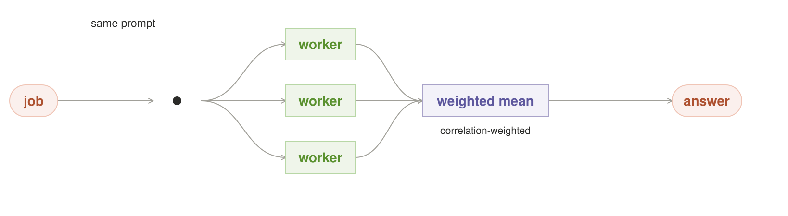

**Intent.** Instead of averaging whatever N models the router happened to pick
(#7), treat the ensemble as a *portfolio problem*: weight the members by their
measured error-correlation so the mean actually reduces variance.

**Also Known As.** correlation-weighted averaging; portfolio selection

**Motivation.** #7's documented failure is averaging correlated erring samples
into a confidently wrong mean — "beautiful dials, wrong needle." Averaging
only helps if the errors are independent *and* unbiased, and neither holds for
models that share training. Markowitz adds the ingredient #7 provably needs:
correlation structure as the selection lever.

**Applicability.** You are about to average correlated erring samples and
that would bake in bias. Avoid it when you can't measure the error
correlation honestly — the weights are only as good as the covariance you
feed them.

**Structure.** Terminal → dot → three green workers (label: *same prompt*) →
purple `weighted mean` (label: *correlation-weighted*) → terminal.

**Mechanics.** Maintain a crude cross-model error-correlation estimate from
past disagreement rates on shared request classes. Choose both the member set
and the *weights* that minimize the estimated variance of the mean — favor
negatively correlated pairs, downweight models that track each other's
errors. The pooling rule stays "mean"; only the composition becomes
optimized. The decision node is purple but its act is arithmetic over a
measured covariance matrix. Critically, the covariance must be computed over
**labeled outcomes, not raw disagreement** — two models disagreeing is a
consistency signal, not an error; two models agreeing-wrong together is the
correlation that matters. The correlation estimate is fed by the one
ground-truth authority (machinery), never by "did they say the same thing,"
or it bakes the shared prior back in as if it were error.

**Consequences.** Repairs #7's central flaw at the source — the pool is chosen by
covariance, not by warm-body count. The costs: it needs the outcome data to
estimate correlation (ask #13's error ledger / #14's pheromone table), and its
output is a weight vector — a pooling extension the pick/vote/average/
gate/loop menu had no slot for until now.

**Known Uses.** Correlation-aware ensembling: weighting ensemble members by their (measured) covariance so correlated echoes don't double-count — portfolio variance in finance, and weight-interpolation/merging methods that blend models with a covariance penalty.

**Failure mode.** Correlation estimates are only as good as the outcome
ledger that produced them. On a brand-new model family with no history, the
weights are noise — don't let a confident weight vector masquerade as a
measured one. Make that a header, not a footnote: gate on a minimum-observation
count per class, and until the ledger has enough samples present the blend as a
**plain average and say so** (`usage.weighting: unmeasured|measured`). And a
weighted mean has no single contributing answer — attribute the blend in the
envelope (`usage.output_blend: models=[a:.4,b:.3,c:.3], cov_matrix_hash`) so the
caller sees the returned value is a blend, not any one worker. Two more
buildability truths: the min-observation gate has to be a *number* (say
≥ 30 graded outcomes per class before a pair's weight is trusted), and behind
it sits the label-source question — a consumer box has no oracle, so the
"labeled outcomes" covariance depends on a human spot-review of a sample;
until that feed exists the weights never leave `unmeasured`, which is honest.
And if no negatively correlated pair exists (the realistic case for two
same-family local builds), the weight lever has no purchase and the pattern
*is* #7's average — say so, don't quietly degrade. One more premise correction
for a single box: the whole point is a cross-vendor pair (*same-family builds
rarely anti-correlate*), and that pair is a **VRAM swap, not a co-resident
fan** — glm-5.2 and the Qwen read don't share a GPU, so on a 1-seat box the
"correlated fan-out" is really two serialized reads whose second one pays a
swap on the critical path. The portfolio's variance win can be partly eaten by
the swap budget before any sample runs; on one GPU the pattern degrades toward
#7 plus swap cost, which the latency number has to include.

**Sample Code.** *(A working sketch, not the shipped stack — every name is a parameter.)*
```python
def markowitz(request, models, cov):
    if cov.observations(class_of(request)) < MIN_GRADED:
        return plain_average(request, models)             # unmeasured -> honest plain mean, say so
    weights = min_variance_weights(cov, models)           # over labeled outcomes, not raw disagreement
    return blend(models, weights, covariance=cov.sha())   # attrib the blend: caller sees it's a blend
```

**On the Grid stack.** A demand forecast is not averaged but correlation-weighted: two same-family models (`qwen38-27b-mtp`, `qwen36-35b-a3b-mtp`) contribute *less* than their count because they track each other's errors, while the cross-vendor `glm-5.2` earns a heavier weight for being negatively/noisily correlated. The covariance must be computed over **labeled outcomes, not raw disagreement** — two models agreeing-wrong together is the correlation that matters, and same-model disagreement is a consistency signal, not an error. The example exposes that the returned value is a blend with no single contributing answer — the envelope must carry `usage.output_blend` with the model weights and the covariance-matrix hash, so the caller knows what it actually got, and on a model with no history it must degrade to a plain average and say so (`usage.weighting: unmeasured`).

---

**Related Patterns.** Ensemble (#7) is the unweighted case; PID (#13) and Pheromone (#14) feed it the outcome ledger.

## 13. PID Confidence Loop — a budget that tracks error, history, and trend

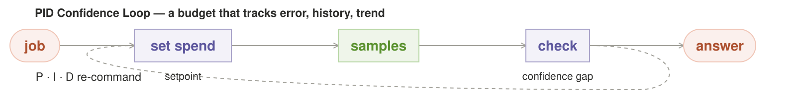

**Intent.** Replace #5's open-loop one-shot pattern-pick with a *closed control
loop* whose setpoint is "confidence ≥ threshold" and whose manipulated
variable is how many samples to spend. This is the router as a controller.

**Also Known As.** the confidence controller; closed-loop budgeting

**Motivation.** Every existing pattern fixes N once, up front. PID is the only one
that *re-commands N continuously from measurement* — it reacts to the current
confidence gap, remembers that a request-class keeps silently failing, and
notices when confidence is dropping across rounds before grinding to a
wasted K.

**Applicability.** One request-class keeps silently failing and you need
sample spend re-commanded from measured confidence error, not fixed up
front. Avoid it when the confidence proxy is ungrounded — a self-report or
rubber-stamp feeds the loop garbage it converges on confidently.

**Structure.** Terminal → purple `set spend` (label: *setpoint*) → green
`samples` → purple `check` (label: *confidence gap*) → terminal, with a dashed
elbow `P·I·D re-command` from check back into set spend.

**Mechanics.** Three terms, transposed from process control: **P** scales the
spend with the current confidence gap; **I** accumulates a per-request-class
error history so a class that keeps failing can never launch cheap again —
the "remember being consistently short" term; **D** reacts to the *rate of
change* of confidence, escalating or switching strategy when round-to-round
confidence is decaying instead of spending all K rounds down a losing
gradient. The setpoint makes "how sure must we be?" a first-class knob for
the first time.

**Consequences.** The most *grown-up* budget mechanism in the catalog — it turns
confidence from a hidden property of a chosen pattern into a measured,
controlled variable. The costs: it needs a grounded measurement from #8 or the
cross-cutting ground-truth authority, and its I and D terms require durable,
per-class verified-outcome history in the canonical class-state ledger. It is
a controller around an answer graph, not another answer topology.

**Known Uses.** Adaptive feedback control: a proportional-integral-derivative controller adjusting spend/step-size from an error signal is PID literally; policy-gradient and adaptive-sampling loops that tune their own budget respond the same way.

**Failure mode.** Garbage in the confidence-proxy. If the verifier or vote
that feeds "measured error" is itself rubber-stamping (#8's failure), the loop
confidently commands the wrong spend — a controller is only as good as its
sensor. And the confidence-proxy is the weak link for *agentic* workers: a
model asked "how confident are you?" returns a **self-report, not a live
measurement** — sometimes calibrated, usually not (a confident model is often
wrong). The loop converges on the sensor you feed it, so an ungrounded proxy
re-learns the number the model claims instead of the state the world is in.

**Refinements.** Five build rules keep the loop honest.

1. **Ground the P term.** What feeds P must be a tool outcome or a check that
   ran, never a solicited self-report — measure the confidence the world gives
   you, not the one the model claims.
2. **Pure-compute classes degrade to P = I = D = 0.** With no oracle to ground
   against (no tool, no server to toggle), the honest setting is zero terms
   plus time-boxing — a loop that refuses to command spend it cannot justify,
   not one that smuggles the same self-report back in through I and D.
3. **The I-term belongs in the ledger.** "Remember being consistently short"
   is a durable, crash-recoverable per-class counter; it cannot live in a RAM
   counter or the learner forgets its own failures across a restart. Persist it
   as an idempotent event in the same WAL-backed class-state ledger read by #14,
   #18, #22, and #27.
4. **Time-box, don't confidence-box.** A setpoint of "confidence ≥ threshold"
   is an unbounded wall-clock commitment, and the I-term raises spend on the
   class that keeps failing — so p95 explodes on exactly the failing requests.
   Contract "at most T ms / K samples, whichever first"; on expiry emit the
   *abandoned* confidence ("stopped at 0.82, not 0.95") rather than hang.
5. **Exhaustion escalates.** Never emit a forced pick below threshold; report
   the active setpoint and P/I/D terms in the usage blob so the caller
   understands why latency jumped.

**Sample Code.** *(A working sketch, not the shipped stack — every name is a parameter.)*
```python
def pid(request, klass, ledger, setpoint=0.95, wall_budget=5.0):
    state = ledger.load_pid_state(klass)                 # I, prior error, prior command
    confidence = None
    while elapsed() < wall_budget:                       # time-box, not confidence-box
        result = run_samples(request, count=bounded(state.command))
        confidence = grounded_measure(result)            # tool/check outcome, never self-report
        error = setpoint - confidence                    # positive means confidence is short
        state = update_pid(state, error=error)            # P gap, I history, D trend
        ledger.append_once(pid_event(request.id, klass, state, confidence))
        if error <= 0:
            return ok(result, confidence)
    return abandoned(result, confidence, setpoint)       # never force a below-target pick
```

**On the Grid stack.** `qwen38-27b-mtp`'s per-class spend is a PID: it raises
or lowers sample count from measurement rather than sitting on one setpoint.
The honest contract is time-boxed ("at most T ms, then emit the abandoned
confidence"), the P term is grounded, exhaustion escalates, and the active
setpoint plus P/I/D values ride in the usage blob.

---

**Related Patterns.** Strategy (#5) is its open-loop forebear; Pheromone (#14) supplies the history; Circuit Breaker (#20) is the brake on its I-term.

## 14. Pheromone Router — learn which shape wins, with decay

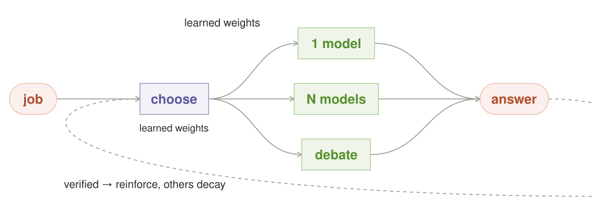

**Intent.** Make #5's strategy layer a *learning loop*: keep a per-request-class
weight over {pattern, model, prompt-template}, reinforce what verified, and
*decay* the rest. The strategy layer draws from a measured distribution instead
of a frozen classifier.

**Also Known As.** reinforcement router; decay-weighted learning

**Motivation.** #5 classifies the request once, by features, and stays frozen
until someone re-tunes it. #14 scores by measured *outcome* — what actually
verified — and, crucially, un-scores by decay, so when the request mix drifts
the router follows the live signal instead of entrenching on yesterday's
winning shape. No existing pattern has a learning term at all; this is the
first.

**Applicability.** You don't yet know which pattern wins a request-class,
and you can score verified outcomes with decay to track drift. Avoid it
when 'verified' is a rubber-stamp (#8's failure) — learning amplifies a
systematic error — or when determinism is non-negotiable and you can't
freeze the learned policy.

**Structure.** Terminal → purple `choose` (label: *learned weights*) → three
green leaves in a column (`1 model`, `N models`, `debate`) → terminal, with a
dashed elbow `verified → reinforce, others decay` from the answer terminal
back into choose.

**Mechanics.** On a verified outcome, append one idempotent outcome event and
atomically update the winning {pattern, model, template} weight in the canonical
class-state ledger. Apply decay from elapsed time or a recorded decay epoch,
not as a cache read-repair. The router samples the resulting policy
distribution. #13 may read the same outcome history; #17 is an answer cache,
and #16 is a straggler wrapper—neither is #14's memory substrate.

**Consequences.** Turns a static heuristic into an online learner that follows
drift — the difference between classify-and-freeze and learn-and-track. The
costs: it only learns from *verified* outcomes (garbage in, garbage out), and
decay tuning is a real knob — too slow and it never forgets, too fast and it
churns on noise.

**Known Uses.** Ant-colony optimization and decay-based learn-to-route: ants reinforce trails that decay, so stale winners stop being reinforced — the same shape as A/B testing with exponential time-decay favouritism in recommendation systems.

**Failure mode.** Verifier garbage poisons the weights. If "verified" is a
rubber-stamp (#8's failure), the router learns to reinforce the wrong shape
with great confidence — reinforcement amplifies a systematic error instead of
correcting it. And #14 is the catalog's single worst determinism breaker: a
seed pins stochastic sampling, not accumulated learned state, so the same
request at 9am and 9pm can route to a different pattern and same-request →
same-answer holds across no two requests. Its determinism is therefore a
**policy snapshot, not a seed**: replay key = `round_id + seed`, which requires
freezing/pinning the pheromone table for replay — report `usage.policy_round`
so a caller can correlate drift, and give the learned state a documented
lifecycle (per-tenant isolation, reset and freeze paths) instead of an
implicit forever. Decay also silently "forgets" a verified answer — that's
fine, but it must be observable, not invisible.

**The durability this pattern actually needs (buildability).** The pheromone
table is the catalog's most stateful store and it has to be *born durable, not
aspired to*: every request is an atomic read-modify-write (reinforce the winner
+ multiply the whole table by decay), so a crash mid-decay corrupts every
weight it touched. The honest mechanism is a single-writer durable store —
local SQLite with WAL gives the atomic RMW, the fsync/WAL crash recovery, and
the single-writer protocol in one primitive (same durability class as the
router-execution ledger, but it lives here as an explicit dependency, not an
implicit one). The table is frozen at round start for replay and the freeze is
snapshot-at-round-start, not "freeze vaguely." Freeze and decay share one
writer, and they fight if you let them: the decay multiplies the *whole table*
while the freeze needs the table stable, and a single-writer store can only do
one at a time. The resolution is a schedule, not a hack — **decay and
snapshot land in the same atomic write** (apply the global decay, then stamp
the frozen snapshot of that already-decayed state as the round's replay key),
so replay reproduces the exact posterior the request saw and no interleaving
is possible. And Shapley is O(2^N) — "use the estimator" needs a name: bound
N, or use a Monte-Carlo Shapley estimate, before credit assignment becomes the
slowest thing in the router.

**Three upgrades to the learning loop** (each is a lever on *how the router
learns*, not a new pattern):

- **Lateral transfer for cold start (#18's trusted new member, #14's newborn).**
  A fresh pattern/model/class *no* learns its pheromones from the closest
  neighbor that already has history (`class → nearest-neighbor class`), then
  blends its own accumulating evidence in — instead of starting at even
  weights and burning requests to discover what the similar class already
  knows. This is #14's answer to #18's equity problem: a canary that transfers
  history shadows less.
- **Annealed exploration.** The strategy layer shouldn't greedily exploit the
  current best shape forever — it should *explore* cheap when history is thin
  and *exploit* hard once confident, with an exploration temperature that
  decays as evidence accumulates (the ant-colony's own annealed exploration).
  Cold-start churn *is* the exploration; annealing makes it bounded.
- **Shapley credit assignment.** When a request used N models and verified,
  attribute the credit to *each contributor's marginal contribution* — the
  Shapley value — rather than dumping all the pheromone on the winning
  combination. A model that quietly supplied the decisive fact gets credit; a
  model that rode along on its hot stablemate's coattails stops getting
  rewarded. This keeps #14 from rewarding a free-rider the way a naive
  reinforce-the-winner would. (Costly at large N — use the estimator, and it's
  metric-deterministic, not arithmetic: pin + calibrate it.)

**Sample Code.** *(A working sketch, not the shipped stack — every name is a parameter.)*
```python
def pheromone_router(request, weights):
    key = replay_key(request)                            # round_id + seed: a policy snapshot, not a seed
    shape, model, tpl = draw(weights[key])               # sample the learned distribution
    answer = run(shape, model, tpl, request)
    if verified(answer):                                 # only verified outcomes may learn
        weights[key][(shape, model, tpl)] += DEPOSIT     # reinforce the winner
        weights = decay_and_snapshot(weights)            # one atomic write: decay + freeze the round
    return answer
```

**On the Grid stack.** The pheromone router learns which shape wins per request-class, with decay so stale favorites fade. `laguna-s-2.1` (the local pin on structured extraction) and `qwen38-27b-mtp` compete over the Hermes lane; a win raises that worker's pheromone, a loss lowers it, and the term decays so a worker the workload has drifted away from must re-earn rather than coast. The example guards the learner against free-riding — a worker rewarded for lucky early wins on its hot stablemate's coattails — which is why credit is attributed by Shapley marginal contribution, not dumped on the winning combination. The rewarding rule must be pinned and calibrated, never treated as arithmetic, and the whole learned state is a `round_id` policy snapshot, not a seed: same request at 9am and 9pm can otherwise route to a different pattern. But Shapley is not free of a definition: it needs a **value function V(coalition)** — the score a subset of the N models would have produced *had only they run* — and naming it is the hard part, because "score of a subset that didn't actually run" is a counterfactual you must estimate. For the local router the honest V is the verifier's verdict on the subset's best effort (re-run the small coalition against #8's check), not a smooth analytic surrogate; make that explicit so credit assignment doesn't silently become a hand-waved estimator over an undefined V.

---

**Related Patterns.** Thompson (#27) fixes its greedy local optimum; Strategy (#5) is its static form; PID (#13) reads the same ledger.

## 15. Byzantine Adjudicator — spend more when the disagreement is adversarial

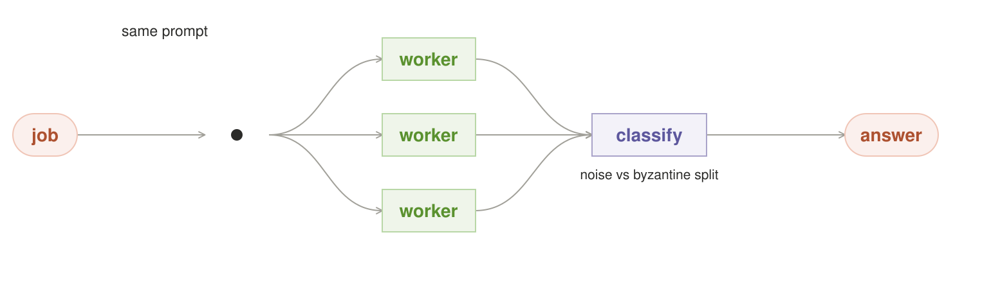

**Intent.** Stop treating all disagreement as the same. Classify a #2 fan-out's
divergence as either **noise** or **systematic/correlated**, and dose the
redundancy accordingly. “Byzantine” is an analogy for the shape of the error,
not a Byzantine-fault-tolerance safety claim: model replicas do not satisfy
PBFT's identity, quorum, independence, or fault-bound assumptions.

**Also Known As.** disagreement classification; fault-tolerant pooling

**Motivation.** #2 assumes crash-like noise (a bare majority works); #4 assumes one
honest judge settles it. Neither asks *what kind* of disagreement this is. A
model family sharing a training corpus is Byzantine-ish — wrong in the same
direction, not at random — and a plain vote lets that shared wrongness win.
#15 makes the replica count a *function of suspected adversarialness*.

**Applicability.** Disagreement clusters instead of scattering — a model
family sharing a training corpus is Byzantine in the same direction, and a
plain vote lets that shared wrongness win. Avoid it when the disagreement
can only be classified after the majority already shipped — the escalation
doubles latency without telling the caller.

**Structure.** Terminal → dot → three green workers (label: *same prompt*) →
purple `classify` (label: *noise vs byzantine split*) → terminal.

**Mechanics.** Look at the fan-out's divergence: if answers scatter randomly,
majority-vote with a small N (crash logic — a little extra helps); if they
cluster into two confident, mutually exclusive camps with no middle, escalate —
raise the replica requirement and pull in a *structurally divergent* judge
(#4, with #11's forced divergence), the f+1-copies-plus-trusted-arbiter rule.
The divergence *shape* is the decision, and it's deterministic to compute —
but it needs a numeric rule to be deterministic: a "two confident camps" test
means something like ≥60% of answers in one cluster, ≤1 middle answer, both
clusters above a reply-count floor. Without the number, the classifier is a
vibe that fires late or never.

**Consequences.** The fault-model-aware version of the shared-blind-spot defense
that #11 does by diversity — same goal, different tool. The win: it only
spends the expensive Judge path when the disagreement looks adversarial, so it
doesn't double the latency of every fan-out like #4 does. The cost: the
noise-vs-Byzantine classification can itself be wrong, and mis-scattering a
Byzantine disagreement as noise re-admits the shared error at majority speed.

**Known Uses.** Byzantine fault tolerance is the lineage analogy: protocols
such as PBFT state explicit identities, quorum sizes, and fault bounds before
replication can imply safety. #15 borrows only the discipline of naming the
fault shape. Its disagreement classifier is an escalation heuristic, not a
consensus proof.

**Failure mode.** The two-camp signature is missed or delayed — disagreement
detected *after* the majority already shipped a correlated-wrong answer. The
classifier has to fire before the vote commits, not after. And classification
is *inherently second-phase*: the divergence shape can't be classified until
the fan-out returns, and escalation then runs a full divergent judge on top —
so the worst case silently costs fan-out + classification + a whole #4 and
doubles latency without telling the caller.

**Refinements.** Four rules.

1. **Sniff with a small N first.** Probe with a few samples to classify
   noise-vs-Byzantine *before* committing to full N, making the classifier a
   cheap decision instead of an after-the-fact one.
2. **The sniff and the camp rule must agree on a number.** A 3-sample sniff
   cannot meet "≥60% in one cluster, ≤1 middle" (2-of-3 is a coin-flip, not a
   camp). Make the sniff *directional* — two answers clustering tightly on the
   same output is the early warning, spending the rule's reply-count floor —
   and reserve the full numeric camp test for the escalated pool, not the probe.
3. **Budget the two GPU rounds.** Sniff-and-full-fan is two rounds per request:
   the probe belongs in #26 slack when a seat is free, never a guaranteed extra
   serial round on the critical path.
4. **Watch the arbiter.** The escalated "trusted arbiter" that overrides a
   majority is the most consequential purple node in the catalog — it sits
   where the machinery warns decision nodes are unreliable, and #15
   concentrates all trust in it. Every escalation must be visible:
   `usage.escalation_depth`, `usage.divergence_shape: noise|byzantine`.

**Sample Code.** *(A working sketch, not the shipped stack — every name is a parameter.)*
```python
def byzantine_adjudicator(request, workers, n, k=3):
    probe = [w(request) for w in workers[:k]]         # sniff small-N first, not after-the-fact
    if not two_confident_camps(probe):                # noise: random scatter, a small majority fixes it
        return majority(workers[:n], request)
    judge = divergent_arbiter(request)                # must differ from the camp, never same-family
    return judge(full_fan(request, n))                # adversarial: spend the expensive path on purpose
```

**On the Grid stack.** When three workers disagree on a sensitive request, the router distinguishes *noise* (answers scatter, a small N fixes it) from *byzantine* (answers cluster into two confident camps — the same-family signature of a shared wrong prior, which a bare majority lets win) and spends more samples on the adversarial case. The escalated adjudicator can only break the shared prior if it is genuinely divergent *from the camp*: on a same-vendor stack, the designated judge `qwen36-35b-a3b-mtp` is the same family as the fighting Qwen workers, so it shares their blind spot and the "structurally divergent arbiter" the Byzantine premise requires may not exist — verify judge-family diversity *before* escalating, else route to a cross-vendor (`glm-5.2`), a tool-grounded check, or the human. The camp test must be numeric (≥60% in one cluster, ≤1 middle), and the classifier fires before the vote commits — the worst case silently pays fan-out + classification + a whole #4, so sniff with a small N first before committing to the full fan. Every escalation surfaces `usage.escalation_depth` and `usage.divergence_shape` visibly, because this adjudicator is the most dangerous node in the catalog.

---

**Related Patterns.** Fan-Out (#2) is the blind vote it replaces; Circuit Breaker (#20) is the operational response to a confirmed systematic fault.

## 16. Straggler Backup — duplicate only the overdue worker

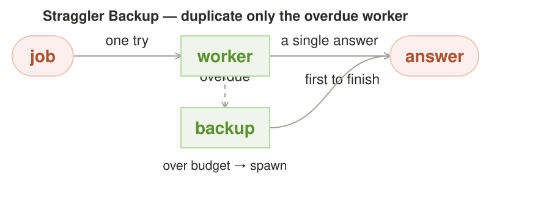

**Intent.** For a parallel pattern (#2, #6), add a latency watchdog: if a worker
exceeds its expected time budget, spawn a duplicate on a *different node* and
take first-to-finish. This is MapReduce speculative execution, transposed to
the fan-out join.

**Also Known As.** speculative duplication; backup tasks

**Motivation.** The parallel patterns optimize correctness but nothing reacts to a
slow node. A job is as slow as its slowest worker, and on a contended grid the
tail is the real cost — "tokens free" does not mean "time free." Straggler
backup targets *latency to converge*, spending the one signal the current
router is blind to: live per-node inventory.

**Applicability.** One node on the tail is blocking the group and live
per-node inventory is visible. Avoid it when the expected-time budget can't
come from a live latency percentile — a hand-tuned constant mis-sets it in
both directions.

**Structure.** Terminal → green `worker` → terminal, plus a parallel green
`backup` box below it, with a vertical dashed arrow *over budget → spawn* down
into the backup and a dashed *first to finish* arrow from the backup up to the
answer.

**Mechanics.** Launch one worker on a node; if it exceeds its expected latency
percentile (a live per-node stat), speculatively duplicate *that one task* on a
free *different* node and take whichever finishes first — never re-run the
whole fan. The redundancy is targeted at the bottleneck, not spread over
everyone. It composes with #2/#6 as a pure latency complement; correctness
still comes from #8's gate upstream.

**Consequences.** The cheapest latency win in the catalog — a small watchdog over
an existing fan, using signal the router already drops. The costs: it needs the
live per-node latency stats, and speculating on an already-correct worker
wastes one node (cancel the backup the moment the original finishes, plus a
process-group kill).

**Known Uses.** Speculative execution: MapReduce and Spark duplicate only the overdue task on another node and take first-to-finish (Google's straggler mitigation) — Straggler Backup is that exact policy on the fan-out join.

**Failure mode.** The expected-time budget is mis-set — too tight and every
fast worker gets needlessly duplicated; too loose and the straggler still sets
the pace. The budget has to come from a live latency percentile, not a
hand-tuned constant.

**Refinements.** Three build rules.

1. **Report the waste.** First-to-finish means the backup can return a
   *different answer* than the canceled original, and both are billable — so
   report `usage.runs_useful` vs `usage.runs_cancelled`, or the token count
   silently hides speculatively cancelled waste behind the "unmetered tokens"
   framing.
2. **Gate on a real second node.** "Different node" presupposes a free node —
   gate the pattern on the live node inventory, and do not advertise it on a
   single-box deployment where the node does not exist.
3. **Cap the speculation.** Bound concurrent speculations or a flash crowd
   spawns N redundant runs.

**Sample Code.** *(A working sketch, not the shipped stack — every name is a parameter.)*
```python
def straggler_backup(request, worker, nodes):
    if len(nodes) < 2:                                # no real second node -> don't advertise it
        return worker(request, nodes[0])
    job = worker(request, nodes[0])
    if job.elapsed() > percentile_latency(nodes[0]):  # live per-node stat, not a hand-tuned constant
        backup = worker(request, nodes[1])
        return first_to_finish(job, backup)           # take the first; cancel + report the loser
    return job
```

**On the Grid stack.** In a straggler backup, the router duplicates only the overdue worker — a slow long-read worker is shadowed by `laguna-s-2.1` on a second node, taking first-to-finish. The example is honest about the precondition: this needs a real multi-node inventory to be meaningful, and on a single-box deployment "different node" doesn't exist — the pattern must gate on the live-node inventory and refuse to advertise itself where a second lane is fiction. It also caps concurrent speculations, or a flash crowd spawns N redundant runs, and the budget comes from a live latency percentile, not a hand-tuned constant, so a strict worker isn't needlessly duplicated.

---

**Related Patterns.** Fan-Out (#2) fans up front, #16 fans only the straggler; Circuit Breaker (#20) handles the failing-member case.

## 17. Materialized Answer — cache the verified answer by a semantic key

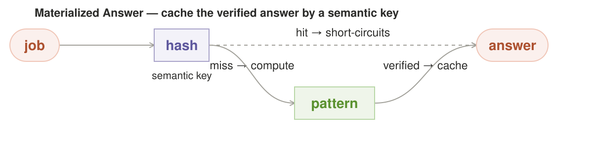

**Intent.** Cache a *verified* answer keyed by a semantic hash of
(request-class, content-fingerprint, model), serve repeat expensive requests at
mate-in-one-fast latency, and invalidate lazily when the content fingerprint
changes. This is a database materialized view on top of the router.

**Also Known As.** memoization; semantic caching

**Motivation.** Some of the most expensive jobs in the catalog are also the most
repeatable — "summarize this repo," "explain this function," "what changed
since X." #17 is the first explicit answer-reuse pattern; earlier learners
already carry cross-request state. A cache hit is Grid's cheapest possible
answer, faster than even #1.

**Applicability.** The same expensive verified answer keeps recurring
across requests — a summarize-the-repo, a what-changed, an
explain-this-function. Avoid it when you can't fingerprint the content's
actual change: a stale fingerprint serves a confidently stale answer, and a
rubber-stamped write-back serializes that error to every future requester.

**Structure.** Terminal → purple `hash` (label: *semantic key*) → green
`pattern` → terminal, with a dashed elbow `verified → cache` from the answer
terminal back into the hash, labeled *hit short-circuits, miss computes*.

**Mechanics.** Key the cache by a semantic hash of the (request-class, content
fingerprint, model); serve a hit without running any worker. Invalidate lazily
when the underlying content fingerprint changes — git hash, file mtime —
treating refresh as a maintenance job, not a per-read cost. Its write side is
read-repair, in the Cassandra/Dynamo sense: the winning verified answer writes
back as a side effect of every adjudicated request, so the cache fills itself.

**Consequences.** Turns the most expensive repeat requests into free material
— a genuine step-change in cost and latency where it applies. The costs: it
only helps *repeat* retrieval-shaped work, and the semantic-key hash can
miscollide (serving a stale answer as if current) — the invalidation
fingerprint is the whole integrity story.

**Known Uses.** Cache-with-invalidation and memoization: a verified answer is served from a store until its freshness or confidence decays — CDNs, TTL caches, and LRU-with-recompute are Materialized Answer under different names.

**Failure mode.** Two ways the cache lies. A fingerprint that doesn't change
when content does — the cache serves a confidently stale answer because the git
hash or mtime never budged (invalidation is a measured property of the data, not
a fall-through). And a write-back that serializes a verification error
globally: one rubber-stamped "verified" entry (#8's failure) serves that wrong
answer to every future requester, turning a transient bad check permanent and
amplified across all clients.

**Refinements.** Six rules keep it honest.

1. **Mark the hit.** A hit is by construction older than fresh compute; the
   envelope must say so (`x-grid-cache: hit|miss`, `x-grid-cache-fingerprint`,
   `x-grid-cache-staleness`).
2. **Provide a freshness bypass.** `x-grid-cache: bypass` / `fresh` forces
   recompute when a user needs current data or is debugging.
3. **A confidence floor, as a number.** Reject a write-back below a stated
   calibrated threshold (e.g. the verifier's pass rate on held-out bad drafts
   from #8).
4. **Stamp every entry.** Record the verifier's identity and **invalidate on
   doubt**, not just on fingerprint change — a cached answer must never be more
   trusted than the check that wrote it.
5. **Name "on doubt".** A concrete trigger: confidence below the floor, a
   verifier-version change that re-validates old entries, or the semantic key's
   stored fingerprint disagreeing with a fresh one.
6. **Durability, idempotence, and single-flight.** The cache lives beside the
   canonical WAL-backed ledger; its write-back is atomic and idempotent. That
   prevents duplicate state, not duplicate compute. A per-key single-flight
   lease makes concurrent misses join one in-flight computation; if the lease
   holder dies, a bounded expiry allows one successor to recompute.

**Sample Code.** *(A working sketch, not the shipped stack — every name is a parameter.)*
```python
def materialized(request, key, compute):
    h = semantic_hash(cls(request), fingerprint(request), model)
    entry = cache.get(h)
    if entry and entry.fresh() and not entry.on_doubt():  # hit short-circuits; miss computes
        return entry.answer, {"x-grid-cache": "hit"}
    with single_flight(h) as flight:                   # idempotence alone cannot stop duplicate work
        if not flight.owner:
            return flight.await_result()
        answer = verify(compute(request))              # only a verified answer may write back
        if answer.confidence >= FLOOR:
            cache.put_once(h, Stamp(answer, verifier=verify))
    return answer, {"x-grid-cache": "miss"}
```

**On the Grid stack.** A repeated request hits the materialized cache by semantic key (`x-grid-cache: hit|miss`) instead of recomputing — e.g. a "summarize this repo" on `qwen36-35b-a3b-mtp` over the Claude Code (stream-json) lane, where the cache key is the (request-class, repo-fingerprint, model) triple and the hit returns in mate-in-one time. The example places a confidence floor and a verifier identity on every entry and invalidates on doubt — because a cache serializes a verification error globally: one rubber-stamped "verified" write-back serves that wrong answer to every future requester. The cached answer is never more trusted than the check that wrote it, and the fingerprint + staleness go in the `x-grid-cache-fingerprint` / `x-grid-cache-staleness` envelope, with a `bypass`/`fresh` path so a user debugging current data is never served a stale hit against their will.

---

**Related Patterns.** The outcome ledger shared with #13/#14; a cache lookup is the cheap version of #8's check.

## 18. Canary Trust-Equity — earn a vote before you ever cast one

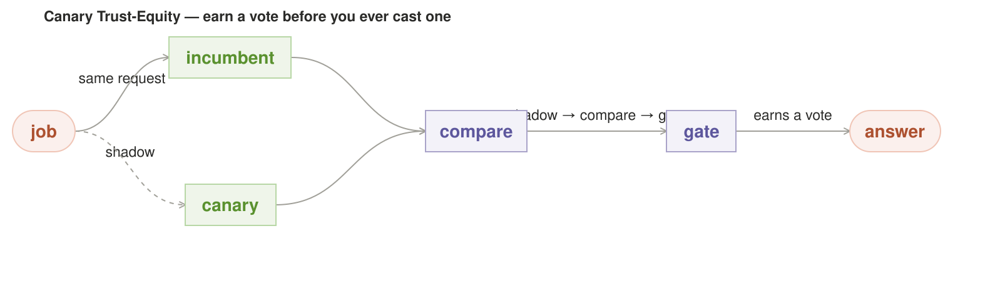

**Intent.** Give a new model or pattern **observation-only, and then a
graduated vote** — it shadows the incumbent on live traffic and only earns the
right to actually decide once its track record clears a bar. This is staged
rollout / canary release applied to *which answer the router trusts*.

**Also Known As.** shadow traffic; progressive trust; gradual rollout

**Motivation.** Every new member of the fleet (#5's pool, #14's candidates) is
trusted by default the moment it's admitted — and a model that's confident on
its first day and wrong by day three gets the same authority as a
battle-tested one. Spare local compute makes the alternative affordable: run the
candidate in *shadow* (invisible to the caller) on real traffic, compare its
answers to the incumbent's adjudication, and let trust be **earned per
request-class, not granted on admission**. The name is the idea — a canary
that hasn't earned equity doesn't vote.

**Applicability.** You're admitting a model you don't trust yet and it can
shadow live traffic to earn its vote. Avoid it when the shadow and the
incumbent share the same prior and the verifier rubber-stamps both —
day-zero agreement is confidence in the prior, not earned trust.

**Structure.** Coral terminal → dot → green `incumbent` worker + dashed green
`canary` worker (dashed = shadow mode) → purple `compare` → purple `gate` →
coral terminal. Caption: *shadow → compare → gate*, *observation only, until it
earns a vote*.

**Mechanics.** The candidate answers every request but its output goes only to
`compare`, never to the caller. `compare` scores the candidate's answer against
the incumbent's adjudicated answer (the verifier's label, not the incumbent's
raw text — see the machinery's ground-truth authority). When the candidate's
agreement-with-truth clears the equity bar it's promoted from dashed to solid
and admitted to the pool; below a floor it's quarantined (the gate doubles as
#20's bulkhead for a model, not just a class). The equity ledger is per
request-class and decays (#14's term), so an old model that the workload has
drifted away from must re-earn rather than coast on a stale score. The equity
bar, like #12's covariance, is gated on a **minimum observation count per
class plus a stratified slice of the hard cases** — a canary that only ever
shadows easy traffic must not clear the bar on agreement everyone aces; trust
is earned on the requests that can hurt, not the ones the whole fleet gets
right. Explicitly, compare labels are one of `{none, incumbent-only,
tool-grounded}` — until the ground-truth authority exists, equity is at best
incumbent-consistency; the catalog never claims a canary "earned a vote" off
an authority that isn't built. The equity bar needs a number to be a bar (say
≥ 20 graded hard-case agreements at ≥ 90% agreement-with-truth per class before
any vote), and "free tokens" is not the same as "free time": a shadow run holds
the GPU for a second inference per shadowed request, so shadow rounds are gated
on the live-node inventory (don't double a saturated GPU), run on a sample or
off-peak, or only when a second model slot is idle — and reported
(`usage.shadow_runs`, per member) so eval cost isn't invisible. On a single
seat this meets #26's slack-only rule head-on, and *shadow real traffic* and *only
in idle* are mutually exclusive there — there is no idle while a live request
holds the seat. Pick the deferred mode and state it (don't leave both promises
standing): **sample one live request on the critical path, then defer the
canary's compare + equity update to the next slack window** (the compare runs
when #26 frees a seat, not in-band), **or replay a `round_id`-snapshot of past
adjudicated requests through the canary during slack**. Say which; stating both
as if satisfiable on one box is the contradiction. The equity ledger is durable
state in the same WAL store as #14/#17, keyed per {request-class, member}.

**Consequences.** Costs a constant shadow run on every canary over its whole
evaluation window — the honest price of *never trusting a stranger cold*.
`compare` itself is a purple decision node and must be deterministic or
calibrated (agreement with the incumbent is a consistency signal, not truth).
It only helps when you actually *admit* new members for cheap tokens; for the
"always use the same trusted model" case it's pure overhead.

**Known Uses.** Canary deployments / gradual rollouts: SRE shadows a fraction of live traffic onto a new binary and only promotes on health metrics — Canary Trust-Equity is canary for a model, earned on real trust rather than a staging pass.

**Failure mode.** The shadow canary and the incumbent share the *same* prior
and the verifier rubber-stamps both — day-zero agreement that's confidence-in-
the-prior, not earned trust. The equity bar must be set against an independent
tool-grounded label (machinery: one ground-truth authority), or the canary
earns its vote by agreeing with a wrong incumbent. And a cross-request equity
ledger is stateful: it needs the same `round_id` policy-snapshot determinism
and per-tenant boundary as every other ledger in the catalog — and a canary's
graduation is a state change that must be a logged, `round_id`-stamped ledger
event, not a silent mutation, or a replay can't reproduce which pool actually
voted.

**Sample Code.** *(A working sketch, not the shipped stack — every name is a parameter.)*
```python
def canary(request, incumbent, candidate, equity):
    answer = incumbent(request)
    shadow = candidate(request)                          # observation-only; never reaches the caller
    equity.update(cls(request), agree(shadow, label(answer)))  # vs adjudicated label, not raw text
    if equity.bar_cleared(cls(request)):                 # >=20 graded hard cases at >=90%, per class
        return promote(candidate)                        # a logged, round_id-stamped ledger event
    return answer                                        # canary shadows until it earns a vote
```

**On the Grid stack.** A new member — a fresh `glm-5.2` build onto a Qwen-dominated box — earns a vote by shadowing real traffic over the Hermes lane while its answers go only to `compare`, never the caller, and graduates to the voting pool only after `compare`'s gate clears. A canary that only ever shadows easy traffic must not clear the bar on agreement everyone aces: trust is earned on a stratified slice of the hard cases, and until a tool-grounded ground-truth authority exists, the equity label is honestly `incumbent-only`, not "earned." Graduation is a logged, `round_id`-stamped ledger event, not a silent mutation, so a replay can reproduce exactly which pool voted — the audit trail is the point.

---

**Related Patterns.** Screening (#24) knows a model's type in idle; Pheromone (#14) learns over time; Slack-Stealing (#26) pays for the shadow.

## 19. CVaR Budgeting — size the spend by the tail, not the mean

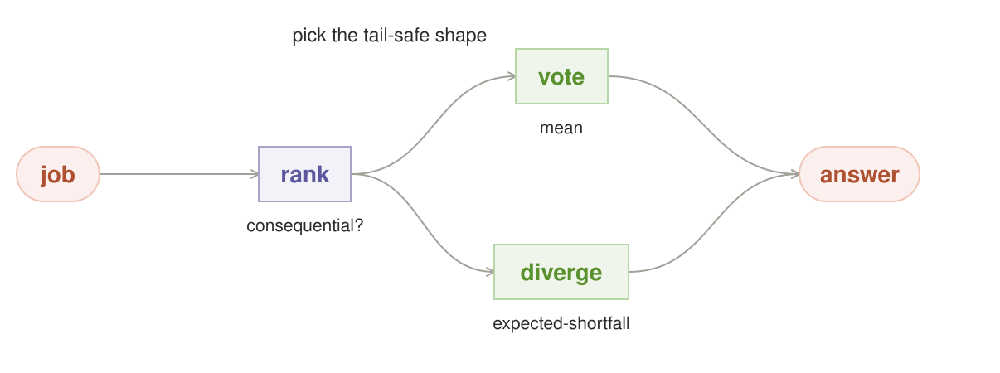

**Intent.** Size a request's sample budget from the **tail risk of the answer
class**, not its average behavior — spend a lot more on the rare request that's
both hard and costly to get wrong, and spend the floor on the common cheap
ones. Conditional Value-at-Risk turned into a token budget.

**Also Known As.** tail-risk budgeting; expected-shortfall sizing

**Motivation.** #5 and #13 budget by *expected* difficulty. But expectation cheats
the distribution's tail: the request that's 95% cheap and 5% catastrophic
averages out to "normal" and gets the default budget right where the rare
expensive failure hides. The local router owns a finite time budget, so the
question is not "how hard is this class normally" but **"how bad is the worst
5% of this class, and what does it cost to hand them more samples?"** A router
that prices the tail buys insurance exactly where insurance is cheap.

**Applicability.** A rare request is hard *and* costly to get wrong — you
want the worst tail-sized spend, not the mean. Avoid it when the bad tail
is so thin it gets the premium on nothing, or so bimodal the mean
under-budgets the genuinely catastrophic class.

**Structure.** Coral terminal → green `budget` (label: *shape, not mean*) →
purple per-class cost model → three green workers of differing weights
(drawn taller = more spend) → purple `pool` → coral terminal.

**Mechanics.** Keep per-request-class outcome historicals (the same ledger #12
and #13 read). Estimate not just mean difficulty but the conditional
expectation *beyond* a quantile — the CVaR. The tail it conditions on is a
**loss, not a difficulty** — the ledger records each request's *cost of being
wrong* per class (a real number on Grid Enterprise), and the budget prices the
conditional expectation of that loss past the quantile. Without a loss
function the "tail premium" is a mean-difficulty weight in costume — coherent
insurance needs a priced dollar value of a wrong answer, so define it (the
wrong answer's downstream cost per class) or the pattern is CVaR in name
only. On a local box most users won't wire a real consequence metric — so a
default loss that degrades to **difficulty-weight when no consequence signal
exists** is the ship-able default, named as a degradation rather than a
silent costume. Each request draws its sample count `N` from the class's risk curve:
floor `N_min` for the safe bulk, escalating toward `N_max = budget / p_tail`
for the worst quantile. The spend is **coherent** — extra samples go to the
classes whose tail would hurt — rather than an ad-hoc "this one feels
important" premium. On Grid Enterprise the tail premium is a visible, billable
line: expensive insurance, priced, not hidden in a pooled average. And it
reads the **tail-difficulty vs tail-corruption split** (machinery) — before
`N` escalates it checks the breaker state, and never prices more samples of a
member #20 has quarantined; the N it draws comes from the remaining healthy
pool.

That rule is only a **policy hypothesis** until the deployment has measured a
response curve from additional samples to lower verified tail loss. A CVaR
estimate can rank which classes are risky; `N_max = budget / p_tail` does not
show that another sample reduces that risk. Calibrate `loss(N)` per class and
increase N only on ranges where the estimated marginal reduction is positive.

**Consequences.** Redirects budget toward rare hard cases and away from common
easy ones — the right economic call when the tail costs real money, the wrong
one when a class's pain is *uniform* (there the mean already budgets correctly,
and CVaR just wastes tokens on a quantile that isn't riskier). It needs enough
history per class that the tail estimate is a measurement, not a guess — on
cold start it must degrade to the plain mean (#19 meets #12's `weighting:
unmeasured|measured` rule).

**Known Uses.** Tail-risk sizing: risk-averse RL and CVaR optimization allocate by the worst-case tail of the return distribution, and portfolio management sizes bets by tail loss — CVaR Budgeting applies the same rule to token spend.

**Failure mode.** A class with a *thin* bad tail — one catastrophic example in
a thousand — gets the tail premium on nothing, while the mean under-budgets
the genuinely bimodal class whose tail is freakishly rare but ruinous. The
CVaR estimate is a model, not arithmetic: it needs the metric-determinism
treatment (pin + calibrate the estimator, snapshot the historicals for
replays).
The other failure is spending into a flat response curve: tail risk is real,
but all available models share the same blind spot, so more samples buy no
reduction. Until `loss(N)` is measured, keep #19 experimental rather than a
default budget policy.

**Sample Code.** *(A working sketch, not the shipped stack — every name is a parameter.)*
```python
def cvar_budget(request, cls, priced_loss, histories, alpha=0.95):
    if thin_tail(cls, histories):                        # a thin-tailed class isn't riskier than the mean
        return mean_budget(cls, histories)               # degrade honestly, don't fake a quantile
    tail = estimate_tail(priced_loss(cls), alpha, histories)  # estimator is a model, not arithmetic
    return size_spend(request, tail)                     # spend by the tail, never by the average
```

**On the Grid stack.** The router sizes a request's spend budget by the tail, not the mean: it guards against a request class whose median is cheap but whose worst-case (a pathological prompt) is catastrophically expensive. The class's loss function is a priced dollar value — on Grid Enterprise, the wrong answer's downstream cost is a real, billable number, not a difficulty weight in costume; without it, the "tail premium" is a mean-difficulty weight dressed as CVaR. `qwen38-27b-mtp`'s CVaR estimate is carved from the same historicals #12/#13 read, and the example is honest that the estimator is a model, not arithmetic — it needs the metric-determinism treatment (pinned, calibrated, historicals snapshotted for replay) or the tail number is untrustworthy, and on a thin-tailed class it must degrade to the plain mean rather than waste tokens on a quantile that isn't riskier.

---

**Related Patterns.** Strategy (#5) and PID (#13) budget by expectation; Circuit Breaker (#20) is the breaker state #19 must read before pricing.

## 20. Circuit Breaker + Bulkhead — fail fast, quarantine the toxic class

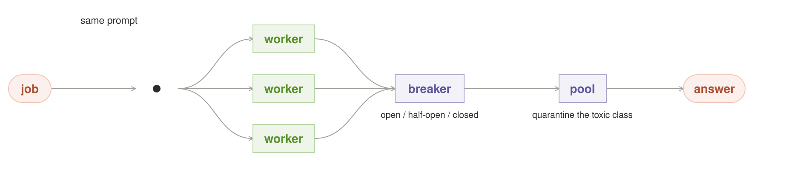

**Intent.** When a model or request-class starts failing, **trip fast and
degrade** instead of spending the whole request on a corpse — and isolate the
toxic class in its own lane so its failure can't take the grid down. This is
the circuit breaker and bulkhead from distributed systems, on a router that
can now *choose a different answer path* instead of hungering on a bad one.

**Also Known As.** fail-fast; the quarantine lane; the bulkhead

**Motivation.** The catalog's correctness patterns (#2, #9, #13, #15) all *spend
more under duress* — they scale samples up when confidence drops, which is
exactly wrong when the drop is a broken node or a poisoned class rather than
a hard-but-honest answer. #13's I-term raises spend on a class that keeps
failing; #16 speculates on a model that keeps timing out. Four "spend more"
loops with no common brake. #20 is the common brake: detect the failing
member, **stop feeding it**, and serve a degraded-but-honest answer (or
refuse/escalate) rather than let one bad node eat the budget and the wall-clock.

**Applicability.** A toxic node or class is eating the budget and fast-fail
+ quarantine beats spending more under duress. Avoid it when the drop in
samples is ordinary contention — the breaker trips on noise, not signal,
and serves degraded answers for a healthy-but-busy grid.

**Structure.** Coral terminal → green `trip` (label: *error rate, not single
failure*) → split: a coral `degraded` answer *and* green `quarantine` box
(isolated lane) → a purple replacement rejoin on recovery → coral terminal.

**Mechanics.** The breaker watches **error rate and latency per model,
per class, over a rolling window** and trips open on a threshold — never on a
single failure (#16's threshold is *relative to the class deadline*, not
absolute). Once open, the failing member is bulkheaded into its own lane: it
may still serve *that* lane's retries to prove recovery, but it can't block
the main path, and any request that hits the open breaker serves a
degraded-but-honest answer now (the three exits: degrade, refuse, escalate)
with `circuit: open|half-open|closed` + the tripped member in the envelope.
The trip resets closed after a cooldown window of clean health — the same
decay shape as #14's re-earn.

**Consequences.** Trades a little false-trip risk for a lot of collapse-avoidance.
The degradation is the point: a grid that trips a bad node and still answers
is more reliable than one that retries patiently into a brownout. False opens
are the cost — a transient class that looks broken for 100ms gets deprioritized
and the caller must see *why* in the envelope. It is the one pattern that
deliberately *returns a worse answer than it could have*, which is only honest
if the envelope says the breaker is open.

**Known Uses.** Netflix Hystrix, resilience4j, Akka's CircuitBreaker, and every microservice bulkhead: a failing call is tripped open and isolated in its own lane so one bad dependency can't collapse the caller — the exact fail-fast/quarantine promise, minus the ability to route to a different answer path.

**Failure mode.** The breaker trips on **noise, not signal** — a burst of
slow/failed samples during normal contention opens the circuit, and the router
now serves degraded answers for a healthy-but-busy grid. The trip threshold
must be a *measured* percentile over history (the same ledger #19 reads),
never an absolute. And on a single-node deployment a bulkhead is a fiction —
there's no second lane; the breaker should know the live inventory and refuse
to "quarantine onto nothing" (#20 leans on #16's gate).

**Refinements.** Five build rules keep the promise honest:
1. **Trip on a measured threshold, never on noise.** Trip on consecutive
   failures, an error rate over the window, or latency past the class timeout
   — a single slow/failed sample must not depopulate the pool. The threshold
   is a *measured percentile over history* (the ledger #19 reads), never an
   absolute.
2. **Isolate the degraded path as a named shape, not a "recompute."** It is a
   re-fan over the healthy pool *minus* the tripped member, falling back to
   #1's mate-in-one over the best healthy member when the pool is too small to
   re-fan. *Which* member is trip-culled is a decision node (purple) and is
   calibrated like any other.
3. **Meter recovery probes in a window separate from production traffic.**
   "Prove recovery" gives the member synthetic/minimal probe work whose
   failures must *not* re-open or hold the breaker, and the probe spend is
   bounded so recovery can't become a second lane quietly draining budget.
4. **Treat a mid-request trip as a state change under the request's feet.**
   The request's own sample population silently changes, so the trip must
   cancel/reconcile the in-flight fan's already-collected partials, pin the
   pool-membership change to a fresh `round_id` policy snapshot, and report
   the degraded recompute as a distinct run — otherwise the seed that promised
   same-request→same-answer reproduces the pre-trip plan, not the path it
   actually took.
5. **Say *why* in the envelope.** `circuit: open|half-open|closed` and the
   tripped member ride with the degraded answer, so a caller who got a worse
   answer than possible isn't surprised by it.

**Sample Code.** *(A working sketch, not the shipped stack — every name is a parameter.)*
```python
def circuit_breaker(request, member, cls, live_inventory):
    if len(live_inventory) < 2:                       # a bulkhead needs a second lane; on one node it's a fiction
        return serve_degraded(request, member, reason="no spare seat")  # degrade/refuse, never hope one appears
    err = measured_error_rate(member, cls, window=rolling)        # measured percentile over history, not one sample
    if err < trip_threshold(member, cls):             # a slow/bad sample under normal contention is noise, not signal
        return serve(request, member, envelope(circuit="closed"))
    quarantined(member).isolate()                     # bulkhead the toxic lane; it may still prove recovery alone
    probe = metered_probe(member, separate_window=True)  # probe spend can't re-open the breaker or drain a second lane
    if probe.recovered():
        return serve(request, member, envelope(circuit="half-open"))
    return escalate(request, member, envelope(circuit="open"))  # the three exits: degrade / refuse / escalate
```

**On the Grid stack.** A request-class that has been failing hard trips the breaker fast and quarantines the toxic lane into a bulkhead — e.g. `glm-5.2` serving malformed extraction over the Hermes (ACP) lane trips and is refused for new requests — but the example is honest that on a single-node deployment a bulkhead is a fiction with no second lane. The breaker must know the live inventory (#16) and refuse to "quarantine onto nothing": with no second lane, open means the class *serves degraded or refuses*, and that is the explicit default, never a hope that a spare seat appears. While open, the failing member is bulkheaded into its own lane, recovery probes are metered in a window separate from production traffic (so a probe failure doesn't re-open the breaker, and recovery can't quietly drain budget as a second lane), and recovery is a probabilistic regression with an easing window, never absolute. The tripped member and the `circuit: open|half-open|closed` state ride in the envelope so the caller sees *why* it got a degraded answer, and the trip must not fire on a single slow/failed sample — the threshold is a measured percentile over history, not an absolute.

---

**Related Patterns.** Straggler (#16) is the timing case; Byzantine (#15) the disagreement case; the degraded re-fan is #2 minus the tripped member.

## 21. Delphi Consensus — anonymous rounds, iterated until the spread closes

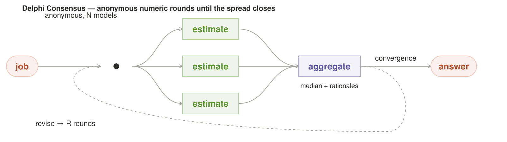

**Intent.** For a **numeric estimate**, run the workers in *iterated anonymous
rounds* — each writes a private number and a one-line reason, then sees the
aggregate (not who said what) and revises — until the spread tightens below a
bar. This is the Delphi method, the one classic group-judgment tool built
around *shielding the group from its own dominant voice*.

**Also Known As.** anonymous consensus rounds; iterated polling

**Motivation.** Structural reasons to use the right number: forecasts, deadlines,
landed costs, quantities, confidence scores — every "how much / how big / how
long" the router answers for an agent that's about to spend real money. The
naive move is to average the first-round numbers (#7). But the first round is
contaminated by anchoring — whoever writes earliest, loudest, or most
confidently drags the others' eyes, and any *correct* outlier gets averaged
toward the anchor before it's ever defended. The Delphi shape exists
specifically to break that: **anonymity removes the social pressure to
conform, and iteration lets a defensible outlier pull the group instead of
being averaged down in one pass.**

**Applicability.** The answer is a number that gates real spend — a
forecast, deadline, or landed cost — and you want anonymous rounds until
the spread closes. Avoid it when the workers share one mistaken
conventional prior — the IQR narrows on the wrong anchor and reports
confident consensus that is really correlated.

**Structure.** Coral terminal → a stacked column of green workers each in its
own round (label: *write, see the spread, revise*) → a purple `aggregate`
between rounds (median + interquartile spread, *no names*) → coral terminal
once the spread closes. Caption: *iterate until the spread closes* (the
figure's stacked rounds ARE the loop — each round is an anonymous private
write, the aggregate is private-by-construction).

**Mechanics.** Each round: every worker privately writes a number + a reason.
The router shows them only the **median and the interquartile spread** —
never the raw list, never who wrote what — and asks for a revision. The
workers whose numbers sit *outside* the IQR are told they're outliers so they
get a chance to defend (flesh out their reason) or revise. Terminate when the
IQR drops below a per-class bar *and* at least a minimum number of rounds
have run (a single-round tight spread on round one is anchoring, not
convergence), or after a round cap (bounded, with refuse/escalate on expiry).
The final answer is the **median** (robust to the outlier that #7's mean would
flatten). On the last round, surface the surviving outlier reasons — the
defensible contrarian is the *product*, the answer to "what does the group
believe, and who disagrees and why." Because the median by construction cannot
win a held-firm but correct outlier (the one-man right answer still loses to
the median), when the spread has closed but a surviving outlier's defense is
strong, the tight median must be able to **escalate** — to an arbiter, a
tool check, or a human — rather than ship a confidently wrong median with an
apology attached.

**Consequences.** Costs multiple rounds of latency — it is the slowest pattern in
the catalog and is only worth it for answers that gate real spend. The
revision loop trusts that a worker will revise *toward* the group; a worker
that just re-anchors to the median on every round adds noise, not wisdom (each
worker's movement should be logged — a worker whose revisions track the group
suspiciously is following, not judging, and is #21's version of #12's
correlation). **Anonymity is bounded, not absolute** — resolve the identity
question explicitly rather than pretend both ways at once: per-outlier
targeting ("you're an outlier, defend yourself") and movement-logging both
*require* the router to hold the worker→number mapping, so the aggregation is
**not** map-only. Either the router retains attribution for the round (making
the leak the failure mode names a *design property* — in which case the
attribution must be scoped, retained only long enough to run the rounds, and
audited for leaks) or it drops per-outlier targeting and revises purely off
the shared statistics. Pick one; the catalog can't claim "never split who wrote
what" and simultaneously identify outliers to their faces.

**Known Uses.** The RAND Delphi method (forecast rounds, anonymous estimates, median+IQR feedback) and forecast aggregation markets: both shield a group from its own dominant voice so an outlier can pull the number instead of being averaged down in round one.

**Failure mode.** The median closes on the **wrong shared prior** — three
workers agree-to-anchor on the same mistaken conventional number, the IQR
narrows, and the loop reports confident consensus that is really correlated
(Groupthink under a Delphi-shaped mask).

**Refinements.** Three guards.

1. **The round cap still refuses/escalates**, rather than rubber-stamp a
   tight-but-wrong spread.
2. **Minimum rounds, plus a non-feedback probe.** The termination signal (IQR
   closing) is confounded with the mechanism that feeds it (showing median+IQR
   back), so early termination can certify self-induced convergence. A tight
   spread must survive a non-feedback probe: one round's revision should be
   measured against an independent estimate, not just the fed-back statistics —
   the same test #12 applies to a "tight cluster".
3. **Guard anonymity.** If any round exposes attribution (the router logs
   reasons with names in its own state, leaked via the envelope), the mechanism
   collapses back into first-round anchoring. #21 earns its median only while
   the anonymity, the iteration, and the minimum-rounds floor all hold — the
   moment one breaks, it is just #7 with extra steps.

**Sample Code.** *(A working sketch, not the shipped stack — every name is a parameter.)*
```python
def delphi_consensus(request, workers, min_rounds, round_cap, bar):
    est = [w(request) for w in workers]               # each worker: private number + one-line reason
    kept = {id(w): None for w in workers}             # router holds attribution ONLY long enough for the rounds
    for r in range(1, round_cap + 1):
        med, iqr = aggregate(est)                     # median + interquartile spread, never names
        if iqr < bar and r >= min_rounds and passes_nonfeedback_probe(est):
            return median(est), surviving_outlier_reasons(est)   # surface the contrarian, don't flatten it
        est = revise(est, med, iqr)                   # workers see the spread only, never who wrote what
    return escalate(est)                              # round cap refuses/escalates, never rubber-stamps a tight-wrong
```

**On the Grid stack.** A sensitive estimate runs in anonymous rounds — each worker privately writes a number and a reason, sees only the median and interquartile spread, and revises until the spread closes. `qwen38-27b-mtp`, `qwen36-35b-a3b-mtp`, and the cross-vendor `glm-5.2` participate under `round_id`-keyed anonymity over the OpenClaw lane. The single-node cost must be owned: three models that don't co-reside on a 1-GPU/Apple box turn "rounds" into serial VRAM swaps, so **Delphi on one box is sequential re-loads, not parallel rounds** — the round cap is not a nicety here, it is the difference between a measured estimate and a thrash. The anonymity is scoped, not absolute: per-outlier targeting ("you're an outlier, defend yourself") and movement-logging both require the router to hold the worker→number mapping, so the attribution is retained only long enough to run the rounds and audited for leaks — or the pattern must pick one and drop the other. The example earns the median only while the anonymity, the iteration, and the minimum-rounds floor all hold — the moment any breaks, it collapses into #7 with extra steps.

---

**Related Patterns.** Ensemble (#7) averages without iterating; Negative Selection (#11) forces the very diversity Delphi want; Screening (#24) feeds its estimates.

## 22. Trial Sequential Analysis — policy changes only at registered evidence looks

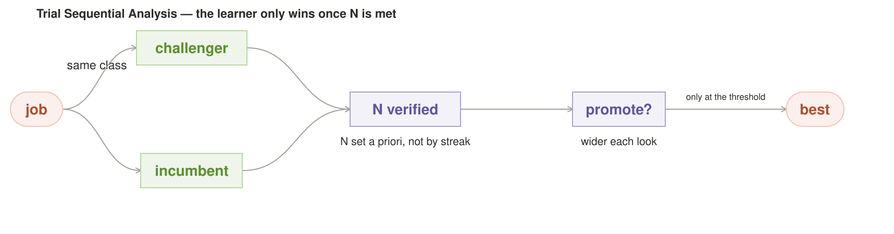

**Intent.** When a cross-request learner repeatedly compares a challenger with
an incumbent, pre-register the endpoint, minimum relevant effect, error rates,
maximum information, interim-look schedule, and efficacy/futility boundaries.
Change policy only at one of those looks when the comparative statistic crosses
its registered boundary. This gates the router's slow learner; it never
certifies one request.

**Also Known As.** pre-registered analysis; sequential hypothesis testing

**Motivation.** Every learner in the catalog (#14's pheromones, #18's canary gate,
#13's tuning, #12's covariance) draws a conclusion from observed outcomes — and
"there is no API token bill" tempts the router to trust a *lucky streak of three*. A
streak of three is how an unlucky day turns into a mistaken promotion that the
router then defends with faith not data. The one thing local gives us that a
cloud router can't is the ability to *actually accumulate enough evidence
before declaring a winner* — #22 is what tells the learner how much "enough"
is, and forbids it to front-run.

**Applicability.** A runner-up looks good on a lucky streak and repeated peeks
could turn noise into a promotion. Avoid it when outcomes cannot be paired or
otherwise compared under one pre-registered design, or when the design can be
rewritten after a favorable look.

**Structure.** Coral terminal → a dot → green `challenger` and green
`incumbent` workers over the same cases → a purple `paired evidence` ledger →
a purple `registered look` gate → coral `promote / retain` terminal. Early
efficacy boundaries are the most stringent.

**Mechanics.** Create a durable `design_id` before observing outcomes. The
design fixes a paired endpoint on the same verified cases, the minimum relevant
effect, α, power, maximum information `N_max`, information fractions for
interim looks, an alpha-spending function, and efficacy/futility rules. Count
deduplicated **paired challenger–incumbent outcomes**; a per-model success count
cannot establish that one model is better. At each unconsumed look, compute the
registered comparative statistic and consume that look exactly once.
O'Brien–Fleming-style efficacy thresholds are most stringent early and
generally relax toward the final look; protection comes from spending a bounded
total α, not from a boundary that “widens every time.” If no interim looks are
registered, run a fixed-horizon test and do not promote before `N_max`. A
Bayesian design is a separate calibrated decision rule; do not make a prior's
variance grow merely because the data were viewed.

**Consequences.** Delays promotion—the honest cost of not declaring winners on
streaks—and imposes a frozen design on a learner that prefers to improvise. It
only bites when the learner wants to change policy. A naive fixed confidence
level checked repeatedly is still streak logic. **The evidence it counts is
only as good as the
ledger it lives in.** N is a count of verified outcomes, and a count is exactly
a distributed-logs problem in miniature: a client retry after a mid-request box
death re-appends the same outcome and silently inflates N (the barrier then
promotes on fewer real outcomes than the spread boundary believed), a crash
that resets the interim-look counter restarts the α-spend and *weakens* the
barrier back into the streak logic it exists to stop, and a promotion must not
clear until its appends are durable. #22 is not a statistics pattern with a log
attached — it is a log-correctness pattern with a hypothesis test on top. Feed
its counter from the exactly-once, durable, per-design paired-outcome ledger
(router-execution.md: keyed appends, fsync/WAL + replay, crash-recoverable look
count), or its rigor is ceremony over a ledger that double-counts when the box
blinks.

**Known Uses.** Group-sequential clinical-trial designs and trial-sequential
meta-analysis pre-specify information size and stopping boundaries.
O'Brien–Fleming spends very little α early, so early efficacy evidence must be
unusually strong; later boundaries relax while total Type-I error remains
controlled.

**Failure mode.** The learner moves the endpoint, effect size, look schedule,
comparator, or stopping rule after seeing favorable data. That is a new design,
not another look: stamp a new `design_id`, reset its error accounting, and
retain the abandoned design. At the final look, reaching `N_max` alone never
promotes; failure to cross the efficacy boundary means retain/refuse.

**Sample Code.** *(A working sketch, not the shipped stack — every name is a parameter.)*
```python
def trial_sequential(klass, challenger, incumbent, design_id, ledger):
    design = ledger.load_preregistered_design(design_id)
    pairs = ledger.verified_pairs_once(
        klass, challenger, incumbent, endpoint=design.endpoint,
    )
    look = design.next_unconsumed_look(information=len(pairs))
    if look is None:
        return pending(fill_eta(design, len(pairs)))

    stat = paired_statistic(pairs, min_effect=design.min_effect)
    decision = "continue"
    if stat >= design.efficacy_boundary(look):
        decision = "promote"
    elif stat <= design.futility_boundary(look) or look.is_final:
        decision = "retain"

    ledger.append_once(
        interim_decision(design_id, look.id, len(pairs), stat, decision),
    )
    if decision == "promote":
        return promote(challenger)
    if decision == "retain":
        return retain(incumbent)
    return pending(fill_eta(design, len(pairs)))
```

**On the Grid stack.** The learner is deciding whether `qwen36-35b-a3b-mtp`
(local, 32GB Apple silicon) deserves to steal real requests from the incumbent
`laguna-s-2.1` pin on structured extraction. At the first registered look, 40
**paired** cases have been scored for both challenger and incumbent. The
precomputed paired statistic does not cross the stringent early efficacy
boundary, so the decision is `continue`; 34/40 challenger passes alone cannot
establish superiority because the discordant pairs and incumbent outcomes
matter. At `N_max = 200`, promotion still requires crossing the final boundary—
sample-size completion is not automatic success. The router reports expected
fill time and a starvation warning without weakening the frozen design.

---

**Related Patterns.** Pheromone (#14) is the greedy learner it curbs; Thompson (#27) is the active-exploration alternative.

## 23. Evidence-Bar Ladder — proof threshold scales with the cost of error

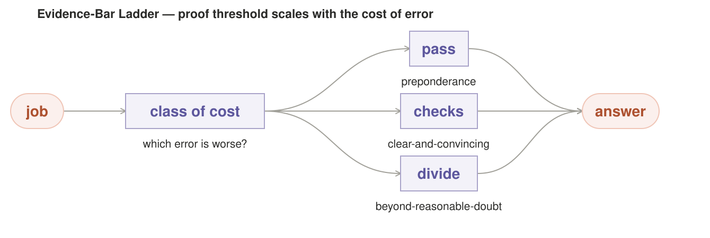

**Intent.** Carry a **ladder of proof thresholds** rather than one confidence
setpoint — classify each request by the *cost of a wrong answer* and *which
error is worse*, then pick the bar: preponderance (one cheap check, ship at a
bare majority), clear-and-convincing (fan-out + verifier),
beyond-reasonable-doubt (full divergence + adjudication + hard no on
ambiguity). This maps the legal evidentiary standards onto the router's
allocation.

**Also Known As.** consequence-priced proof; the cost-of-error ladder

**Motivation.** #13 exposes a single per-class setpoint; #19 prices a *pattern* by
tail risk. Neither asks the question that decides everything: **is
being-wrong-by-acting or being-wrong-by-omitting the expensive failure
here?** A metadata write that's 55% sure is fine; an irreversible external
action at 55% is a disaster. The same confidence number means different things
depending on what's on the line — so the router needs a consequence-priced
bar, not a number.

**Applicability.** Acting and omitting have very different costs and the
proof threshold should scale with the cheaper-mistake direction. Avoid it
when the cost shelf goes stale — drifting into irreversible territory while
the label lags ships past-the-beyond-reasonable doubt.

**Structure.** Coral terminal → purple `class of cost` rank (label: *which
error is worse?*) → three green shelf lanes labeled `preponderance`,
`clear-and-convincing`, `beyond-reasonable-doubt` → coral answer. Caption:
*proof threshold scales with the cost of error*.

**Mechanics.** Each request-class carries (cost, error-bias) in the ledger; the
rank maps that pair to a shelf. Preponderance: one check, ship at a bare
majority — for metadata and copy that's cheap to redo (bias the error toward
acting). Clear-and-convincing: fan-out plus a verifier against ground truth,
ship when the verifier clears — for tool calls and file writes, the middle
shelf that checks before acting. Beyond-reasonable-doubt: full #11-style
forced divergence + adjudication + refuse/escalate on genuine ambiguity — for
irreversible external actions, where the bias is hard *against* acting. The
Type-I/II choice picks the threshold; the ladder makes the consequence
explicit. This is directly the Grid Enterprise consequential-action story: a
fan-out verdict gets hard before it ships, but the shelf — not the pattern —
sets exactly how hard.

**Consequences.** Adds a classification step and a three-way branch per request —
real weight when a class is already well-known (cache the shelf per class in
#17's lane). The ladder is only as good as the (cost, error-bias) estimates;
mislabel a class and you've confidently shipped at the wrong bar. Over-strict
bars on cheap work waste tokens that the preponderance shelf would have spent
on volume.

**Known Uses.** Legal evidentiary standards (preponderance → clear-and-convincing → beyond-reasonable-doubt) and risk-tiered approval in banking/compliance: the first maps cost-of-error to proof; the second gates irreversible actions behind a stricter bar than cheap reversible ones.

**Failure mode.** The cost axis goes stale — a request-class drifts into
irreversible territory (a "preponderance" write starts a process you can't
un-run) while its shelf label lags, and the router ships past-the-beyond-
reasonable work at a metadata bar because no one re-ranked the class. Shelf
assignments must be re-validated on every learner pass, and an under-ranked
shelf is precisely the case #22's evidence barrier should refuse.

**Sample Code.** *(A working sketch, not the shipped stack — every name is a parameter.)*
```python
def evidence_bar(request, cls, ledger, learner):
    cost, bias = ledger.shelf(cls)                    # (cost, error-bias), re-validated on every learner pass
    if cost == "preponderance":                       # cheap to redo -> one check, ship at a bare majority
        return ship_bare_majority(request, cls)
    if cost == "clear_and_convincing":                # tool calls / writes -> fan out + verifier before acting
        return fan_and_verify(request, cls)
    return adjudicate_or_refuse(request, cls)         # irreversible -> forced divergence + hard no on ambiguity
```

**On the Grid stack.** A fan-out of Codex (`exec --json`) writing a config
file to disk sits on the **clear-and-convincing** shelf: fan-out across
`qwen38-27b-mtp` and the cross-vendor `deepseek-v4-flash`, then a verifier against
the config schema before the write lands — biased toward a check before acting,
because a bad config is re-editable. By contrast a request to push code to a
live repo that kicks a deploy (a Grid Enterprise consequential action) lands
on **beyond-reasonable-doubt**: full forced divergence (#11) across the resident
models the box actually holds (2–3 on a single node — a family plus
a cross-vendor counterweight; a real fleet only on a multi-node grid), adjudication,
and a hard refuse/escalate on genuine ambiguity — because "55% sure" on a
deploy is a non-starter. The metadata label the router writes
to every request's audit trail stays at **preponderance**: one check, ship.

---

**Related Patterns.** CVaR (#19) prices spend by tail cost as #23 prices proof by error cost; Verifier Gate (#8) is the default proof bar.

## 24. Type-Revelation Screening — probe a model's type in idle, before trust

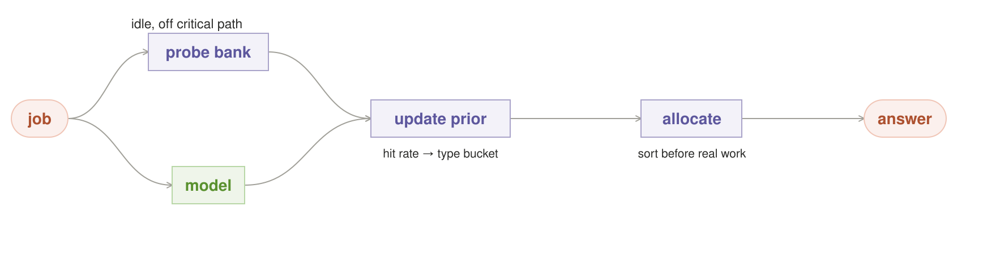

**Intent.** Because the router can't observe a model's real competence, run a
**proactive synthetic battery** — a small bank of calibrated probes per
request-class whose answers *correlate with real-task performance* — and use
each probe result to update a Bayesian prior on the model's type, so it
*sorts* models into type-buckets cheaply before allocating real work. This is
screening from economics of information: the principal can't see the agent's
type, so it offers tests that make the type reveal itself. Run in idle, off
the critical path.

**Also Known As.** probe-based profiling; idle calibration; type-identification

**Motivation.** #18's canary shadows *real traffic* to prove a new model is safe;
#22 gates its promotion on verified outcomes. Both spend real trust before a
winner is chosen. Screening is the complement: it runs *synthetic* probes in
idle to reveal **what kind of model this is, and where it is weak** — before
any real trust is at stake and before a single real request is allocated to
it. Canary answers "is this safe on real load"; screening answers "what kind
of model is this." Because local inference has no marginal API bill and boxes idle between
requests, the exam costs nothing but idle compute.

**Applicability.** You're allocating real work to models you don't know and
can probe their type in idle, before you trust them. Avoid it when the
probes become a signaling game — models that pattern-match the exam's tells
score high on known-answer without real capacity.

**Structure.** Coral terminal → dot → a green probe bank + a green `model`
worker (caption: *idle, off the critical path*) → purple `update prior` (label:
*hit rate → type bucket*) → purple `allocate` (label: *sort before real
work*) → coral answer. Caption: *probe a model's type in idle, before trust*.

**Mechanics.** Each request-class keeps a small bank of calibrated probes —
known-answer questions, planted blind-spots, adversarial reframes — each
pre-validated to correlate with real-task success on that class. Models answer
the battery in idle slots; each hit/miss updates a Bayesian prior on the
model's type, so the router builds a cheap type-map of the fleet (this one is
solid on structured extraction, weak on open-ended synthesis) before real work
is routed. Screening runs entirely off the path a request takes.

**Consequences.** The battery itself is work: each probe must be calibrated
(known answer, correlated, class-specific) or the screening measures nothing.
It measures *type*, not *state* — a model that's fine on probes but degraded
under real load still needs #20's breaker. And it can't see the future: a
model that aced this class last month drifts, which is why probes regenerate.

**Known Uses.** Screening in the economics of information: insurers and lenders run tests that make a hidden 'type' reveal itself (credit scoring, underwriting) rather than pay to observe it directly — the principal can't see the agent's type, so it offers tests that do.

**Failure mode.** The probes become a *signaling* game instead of a screening
test — operators learn the exam as a set of tells (the model that scores high
on "known-answer" by pattern-matching the phrasing rather than reasoning),
the correlation with real performance rots, and the router trusts a bucket
that no longer means what it says. The probe bank's discriminating power
(hit-rate actually predicting real outcomes) must be re-validated the same
way #22 re-validates its beta — otherwise screening is astrology with a
likelihood attached.

**Refinements.** Five build rules keep the picture honest:
1. **Rotate the exam.** Probes refresh on a term (#14's decay) so a model
   can't be gamed by memorizing a static battery, and a bank that stops
   discriminating (hit rate no longer predicting real outcomes, the #22 test)
   is retired.
2. **Stay *mostly* type-driven.** An always-adjudicated model gets lazy, a
   moral-hazard of the shape: occasionally route a cheap real request through
   low-prior models to re-measure them rather than write them off.
3. **Commit preempted updates atomically-or-nothing.** A probe #26 yanks
   mid-generation must not drip a half-run measurement into the type-map —
   it's a garbage partial, and its read-modify-write races the cancellation,
   so serialize the prior commit per {model, class}.
4. **Make the type-map durable state, not RAM.** A box reboot must not
   cold-start screening from a uniform prior or the "off the critical path"
   economics vanish — persist the prior per {model, class} in the ledger
   (router-execution.md) with #22's durability.
5. **Tie a probe's validity to the slack it ran in.** A probe on a contended
   slot measures slowdown, not competence, and must not count as a clean hit.

**Sample Code.** *(A working sketch, not the shipped stack — every name is a parameter.)*
```python
def screening(probe_bank, model, klass, prior, slack, resident):
    if len(resident) < 2:                             # fewer than two resident models -> refuse to advertise itself
        return prior
    if not free_slot(slack):                          # probes run only in idle, never displacing the live model
        return prior
    hit = probe_bank.run(rotated_exam(klass), model)  # rotate the battery; a static exam becomes a set of tells
    if contended(slack):                              # a probe on a contended slot measures slowdown, not competence
        return prior
    prior = bayes_update(prior, hit)                  # atomic-or-nothing commit per {model, class}; preempted = no half-run
    persist_durable(klass, model, prior)              # type-map lives in the ledger, not RAM, for reboot recovery
    return prior
```

**On the Grid stack.** During an idle window the router runs its probe bank
only on a free seat (behind the OpenClaw lane, cancelled the instant a real
request lands). Three probes per class — a known-answer extraction, a planted
blind-spot (a citation that doesn't exist), an adversarial reframe — and
calibration shows `qwen38-27b-mtp` hits ~0.9 on extraction but ~0.4 on
reframes while `laguna-s-2.1` is the flip. Over a few idle slots a fresh
type-map forms — route extraction to `qwen38-27b-mtp`, edge-case synthesis to
`laguna-s-2.1` — before real traffic goes down those paths. On a single box,
probing a non-resident model forces a VRAM swap, so probes stay bounded to
what is already resident or wait for a free seat rather than displacing the
live model. And the type-map only earns its calibration when the box holds two
or more resident models worth distinguishing — below that bar, screening
refuses to advertise itself.

---

**Related Patterns.** Canary (#18) is trust earned on live traffic; Thompson (#27) and Pheromone (#14) consume the type-map; Slack-Stealing (#26) pays for the probes.

## 25. Condorcet Pairwise Pooling — head-to-head beats plurality on a three-way split

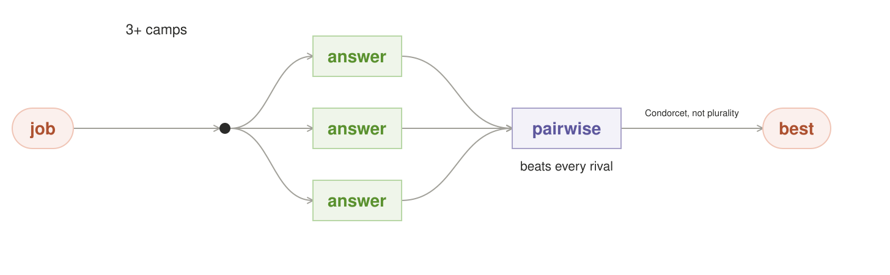

**Intent.** When N models split a genuinely ambiguous request into **three or
more camps**, don't count plurality — run **pairwise head-to-head comparisons**
among the divergent answers and return the one that beats every rival
pairwise. This is the Condorcet winner from social choice, the pooling rule
for the split that plurality gets wrong.

**Also Known As.** pairwise aggregation; social-choice pooling

**Motivation.** #2 pools by plurality — and it fails exactly when local models
split 3+ ways on a request (a realistic mix: two sizes of local model with
different inductive biases, plus a drift of opinion, land on three mutually-
exclusive readings). Plurality crowns the 4-vote faction even when each of the
other two camps would rather have *each other's* answer than the plurality
winner — the "4/3/3 trap," where the plurality lead is not the group's
preferred answer. #7 can't run on non-numeric answers; #11 forces divergence
but still pools by vote. Condorcet is the one pooling rule built for this
failure, with Arrow's impossibility as an honest warrant: no aggregation is
perfect, so choose the aggregation by request shape.

**Applicability.** N models split a request into 3+ camps and head-to-head
beats plurality. Avoid it when the camps aren't truly independent — a
correlated pair plus the incumbent's echo still hands the win to a shared
blind spot.

**Structure.** Coral terminal → dot → three green `answer` boxes (label:
*3+ camps*) → purple `pairwise` node (label: *beats every rival*) → coral
`best` terminal (label: *Condorcet, not plurality*). Caption: *head-to-head
beats plurality on a three-way split*.

**Mechanics.** First generate and deduplicate `C ≥ 3` candidate answers. After
the candidate set exists, each of `V` voters receives the same anonymized
candidates and makes **one second-phase ranking inference** that returns a
complete preference order. Those are `V` additional model calls unless a
trusted deterministic ranker supplies the rows; there is no honest way for an
original generator to rank candidates it had not yet seen. The router then
computes the `C(C−1)/2` pairwise contests locally—no model call per pair. A
candidate that beats every rival is the Condorcet winner. Cycles use an
explicitly reported Copeland or Schulze fallback; a tie refuses/escalates. A
missing ranking row is retried or the round is refused, unless the router can
prove the winner is mathematically irreversible for every possible completion
of the missing rows.

**Consequences.** Needs each voter to state a *preference order*, not one vote—
more work per voter and it asks workers to rank answers that may include
outputs they consider wrong. The critical path adds `V` ranking inferences;
the local tally costs `O(V·C²)` arithmetic. Bound or parallelize the ranking
phase or it becomes the join's straggler. The tournament is meaningless if the voters
aren't actually independent (the pool must be forced diverse, #11, or it just
tallies correlated echoes). A cyclic preference set is real — the fallback is
where this pattern can quietly degrade into plurality by another name
(report `usage.pooling: pairwise|borda|copeland` so the caller sees when the
Condorcet promise wasn't met). For its narrow trigger — a genuinely ambiguous
request that splits **three or more mutually exclusive camps** on a box that
holds enough independent models — pair it with #8's or #23's gate: the
tournament must not crown the most fluent camp over the most correct one.
Hold it as a **non-default leaf behind #5**, selected only for that trigger,
not a shape #5 auto-uses on routine traffic.

**Known Uses.** Ranked-choice / social-choice voting and Wikipedia's pairwise Condorcet methods: preference orders resolved into a tournament whose winner beats every rival pairwise, with Copeland/Borda fallbacks and Arrow's impossibility as the honest warrant for choosing by request shape.

**Failure mode.** The voters were never truly independent — three "camps"
turn out to be two correlated models plus the incumbent's echo (the same
shared blind spot #11 warns about), so the Condorcet winner is just the
majority faction relabeled, and the extra machinery bought nothing but
confidence. Independence of the voter pool must be *measured* (#12's
covariance / #11's negative selection), not assumed, or the tournament certifies
a consensus that was never there.

**Sample Code.** *(A working sketch, not the shipped stack — every name is a parameter.)*
```python
def condorcet_pool(request, generators, voters):
    candidates = deduplicate(generate_candidates(request, generators))
    if len(candidates) < 3:
        return ordinary_pool_or_refuse(candidates)
    orders = []
    for v in voters:
        row = extract_complete_order(v, anonymize(candidates))  # one second-phase call per voter
        if row is None:
            row = retry_complete_order(v, candidates)
        if row is None:
            return refuse("incomplete preference matrix")
        orders.append(row)
    matrix = pairwise_tournament(orders)                  # O(V*C^2) local arithmetic
    winner = condorcet_winner(matrix)
    if winner is not None:
        return winner, usage(pooling="pairwise")          # the Condorcet promise, met
    top = copeland_or_schulze(matrix)                     # cyclic preferences -> named fallback
    if tie(top):
        return escalate()
    return top[0][0], usage(pooling="copeland")           # report the actual fallback
```

**On the Grid stack.** Ten forced-diverse voter samples spanning at least three
independently evaluated model/prompt families form three candidate camps,
4/3/3. After those candidates are known, all ten voters rank the anonymized
set, so the example pays ten second-phase ranking calls; three models alone
cannot produce a 4/3/3 vote. The router tallies the three pairwise contests
locally and reports a named fallback on a cycle. On one GPU the ranking calls
serialize, so the operator must budget wall-clock and may refuse an incomplete
matrix. The trigger is three candidate camps plus a defensible voter-
independence story, not “three resident models.”

---

**Related Patterns.** Fan-Out (#2) is plurality pooling #25 replaces; Negative
Selection (#11) engineers diversity and Markowitz (#12) measures/downweights
covariance for numeric estimators. Neither guarantees voter independence.

## 26. Slack-Stealing Scheduler — run background work only in the idle a live request leaves free

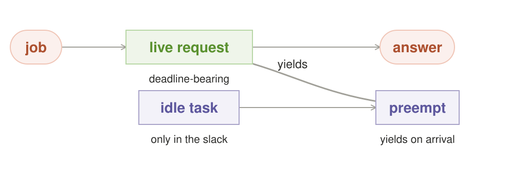

**Intent.** Run best-effort background work in bounded quanta only when a
conservative capacity reservation says it can yield before foreground service
is at risk. Foreground always has priority; background may not evict a resident
foreground model, and only jobs with a measured cancellation/drain bound are
eligible.

**Read this pattern as a conditional prerequisite.** #18/#24 shadow or probe
work on a shared accelerator needs #26 **or equivalent isolation**: a dedicated
device or explicit maintenance window. #22 can learn from ordinary verified
traffic; only deliberate background evidence generation needs this scheduler.
Checkpoint and atomic-commit interfaces must be designed before preemption, but
many inference backends cannot resume after releasing KV cache. Prefer short,
idempotent quanta and commit only completed outcomes unless the backend proves
resumability.

**Also Known As.** preemptible background scheduling; idle stealing

**Motivation.** Three patterns are invalid today because "run in idle" is not a
mechanism. #24's probe bank and #22's learner assume a box that sleeps between
requests; #18's shadow assumes a spare GPU. None is actually schedulable — a
probe that starts at 2pm on a contended node measures *slowdown, not
competence*, and a learner accumulation that can't be cancelled holds the GPU
the first afternoon request needs. Slack stealing is the one shape the
catalog's gap analysis keeps calling for by name and never specifies. It's
also the only pattern whose whole job is *not choosing an answer*: it makes
choosing answers possible without contending with them.

**Applicability.** Learners, probes, and shadows assume an idle executor
that doesn't exist — you need background work only in preemptible idle.
Avoid it when background work isn't actually preemptible — at the first
traffic spike, low-priority 'load' steals VRAM from the live request.

**Structure.** Two lanes into one GPU. Foreground: a coral request terminal →
green live workers (each with a deadline) → coral answer terminal. Background:
green idler tasks (probe, learner, shadow) that run only inside the slack gap
between deadline-bearing work, shown dashed and preemptible — a coral preempt
signal slicing back into the idle gap the instant a live request arrives.

**Mechanics.** EDF is a foreground dispatch heuristic, not a proof of zero
interference. Classical EDF optimality applies to a feasible set of independent,
preemptible jobs on one processor with known release times and execution
requirements. GPU inference violates those assumptions through non-preemptible
kernels, batching, uncertain runtimes, model-load/VRAM costs, and delayed
cancellation. Admit foreground work against a conservative reservation:
remaining p99 service time + model-load/restore time + measured cancel/drain
latency + guard band. Within an eligible resident-resource class, dispatch the
ready foreground job with the earliest deadline. Start one resident background
quantum only when that reservation remains intact and the quantum plus
worst-case drain fits the measured margin. On a foreground arrival, stop
issuing new decode work and yield at the next safe boundary. A background job
without a bounded yield time is non-preemptible and cannot run in stolen slack.
Account completed, cancelled, restarted, drain-time, and restore-time work.

**Consequences.** Slack stealing offers **bounded, measured interference**,
never “harms nothing.” Cancellation and restore overhead consume foreground
margin; prediction error can still miss an SLO. Saturated boxes starve
background work, so a learner that requires progress needs dedicated capacity
or a maintenance window. Partial generation is discarded unless the backend
explicitly supports a durable, restorable checkpoint. The gain is disciplined
use of otherwise idle resident capacity, with the cost and interference made
observable instead of wished away.

**Known Uses.** Real-time earliest-deadline-first schedulers and Kubernetes background/spot preemption: work is dispatched by deadline and only idle capacity is spent on background jobs that preempt cleanly — the local-box analog that funds probes, shadow runs, and learner accumulation.

**Failure mode.** Background work is treated as low-priority *load* rather than
preemptible *slack*, so at the first traffic spike (or the first non-preemptible
learner pass, or a probe battery that over-commits VRAM) it contends with live
requests at the worst moment instead of yielding. The learner's accumulation
and the probe results — measured on a contended node, mid-generation, during a
slowdown — are then trusted as if they were calm measurements. The router
believes it has a background path that doesn't exist, and the #22/#24 promises
it made on top of that path silently rot.

**Sample Code.** *(A working sketch, not the shipped stack — every name is a parameter.)*
```python
def slack_scheduler(queue, idlers, inventory):
    while True:
        if job := earliest_deadline(eligible_foreground(queue, inventory)):
            reserve = p99_cost(job) + restore_cost(job) + CANCEL_GUARD
            run_foreground(job, reserve=reserve)
            continue

        bg = next_resident_idler(idlers, inventory)
        margin = conservative_foreground_margin(inventory)
        if not bg or bg.quantum + bg.max_drain + GUARD > margin:
            wait_for_work()
            continue

        handle = run_background_quantum(bg)
        if foreground_arrived():
            handle.request_cancel()
            handle.wait_for_safe_boundary(timeout=bg.max_drain)
            checkpoint_if_supported_else_discard(handle)
```

**On the Grid stack.** A single GPU keeps `qwen38-27b-mtp` resident for live
traffic. The inventory measures p99 foreground service, model-restore cost,
and maximum decode-drain time. #24 gets a 2-second idempotent probe quantum only
when that quantum plus its measured drain fits the conservative margin. On a
live arrival the scheduler requests cancellation immediately and the seat
yields at the next measured safe boundary; a partial result is discarded unless
the engine proves it can restore it. Telemetry reports the drain and any SLO
impact. The box can learn around the clock, but never claims that learning is
free of latency risk.

---

**Related Patterns.** Canary (#18) and Screening (#24) use #26 when sharing an
accelerator; Trial Sequential (#22) can learn from ordinary verified traffic;
dedicated capacity or a maintenance window is an equivalent isolation policy.

## 27. Thompson Posterior Router — route by sampling each model's posterior, not by argmax

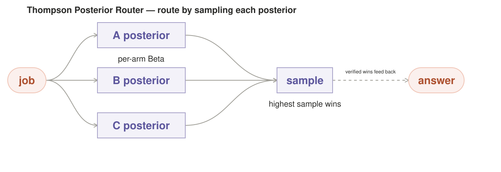

**Intent.** Replace #14's greedy reinforce-and-decay learner with a **Bayesian
exploration policy**: keep a reward posterior per {pattern, model, template}
per request-class, updated from the canonical verified-outcome ledger, and
route **by sampling from the posteriors**—pull the arm whose
sample is highest — rather than by taking the current argmax. The result: a
losing arm is still pulled with probability proportional to its chance of
actually being best, so the router never fully abandons a contender and the
evidence concentrates on the true winner as it accumulates.

**Also Known As.** posterior sampling; bandit exploration

**Motivation.** #14 is exploitation-only: it reinforces verified winners and decays
the rest, and its "annealed exploration" temperature still biases toward
winners — it never deliberately spends a run on a loser. So #14 **ratchets into
a local optimum**: once a class discovers pattern A works, the router keeps
pulling A, the evidence that B might beat it never accumulates, and #22's
frequentist barrier (correct in itself) only *locks the ratchet in further* —
it gates promotion but adds no exploration force to find the next winner.
#24's moral-hazard caveat ("occasionally route a cheap real request through a
low-prior model to re-measure") is an ad-hoc epsilon — a hand-tuned fidget with
no budget, no cost accounting, no stopping rule. Thompson sampling is the
principled fix: it makes the *probing itself* be the posterior update (#24's
Bayesian type-map), and it gives the router an exploration force with a priced,
self-tapering budget.

**Applicability.** #14's greedy learner ratchets into a local optimum and
never escapes — you want to sample each model's posterior, not argmax.
Avoid it when the labels feeding the posterior are wrong — a rubber-stamped
verifier concentrates confidence on the shared prior, not the truth.

**Structure.** Coral request terminal → a bank of `posterior` purple nodes (one
per candidate arm, each a Beta distribution) → a `sample` draw node (pull each
posterior, route to the highest sample) → green worker(s) → verified-outcome
ledger (coral, append-only) feeding back into the posterior bank. The drawn
loser is shown still getting an arm label — it loses the *draw*, not its
lifetime.

**Mechanics.** For a consistently defined Bernoulli verified-success label,
each {pattern, model, template} per class may hold a Beta(a,b) posterior over
`p_win`. Continuous utility or cost needs a reward model with the appropriate
likelihood; Beta is not a generic posterior. Updates come from the canonical
outcome ledger, with labels certified by the cross-cutting tool-grounded
authority, often invoked through #8. #22 may gate a later promotion; #26
supplies capacity and never labels correctness.
The `(a,b)` update is a **read-modify-write that must be serialized per arm** —
two concurrent verified outcomes read then write the same counts and the loser
is silently lost, so lock per-key or do it as one atomic ledger append +
recompute, and let every outcome ride #22's exactly-once keyed append (a client
retry that double-appends inflates a Beta count twice). Routing is a *random
draw*, so #27 is the hardest pattern for `round_id` determinism: replaying
same-request→same-answer means replaying the RNG stream and the posterior state
*as it was at that round*, not just a policy snapshot—the canonical class-state
ledger is the substrate for it.
Routing: for each arm, sample once from its Beta(a,b); route to the arm with
the highest sample. A loser with high uncertainty is still sampled high
sometimes — this is what keeps exploration alive — while a well-measured loser
(steep posterior, low mean) almost never wins a draw, so the router converges
on the true best arm without ever hard-banning a contender. The exploration
rate is *self-tapering*, not self-ending: uncertainty buys a draw and
measurement reduces it, but Thompson sampling continues to pull suboptimal
arms with decreasing frequency. Live exploration still needs #19/#23 budget
and deadline caps. It
_is_ #24's type-map (the probes are the posterior updates) and it composes with
#22 (the barrier gates *promotion*; Thompson gates *pulling*) and with #24's
screening (same posterior, one shared update loop, not a separate screen then
a separate router).

**Consequences.** Thompson *actively tries losers* — it spends real request tokens
on arms the router currently believes are worse, which is wasteful on a noisily-
varying class until the posterior narrows, so pair it with a cost-aware cap
(#19). Offline replay and shadow pulls can use #26 slack. Learning the live
request distribution requires a small, explicitly budgeted online exploration
share; background probes are not equivalent to routed live traffic.
And on a single box the state must be *scoped to what can actually run*: a bank
of posteriors per {pattern, model, template} per class, all durably persisted
and replayable, is a large keyed store a 1-seat router now has to hold when the
same box has too little traffic for most arms to ever steepen a posterior —
scope the arms/classes, and **persist lazily**: only arms actually touched get
durable keys, or the replay substrate becomes heavier than the routing it
serves. On non-stationary classes (the request mix drifts, the best arm moves),
a plain Beta keeps an old winner's mass and strangles the newly good arm — use
the sliding-window / non-stationary variant so a stale winner's weight rots to
zero and the fresh arm gets pulled despite little history. The posterior is
only as good as its labels: a corrupt verifier (#8's rubber-stamp) poisons the
updates into confident wrongness, so the ledger must be fed by the single
tool-grounded authority, not by model-vote "verified." And the draw must
respect #20's breaker state and #26's capacity — never sample onto (or promote,
via #22) an arm that's quarantined or non-resident. Report the exploration
itself (`usage.thompson_draws`, per-arm posterior) so the cost of learning is
visible, not hidden in total tokens.

**Known Uses.** Thompson/posterior sampling in contextual bandits draws once per
eligible arm and pulls the highest sample. Exploration concentrates as evidence
arrives but never literally terminates. #27 transfers that machinery to a
per-{pattern, model, template} policy bank.

**Failure mode.** The labels feeding the posterior are wrong — a verifier that
rubber-stamps a shared prior, a ledger fed by agreement rather than by the
ground-truth authority — so Thompson concentrates confidence on a *wrong* arm
with the same machinery it uses to find the right one. The router then
explores less (the bad arm measured "certain"), #22 sees enough "verified"
outcomes to promote it into a confident default, and the class is stuck serving
a fluent wrong answer while the actual winner starves. Alternatively the class
is non-stationary and no one remembered the sliding window — a past winner
keeps its posteriors and the draw never reaches the arm that now wins, which is
#14's ratchet wearing a Bayesian coat.

**Sample Code.** *(A working sketch, not the shipped stack — every name is a parameter.)*
```python
def thompson_router(request, klass, arms, posterior, breaker, capacity, ledger):
    eligible = [a for a in arms
                if not breaker.open(klass, a) and capacity.fits(a)]
    if not eligible:
        return divert_or_refuse(klass)
    draws = {a: posterior[klass, a].sample() for a in eligible}
    arm = max(draws, key=draws.get)
    answer = run(arm, request)
    label = ground_truth_authority.verify(request, answer)
    ledger.append_once(verified_outcome(request.id, klass, arm, label))
    posterior[klass, arm] = beta_update(posterior[klass, arm], label)
    return answer, usage(thompson_draws=draws, selected_arm=arm)
```

**On the Grid stack.** A request-class is split between `qwen38-27b-mtp` and
the bigger `qwen36-35b-a3b-mtp`; an older habit has the router favoring A for
"interpretation" requests. Its Thompson bank says A's posterior is confident,
B's is wide — so B *still gets pulled* on class-23's harder requests, proves
faster on the tail, and the posterior concentrates onto B within a week —
where #14 would have kept the confident-but-suboptimal A forever because it
never funded the experiment that dislodges it. Offline replay and shadow pulls
use #26's slack; a small, explicit live-exploration share measures the real
traffic distribution. #22's barrier gates an eventual promotion (append-
only, pre-registered, refusal-as-success); #8's ground-truth authority labels
the ledger; if the request mix later drifts the sliding window rots A's stale
mass to zero and B's fresh wins get pulled again. Exploration is accounted
(`usage.thompson_draws`), pinned by `round_id`, and the posterior is periodically
recalibrated against durable, independently verified outcomes.

---

**Related Patterns.** Pheromone (#14) is the greedy learner #27 escapes; Trial Sequential Analysis (#22) locks in the evidence #27 concentrates; Screening (#24) seeds the priors it samples.

## Cross-cutting: the machinery every pattern runs on

Across all twenty-seven patterns, a few gaps keep reappearing that don't
belong to any one pattern — they're the *layer under* the patterns. None of
them change a pattern's shape; they're the guarantees a
router must hold for *any* of them to be trustworthy. **The concrete sketch of
how the router executes all of this — the fixed-concurrency executor, the
live-node inventory, the background-idle scheduler, the admission brake — is
`router-execution.md`.**

**Three exits, not one.** Every pattern's terminal is `answer`. That's the
catalog's single most dangerous structural fact: a node that can only emit an
answer is forced to lie the moment the honest answer is "I don't know." Add
the **abstain / escalate exit** to every terminal — answer, *or* refuse
(stop spending, say "cannot answer confidently"), *or* hand up (tool check,
bigger model, human). The catalog's own honest failure modes become safe the
moment "I don't know" is a legal output.

**Independence is engineered, not assumed.** Every vote/ensemble/debate
signal depends on its samples being independent — but same model + same prompt
+ same temperature re-samples one distribution, and "unanimity" from it is
fake. Any pattern that trusts agreement must *prove* its samples were
divergent (force it at the fan, as #11 does, or don't count it as testimony).

**Tool grounding is the only external-truth warrant.** Agreement between
models confirms the shared prior, not the fact. The only check that breaks the
prior for free is one grounded *outside* it — a deterministic rule, a code run,
a calculator, a schema validator, a lookup. Prefer tool-grounded checks for
any consequential verification; treat agreement as a consistency signal, never
as truth.

**Decision nodes are as unreliable as workers, and must be treated so.** The
patterns spend real redundancy on green workers and trust single purple nodes
(the ranker, the vote, the planner, the judge, `best`, the check) on faith.
Make decision nodes deterministic where possible — a majority vote is
arithmetic, a mean is arithmetic, best-of-N is a comparison — and calibrate
the genuinely evaluative ones (judge, verifier, strategy) against outcome
ledgers: did this node's call turn out right? Measure it or don't trust it.
And do not mistake a *metric* for arithmetic: #15's divergence-shape test and
#11's embedding diversity are still estimators, and belong in the
metric-determinism class below.

**Loops are bounded; exhaustion escalates.** Retry/debate loops must have a
hard cap, and expiring the cap must produce refuse/escalate — never a forced
pick. Unbounded "free" compute is a self-inflicted DoS on a local node. (#8,
#9, #13 all carry this.) **The bound must be wall-clock as well as sample
count** — a caller experiences time, not runs, and under GPU contention a
capped-X-sample loop can still hang p95. Bound by "T ms *and* K, whichever
first," report which fired, and on the time cap emit the best answer now with
its abandoned confidence rather than holding the request open. (#13's setpoint
is the named case: make it time-boxed, never confidence-boxed.)

**Node failure is a first-class input; one failure domain.** Local hardware
dies, OOMs, and times out mid-generation — a fan-out that loses a worker
silently reports N−1 agreement as if it were N. Detect and rerun the lost
sample elsewhere, and replicate across *both* hosts and model families
(correlated failure = one failure domain; a node and its mirror on the same
rack die together). This is #16's substrate.

**Capacity is a resource, not free.** "Tokens are free" hides the real cost:
throughput and wall-clock aren't. A fan-out on one GPU is 3× wall-clock every
other request queues behind, and on a real grid it occupies nodes a paying
customer rents. The router owns a *time* budget and must be able to emit a
lower-confidence answer now rather than keep computing.

**The fan shape is computed from live capacity, not named.** Every fanned
pattern (#2, #3, #4, #6, #7, #9, #11, #12, #15, #21, #25) says "run N in
parallel" — but on one consumer GPU loaded with one model, N calls queue, and
on a box with N models in VRAM they contend. **fan-out = min(N, free seats)
parallel, the rest queued**, and N itself must be sized from live free seats
(#5's gap against ROUTER.md's "no live inventory"). A pattern that wants
*different families* per lane pays the extra price in **VRAM swaps**: three
families that don't co-reside are three serial load/unload cycles, each costing
seconds of model-load time that lands on the critical path — so a three-family
fan is not "3× wall-clock," it is 3× wall-clock plus the swap budget, and the
latency number every parallel pattern quotes has to include it. A strategy
layer that cannot see free seats must downgrade parallelism rather than
schedule what doesn't exist. This one sentence should be on the cover: *every
fan-out is a pair of joins — spawn then pool — and the joins (stragglers,
partial failure, cancellation) are the hard part, nowhere specified.*

**One execution primitive; per-call timeout and cancel every call.** The
catalog assumes a spawn/join executor it never names. Give the router **one
execution primitive — a per-request task graph with fan-in/fan-out over a
fixed-concurrency executor** — and all 27 patterns become scheduled forms of
it. Every model call gets a **per-call timeout** (a wedged read must not wedge
the join) under a **per-request deadline** (the request expires and returns the
best answer now). **Cancellation is the cheapest primitive and it's missing**:
stragglers, failed lanes, hung reads, and speculative backups are all slots
cancellation frees — early-exit any join once it can (a majority vote need not
wait for all N; a tournament need not wait for the slowest preference-order),
and declare a worker failed past a straggler budget.

**Idle is a first-class schedulable resource — budgeted, preempted, and
accounted.** "Boxes sleep between requests" is the catalog's license for
background work — #18's shadow, and the new #22's learner accumulation and
#24's probe bank — but **"idle" is not a mechanism until the router has a
background executor with three properties**: (a) a *definition* of idle (a
free seat), (b) *preemption* (a background task is cancelled the instant a
request needs its seat — a probe in flight must never hold the GPU when the
first afternoon request lands), and (c) a *VRAM-residency bound* (never swap a
model a live request needs, and never let a probe battery of different models
collectively exceed VRAM). Background work that can't be preempted is just
unbudgeted load that contends with the hot path at the worst moment; a
probe/learner/shadow that runs on a contended node measures slowdown, not
competence. Account it (`usage.probe_runs`, `usage.shadow_runs`,
`usage.learner_accum`) so eval cost is visible. **Build the idle scheduler
before #22/#24's promises are real.**

**Admission control; degrade, never deadlock.** Five of the newest patterns
(#13, #15, #16, #19, #20) *raise* spend under duress — none of them alone
knows the grid is already saturated, so a flash crowd can stack escalating
loops on one contended node and turn a load spike into a self-inflicted
brownout. The machinery needs a **shared, request-level admission brake**:
before any pattern scales up, it checks queue depth / wall-clock budget and,
when saturated, *degrades* — fewer samples, the faster pooling rule, a
lower-confidence answer now — rather than piling on. #19 is the most dangerous
omission from the roster: its *entire* mechanism is "spend more on the
bad-tailed class," which is exactly the case where saturation and a broken
node should make you spend *less*. (#19 checks the brake before `N =
budget / p_tail` escalates.) "Spend more where the risk is" is the local
router's whole point, but only while there's *capacity to spend*; at the
margin the correct move is the opposite. (#20 is the per-member form; the
admission brake is the grid-wide form. A cache stampede is the same disease in
one place — when N identical requests miss #17 at once, only one should
compute and the rest wait on it, not all N recompute into a thundering herd.
Single-flight the miss.)

**Tail difficulty is not tail corruption.** The catalog's sharpest internal
contradiction is between two patterns on the same class-state ledger: **#19
spends *up* on a class whose tail got bad**, while **#20 quarantines the
member that *made* it bad.** Left unwired, CVaR buys more insurance on a
poisoned class the breaker just cut off — it double-downs on a corpse. The
ledger must separate **tail difficulty** (genuinely hard requests, worth more
samples) from **tail corruption** (a bad tail *inflated by a broken member*,
which a breaker-open makes you spend *less*, not more). Every pattern that
reads the tail reads this split; #19's escalation pauses for any member whose
tail contribution is breaker-open and recomputes N from the remaining healthy
pool — it must never price more samples of the exact member #20 is
quarantining. Until this split exists, #19 and #20 actively fight and the
whole recovery floor is unsound.

**Observability is the contract.** Every orchestrated request returns, inside
the OpenAI-compatible envelope: the pattern chosen, why, how many runs, which
models/nodes, per-work-item time, total tokens. Never collapse N runs into a
token count — for Grid Enterprise this is the invoice. Streaming is a hard
mode: fan-out/ensemble/debate can't SSE, so refuse or degrade those patterns
for streaming requests and say which mode they got. Three accounting
extensions the stateful patterns force: split **useful vs cancelled runs**
(`runs_total` / `runs_useful` / `runs_cancelled`) so speculative waste and
loop over-spend show up instead of hiding in total tokens; define the
**cache-hit envelope** (#17's `x-grid-cache` markers) because a hit runs no
pattern and otherwise the cheapest, most-repeated answer class reports nothing;
and carry the pattern-specific markers the catalog names (#11 `arity`, #12
`output_blend`, #13 P/I/D terms, #14 `policy_round`, #15
`escalation_depth`/`divergence_shape`) so an escalation is visible when it
happens, not inferred afterward.

**Determinism is a control, not an accident.** Same request → same answer is a
real need for caching and retries. Accept a seed/pin per pattern (and on #5
itself) and report a replay key that reproduces the exact decision path. But
there are **two different determinisms to break apart**: *arithmetic*
(vote, mean, comparison — reproducible from a seed alone) vs *metric*
(#11's embedding diversity, #15's divergence shape, #12's covariance weights —
estimator outputs that a seed does *not* pin). Metric-deterministic nodes are
still models; treat them as workers, pin their embedding/estimator, and
calibrate them. And once patterns become **stateful** (#12 ledger, #13
I-history, #14 pheromones, #17 cache, #18 equity, #19 tail, #20 breaker)
same-request→same-answer is unreachable from a seed alone — determinism there
means a **policy snapshot**: `round_id` on the state plus the seed, with a
frozen snapshot for replays. The stateful patterns must therefore log **every
state-changing decision as a `round_id`-stamped event** — a breaker tripping
open mid-request changes the request's own sample population, and a replay
that crossed that trip boundary must reproduce the *actual degraded path*, not
the pre-trip plan: the open/cooldown transition, an equity graduation, a
canary evaluation boundary all land in the ledger as events, not as silent
state mutations.

**Hardening sits upstream of all patterns.** The catalog's "adversarial" is
model-vs-model dissent, not request hardening. Injection attempts and
jailbreaks must be screened at the edge, before any pattern runs — or a local
router wired to agents with tools becomes a free compute amplifier for
attacks.

**Side effects are idempotent and single-execution.** Wherever N samples run
(#2, #6, #16), only one may *act*. Brute-Force and fan-out with tool-using
workers must cap N and let only the selected worker fire — N tries is only
safe if it's N reads. And #16's duplicate is a second actor you can't recall:
it must be a read-only copy (pure generation) whose external effects run only
on the committed first-to-finish. (#16's first-to-finish also selects whichever
worker happens to finish — fine for read-only work as long as its winner still
rejoins any surrounding vote rather than pre-empting the quorum.)

**Cross-request state has a lifecycle and a boundary.** #11–#25 turn the router
stateful — ledgers, pheromone tables, a semantic cache, an equity ledger, a
breaker state. None of that state is implicitly forever or implicitly shared.
Every stateful pattern needs a stated **state-domain boundary** (per-tenant on
Grid Enterprise — tenant A's outcomes must never feed tenant B's routing, or
the invoice *and* the reproducibility both break), a **retention/reset path**
(what clears a ledger, what freezes a policy round), and a durability story so
a node loss is a cold-start replayed from log, not a silent forgetting. On a
single box that durability story has to face its own limit: without replication
the WAL *is* the node, so one disk death silently destroys every ledger,
equity, posterior, and breaker state at once — and "replay from log" is
impossible when the log itself is what died. The single-node answer is a
**periodic WAL snapshot/export** (to a second disk, the Personal AI Rig, or
object storage) with a stated retention, so "the ledger is the only truth" is
*recoverable*, not a single point of total loss; state the export cadence and
retention once, under this boundary, and every stateful pattern inherits it.
Two stateful guarantees the newest patterns lean on:

- **A live-node watchdog, not just a retry budget.** #{16,18,20} assume the
  router knows which nodes are actually alive — a fan-out, a shadow canary,
  and a breaker are all blind if the inventory says a dead node is a
  candidate. The router must hold a **live-node inventory** (heartbeat, load,
  per-node latency percentile), treat node loss as a first-class input
  (re-route, re-span the lost sample), and never quarantine "onto nothing",
  speculate onto a node that isn't there, or run a shadow on a saturated GPU.
  **Shadow evaluation is gated on the inventory too** — #18's canary shouldn't
  double grid contention on a busy single node; defer or sample its shadow
  rounds when the node is saturated, and report them (`usage.shadow_runs`,
  per member) so invisible eval cost doesn't hide from the invoice. This is
  the substrate #16's "different node," #18's shadow, #20's "second lane,"
  and #19's per-class tail all assume and none of them build.
- **Reputation is earned, auditable, and per-member.** Every "trust this
  member more" signal — #18's equity, #14's pheromone, #12's weights — is
  really one scalar: *the member's measured outcome record*. Rather than each
  pattern re-deriving it privately, expose a shared **reputation ledger** per
  member+class (wins vs. tool-grounded ground truth, decayed, signed by the
  verifier that issued each label), and let every trust-weighting pattern *read*
  it. Two rules keep it honest: the labels feeding it come from the single
  independent ground-truth authority (below), and a member with high
  reputation but zero recent *independent* checks has stale trust — it must
  re-verify (#18 again) rather than coast.

**One ground-truth authority.** The most consequential gap the whole catalog
keeps hitting: #8's verifier, #14's "verified," #17's "verified" write-back,
#15's divergence classification, #18's equity compare, #12's covariance labels
all need the *same* act of judgment — *is this answer actually right?* — and if
no single authority owns it, the router gets divergent verdicts from
five purple nodes and rubber-stamps propagate everywhere (one careless check
poisons the cache, the pheromones, the equity ledger at once). The fix is one
**independent, tool-grounded ground-truth authority** that every "verified /
error / correct-wrong" label in the machine is drawn from — a deterministic
rule, a code run, a lookup, a schema check, a shadow of a premium model — and
*no* pattern issues a trust-affecting label from an ungrounded model vote. A
decision node may *propose* a verdict; only the authority *certifies* it.
Nothing in the catalog is sound until this single source exists.

**There is one class-state ledger, not five private ones.** #12's covariance
rows, #13's error history, #14's pheromones, #17's cache metadata, #18's
equity, #19's per-class tail, #20's trip state — these are not seven different
databases, they're **one append-only state ledger keyed by request-class** that
every stateful pattern reads and the trust-scoring patterns write. If each
pattern keeps its own store, they drift (the pheromone table forgets what the
cache knew, the breaker trips on a different history than CVaR budgets from)
and state ownership is undefined. A single replicated append-only ledger gives
the router one write path, one replay log (for the `round_id` policy-snapshot
determinism), one per-tenant boundary, one retention job — and every pattern a
guarantee that the history it reads is the history everyone else writes. It is
the one primitive the whole stateful half of the catalog is missing. And the
replication stance is stated once so no stateful pattern has to: **there is no
replication — on a single fsync'd box, the ledger is the only truth.** Every
#22 look-count, #24 probe-commit, #27 posterior, and #18 equity entry lives in
that one truthful log and nowhere else; a consumer box gets its integrity
from the WAL of that one copy, not from a second copy that doesn't exist.

**The one-sentence through-line:** the eval reviews all converged on the same
headline — the first ten spend samples on workers while trusting the single
decision node that decides the answer. The machinery section is the other half
of the design: **workers earn samples because they're unreliable; decision
nodes are equally unreliable, so make them deterministic, calibrate them
against outcomes, ground the hard cases in tools, and never let one be the
confident last word.**

---

## Running these patterns

This is a **design catalog, not a library** — there is no binary to install.
The patterns assume you already have a local, OpenAI-compatible inference
endpoint that can dispatch by model name (Grid and similar routers do this, as
do llama.cpp / vLLM servers behind a compatible shim) and, for the
agent-layer shapes in
[`agent_orchestration_patterns/`](../agent_orchestration_patterns/README.md),
harnesses that expose an act-gate (Codex sandbox, Claude Code `--no-tools`, a
tool-scoped ACP harness). Reading the
shape is the point here; reproducing a specific number (`min(N, free seats)`,
a fan budget) requires your own live-node inventory reporting what your box
actually holds. The figures in this folder are vector `.svg` renders, generated from
`build_diagrams.py` in this folder.

---

## One request, walked through the catalog

The synthesis above reads like a theory; here is one request actually moving
through the catalog, with the decisions the shapes make on it. It is the model
layer's answer to the agent layer's "one box, one defect" — a single shape, not
a fleet, but the same discipline: spend where the risk is, pool with
divergence, and certify by a fact, not a session.

**The problem.** The operator pastes a lock-ordering snippet and asks, "is
this deadlock-free?" The answer gates a merge, so being wrong is expensive
(correctness on a real property, not a taste call), and a single cold model
asked alone will give a confident guess. This is exactly the request the
catalog is for: *local has made the samples free, so the only honest question
is how many to spend and how to pool them.*

**The spend (#5 Strategy).** The routing question — spend 1 or spend N? — is
#5's job, and it reads the request shape to answer it. A formal, checkable
property with a real cost of error is *not* a Mate-in-One request (one cheap
pick trusted by a ranker); it is a spend-N request. #5 chooses Brute-Force
with a divergence arm over the single-shot path because correctness-gating
equity wants evidence, not a ranker's confidence.

**The fan (#2, #11, #12).** N is set by the box's live-node inventory, not a
constant. Four drafts run — but not four identical prior runs. #11 forces
divergence *before* the vote: one tail is prompted to produce the partial-order
trace, another to critique the locking style, a third to hunt the specific
reversal, so the drafts are not twin priors agreeing. #12 then weights the pool
by correlation, so two tails that share a training set do not get double
credit — the vote is over *independent* evidence, not volume.

**The certify (#8, #22).** Where a mechanical check exists, the verdict does
not rest on the model at all: a lockdep-style analysis is a deterministic
external fact, and #8's verifier grants it — the same shape as the agent
layer's "test is a fact, session is a report." #22 closes the learner's angle:
the winner is not declared on a lucky streak — N is pre-registered and the
acceptance boundary widens per look, so "four of four agreed" only certifies
if the four were pre-committed, not retro-fitted.

**The state (#17, #24).** The verified "deadlock-free" answer is cached by
semantic key (#17), so the next syntactically-different-but-equivalent request
does not re-cost the whole fan. In idle, the router probes this model tail's
type on the locking-and-formal-property class (#24) — learning, off the live
path and before trust is at stake, whether this tail is one to route locking
questions to at all.

**The risk layer (#19, #20).** The fan is sized by the tail, not the mean:
#19 prices the spend as a CVaR over the cost of a wrong merge, so the router
spends *more* on a governance-gating property than on a revertible taste call.
And if this request class has already been toxic — prior deadlock verdicts
shipped wrong — #20's breaker trips the class and escalates to a stronger,
differently-trained arm instead of spending more on the same tails that just
failed.

**Why this is local.** On hosted models this exact request bills per token and
caps per minute, so the router would rather Mate-in-One it and eat the risk
than pay for N drafts plus a correlation-weighted vote plus a semantic cache.
On the user's own box the fan of four, the divergence arm, the probe, and the
cache spend seats, wall-clock, power, and wear—so the router is *allowed* to
spend N and certify by fact. That is the entire difference the two levers make:
remote forces "as little as possible, once"; local buys "as much as the risk
deserves, pooled and certified."

---

## Putting them together

Twenty-seven portable entries, one idea: **reasoning graphs trade additional
compute and latency for different failure behavior.** Mate-in-One spends once;
other graphs may spend more when evaluation shows the risk justifies it. The
local-native catalog decides whether any such graph fits the owned machine.

This is the model layer — it makes the *answer* reliable. When the "worker"
is a harness session that can hold context and act on the world, the routing
question changes: see
[`agent_orchestration_patterns/`](../agent_orchestration_patterns/README.md),
the companion catalog that re-cuts these
patterns for agent workers and adds the ones that only a session makes real
(the act-gate, session lifecycle, staged admission).

The design space isn't exhausted by these twenty-seven either. The two levers —
*how many samples* and *how they're pooled* — keep composing: #2 and #7 can
nest inside #3's specialist lanes; #6 can feed #8's verifier instead of a
human; #9's loop can be rebuttals between *three* not two; and speculative
decoding (Leviathan et al.) uses cheap draft tokens *within* one worker rather
than across many — a whole class the catalog hasn't opened. The twenty-seven
here earn their place by being the shapes other shapes compose from.

The meta-lesson stands five floors deep now. **First floor:** every pattern
trades samples for confidence at a different rate. Mate-in-One spends 1
sample and trusts the ranker; Fan-Out spends N and trusts agreement;
Brute-Force spends N and trusts a pick; Verifier spends N and trusts a check;
Negative Selection spends N and trusts *divergence*; the PID loop and the
Pheromone Router spend N against a measured history. The only real question a
local router has to answer is which rate fits the request — and that's #5's
job.

**Second floor — what the researched patterns (#11–#17) add:** the first ten
ask *"how much compute does this answer deserve?"* The next seven ask the
question — *"what does this router already know, and how different should the
next samples be?"* They close the shared blind spot from three directions at
once: #11 by forcing divergent inputs, #12 by weighting away correlation,
#15 by escalating when disagreement looks systematic. They add feedback (#13),
learning (#14), and a latency watchdog (#16) for the nodes the ten never
noticed — and memory via the semantic cache (#17).

**Third floor — what the newest patterns (#18–#21) add:** once a router has
samples, memory, and diversity, the questions move to *trust, risk, and
recovery*. **Trust** (#18): don't admit a stranger cold — it shadows traffic
and earns its vote. **Risk** (#19): don't budget by the mean — size the spend
by the tail that actually costs you. **Recovery** (#20): don't spend more under
duress — trip fast, serve degraded, quarantine the toxic class. **Judgment
hygiene** (#21): when the answer is a number that gates real spend, shield the
group from its own anchoring with anonymous iterated rounds. These four are
what a router that's already learned to trust still does wrong in the worst
case — and they're the patterns that keep a fleet alive as it scales from one
node to a real grid. The sample-count, memory-and-diversity, and
trust-and-recovery questions also exist in cloud systems; local ownership
changes their feasible budget and exposes physical state that an API caller
usually cannot control. All of them are only trustworthy if the cross-cutting
machinery above actually holds.

**Fourth floor — what the epistemics patterns (#22–#25) add:** once a router
can spend, remember, diversify, and trust, the remaining failures are in the
*soundness of its own conclusions*. **Evidence** (#22): don't let the learner
declare a winner on a lucky streak — pre-register N and widen the boundary per
look. **Consequence** (#23): don't carry one confidence setpoint — price the
proof bar by which error (acting vs. omitting) is worse. **Calibration**
(#24): don't discover a model's weakness on live traffic — probe its type in
idle, before trust is at stake. **Pooling** (#25): don't let plurality crown a
minority when models split three ways — run pairwise head-to-head. These four
apply a layer of epistemic hygiene on top of #18–#21's operational
resilience: a fleet that trusts, prices, and recovers still ships bad
*conclusions* unless its learner, its proof bars, its type-map, and its pool
rule are themselves honest.

**Fifth floor — what the machinery patterns (#26–#27) add:** the epistemics of
the fourth floor, and the statefulness of #18–#25, are all *claims that assume
a running router*. **The machine** (#26): #18's shadow, #22's learner, and
#24's probes all lean on an idle executor — #26 finally builds it, turning
"run in idle" from a wall-clock hope into a preemptible, VRAM-bounded,
accounted resource whose interference is bounded and measured. **The
student** (#27): #14's greedy learner ratchets into a local optimum and #22
only locks it in further — #27 replaces it with evidence-concentrating
exploration (a priced, self-tapering budget) that actively tries losers and
converges on the true best arm without ever hard-banning a contender. The
first twenty-five describe *what to compute*; these two describe the executor
and the explorer that make the rest *run*. They are the layer under the whole
catalog — which is why their failure modes are the ones that would quietly rot
the #22/#24 promises made on top of them.

See `ROUTER.md` for where Grid is today and what of this lands first.
