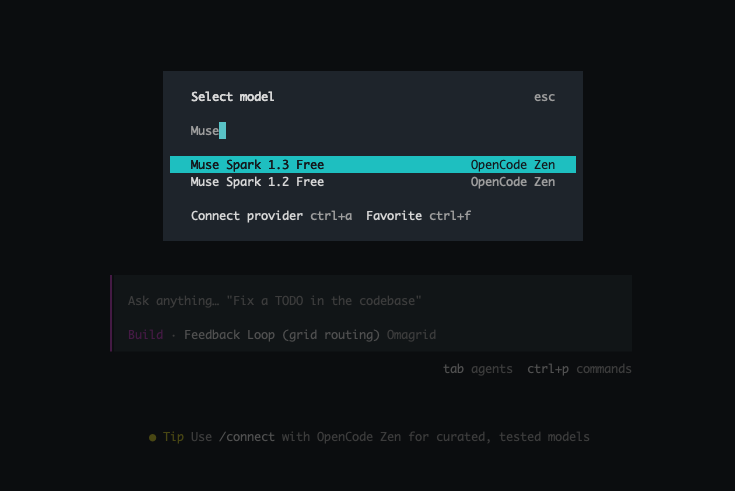
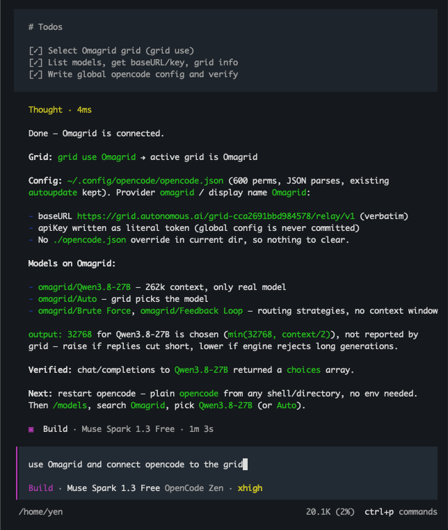
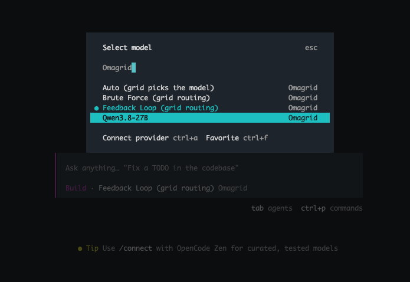
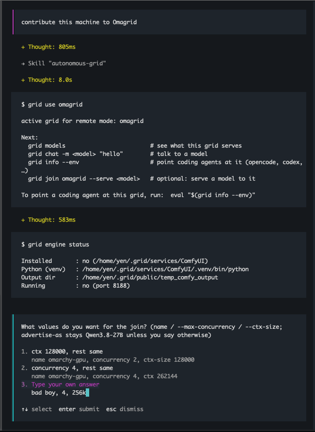
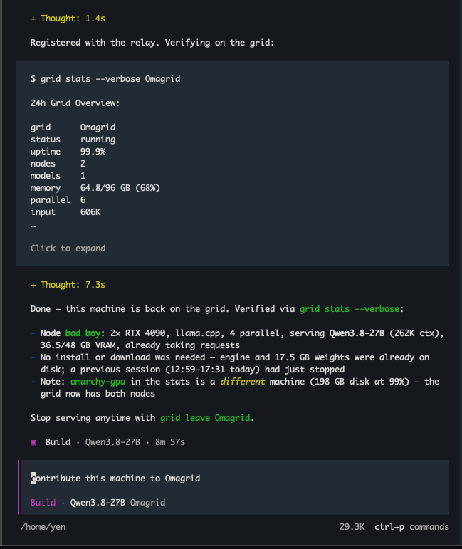
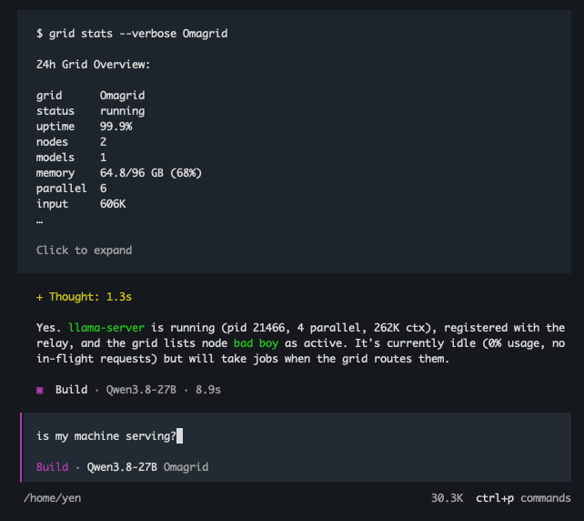
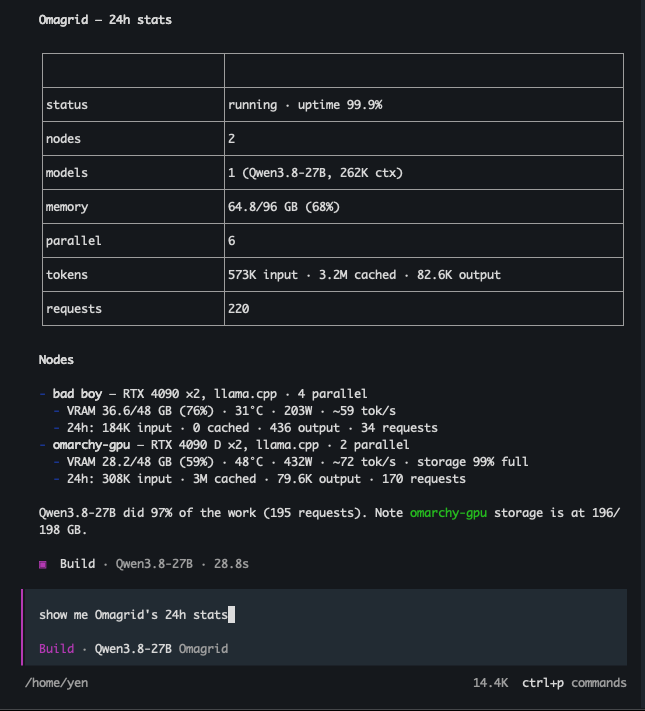
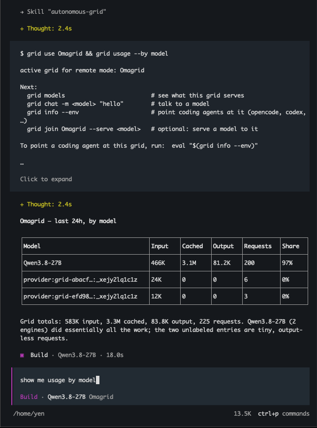
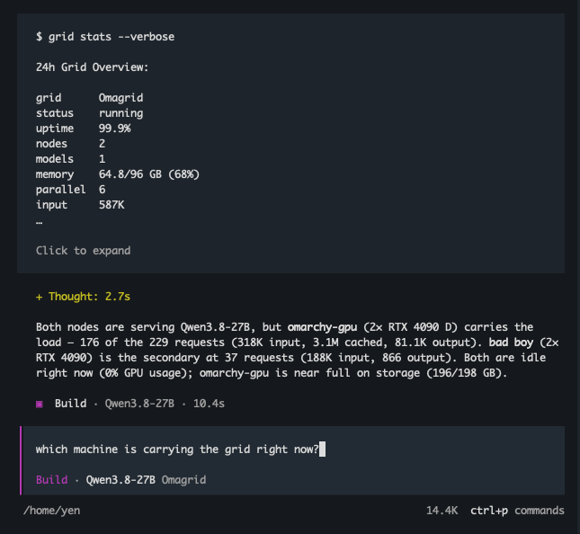
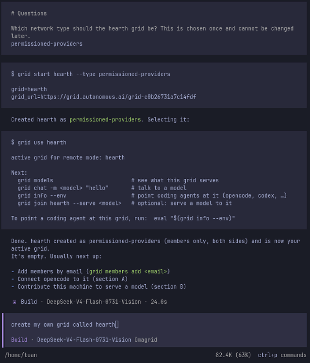

# Omagrid: An Omarchy-to-Omarchy AI Grid

## 1. Install Grid

```bash
curl -fsSL https://grid.autonomous.ai/install.sh | bash
grid login --no-browser
```

Login prints a URL and a code. Open the URL, log in, and type the code. This is the only step
you do by hand — everything after it you ask OpenCode for.

## 2. Use OpenCode to set up

Start OpenCode from any directory:

```bash
opencode
```

First pick the model that will do the setup. Type `/models`, search `Muse`, and choose
**Muse Spark 1.3 Free**:



It is free, and it handles the two prompts below — reading a page, writing a skill, editing a
config file without stumbling. You switch to an Omagrid model in step 3.

Then paste these two prompts, one at a time:

```text
read https://github.com/autonomous-ai/autonomous-grid/blob/main/docs/opencode.txt and create a skill for it
```

```text
use Omagrid and connect opencode to the grid
```

The first teaches OpenCode the `grid` CLI. The second picks Omagrid as your grid, reads its
model list, and writes an Omagrid provider into your global OpenCode config at
`~/.config/opencode/opencode.json`. Nothing is written to the project you're in.



Restart OpenCode.

## 3. Pick a model

Now switch off Muse Spark and onto the grid. Type `/models`, search `Omagrid`, and pick
`Qwen3.8-27B` or any other model Omagrid serves.



`Auto`, `Brute Force` and `Feedback Loop` are not models — they let the grid choose one for
you.

Start chatting. Every request now runs on Omagrid machines.

## 4. Power Omagrid

Everything so far uses the grid. This step adds to it: your machine runs a model that everyone
on Omagrid can call. More Omarchy machines, more models.

Ask OpenCode:

```text
contribute this machine to Omagrid
```

It picks a model your machine can run, installs the engine, downloads the model, and joins it
to the grid. The first time on a machine the download is a few gigabytes and takes a while —
OpenCode tells you the size before it starts. If the engine and model are already on disk, it
skips straight to joining.

Say what you want and it will follow:

- **"use a smaller model, I'm still working on this machine"** — leaves memory free for you.
- **"take only 2 requests at a time"** — how busy your machine gets.
- **"give it a 128k context window"** — how much each request can read.





And afterwards:

- **"is my machine serving?"** — it shows up by name, with what it has served so far.



- **"stop serving"** — leaves the grid. The model stays downloaded, so joining again is
  quick.

Under the hood these are `grid engine install`, `grid pull`, `grid join --serve …`,
`grid stats --verbose`, and `grid leave`.

## 5. Ask OpenCode about the grid

With the skill loaded, OpenCode can operate the grid for you in plain English. The answers
come back read, not pasted.

**"show me the grid's 24h stats"** — uptime, memory pool, and a card per machine.



**"show me usage by model"** — which models did the work. Also by member or by engine.



**"which machine is carrying the grid right now?"** — a comparison and a verdict, including
anything worth watching.



Under the hood these are `grid stats --verbose` and `grid usage --by …`. You can run them
yourself any time.

## 6. Create your own grid

Omagrid is a grid you joined. The same machinery spins up one that is yours — your machines,
your members, your models — and OpenCode drives it exactly the same way.

Ask OpenCode:

```text
create my own grid called <name>
```

Pick any name; that is how you call it from here on. Before it creates anything, OpenCode asks
which kind of grid you want:

- **permissioned-public** — anyone signed in can send it requests, and the members you add bring
  the machines.
- **permissioned-providers** — membership covers both jobs.

Answer it there, or put the answer in the prompt itself — **"create my own grid called <name>,
providers-only"** — and it goes straight through. Worth a moment either way: the type is set at
creation and stays.



Then fill it:

```text
add teammate@example.com to my grid
```

```text
contribute this machine to <name>
```

The first invites someone by email — add **"as a consumer"** or **"as a provider"** to hand them
just that half. The second is step 4 again, aimed at your own grid: same model, same engine on
disk. Your machine happily serves both grids at once.

Point any other client at it with **"print my grid's endpoint and key"** — OpenAI-compatible,
same as Omagrid.

**"switch back to Omagrid"** moves where your own requests go. Everything your machine serves
keeps serving.

**Made one by mistake?** Say **"delete my grid <name>"**. It stops the grid first, then asks you
to type the name back before it removes it — the one step here that stays done. A grid you joined
rather than created stays put; that one is **"stop serving <name>"**.

Under the hood these are `grid mode remote`, `grid start <name> [--type …]`, `grid members add
<email> --role …`, `grid join <name> --serve …`, `grid info --env`, `grid use <name>`, and
`grid stop <name>` + `grid delete <name>`.

## Where to go next

- **Using another client?** Omagrid is an OpenAI-compatible endpoint. `grid info --env` prints
  the `OPENAI_BASE_URL` and `OPENAI_API_KEY` for it.
- [CLI reference](./cli.md) for every command OpenCode is running on your behalf.
- [Claude Code quickstart](./claude-code-quickstart.md) and [Codex quickstart](./codex-quickstart.md)
  to point other agents at the same grid.
