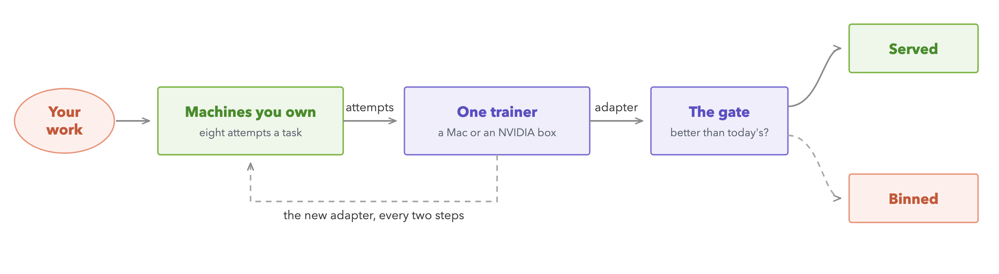
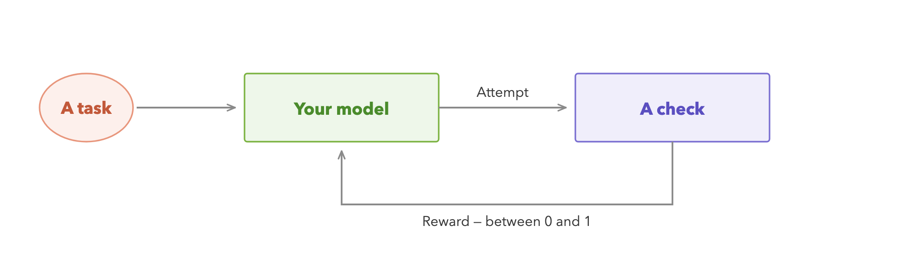
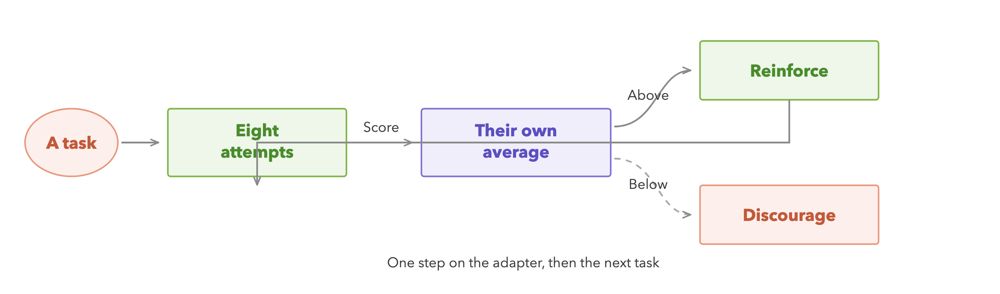
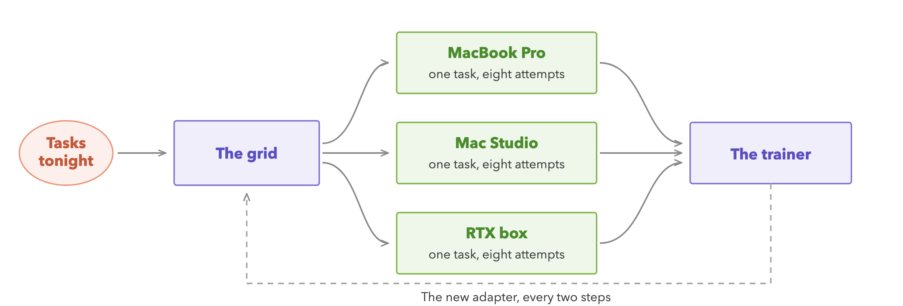
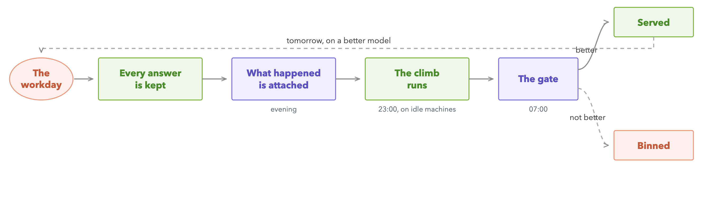
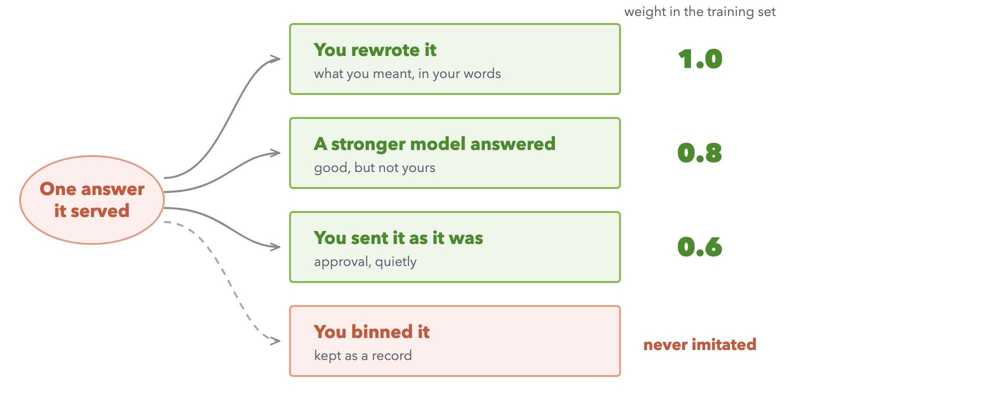

# `train/` — the training plane

Grid pools your computers to **run** models. This package pools them to **improve** one: a small
model taught your work, on machines you own, with the data, the attempts and the weights never
leaving your network.

The whole idea in one sentence: **reinforcement learning is about 75% sampling, sampling is
inference, and inference is what a grid already does.** The expensive part of training is work
your fleet is already good at; the only new thing is one machine that adjusts weights.

<p align="center">

</p>

---

## 1. What reinforcement learning actually is

Start with the diagram from Sutton & Barto. An *agent* takes an *action*, the *environment* answers
with a new *state* and a *reward*, and the agent adjusts. A control loop with a scoreboard.

Is it still the right picture for language models? **Yes — the loop is unchanged.** Three things
collapse, and knowing which three is most of the intuition.

<p align="center">

</p>

**1 — The episode is short.** Classic RL imagines a long trajectory: move, observe, move again. For
most business tasks there is one state (the prompt) and one action (the whole answer), and reward
arrives once. Long trajectories return the moment agents use tools, which is why the design leaves
room for them.

**2 — The environment is your data plus a check.** There is no simulator to build. The environment
is a ticket from last month and how it actually resolved; a lead and whether it closed; a code
change and whether the tests pass. *Whether you have a check is the whole question.*

**3 — No critic.** Textbook actor–critic trains a second network to estimate how good a situation
is. GRPO — the algorithm here — throws that away: it samples *several* attempts at the same task
and uses their own average as the bar. Cheaper, simpler, and the direct reason this fits on
consumer hardware.

## 2. One training step, exactly

<p align="center">

</p>

Note what is absent: **no labelled right answer is needed, only a way to score an attempt.** That
is why RL reaches jobs where nobody wrote down the ideal output — and why the grader, not the
maths, is the hard part of the product.

## 3. How the work spreads across the office

Count the compute in that step: writing eight attempts runs the model eight times; adjusting the
weights happens once. Profiling across the field puts sampling at **70–82% of the total** — and
sampling is plain inference, which a grid already spreads across machines.

**Every machine below is one you own — training is local by design.** A grid can also hold
frontier API nodes, and for *serving* answers that mix is often right (easy work local, hard work
to a vendor). But those nodes cannot train: no vendor returns what a gradient needs, you cannot own
an improvement to a model you rent, and renting compute by the hour is the expensive way to do the
one job idle office hardware suits perfectly.

<p align="center">

</p>

Two facts make this work on ordinary hardware: attempts are **independent**, so they fan out
perfectly; and what travels between machines is a small add-on layer, tens of megabytes, not a
model. A laptop that sleeps mid-run is skipped, never fatal.

Without that dashed line, the workers keep sampling the **original** model, the reward curve
flattens, and the run silently learns nothing. We shipped exactly that bug and measured it — see
the table below.

## 4. Day and night

The two halves want the same machines at different hours. People need inference while they work;
training wants sustained capacity and nobody's lap getting hot. A scheduling gift, not a conflict.

<p align="center">

</p>

**Cadence is set by the slowest arrow, and that is *attach truth*:** whether a support reply worked
is known hours or days later, not minutes. So nightly is the honest ceiling — and by industry
standards that is fast. Two guardrails are load-bearing: **the gate** (nothing serves customers
until it beats the incumbent on held-back work) and **the source of truth** (reward comes from the
world — a resolved ticket, a passing test — never from the model marking its own homework, which
drifts and collapses).

### What "prove it" has to be careful about

The gate is one comparison, and it is easy to make it lie to yourself in ways that leave every
test green. Three of them were real defects in this code, found and fixed on 26 July, and each is
worth knowing about if you build one of these:

* **The held-out set has to be the rows the trainer never saw.** Ours shuffled to choose what to
  withhold and then sliced the original list to choose what to train on — 8 of every 10 "unseen"
  prompts had been trained on. One split, both halves, and a test that asserts the two sets are
  disjoint.
* **Score the candidate, not the name.** A serving node resolves a model name to whatever weights
  it already holds, so asking it for "support-replies" right after training a new adapter scores
  *last night's* model. The candidate is loaded under a staging name, scored there, and only then
  takes the serving name.
* **A grader with no answer key returns a neutral score — for both models.** That is not a safe
  default; it is a silent ceiling where the gate can only ever say "no meaningful gain". Either
  give the grader tonight's references, or judge on a slice that has them.

None of these makes a run crash. They make it *mean* something else.

## 5. What we measured

One CPU-only Intel iMac — no GPU at all — SmolLM2-135M, and the word-reversal task from the test
suite. Score is on **held-out work the model never trained on**, re-measured every ten steps.
"Two machines" means the trainer and the rollout engine in separate processes over HTTP.

| Topology | Adapter pushed | Steps | Held-out score | Time | Verdict |
|---|---|---|---|---|---|
| one machine | — | 60 | 0.220 → 0.674 | 5.6 min | passed |
| **two machines** | **every 2 steps** | 60 | 0.188 → **0.768** | 6.1 min | **passed** |
| two machines | every 5 steps | 40 | 0.188 → 0.261 | 5.2 min | under the bar |
| two machines | **never** | 30 | 0.188 → 0.188 | 3.6 min | learned nothing |

Three things follow. **Splitting the work costs nothing** — the two-machine run finished ahead.
**Push cadence is the dial:** the same topology learned roughly eight times less per step at a
five-step cadence. **And the last row is the lesson:** with no push at all the line is perfectly
flat, which is what a broken training loop looks like from outside.

### Apple Silicon — run at last, and the four defects it was hiding

Every number in the table above came from torch on an Intel iMac. The MLX path had never been
run by anyone, which `docs/start-on-a-mac.md` said in as many words. It has now been run, on an
**M2 Max (64 GB), mlx-lm 0.31.3, Python 3.12** — and the first attempt did something worse than
fail flat: it **inverted the model**, 0.705 → 0.017, with every test in the repo still green.

The runs below are from that M2 Max, at the defaults each file now ships, so a bare
`python -m train.mlx.grpo_hello` reproduces them. Both rows are the same machine — the torch
row is its CPU, and is a *different machine* from the Intel iMac in the table above, so the two
torch numbers are not a before/after of anything.

| Backend | Steps | Held-out score (seeds 17 · 5 · 99) | Time | Verdict |
|---|---|---|---|---|
| torch · M2 Max CPU | 60 | 0.220 → 0.736 | 3.5 min | passed |
| **MLX · M2 Max GPU** | 60 | 0.225 → **0.527** · 0.222 → 0.687 · 0.255 → 0.764 | **~1 min** | **passed** |

Four defects, none of which crashed anything:

* **The LoRA scale was 10× the torch twin's.** mlx-lm multiplies the adapter branch by `scale`
  directly; peft multiplies by `lora_alpha / r`. The torch side sets `lora_alpha = 2 * rank` —
  an effective 2.0 — and the MLX side hardcoded **20.0**, which is mlx-lm's own example value.
  `adapters.py` had the relationship written down correctly the whole time; the trainer just
  didn't use it. Changing that one flag and nothing else, same seed and model: **0.225 → 0.527
  at scale 2.0, and 0.225 → 0.000 at 20.0.** Lowering the learning rate ten-fold also removes
  the collapse — the two knobs largely trade off — but only one of them is a *correctness*
  requirement: an adapter has to mean the same thing on both backends, or a mixed fleet serves
  a different model than it trained.
* **The saved adapter disagreed with the run that produced it.** `adapter_config.json` is what
  mlx-lm rebuilds the LoRA layers from when serving, and it was written with a hardcoded
  `scale: 20.0` regardless of training. Loading a *correctly* trained adapter through that
  config scored **0.007 — below the untrained model.** Fixing the trainer alone would have
  moved the same 10× fault out of the loop and into the artifact, where `grid train serve`,
  `deploy.py` and `sync.py` all consume it. The config now records what training actually used,
  and a saved adapter reloads to its exact trained score.
* **The two "twins" measured different tasks.** torch reverses 3–4 words; MLX took the module
  default of 3–**6**, a materially harder job, and the two sets of numbers were read as though
  they were comparable. Step count, sampling cap and eval-set size disagreed too.
* **The starting model had no room to climb.** Qwen2.5-0.5B-Instruct-4bit scores ~0.84 untrained
  on the 3–4 word task (0.705 on the harder 3–6 word one it was actually being run against). A
  smoke test that starts near the ceiling cannot show a climb however well the loop works — so
  the default is now the same weak SmolLM2-135M the torch twin uses, where the gap between
  working and broken is impossible to miss.

The honest lesson is the one this section already draws about the flat line: **a training run
fails quietly.** All four left the suite green, and the single number that would have exposed
them on sight — the step-0 baseline — was printed to the terminal and never written to
`log.jsonl`. Both twins write it there now, as the file's first line.

## Try it

Nothing here needs a GPU, a key, or an account. The first command is a complete training run.

```bash
python -m train.torch_grpo_hello     # any machine — CPU is fine, ~6 minutes
python -m train.mlx.grpo_hello       # the same task and model, on Apple Silicon in ~1 minute

grid train where                     # which grids training can use (LAN and hosted)
grid train ui                        # watch the curves → http://127.0.0.1:8321
grid train serve                     # turn this Mac into a rollout worker
grid train packs                     # start from your own data
grid train init --pack sales-triage
```

**Not an engineer?** `grid train web` is the same engine with five steps and none of the
vocabulary: upload an export, tick what a good answer looks like, pick machines, watch the curve,
and see a before/after card with a button that only appears if the model actually won. It writes
the same `grid-train.toml` the CLI reads, so the two surfaces can't drift apart.

**Every night, unattended:** `grid train nightly` runs one cycle — idle check, train, prove it on
held-out work, ship it only if it won — and appends the outcome to a history file. `grid train
schedule on` puts it in the computer's own scheduler, so the office trains itself while it sleeps:

```bash
grid train schedule on --at 23:00   # a LaunchAgent on macOS, a systemd --user timer on Linux
grid train schedule                 # is it on, where, and at what time
grid train schedule off             # deletes the file it wrote; nothing else changes
```

Per-user, no administrator, and reversible by the same command. The scheduled job runs with no
PATH and no shell profile, which is why it is written with an absolute interpreter and an absolute
working directory. Its output goes to `autopilot.log` beside the model. Anywhere without a
per-user scheduler, the command prints the cron line instead of pretending it installed one.

**Already in a helpdesk?** `grid train pull` fetches the examples instead of asking someone to
export them — for whoever administers the tool, on a schedule if they like:

```bash
export ZENDESK_API_TOKEN=…      # never written to disk, never printed
grid train pull zendesk --subdomain acme --email me@acme.com
grid train pull hubspot         # deals + their stage: the answer key for lead triage
```

It writes raw rows to a JSONL, which then goes through exactly the same preparation, column
guessing and refusals as an uploaded file — one code path decides whether data is trainable.

## It can also learn from the work it is already doing

Everything above assumes someone exports a file and starts a run. The end state is that nobody
has to: a business runs its grid, and its models get better on their own.

<p align="center">

</p>

The rule that keeps this honest is the last row: **a model's own unjudged output is stored
but never trained on.** Imitating your own guesses is how a model drifts, so an example has to earn
its place — a human's correction outranks a stronger model's answer, which outranks "nobody
complained". Three signals, none of which costs anyone a minute of work.

```bash
grid train collect --on          # keep the work; local files only, redacted, pruned
grid train autopilot             # one unattended cycle
grid train schedule on           # ...and have the computer run it every night
grid train collect               # what has accumulated, in plain language
```

**Whose examples are whose.** The store is grid-wide, so a night takes only the traffic that asked
for *this* model by name. Requests your team sent to a **stronger** model are the exception: the
store records the model that was asked for, and that was the frontier one, so nothing says which of
your models a teacher answer belongs to. They are shared with every model that trains — which is
exactly right on a grid with one model, and is how the local model catches up to the frontier — and
`[data].learn_from_teachers = false` turns that off for a model whose job is different.

Apps report the third signal by quoting back the `X-Grid-Request-Id` header they got with an
answer:

```bash
curl $GRID/v1/feedback -d '{"request_id":"…","verdict":"edited","final_text":"what we really sent"}'
```

## The code

```
train/
├── hello_task.py          the smoke task: word reversal, its reward, group advantages (pure Python)
├── torch_grpo_hello.py    hello world on torch — CUDA or CPU; --rollout-url pools remote workers
├── mlx/
│   ├── grpo_hello.py      hello world on Apple Silicon (clean-room GRPO on mlx-lm)
│   └── rollout_server.py  serves the training contract from MLX  → `grid train serve`
├── rollout.py             THE CONTRACT: sampled token ids + logprobs, fail-closed probe
├── sync.py                push the adapter to the rollout nodes (skips a sleeping laptop)
├── adapters.py            exact peft ↔ MLX LoRA conversion for mixed fleets
├── config.py              grid-train.toml — the run's knobs and its record
├── rewards.py             graders: a Python file of reward_* functions, or a verifiers env
├── run.py                 the run: TRL GRPO + held-out split + the weight-sync callback
├── evaluate.py            the gate: score incumbent vs candidate, write the eval card
├── deploy.py              hot-load an adapter onto serving nodes
├── ui.py                  read-only dashboard of runs and their curves
├── capture.py             learn from served work: store, redact, prune, weigh, build a dataset
├── autopilot.py           the unattended loop over captured work
├── schedule.py            put that loop in the user's own scheduler (launchd / systemd --user)
├── connectors.py          pull examples from Zendesk / HubSpot (env-var tokens, never stored)
├── nightly.py             one unattended cycle: idle check → train → prove → ship or bin
├── sft.py                 stage one — imitate the answers your team already wrote
├── hostsignals.py         mains power + keyboard idle — the host outranks the scheduler
├── endpoints.py           find the grid in either mode (LAN or hosted relay)
├── packs/                 business-data starting points (config + prep + graders + samples)
│   ├── support_replies/    tickets → drafted replies (imitate first, then sharpen)
│   └── sales_triage/       leads → priority, checked against what actually closed
└── web/                   the browser interface for people who don't use a terminal
    ├── machines.py         what this computer can finish; the choices, without a URL in sight
    ├── playground.py       ask your model and today's model the same thing
    ├── prepare.py          whatever came out of Zendesk/HubSpot → tasks + an honest report
    └── jobs.py             run lifecycle: honest states, ETA, phase
```

The CLI verbs live in `cli/train.py`. Design decisions and the honest limits are in
[`docs/adr/0019-rl-training-plane.md`](../docs/adr/0019-rl-training-plane.md); the first-model
walkthrough on one Mac is [`docs/start-on-a-mac.md`](../docs/start-on-a-mac.md); the two-machine
version is [`docs/two-node-training.md`](../docs/two-node-training.md); how inference routing
relates to all this is [`docs/topologies.md`](../docs/topologies.md).

Heavy dependencies (torch, TRL, peft) live behind `pip install 'grid[train]'` and are imported
lazily, so the rest of the CLI — and every test in this repo — runs without them.

## Not built yet

Said plainly, because this branch is open and someone will look.

- **Half of §4's first two stations is real; the other half is not, and the difference matters.**
  *Turning live requests into tasks* is built — `train/capture.py` keeps every served exchange
  locally, and `grid train autopilot` + `grid train schedule on` turn that into a nightly cycle
  nobody starts by hand. *Joining real outcomes to them* is built only for the outcome a **person**
  reports: an app quotes back `X-Grid-Request-Id` to `POST /v1/feedback` and says the human edited,
  sent or discarded the answer. What is still a design is the join to the **system of record** —
  the helpdesk knowing the ticket was solved and never reopened, the CRM knowing the deal closed.
  Until that exists, a business gets continuous learning only where its app reports verdicts, and
  the honest description of the rest is "nightly training on captured work", not "self-reinforcing".
- **Training attempts still need vLLM or our MLX server.** Ollama and llama.cpp nodes serve
  inference, judging and evaluation fine, but not training attempts — they don't return the tokens
  they sampled. A per-engine shim is deliberately deferred.
- **One security fix gates the release, not the branch.** On a local grid, node registration is
  unauthenticated; once trained weights move between machines that is a way to poison them.
