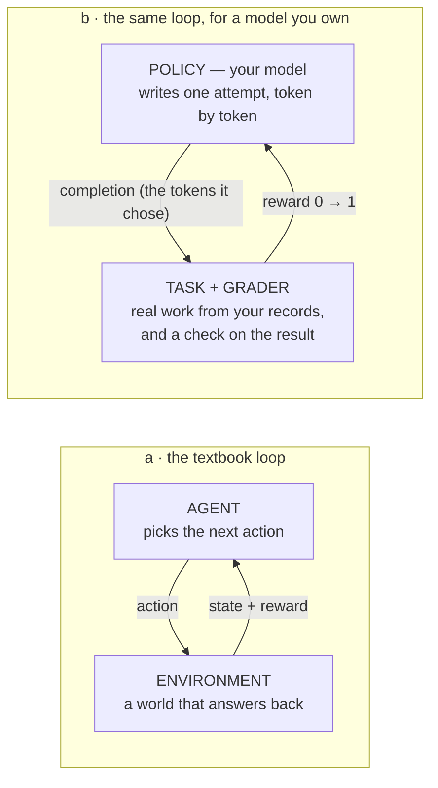
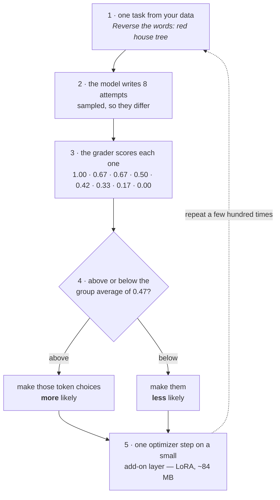
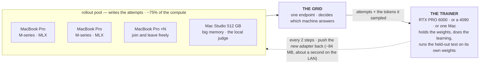
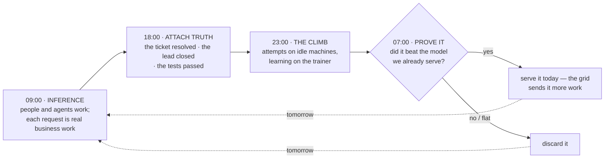

# `train/` — the training plane

Grid pools your computers to **run** models. This package pools them to **improve** one: a small
model taught your work, on machines you own, with the data, the attempts and the weights never
leaving your network.

The whole idea in one sentence: **reinforcement learning is about 75% sampling, sampling is
inference, and inference is what a grid already does.** The expensive part of training is work
your fleet is already good at; the only new thing is one machine that adjusts weights.

> A designed version of this explainer, with proper figures and the real measured curves:
> **https://claude.ai/code/artifact/b7acee0f-029f-442b-b50d-3427b14c6342**

---

## 1. What reinforcement learning actually is

Start with the diagram from Sutton & Barto. An *agent* takes an *action*, the *environment* answers
with a new *state* and a *reward*, and the agent adjusts. A control loop with a scoreboard.

Is it still the right picture for language models? **Yes — the loop is unchanged.** Three things
collapse, and knowing which three is most of the intuition.



**1 — The episode is short.** Classic RL imagines a long trajectory: move, observe, move again. For
most business tasks there is one state (the prompt) and one action (the whole answer), and reward
arrives once. Long trajectories return the moment agents use tools, which is why the design leaves
room for them.

**2 — The environment is your data plus a check.** There is no simulator to build. The environment
is a ticket from last month and how it actually resolved; a lead and whether it closed; a code
change and whether the tests pass. *Whether you have a check is the whole question.*

**3 — No critic.** Textbook actor–critic trains a second network to estimate how good a situation
is. GRPO — the algorithm here — throws that away: it samples *several* attempts at the same task
and uses their own average as the bar. Cheaper, simpler, and the direct reason this fits on
consumer hardware.

## 2. One training step, exactly



Note what is absent: **no labelled right answer is needed, only a way to score an attempt.** That
is why RL reaches jobs where nobody wrote down the ideal output — and why the grader, not the
maths, is the hard part of the product.

## 3. How the work spreads across the office

Count the compute in that step: writing eight attempts runs the model eight times; adjusting the
weights happens once. Profiling across the field puts sampling at **70–82% of the total** — and
sampling is plain inference, which a grid already spreads across machines.

**Every machine below is one you own — training is local by design.** A grid can also hold
frontier API nodes, and for *serving* answers that mix is often right (easy work local, hard work
to a vendor). But those nodes cannot train: no vendor returns what a gradient needs, you cannot own
an improvement to a model you rent, and renting compute by the hour is the expensive way to do the
one job idle office hardware suits perfectly.



Two facts make this work on ordinary hardware: attempts are **independent**, so they fan out
perfectly; and what travels between machines is a small add-on layer, tens of megabytes, not a
model. A laptop that sleeps mid-run is skipped, never fatal.

Without that dashed line, the workers keep sampling the **original** model, the reward curve
flattens, and the run silently learns nothing. We shipped exactly that bug and measured it — see
the table below.

## 4. Day and night

The two halves want the same machines at different hours. People need inference while they work;
training wants sustained capacity and nobody's lap getting hot. A scheduling gift, not a conflict.



**Cadence is set by the slowest arrow, and that is *attach truth*:** whether a support reply worked
is known hours or days later, not minutes. So nightly is the honest ceiling — and by industry
standards that is fast. Two guardrails are load-bearing: **the gate** (nothing serves customers
until it beats the incumbent on held-back work) and **the source of truth** (reward comes from the
world — a resolved ticket, a passing test — never from the model marking its own homework, which
drifts and collapses).

## 5. What we measured

One CPU-only Intel iMac — no GPU at all — SmolLM2-135M, and the word-reversal task from the test
suite. Score is on **held-out work the model never trained on**, re-measured every ten steps.
"Two machines" means the trainer and the rollout engine in separate processes over HTTP.

| Topology | Adapter pushed | Steps | Held-out score | Time | Verdict |
|---|---|---|---|---|---|
| one machine | — | 60 | 0.220 → 0.674 | 5.6 min | passed |
| **two machines** | **every 2 steps** | 60 | 0.188 → **0.768** | 6.1 min | **passed** |
| two machines | every 5 steps | 40 | 0.188 → 0.261 | 5.2 min | under the bar |
| two machines | **never** | 30 | 0.188 → 0.188 | 3.6 min | learned nothing |

Three things follow. **Splitting the work costs nothing** — the two-machine run finished ahead.
**Push cadence is the dial:** the same topology learned roughly eight times less per step at a
five-step cadence. **And the last row is the lesson:** with no push at all the line is perfectly
flat, which is what a broken training loop looks like from outside.

## Try it

Nothing here needs a GPU, a key, or an account. The first command is a complete training run.

```bash
python -m train.torch_grpo_hello     # any machine — CPU is fine, ~6 minutes
python -m train.mlx.grpo_hello       # the same, natively on Apple Silicon (pip install mlx-lm)

grid train ui                        # watch the curves → http://127.0.0.1:8321
grid train serve                     # turn this Mac into a rollout worker
grid train packs                     # start from your own data
grid train init --pack sales-triage
```

## The code

```
train/
├── hello_task.py          the smoke task: word reversal, its reward, group advantages (pure Python)
├── torch_grpo_hello.py    hello world on torch — CUDA or CPU; --rollout-url pools remote workers
├── mlx/
│   ├── grpo_hello.py      hello world on Apple Silicon (clean-room GRPO on mlx-lm)
│   └── rollout_server.py  serves the training contract from MLX  → `grid train serve`
├── rollout.py             THE CONTRACT: sampled token ids + logprobs, fail-closed probe
├── sync.py                push the adapter to the rollout nodes (skips a sleeping laptop)
├── adapters.py            exact peft ↔ MLX LoRA conversion for mixed fleets
├── config.py              grid-train.toml — the run's knobs and its record
├── rewards.py             graders: a Python file of reward_* functions, or a verifiers env
├── run.py                 the run: TRL GRPO + held-out split + the weight-sync callback
├── evaluate.py            the gate: score incumbent vs candidate, write the eval card
├── deploy.py              hot-load an adapter onto serving nodes
├── ui.py                  read-only dashboard of runs and their curves
├── packs/                 business-data starting points (config + prep + graders + samples)
│   ├── support_replies/    tickets → drafted replies (imitate first, then sharpen)
│   └── sales_triage/       leads → priority, checked against what actually closed
└── web/                   the browser interface for people who don't use a terminal
```

The CLI verbs live in `cli/train.py`. Design decisions and the honest limits are in
[`docs/adr/0019-rl-training-plane.md`](../docs/adr/0019-rl-training-plane.md); the two-machine
walkthrough is [`docs/two-node-training.md`](../docs/two-node-training.md); how inference routing
relates to all this is [`docs/topologies.md`](../docs/topologies.md).

Heavy dependencies (torch, TRL, peft) live behind `pip install 'grid[train]'` and are imported
lazily, so the rest of the CLI — and every test in this repo — runs without them.

## Not built yet

Said plainly, because this branch is open and someone will look.

- **The gate exists; deployment is not yet wired to refuse on its own.** `grid train eval` and
  `grid train deploy --gate` are in; the nightly path that runs them unattended is next.
- **Nothing captures traffic yet.** The first two stations of §4 are a design: turning live grid
  requests into tasks, and joining real outcomes to them, is what makes the loop continuous
  rather than a run you launch by hand.
- **Training attempts still need vLLM or our MLX server.** Ollama and llama.cpp nodes serve
  inference, judging and evaluation fine, but not training attempts — they don't return the tokens
  they sampled. A per-engine shim is deliberately deferred.
- **One security fix gates the release, not the branch.** On a local grid, node registration is
  unauthenticated; once trained weights move between machines that is a way to poison them.
